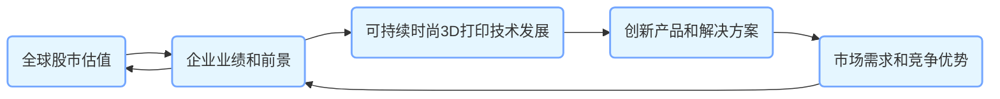

# 全球股市估值与可持续时尚3D打印技术的关联

> 关键词：全球股市估值、可持续时尚、3D打印技术、市场趋势、产业发展、经济影响、技术创新

> 摘要：本文旨在深入探讨全球股市估值与可持续时尚3D打印技术之间的关联。通过对全球股市估值的基本原理、影响因素的分析，以及对可持续时尚3D打印技术的核心概念、发展现状和应用前景的研究，揭示两者之间相互影响、相互促进的关系。文中详细阐述了相关的核心算法原理、数学模型和公式，并结合项目实战案例进行了深入解读。同时，探讨了该关联在实际应用场景中的表现，推荐了相关的学习资源、开发工具框架和论文著作。最后，总结了未来发展趋势与挑战，为相关领域的研究和实践提供参考。

## 1. 背景介绍 
### 1.1 目的和范围
本研究的主要目的是全面探究全球股市估值与可持续时尚3D打印技术之间的内在联系。通过对这两个看似不同领域的深入分析，揭示它们在经济、技术和市场层面的相互作用机制。研究范围涵盖了全球股市的主要板块和市场，以及可持续时尚3D打印技术的各个方面，包括技术原理、产业发展、市场应用等。

### 1.2 预期读者
本文预期读者包括金融领域的投资者、分析师、研究员，时尚产业的从业者、设计师、企业管理者，以及对新兴技术和跨领域研究感兴趣的学者、学生和专业人士。

### 1.3 文档结构概述
本文将按照以下结构进行阐述：首先介绍全球股市估值和可持续时尚3D打印技术的背景和相关概念；接着详细讲解核心算法原理、数学模型和公式；然后通过项目实战案例进行具体分析；之后探讨该关联在实际应用场景中的表现；推荐相关的学习资源、开发工具框架和论文著作；最后总结未来发展趋势与挑战，并提供常见问题解答和参考资料。

### 1.4 术语表
#### 1.4.1 核心术语定义
- **全球股市估值**：指对全球范围内股票市场中上市公司价值的评估，通常通过各种估值方法和指标来确定股票的合理价格。
- **可持续时尚**：强调在时尚产业的各个环节中，考虑环境、社会和经济的可持续性，采用环保材料、可持续生产方式和公平贸易原则。
- **3D打印技术**：一种快速成型技术，通过逐层堆积材料来制造三维物体，也被称为增材制造技术。

#### 1.4.2 相关概念解释
- **股市估值方法**：常见的有市盈率法、市净率法、现金流折现法等，用于评估股票的投资价值。
- **可持续发展**：满足当代人的需求，而不损害后代人满足其自身需求的能力。
- **3D打印材料**：包括塑料、金属、陶瓷、生物材料等，不同材料具有不同的性能和应用场景。

#### 1.4.3 缩略词列表
- **PE**：市盈率（Price - Earnings Ratio）
- **PB**：市净率（Price - Book Ratio）
- **DCF**：现金流折现法（Discounted Cash Flow）
- **AM**：增材制造（Additive Manufacturing）

## 2. 核心概念与联系 

### 全球股市估值的核心概念
全球股市估值是金融市场中的重要环节，它反映了市场对上市公司未来盈利能力和发展前景的预期。股市估值的高低直接影响投资者的决策和资金流向。常见的估值指标包括市盈率（PE）、市净率（PB）等。市盈率是指股票价格与每股收益的比率，反映了投资者为获取每股收益所愿意支付的价格。市净率是指股票价格与每股净资产的比率，反映了股票的市场价值与账面价值的关系。

### 可持续时尚3D打印技术的核心概念
可持续时尚3D打印技术是将可持续发展理念与3D打印技术相结合的创新模式。在时尚产业中，3D打印技术可以实现个性化定制、快速成型和减少材料浪费，符合可持续发展的要求。通过3D打印技术，可以根据消费者的需求和身体尺寸定制服装、饰品等时尚产品，提高产品的贴合度和满意度。同时，3D打印技术可以精确控制材料的使用，减少废料的产生，降低对环境的影响。

### 两者之间的联系
全球股市估值与可持续时尚3D打印技术之间存在着多方面的联系。一方面，可持续时尚3D打印技术的发展会影响相关企业的业绩和前景，进而影响其在股市中的估值。如果一家企业在可持续时尚3D打印技术方面具有领先优势，能够推出创新的产品和解决方案，那么市场对其未来盈利能力的预期会提高，从而导致其股票估值上升。另一方面，股市估值的变化也会影响可持续时尚3D打印技术的发展。当股市估值上升时，企业可以获得更多的资金支持，用于研发和扩大生产，推动可持续时尚3D打印技术的进步。反之，当股市估值下降时，企业可能会面临资金压力，影响技术的研发和推广。

### 文本示意图
全球股市估值与可持续时尚3D打印技术的联系可以用以下文本示意图表示：

全球股市估值 <-- 企业业绩和前景 <-- 可持续时尚3D打印技术发展 --> 创新产品和解决方案 --> 市场需求和竞争优势 --> 企业业绩和前景 --> 全球股市估值

### Mermaid流程图


## 3. 核心算法原理 & 具体操作步骤 

### 全球股市估值算法原理
#### 市盈率法
市盈率法是一种常用的股市估值方法，其基本原理是通过比较股票的市盈率与同行业平均市盈率或市场整体市盈率，来判断股票的估值水平。计算公式为：

$PE = \frac{P}{EPS}$

其中，$PE$ 表示市盈率，$P$ 表示股票价格，$EPS$ 表示每股收益。

#### 市净率法
市净率法是通过比较股票的市净率与同行业平均市净率或市场整体市净率，来评估股票的估值。计算公式为：

$PB = \frac{P}{BVPS}$

其中，$PB$ 表示市净率，$P$ 表示股票价格，$BVPS$ 表示每股净资产。

#### Python代码实现
```python
# 市盈率法计算股票估值
def pe_valuation(price, eps, industry_pe):
    """
    :param price: 股票价格
    :param eps: 每股收益
    :param industry_pe: 同行业平均市盈率
    :return: 股票估值
    """
    pe = price / eps
    if pe < industry_pe:
        return "低估"
    elif pe > industry_pe:
        return "高估"
    else:
        return "合理"

# 市净率法计算股票估值
def pb_valuation(price, bvps, industry_pb):
    """
    :param price: 股票价格
    :param bvps: 每股净资产
    :param industry_pb: 同行业平均市净率
    :return: 股票估值
    """
    pb = price / bvps
    if pb < industry_pb:
        return "低估"
    elif pb > industry_pb:
        return "高估"
    else:
        return "合理"

# 示例数据
stock_price = 50
eps = 2
industry_pe = 20
bvps = 10
industry_pb = 3

# 计算估值
pe_result = pe_valuation(stock_price, eps, industry_pe)
pb_result = pb_valuation(stock_price, bvps, industry_pb)

print(f"市盈率法估值结果: {pe_result}")
print(f"市净率法估值结果: {pb_result}")
```

### 可持续时尚3D打印技术的相关算法
#### 材料优化算法
在可持续时尚3D打印中，材料优化算法的目标是在满足产品性能要求的前提下，最小化材料的使用量。一种简单的材料优化算法是基于拓扑优化的方法，通过对产品的结构进行分析，去除不必要的材料，从而减少材料浪费。

#### 路径规划算法
3D打印的路径规划算法用于确定打印头的运动轨迹，以实现高效、精确的打印。常见的路径规划算法包括分层算法、填充算法等。分层算法将三维模型分解为一系列二维切片，填充算法则确定每个切片的填充路径。

#### Python代码实现（简单的分层算法示例）
```python
import numpy as np

def slicing_algorithm(model, layer_height):
    """
    简单的分层算法示例
    :param model: 三维模型（假设为一个三维数组）
    :param layer_height: 层厚
    :return: 分层后的二维切片列表
    """
    z_max = model.shape[2]
    num_layers = int(z_max / layer_height)
    slices = []
    for i in range(num_layers):
        start_z = i * layer_height
        end_z = (i + 1) * layer_height
        slice_layer = model[:, :, start_z:end_z].max(axis=2)
        slices.append(slice_layer)
    return slices

# 示例三维模型
model = np.random.randint(0, 2, size=(100, 100, 50))
layer_height = 1
slices = slicing_algorithm(model, layer_height)
print(f"分层后的切片数量: {len(slices)}")
```

## 4. 数学模型和公式 & 详细讲解 & 举例说明 

### 全球股市估值的数学模型
#### 现金流折现模型（DCF）
现金流折现模型是一种基于企业未来现金流的估值方法，其基本原理是将企业未来的现金流折现到当前时刻，以确定企业的内在价值。计算公式为：

$$V = \sum_{t=1}^{n} \frac{CF_t}{(1 + r)^t} + \frac{TV}{(1 + r)^n}$$

其中，$V$ 表示企业的内在价值，$CF_t$ 表示第 $t$ 期的现金流，$r$ 表示折现率，$n$ 表示预测期数，$TV$ 表示终值。

#### 详细讲解
现金流折现模型的核心思想是考虑货币的时间价值，即未来的现金流在当前时刻的价值会低于其实际金额。折现率 $r$ 反映了投资者对投资风险的预期，风险越高，折现率越高。预测期数 $n$ 通常根据企业的发展阶段和行业特点来确定。终值 $TV$ 是指预测期结束后企业的价值，通常采用永续增长模型来计算：

$$TV = \frac{CF_{n+1}}{r - g}$$

其中，$CF_{n+1}$ 表示预测期结束后下一期的现金流，$g$ 表示永续增长率。

#### 举例说明
假设一家企业未来 5 年的现金流分别为 100 万元、120 万元、140 万元、160 万元、180 万元，折现率为 10%，永续增长率为 3%。则该企业的内在价值计算如下：

1. 计算前 5 年现金流的现值：
   - $PV_1 = \frac{100}{(1 + 0.1)^1} \approx 90.91$（万元）
   - $PV_2 = \frac{120}{(1 + 0.1)^2} \approx 99.17$（万元）
   - $PV_3 = \frac{140}{(1 + 0.1)^3} \approx 105.18$（万元）
   - $PV_4 = \frac{160}{(1 + 0.1)^4} \approx 109.29$（万元）
   - $PV_5 = \frac{180}{(1 + 0.1)^5} \approx 111.77$（万元）
2. 计算终值：
   - $CF_6 = 180 \times (1 + 0.03) = 185.4$（万元）
   - $TV = \frac{185.4}{0.1 - 0.03} \approx 2648.57$（万元）
   - $PV_{TV} = \frac{2648.57}{(1 + 0.1)^5} \approx 1639.47$（万元）
3. 计算企业的内在价值：
   - $V = PV_1 + PV_2 + PV_3 + PV_4 + PV_5 + PV_{TV} \approx 90.91 + 99.17 + 105.18 + 109.29 + 111.77 + 1639.47 = 2155.79$（万元）

### 可持续时尚3D打印技术的数学模型
#### 材料成本模型
在可持续时尚3D打印中，材料成本是一个重要的考虑因素。材料成本模型可以帮助企业优化材料使用，降低成本。假设打印一个产品需要使用 $n$ 种材料，每种材料的单价为 $p_i$，使用量为 $m_i$，则材料总成本 $C$ 可以表示为：

$$C = \sum_{i=1}^{n} p_i m_i$$

#### 详细讲解
材料成本模型的关键在于准确计算每种材料的使用量。这需要考虑产品的设计、打印工艺和材料特性等因素。通过优化产品设计和打印工艺，可以减少材料的使用量，从而降低材料成本。

#### 举例说明
假设打印一件时尚饰品需要使用两种材料：塑料和金属。塑料的单价为 10 元/千克，使用量为 0.1 千克；金属的单价为 50 元/千克，使用量为 0.05 千克。则该饰品的材料成本为：

$$C = 10 \times 0.1 + 50 \times 0.05 = 1 + 2.5 = 3.5$$（元）

## 5. 项目实战：代码实际案例和详细解释说明 

### 5.1  开发环境搭建
#### 全球股市估值分析环境
- **编程语言**：Python
- **开发工具**：PyCharm 或 Jupyter Notebook
- **数据获取库**：`pandas`、`yfinance`
- **数据分析库**：`numpy`、`matplotlib`

#### 可持续时尚3D打印技术模拟环境
- **编程语言**：Python
- **开发工具**：PyCharm 或 Jupyter Notebook
- **3D 建模库**：`numpy-stl`
- **路径规划库**：`shapely`

### 5.2  源代码详细实现和代码解读
#### 全球股市估值分析代码
```python
import yfinance as yf
import pandas as pd
import matplotlib.pyplot as plt

# 获取股票数据
def get_stock_data(ticker, start_date, end_date):
    stock = yf.Ticker(ticker)
    data = stock.history(start=start_date, end=end_date)
    return data

# 计算市盈率和市净率
def calculate_ratios(data, eps, bvps):
    data['PE'] = data['Close'] / eps
    data['PB'] = data['Close'] / bvps
    return data

# 绘制市盈率和市净率曲线
def plot_ratios(data):
    plt.figure(figsize=(12, 6))
    plt.subplot(2, 1, 1)
    plt.plot(data.index, data['PE'], label='PE')
    plt.title('Price - Earnings Ratio')
    plt.xlabel('Date')
    plt.ylabel('PE')
    plt.legend()

    plt.subplot(2, 1, 2)
    plt.plot(data.index, data['PB'], label='PB')
    plt.title('Price - Book Ratio')
    plt.xlabel('Date')
    plt.ylabel('PB')
    plt.legend()

    plt.tight_layout()
    plt.show()

# 示例数据
ticker = 'AAPL'
start_date = '2020-01-01'
end_date = '2023-01-01'
eps = 3.28
bvps = 35.67

# 获取数据
stock_data = get_stock_data(ticker, start_date, end_date)
# 计算比率
ratio_data = calculate_ratios(stock_data, eps, bvps)
# 绘制曲线
plot_ratios(ratio_data)
```

#### 代码解读
1. **获取股票数据**：使用 `yfinance` 库获取指定股票在指定日期范围内的历史数据。
2. **计算市盈率和市净率**：根据股票收盘价、每股收益和每股净资产计算市盈率和市净率。
3. **绘制曲线**：使用 `matplotlib` 库绘制市盈率和市净率随时间变化的曲线，以便直观观察股票估值的变化趋势。

#### 可持续时尚3D打印技术模拟代码
```python
import numpy as np
from stl import mesh
from shapely.geometry import Polygon

# 生成简单的 3D 模型
def create_3d_model():
    vertices = np.array([
        [0, 0, 0],
        [1, 0, 0],
        [1, 1, 0],
        [0, 1, 0],
        [0, 0, 1],
        [1, 0, 1],
        [1, 1, 1],
        [0, 1, 1]
    ])
    faces = np.array([
        [0, 3, 1],
        [1, 3, 2],
        [0, 4, 7],
        [0, 7, 3],
        [4, 5, 6],
        [4, 6, 7],
        [5, 1, 2],
        [5, 2, 6],
        [2, 3, 6],
        [3, 7, 6],
        [0, 1, 5],
        [0, 5, 4]
    ])
    cube = mesh.Mesh(np.zeros(faces.shape[0], dtype=mesh.Mesh.dtype))
    for i, f in enumerate(faces):
        for j in range(3):
            cube.vectors[i][j] = vertices[f[j], :]
    return cube

# 分层并进行路径规划
def slicing_and_path_planning(model, layer_height):
    z_max = model.vectors[:, :, 2].max()
    num_layers = int(z_max / layer_height)
    paths = []
    for i in range(num_layers):
        start_z = i * layer_height
        end_z = (i + 1) * layer_height
        slice_vertices = []
        for face in model.vectors:
            z_values = face[:, 2]
            if np.any((z_values >= start_z) & (z_values < end_z)):
                for vertex in face:
                    if vertex[2] >= start_z and vertex[2] < end_z:
                        slice_vertices.append(vertex[:2])
        if slice_vertices:
            polygon = Polygon(slice_vertices)
            paths.append(polygon)
    return paths

# 示例
model = create_3d_model()
layer_height = 0.1
paths = slicing_and_path_planning(model, layer_height)
print(f"生成的路径数量: {len(paths)}")
```

#### 代码解读
1. **生成简单的 3D 模型**：使用 `numpy` 和 `numpy-stl` 库创建一个简单的立方体 3D 模型。
2. **分层并进行路径规划**：将 3D 模型按指定层厚进行分层，提取每层的顶点信息，使用 `shapely` 库将顶点信息转换为多边形路径。

### 5.3  代码解读与分析
#### 全球股市估值分析代码分析
- **优点**：代码简单易懂，使用了常见的 Python 库，方便获取和处理股票数据。通过绘制市盈率和市净率曲线，可以直观地观察股票估值的变化趋势，为投资者提供参考。
- **缺点**：该代码假设每股收益和每股净资产在分析期间保持不变，实际情况中这些数据会随时间变化。此外，代码仅考虑了市盈率和市净率两种估值方法，没有考虑其他因素对股票估值的影响。

#### 可持续时尚3D打印技术模拟代码分析
- **优点**：代码实现了简单的 3D 模型生成和分层路径规划功能，有助于理解 3D 打印的基本原理。使用 `shapely` 库进行路径规划，提高了代码的效率和准确性。
- **缺点**：该代码生成的 3D 模型比较简单，实际应用中需要处理更复杂的模型。路径规划算法也比较基础，没有考虑打印速度、材料特性等因素。

## 6. 实际应用场景 
### 金融投资领域
在金融投资领域，全球股市估值与可持续时尚3D打印技术的关联为投资者提供了新的投资机会和策略。投资者可以关注那些在可持续时尚3D打印技术方面具有领先优势的企业，通过分析其技术实力、市场份额和发展前景，评估其股票的投资价值。例如，一些专注于可持续时尚3D打印材料研发的企业，如果其技术能够得到市场认可，可能会带来较高的投资回报。

### 时尚产业领域
在时尚产业领域，可持续时尚3D打印技术的发展可以推动产业的转型升级。通过3D打印技术，时尚企业可以实现个性化定制，满足消费者的多样化需求，提高产品的附加值。同时，3D打印技术可以减少材料浪费，降低生产成本，提高企业的经济效益。例如，一些时尚品牌开始尝试使用3D打印技术制作限量版的服装和饰品，吸引了众多消费者的关注。

### 环保领域
可持续时尚3D打印技术在环保领域也具有重要的应用价值。传统的时尚产业生产过程中会产生大量的废料和污染物，对环境造成严重影响。而3D打印技术可以精确控制材料的使用，减少废料的产生，降低对环境的污染。此外，3D打印技术还可以使用可回收材料进行打印，实现资源的循环利用，促进可持续发展。

## 7. 工具和资源推荐
### 7.1 学习资源推荐
#### 7.1.1 书籍推荐
- 《金融市场与金融机构基础》：全面介绍了金融市场和金融机构的基本概念、理论和实践，对于理解全球股市估值有很大帮助。
- 《3D打印：从想象到现实》：详细介绍了3D打印技术的原理、应用和发展趋势，是学习3D打印技术的经典书籍。
- 《可持续时尚：设计与创新》：探讨了可持续时尚的理念、设计方法和实践案例，为可持续时尚领域的研究和实践提供了参考。

#### 7.1.2 在线课程
- Coursera 上的“Financial Markets”：由耶鲁大学教授授课，系统讲解了金融市场的基本原理和投资策略。
- edX 上的“3D Printing and Additive Manufacturing”：介绍了3D打印技术的基础知识和应用案例，适合初学者学习。
- FutureLearn 上的“Fashion and Sustainability”：探讨了时尚产业与可持续发展的关系，提供了可持续时尚的实践方法和案例分析。

#### 7.1.3 技术博客和网站
- Seeking Alpha：提供全球股市的分析和评论，以及股票估值的相关文章和数据。
- 3D Printing Industry：专注于3D打印技术的新闻、趋势和应用案例，是了解3D打印技术最新动态的重要渠道。
- Sustainable Fashion Forum：关注可持续时尚领域的发展动态，分享可持续时尚的理念、设计和实践经验。

### 7.2 开发工具框架推荐
#### 7.2.1 IDE和编辑器
- PyCharm：一款专业的 Python 集成开发环境，具有代码编辑、调试、版本控制等功能，适合开发 Python 程序。
- Jupyter Notebook：一种交互式的开发环境，支持多种编程语言，方便进行数据探索、分析和可视化。

#### 7.2.2 调试和性能分析工具
- PDB：Python 内置的调试工具，可以帮助开发者定位和解决代码中的问题。
- cProfile：Python 标准库中的性能分析工具，可以分析代码的运行时间和函数调用情况，帮助优化代码性能。

#### 7.2.3 相关框架和库
- `yfinance`：用于获取股票市场数据的 Python 库，提供了简单易用的 API 接口。
- `numpy-stl`：用于处理 STL 文件格式的 Python 库，方便进行 3D 模型的创建和处理。
- `shapely`：用于处理几何图形的 Python 库，可用于 3D 打印的路径规划和几何分析。

### 7.3 相关论文著作推荐
#### 7.3.1 经典论文
- “The Theory of Stock Market Valuation”：探讨了股票市场估值的基本理论和方法，是金融领域的经典论文。
- “3D Printing: A New Paradigm for Manufacturing”：介绍了3D打印技术的发展历程和应用前景，对3D打印技术的研究具有重要的指导意义。
- “Sustainable Fashion: A Review of the Literature”：对可持续时尚领域的研究进行了系统的综述，为该领域的研究提供了重要的参考。

#### 7.3.2 最新研究成果
- 关注顶级学术期刊，如《Journal of Financial Economics》、《Additive Manufacturing》、《Sustainable Production and Consumption》等，了解全球股市估值、3D打印技术和可持续时尚领域的最新研究成果。

#### 7.3.3 应用案例分析
- 参考一些行业报告和案例分析，如麦肯锡、波士顿咨询等公司发布的报告，了解全球股市估值与可持续时尚3D打印技术在实际应用中的案例和经验。

## 8. 总结：未来发展趋势与挑战
### 未来发展趋势
#### 技术创新推动融合发展
随着3D打印技术的不断创新和可持续时尚理念的深入人心，全球股市估值与可持续时尚3D打印技术的关联将更加紧密。未来，3D打印技术可能会在材料、工艺和设备等方面取得更大的突破，进一步提高可持续时尚产品的质量和生产效率。同时，金融市场也将更加关注可持续时尚3D打印技术相关企业的发展，为其提供更多的资金支持和发展机会。

#### 个性化定制需求增长
消费者对个性化时尚产品的需求不断增长，3D打印技术的个性化定制优势将得到充分发挥。未来，可持续时尚3D打印技术将能够更好地满足消费者的个性化需求，实现时尚产品的大规模定制生产。这将推动时尚产业从传统的大规模生产模式向个性化定制模式转变，为企业带来新的发展机遇。

#### 跨领域合作加强
全球股市估值与可持续时尚3D打印技术的关联涉及金融、时尚、科技等多个领域，未来跨领域合作将加强。金融机构、时尚企业和科技公司将加强合作，共同推动可持续时尚3D打印技术的发展和应用。例如，金融机构可以为时尚企业提供融资支持，科技公司可以为时尚企业提供技术解决方案，共同促进可持续时尚产业的发展。

### 挑战
#### 技术成本高
目前，3D打印技术的成本仍然较高，包括设备成本、材料成本和人力成本等。这限制了可持续时尚3D打印技术的大规模应用和推广。未来需要不断降低3D打印技术的成本，提高其性价比，才能使其在时尚产业中得到更广泛的应用。

#### 标准和规范不完善
可持续时尚3D打印技术涉及多个领域，目前相关的标准和规范还不完善。这导致市场上的产品质量参差不齐，消费者对3D打印时尚产品的信任度不高。未来需要建立完善的标准和规范，加强对3D打印时尚产品的质量监管，提高消费者的信任度。

#### 人才短缺
全球股市估值与可持续时尚3D打印技术的关联需要跨领域的专业人才，包括金融分析师、时尚设计师、3D打印工程师等。目前，这类跨领域人才短缺，限制了该领域的发展。未来需要加强人才培养，提高人才的综合素质和创新能力，为该领域的发展提供人才支持。

## 9. 附录：常见问题与解答
### 全球股市估值相关问题
#### 问：股市估值方法有哪些局限性？
答：不同的股市估值方法都有其局限性。例如，市盈率法没有考虑企业的未来增长潜力和风险因素；市净率法没有考虑企业的无形资产价值；现金流折现法需要对未来现金流和折现率进行预测，预测的准确性会影响估值结果。

#### 问：如何选择合适的股市估值方法？
答：选择合适的股市估值方法需要考虑企业的行业特点、发展阶段、财务状况等因素。一般来说，对于成熟稳定的企业，可以使用市盈率法和市净率法；对于成长型企业，可以使用现金流折现法等更注重未来现金流的估值方法。

### 可持续时尚3D打印技术相关问题
#### 问：3D打印技术在时尚产业中的应用有哪些限制？
答：3D打印技术在时尚产业中的应用存在一些限制，如打印速度慢、材料选择有限、打印精度和表面质量有待提高等。此外，3D打印技术的成本较高，也限制了其大规模应用。

#### 问：如何提高3D打印时尚产品的质量？
答：提高3D打印时尚产品的质量需要从多个方面入手，如选择合适的打印材料、优化打印工艺、提高设计水平等。此外，加强质量检测和控制也是提高产品质量的重要环节。

## 10. 扩展阅读 & 参考资料
### 扩展阅读
- 《金融炼金术》：乔治·索罗斯的经典著作，探讨了金融市场的运行规律和投资者的心理因素。
- 《造物新世代：3D打印的工业革命》：深入介绍了3D打印技术对制造业的影响和变革。
- 《时尚的可持续性：从理论到实践》：进一步探讨了可持续时尚的理论和实践问题。

### 参考资料
- 相关学术期刊文章，如《Journal of Financial Economics》、《Additive Manufacturing》、《Sustainable Production and Consumption》等。
- 行业报告，如麦肯锡、波士顿咨询等公司发布的报告。
- 官方统计数据，如各国证券交易所发布的股市数据、行业协会发布的时尚产业数据等。