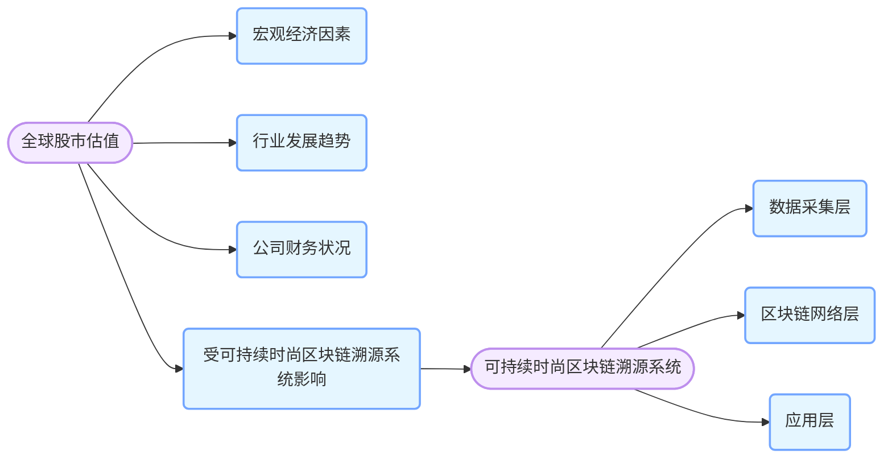

# 全球股市估值与可持续时尚区块链溯源系统的关联

> 关键词：全球股市估值、可持续时尚、区块链溯源系统、关联分析、市场影响

> 摘要：本文旨在深入探讨全球股市估值与可持续时尚区块链溯源系统之间的关联。首先介绍了研究的背景、目的、预期读者、文档结构和相关术语。接着阐述了全球股市估值和可持续时尚区块链溯源系统的核心概念及其联系，详细讲解了相关的核心算法原理、数学模型和公式。通过项目实战展示了系统的开发环境搭建、源代码实现和解读。分析了该关联在实际中的应用场景，推荐了相关的学习资源、开发工具和论文著作。最后总结了未来发展趋势与挑战，并对常见问题进行了解答，还提供了扩展阅读和参考资料，以全面揭示两者之间复杂而又紧密的联系。

## 1. 背景介绍 
### 1.1 目的和范围
本研究的主要目的是探究全球股市估值与可持续时尚区块链溯源系统之间潜在的关联。全球股市估值反映了整个股票市场的价值水平，受到宏观经济、行业发展、公司业绩等多种因素的影响。而可持续时尚区块链溯源系统则是利用区块链技术实现时尚产品从原材料采购到销售的全流程追溯，以确保产品的可持续性和透明度。本研究将分析这两个看似不同领域的因素如何相互作用，以及这种相互作用对股市和时尚产业的影响。研究范围涵盖了全球主要股票市场以及可持续时尚产业的相关企业。

### 1.2 预期读者
本文的预期读者包括金融分析师、时尚行业从业者、区块链技术开发者、学术研究人员以及对金融市场和时尚产业感兴趣的普通读者。金融分析师可以从中了解可持续时尚因素对股市估值的影响，以便做出更准确的投资决策；时尚行业从业者可以认识到区块链溯源系统对企业在资本市场的价值提升作用；区块链技术开发者可以获得关于该系统在时尚产业应用的思路；学术研究人员可以将本文作为相关研究的参考；普通读者则可以拓宽对金融和时尚领域交叉知识的了解。

### 1.3 文档结构概述
本文将按照以下结构进行阐述：首先介绍核心概念，包括全球股市估值和可持续时尚区块链溯源系统的定义和原理，并展示它们之间的联系；接着详细讲解核心算法原理和具体操作步骤，同时给出数学模型和公式；通过项目实战展示系统的开发和实现过程；分析该关联在实际中的应用场景；推荐相关的学习资源、开发工具和论文著作；最后总结未来发展趋势与挑战，解答常见问题，并提供扩展阅读和参考资料。

### 1.4 术语表
#### 1.4.1 核心术语定义
- **全球股市估值**：是指对全球范围内股票市场整体价值的评估，通常通过各种估值指标如市盈率（P/E）、市净率（P/B）等进行衡量，反映了市场参与者对股票市场未来收益的预期。
- **可持续时尚**：强调时尚产业在经济、社会和环境方面的可持续性，包括使用环保材料、采用可持续生产方式、保障工人权益等。
- **区块链溯源系统**：利用区块链技术的分布式账本、不可篡改、可追溯等特性，对产品的生产、加工、运输、销售等环节进行记录和跟踪，确保产品信息的真实性和透明度。

#### 1.4.2 相关概念解释
- **市盈率（P/E）**：是指股票价格与每股盈利的比率，反映了投资者为获得每股收益所愿意支付的价格，是衡量股票估值的常用指标之一。
- **市净率（P/B）**：是指股票价格与每股净资产的比率，反映了股票价格相对于公司净资产的倍数，可用于评估股票的投资价值。
- **分布式账本**：是一种在多个节点之间共享、复制和同步的数据库，每个节点都保存着完整的账本信息，确保数据的安全性和可靠性。

#### 1.4.3 缩略词列表
- **P/E**：市盈率（Price-to-Earnings Ratio）
- **P/B**：市净率（Price-to-Book Ratio）
- **NFT**：非同质化代币（Non-Fungible Token）

## 2. 核心概念与联系 

### 全球股市估值的原理
全球股市估值是基于对股票市场中上市公司的财务状况、盈利能力、行业前景等因素的综合评估。常用的估值方法包括相对估值法和绝对估值法。相对估值法通过与同行业或市场平均水平进行比较，如市盈率、市净率等指标，来判断股票的估值高低。绝对估值法则是通过对公司未来现金流的折现来计算股票的内在价值，如现金流折现模型（DCF）。

### 可持续时尚区块链溯源系统的架构
可持续时尚区块链溯源系统主要由以下几个部分组成：
1. **数据采集层**：负责收集时尚产品在各个环节的相关数据，如原材料的来源、生产过程中的环境影响、工人的工作条件等。
2. **区块链网络层**：将采集到的数据存储在区块链上，利用区块链的分布式账本和加密技术确保数据的不可篡改和可追溯性。
3. **应用层**：为用户提供查询和验证产品溯源信息的接口，包括消费者、监管机构、投资者等。

### 两者之间的联系
可持续时尚区块链溯源系统可以通过以下几个方面影响全球股市估值：
1. **提升企业形象和品牌价值**：采用区块链溯源系统的时尚企业能够向消费者和投资者展示其产品的可持续性和透明度，增强品牌的可信度和美誉度，从而提高企业的市场竞争力和估值。
2. **降低企业风险**：通过溯源系统，企业可以更好地管理供应链，及时发现和解决潜在的质量问题和环境风险，降低企业的运营风险，对股市估值产生积极影响。
3. **满足投资者需求**：随着投资者对可持续发展的关注度不断提高，他们更倾向于投资具有良好可持续发展记录的企业。可持续时尚区块链溯源系统可以为投资者提供更准确的信息，吸引更多的投资，进而推动企业股价上涨。

### 文本示意图
```plaintext
全球股市估值
|
|--宏观经济因素
|--行业发展趋势
|--公司财务状况
|
|--受可持续时尚区块链溯源系统影响
|
可持续时尚区块链溯源系统
|
|--数据采集层
|--区块链网络层
|--应用层
```

### Mermaid 流程图


## 3. 核心算法原理 & 具体操作步骤 

### 全球股市估值算法原理
以市盈率估值法为例，其原理是通过比较目标公司的市盈率与同行业平均市盈率或市场整体市盈率，来判断目标公司股票的估值高低。计算公式为：

```python
# 市盈率计算公式
def calculate_pe(stock_price, earnings_per_share):
    """
    计算市盈率
    :param stock_price: 股票价格
    :param earnings_per_share: 每股收益
    :return: 市盈率
    """
    if earnings_per_share == 0:
        return float('inf')
    return stock_price / earnings_per_share

# 示例数据
stock_price = 50
earnings_per_share = 5
pe_ratio = calculate_pe(stock_price, earnings_per_share)
print(f"市盈率: {pe_ratio}")
```

### 可持续时尚区块链溯源系统算法原理
区块链溯源系统主要基于哈希算法和共识算法。哈希算法用于对数据进行加密和唯一标识，确保数据的完整性和不可篡改。共识算法用于在区块链网络中达成节点之间的一致性，确保数据的准确性和可靠性。以下是一个简单的哈希算法示例：

```python
import hashlib

def calculate_hash(data):
    """
    计算数据的哈希值
    :param data: 要计算哈希值的数据
    :return: 哈希值
    """
    data_str = str(data).encode()
    hash_object = hashlib.sha256(data_str)
    return hash_object.hexdigest()

# 示例数据
data = "时尚产品溯源信息"
hash_value = calculate_hash(data)
print(f"哈希值: {hash_value}")
```

### 具体操作步骤
#### 全球股市估值操作步骤
1. 收集目标公司的财务数据，包括股票价格、每股收益等。
2. 确定同行业平均市盈率或市场整体市盈率作为参考。
3. 计算目标公司的市盈率，并与参考值进行比较。
4. 根据比较结果判断目标公司股票的估值高低。

#### 可持续时尚区块链溯源系统操作步骤
1. 在数据采集层，通过传感器、物联网设备等收集时尚产品的相关数据。
2. 对采集到的数据进行预处理，包括数据清洗、格式转换等。
3. 使用哈希算法对数据进行加密，生成唯一的哈希值。
4. 将哈希值和相关数据存储到区块链网络中，通过共识算法达成节点之间的一致性。
5. 在应用层，提供查询和验证接口，用户可以通过输入产品信息查询其溯源信息。

## 4. 数学模型和公式 & 详细讲解 & 举例说明 

### 全球股市估值数学模型
#### 市盈率模型
市盈率（P/E）模型是最常用的股市估值模型之一，其公式为：
$$P/E = \frac{P}{EPS}$$
其中，$P$ 表示股票价格，$EPS$ 表示每股收益。

举例说明：假设某公司的股票价格为 $50$ 元，每股收益为 $5$ 元，则该公司的市盈率为：
$$P/E = \frac{50}{5} = 10$$
如果同行业平均市盈率为 $15$，则该公司股票可能被低估，具有一定的投资价值。

#### 现金流折现模型（DCF）
现金流折现模型是一种绝对估值模型，其基本思想是将公司未来的现金流折现到当前时刻，以计算公司的内在价值。公式为：
$$V = \sum_{t=1}^{n} \frac{CF_t}{(1 + r)^t}$$
其中，$V$ 表示公司的内在价值，$CF_t$ 表示第 $t$ 期的现金流，$r$ 表示折现率，$n$ 表示预测期数。

举例说明：假设某公司未来三年的现金流分别为 $100$ 万元、$120$ 万元和 $150$ 万元，折现率为 $10\%$，则该公司的内在价值为：
$$V = \frac{100}{(1 + 0.1)^1} + \frac{120}{(1 + 0.1)^2} + \frac{150}{(1 + 0.1)^3} \approx 295.24 \text{万元}$$

### 可持续时尚区块链溯源系统数学模型
#### 哈希函数
哈希函数用于将任意长度的数据映射为固定长度的哈希值，常用的哈希函数有 SHA-256 等。哈希函数的性质包括：
1. 确定性：对于相同的输入，哈希函数总是产生相同的输出。
2. 唯一性：不同的输入产生不同的哈希值的概率非常高。
3. 不可逆性：从哈希值无法反推出原始数据。

#### 共识算法
共识算法用于在区块链网络中达成节点之间的一致性，常见的共识算法有工作量证明（PoW）、权益证明（PoS）等。以工作量证明为例，其基本思想是节点通过计算一个复杂的数学难题来证明自己的工作量，从而获得记账权。公式为：
$$H(block, nonce) < target$$
其中，$H$ 表示哈希函数，$block$ 表示区块数据，$nonce$ 表示随机数，$target$ 表示目标难度值。节点需要不断尝试不同的 $nonce$ 值，直到满足上述条件为止。

## 5. 项目实战：代码实际案例和详细解释说明 

### 5.1  开发环境搭建
#### 硬件环境
- 服务器：建议使用配置较高的云服务器，如阿里云、腾讯云等，以确保系统的稳定性和性能。
- 存储设备：需要足够的存储空间来存储区块链数据，可选择使用分布式存储系统如 Ceph、GlusterFS 等。

#### 软件环境
- 操作系统：建议使用 Linux 操作系统，如 Ubuntu、CentOS 等。
- 编程语言：Python 是开发区块链溯源系统的常用语言，可使用 Python 3.x 版本。
- 区块链平台：可选择使用 Hyperledger Fabric、Ethereum 等区块链平台。

### 5.2  源代码详细实现和代码解读
以下是一个简单的基于 Python 和 Flask 框架的可持续时尚区块链溯源系统示例：

```python
from flask import Flask, request, jsonify
import hashlib
import time

app = Flask(__name__)

# 区块链类
class Blockchain:
    def __init__(self):
        self.chain = []
        self.create_block(proof=1, previous_hash='0')

    def create_block(self, proof, previous_hash):
        block = {
            'index': len(self.chain) + 1,
            'timestamp': str(time.time()),
            'proof': proof,
            'previous_hash': previous_hash
        }
        self.chain.append(block)
        return block

    def get_previous_block(self):
        return self.chain[-1]

    def proof_of_work(self, previous_proof):
        new_proof = 1
        check_proof = False
        while check_proof is False:
            hash_operation = hashlib.sha256(str(new_proof**2 - previous_proof**2).encode()).hexdigest()
            if hash_operation[:4] == '0000':
                check_proof = True
            else:
                new_proof += 1
        return new_proof

    def hash(self, block):
        encoded_block = str(block).encode()
        return hashlib.sha256(encoded_block).hexdigest()

    def is_chain_valid(self, chain):
        previous_block = chain[0]
        block_index = 1
        while block_index < len(chain):
            block = chain[block_index]
            if block['previous_hash'] != self.hash(previous_block):
                return False
            previous_proof = previous_block['proof']
            proof = block['proof']
            hash_operation = hashlib.sha256(str(proof**2 - previous_proof**2).encode()).hexdigest()
            if hash_operation[:4] != '0000':
                return False
            previous_block = block
            block_index += 1
        return True

# 创建区块链实例
blockchain = Blockchain()

# 挖矿接口
@app.route('/mine_block', methods=['GET'])
def mine_block():
    previous_block = blockchain.get_previous_block()
    previous_proof = previous_block['proof']
    proof = blockchain.proof_of_work(previous_proof)
    previous_hash = blockchain.hash(previous_block)
    block = blockchain.create_block(proof, previous_hash)
    response = {
        'message': '恭喜，挖到一个新的区块！',
        'index': block['index'],
        'timestamp': block['timestamp'],
        'proof': block['proof'],
        'previous_hash': block['previous_hash']
    }
    return jsonify(response), 200

# 获取整个区块链接口
@app.route('/get_chain', methods=['GET'])
def get_chain():
    response = {
        'chain': blockchain.chain,
        'length': len(blockchain.chain)
    }
    return jsonify(response), 200

# 验证区块链有效性接口
@app.route('/is_valid', methods=['GET'])
def is_valid():
    is_valid = blockchain.is_chain_valid(blockchain.chain)
    if is_valid:
        response = {'message': '区块链有效。'}
    else:
        response = {'message': '区块链无效。'}
    return jsonify(response), 200

if __name__ == '__main__':
    app.run(host='0.0.0.0', port=5000)
```

### 5.3  代码解读与分析
#### 区块链类（Blockchain）
- `__init__` 方法：初始化区块链，创建创世区块。
- `create_block` 方法：创建一个新的区块，并将其添加到区块链中。
- `get_previous_block` 方法：获取区块链中的上一个区块。
- `proof_of_work` 方法：实现工作量证明算法，找到一个满足条件的随机数（proof）。
- `hash` 方法：计算区块的哈希值。
- `is_chain_valid` 方法：验证区块链的有效性，检查每个区块的哈希值和工作量证明是否正确。

#### Flask 路由
- `/mine_block`：用于挖矿，调用 `proof_of_work` 方法找到新的随机数，创建新的区块。
- `/get_chain`：返回整个区块链的信息。
- `/is_valid`：验证区块链的有效性，并返回验证结果。

## 6. 实际应用场景 
### 金融投资领域
投资者可以利用可持续时尚区块链溯源系统提供的信息，评估时尚企业的可持续发展水平和潜在风险，从而做出更明智的投资决策。例如，如果一家时尚企业能够通过溯源系统证明其产品使用了环保材料、采用了可持续生产方式，那么该企业可能更受投资者青睐，其股票价格也可能更具上涨潜力。

### 时尚行业监管
监管机构可以通过区块链溯源系统对时尚企业的生产和销售环节进行监管，确保企业遵守相关的环保、劳动法规等。例如，监管机构可以查询产品的原材料来源，检查是否存在非法采伐、使用童工等问题，提高监管效率和透明度。

### 消费者权益保护
消费者可以通过扫描产品上的二维码或输入产品编号，查询产品的溯源信息，了解产品的生产过程、原材料来源、质量检测等情况，从而做出更明智的购买决策。例如，消费者可以选择购买具有良好可持续发展记录的时尚产品，推动时尚行业的可持续发展。

### 供应链管理
时尚企业可以利用区块链溯源系统优化供应链管理，提高供应链的透明度和效率。例如，企业可以实时跟踪原材料的采购和运输情况，及时发现和解决供应链中的问题，降低成本和风险。

## 7. 工具和资源推荐
### 7.1 学习资源推荐
#### 7.1.1 书籍推荐
- 《区块链：技术驱动金融》：全面介绍了区块链技术的原理、应用和发展趋势，适合初学者和专业人士阅读。
- 《金融市场学》：系统讲解了金融市场的基本概念、运行机制和投资策略，对理解全球股市估值有很大帮助。
- 《可持续时尚：从设计到消费》：深入探讨了可持续时尚的理论和实践，包括可持续设计、生产、消费等方面的内容。

#### 7.1.2 在线课程
- Coursera 上的“区块链基础”课程：由知名高校和企业的专家授课，内容涵盖区块链的基本原理、技术架构和应用场景。
- edX 上的“金融市场与投资”课程：提供了金融市场和投资领域的系统知识，包括股票估值、投资组合管理等内容。
- FutureLearn 上的“可持续时尚：创新与变革”课程：介绍了可持续时尚的最新趋势和创新实践，适合时尚行业从业者和对可持续发展感兴趣的人士。

#### 7.1.3 技术博客和网站
- 区块链技术博客：如 Medium 上的区块链相关博客，提供了最新的区块链技术文章和案例分析。
- 金融市场网站：如 Bloomberg、CNBC 等，提供了全球股市的实时行情、分析报告和专家观点。
- 可持续时尚网站：如 Fashion Revolution、Sustainable Brands 等，关注可持续时尚的发展动态和最佳实践。

### 7.2 开发工具框架推荐
#### 7.2.1 IDE和编辑器
- PyCharm：是一款专门为 Python 开发设计的集成开发环境，提供了丰富的代码编辑、调试和测试功能。
- Visual Studio Code：是一款轻量级的代码编辑器，支持多种编程语言和插件扩展，适合快速开发和调试。

#### 7.2.2 调试和性能分析工具
- GDB：是一款强大的调试工具，可用于调试 Python 程序，帮助开发者定位和解决代码中的问题。
- Py-Spy：是一款 Python 性能分析工具，可用于分析 Python 程序的性能瓶颈，提高程序的运行效率。

#### 7.2.3 相关框架和库
- Flask：是一个轻量级的 Python Web 框架，适合快速开发 Web 应用，如区块链溯源系统的前端接口。
- Hyperledger Fabric：是一个开源的企业级区块链平台，提供了丰富的组件和工具，可用于构建复杂的区块链应用。

### 7.3 相关论文著作推荐
#### 7.3.1 经典论文
- “Bitcoin: A Peer-to-Peer Electronic Cash System”：比特币的白皮书，介绍了比特币的基本原理和技术架构，是区块链技术的奠基之作。
- “The Efficient Market Hypothesis and Its Critics”：探讨了有效市场假说及其批评者的观点，对理解股市估值和市场效率有重要意义。

#### 7.3.2 最新研究成果
- 关于可持续时尚和区块链技术结合的最新研究论文，可通过学术数据库如 IEEE Xplore、ACM Digital Library 等进行搜索。
- 关于股市估值模型和方法的最新研究成果，可关注金融领域的顶级学术期刊如 Journal of Finance、Review of Financial Studies 等。

#### 7.3.3 应用案例分析
- 分析时尚企业应用区块链溯源系统的成功案例，了解系统的实施过程、效果和经验教训。
- 研究金融机构如何利用可持续发展信息进行投资决策的案例，为实际应用提供参考。

## 8. 总结：未来发展趋势与挑战
### 未来发展趋势
- **融合加深**：全球股市估值与可持续时尚区块链溯源系统的关联将越来越紧密。随着投资者对可持续发展的关注度不断提高，他们将更加重视时尚企业的可持续发展记录，而区块链溯源系统将为投资者提供更准确、透明的信息，从而影响股市估值。
- **技术创新**：区块链技术将不断创新和发展，如采用更高效的共识算法、更安全的加密技术等，提高溯源系统的性能和可靠性。同时，人工智能、物联网等技术也将与区块链技术深度融合，为可持续时尚产业提供更全面的解决方案。
- **行业标准统一**：随着可持续时尚区块链溯源系统的广泛应用，行业标准将逐渐统一。这将有助于提高系统的互操作性和数据的共享性，促进可持续时尚产业的健康发展。

### 挑战
- **技术门槛**：区块链技术的复杂性和专业性较高，对于时尚企业和投资者来说，掌握和应用该技术存在一定的难度。此外，区块链系统的开发和维护需要大量的技术资源和资金投入。
- **数据质量和安全**：区块链溯源系统的数据质量和安全至关重要。如果数据不准确或被篡改，将影响系统的可信度和有效性。因此，需要建立严格的数据采集、验证和存储机制，确保数据的真实性和安全性。
- **监管政策**：可持续时尚区块链溯源系统的发展需要相应的监管政策支持。目前，相关的监管政策还不完善，需要政府和监管机构加强对该领域的研究和监管，制定合理的政策和标准。

## 9. 附录：常见问题与解答
### 1. 全球股市估值受到哪些因素的影响？
全球股市估值受到宏观经济因素（如 GDP 增长率、通货膨胀率、利率等）、行业发展趋势、公司财务状况、市场情绪等多种因素的影响。可持续时尚区块链溯源系统可以通过影响公司的品牌价值、风险水平等因素，间接影响股市估值。

### 2. 可持续时尚区块链溯源系统的工作原理是什么？
该系统利用区块链的分布式账本、不可篡改、可追溯等特性，对时尚产品的生产、加工、运输、销售等环节进行记录和跟踪。通过在各个环节采集数据，并将其存储在区块链上，用户可以通过查询接口获取产品的溯源信息，确保产品的可持续性和透明度。

### 3. 区块链溯源系统如何保障数据的安全？
区块链溯源系统通过加密技术和共识算法保障数据的安全。加密技术对数据进行加密处理，确保数据在传输和存储过程中不被窃取和篡改。共识算法确保区块链网络中的节点对数据的一致性达成共识，防止恶意节点篡改数据。

### 4. 时尚企业采用区块链溯源系统有哪些好处？
时尚企业采用区块链溯源系统可以提升企业形象和品牌价值，增强消费者的信任；降低企业风险，及时发现和解决供应链中的问题；满足投资者对可持续发展的需求，吸引更多的投资；提高供应链的透明度和效率，优化企业的运营管理。

### 5. 投资者如何利用可持续时尚区块链溯源系统进行投资决策？
投资者可以通过查询时尚企业的溯源信息，了解企业的可持续发展水平、原材料来源、生产过程等情况。评估企业的潜在风险和发展前景，从而做出更明智的投资决策。例如，如果一家企业能够证明其产品具有良好的可持续性，那么该企业可能更具投资价值。

## 10. 扩展阅读 & 参考资料
### 扩展阅读
- 《区块链革命：比特币背后的技术如何改变货币、商业和世界》：深入探讨了区块链技术对各个领域的影响和变革。
- 《时尚的真相：揭露全球时尚产业的黑暗面》：揭示了时尚产业在环境、社会等方面存在的问题，以及可持续时尚的重要性。
- 《投资中最简单的事》：介绍了投资的基本理念和方法，对理解股市估值和投资决策有很大帮助。

### 参考资料
- 国际金融报、证券时报等金融媒体的相关报道。
- 时尚行业协会发布的行业报告和研究成果。
- 区块链技术社区和论坛上的技术文章和案例分享。