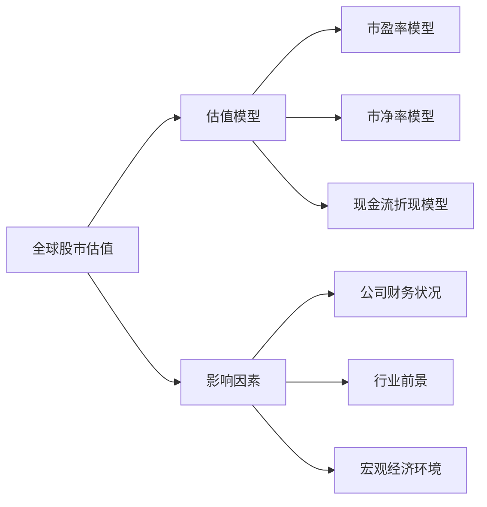
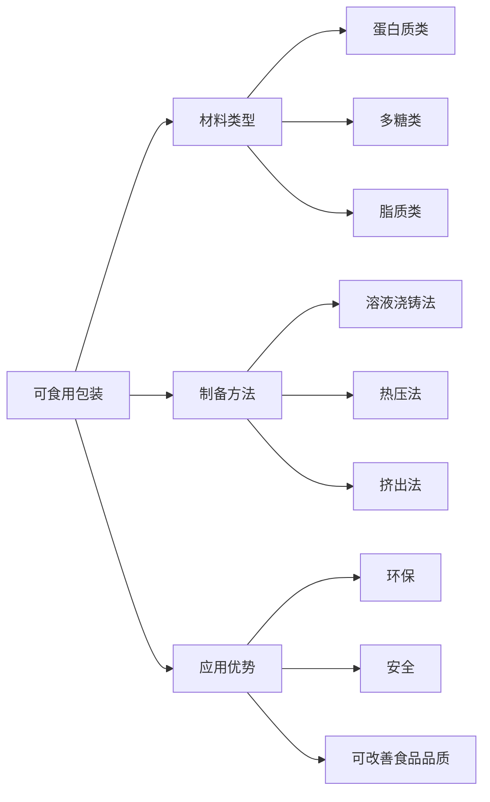

# 全球股市估值与可食用包装在食品工业中的应用

> 关键词：全球股市估值、可食用包装、食品工业、估值模型、应用案例

> 摘要：本文旨在探讨全球股市估值以及可食用包装在食品工业中的应用。首先，对全球股市估值的背景知识、核心概念、算法原理等进行详细阐述，包括常见的估值模型和数学公式，并结合实际案例进行分析。其次，深入研究可食用包装在食品工业中的应用，涵盖其原理、操作步骤、实际应用场景等内容。最后，对两者的未来发展趋势与挑战进行总结，并提供相关的工具和资源推荐，以及常见问题的解答和扩展阅读参考资料。

## 1. 背景介绍 
### 1.1 目的和范围
本部分的目的在于为读者全面介绍全球股市估值和可食用包装在食品工业应用的相关背景知识。对于全球股市估值，我们将探讨其估值方法、影响因素以及在投资决策中的重要性。在可食用包装方面，我们将研究其在食品工业中的应用原理、优势以及发展前景。范围涵盖了从理论基础到实际应用的各个方面，旨在为读者提供一个系统、全面的知识体系。

### 1.2 预期读者
本文预期读者包括金融投资者、食品工业从业者、科研人员以及对全球股市和食品包装技术感兴趣的普通读者。金融投资者可以从股市估值的内容中获取投资决策的参考；食品工业从业者能够了解可食用包装的最新应用动态，为企业的发展提供新思路；科研人员可以在文中找到相关的理论和实践案例，为进一步的研究提供参考；普通读者则可以通过阅读本文，增加对这两个领域的了解。

### 1.3 文档结构概述
本文共分为十个部分。第一部分为背景介绍，包括目的和范围、预期读者、文档结构概述和术语表。第二部分阐述核心概念与联系，介绍全球股市估值和可食用包装的核心概念，并展示相关的文本示意图和 Mermaid 流程图。第三部分讲解核心算法原理和具体操作步骤，分别对股市估值和可食用包装的相关算法进行详细说明，并给出 Python 源代码。第四部分介绍数学模型和公式，对股市估值和可食用包装中的数学模型进行详细讲解，并举例说明。第五部分是项目实战，通过实际案例展示股市估值和可食用包装在食品工业中的应用，并对代码进行详细解读。第六部分探讨实际应用场景，分析全球股市估值在投资领域和可食用包装在食品工业中的具体应用场景。第七部分推荐相关的工具和资源，包括学习资源、开发工具框架和相关论文著作。第八部分总结未来发展趋势与挑战，对全球股市估值和可食用包装的未来发展进行展望。第九部分是附录，解答常见问题。第十部分提供扩展阅读和参考资料，方便读者进一步深入学习。

### 1.4 术语表
#### 1.4.1 核心术语定义
- **全球股市估值**：指对全球范围内各个股票市场中上市公司的价值进行评估的过程，通过各种估值方法和模型，确定股票的合理价格。
- **可食用包装**：由可食用材料制成的包装，在食品食用过程中可以一起食用，无需丢弃，具有环保、安全等特点。
- **市盈率（P/E）**：股票价格与每股收益的比率，是衡量股票估值的常用指标之一。
- **市净率（P/B）**：股票价格与每股净资产的比率，反映了股票的市场价值与账面价值的关系。

#### 1.4.2 相关概念解释
- **股票市场**：股票发行和交易的场所，是金融市场的重要组成部分。
- **食品工业**：从事食品生产、加工、销售等活动的产业，包括农产品加工、食品制造、饮料制造等多个领域。
- **可持续发展**：既满足当代人的需求，又不损害后代人满足其需求的能力的发展模式。可食用包装在食品工业中的应用符合可持续发展的理念。

#### 1.4.3 缩略词列表
- **P/E**：市盈率（Price-to-Earnings Ratio）
- **P/B**：市净率（Price-to-Book Ratio）

## 2. 核心概念与联系 
### 全球股市估值核心概念
全球股市估值是投资者评估股票投资价值的重要手段。其核心原理是通过分析上市公司的财务状况、盈利能力、行业前景等因素，运用各种估值模型来确定股票的合理价格。常见的估值模型包括市盈率模型、市净率模型、现金流折现模型等。

#### 文本示意图
```plaintext
全球股市估值
|-- 估值模型
|   |-- 市盈率模型
|   |-- 市净率模型
|   |-- 现金流折现模型
|-- 影响因素
|   |-- 公司财务状况
|   |-- 行业前景
|   |-- 宏观经济环境
```

#### Mermaid 流程图


### 可食用包装核心概念
可食用包装是一种新型的包装技术，其核心原理是利用可食用材料（如蛋白质、多糖、脂质等）制成具有一定阻隔性能和机械性能的包装材料。这些材料可以在食品食用过程中一起食用，减少了包装废弃物的产生，具有环保、安全等优点。

#### 文本示意图
```plaintext
可食用包装
|-- 材料类型
|   |-- 蛋白质类
|   |-- 多糖类
|   |-- 脂质类
|-- 制备方法
|   |-- 溶液浇铸法
|   |-- 热压法
|   |-- 挤出法
|-- 应用优势
|   |-- 环保
|   |-- 安全
|   |-- 可改善食品品质
```

#### Mermaid 流程图


### 两者联系
虽然全球股市估值和可食用包装在食品工业中的应用看似是两个不同的领域，但它们之间也存在一定的联系。一方面，可食用包装技术的发展为相关食品企业带来了新的发展机遇，可能会影响企业的盈利能力和市场价值，从而对其在股市中的估值产生影响。另一方面，股市的表现也会影响企业的融资能力和发展战略，进而影响可食用包装技术在食品工业中的推广和应用。

## 3. 核心算法原理 & 具体操作步骤 

### 全球股市估值核心算法原理及 Python 实现
#### 市盈率模型
市盈率模型是一种简单而常用的股市估值方法，其原理是通过比较股票的市盈率与同行业或市场平均市盈率，来判断股票的估值是否合理。计算公式为：

$P = EPS \times P/E$

其中，$P$ 为股票价格，$EPS$ 为每股收益，$P/E$ 为市盈率。

以下是一个使用 Python 实现市盈率模型的示例代码：
```python
# 定义每股收益和市盈率
eps = 2.0
pe = 15

# 计算股票价格
price = eps * pe

print(f"根据市盈率模型计算的股票价格为: {price} 元")
```

#### 市净率模型
市净率模型是通过比较股票的市净率与同行业或市场平均市净率，来评估股票的估值。计算公式为：

$P = BVPS \times P/B$

其中，$P$ 为股票价格，$BVPS$ 为每股净资产，$P/B$ 为市净率。

以下是一个使用 Python 实现市净率模型的示例代码：
```python
# 定义每股净资产和市净率
bvps = 10.0
pb = 2.0

# 计算股票价格
price = bvps * pb

print(f"根据市净率模型计算的股票价格为: {price} 元")
```

#### 现金流折现模型
现金流折现模型是一种较为复杂但更为准确的估值方法，其原理是将企业未来的现金流折现到当前时刻，以确定企业的内在价值。计算公式为：

$V = \sum_{t=1}^{n} \frac{CF_t}{(1 + r)^t} + \frac{TV}{(1 + r)^n}$

其中，$V$ 为企业的内在价值，$CF_t$ 为第 $t$ 期的现金流，$r$ 为折现率，$TV$ 为终值，$n$ 为预测期数。

以下是一个使用 Python 实现现金流折现模型的示例代码：
```python
import numpy as np

# 定义现金流、折现率和预测期数
cash_flows = [100, 120, 150, 180, 200]
discount_rate = 0.1
n = len(cash_flows)

# 计算现金流的现值
present_values = []
for i in range(n):
    pv = cash_flows[i] / ((1 + discount_rate) ** (i + 1))
    present_values.append(pv)

# 计算终值（假设终值为最后一期现金流的 10 倍）
terminal_value = cash_flows[-1] * 10
terminal_pv = terminal_value / ((1 + discount_rate) ** n)

# 计算企业的内在价值
intrinsic_value = sum(present_values) + terminal_pv

print(f"根据现金流折现模型计算的企业内在价值为: {intrinsic_value} 元")
```

### 可食用包装核心算法原理及 Python 实现
#### 溶液浇铸法制备可食用包装膜厚度计算
溶液浇铸法是制备可食用包装膜的常用方法之一，其膜厚度与溶液浓度、浇铸面积和溶液体积有关。计算公式为：

$h = \frac{V}{A \times \rho}$

其中，$h$ 为膜厚度，$V$ 为溶液体积，$A$ 为浇铸面积，$\rho$ 为溶液密度。

以下是一个使用 Python 实现溶液浇铸法制备可食用包装膜厚度计算的示例代码：
```python
# 定义溶液体积、浇铸面积和溶液密度
volume = 100  # 单位：ml
area = 200  # 单位：cm²
density = 1.2  # 单位：g/ml

# 计算膜厚度
thickness = volume / (area * density)

print(f"根据溶液浇铸法计算的可食用包装膜厚度为: {thickness} cm")
```

## 4. 数学模型和公式 & 详细讲解 & 举例说明 

### 全球股市估值数学模型和公式
#### 市盈率模型
市盈率模型的数学公式为 $P = EPS \times P/E$。其中，$EPS$ 是每股收益，反映了公司的盈利能力；$P/E$ 是市盈率，反映了市场对公司未来盈利的预期。

例如，某公司的每股收益为 $3$ 元，同行业平均市盈率为 $20$，则根据市盈率模型计算的该公司股票价格为 $P = 3 \times 20 = 60$ 元。

#### 市净率模型
市净率模型的数学公式为 $P = BVPS \times P/B$。$BVPS$ 是每股净资产，代表了公司的账面价值；$P/B$ 是市净率，反映了市场对公司净资产的估值。

假设某公司的每股净资产为 $15$ 元，市净率为 $1.5$，则该公司股票价格为 $P = 15 \times 1.5 = 22.5$ 元。

#### 现金流折现模型
现金流折现模型的数学公式为 $V = \sum_{t=1}^{n} \frac{CF_t}{(1 + r)^t} + \frac{TV}{(1 + r)^n}$。其中，$CF_t$ 是第 $t$ 期的现金流，$r$ 是折现率，$TV$ 是终值，$n$ 是预测期数。

例如，某企业未来 $5$ 年的现金流分别为 $100$ 万元、$120$ 万元、$150$ 万元、$180$ 万元、$200$ 万元，折现率为 $10\%$，终值假设为最后一期现金流的 $10$ 倍。则该企业的内在价值计算如下：

首先，计算各期现金流的现值：
$PV_1 = \frac{100}{(1 + 0.1)^1} \approx 90.91$（万元）
$PV_2 = \frac{120}{(1 + 0.1)^2} \approx 99.17$（万元）
$PV_3 = \frac{150}{(1 + 0.1)^3} \approx 112.69$（万元）
$PV_4 = \frac{180}{(1 + 0.1)^4} \approx 122.94$（万元）
$PV_5 = \frac{200}{(1 + 0.1)^5} \approx 124.18$（万元）

终值的现值：
$TV = 200 \times 10 = 2000$（万元）
$PV_{TV} = \frac{2000}{(1 + 0.1)^5} \approx 1241.84$（万元）

企业的内在价值：
$V = 90.91 + 99.17 + 112.69 + 122.94 + 124.18 + 1241.84 = 1791.73$（万元）

### 可食用包装数学模型和公式
#### 溶液浇铸法制备可食用包装膜厚度计算
公式 $h = \frac{V}{A \times \rho}$ 中，$V$ 是溶液体积，$A$ 是浇铸面积，$\rho$ 是溶液密度。

例如，溶液体积为 $150$ ml，浇铸面积为 $300$ cm²，溶液密度为 $1.1$ g/ml，则可食用包装膜厚度为：
$h = \frac{150}{300 \times 1.1} \approx 0.45$（cm）

## 5. 项目实战：代码实际案例和详细解释说明 

### 5.1  开发环境搭建
#### 全球股市估值项目
- **编程语言**：Python
- **开发环境**：Anaconda + Jupyter Notebook
- **所需库**：pandas、numpy、yfinance（用于获取股票数据）

安装所需库的命令：
```bash
pip install pandas numpy yfinance
```

#### 可食用包装项目
- **编程语言**：Python
- **开发环境**：Anaconda + Jupyter Notebook
- **所需库**：matplotlib（用于可视化结果）

安装所需库的命令：
```bash
pip install matplotlib
```

### 5.2  源代码详细实现和代码解读
#### 全球股市估值项目
```python
import yfinance as yf
import pandas as pd

# 获取某股票的历史数据
ticker = 'AAPL'  # 苹果公司股票代码
start_date = '2020-01-01'
end_date = '2023-01-01'
data = yf.download(ticker, start=start_date, end=end_date)

# 计算每股收益（假设已知）
eps = 5.0

# 计算不同市盈率下的股票价格
pe_ratios = [10, 15, 20, 25]
prices = []
for pe in pe_ratios:
    price = eps * pe
    prices.append(price)

# 输出结果
result = pd.DataFrame({'市盈率': pe_ratios, '股票价格': prices})
print(result)
```
代码解读：
1. 首先，使用 `yfinance` 库下载苹果公司股票的历史数据。
2. 假设每股收益为 $5$ 元。
3. 定义不同的市盈率值，通过市盈率模型计算对应的股票价格。
4. 最后，使用 `pandas` 库将结果存储在 DataFrame 中并输出。

#### 可食用包装项目
```python
import matplotlib.pyplot as plt

# 定义不同溶液体积下的膜厚度计算函数
def calculate_thickness(volume, area, density):
    thickness = volume / (area * density)
    return thickness

# 定义浇铸面积和溶液密度
area = 200  # 单位：cm²
density = 1.2  # 单位：g/ml

# 定义不同的溶液体积
volumes = [50, 100, 150, 200]
thicknesses = []
for volume in volumes:
    thickness = calculate_thickness(volume, area, density)
    thicknesses.append(thickness)

# 可视化结果
plt.plot(volumes, thicknesses)
plt.xlabel('溶液体积 (ml)')
plt.ylabel('膜厚度 (cm)')
plt.title('溶液体积与可食用包装膜厚度的关系')
plt.show()
```
代码解读：
1. 定义了一个计算可食用包装膜厚度的函数 `calculate_thickness`。
2. 设定浇铸面积和溶液密度。
3. 定义不同的溶液体积，调用函数计算对应的膜厚度。
4. 使用 `matplotlib` 库将溶液体积与膜厚度的关系进行可视化。

### 5.3  代码解读与分析
#### 全球股市估值项目
- 该项目通过获取股票历史数据和假设每股收益，使用市盈率模型计算不同市盈率下的股票价格。代码简单易懂，便于初学者掌握。但需要注意的是，实际应用中每股收益需要根据公司的财务报表进行准确计算，市盈率也需要参考同行业或市场平均水平。
- 局限性在于，市盈率模型只是一种简单的估值方法，没有考虑公司的未来增长潜力、行业竞争等因素。在实际投资决策中，需要结合其他估值方法和基本面分析进行综合判断。

#### 可食用包装项目
- 该项目通过定义计算膜厚度的函数，计算不同溶液体积下的膜厚度，并进行可视化展示。代码清晰，能够直观地展示溶液体积与膜厚度的关系。
- 局限性在于，该模型只考虑了溶液体积、浇铸面积和溶液密度对膜厚度的影响，实际制备过程中还可能受到温度、湿度等因素的影响。在实际应用中，需要进一步优化模型，考虑更多的因素。

## 6. 实际应用场景 
### 全球股市估值实际应用场景
#### 投资决策
投资者可以通过对全球股市进行估值，选择被低估的股票进行投资，以获取更高的投资回报。例如，当某只股票的市盈率低于同行业平均水平，且公司的基本面良好时，投资者可以认为该股票具有投资价值。

#### 风险管理
股市估值可以帮助投资者评估投资组合的风险。通过对不同股票的估值分析，投资者可以合理调整投资组合的结构，降低投资风险。例如，当市场整体估值过高时，投资者可以适当减少股票投资比例，增加债券等固定收益类资产的投资。

#### 企业并购
在企业并购过程中，股市估值可以为并购方提供参考，确定合理的并购价格。通过对目标企业的估值分析，并购方可以评估目标企业的价值，避免过高或过低的出价。

### 可食用包装在食品工业中的实际应用场景
#### 糖果包装
可食用包装可以用于糖果的包装，如糯米纸包装糖果。糯米纸是一种常见的可食用包装材料，它可以直接食用，无需丢弃，既环保又方便。

#### 烘焙食品包装
对于一些烘焙食品，如蛋糕、面包等，可以使用可食用包装膜进行包装。这种包装膜可以防止食品干燥和变质，同时还可以改善食品的口感和外观。

#### 液体食品包装
可食用包装也可以用于液体食品的包装，如胶囊形式的可食用包装可以用于包装果汁、酸奶等液体食品。消费者可以直接将胶囊放入口中，食用里面的液体食品，包装材料也可以一起食用，减少了包装废弃物的产生。

## 7. 工具和资源推荐
### 7.1 学习资源推荐
#### 7.1.1 书籍推荐
- 《聪明的投资者》（The Intelligent Investor）：作者是本杰明·格雷厄姆（Benjamin Graham），这本书是价值投资的经典之作，介绍了股票投资的基本原理和方法，对股市估值有深入的阐述。
- 《食品包装学》：系统介绍了食品包装的相关知识，包括包装材料、包装技术、包装设计等内容，对于了解可食用包装在食品工业中的应用有很大帮助。

#### 7.1.2 在线课程
- Coursera 上的“Financial Markets”课程：由耶鲁大学教授罗伯特·席勒（Robert Shiller）讲授，介绍了金融市场的基本原理和投资策略，包括股市估值的方法和技巧。
- edX 上的“Food Packaging Technology”课程：该课程详细介绍了食品包装技术的最新发展，包括可食用包装的制备和应用。

#### 7.1.3 技术博客和网站
- 雪球网：是一个专注于股票投资的社区，提供了大量的股票分析和估值报告，投资者可以在这里学习到不同的股市估值方法和技巧。
- 食品伙伴网：是一个食品行业的专业网站，提供了食品包装、食品加工等方面的最新资讯和技术文章，对于了解可食用包装在食品工业中的应用有很大帮助。

### 7.2 开发工具框架推荐
#### 7.2.1 IDE和编辑器
- PyCharm：是一款专业的 Python 集成开发环境，具有代码自动补全、调试、版本控制等功能，适合开发股市估值和可食用包装相关的 Python 项目。
- Jupyter Notebook：是一个交互式的开发环境，支持 Python 代码的编写、运行和可视化，非常适合进行数据分析和模型验证。

#### 7.2.2 调试和性能分析工具
- pdb：是 Python 自带的调试工具，可以帮助开发者调试代码，找出代码中的错误。
- cProfile：是 Python 的性能分析工具，可以分析代码的运行时间和内存使用情况，帮助开发者优化代码性能。

#### 7.2.3 相关框架和库
- yfinance：用于获取全球股市的历史数据，方便进行股市估值分析。
- pandas：是一个强大的数据分析库，可用于数据处理和分析，在股市估值和可食用包装项目中都有广泛的应用。
- matplotlib：是一个用于数据可视化的库，可以将分析结果以图表的形式展示出来，便于理解和分析。

### 7.3 相关论文著作推荐
#### 7.3.1 经典论文
- “The Dividend-Discount Model and the Long-Run Stock Market”：该论文探讨了股息折现模型在股市估值中的应用，对理解现金流折现模型有很大帮助。
- “Edible Films and Coatings: Tomorrow's Packagings: A Review”：这篇论文对可食用包装的研究进展进行了全面的综述，包括可食用包装的材料、制备方法和应用等方面。

#### 7.3.2 最新研究成果
- 关注《Journal of Financial Economics》《Food Research International》等学术期刊，这些期刊会发表股市估值和可食用包装领域的最新研究成果。

#### 7.3.3 应用案例分析
- 可以参考一些知名企业的案例，如可口可乐公司在可食用包装方面的探索和实践，以及巴菲特在股市投资中的估值方法和案例分析。

## 8. 总结：未来发展趋势与挑战
### 全球股市估值未来发展趋势与挑战
#### 发展趋势
- **智能化估值**：随着人工智能和机器学习技术的发展，股市估值将越来越智能化。通过大数据分析和模型训练，可以更准确地预测股票的未来走势和估值。
- **国际化估值**：全球股市的联系越来越紧密，投资者需要进行国际化的股市估值。未来，跨市场、跨行业的估值方法将得到更广泛的应用。
- **综合估值**：单一的估值方法已经不能满足投资者的需求，未来将更加注重综合估值，结合多种估值方法和基本面分析，对股票进行全面的评估。

#### 挑战
- **数据质量和可靠性**：股市估值需要大量的历史数据和实时数据，数据的质量和可靠性直接影响估值的准确性。如何获取高质量、可靠的数据是一个挑战。
- **市场不确定性**：股市受到宏观经济环境、政策变化、突发事件等多种因素的影响，市场不确定性增加，给股市估值带来了困难。
- **技术更新换代快**：随着科技的不断发展，股市估值的技术和方法也在不断更新换代。投资者需要不断学习和掌握新的技术和方法，以适应市场的变化。

### 可食用包装在食品工业中的未来发展趋势与挑战
#### 发展趋势
- **功能化**：未来的可食用包装将不仅仅具有包装的功能，还将具备保鲜、抗菌、营养强化等多种功能，以满足消费者对食品品质和安全的需求。
- **多样化**：可食用包装的材料和制备方法将越来越多样化。除了现有的蛋白质、多糖、脂质等材料，还将开发出更多新型的可食用材料。
- **规模化生产**：随着技术的不断进步和市场需求的增加，可食用包装将实现规模化生产，降低生产成本，提高生产效率。

#### 挑战
- **成本问题**：目前可食用包装的生产成本较高，限制了其大规模应用。如何降低生产成本，提高可食用包装的性价比是一个亟待解决的问题。
- **性能稳定性**：可食用包装的性能容易受到环境因素的影响，如温度、湿度等。如何提高可食用包装的性能稳定性，保证其在不同环境下的使用效果是一个挑战。
- **消费者接受度**：消费者对可食用包装的认知和接受度还需要进一步提高。如何加强消费者教育，提高消费者对可食用包装的认可度和接受度是一个重要的任务。

## 9. 附录：常见问题与解答
### 全球股市估值常见问题与解答
#### 问：市盈率和市净率哪个更准确？
答：市盈率和市净率都是常用的股市估值指标，它们各有优缺点，不能简单地说哪个更准确。市盈率主要反映了市场对公司未来盈利的预期，适用于盈利稳定的公司；市净率则反映了公司的账面价值，适用于资产价值较高的公司。在实际应用中，需要结合公司的具体情况和行业特点，综合使用这两个指标进行估值。

#### 问：现金流折现模型中的折现率如何确定？
答：折现率的确定是现金流折现模型中的关键问题。折现率通常可以根据市场利率、公司的风险水平等因素来确定。一般来说，市场利率越高，折现率也越高；公司的风险水平越高，折现率也越高。在实际应用中，可以参考同行业或类似公司的折现率，结合公司的具体情况进行调整。

### 可食用包装常见问题与解答
#### 问：可食用包装的安全性如何保证？
答：可食用包装的安全性是非常重要的。在选择可食用包装材料时，需要选择符合食品安全标准的材料。同时，在制备和使用过程中，需要严格遵守相关的卫生规范和操作流程，确保可食用包装的安全性。此外，还需要对可食用包装进行安全性评估和检测，以确保其对人体健康无害。

#### 问：可食用包装的保质期有多长？
答：可食用包装的保质期受到多种因素的影响，如包装材料的种类、制备方法、储存条件等。一般来说，可食用包装的保质期相对较短，需要在一定的时间内使用。在实际应用中，需要根据具体情况选择合适的包装材料和制备方法，并采取适当的储存措施，以延长可食用包装的保质期。

## 10. 扩展阅读 & 参考资料
### 扩展阅读
- 《金融炼金术》（The Alchemy of Finance）：作者是乔治·索罗斯（George Soros），这本书介绍了作者的投资哲学和方法，对理解金融市场的运行机制有很大帮助。
- 《食品科学与工程前沿》：该期刊发表了食品科学与工程领域的最新研究成果，包括可食用包装的相关研究，读者可以从中了解到该领域的前沿动态。

### 参考资料
- [Yahoo Finance](https://finance.yahoo.com/)：提供全球股市的实时数据和相关资讯。
- [Food and Agriculture Organization of the United Nations](https://www.fao.org/home/en/)：提供食品工业和农业领域的相关信息和研究报告。