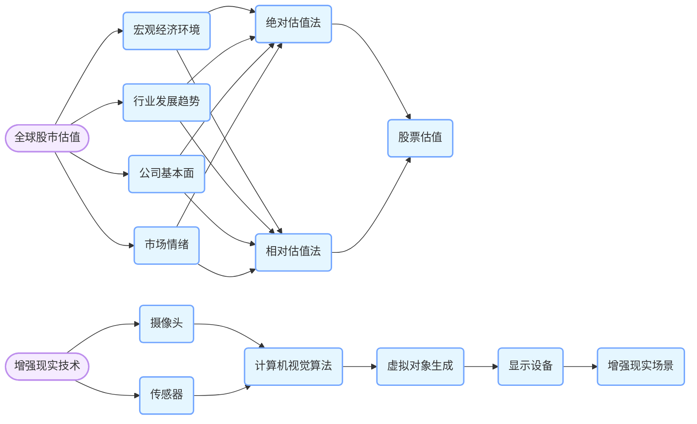

# 全球股市估值与增强现实技术在教育中的应用

> 关键词：全球股市估值、增强现实技术、教育应用、金融市场、技术创新

> 摘要：本文旨在探讨全球股市估值与增强现实技术在教育中的应用这两个看似不相关领域之间潜在的联系与各自的发展情况。首先对全球股市估值的相关概念、方法及影响因素进行深入分析，同时详细阐述增强现实技术的原理、特点及其在教育领域的具体应用方式和优势。接着通过数学模型和实际案例进一步说明两者的重要性和可行性。最后探讨这两个领域的实际应用场景、发展趋势以及面临的挑战，为投资者、教育工作者和技术爱好者提供全面的参考和启示。

## 1. 背景介绍 
### 1.1 目的和范围
本文的目的是全面且深入地研究全球股市估值以及增强现实技术在教育中的应用。对于全球股市估值，将探讨其基本概念、常用估值方法、影响因素以及在不同市场环境下的应用。而对于增强现实技术在教育中的应用，将研究其技术原理、教育应用场景、优势和面临的挑战。范围涵盖全球主要股票市场的估值情况以及增强现实技术在各级各类教育中的应用实践。

### 1.2 预期读者
本文预期读者包括金融投资者、证券分析师、教育工作者、技术开发者、教育政策制定者以及对金融市场和教育技术感兴趣的广大人群。

### 1.3 文档结构概述
本文首先介绍相关背景知识，包括目的、预期读者和文档结构。接着阐述核心概念与联系，包括全球股市估值和增强现实技术的原理及两者可能存在的联系。然后详细讲解核心算法原理、数学模型和公式，并通过项目实战案例进行说明。之后探讨实际应用场景、推荐相关工具和资源。最后总结未来发展趋势与挑战，提供常见问题解答和扩展阅读参考资料。

### 1.4 术语表
#### 1.4.1 核心术语定义
- **全球股市估值**：是指对全球范围内各个股票市场上的股票价值进行评估和判断的过程，以确定股票价格是否合理，是否具有投资价值。
- **增强现实技术（AR）**：是一种将虚拟信息与真实世界巧妙融合的技术，通过计算机图形技术和可视化技术产生现实环境中不存在的虚拟对象，并将虚拟对象准确“放置”在真实环境中，实现对现实的增强。
- **市盈率（P/E）**：是指股票价格除以每股收益（EPS）的比率，是最常用的股票估值指标之一，反映了投资者愿意为每单位收益支付的价格。
- **市净率（P/B）**：是指每股股价与每股净资产的比率，用于评估股票相对于其账面价值的估值水平。

#### 1.4.2 相关概念解释
- **股票市场**：是已经发行的股票转让、买卖和流通的场所，包括交易所市场和场外交易市场两大类别。
- **教育技术**：是指在教育中应用的各种技术手段和方法，包括信息技术、多媒体技术、虚拟现实技术等，旨在提高教育教学效果和效率。
- **虚拟对象**：是指通过计算机生成的、在现实世界中不存在的物体或场景，如3D模型、动画等。

#### 1.4.3 缩略词列表
- **AR**：增强现实技术（Augmented Reality）
- **P/E**：市盈率（Price-to-Earnings Ratio）
- **P/B**：市净率（Price-to-Book Ratio）
- **EPS**：每股收益（Earnings Per Share）

## 2. 核心概念与联系 
### 全球股市估值概念与原理
全球股市估值是金融领域的重要研究内容，其目的是评估股票的内在价值，为投资者提供决策依据。常用的估值方法包括绝对估值法和相对估值法。

绝对估值法是通过对股票未来现金流的折现来计算股票的内在价值，常见的模型有股息贴现模型（DDM）和自由现金流贴现模型（FCFF、FCFE）。相对估值法是通过比较同行业或类似公司的估值指标来评估股票的价值，常用的指标有市盈率（P/E）、市净率（P/B）、市销率（P/S）等。

全球股市估值受到多种因素的影响，包括宏观经济环境、行业发展趋势、公司基本面、市场情绪等。宏观经济环境如经济增长、通货膨胀、利率等会影响整个股票市场的估值水平；行业发展趋势决定了不同行业的前景和估值差异；公司基本面如盈利能力、资产质量、管理水平等是影响个股估值的关键因素；市场情绪则会导致股票价格的短期波动，进而影响估值的准确性。

### 增强现实技术概念与原理
增强现实技术（AR）是一种将虚拟信息与真实世界相结合的技术，它通过摄像头、传感器、显示设备等硬件设备，以及计算机图形学、图像处理、机器学习等软件技术，实现对现实场景的增强。

AR技术的工作原理主要包括以下几个步骤：首先，通过摄像头捕捉现实场景的图像或视频；然后，利用计算机视觉算法对图像或视频进行处理，识别出其中的特征点和物体；接着，根据识别结果，将虚拟对象准确地“放置”在现实场景中，并根据用户的视角和动作进行实时调整；最后，通过显示设备将增强后的现实场景呈现给用户。

### 两者之间的联系
虽然全球股市估值和增强现实技术在教育中的应用看似属于不同领域，但实际上它们之间存在一定的联系。一方面，增强现实技术的发展和应用可能会对相关企业的业绩和估值产生影响。随着AR技术在教育、娱乐、医疗等领域的广泛应用，相关企业的市场份额和盈利能力可能会提高，从而推动其股票价格上涨和估值提升。另一方面，全球股市的表现也会影响AR技术的研发和应用。当股市行情较好时，企业更容易获得融资，从而加大对AR技术的研发投入，推动技术的创新和应用；反之，当股市行情不佳时，企业的融资难度增加，可能会减少对AR技术的投入，影响技术的发展速度。

### 核心概念原理和架构的文本示意图
全球股市估值：宏观经济环境 -> 行业发展趋势 -> 公司基本面 -> 市场情绪 -> 估值方法（绝对估值法、相对估值法） -> 股票估值

增强现实技术：摄像头 -> 传感器 -> 计算机视觉算法 -> 虚拟对象生成 -> 显示设备 -> 增强现实场景

### Mermaid 流程图


## 3. 核心算法原理 & 具体操作步骤 
### 全球股市估值核心算法原理
#### 股息贴现模型（DDM）
股息贴现模型是一种基于股票未来股息现金流的绝对估值方法，其基本原理是将股票未来各期的股息按照一定的折现率折现到当前时点，从而得到股票的内在价值。

Python源代码实现：
```python
def ddm_valuation(d1, r, g):
    """
    股息贴现模型计算股票内在价值
    :param d1: 下一期股息
    :param r: 折现率
    :param g: 股息增长率
    :return: 股票内在价值
    """
    if r <= g:
        raise ValueError("折现率必须大于股息增长率")
    return d1 / (r - g)

# 示例
d1 = 2  # 下一期股息为2元
r = 0.1  # 折现率为10%
g = 0.05  # 股息增长率为5%
intrinsic_value = ddm_valuation(d1, r, g)
print(f"股票内在价值为: {intrinsic_value} 元")
```
#### 市盈率估值法
市盈率估值法是一种相对估值方法，其基本原理是通过比较同行业或类似公司的市盈率来评估股票的价值。具体操作步骤如下：
1. 选择同行业或类似公司作为可比对象。
2. 计算可比对象的平均市盈率。
3. 根据目标公司的每股收益，乘以平均市盈率，得到目标公司的股票估值。

Python源代码实现：
```python
def pe_valuation(eps, pe_ratio):
    """
    市盈率估值法计算股票价值
    :param eps: 每股收益
    :param pe_ratio: 市盈率
    :return: 股票价值
    """
    return eps * pe_ratio

# 示例
eps = 1.5  # 每股收益为1.5元
pe_ratio = 20  # 市盈率为20倍
stock_value = pe_valuation(eps, pe_ratio)
print(f"股票价值为: {stock_value} 元")
```

### 增强现实技术核心算法原理
#### 特征提取与匹配算法
特征提取与匹配算法是AR技术中的关键算法之一，其目的是从现实场景的图像或视频中提取特征点，并将其与虚拟对象的特征点进行匹配，从而实现虚拟对象的准确“放置”。常用的特征提取算法有SIFT（尺度不变特征变换）、SURF（加速稳健特征）、ORB（Oriented FAST and Rotated BRIEF）等。

Python源代码实现（使用OpenCV库的ORB算法）：
```python
import cv2
import numpy as np

def feature_matching(img1, img2):
    """
    特征提取与匹配
    :param img1: 现实场景图像
    :param img2: 虚拟对象图像
    :return: 匹配结果图像
    """
    orb = cv2.ORB_create()
    kp1, des1 = orb.detectAndCompute(img1, None)
    kp2, des2 = orb.detectAndCompute(img2, None)

    bf = cv2.BFMatcher(cv2.NORM_HAMMING, crossCheck=True)
    matches = bf.match(des1, des2)
    matches = sorted(matches, key=lambda x: x.distance)

    img3 = cv2.drawMatches(img1, kp1, img2, kp2, matches[:10], None, flags=cv2.DrawMatchesFlags_NOT_DRAW_SINGLE_POINTS)
    return img3

# 示例
img1 = cv2.imread('real_scene.jpg', 0)
img2 = cv2.imread('virtual_object.jpg', 0)
result = feature_matching(img1, img2)
cv2.imshow('Feature Matching', result)
cv2.waitKey(0)
cv2.destroyAllWindows()
```

## 4. 数学模型和公式 & 详细讲解 & 举例说明 
### 全球股市估值数学模型和公式
#### 股息贴现模型（DDM）
股息贴现模型的基本公式为：
$$V = \frac{D_1}{r - g}$$
其中，$V$ 表示股票的内在价值，$D_1$ 表示下一期股息，$r$ 表示折现率，$g$ 表示股息增长率。

详细讲解：该公式的推导基于股票的现金流折现原理，假设股票的股息以固定增长率 $g$ 增长，且折现率 $r$ 大于股息增长率 $g$。通过将未来各期的股息折现到当前时点，得到股票的内在价值。

举例说明：假设某股票下一期股息为2元，折现率为10%，股息增长率为5%，则根据股息贴现模型计算的股票内在价值为：
$$V = \frac{2}{0.1 - 0.05} = 40$$（元）

#### 市盈率估值法
市盈率估值法的公式为：
$$P = EPS \times PE$$
其中，$P$ 表示股票价格，$EPS$ 表示每股收益，$PE$ 表示市盈率。

详细讲解：该公式的原理是通过比较同行业或类似公司的市盈率，来确定目标公司的合理估值。每股收益反映了公司的盈利能力，市盈率则反映了市场对公司的预期和估值水平。

举例说明：假设某公司每股收益为1.5元，同行业平均市盈率为20倍，则根据市盈率估值法计算的股票价格为：
$$P = 1.5 \times 20 = 30$$（元）

### 增强现实技术数学模型和公式
#### 透视投影变换
透视投影变换是AR技术中用于将3D虚拟对象投影到2D图像平面的数学模型，其公式为：
$$\begin{bmatrix} x \\ y \\ w \end{bmatrix} = \begin{bmatrix} f_x & 0 & c_x \\ 0 & f_y & c_y \\ 0 & 0 & 1 \end{bmatrix} \begin{bmatrix} X \\ Y \\ Z \end{bmatrix}$$
其中，$(x, y)$ 表示2D图像平面上的像素坐标，$(X, Y, Z)$ 表示3D虚拟对象的世界坐标，$f_x$ 和 $f_y$ 分别表示相机的水平和垂直焦距，$c_x$ 和 $c_y$ 分别表示相机的主点坐标。

详细讲解：该公式描述了3D空间中的点如何投影到2D图像平面上，通过相机的内参矩阵将3D坐标转换为2D像素坐标。

举例说明：假设相机的内参矩阵为 $\begin{bmatrix} 1000 & 0 & 320 \\ 0 & 1000 & 240 \\ 0 & 0 & 1 \end{bmatrix}$，3D虚拟对象的世界坐标为 $(10, 20, 100)$，则根据透视投影变换公式计算的2D像素坐标为：
$$\begin{bmatrix} x \\ y \\ w \end{bmatrix} = \begin{bmatrix} 1000 & 0 & 320 \\ 0 & 1000 & 240 \\ 0 & 0 & 1 \end{bmatrix} \begin{bmatrix} 10 \\ 20 \\ 100 \end{bmatrix} = \begin{bmatrix} 1000 \times 10 + 320 \times 100 \\ 1000 \times 20 + 240 \times 100 \\ 100 \end{bmatrix} = \begin{bmatrix} 42000 \\ 44000 \\ 100 \end{bmatrix}$$
将齐次坐标转换为非齐次坐标，得到 $(x/w, y/w) = (420, 440)$。

## 5. 项目实战：代码实际案例和详细解释说明 
### 5.1  开发环境搭建
#### 全球股市估值项目
- **编程语言**：Python
- **开发环境**：Anaconda、PyCharm
- **相关库**：pandas、numpy、yfinance（用于获取股票数据）

#### 增强现实技术项目
- **编程语言**：Python
- **开发环境**：Anaconda、PyCharm
- **相关库**：OpenCV、numpy、matplotlib

### 5.2  源代码详细实现和代码解读
#### 全球股市估值项目
```python
import yfinance as yf
import pandas as pd
import numpy as np

# 获取股票数据
ticker = 'AAPL'  # 苹果公司股票代码
start_date = '2020-01-01'
end_date = '2021-01-01'
data = yf.download(ticker, start=start_date, end=end_date)

# 计算每股收益（假设已知）
eps = 3.2

# 计算市盈率
pe_ratio = data['Close'].mean() / eps

print(f"苹果公司的平均市盈率为: {pe_ratio}")
```
代码解读：
1. 首先使用 `yfinance` 库下载苹果公司从2020年1月1日到2021年1月1日的股票数据。
2. 假设已知每股收益为3.2元。
3. 计算股票收盘价的平均值，并除以每股收益，得到市盈率。

#### 增强现实技术项目
```python
import cv2
import numpy as np

# 加载现实场景图像和虚拟对象图像
img1 = cv2.imread('real_scene.jpg')
img2 = cv2.imread('virtual_object.jpg')

# 特征提取与匹配
orb = cv2.ORB_create()
kp1, des1 = orb.detectAndCompute(img1, None)
kp2, des2 = orb.detectAndCompute(img2, None)

bf = cv2.BFMatcher(cv2.NORM_HAMMING, crossCheck=True)
matches = bf.match(des1, des2)
matches = sorted(matches, key=lambda x: x.distance)

# 绘制匹配结果
img3 = cv2.drawMatches(img1, kp1, img2, kp2, matches[:10], None, flags=cv2.DrawMatchesFlags_NOT_DRAW_SINGLE_POINTS)

# 显示结果
cv2.imshow('Feature Matching', img3)
cv2.waitKey(0)
cv2.destroyAllWindows()
```
代码解读：
1. 首先使用 `cv2.imread` 函数加载现实场景图像和虚拟对象图像。
2. 使用 `cv2.ORB_create` 函数创建ORB特征提取器，并使用 `detectAndCompute` 方法提取特征点和描述符。
3. 使用 `cv2.BFMatcher` 函数创建暴力匹配器，并使用 `match` 方法进行特征匹配。
4. 对匹配结果进行排序，选择距离最小的前10个匹配点。
5. 使用 `cv2.drawMatches` 函数绘制匹配结果，并使用 `cv2.imshow` 函数显示结果。

### 5.3  代码解读与分析
#### 全球股市估值项目
该项目通过获取股票数据并计算市盈率，展示了如何使用Python进行简单的股市估值分析。需要注意的是，每股收益的计算需要根据公司的财务报表进行准确计算，而本示例中是假设已知的。此外，市盈率的计算结果会受到股票价格波动的影响，因此需要综合考虑多个因素进行估值分析。

#### 增强现实技术项目
该项目通过特征提取与匹配算法，实现了现实场景图像和虚拟对象图像的特征匹配。ORB算法是一种快速、高效的特征提取算法，适用于实时应用场景。在实际应用中，还需要进行相机校准、虚拟对象的3D建模和渲染等步骤，才能实现完整的增强现实效果。

## 6. 实际应用场景 
### 全球股市估值的实际应用场景
- **投资决策**：投资者可以通过对全球股市的估值分析，选择具有投资价值的股票和市场，制定合理的投资策略。例如，当某只股票的估值低于其内在价值时，投资者可以考虑买入；反之，当估值高于内在价值时，可以考虑卖出。
- **风险管理**：金融机构和投资者可以通过股市估值分析，评估投资组合的风险水平，采取相应的风险管理措施。例如，当市场整体估值过高时，投资者可以降低股票仓位，增加债券等低风险资产的配置。
- **宏观经济分析**：股市估值水平可以反映宏观经济的运行状况和市场预期。政府和政策制定者可以通过监测股市估值变化，及时调整宏观经济政策，促进经济的稳定增长。

### 增强现实技术在教育中的实际应用场景
- **学科教学**：在物理、化学、生物等学科教学中，AR技术可以将抽象的概念和复杂的实验过程以直观、生动的方式呈现给学生，帮助学生更好地理解和掌握知识。例如，在物理教学中，通过AR技术可以模拟物体的运动和力学原理；在化学教学中，可以展示分子结构和化学反应过程。
- **历史文化教育**：AR技术可以将历史文物、古迹和文化场景进行数字化还原，让学生身临其境地感受历史文化的魅力。例如，在参观博物馆时，学生可以通过AR设备获取文物的详细信息和历史背景，增强参观体验。
- **职业教育**：在职业教育中，AR技术可以为学生提供虚拟的实训环境，让学生在模拟的工作场景中进行实践操作，提高学生的职业技能和就业竞争力。例如，在汽车维修专业教学中，学生可以通过AR设备查看汽车的内部结构和维修流程，进行虚拟维修操作。

## 7. 工具和资源推荐
### 7.1 学习资源推荐
#### 7.1.1 书籍推荐
- 《证券分析》（本杰明·格雷厄姆）：被誉为投资界的圣经，系统地阐述了股票估值和投资分析的基本原理和方法。
- 《聪明的投资者》（本杰明·格雷厄姆）：是价值投资理论的经典著作，为投资者提供了实用的投资策略和风险管理方法。
- 《增强现实：原理、技术与应用》（沈旭昆）：全面介绍了增强现实技术的基本原理、关键技术和应用领域，是学习AR技术的重要参考书籍。

#### 7.1.2 在线课程
- Coursera平台上的“Financial Markets”课程：由耶鲁大学教授罗伯特·席勒主讲，深入讲解了金融市场的基本原理和投资分析方法。
- edX平台上的“Augmented Reality and Virtual Reality”课程：介绍了增强现实和虚拟现实技术的基本概念、技术原理和应用案例。
- 中国大学MOOC平台上的“教育技术学”课程：涵盖了教育技术的基本理论和方法，包括AR技术在教育中的应用。

#### 7.1.3 技术博客和网站
- 金融界网站（https://www.jrj.com.cn/）：提供全球股市行情、财经新闻、投资分析等信息，是投资者获取金融资讯的重要渠道。
- AR Insider网站（https://www.arinsider.co/）：专注于增强现实技术的新闻、分析和趋势报道，为AR技术爱好者提供最新的行业动态。
- 中国教育技术网（https://www.etc.edu.cn/）：提供教育技术领域的研究成果、教学案例和技术应用经验，是教育工作者了解教育技术发展趋势的重要平台。

### 7.2 开发工具框架推荐
#### 7.2.1 IDE和编辑器
- PyCharm：是一款专业的Python集成开发环境，提供了丰富的代码编辑、调试、测试等功能，适合Python开发者使用。
- Visual Studio Code：是一款轻量级的代码编辑器，支持多种编程语言和插件扩展，具有强大的代码编辑和调试功能。
- Unity 3D：是一款跨平台的游戏开发引擎，也可用于开发增强现实和虚拟现实应用，提供了丰富的3D建模、动画制作和物理模拟等功能。

#### 7.2.2 调试和性能分析工具
- PyCharm的调试器：可以帮助开发者调试Python代码，查看变量值、执行流程和调用栈等信息，提高代码的调试效率。
- OpenCV的调试工具：OpenCV提供了一些调试工具和可视化函数，如 `cv2.imshow`、`cv2.waitKey` 等，可以帮助开发者调试和验证图像处理算法。
- Unity 3D的性能分析器：可以帮助开发者分析和优化Unity项目的性能，查看CPU、GPU、内存等资源的使用情况，找出性能瓶颈并进行优化。

#### 7.2.3 相关框架和库
- yfinance：是一个Python库，用于获取全球股市的历史数据和实时行情，支持多种股票市场和金融产品。
- OpenCV：是一个开源的计算机视觉库，提供了丰富的图像处理、特征提取、目标检测等算法和工具，广泛应用于增强现实、计算机视觉等领域。
- ARCore和ARKit：分别是Google和Apple推出的增强现实开发平台，提供了一系列的API和工具，帮助开发者快速开发跨平台的增强现实应用。

### 7.3 相关论文著作推荐
#### 7.3.1 经典论文
- Fama, E. F., & French, K. R. (1992). The cross-section of expected stock returns. The Journal of Finance, 47(2), 427-465.：该论文提出了著名的Fama-French三因子模型，用于解释股票收益率的横截面差异。
- Azuma, R. T. (1997). A survey of augmented reality. Presence: Teleoperators and Virtual Environments, 6(4), 355-385.：这是一篇关于增强现实技术的经典综述论文，全面介绍了增强现实技术的定义、分类、关键技术和应用领域。

#### 7.3.2 最新研究成果
- 关注顶级学术会议和期刊，如ACM SIGGRAPH、IEEE International Symposium on Mixed and Augmented Reality（ISMAR）、Journal of Financial Economics等，了解全球股市估值和增强现实技术领域的最新研究成果。

#### 7.3.3 应用案例分析
- 查阅相关行业报告和案例分析，如Gartner、IDC等机构发布的报告，了解全球股市估值和增强现实技术在不同行业的应用案例和实践经验。

## 8. 总结：未来发展趋势与挑战
### 全球股市估值的未来发展趋势与挑战
#### 发展趋势
- **智能化**：随着人工智能和大数据技术的发展，股市估值将越来越依赖于智能化的分析工具和模型。机器学习和深度学习算法可以对海量的金融数据进行分析和挖掘，提高估值的准确性和效率。
- **全球化**：全球金融市场的互联互通程度越来越高，股市估值将更加注重全球市场的联动性和系统性风险。投资者需要综合考虑全球经济形势、政策变化和市场情绪等因素，进行更加全面和深入的估值分析。
- **多元化**：除了传统的估值方法和指标，未来股市估值将更加多元化。例如，考虑环境、社会和治理（ESG）因素的估值方法将越来越受到关注，以反映企业的可持续发展能力和社会责任感。

#### 挑战
- **数据质量和可靠性**：股市估值依赖于大量的金融数据，数据的质量和可靠性直接影响估值的准确性。然而，金融数据的获取和处理存在一定的困难，如数据缺失、数据错误、数据延迟等问题，需要加强数据管理和质量控制。
- **市场不确定性**：股票市场受到多种因素的影响，如宏观经济环境、政策变化、突发事件等，市场不确定性较大。这给股市估值带来了很大的挑战，需要投资者具备较强的风险意识和应对能力。
- **模型局限性**：现有的股市估值模型都存在一定的局限性，无法完全准确地反映股票的内在价值。例如，股息贴现模型假设股息以固定增长率增长，这在现实中很难实现。因此，需要不断改进和完善估值模型，提高其适用性和准确性。

### 增强现实技术在教育中的未来发展趋势与挑战
#### 发展趋势
- **融合化**：AR技术将与其他教育技术如虚拟现实（VR）、人工智能（AI）、大数据等深度融合，形成更加智能化、个性化的教育解决方案。例如，AR与AI结合可以实现智能辅导和个性化学习，根据学生的学习情况和需求提供定制化的学习内容和指导。
- **普及化**：随着硬件设备的不断发展和成本的降低，AR技术将越来越普及，走进更多的学校和课堂。未来，学生可能会通过AR设备随时随地进行学习，打破时间和空间的限制。
- **内容丰富化**：AR教育内容将越来越丰富多样，涵盖各个学科和领域。除了现有的学科教学、历史文化教育和职业教育等应用场景，AR技术还将在艺术教育、体育教育等领域发挥重要作用。

#### 挑战
- **技术瓶颈**：虽然AR技术已经取得了很大的发展，但仍然存在一些技术瓶颈，如跟踪精度、虚拟对象的渲染质量、设备的续航能力等。这些技术问题限制了AR技术在教育中的进一步应用和推广。
- **教育应用模式创新**：目前AR技术在教育中的应用还处于探索阶段，缺乏成熟的教育应用模式和教学方法。需要教育工作者和技术开发者共同探索和创新，将AR技术与教育教学深度融合，发挥其最大的教育价值。
- **教育资源建设**：AR教育资源的建设需要投入大量的人力、物力和财力，目前AR教育资源相对匮乏，且质量参差不齐。需要加强教育资源建设的统筹规划和管理，提高AR教育资源的质量和数量。

## 9. 附录：常见问题与解答
### 全球股市估值常见问题与解答
- **问题**：如何选择合适的估值方法？
**解答**：选择合适的估值方法需要考虑多个因素，如公司的行业特点、发展阶段、财务状况等。一般来说，对于稳定增长的公司，可以使用股息贴现模型或市盈率估值法；对于成长型公司，可以使用自由现金流贴现模型或市销率估值法。同时，还需要结合其他估值方法进行综合分析，以提高估值的准确性。
- **问题**：股市估值是否准确？
**解答**：股市估值是一种基于一定假设和模型的估计，存在一定的误差和不确定性。股市估值受到多种因素的影响，如宏观经济环境、行业发展趋势、公司基本面、市场情绪等，这些因素的变化都会导致估值结果的变化。因此，股市估值只能作为投资决策的参考，不能作为唯一的依据。

### 增强现实技术在教育中应用常见问题与解答
- **问题**：AR技术在教育中的应用是否会增加学生的学习负担？
**解答**：AR技术在教育中的应用旨在提高学生的学习兴趣和学习效果，减轻学生的学习负担。通过AR技术，学生可以更加直观、生动地学习知识，提高学习效率。同时，AR技术还可以提供个性化的学习体验，根据学生的学习情况和需求提供定制化的学习内容和指导，帮助学生更好地掌握知识。
- **问题**：AR设备的价格是否昂贵？
**解答**：随着技术的发展和市场竞争的加剧，AR设备的价格正在逐渐降低。目前，市场上已经有一些价格相对较低的AR设备可供选择，如AR眼镜、AR手机应用等。同时，一些学校和教育机构也会通过采购、租赁等方式为学生提供AR设备，降低学生的使用成本。

## 10. 扩展阅读 & 参考资料
### 扩展阅读
- 《金融炼金术》（乔治·索罗斯）：该书阐述了索罗斯的投资哲学和金融市场理论，对理解金融市场的运行机制和投资决策具有重要的启示作用。
- 《人类简史：从动物到上帝》（尤瓦尔·赫拉利）：虽然这本书主要探讨人类的历史和发展，但其中关于技术创新和人类社会变革的观点对于理解AR技术在教育中的应用和未来发展趋势具有一定的参考价值。

### 参考资料
- Fama, E. F., & French, K. R. (1992). The cross-section of expected stock returns. The Journal of Finance, 47(2), 427-465.
- Azuma, R. T. (1997). A survey of augmented reality. Presence: Teleoperators and Virtual Environments, 6(4), 355-385.
- 沈旭昆. 增强现实：原理、技术与应用[M]. 电子工业出版社, 2017.
- 本杰明·格雷厄姆. 证券分析[M]. 海南出版社, 2006.
- 本杰明·格雷厄姆. 聪明的投资者[M]. 人民邮电出版社, 2010.