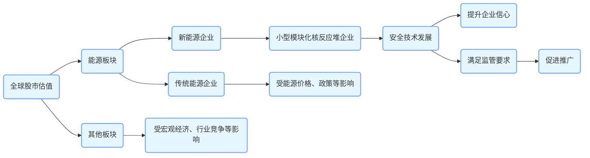

# 全球股市估值与小型模块化核反应堆安全技术的发展

> 关键词：全球股市估值、小型模块化核反应堆、安全技术、市场趋势、能源转型

> 摘要：本文深入探讨了全球股市估值与小型模块化核反应堆（SMR）安全技术发展之间的关系。首先介绍了研究的背景和相关概念，接着阐述了核心概念及其联系，分析了相关的算法原理和数学模型。通过项目实战展示了相关技术在实际中的应用，探讨了实际应用场景。同时推荐了学习、开发工具和相关论文著作。最后总结了未来发展趋势与挑战，并提供了常见问题解答和扩展阅读参考资料。旨在帮助读者全面了解全球股市估值与小型模块化核反应堆安全技术发展的内在联系和发展前景。

## 1. 背景介绍 
### 1.1 目的和范围
本研究的目的在于全面分析全球股市估值与小型模块化核反应堆安全技术发展之间的相互影响。全球股市作为经济的重要风向标，其估值变化反映了市场对不同行业的预期和信心。而小型模块化核反应堆作为新兴的能源技术，其安全技术的发展不仅关乎能源领域的未来走向，也对相关企业的市场表现产生影响。本研究的范围涵盖全球股市的主要板块和小型模块化核反应堆技术的各个方面，包括技术研发、应用推广以及安全标准制定等。

### 1.2 预期读者
本文预期读者包括金融分析师、能源行业从业者、政策制定者、科研人员以及对全球经济和能源技术发展感兴趣的一般读者。对于金融分析师，本文提供了从能源技术发展角度评估股市相关板块的新视角；能源行业从业者可以了解到股市对小型模块化核反应堆技术发展的反馈；政策制定者可以基于本文的分析制定更合理的能源和金融政策；科研人员能够获取相关领域的市场动态和技术趋势；一般读者则可以通过本文对全球股市估值和小型模块化核反应堆安全技术有更深入的了解。

### 1.3 文档结构概述
本文将按照以下结构展开：首先介绍相关背景和概念，包括核心术语和缩略词的定义；接着阐述全球股市估值与小型模块化核反应堆安全技术发展的核心概念及其联系，并用示意图和流程图进行说明；然后分析核心算法原理和具体操作步骤，结合数学模型和公式进行详细讲解；通过项目实战展示实际应用案例和代码实现；探讨实际应用场景；推荐相关的学习资源、开发工具和论文著作；最后总结未来发展趋势与挑战，提供常见问题解答和扩展阅读参考资料。

### 1.4 术语表
#### 1.4.1 核心术语定义
- **全球股市估值**：指对全球范围内股票市场上各类股票价值的评估，通常基于公司的财务状况、盈利能力、行业前景等因素。
- **小型模块化核反应堆（SMR）**：是一种功率相对较小、采用模块化设计和制造的核反应堆，具有建设周期短、成本低、安全性高等特点。
- **安全技术**：在小型模块化核反应堆领域，指用于确保反应堆安全运行、预防和应对事故的一系列技术措施，包括反应堆设计、监测系统、应急响应等方面。
- **市场趋势**：指股票市场或能源市场在一定时期内的发展方向和变化趋势，反映了市场参与者的预期和行为。
- **能源转型**：指从传统能源向清洁能源的转变过程，小型模块化核反应堆被视为能源转型中的一种潜在解决方案。

#### 1.4.2 相关概念解释
- **股票估值方法**：常见的股票估值方法包括市盈率法、市净率法、现金流折现法等。这些方法通过对公司的财务数据和未来预期进行分析，来确定股票的合理价值。
- **核反应堆安全原理**：小型模块化核反应堆的安全原理基于多重屏障、固有安全性和纵深防御等原则。多重屏障是指通过燃料包壳、反应堆压力容器、安全壳等多层结构来防止放射性物质泄漏；固有安全性是指反应堆自身具有在异常情况下自动停堆和保持安全状态的能力；纵深防御则是通过设置多道防线，在事故发生时逐步采取措施，降低事故后果。
- **能源市场动态**：能源市场受到多种因素的影响，如供需关系、地缘政治、技术进步等。小型模块化核反应堆的发展可能会改变能源市场的格局，影响传统能源和其他新能源的市场份额。

#### 1.4.3 缩略词列表
- **SMR**：小型模块化核反应堆（Small Modular Reactor）
- **NRC**：美国核管理委员会（Nuclear Regulatory Commission）
- **IAEA**：国际原子能机构（International Atomic Energy Agency）

## 2. 核心概念与联系 

### 核心概念原理
全球股市估值是投资者对上市公司未来盈利能力和发展前景的预期体现。在能源领域，传统能源公司的股市表现受到能源价格波动、政策调控等因素的影响。而随着能源转型的推进，新能源技术逐渐受到市场关注，小型模块化核反应堆作为一种有潜力的新能源技术，其安全技术的发展对相关企业的股市估值产生重要影响。

小型模块化核反应堆的安全技术是保障其商业应用的关键。安全技术的不断进步可以提高反应堆的可靠性和稳定性，降低事故风险，从而增强投资者对相关企业的信心。同时，安全技术的发展也有助于满足监管要求，为小型模块化核反应堆的大规模推广创造条件。

### 架构的文本示意图
```plaintext
全球股市估值
|
|-- 能源板块
|   |
|   |-- 传统能源企业
|   |   |-- 受能源价格、政策等影响
|   |
|   |-- 新能源企业
|       |
|       |-- 小型模块化核反应堆企业
|           |-- 受安全技术发展影响
|           |-- 安全技术进步提升企业信心
|           |-- 满足监管要求促进推广
|
|-- 其他板块
|   |-- 受宏观经济、行业竞争等影响
```

### Mermaid 流程图


## 3. 核心算法原理 & 具体操作步骤 

### 核心算法原理
在分析全球股市估值与小型模块化核反应堆安全技术发展的关系时，可以采用多因素回归分析算法。该算法的基本思想是通过建立一个多元线性回归模型，将全球股市中能源板块的估值作为因变量，将小型模块化核反应堆安全技术发展的相关指标（如安全技术研发投入、安全标准提升程度等）以及其他影响股市估值的因素（如宏观经济指标、行业竞争程度等）作为自变量，来分析各因素对股市估值的影响程度。

### Python 源代码详细阐述
```python
import pandas as pd
import numpy as np
from sklearn.linear_model import LinearRegression
from sklearn.model_selection import train_test_split
from sklearn.metrics import mean_squared_error

# 假设我们已经收集到了相关数据，存储在一个 CSV 文件中
# 数据包含能源板块股市估值、安全技术研发投入、宏观经济指标等列
data = pd.read_csv('stock_valuation_data.csv')

# 提取自变量和因变量
X = data.drop('energy_stock_valuation', axis=1)
y = data['energy_stock_valuation']

# 划分训练集和测试集
X_train, X_test, y_train, y_test = train_test_split(X, y, test_size=0.2, random_state=42)

# 创建线性回归模型
model = LinearRegression()

# 训练模型
model.fit(X_train, y_train)

# 预测测试集数据
y_pred = model.predict(X_test)

# 计算均方误差
mse = mean_squared_error(y_test, y_pred)
print(f"均方误差: {mse}")

# 查看模型系数
coefficients = pd.DataFrame({'变量': X.columns, '系数': model.coef_})
print(coefficients)
```

### 具体操作步骤
1. **数据收集**：收集全球股市中能源板块的估值数据、小型模块化核反应堆安全技术发展的相关指标数据以及其他影响股市估值的因素数据。数据可以从金融数据库、科研报告、政府统计机构等渠道获取。
2. **数据预处理**：对收集到的数据进行清洗、整理和标准化处理，确保数据的质量和一致性。
3. **模型构建**：使用 Python 的 `sklearn` 库中的 `LinearRegression` 类构建多因素回归模型。
4. **模型训练**：将处理后的数据划分为训练集和测试集，使用训练集数据对模型进行训练。
5. **模型评估**：使用测试集数据对训练好的模型进行评估，计算均方误差等评估指标，评估模型的性能。
6. **结果分析**：查看模型的系数，分析各因素对能源板块股市估值的影响程度。

## 4. 数学模型和公式 & 详细讲解 & 举例说明 

### 数学模型
多因素回归分析的数学模型可以表示为：

$$
y = \beta_0 + \beta_1x_1 + \beta_2x_2 + \cdots + \beta_nx_n + \epsilon
$$

其中：
- $y$ 是因变量，即能源板块的股市估值。
- $\beta_0$ 是截距项。
- $\beta_1, \beta_2, \cdots, \beta_n$ 是回归系数，表示各自变量对因变量的影响程度。
- $x_1, x_2, \cdots, x_n$ 是自变量，包括小型模块化核反应堆安全技术发展的相关指标以及其他影响股市估值的因素。
- $\epsilon$ 是误差项，表示模型无法解释的随机误差。

### 详细讲解
回归系数 $\beta_i$ 的正负表示自变量 $x_i$ 与因变量 $y$ 之间的正相关或负相关关系。绝对值越大，表示该自变量对因变量的影响程度越大。截距项 $\beta_0$ 表示当所有自变量都为 0 时，因变量的取值。误差项 $\epsilon$ 反映了模型的不完美性，实际数据中可能存在一些无法用自变量解释的因素。

### 举例说明
假设我们的自变量包括安全技术研发投入 $x_1$、宏观经济增长率 $x_2$ 和行业竞争程度 $x_3$，因变量为能源板块的股市估值 $y$。通过多因素回归分析得到的模型为：

$$
y = 100 + 0.5x_1 + 2x_2 - 0.3x_3 + \epsilon
$$

这意味着：
- 当安全技术研发投入每增加 1 个单位，能源板块的股市估值预计增加 0.5 个单位。
- 当宏观经济增长率每增加 1 个单位，能源板块的股市估值预计增加 2 个单位。
- 当行业竞争程度每增加 1 个单位，能源板块的股市估值预计减少 0.3 个单位。

截距项 100 表示在安全技术研发投入、宏观经济增长率和行业竞争程度都为 0 时，能源板块的股市估值为 100。误差项 $\epsilon$ 表示实际股市估值与模型预测值之间的差异。

## 5. 项目实战：代码实际案例和详细解释说明 

### 5.1  开发环境搭建
1. **安装 Python**：从 Python 官方网站（https://www.python.org/downloads/）下载并安装 Python 3.x 版本。
2. **安装必要的库**：使用 `pip` 命令安装所需的库，包括 `pandas`、`numpy`、`sklearn` 等。
```sh
pip install pandas numpy scikit-learn
```
3. **选择开发工具**：可以使用 PyCharm、Jupyter Notebook 等开发工具进行代码编写和调试。

### 5.2  源代码详细实现和代码解读
```python
import pandas as pd
import numpy as np
from sklearn.linear_model import LinearRegression
from sklearn.model_selection import train_test_split
from sklearn.metrics import mean_squared_error

# 假设我们已经收集到了相关数据，存储在一个 CSV 文件中
# 数据包含能源板块股市估值、安全技术研发投入、宏观经济指标等列
data = pd.read_csv('stock_valuation_data.csv')

# 提取自变量和因变量
# 自变量是除了能源板块股市估值之外的所有列
X = data.drop('energy_stock_valuation', axis=1)
# 因变量是能源板块股市估值
y = data['energy_stock_valuation']

# 划分训练集和测试集
# test_size=0.2 表示将 20% 的数据作为测试集
# random_state=42 是为了保证结果的可重复性
X_train, X_test, y_train, y_test = train_test_split(X, y, test_size=0.2, random_state=42)

# 创建线性回归模型
model = LinearRegression()

# 训练模型
# 使用训练集数据对模型进行训练
model.fit(X_train, y_train)

# 预测测试集数据
# 使用训练好的模型对测试集数据进行预测
y_pred = model.predict(X_test)

# 计算均方误差
# 均方误差用于评估模型的预测性能
mse = mean_squared_error(y_test, y_pred)
print(f"均方误差: {mse}")

# 查看模型系数
# 模型系数表示各自变量对因变量的影响程度
coefficients = pd.DataFrame({'变量': X.columns, '系数': model.coef_})
print(coefficients)
```

### 5.3  代码解读与分析
1. **数据读取**：使用 `pandas` 库的 `read_csv` 函数读取存储在 CSV 文件中的数据。
2. **自变量和因变量提取**：使用 `drop` 方法从数据中提取自变量，将能源板块股市估值列作为因变量。
3. **训练集和测试集划分**：使用 `train_test_split` 函数将数据划分为训练集和测试集，以便评估模型的性能。
4. **模型创建和训练**：使用 `LinearRegression` 类创建线性回归模型，并使用训练集数据对模型进行训练。
5. **预测和评估**：使用训练好的模型对测试集数据进行预测，并计算均方误差来评估模型的预测性能。
6. **模型系数查看**：通过查看模型的系数，可以分析各自变量对因变量的影响程度。

## 6. 实际应用场景 
### 金融投资决策
金融投资者可以通过分析全球股市估值与小型模块化核反应堆安全技术发展的关系，来制定投资策略。如果安全技术不断进步，相关企业的股市估值可能会上升，投资者可以考虑增加对这些企业的投资。相反，如果安全技术发展遇到瓶颈或出现安全事故，投资者可能需要调整投资组合，减少对相关企业的投资。

### 能源企业战略规划
能源企业可以根据全球股市对小型模块化核反应堆技术的反馈，制定战略规划。如果股市对该技术的发展前景看好，企业可以加大在安全技术研发和反应堆建设方面的投入，以抢占市场先机。如果股市对该技术的信心不足，企业可能需要重新评估技术路线和市场策略，加强安全技术宣传和公关工作，提高市场认可度。

### 政策制定
政策制定者可以参考全球股市估值与小型模块化核反应堆安全技术发展的关系，制定相关政策。如果股市反映出市场对该技术的需求和信心，政策制定者可以出台支持性政策，如补贴、税收优惠等，促进技术的研发和应用。如果股市对该技术存在担忧，政策制定者需要加强监管，提高安全标准，保障公众利益。

### 科研机构研究方向调整
科研机构可以根据全球股市对小型模块化核反应堆安全技术的关注焦点，调整研究方向。如果股市对安全技术的某个方面（如新型安全系统设计、事故预防技术等）给予较高的关注度，科研机构可以加大在这些方面的研究投入，提高技术水平，为企业和市场提供更好的技术支持。

## 7. 工具和资源推荐
### 7.1 学习资源推荐
#### 7.1.1 书籍推荐
- 《金融市场与金融机构》：这本书全面介绍了金融市场的基本概念、运行机制和金融机构的业务活动，有助于读者了解全球股市的基本原理和运作方式。
- 《核能技术基础》：详细介绍了核能的基本原理、核反应堆的设计和运行、核安全等方面的知识，为读者深入了解小型模块化核反应堆技术提供了基础。
- 《回归分析及其应用》：系统阐述了回归分析的理论和方法，包括多因素回归分析的原理和应用，对于理解和应用相关算法有很大帮助。

#### 7.1.2 在线课程
- Coursera 上的“金融市场”课程：由知名大学的教授授课，讲解金融市场的理论和实践，包括股票市场的估值方法和分析技巧。
- edX 上的“核能工程基础”课程：介绍核能工程的基本概念、核反应堆技术和核安全知识，适合对小型模块化核反应堆技术感兴趣的学习者。
- 网易云课堂上的“Python 数据分析与机器学习实战”课程：通过实际案例讲解 Python 在数据分析和机器学习中的应用，帮助读者掌握多因素回归分析等算法的实现。

#### 7.1.3 技术博客和网站
- 雪球网：是一个专注于股票投资的社区，提供全球股市的行情、分析和讨论，读者可以在这里了解到市场对不同行业和企业的看法。
- 国际原子能机构（IAEA）官网：提供关于核能技术、核安全和核政策的最新信息和研究成果，是了解小型模块化核反应堆技术发展的重要渠道。
- 博客园：有很多技术博主分享数据分析、机器学习等方面的经验和技巧，对于学习相关算法和代码实现有很大帮助。

### 7.2 开发工具框架推荐
#### 7.2.1 IDE和编辑器
- PyCharm：是一款专门为 Python 开发设计的集成开发环境，具有代码自动补全、调试、版本控制等功能，适合专业开发者使用。
- Jupyter Notebook：是一个交互式的开发环境，支持 Python、R 等多种编程语言，适合数据探索和模型开发。
- Visual Studio Code：是一款轻量级的代码编辑器，支持多种编程语言和插件扩展，具有丰富的功能和良好的用户体验。

#### 7.2.2 调试和性能分析工具
- `pdb`：是 Python 内置的调试工具，可以帮助开发者在代码中设置断点、单步执行代码、查看变量值等，进行代码调试。
- `cProfile`：是 Python 标准库中的性能分析工具，可以分析代码的执行时间和函数调用情况，帮助开发者优化代码性能。
- `Scikit-learn` 中的 `cross_val_score` 函数：可以用于模型的交叉验证，评估模型的性能和稳定性。

#### 7.2.3 相关框架和库
- `pandas`：是一个强大的数据处理和分析库，提供了高效的数据结构和数据操作方法，适合处理和分析股市数据和技术指标数据。
- `numpy`：是 Python 中用于科学计算的基础库，提供了高性能的多维数组对象和数学函数，用于数值计算和矩阵运算。
- `scikit-learn`：是一个常用的机器学习库，提供了各种机器学习算法和工具，包括线性回归、决策树、支持向量机等，适合进行多因素回归分析和模型评估。

### 7.3 相关论文著作推荐
#### 7.3.1 经典论文
- 《Stock Market Valuation and Energy Technology Innovation》：探讨了股市估值与能源技术创新之间的关系，为分析全球股市估值与小型模块化核反应堆安全技术发展的关系提供了理论基础。
- 《Safety Technology Development of Small Modular Reactors: A Review》：对小型模块化核反应堆安全技术的发展进行了全面的综述，介绍了相关技术的原理、应用和发展趋势。
- 《Multivariate Regression Analysis in Financial Market Research》：详细阐述了多因素回归分析在金融市场研究中的应用，包括模型构建、参数估计和模型评估等方面的内容。

#### 7.3.2 最新研究成果
- 国际能源署（IEA）发布的关于小型模块化核反应堆技术的研究报告，介绍了该技术的最新发展动态和市场前景。
- 顶级学术期刊（如《Nature Energy》、《Science》等）上发表的关于核能技术和金融市场的研究论文，反映了该领域的最新研究成果和前沿观点。

#### 7.3.3 应用案例分析
- 某些国家或地区在小型模块化核反应堆技术研发和应用过程中的实际案例分析，包括技术创新、政策支持、市场推广等方面的经验和教训。
- 金融机构对能源企业进行估值和投资决策的实际案例分析，展示了如何将全球股市估值与小型模块化核反应堆安全技术发展的关系应用到实际投资中。

## 8. 总结：未来发展趋势与挑战
### 未来发展趋势
- **技术创新加速**：随着科技的不断进步，小型模块化核反应堆的安全技术将不断创新和完善。新型的安全系统、材料和设计理念将不断涌现，提高反应堆的安全性和可靠性。
- **市场需求增长**：随着全球对清洁能源的需求不断增加，小型模块化核反应堆作为一种清洁、高效的能源技术，将受到越来越多的关注和市场需求。相关企业的股市估值有望上升，吸引更多的投资和资源进入该领域。
- **政策支持加强**：为了推动能源转型和应对气候变化，各国政府将加强对小型模块化核反应堆技术的政策支持。出台更多的补贴、税收优惠和监管政策，促进技术的研发和应用。
- **国际合作加深**：小型模块化核反应堆技术的发展需要全球范围内的合作和资源共享。各国将加强在技术研发、安全标准制定和人才培养等方面的合作，共同推动该技术的发展。

### 挑战
- **安全风险**：尽管小型模块化核反应堆具有较高的安全性，但核安全问题仍然是社会关注的焦点。一旦发生安全事故，将对公众健康和环境造成严重影响，也会影响股市对相关企业的信心。
- **成本压力**：小型模块化核反应堆的研发、建设和运营成本仍然较高，需要大量的资金投入。如何降低成本，提高经济效益，是该技术商业化推广的关键挑战。
- **公众接受度**：由于核能源的特殊性，公众对小型模块化核反应堆的接受度存在差异。需要加强公众宣传和科普教育，提高公众对核安全和核能源的认识和理解。
- **监管标准不一致**：不同国家和地区对小型模块化核反应堆的监管标准存在差异，这给技术的国际合作和推广带来了一定的困难。需要加强国际间的协调和统一，制定更加科学、合理的监管标准。

## 9. 附录：常见问题与解答
### 问题 1：小型模块化核反应堆与传统核反应堆有什么区别？
解答：小型模块化核反应堆与传统核反应堆相比，具有功率相对较小、采用模块化设计和制造、建设周期短、成本低、安全性高等特点。模块化设计使得反应堆可以在工厂中进行标准化制造，然后运输到现场进行组装，提高了建设效率和质量。

### 问题 2：如何评估小型模块化核反应堆的安全技术水平？
解答：可以从多个方面评估小型模块化核反应堆的安全技术水平，包括反应堆的设计理念、安全系统的性能、事故预防和应对能力、安全标准的遵循情况等。国际原子能机构（IAEA）和各国核监管机构都制定了相关的安全标准和评估方法。

### 问题 3：全球股市估值对小型模块化核反应堆技术发展有什么影响？
解答：全球股市估值反映了市场对小型模块化核反应堆相关企业的预期和信心。如果股市估值上升，说明市场对该技术的发展前景看好，相关企业可以更容易地获得融资，加大在技术研发和应用方面的投入，促进技术的发展。相反，如果股市估值下降，企业可能面临融资困难，影响技术的发展进程。

### 问题 4：多因素回归分析在分析全球股市估值与小型模块化核反应堆安全技术发展关系中有什么作用？
解答：多因素回归分析可以帮助我们量化各因素对全球股市中能源板块估值的影响程度。通过建立多元线性回归模型，将小型模块化核反应堆安全技术发展的相关指标以及其他影响股市估值的因素作为自变量，能源板块估值作为因变量，可以分析各因素的重要性和相关性，为投资决策、政策制定等提供依据。

### 问题 5：小型模块化核反应堆技术的发展对能源市场有什么影响？
解答：小型模块化核反应堆技术的发展可能会改变能源市场的格局。作为一种清洁、高效的能源技术，它可以增加能源供应的多样性，减少对传统化石能源的依赖。同时，也可能会对其他新能源技术（如太阳能、风能等）的市场份额产生一定的影响，促进能源市场的竞争和发展。

## 10. 扩展阅读 & 参考资料
### 扩展阅读
- 《能源转型：从化石能源到清洁能源》：深入探讨了全球能源转型的背景、趋势和挑战，以及各种清洁能源技术的发展前景。
- 《核安全文化：理论与实践》：介绍了核安全文化的概念、内涵和重要性，以及如何在核反应堆的设计、建设和运营中培育和践行核安全文化。
- 《金融科技与投资决策》：探讨了金融科技在投资决策中的应用，包括数据分析、机器学习等技术在股市估值和投资策略制定中的作用。

### 参考资料
- 国际能源署（IEA）官方报告
- 国际原子能机构（IAEA）官方文件和研究报告
- 各国核监管机构发布的相关法规和标准
- 金融数据库（如 Bloomberg、Wind 等）提供的股市数据和分析报告
- 学术期刊（如《Energy Policy》、《Nuclear Engineering and Design》等）上发表的相关研究论文