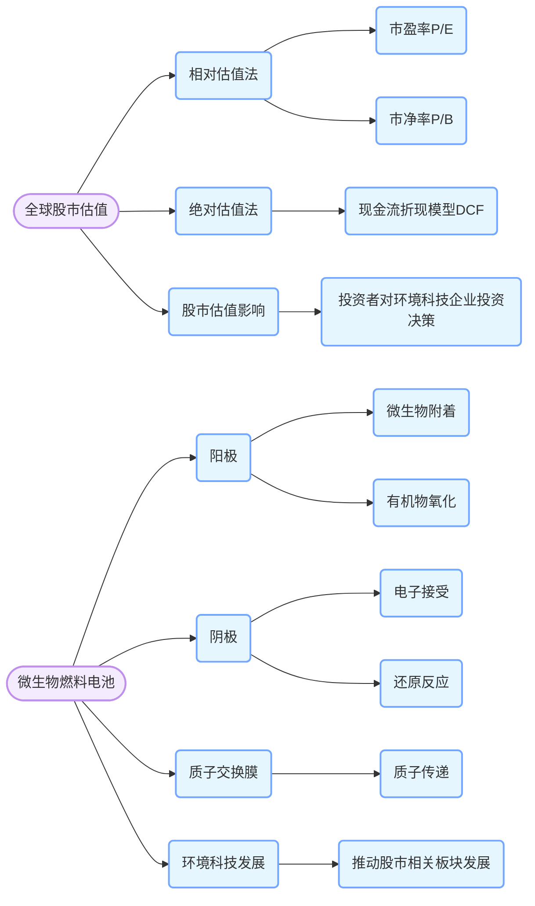

# 全球股市估值与微生物燃料电池在环境修复中的应用

> 关键词：全球股市估值、微生物燃料电池、环境修复、金融与科技融合、估值模型、电池原理

> 摘要：本文深入探讨了两个看似不相关却蕴含潜在联系的领域，即全球股市估值和微生物燃料电池在环境修复中的应用。在全球股市估值部分，介绍了多种估值方法和影响因素，分析了如何准确评估股市价值。在微生物燃料电池方面，详细阐述了其原理、结构以及在环境修复中的具体应用方式和优势。同时，探索了这两个领域可能存在的关联，如金融市场对环境科技产业的投资影响等。旨在为读者提供全面、深入的专业知识，促进金融与科技领域的跨学科思考。

## 1. 背景介绍 
### 1.1 目的和范围
本文的主要目的是全面且深入地研究全球股市估值以及微生物燃料电池在环境修复中的应用这两个领域。对于全球股市估值，旨在梳理常见的估值方法、影响因素，为投资者和金融从业者提供准确评估股市价值的思路和方法。对于微生物燃料电池在环境修复中的应用，将详细介绍其原理、应用场景和优势，推动该技术在环境领域的进一步发展。范围涵盖了全球主要股票市场的估值分析，以及微生物燃料电池在不同环境修复场景中的应用案例和研究成果。

### 1.2 预期读者
本文预期读者包括金融领域的投资者、分析师、研究员，环境科学领域的科研人员、工程师，以及对金融与科技融合感兴趣的跨学科学习者。金融从业者可以从本文中获取股市估值的新视角和方法，环境科学工作者能够了解微生物燃料电池在环境修复中的前沿应用，跨学科学习者则可以探索两个领域之间的潜在联系。

### 1.3 文档结构概述
本文首先对全球股市估值和微生物燃料电池在环境修复中的应用进行背景介绍，包括目的、预期读者和文档结构。接着分别阐述两个领域的核心概念与联系，详细讲解核心算法原理和具体操作步骤，介绍相关的数学模型和公式。然后通过项目实战案例展示具体的代码实现和应用。再探讨实际应用场景，推荐学习资源、开发工具和相关论文著作。最后总结未来发展趋势与挑战，提供常见问题解答和扩展阅读参考资料。

### 1.4 术语表
#### 1.4.1 核心术语定义
- **全球股市估值**：指对全球范围内各个股票市场的整体价值进行评估，以确定股票市场是否被高估或低估，为投资决策提供依据。
- **微生物燃料电池**：是一种利用微生物作为催化剂，将有机物中的化学能直接转化为电能的装置，在环境修复和能源生产方面具有重要应用价值。
- **环境修复**：指采取物理、化学或生物等方法，对受污染的环境进行治理和恢复，使其达到环境质量标准的过程。

#### 1.4.2 相关概念解释
- **市盈率（P/E）**：是指股票价格与每股收益的比率，是衡量股票估值的常用指标之一。较高的市盈率可能表示市场对该股票的未来盈利预期较高，但也可能意味着股票被高估。
- **市净率（P/B）**：是指股票价格与每股净资产的比率，反映了市场对公司资产价值的认可程度。市净率较低的股票可能具有一定的投资价值。
- **阳极**：在微生物燃料电池中，阳极是微生物附着和氧化有机物的场所，电子从阳极产生并通过外电路流向阴极。
- **阴极**：阴极是接受电子并发生还原反应的地方，通常使用氧气或其他氧化剂作为电子受体。

#### 1.4.3 缩略词列表
- **P/E**：市盈率（Price-to-Earnings Ratio）
- **P/B**：市净率（Price-to-Book Ratio）
- **MFC**：微生物燃料电池（Microbial Fuel Cell）

## 2. 核心概念与联系 

### 全球股市估值核心概念
全球股市估值是金融领域的重要课题，其核心在于确定股票市场的合理价值。常见的估值方法包括相对估值法和绝对估值法。相对估值法通过比较不同股票或市场的市盈率、市净率等指标来评估其相对价值。例如，如果某只股票的市盈率低于同行业平均水平，可能被认为具有投资价值。绝对估值法主要基于股票的内在价值，如现金流折现模型（DCF），通过预测公司未来的现金流并将其折现到当前来确定股票的价值。

### 微生物燃料电池核心概念
微生物燃料电池是一种将微生物代谢与电化学过程相结合的新型能源装置。其基本原理是利用微生物在阳极表面氧化有机物，产生电子和质子。电子通过外电路流向阴极，形成电流，质子则通过质子交换膜扩散到阴极，与电子和氧化剂（如氧气）发生还原反应。微生物燃料电池具有结构简单、操作条件温和、能处理有机废弃物等优点。

### 两者联系
虽然全球股市估值和微生物燃料电池在环境修复中的应用看似没有直接联系，但实际上存在一定的关联。随着全球对环境保护的重视程度不断提高，微生物燃料电池等环境科技产业逐渐受到金融市场的关注。股市估值可以影响投资者对环境科技企业的投资决策，如果股市整体估值较高，投资者可能更愿意投资新兴的环境科技企业，从而推动微生物燃料电池技术的研发和应用。反之，如果股市估值较低，投资者可能会更加谨慎，对环境科技企业的投资也会相应减少。

### 核心概念原理和架构的文本示意图
```plaintext
全球股市估值
|-- 相对估值法
|   |-- 市盈率（P/E）
|   |-- 市净率（P/B）
|-- 绝对估值法
|   |-- 现金流折现模型（DCF）

微生物燃料电池
|-- 阳极
|   |-- 微生物附着
|   |-- 有机物氧化
|-- 阴极
|   |-- 电子接受
|   |-- 还原反应
|-- 质子交换膜
|   |-- 质子传递

两者联系
|-- 股市估值影响
|   |-- 投资者对环境科技企业投资决策
|-- 环境科技发展
|   |-- 推动股市相关板块发展
```

### Mermaid 流程图


## 3. 核心算法原理 & 具体操作步骤 

### 全球股市估值算法原理及Python实现
#### 市盈率（P/E）估值法
市盈率是最常用的股票估值指标之一，其计算公式为：
$$P/E = \frac{股票价格}{每股收益}$$
通过比较不同股票或市场的市盈率，可以判断其相对估值水平。以下是一个简单的Python代码示例，用于计算某只股票的市盈率：
```python
def calculate_pe(stock_price, earnings_per_share):
    """
    计算股票的市盈率
    :param stock_price: 股票价格
    :param earnings_per_share: 每股收益
    :return: 市盈率
    """
    if earnings_per_share == 0:
        return float('inf')
    return stock_price / earnings_per_share

# 示例数据
stock_price = 50
earnings_per_share = 2
pe_ratio = calculate_pe(stock_price, earnings_per_share)
print(f"该股票的市盈率为: {pe_ratio}")
```
#### 现金流折现模型（DCF）
现金流折现模型是一种基于公司未来现金流的绝对估值方法。其基本思想是将公司未来的现金流折现到当前，得到公司的内在价值。计算公式如下：
$$V = \sum_{t=1}^{n} \frac{CF_t}{(1 + r)^t}$$
其中，$V$ 表示公司的内在价值，$CF_t$ 表示第 $t$ 期的现金流，$r$ 表示折现率，$n$ 表示预测期数。以下是一个简单的Python实现：
```python
def dcf_valuation(cash_flows, discount_rate):
    """
    现金流折现模型估值
    :param cash_flows: 未来现金流列表
    :param discount_rate: 折现率
    :return: 公司内在价值
    """
    value = 0
    for t, cf in enumerate(cash_flows, start=1):
        value += cf / ((1 + discount_rate) ** t)
    return value

# 示例数据
cash_flows = [100, 120, 150, 180, 200]
discount_rate = 0.1
intrinsic_value = dcf_valuation(cash_flows, discount_rate)
print(f"公司的内在价值为: {intrinsic_value}")
```

### 微生物燃料电池产电原理及操作步骤
#### 原理
微生物燃料电池的产电过程主要包括以下几个步骤：
1. **有机物氧化**：微生物在阳极表面附着并利用有机物作为底物进行代谢，产生电子和质子。
2. **电子传递**：产生的电子通过微生物的电子传递链或外排机制传递到阳极，然后通过外电路流向阴极。
3. **质子传递**：质子通过质子交换膜从阳极扩散到阴极。
4. **还原反应**：在阴极，电子、质子和氧化剂（如氧气）发生还原反应，形成水或其他产物。

#### 操作步骤
1. **构建电池装置**：选择合适的阳极和阴极材料，搭建微生物燃料电池的基本结构。阳极通常使用碳材料，如碳毡、碳布等，阴极可以使用铂等催化剂负载的碳材料。
2. **接种微生物**：将含有微生物的活性污泥或纯培养物接种到阳极室中，为微生物提供适宜的生长环境。
3. **添加底物**：向阳极室中添加有机物作为底物，如葡萄糖、乙酸等，为微生物提供能量。
4. **连接外电路**：将阳极和阴极通过外电路连接起来，形成闭合回路，使电子能够流动产生电流。
5. **监测和优化**：定期监测电池的电压、电流等参数，根据监测结果调整操作条件，如底物浓度、温度等，以提高电池的性能。

以下是一个简单的Python代码示例，用于模拟微生物燃料电池的产电过程：
```python
import numpy as np
import matplotlib.pyplot as plt

# 模拟参数
time_steps = 100
substrate_concentration = 100  # 底物初始浓度
microbe_growth_rate = 0.1  # 微生物生长速率
electron_yield = 0.5  # 电子产率

# 初始化数组
substrate = np.zeros(time_steps)
current = np.zeros(time_steps)

# 初始值
substrate[0] = substrate_concentration

# 模拟过程
for t in range(1, time_steps):
    # 微生物消耗底物
    substrate_consumed = microbe_growth_rate * substrate[t - 1]
    substrate[t] = substrate[t - 1] - substrate_consumed
    
    # 产生电子和电流
    electrons_generated = electron_yield * substrate_consumed
    current[t] = electrons_generated

# 绘制结果
plt.figure(figsize=(10, 6))
plt.plot(range(time_steps), substrate, label='底物浓度')
plt.plot(range(time_steps), current, label='电流')
plt.xlabel('时间步')
plt.ylabel('浓度/电流')
plt.title('微生物燃料电池产电模拟')
plt.legend()
plt.show()
```

## 4. 数学模型和公式 & 详细讲解 & 举例说明 

### 全球股市估值数学模型
#### 市盈率（P/E）模型
市盈率模型是一种简单直观的估值方法，其基本公式为：
$$P/E = \frac{股票价格}{每股收益}$$
该公式表示投资者为了获得每股一元的收益愿意支付的价格。例如，某只股票的价格为50元，每股收益为2元，则其市盈率为 $50 \div 2 = 25$ 倍。一般来说，市盈率较高的股票可能表示市场对其未来盈利增长预期较高，但也可能存在高估的风险；市盈率较低的股票可能被低估，但也可能反映出公司的盈利能力较弱。

#### 市净率（P/B）模型
市净率模型通过比较股票价格与每股净资产的比率来评估股票的价值，公式为：
$$P/B = \frac{股票价格}{每股净资产}$$
每股净资产是指公司的净资产除以总股本。市净率反映了市场对公司资产价值的认可程度。例如，某只股票的价格为30元，每股净资产为10元，则其市净率为 $30 \div 10 = 3$ 倍。一般来说，市净率较低的股票可能具有一定的投资价值，但需要注意公司资产的质量和盈利能力。

#### 现金流折现模型（DCF）
现金流折现模型是一种基于公司未来现金流的绝对估值方法，其公式为：
$$V = \sum_{t=1}^{n} \frac{CF_t}{(1 + r)^t}$$
其中，$V$ 表示公司的内在价值，$CF_t$ 表示第 $t$ 期的现金流，$r$ 表示折现率，$n$ 表示预测期数。折现率 $r$ 反映了投资者对资金时间价值和风险的要求。例如，假设某公司未来5年的现金流分别为100万元、120万元、150万元、180万元和200万元，折现率为10%，则该公司的内在价值为：
$$V = \frac{100}{(1 + 0.1)^1} + \frac{120}{(1 + 0.1)^2} + \frac{150}{(1 + 0.1)^3} + \frac{180}{(1 + 0.1)^4} + \frac{200}{(1 + 0.1)^5} \approx 598.77 \text{万元}$$

### 微生物燃料电池数学模型
#### 底物消耗模型
微生物在阳极利用有机物作为底物进行代谢，底物的消耗可以用一级反应动力学模型来描述：
$$\frac{dS}{dt} = -kS$$
其中，$S$ 表示底物浓度，$t$ 表示时间，$k$ 表示底物消耗速率常数。对该方程进行积分可得：
$$S = S_0 e^{-kt}$$
其中，$S_0$ 表示底物的初始浓度。例如，假设底物的初始浓度为100 mg/L，底物消耗速率常数为0.1 h$^{-1}$，则经过5小时后，底物浓度为：
$$S = 100 e^{-0.1 \times 5} \approx 60.65 \text{mg/L}$$

#### 产电模型
微生物燃料电池的产电过程可以用能斯特方程来描述：
$$E = E^0 - \frac{RT}{nF} \ln Q$$
其中，$E$ 表示电池的电动势，$E^0$ 表示标准电动势，$R$ 表示气体常数，$T$ 表示温度，$n$ 表示电子转移数，$F$ 表示法拉第常数，$Q$ 表示反应商。例如，在标准状态下（$T = 298 K$，$R = 8.314 J/(mol \cdot K)$，$F = 96485 C/mol$），某微生物燃料电池的标准电动势为0.5 V，电子转移数为2，反应商为0.1，则电池的电动势为：
$$E = 0.5 - \frac{8.314 \times 298}{2 \times 96485} \ln 0.1 \approx 0.53 V$$

## 5. 项目实战：代码实际案例和详细解释说明 

### 5.1  开发环境搭建
#### 全球股市估值项目
- **编程语言**：Python 3.x
- **开发环境**：推荐使用 Anaconda 集成环境，它包含了常用的科学计算库和工具。
- **必要库**：`pandas` 用于数据处理和分析，`numpy` 用于数值计算，`matplotlib` 用于数据可视化。可以使用以下命令安装：
```sh
pip install pandas numpy matplotlib
```

#### 微生物燃料电池模拟项目
- **编程语言**：Python 3.x
- **开发环境**：同样使用 Anaconda 环境。
- **必要库**：除了 `pandas`、`numpy` 和 `matplotlib` 外，还可以使用 `scipy` 进行科学计算。安装命令如下：
```sh
pip install scipy
```

### 5.2  源代码详细实现和代码解读
#### 全球股市估值项目
```python
import pandas as pd
import numpy as np
import matplotlib.pyplot as plt

# 模拟股票数据
data = {
    '股票代码': ['A', 'B', 'C', 'D', 'E'],
    '股票价格': [50, 60, 40, 70, 80],
    '每股收益': [2, 3, 1.5, 2.5, 3.5],
    '每股净资产': [10, 15, 8, 12, 18]
}
df = pd.DataFrame(data)

# 计算市盈率和市净率
df['市盈率'] = df['股票价格'] / df['每股收益']
df['市净率'] = df['股票价格'] / df['每股净资产']

# 绘制市盈率和市净率柱状图
plt.figure(figsize=(12, 6))
plt.subplot(1, 2, 1)
plt.bar(df['股票代码'], df['市盈率'])
plt.xlabel('股票代码')
plt.ylabel('市盈率')
plt.title('各股票市盈率')

plt.subplot(1, 2, 2)
plt.bar(df['股票代码'], df['市净率'])
plt.xlabel('股票代码')
plt.ylabel('市净率')
plt.title('各股票市净率')

plt.show()
```
**代码解读**：
1. 首先，使用 `pandas` 库创建一个包含股票价格、每股收益和每股净资产的 DataFrame。
2. 然后，通过简单的除法运算计算每只股票的市盈率和市净率，并将结果添加到 DataFrame 中。
3. 最后，使用 `matplotlib` 库绘制市盈率和市净率的柱状图，直观展示各股票的估值情况。

#### 微生物燃料电池模拟项目
```python
import numpy as np
import matplotlib.pyplot as plt
from scipy.integrate import odeint

# 定义底物消耗模型
def substrate_consumption(S, t, k):
    """
    底物消耗模型
    :param S: 底物浓度
    :param t: 时间
    :param k: 底物消耗速率常数
    :return: 底物浓度变化率
    """
    return -k * S

# 模拟参数
S0 = 100  # 底物初始浓度
k = 0.1  # 底物消耗速率常数
t = np.linspace(0, 10, 100)  # 时间范围

# 求解底物消耗方程
S = odeint(substrate_consumption, S0, t, args=(k,))

# 绘制底物浓度随时间变化曲线
plt.figure(figsize=(8, 6))
plt.plot(t, S, label='底物浓度')
plt.xlabel('时间 (h)')
plt.ylabel('底物浓度 (mg/L)')
plt.title('微生物燃料电池底物消耗模拟')
plt.legend()
plt.show()
```
**代码解读**：
1. 定义了一个底物消耗模型的函数 `substrate_consumption`，该函数根据一级反应动力学方程计算底物浓度的变化率。
2. 设置了底物初始浓度、底物消耗速率常数和时间范围等参数。
3. 使用 `scipy` 库的 `odeint` 函数求解底物消耗方程，得到底物浓度随时间的变化曲线。
4. 最后，使用 `matplotlib` 库绘制底物浓度随时间变化的曲线，直观展示微生物燃料电池中底物的消耗过程。

### 5.3  代码解读与分析
#### 全球股市估值项目分析
通过计算市盈率和市净率，并绘制柱状图，我们可以直观地比较不同股票的估值情况。市盈率较高的股票可能被市场高估，而市盈率较低的股票可能具有投资价值。市净率则反映了股票价格与每股净资产的关系，市净率较低的股票可能更具吸引力。在实际应用中，还需要结合公司的基本面、行业前景等因素进行综合分析。

#### 微生物燃料电池模拟项目分析
通过模拟底物消耗过程，我们可以了解微生物在阳极利用底物的情况。底物消耗速率常数 $k$ 决定了底物消耗的速度，通过调整该参数可以模拟不同的实验条件。该模拟结果可以为微生物燃料电池的设计和优化提供参考，例如确定合适的底物添加量和反应时间。

## 6. 实际应用场景 

### 全球股市估值应用场景
#### 投资决策
投资者可以利用股市估值方法评估不同股票或市场的投资价值，选择被低估的股票进行投资，以获取更高的收益。例如，通过比较不同行业的市盈率和市净率，投资者可以发现具有潜力的行业和公司。
#### 市场分析
金融分析师可以使用股市估值模型对全球股票市场进行分析，判断市场的整体估值水平和走势。如果市场整体市盈率过高，可能预示着市场存在泡沫，投资者需要谨慎操作。
#### 风险管理
企业和金融机构可以通过股市估值评估自身的市场价值和风险水平，制定合理的风险管理策略。例如，企业可以根据自身的估值情况决定是否进行股权融资或并购等活动。

### 微生物燃料电池在环境修复中的应用场景
#### 污水处理
微生物燃料电池可以利用污水中的有机物作为底物产生电能，同时实现污水的净化。在污水处理厂中，微生物燃料电池可以与传统的污水处理工艺相结合，提高污水处理效率，降低能源消耗。
#### 土壤修复
受污染的土壤中往往含有大量的有机物，微生物燃料电池可以利用这些有机物产生电能，同时促进土壤中微生物的生长和代谢，加速污染物的降解和修复。
#### 海洋环境修复
海洋中存在着大量的有机废弃物和污染物，微生物燃料电池可以在海洋环境中发挥作用，利用海洋中的有机物产生电能，同时减少海洋污染。

## 7. 工具和资源推荐
### 7.1 学习资源推荐
#### 7.1.1 书籍推荐
- 《金融市场与金融机构基础》：全面介绍了金融市场和金融机构的基本概念、运作机制和分析方法，对于理解全球股市估值有很大帮助。
- 《环境科学概论》：涵盖了环境科学的各个方面，包括环境修复的原理和方法，有助于深入了解微生物燃料电池在环境修复中的应用。
- 《Python数据分析实战》：详细介绍了 Python 在数据分析中的应用，对于使用 Python 进行股市估值和微生物燃料电池模拟非常有帮助。

#### 7.1.2 在线课程
- Coursera 上的“金融市场”课程：由知名教授授课，系统讲解了金融市场的理论和实践，包括股市估值方法。
- edX 上的“环境科学与可持续发展”课程：提供了环境科学领域的前沿知识和实践案例，涉及微生物燃料电池等环境修复技术。
- 网易云课堂上的“Python 数据分析入门”课程：适合初学者学习 Python 数据分析的基本技能和方法。

#### 7.1.3 技术博客和网站
- 雪球网：是国内知名的财经社区，提供了丰富的股市分析和投资经验分享，对于学习股市估值有很大帮助。
- 环境科学前沿网：专注于环境科学领域的最新研究成果和技术应用，包含了微生物燃料电池等环境修复技术的相关资讯。
- 开源中国：提供了大量的开源代码和技术文章，对于学习 Python 编程和相关项目开发非常有帮助。

### 7.2 开发工具框架推荐
#### 7.2.1 IDE和编辑器
- PyCharm：是一款专业的 Python 集成开发环境，具有强大的代码编辑、调试和分析功能，适合开发复杂的 Python 项目。
- Jupyter Notebook：是一种交互式的开发环境，适合进行数据探索和可视化分析，非常适合股市估值和微生物燃料电池模拟项目的开发。
- Visual Studio Code：是一款轻量级的代码编辑器，支持多种编程语言和插件扩展，具有良好的用户体验。

#### 7.2.2 调试和性能分析工具
- `pdb`：是 Python 自带的调试工具，可以帮助开发者定位和解决代码中的问题。
- `cProfile`：是 Python 的性能分析工具，可以分析代码的运行时间和函数调用情况，帮助开发者优化代码性能。
- Py-Spy：是一个跨平台的 Python 性能分析工具，可以实时监控 Python 程序的运行状态，找出性能瓶颈。

#### 7.2.3 相关框架和库
- `pandas`：是 Python 中用于数据处理和分析的重要库，提供了丰富的数据结构和函数，方便进行股市数据和实验数据的处理。
- `numpy`：是 Python 中用于数值计算的基础库，提供了高效的数组操作和数学函数，对于微生物燃料电池模拟中的数值计算非常有用。
- `matplotlib`：是 Python 中常用的绘图库，可以绘制各种类型的图表，用于数据可视化分析。

### 7.3 相关论文著作推荐
#### 7.3.1 经典论文
- "Valuation of Stocks Using Price-Earnings Ratio: A Case Study"：该论文详细介绍了市盈率估值法的原理和应用，并通过案例分析展示了如何使用市盈率评估股票的投资价值。
- "Microbial Fuel Cells: Methodology and Technology"：是微生物燃料电池领域的经典论文，全面介绍了微生物燃料电池的原理、结构、性能和应用前景。
- "A Review of Environmental Remediation Technologies Based on Microbial Fuel Cells"：对基于微生物燃料电池的环境修复技术进行了系统的综述，分析了其优势和挑战。

#### 7.3.2 最新研究成果
- 近年来，关于股市估值的研究主要集中在如何结合机器学习和深度学习算法提高估值的准确性和效率。例如，一些研究使用神经网络模型对股票价格进行预测，取得了较好的效果。
- 在微生物燃料电池领域，最新的研究成果包括开发新型的电极材料和微生物催化剂，提高电池的性能和稳定性；探索微生物燃料电池在不同环境修复场景中的应用，如地下水修复和工业废水处理等。

#### 7.3.3 应用案例分析
- 一些金融机构和投资公司会发布关于股市估值的应用案例分析报告，分析不同行业和公司的估值情况，为投资者提供参考。
- 环境科学研究机构和企业会分享微生物燃料电池在实际环境修复项目中的应用案例，介绍项目的实施过程、效果和经验教训。

## 8. 总结：未来发展趋势与挑战

### 全球股市估值未来发展趋势
#### 技术融合
随着人工智能、机器学习等技术的不断发展，股市估值将越来越多地与这些技术相结合。例如，使用深度学习模型对大量的股市数据进行分析和预测，提高估值的准确性和效率。
#### 全球化趋势
全球股市之间的联系越来越紧密，投资者需要更加关注全球经济和政治形势对股市的影响。未来的股市估值将更加注重全球化因素的考虑，综合评估不同国家和地区的股市价值。
#### 绿色金融崛起
随着全球对环境保护的重视程度不断提高，绿色金融将成为未来股市估值的重要因素。投资者将更加关注企业的环境、社会和治理（ESG）表现，将其纳入股市估值的考量范围。

### 全球股市估值面临的挑战
#### 数据质量和可靠性
股市估值需要大量的历史数据和实时数据作为支撑，但数据的质量和可靠性往往存在问题。例如，数据可能存在误差、缺失或虚假等情况，这会影响估值的准确性。
#### 市场不确定性
股市是一个复杂的系统，受到多种因素的影响，如宏观经济形势、政策变化、突发事件等。这些因素的不确定性增加了股市估值的难度，使得估值结果存在一定的误差。
#### 模型局限性
现有的股市估值模型都存在一定的局限性，无法完全准确地反映股市的真实价值。例如，市盈率模型只考虑了公司的盈利情况，没有考虑公司的未来发展潜力和风险因素。

### 微生物燃料电池在环境修复中的未来发展趋势
#### 技术创新
未来，微生物燃料电池技术将不断创新，开发出更加高效、稳定和低成本的电池系统。例如，研究新型的电极材料和微生物催化剂，提高电池的产电性能和污染物去除效率。
#### 集成化应用
微生物燃料电池将与其他环境修复技术相结合，形成集成化的环境修复系统。例如，将微生物燃料电池与生物膜反应器、高级氧化技术等相结合，提高环境修复的效果和效率。
#### 产业化发展
随着技术的不断成熟和成本的降低，微生物燃料电池在环境修复领域的产业化发展将加速。未来，可能会出现更多的微生物燃料电池生产企业和环境修复服务公司，推动该技术的广泛应用。

### 微生物燃料电池在环境修复中面临的挑战
#### 性能提升
目前，微生物燃料电池的产电性能和污染物去除效率仍然较低，需要进一步提高。这需要深入研究微生物的代谢机制和电子传递过程，开发更加高效的电池结构和运行条件。
#### 成本降低
微生物燃料电池的成本较高，主要包括电极材料、催化剂和反应器等方面的成本。降低成本是实现微生物燃料电池产业化应用的关键，需要开发低成本的材料和制造工艺。
#### 工程应用推广
微生物燃料电池在实际工程应用中还面临一些挑战，如反应器的放大设计、运行稳定性和维护管理等。需要加强工程技术研究，解决这些实际问题，推动微生物燃料电池在环境修复领域的大规模应用。

## 9. 附录：常见问题与解答

### 全球股市估值常见问题
#### 问：市盈率和市净率哪个更重要？
答：市盈率和市净率都是常用的股市估值指标，它们各有优缺点，不能简单地说哪个更重要。市盈率主要反映了市场对公司未来盈利的预期，市净率则反映了公司的资产价值。在实际应用中，需要结合公司的行业特点、盈利能力、资产质量等因素综合考虑。

#### 问：现金流折现模型中的折现率如何确定？
答：折现率的确定是现金流折现模型的关键。折现率反映了投资者对资金时间价值和风险的要求，通常可以参考市场利率、行业平均收益率等因素。在实际应用中，需要根据公司的具体情况和投资者的风险偏好进行调整。

#### 问：股市估值方法适用于所有股票吗？
答：不同的股市估值方法适用于不同类型的股票。例如，市盈率模型适用于盈利稳定的公司，而现金流折现模型适用于具有明确未来现金流的公司。对于一些新兴行业或亏损公司，传统的估值方法可能不太适用，需要采用其他方法进行估值。

### 微生物燃料电池在环境修复中常见问题
#### 问：微生物燃料电池的产电效率如何提高？
答：提高微生物燃料电池的产电效率可以从以下几个方面入手：选择合适的电极材料和微生物催化剂，优化电池结构和运行条件，提高底物浓度和利用率，加强电子传递过程等。

#### 问：微生物燃料电池可以处理哪些类型的污染物？
答：微生物燃料电池可以处理多种类型的有机污染物，如碳水化合物、蛋白质、脂肪等。此外，还可以处理一些有毒有害物质，如重金属、农药等，但处理效果可能会受到多种因素的影响。

#### 问：微生物燃料电池在实际应用中存在哪些限制？
答：微生物燃料电池在实际应用中存在一些限制，如产电性能较低、成本较高、反应器放大设计困难、运行稳定性差等。此外，微生物燃料电池对环境条件较为敏感，需要控制合适的温度、pH 值等参数。

## 10. 扩展阅读 & 参考资料
### 扩展阅读
- 《投资中最简单的事》：作者从投资的基本原理出发，介绍了一些简单有效的投资方法和策略，对于理解股市投资和估值有很大帮助。
- 《环境生物技术原理与应用》：系统介绍了环境生物技术的基本原理和应用，包括微生物燃料电池等环境修复技术的详细内容。
- 《Python 金融数据分析实战》：通过实际案例介绍了 Python 在金融数据分析中的应用，包括股市数据处理、估值模型实现等方面的内容。

### 参考资料
- [Investopedia](https://www.investopedia.com/)：提供了丰富的金融知识和投资分析工具，是学习股市估值的重要参考网站。
- [Environmental Science & Technology](https://pubs.acs.org/journal/esthag)：是环境科学领域的顶级学术期刊，发表了大量关于微生物燃料电池和环境修复的研究论文。
- [Python 官方文档](https://docs.python.org/3/)：是学习 Python 编程的权威资料，包含了 Python 语言的详细介绍和使用方法。