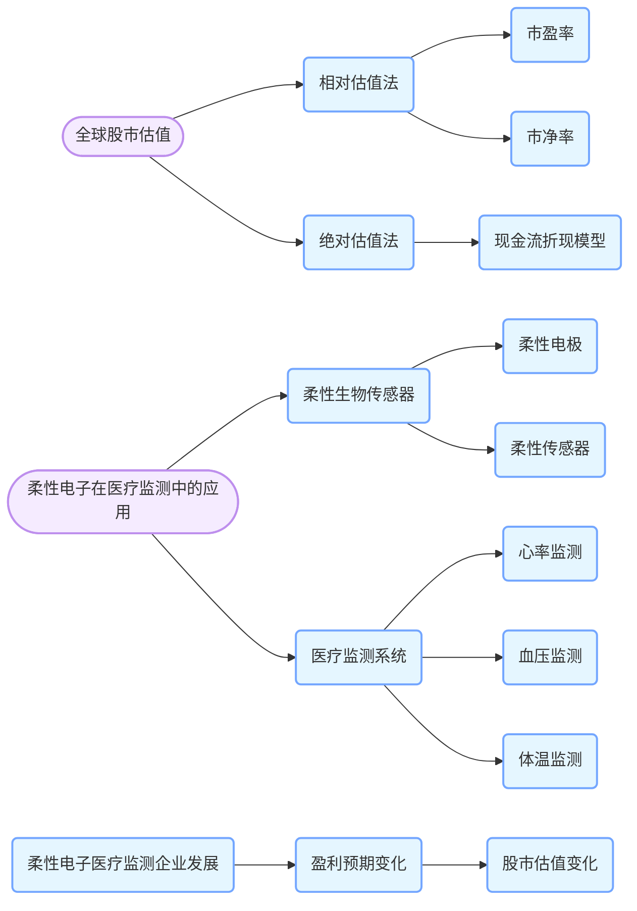

# 全球股市估值与柔性电子在医疗监测中的应用

> 关键词：全球股市估值、柔性电子、医疗监测、估值模型、技术应用

> 摘要：本文旨在深入探讨全球股市估值的方法与影响因素，以及柔性电子技术在医疗监测领域的具体应用。通过对全球股市估值的原理、算法、数学模型进行剖析，为投资者提供决策参考。同时，详细阐述柔性电子技术在医疗监测中的原理、应用案例及发展前景。分析两者之间可能存在的联系，如柔性电子在医疗监测领域的发展对相关企业股市估值的影响。

## 1. 背景介绍 
### 1.1 目的和范围
本文的主要目的是全面研究全球股市估值的方法和影响因素，以及柔性电子技术在医疗监测中的应用原理、现状和发展趋势。在全球股市估值方面，将涵盖常见的估值模型，如市盈率模型、现金流折现模型等，并分析宏观经济因素、行业发展趋势对股市估值的影响。对于柔性电子在医疗监测中的应用，将涉及技术原理、不同医疗场景下的具体应用案例以及未来的发展潜力。

### 1.2 预期读者
本文预期读者包括金融投资者、证券分析师、医疗技术研发人员、医疗行业从业者以及对金融市场和医疗技术感兴趣的研究人员。金融投资者可以通过本文了解全球股市估值的方法，为投资决策提供依据；医疗技术研发人员可以获取柔性电子技术在医疗监测中的最新应用动态；医疗行业从业者可以关注相关技术对医疗服务的提升；研究人员可以在本文的基础上开展进一步的研究。

### 1.3 文档结构概述
本文将首先介绍全球股市估值和柔性电子在医疗监测应用的背景知识，包括术语定义和相关概念解释。接着，阐述全球股市估值和柔性电子技术的核心概念与联系，通过文本示意图和 Mermaid 流程图进行展示。然后，详细讲解全球股市估值的核心算法原理和具体操作步骤，以及柔性电子在医疗监测中的技术原理和操作流程。之后，介绍相关的数学模型和公式，并通过具体例子进行说明。再通过项目实战案例，展示如何进行全球股市估值分析和柔性电子医疗监测系统的开发。接着探讨两者的实际应用场景，推荐相关的学习资源、开发工具和论文著作。最后总结未来发展趋势与挑战，并提供常见问题解答和扩展阅读参考资料。

### 1.4 术语表
#### 1.4.1 核心术语定义
- **全球股市估值**：指对全球范围内股票市场中上市公司的价值进行评估的过程，通过一定的方法和模型确定股票的合理价格。
- **柔性电子**：是一种基于柔性基底材料的电子技术，具有可弯曲、可拉伸等特性，能够适应不同的形状和环境。
- **医疗监测**：指对人体的生理参数、健康状况等进行实时或定期的监测和分析，以便及时发现健康问题并采取相应的措施。

#### 1.4.2 相关概念解释
- **市盈率（P/E）**：是指股票价格与每股收益的比率，反映了投资者为获取每一元收益所愿意支付的价格。
- **现金流折现模型（DCF）**：通过预测企业未来的现金流，并将其折现到当前时刻，以确定企业的内在价值。
- **生物传感器**：是一种能够将生物信息转换为电信号的装置，常用于医疗监测中检测人体生理参数。

#### 1.4.3 缩略词列表
- **P/E**：市盈率（Price-to-Earnings Ratio）
- **DCF**：现金流折现模型（Discounted Cash Flow Model）
- **ECG**：心电图（Electrocardiogram）
- **PPG**：光电容积脉搏波描记法（Photoplethysmography）

## 2. 核心概念与联系 

### 全球股市估值核心概念
全球股市估值是金融领域的重要研究内容，其目的是确定股票的合理价格，为投资者提供决策依据。常见的估值方法包括相对估值法和绝对估值法。相对估值法通过与同行业或市场平均水平进行比较，如市盈率、市净率等指标来评估股票的价值。绝对估值法主要基于企业的基本面，通过预测未来的现金流并折现到当前时刻，如现金流折现模型。

### 柔性电子在医疗监测中的核心概念
柔性电子技术具有可弯曲、可拉伸的特性，使其能够更好地贴合人体皮肤，实现对人体生理参数的实时、连续监测。在医疗监测中，柔性电子技术主要应用于生物传感器的制造，如柔性电极、柔性传感器等，这些传感器可以检测人体的心率、血压、体温等生理参数。

### 两者的联系
柔性电子在医疗监测领域的发展可能会对相关企业的股市估值产生影响。如果一家企业在柔性电子医疗监测技术方面具有领先优势，其未来的盈利预期可能会增加，从而提高其股市估值。反之，如果该领域的发展遇到瓶颈或竞争加剧，可能会导致相关企业的股市估值下降。

### 文本示意图
```plaintext
全球股市估值
|-- 相对估值法
|   |-- 市盈率
|   |-- 市净率
|-- 绝对估值法
|   |-- 现金流折现模型

柔性电子在医疗监测中的应用
|-- 柔性生物传感器
|   |-- 柔性电极
|   |-- 柔性传感器
|-- 医疗监测系统
|   |-- 心率监测
|   |-- 血压监测
|   |-- 体温监测

联系：柔性电子医疗监测企业发展 -> 盈利预期变化 -> 股市估值变化
```

### Mermaid 流程图


## 3. 核心算法原理 & 具体操作步骤 

### 全球股市估值核心算法原理及 Python 实现

#### 市盈率估值法
市盈率估值法是一种相对简单的估值方法，其原理是通过比较目标股票的市盈率与同行业或市场平均市盈率，来确定股票的合理价格。计算公式为：

$$股票价格 = 每股收益 \times 市盈率$$

以下是使用 Python 实现市盈率估值的示例代码：
```python
# 定义每股收益和市盈率
earnings_per_share = 2.0
pe_ratio = 15

# 计算股票价格
stock_price = earnings_per_share * pe_ratio

print(f"根据市盈率估值法，股票价格为: {stock_price} 元")
```

#### 现金流折现模型
现金流折现模型是一种绝对估值方法，其原理是将企业未来的现金流折现到当前时刻，以确定企业的内在价值。计算公式为：

$$V = \sum_{t=1}^{n} \frac{CF_t}{(1 + r)^t}$$

其中，$V$ 表示企业的内在价值，$CF_t$ 表示第 $t$ 期的现金流，$r$ 表示折现率，$n$ 表示预测期数。

以下是使用 Python 实现现金流折现模型的示例代码：
```python
import numpy as np

# 定义现金流、折现率和预测期数
cash_flows = np.array([100, 120, 150, 180, 200])
discount_rate = 0.1
n = len(cash_flows)

# 计算折现因子
discount_factors = np.array([(1 + discount_rate) ** i for i in range(1, n + 1)])

# 计算折现后的现金流
discounted_cash_flows = cash_flows / discount_factors

# 计算企业内在价值
intrinsic_value = np.sum(discounted_cash_flows)

print(f"根据现金流折现模型，企业内在价值为: {intrinsic_value} 元")
```

### 柔性电子在医疗监测中的核心算法原理及操作步骤

#### 心率监测算法原理
心率监测通常采用光电容积脉搏波描记法（PPG），其原理是利用光线照射皮肤，通过检测反射光的强度变化来获取脉搏信号。心率计算方法是通过分析脉搏信号的周期，计算每分钟的心跳次数。

以下是一个简单的心率计算 Python 示例代码：
```python
import numpy as np

# 模拟 PPG 信号
ppg_signal = np.array([1.0, 1.2, 1.5, 1.3, 1.1, 1.0, 1.2, 1.5, 1.3, 1.1])

# 查找脉搏波峰值
peaks, _ = np.where(np.diff(np.sign(np.diff(ppg_signal))) < 0) + 1

# 计算脉搏周期
pulse_periods = np.diff(peaks)

# 计算心率
heart_rate = 60 / np.mean(pulse_periods)

print(f"心率为: {heart_rate} 次/分钟")
```

#### 操作步骤
1. **传感器佩戴**：将柔性 PPG 传感器佩戴在人体合适的部位，如手指、手腕等。
2. **信号采集**：通过传感器采集 PPG 信号，并将其传输到数据处理设备。
3. **信号处理**：对采集到的 PPG 信号进行滤波、去噪等处理，以提高信号质量。
4. **心率计算**：使用上述算法计算心率。
5. **结果显示**：将计算得到的心率结果显示在设备屏幕上或传输到其他设备进行进一步分析。

## 4. 数学模型和公式 & 详细讲解 & 举例说明 

### 全球股市估值数学模型

#### 市盈率模型
市盈率模型的数学公式为：

$$P = EPS \times P/E$$

其中，$P$ 表示股票价格，$EPS$ 表示每股收益，$P/E$ 表示市盈率。

举例说明：假设某公司的每股收益为 $3$ 元，同行业平均市盈率为 $20$，则该公司股票的合理价格为：

$$P = 3 \times 20 = 60$$（元）

#### 现金流折现模型
现金流折现模型的数学公式为：

$$V = \sum_{t=1}^{n} \frac{CF_t}{(1 + r)^t}$$

其中，$V$ 表示企业的内在价值，$CF_t$ 表示第 $t$ 期的现金流，$r$ 表示折现率，$n$ 表示预测期数。

举例说明：假设某企业未来 5 年的现金流分别为 $100$ 万元、$120$ 万元、$150$ 万元、$180$ 万元、$200$ 万元，折现率为 $10\%$，则该企业的内在价值为：

$$V = \frac{100}{(1 + 0.1)^1} + \frac{120}{(1 + 0.1)^2} + \frac{150}{(1 + 0.1)^3} + \frac{180}{(1 + 0.1)^4} + \frac{200}{(1 + 0.1)^5}$$

$$V \approx 90.91 + 99.17 + 112.69 + 122.94 + 124.18 = 549.89$$（万元）

### 柔性电子在医疗监测中的数学模型

#### 心率计算模型
心率计算模型基于脉搏波的周期，其数学公式为：

$$HR = \frac{60}{T}$$

其中，$HR$ 表示心率（次/分钟），$T$ 表示脉搏周期（秒）。

举例说明：假设通过 PPG 信号分析得到脉搏周期为 $1$ 秒，则心率为：

$$HR = \frac{60}{1} = 60$$（次/分钟）

## 5. 项目实战：代码实际案例和详细解释说明 

### 5.1  开发环境搭建

#### 全球股市估值项目
- **编程语言**：Python
- **开发环境**：Anaconda 或 Python 官方解释器
- **必要库**：`numpy`、`pandas`、`matplotlib`

安装必要库的命令：
```sh
pip install numpy pandas matplotlib
```

#### 柔性电子医疗监测项目
- **编程语言**：Python
- **开发环境**：Anaconda 或 Python 官方解释器
- **必要库**：`numpy`、`scipy`、`matplotlib`

安装必要库的命令：
```sh
pip install numpy scipy matplotlib
```

### 5.2  源代码详细实现和代码解读

#### 全球股市估值项目
以下是一个使用市盈率估值法对多只股票进行估值的 Python 代码示例：
```python
import pandas as pd

# 定义股票数据
stock_data = {
    '股票代码': ['000001', '000002', '000003'],
    '每股收益': [2.0, 3.0, 1.5],
    '市盈率': [15, 20, 18]
}

# 创建 DataFrame
df = pd.DataFrame(stock_data)

# 计算股票价格
df['股票价格'] = df['每股收益'] * df['市盈率']

# 显示结果
print(df)
```

代码解读：
1. 导入 `pandas` 库，用于数据处理和分析。
2. 定义股票数据，包括股票代码、每股收益和市盈率。
3. 创建 `DataFrame` 对象，将股票数据存储在其中。
4. 通过 `DataFrame` 的乘法运算，计算每只股票的价格。
5. 打印结果。

#### 柔性电子医疗监测项目
以下是一个使用 PPG 信号进行心率监测的 Python 代码示例：
```python
import numpy as np
import matplotlib.pyplot as plt
from scipy.signal import find_peaks

# 模拟 PPG 信号
t = np.linspace(0, 10, 1000)
ppg_signal = np.sin(2 * np.pi * 1 * t) + 0.5 * np.sin(2 * np.pi * 2 * t)

# 查找脉搏波峰值
peaks, _ = find_peaks(ppg_signal)

# 计算脉搏周期
pulse_periods = np.diff(peaks) / 100  # 采样频率为 100 Hz

# 计算心率
heart_rate = 60 / np.mean(pulse_periods)

# 绘制 PPG 信号和峰值
plt.plot(t, ppg_signal)
plt.plot(t[peaks], ppg_signal[peaks], "x")
plt.xlabel('时间 (s)')
plt.ylabel('PPG 信号')
plt.title(f'心率: {heart_rate:.2f} 次/分钟')
plt.show()
```

代码解读：
1. 导入必要的库，包括 `numpy`、`matplotlib.pyplot` 和 `scipy.signal`。
2. 模拟 PPG 信号，使用正弦函数生成一个包含多个频率成分的信号。
3. 使用 `find_peaks` 函数查找 PPG 信号的峰值。
4. 计算脉搏周期，考虑采样频率。
5. 计算心率。
6. 绘制 PPG 信号和峰值，并显示心率结果。

### 5.3  代码解读与分析

#### 全球股市估值项目
该项目通过简单的乘法运算实现了市盈率估值法，代码简洁易懂。使用 `pandas` 库可以方便地处理和存储股票数据，并且可以进行进一步的数据分析和可视化。

#### 柔性电子医疗监测项目
该项目模拟了 PPG 信号，并使用 `find_peaks` 函数查找脉搏波峰值。通过计算脉搏周期和心率，实现了基本的心率监测功能。绘制 PPG 信号和峰值可以直观地观察信号特征和心率计算结果。

## 6. 实际应用场景 

### 全球股市估值的实际应用场景
- **投资决策**：投资者可以根据股市估值结果，判断股票的价格是否合理，从而决定是否买入、卖出或持有股票。
- **企业并购**：在企业并购过程中，需要对目标企业的价值进行评估，股市估值方法可以为并购价格的确定提供参考。
- **市场分析**：证券分析师可以通过对全球股市估值的研究，分析市场的整体走势和行业的发展趋势。

### 柔性电子在医疗监测中的实际应用场景
- **家庭医疗监测**：柔性电子医疗监测设备可以方便地在家中使用，如智能手环、智能手表等，实现对心率、血压等生理参数的实时监测。
- **远程医疗**：通过柔性电子传感器和无线通信技术，医生可以远程获取患者的生理数据，实现远程诊断和治疗。
- **运动健康监测**：运动员可以使用柔性电子监测设备，实时监测运动过程中的生理参数，如心率、运动强度等，以便合理调整训练计划。

## 7. 工具和资源推荐

### 7.1 学习资源推荐

#### 7.1.1 书籍推荐
- 《证券分析》（本杰明·格雷厄姆）：经典的投资分析书籍，介绍了股票估值的基本方法和理论。
- 《财务报表分析与证券定价》（斯蒂芬·佩因曼）：详细讲解了财务报表分析和股票估值的方法。
- 《柔性电子学：材料、器件与应用》：全面介绍了柔性电子技术的原理、材料、器件和应用。

#### 7.1.2 在线课程
- Coursera 上的“Financial Markets”：由耶鲁大学教授罗伯特·席勒讲授，介绍了金融市场的基本原理和投资策略。
- edX 上的“Flexible Electronics: Materials, Devices, and Applications”：介绍了柔性电子技术的最新发展和应用。

#### 7.1.3 技术博客和网站
- Seeking Alpha：提供全球股市的分析和评论，包括股票估值、行业研究等内容。
- IEEE Xplore：收录了大量关于柔性电子技术的学术论文和研究报告。

### 7.2 开发工具框架推荐

#### 7.2.1 IDE和编辑器
- PyCharm：功能强大的 Python 集成开发环境，适合开发全球股市估值和柔性电子医疗监测项目。
- Jupyter Notebook：交互式开发环境，方便进行数据分析和代码演示。

#### 7.2.2 调试和性能分析工具
- Py-Spy：用于分析 Python 程序的性能，找出性能瓶颈。
- PDB：Python 自带的调试工具，用于调试 Python 代码。

#### 7.2.3 相关框架和库
- TensorFlow：开源的机器学习框架，可用于开发基于深度学习的股市预测模型和医疗监测算法。
- Keras：高级神经网络 API，基于 TensorFlow 等后端，方便快速搭建神经网络模型。

### 7.3 相关论文著作推荐

#### 7.3.1 经典论文
- “The Theory of Investment Value”（约翰·伯尔·威廉姆斯）：提出了现金流折现模型的基本理论。
- “Flexible and Stretchable Physical Sensor Integrated Platforms for Wearable Human-Activity Monitoringand Personal Healthcare”：介绍了柔性电子在可穿戴医疗监测中的应用。

#### 7.3.2 最新研究成果
- 关注 IEEE Transactions on Biomedical Engineering、Nature Biotechnology 等期刊，获取柔性电子在医疗监测领域的最新研究成果。

#### 7.3.3 应用案例分析
- 可以参考一些知名企业的年报和研究报告，了解柔性电子医疗监测产品的市场应用情况和商业价值。

## 8. 总结：未来发展趋势与挑战

### 全球股市估值的未来发展趋势与挑战
- **趋势**：随着人工智能和大数据技术的发展，股市估值模型将更加智能化和精准化。同时，全球股市的互联互通将加强，跨市场估值分析将变得更加重要。
- **挑战**：宏观经济环境的不确定性、政策变化等因素将增加股市估值的难度。此外，新兴金融科技的发展也可能对传统股市估值方法产生冲击。

### 柔性电子在医疗监测中的未来发展趋势与挑战
- **趋势**：柔性电子技术将不断创新，传感器的灵敏度和可靠性将进一步提高。同时，柔性电子医疗监测设备将更加小型化、智能化和集成化，实现多参数同时监测。
- **挑战**：柔性电子材料的稳定性和生物相容性需要进一步改善，以确保长期使用的安全性。此外，数据隐私和安全问题也是柔性电子医疗监测面临的重要挑战。

## 9. 附录：常见问题与解答

### 全球股市估值常见问题
- **问**：市盈率估值法的局限性是什么？
**答**：市盈率估值法简单易懂，但它没有考虑企业的未来增长潜力、行业竞争等因素。不同行业的市盈率水平可能差异较大，因此在使用市盈率估值法时需要进行行业比较。

- **问**：现金流折现模型中的折现率如何确定？
**答**：折现率通常根据企业的风险水平和市场利率来确定。一般来说，风险较高的企业折现率也较高。可以使用资本资产定价模型（CAPM）来计算折现率。

### 柔性电子在医疗监测中的常见问题
- **问**：柔性电子传感器的使用寿命有多长？
**答**：柔性电子传感器的使用寿命取决于材料的稳定性和使用环境。目前，一些柔性电子传感器的使用寿命可以达到数月甚至数年，但仍需要进一步提高。

- **问**：柔性电子医疗监测设备的数据准确性如何保证？
**答**：为了保证数据准确性，需要对传感器进行校准和验证。同时，采用先进的信号处理算法和数据分析技术，去除噪声和干扰，提高数据的质量。

## 10. 扩展阅读 & 参考资料
- 约翰·博格. 《共同基金常识》. 中国人民大学出版社.
- 尤瓦尔·赫拉利. 《未来简史：从智人到神人》. 中信出版社.
- 李开复. 《人工智能》. 文化发展出版社.
- IEEE 官方网站：https://www.ieee.org/
- 中国证券监督管理委员会官方网站：https://www.csrc.gov.cn/
- 美国证券交易委员会官方网站：https://www.sec.gov/