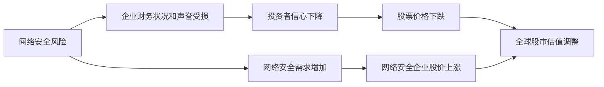

# 全球股市估值与网络安全风险的关联

> 关键词：全球股市估值、网络安全风险、关联分析、金融市场、信息技术、风险评估、投资决策

> 摘要：本文旨在深入探讨全球股市估值与网络安全风险之间的关联。随着信息技术的飞速发展，网络安全问题日益凸显，其对全球股市的影响也愈发显著。通过对两者核心概念、关联原理、相关算法、数学模型等多方面的研究，并结合实际案例分析，揭示这种关联的内在机制和实际影响。同时，为投资者、企业和监管机构在面对网络安全风险时进行合理的股市估值和决策提供理论支持和实践指导，帮助其更好地应对复杂多变的金融市场环境和网络安全挑战。

## 1. 背景介绍 
### 1.1 目的和范围
本研究的主要目的是全面、深入地剖析全球股市估值与网络安全风险之间的关联。通过综合运用金融、信息技术等多学科知识，探究网络安全事件如何影响全球股市的估值，以及股市估值的变化如何反映网络安全风险的程度。研究范围涵盖全球主要金融市场，包括股票市场、金融机构以及与网络安全相关的企业和行业。不仅关注网络安全风险对股市整体估值的宏观影响，还分析其对不同行业、不同规模企业股价的微观影响。

### 1.2 预期读者
本文预期读者包括金融市场投资者，如股票投资者、基金经理等，他们可以通过了解两者关联，更好地评估投资风险和机会，优化投资组合；企业管理者，特别是金融机构和信息技术企业的管理者，有助于他们制定合理的风险管理策略和企业发展战略；监管机构人员，能够为其制定相关政策和法规提供参考，维护金融市场的稳定和安全；以及对金融和信息技术领域感兴趣的研究人员和学者，为他们的学术研究提供新的视角和思路。

### 1.3 文档结构概述
本文首先介绍研究的背景信息，包括目的、预期读者和文档结构概述等内容。接着阐述全球股市估值和网络安全风险的核心概念及两者之间的联系，并通过示意图和流程图进行直观展示。然后详细讲解分析两者关联的核心算法原理和具体操作步骤，同时给出相关的数学模型和公式，并举例说明。之后通过项目实战，展示代码实际案例并进行详细解释。再探讨两者关联在实际中的应用场景。随后推荐相关的学习资源、开发工具框架和论文著作。最后总结未来发展趋势与挑战，提供常见问题与解答，并列出扩展阅读和参考资料。

### 1.4 术语表
#### 1.4.1 核心术语定义
- **全球股市估值**：指对全球范围内股票市场中上市公司的价值进行评估和衡量的过程和结果。通常通过多种估值方法，如市盈率（P/E）、市净率（P/B）等，来确定股票的合理价格和市场整体的价值水平。
- **网络安全风险**：指由于网络系统的脆弱性、黑客攻击、数据泄露、恶意软件感染等因素，导致企业或机构的信息资产、业务运营、声誉等受到损害的可能性和潜在损失。
- **风险溢价**：投资者因承担风险而要求获得的额外回报。在股市中，网络安全风险可能导致投资者要求更高的风险溢价，从而影响股票的估值。

#### 1.4.2 相关概念解释
- **金融市场**：资金供求双方借助金融工具进行各种资金交易活动的场所，包括股票市场、债券市场、外汇市场等。全球股市是金融市场的重要组成部分。
- **信息技术**：主要用于管理和处理信息所采用的各种技术的总称，包括计算机技术、通信技术、网络技术等。网络安全是信息技术领域的重要分支。
- **风险管理**：指如何在项目或者企业一个肯定有风险的环境里把风险可能造成的不良影响减至最低的管理过程，包括风险识别、评估、应对等环节。

#### 1.4.3 缩略词列表
- **P/E**：市盈率（Price-to-Earnings Ratio），指股票价格除以每股收益（EPS）的比率，用于衡量股票的估值水平。
- **P/B**：市净率（Price-to-Book Ratio），指股票价格与每股净资产的比率，反映了股票的市场价值与账面价值的关系。
- **EPS**：每股收益（Earnings Per Share），指税后利润与股本总数的比率，是衡量上市公司盈利能力的重要指标。

## 2. 核心概念与联系 
### 2.1 全球股市估值核心概念
全球股市估值是金融领域的重要概念，它反映了市场对上市公司未来盈利能力和资产价值的预期。常见的估值方法有绝对估值法和相对估值法。绝对估值法主要包括现金流折现法（DCF），该方法通过预测公司未来的现金流，并将其折现到当前时刻，来确定公司的内在价值。相对估值法包括市盈率法、市净率法等，通过与同行业或类似公司的估值指标进行比较，来评估目标公司的价值。

### 2.2 网络安全风险核心概念
网络安全风险是指由于网络系统的脆弱性和外部威胁，导致企业信息资产和业务运营面临的潜在损失。网络安全风险的来源包括黑客攻击、恶意软件、内部人员失误等。这些风险可能导致企业数据泄露、业务中断、声誉受损等后果，进而影响企业的财务状况和市场价值。

### 2.3 两者联系
网络安全风险对全球股市估值有着重要影响。一方面，网络安全事件的发生可能导致企业股价下跌，因为投资者会担心企业的财务损失、声誉受损和未来盈利能力下降。例如，当一家公司发生重大数据泄露事件时，投资者可能会对其信心下降，从而抛售该公司的股票，导致股价下跌。另一方面，随着网络安全问题的日益严峻，市场对网络安全企业的需求增加，可能会推动这些企业的股价上涨，进而影响相关行业的股市估值。

### 2.4 文本示意图
全球股市估值与网络安全风险的联系可以用以下示意图表示：

网络安全风险 --（影响）--> 企业财务状况和声誉 --（影响）--> 投资者信心 --（影响）--> 股票价格 --（影响）--> 全球股市估值

### 2.5 Mermaid 流程图


## 3. 核心算法原理 & 具体操作步骤 
### 3.1 核心算法原理
为了分析全球股市估值与网络安全风险的关联，我们可以采用回归分析算法。回归分析是一种统计方法，用于研究自变量和因变量之间的关系。在本研究中，我们将网络安全风险指标作为自变量，全球股市估值指标作为因变量，通过建立回归模型来分析两者之间的定量关系。

### 3.2 Python 源代码实现
```python
import pandas as pd
import numpy as np
from sklearn.linear_model import LinearRegression
import matplotlib.pyplot as plt

# 模拟数据
np.random.seed(0)
n_samples = 100
# 生成网络安全风险指标数据
cybersecurity_risk = np.random.rand(n_samples) * 10
# 生成全球股市估值指标数据，添加随机噪声
stock_market_valuation = 2 * cybersecurity_risk + 5 + np.random.randn(n_samples)

# 数据准备
X = cybersecurity_risk.reshape(-1, 1)
y = stock_market_valuation

# 建立线性回归模型
model = LinearRegression()
model.fit(X, y)

# 预测
new_cybersecurity_risk = np.array([5]).reshape(-1, 1)
predicted_valuation = model.predict(new_cybersecurity_risk)

# 输出结果
print(f"回归系数: {model.coef_[0]}")
print(f"截距: {model.intercept_}")
print(f"预测的股市估值: {predicted_valuation[0]}")

# 可视化
plt.scatter(X, y, color='blue', label='实际数据')
plt.plot(X, model.predict(X), color='red', linewidth=2, label='回归直线')
plt.xlabel('网络安全风险指标')
plt.ylabel('全球股市估值指标')
plt.title('网络安全风险与全球股市估值的线性回归')
plt.legend()
plt.show()
```

### 3.3 具体操作步骤
1. **数据收集**：收集全球股市估值和网络安全风险的相关数据。股市估值数据可以包括股票价格、市盈率、市净率等指标，网络安全风险数据可以包括网络攻击次数、数据泄露事件数量等指标。
2. **数据预处理**：对收集到的数据进行清洗、整理和标准化处理，以确保数据的质量和一致性。
3. **模型建立**：根据数据特点选择合适的回归模型，如线性回归、多项式回归等。在本案例中，我们选择线性回归模型。
4. **模型训练**：使用预处理后的数据对模型进行训练，得到回归系数和截距。
5. **模型评估**：使用评估指标，如均方误差（MSE）、决定系数（R²）等，对模型的性能进行评估。
6. **预测和分析**：使用训练好的模型对新的网络安全风险数据进行预测，并分析预测结果与实际情况的差异。

## 4. 数学模型和公式 & 详细讲解 & 举例说明 
### 4.1 线性回归数学模型
线性回归模型的基本形式为：

$$y = \beta_0 + \beta_1x + \epsilon$$

其中，$y$ 是因变量（全球股市估值指标），$x$ 是自变量（网络安全风险指标），$\beta_0$ 是截距，$\beta_1$ 是回归系数，$\epsilon$ 是误差项，服从均值为 0 的正态分布。

### 4.2 回归系数和截距的计算
回归系数 $\beta_1$ 和截距 $\beta_0$ 的计算公式如下：

$$\beta_1 = \frac{\sum_{i=1}^{n}(x_i - \bar{x})(y_i - \bar{y})}{\sum_{i=1}^{n}(x_i - \bar{x})^2}$$

$$\beta_0 = \bar{y} - \beta_1\bar{x}$$

其中，$n$ 是样本数量，$\bar{x}$ 和 $\bar{y}$ 分别是 $x$ 和 $y$ 的样本均值。

### 4.3 举例说明
假设我们有以下数据：

| 网络安全风险指标 ($x$) | 全球股市估值指标 ($y$) |
| --- | --- |
| 1 | 7 |
| 2 | 9 |
| 3 | 11 |
| 4 | 13 |
| 5 | 15 |

首先，计算样本均值：

$$\bar{x} = \frac{1 + 2 + 3 + 4 + 5}{5} = 3$$

$$\bar{y} = \frac{7 + 9 + 11 + 13 + 15}{5} = 11$$

然后，计算回归系数 $\beta_1$：

$$\beta_1 = \frac{(1 - 3)(7 - 11) + (2 - 3)(9 - 11) + (3 - 3)(11 - 11) + (4 - 3)(13 - 11) + (5 - 3)(15 - 11)}{(1 - 3)^2 + (2 - 3)^2 + (3 - 3)^2 + (4 - 3)^2 + (5 - 3)^2} = 2$$

最后，计算截距 $\beta_0$：

$$\beta_0 = 11 - 2 \times 3 = 5$$

所以，线性回归方程为 $y = 5 + 2x$。当网络安全风险指标 $x = 6$ 时，预测的全球股市估值指标 $y = 5 + 2 \times 6 = 17$。

## 5. 项目实战：代码实际案例和详细解释说明 
### 5.1 开发环境搭建
- **操作系统**：Windows、Linux 或 macOS 均可。
- **Python 环境**：建议使用 Python 3.7 及以上版本。
- **开发工具**：可以使用 PyCharm、Jupyter Notebook 等集成开发环境。
- **依赖库安装**：使用以下命令安装所需的库：
```sh
pip install pandas numpy scikit-learn matplotlib
```

### 5.2 源代码详细实现和代码解读
```python
import pandas as pd
import numpy as np
from sklearn.linear_model import LinearRegression
import matplotlib.pyplot as plt

# 读取实际数据
data = pd.read_csv('stock_market_and_cybersecurity.csv')
# 提取网络安全风险指标数据
X = data['cybersecurity_risk'].values.reshape(-1, 1)
# 提取全球股市估值指标数据
y = data['stock_market_valuation'].values

# 建立线性回归模型
model = LinearRegression()
model.fit(X, y)

# 预测
new_cybersecurity_risk = np.array([8]).reshape(-1, 1)
predicted_valuation = model.predict(new_cybersecurity_risk)

# 输出结果
print(f"回归系数: {model.coef_[0]}")
print(f"截距: {model.intercept_}")
print(f"预测的股市估值: {predicted_valuation[0]}")

# 可视化
plt.scatter(X, y, color='blue', label='实际数据')
plt.plot(X, model.predict(X), color='red', linewidth=2, label='回归直线')
plt.xlabel('网络安全风险指标')
plt.ylabel('全球股市估值指标')
plt.title('网络安全风险与全球股市估值的线性回归')
plt.legend()
plt.show()
```
### 代码解读：
1. **数据读取**：使用 `pandas` 库的 `read_csv` 函数读取包含网络安全风险指标和全球股市估值指标的 CSV 文件。
2. **数据准备**：将网络安全风险指标数据转换为二维数组，以便用于模型训练。
3. **模型建立和训练**：使用 `sklearn` 库的 `LinearRegression` 类建立线性回归模型，并使用训练数据对模型进行训练。
4. **预测**：使用训练好的模型对新的网络安全风险指标数据进行预测。
5. **结果输出**：输出回归系数、截距和预测的股市估值。
6. **可视化**：使用 `matplotlib` 库绘制实际数据和回归直线的散点图，直观展示两者之间的关系。

### 5.3 代码解读与分析
通过上述代码，我们可以看到线性回归模型在分析全球股市估值与网络安全风险关联中的应用。回归系数表示网络安全风险指标每增加一个单位，全球股市估值指标的平均变化量。截距表示当网络安全风险指标为 0 时，全球股市估值指标的预测值。通过可视化结果，我们可以直观地观察到两者之间的线性关系。

然而，线性回归模型也有其局限性。它假设自变量和因变量之间存在线性关系，而实际情况可能更为复杂。在实际应用中，我们可能需要考虑使用更复杂的模型，如多项式回归、非线性回归等，以更好地拟合数据。

## 6. 实际应用场景 
### 6.1 投资者决策
投资者可以根据网络安全风险的变化来调整投资组合。当网络安全风险增加时，投资者可以减少对易受网络攻击影响的企业的投资，增加对网络安全企业的投资。例如，在某家大型金融机构发生重大数据泄露事件后，投资者可能会抛售该机构的股票，转而投资网络安全软件供应商的股票。

### 6.2 企业风险管理
企业可以通过评估自身的网络安全风险，采取相应的措施来降低风险对企业股价的影响。企业可以加强网络安全防护，定期进行安全审计，提高员工的安全意识等。同时，企业还可以通过购买网络安全保险等方式来转移风险。

### 6.3 监管机构政策制定
监管机构可以根据网络安全风险对股市的影响，制定相应的政策和法规，加强对金融机构和企业的网络安全监管。监管机构可以要求企业披露网络安全信息，制定网络安全标准和规范，加强对网络攻击的打击力度等。

### 6.4 行业发展趋势分析
通过分析全球股市估值与网络安全风险的关联，可以了解网络安全行业的发展趋势。当股市对网络安全企业的估值上升时，说明市场对网络安全行业的前景看好，可能会吸引更多的资金和人才进入该行业，推动行业的发展。

## 7. 工具和资源推荐
### 7.1 学习资源推荐
#### 7.1.1 书籍推荐
- 《金融市场与金融机构基础》：全面介绍金融市场和金融机构的基本概念和运作机制，为理解全球股市估值提供理论基础。
- 《网络安全概论》：系统阐述网络安全的基本原理、技术和管理方法，帮助读者了解网络安全风险的来源和防范措施。
- 《Python 数据分析实战》：介绍如何使用 Python 进行数据分析，包括数据处理、统计分析、机器学习等内容，为分析全球股市估值与网络安全风险的关联提供技术支持。

#### 7.1.2 在线课程
- Coursera 上的“金融市场”课程：由知名大学教授授课，深入讲解金融市场的理论和实践知识。
- edX 上的“网络安全基础”课程：提供网络安全领域的基础知识和最新技术。
- 中国大学 MOOC 上的“Python 语言程序设计”课程：适合初学者学习 Python 编程，为后续的数据分析和建模打下基础。

#### 7.1.3 技术博客和网站
- 金融界网站：提供全球股市的实时行情、分析报告和市场动态。
- 安全牛网：专注于网络安全领域的资讯、技术和行业动态。
- Medium 上的金融和技术相关博客：有许多专业人士分享的最新研究成果和实践经验。

### 7.2 开发工具框架推荐
#### 7.2.1 IDE和编辑器
- PyCharm：功能强大的 Python 集成开发环境，提供代码编辑、调试、版本控制等功能。
- Jupyter Notebook：交互式的开发环境，适合进行数据分析和模型训练，支持多种编程语言。
- Visual Studio Code：轻量级的代码编辑器，支持多种编程语言和插件扩展。

#### 7.2.2 调试和性能分析工具
- PDB：Python 自带的调试工具，可用于调试 Python 代码。
- Profiler：Python 的性能分析工具，可用于分析代码的性能瓶颈。
- TensorBoard：用于可视化深度学习模型训练过程和结果的工具。

#### 7.2.3 相关框架和库
- Pandas：用于数据处理和分析的 Python 库，提供高效的数据结构和数据操作方法。
- NumPy：用于科学计算的 Python 库，提供高效的数组操作和数学函数。
- Scikit-learn：用于机器学习的 Python 库，提供各种机器学习算法和工具。
- Matplotlib：用于数据可视化的 Python 库，提供丰富的绘图功能。

### 7.3 相关论文著作推荐
#### 7.3.1 经典论文
- “The Impact of Cybersecurity Breaches on Stock Prices”：研究了网络安全事件对股票价格的影响，通过实证分析揭示了两者之间的关系。
- “Valuation of Global Stock Markets: A Comprehensive Review”：对全球股市估值的方法和理论进行了全面综述，为研究股市估值提供了理论依据。

#### 7.3.2 最新研究成果
- 关注顶级金融和信息技术学术期刊，如《Journal of Financial Economics》《IEEE Transactions on Information Forensics and Security》等，获取关于全球股市估值与网络安全风险关联的最新研究成果。

#### 7.3.3 应用案例分析
- 参考行业报告和案例研究，如 Gartner、IDC 等机构发布的关于网络安全和金融市场的报告，了解实际应用中的成功案例和经验教训。

## 8. 总结：未来发展趋势与挑战
### 8.1 未来发展趋势
- **技术创新推动**：随着人工智能、区块链、量子计算等技术的不断发展，网络安全技术也将不断创新，为全球股市带来新的机遇和挑战。例如，人工智能技术可以用于网络安全威胁检测和预测，提高网络安全防护能力；区块链技术可以用于保障金融交易的安全和透明，增强投资者信心。
- **行业融合加深**：金融行业与信息技术行业的融合将越来越深入，网络安全风险对全球股市的影响也将更加复杂。未来，金融科技公司将不断涌现，它们将利用信息技术创新金融产品和服务，同时也面临着更高的网络安全风险。
- **国际合作加强**：网络安全是全球性问题，需要各国政府、企业和国际组织加强合作，共同应对。未来，国际间的网络安全合作将不断加强，制定统一的网络安全标准和规范，加强信息共享和协同作战，共同维护全球金融市场的稳定和安全。

### 8.2 挑战
- **风险评估难度加大**：随着信息技术的快速发展，网络安全风险的形式和来源越来越复杂，给风险评估带来了很大的难度。如何准确地评估网络安全风险对全球股市估值的影响，是未来需要解决的重要问题。
- **法律法规不完善**：目前，关于网络安全的法律法规还不够完善，存在许多漏洞和空白。在处理网络安全事件和保护投资者权益方面，还缺乏有效的法律依据和监管措施。
- **人才短缺**：网络安全和金融领域都需要大量的专业人才，但目前相关领域的人才短缺问题较为严重。培养既懂网络安全又懂金融的复合型人才，是未来面临的一大挑战。

## 9. 附录：常见问题与解答
### 9.1 如何获取准确的网络安全风险数据？
可以通过以下途径获取网络安全风险数据：
- **专业的网络安全公司**：如 FireEye、Symantec 等，它们会发布网络安全威胁报告和统计数据。
- **政府机构**：如美国国土安全部、中国国家互联网应急中心等，会提供相关的网络安全信息和数据。
- **行业协会和研究机构**：如国际信息系统安全协会（ISACA）、Gartner 等，会发布行业研究报告和数据。

### 9.2 线性回归模型在分析两者关联时的准确性如何？
线性回归模型在分析全球股市估值与网络安全风险的关联时具有一定的局限性。它假设自变量和因变量之间存在线性关系，而实际情况可能更为复杂。在某些情况下，线性回归模型可能无法准确地拟合数据。因此，在实际应用中，需要根据数据特点和问题需求，选择合适的模型，如多项式回归、非线性回归等，以提高模型的准确性。

### 9.3 网络安全风险对不同行业的股市估值影响是否相同？
不同行业对网络安全风险的敏感度不同，因此网络安全风险对不同行业的股市估值影响也不同。一般来说，金融、医疗、能源等行业对网络安全的要求较高，网络安全风险对这些行业的股市估值影响较大。而一些传统制造业、农业等行业对网络安全的敏感度相对较低，网络安全风险对其股市估值的影响相对较小。

## 10. 扩展阅读 & 参考资料
### 10.1 扩展阅读
- 《金融科技前沿：技术趋势与应用实践》：深入探讨金融科技的发展趋势和应用实践，包括网络安全在金融领域的应用。
- 《网络安全治理：理论与实践》：介绍网络安全治理的理论和方法，为企业和政府机构提供网络安全管理的指导。
- 《数据驱动的金融决策》：讲述如何利用数据分析和机器学习技术进行金融决策，对分析全球股市估值与网络安全风险的关联有一定的参考价值。

### 10.2 参考资料
- 相关的学术论文、行业报告、统计数据等。
- 金融市场和网络安全领域的官方网站和新闻媒体。
- 书籍、在线课程和技术博客等学习资源。