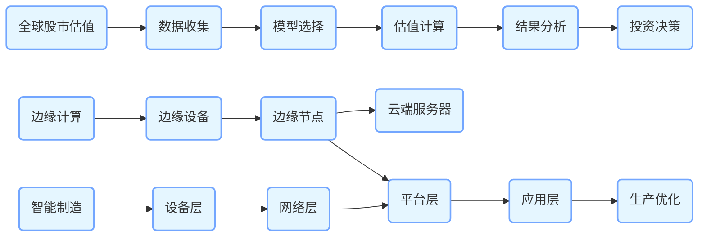

# 全球股市估值与边缘计算在智能制造中的应用

> 关键词：全球股市估值、边缘计算、智能制造、金融分析、工业应用

> 摘要：本文聚焦于两个看似不相关却有着潜在联系的领域，即全球股市估值和边缘计算在智能制造中的应用。首先深入探讨全球股市估值的方法、影响因素及重要性，为投资者和金融从业者提供全面的分析视角。接着详细阐述边缘计算的核心概念、原理和架构，以及其在智能制造领域的具体应用和带来的变革。通过对这两个领域的研究，旨在揭示金融市场与工业技术发展之间的内在联系，为跨领域的研究和应用提供参考，同时为相关从业者提供有价值的技术和策略指导。

## 1. 背景介绍 
### 1.1 目的和范围
本文的目的在于全面且深入地剖析全球股市估值的相关理论、方法和实际应用，同时详细探讨边缘计算在智能制造中的具体应用场景、技术原理和发展趋势。范围涵盖全球股市的主要市场，包括欧美、亚洲等地区的股票市场，以及边缘计算在各类智能制造产业中的应用案例，如汽车制造、电子制造、机械加工等行业。

### 1.2 预期读者
本文预期读者包括金融领域的投资者、分析师、基金经理，工业领域的智能制造工程师、技术专家、企业管理者，以及对金融市场和工业技术发展感兴趣的科研人员和学生。

### 1.3 文档结构概述
本文首先介绍背景信息，包括目的、预期读者和文档结构。接着阐述全球股市估值和边缘计算的核心概念与联系，包括原理和架构。然后详细讲解核心算法原理和具体操作步骤，以及相关的数学模型和公式。通过项目实战案例，展示代码实现和详细解释。分析实际应用场景，推荐相关的工具和资源。最后总结未来发展趋势与挑战，提供常见问题解答和扩展阅读参考资料。

### 1.4 术语表
#### 1.4.1 核心术语定义
- **全球股市估值**：对全球范围内各个股票市场中上市公司的价值进行评估的过程和方法，旨在确定股票的合理价格和投资价值。
- **边缘计算**：一种将计算和数据存储靠近数据源或用户端的分布式计算模式，通过在边缘设备或边缘节点上处理数据，减少数据传输延迟，提高系统的响应速度和效率。
- **智能制造**：基于新一代信息技术，贯穿设计、生产、管理、服务等制造活动各个环节，具有信息深度自感知、智慧优化自决策、精准控制自执行等功能的先进制造过程、系统与模式的总称。

#### 1.4.2 相关概念解释
- **股票估值模型**：用于估算股票内在价值的数学模型，常见的有股息贴现模型（DDM）、市盈率模型（P/E）、市净率模型（P/B）等。
- **边缘节点**：位于网络边缘的设备或服务器，具备一定的计算和存储能力，能够在本地处理和分析数据。
- **工业物联网（IIoT）**：将工业领域的设备、机器、传感器等通过网络连接起来，实现数据的采集、传输和共享，为智能制造提供数据支持。

#### 1.4.3 缩略词列表
- **DDM**：Dividend Discount Model（股息贴现模型）
- **P/E**：Price-to-Earnings Ratio（市盈率）
- **P/B**：Price-to-Book Ratio（市净率）
- **IIoT**：Industrial Internet of Things（工业物联网）

## 2. 核心概念与联系 

### 2.1 全球股市估值
全球股市估值是金融领域的重要研究课题，其核心目标是确定股票的内在价值，为投资者提供投资决策的依据。股票的价值受到多种因素的影响，包括公司的财务状况、行业前景、宏观经济环境等。常见的估值方法包括绝对估值法和相对估值法。

绝对估值法是通过对公司未来现金流的预测，折现到当前时刻来计算股票的内在价值。其中最典型的是股息贴现模型（DDM），该模型认为股票的价值等于其未来所有股息的现值之和。

相对估值法是通过比较同行业或类似公司的估值指标，如市盈率（P/E）、市净率（P/B）等，来评估股票的相对价值。相对估值法简单直观，易于理解和应用，但也存在一定的局限性，如不同公司之间的可比性问题。

### 2.2 边缘计算
边缘计算是一种新兴的计算模式，它将计算和数据存储靠近数据源或用户端，减少数据传输延迟，提高系统的响应速度和效率。边缘计算的核心思想是在网络边缘进行数据处理和分析，只将必要的数据传输到云端进行进一步的处理和存储。

边缘计算的架构通常包括边缘设备、边缘节点和云端服务器。边缘设备是指各种传感器、智能终端等，它们负责采集数据。边缘节点是位于网络边缘的设备或服务器，具备一定的计算和存储能力，能够在本地处理和分析数据。云端服务器则负责对边缘节点上传的数据进行进一步的处理和存储，以及提供远程管理和控制功能。

### 2.3 边缘计算与智能制造的联系
边缘计算在智能制造中具有重要的应用价值。在智能制造环境下，大量的设备和传感器会产生海量的数据，如果将这些数据全部传输到云端进行处理，会导致网络带宽压力增大、数据传输延迟增加等问题。边缘计算可以在设备端或边缘节点上对数据进行实时处理和分析，提取有价值的信息，减少数据传输量，提高系统的响应速度和效率。

例如，在工业生产线上，边缘计算可以实时监测设备的运行状态，预测设备故障，及时进行维护和维修，提高设备的可靠性和生产效率。同时，边缘计算还可以实现对生产过程的实时优化和控制，提高产品质量和生产效益。

### 2.4 核心概念原理和架构的文本示意图
全球股市估值的原理主要基于公司的财务数据和市场预期，通过各种估值模型来计算股票的内在价值。其架构包括数据收集、模型选择、估值计算和结果分析等环节。

边缘计算的原理是将计算和数据存储靠近数据源或用户端，通过边缘设备、边缘节点和云端服务器的协同工作，实现数据的实时处理和分析。其架构包括边缘层、平台层和应用层。

智能制造则是将信息技术与制造技术深度融合，通过工业物联网实现设备的互联互通和数据共享，利用边缘计算和云计算实现数据的处理和分析，从而实现生产过程的智能化和自动化。其架构包括设备层、网络层、平台层和应用层。

### 2.5 Mermaid 流程图


## 3. 核心算法原理 & 具体操作步骤 

### 3.1 全球股市估值算法原理及 Python 实现
#### 3.1.1 股息贴现模型（DDM）原理
股息贴现模型（DDM）认为股票的价值等于其未来所有股息的现值之和。其基本公式为：

$$V = \sum_{t=1}^{\infty} \frac{D_t}{(1 + r)^t}$$

其中，$V$ 表示股票的内在价值，$D_t$ 表示第 $t$ 期的股息，$r$ 表示贴现率。

在实际应用中，通常假设股息以固定的增长率 $g$ 增长，此时 DDM 模型可以简化为：

$$V = \frac{D_1}{r - g}$$

其中，$D_1$ 表示下一期的股息。

#### 3.1.2 Python 实现
```python
def ddm_valuation(D1, r, g):
    """
    股息贴现模型（DDM）估值计算
    :param D1: 下一期的股息
    :param r: 贴现率
    :param g: 股息增长率
    :return: 股票的内在价值
    """
    if r <= g:
        raise ValueError("贴现率必须大于股息增长率")
    return D1 / (r - g)

# 示例
D1 = 2.0  # 下一期的股息
r = 0.1  # 贴现率
g = 0.05  # 股息增长率
value = ddm_valuation(D1, r, g)
print(f"股票的内在价值为: {value}")
```

#### 3.1.3 具体操作步骤
1. **数据收集**：收集公司的股息数据、股息增长率和贴现率等信息。
2. **参数确定**：根据公司的历史数据和市场预期，确定下一期的股息 $D_1$、贴现率 $r$ 和股息增长率 $g$。
3. **估值计算**：使用 DDM 模型计算股票的内在价值。
4. **结果分析**：将计算得到的内在价值与当前股票价格进行比较，判断股票是否被低估或高估。

### 3.2 边缘计算中的数据处理算法原理及 Python 实现
#### 3.2.1 均值滤波算法原理
均值滤波是一种常用的信号处理算法，用于去除数据中的噪声。其基本思想是取一定窗口内数据的平均值作为该窗口中心数据的估计值。

设输入信号为 $x[n]$，窗口大小为 $N$，则均值滤波后的输出信号 $y[n]$ 为：

$$y[n] = \frac{1}{N} \sum_{i = n - \frac{N - 1}{2}}^{n + \frac{N - 1}{2}} x[i]$$

#### 3.2.2 Python 实现
```python
import numpy as np

def mean_filter(x, N):
    """
    均值滤波算法
    :param x: 输入信号
    :param N: 窗口大小
    :return: 滤波后的信号
    """
    padded_x = np.pad(x, (N // 2, N // 2), mode='edge')
    y = np.zeros_like(x)
    for i in range(len(x)):
        y[i] = np.mean(padded_x[i:i + N])
    return y

# 示例
x = np.random.randn(100)  # 生成随机信号
N = 5  # 窗口大小
y = mean_filter(x, N)
print(f"滤波后的信号: {y}")
```

#### 3.2.3 具体操作步骤
1. **数据采集**：使用传感器等设备采集原始数据。
2. **窗口大小选择**：根据数据的特点和噪声水平，选择合适的窗口大小 $N$。
3. **滤波处理**：使用均值滤波算法对原始数据进行处理，得到滤波后的信号。
4. **结果分析**：分析滤波后的信号，判断噪声是否被有效去除。

## 4. 数学模型和公式 & 详细讲解 & 举例说明 

### 4.1 全球股市估值的数学模型和公式
#### 4.1.1 股息贴现模型（DDM）
如前所述，股息贴现模型的基本公式为：

$$V = \sum_{t=1}^{\infty} \frac{D_t}{(1 + r)^t}$$

当股息以固定的增长率 $g$ 增长时，简化公式为：

$$V = \frac{D_1}{r - g}$$

**详细讲解**：
- $V$ 表示股票的内在价值，即投资者应该为该股票支付的合理价格。
- $D_t$ 表示第 $t$ 期的股息，是公司分配给股东的利润。
- $r$ 表示贴现率，反映了投资者对该股票的预期收益率，通常可以使用资本资产定价模型（CAPM）来确定。
- $g$ 表示股息增长率，是公司未来股息的增长速度，通常可以根据公司的历史数据和行业前景来估计。

**举例说明**：
假设某公司下一期的股息 $D_1$ 为 2 元，贴现率 $r$ 为 10%，股息增长率 $g$ 为 5%，则该公司股票的内在价值为：

$$V = \frac{2}{0.1 - 0.05} = 40$$（元）

如果当前股票价格低于 40 元，则该股票被低估，具有投资价值；反之，如果当前股票价格高于 40 元，则该股票被高估，投资风险较大。

#### 4.1.2 市盈率模型（P/E）
市盈率模型是一种相对估值法，其基本公式为：

$$P = E \times P/E$$

其中，$P$ 表示股票价格，$E$ 表示每股收益，$P/E$ 表示市盈率。

**详细讲解**：
- $P$ 是股票的市场价格，由市场供求关系决定。
- $E$ 是公司的每股收益，反映了公司的盈利能力。
- $P/E$ 是市盈率，是衡量股票估值水平的重要指标，通常可以通过同行业或类似公司的平均市盈率来确定。

**举例说明**：
假设某公司的每股收益 $E$ 为 2 元，同行业平均市盈率 $P/E$ 为 20，则该公司股票的合理价格为：

$$P = 2 \times 20 = 40$$（元）

### 4.2 边缘计算中的数学模型和公式
#### 4.2.1 排队论模型
在边缘计算中，排队论模型可以用于分析边缘节点的性能，如平均等待时间、平均队列长度等。假设边缘节点的任务到达服从泊松分布，服务时间服从指数分布，则可以使用 $M/M/1$ 排队模型进行分析。

$M/M/1$ 排队模型的主要参数和公式如下：
- $\lambda$：任务到达率，即单位时间内到达的任务数量。
- $\mu$：服务率，即单位时间内边缘节点能够处理的任务数量。
- $\rho = \frac{\lambda}{\mu}$：系统利用率，表示边缘节点的繁忙程度。
- $L_s = \frac{\rho}{1 - \rho}$：系统中的平均任务数量。
- $W_s = \frac{1}{\mu - \lambda}$：系统中的平均等待时间。

**详细讲解**：
- $\lambda$ 和 $\mu$ 是排队模型的基本参数，决定了系统的性能。
- $\rho$ 反映了边缘节点的繁忙程度，当 $\rho < 1$ 时，系统是稳定的；当 $\rho \geq 1$ 时，系统会出现排队过长的情况。
- $L_s$ 和 $W_s$ 分别表示系统中的平均任务数量和平均等待时间，是衡量系统性能的重要指标。

**举例说明**：
假设边缘节点的任务到达率 $\lambda$ 为 5 个/秒，服务率 $\mu$ 为 10 个/秒，则系统利用率为：

$$\rho = \frac{5}{10} = 0.5$$

系统中的平均任务数量为：

$$L_s = \frac{0.5}{1 - 0.5} = 1$$（个）

系统中的平均等待时间为：

$$W_s = \frac{1}{10 - 5} = 0.2$$（秒）

## 5. 项目实战：代码实际案例和详细解释说明 

### 5.1  开发环境搭建
#### 5.1.1 全球股市估值项目
- **编程语言**：Python 3.x
- **开发工具**：PyCharm 或 Jupyter Notebook
- **相关库**：pandas、numpy、matplotlib

#### 5.1.2 边缘计算在智能制造中的应用项目
- **编程语言**：Python 3.x
- **开发工具**：Visual Studio Code
- **相关库**：numpy、scikit-learn、tensorflow

### 5.2  源代码详细实现和代码解读
#### 5.2.1 全球股市估值项目
```python
import pandas as pd
import numpy as np
import matplotlib.pyplot as plt

# 读取股票数据
data = pd.read_csv('stock_data.csv')

# 计算每股收益（E）
data['E'] = data['Net Income'] / data['Shares Outstanding']

# 计算市盈率（P/E）
data['P/E'] = data['Stock Price'] / data['E']

# 计算行业平均市盈率
industry_avg_pe = data['P/E'].mean()

# 筛选被低估的股票
undervalued_stocks = data[data['P/E'] < industry_avg_pe]

# 绘制市盈率分布直方图
plt.hist(data['P/E'], bins=20)
plt.xlabel('P/E Ratio')
plt.ylabel('Frequency')
plt.title('P/E Ratio Distribution')
plt.show()

# 输出被低估的股票信息
print("被低估的股票信息：")
print(undervalued_stocks[['Stock Symbol', 'Stock Price', 'E', 'P/E']])
```

**代码解读**：
1. **数据读取**：使用 `pandas` 库读取股票数据文件 `stock_data.csv`。
2. **计算每股收益和市盈率**：根据财务数据计算每股收益（E）和市盈率（P/E）。
3. **计算行业平均市盈率**：使用 `mean()` 方法计算行业平均市盈率。
4. **筛选被低估的股票**：筛选出市盈率低于行业平均市盈率的股票。
5. **绘制直方图**：使用 `matplotlib` 库绘制市盈率分布直方图。
6. **输出结果**：输出被低估的股票信息。

#### 5.2.2 边缘计算在智能制造中的应用项目
```python
import numpy as np
from sklearn.model_selection import train_test_split
from tensorflow.keras.models import Sequential
from tensorflow.keras.layers import Dense

# 生成模拟数据
np.random.seed(42)
X = np.random.randn(1000, 10)  # 输入特征
y = np.random.randint(0, 2, 1000)  # 标签

# 划分训练集和测试集
X_train, X_test, y_train, y_test = train_test_split(X, y, test_size=0.2, random_state=42)

# 构建神经网络模型
model = Sequential()
model.add(Dense(64, activation='relu', input_shape=(10,)))
model.add(Dense(32, activation='relu'))
model.add(Dense(1, activation='sigmoid'))

# 编译模型
model.compile(optimizer='adam', loss='binary_crossentropy', metrics=['accuracy'])

# 训练模型
model.fit(X_train, y_train, epochs=10, batch_size=32, validation_data=(X_test, y_test))

# 评估模型
loss, accuracy = model.evaluate(X_test, y_test)
print(f"测试集损失: {loss}, 测试集准确率: {accuracy}")
```

**代码解读**：
1. **数据生成**：使用 `numpy` 库生成模拟的输入特征和标签数据。
2. **数据划分**：使用 `sklearn` 库的 `train_test_split` 函数将数据划分为训练集和测试集。
3. **模型构建**：使用 `tensorflow.keras` 库构建一个简单的神经网络模型，包括输入层、隐藏层和输出层。
4. **模型编译**：使用 `compile()` 方法编译模型，指定优化器、损失函数和评估指标。
5. **模型训练**：使用 `fit()` 方法训练模型，指定训练轮数、批次大小和验证数据。
6. **模型评估**：使用 `evaluate()` 方法评估模型在测试集上的性能。

### 5.3  代码解读与分析
#### 5.3.1 全球股市估值项目
- **数据处理**：通过读取和处理股票数据，计算每股收益和市盈率，为后续的估值分析提供基础。
- **筛选策略**：使用行业平均市盈率作为参考，筛选出被低估的股票，为投资者提供投资建议。
- **可视化分析**：通过绘制市盈率分布直方图，直观地展示股票市盈率的分布情况，帮助投资者了解市场估值水平。

#### 5.3.2 边缘计算在智能制造中的应用项目
- **数据模拟**：生成模拟数据用于模型训练和测试，方便验证模型的性能。
- **模型构建**：构建一个简单的神经网络模型，用于对智能制造中的数据进行分类和预测。
- **模型训练和评估**：通过训练和评估模型，验证模型在测试集上的性能，为实际应用提供参考。

## 6. 实际应用场景 

### 6.1 全球股市估值的实际应用场景
#### 6.1.1 投资决策
投资者可以通过对全球股市估值的分析，选择被低估的股票进行投资，提高投资收益。例如，当某只股票的市盈率低于行业平均水平时，可能意味着该股票被低估，具有投资价值。

#### 6.1.2 风险管理
金融机构可以通过对全球股市估值的监测，评估市场风险，制定合理的风险管理策略。例如，当股市整体估值过高时，可能意味着市场存在泡沫，金融机构可以适当降低股票投资比例，增加债券等低风险资产的配置。

#### 6.1.3 宏观经济分析
经济学家可以通过对全球股市估值的研究，分析宏观经济形势和市场预期。例如，股市估值的变化可以反映投资者对经济增长、通货膨胀、利率等因素的预期，为宏观经济政策的制定提供参考。

### 6.2 边缘计算在智能制造中的实际应用场景
#### 6.2.1 设备状态监测
在智能制造生产线上，边缘计算可以实时监测设备的运行状态，如温度、压力、振动等参数，及时发现设备故障和异常情况，提高设备的可靠性和生产效率。

#### 6.2.2 质量控制
边缘计算可以对生产过程中的产品质量进行实时监测和分析，如检测产品的尺寸、形状、表面缺陷等，及时发现质量问题，提高产品质量和生产效益。

#### 6.2.3 生产过程优化
边缘计算可以根据实时采集的数据，对生产过程进行优化和控制，如调整生产参数、优化生产流程等，提高生产效率和资源利用率。

## 7. 工具和资源推荐
### 7.1 学习资源推荐
#### 7.1.1 书籍推荐
- 《金融市场与金融机构基础》：全面介绍金融市场和金融机构的基本概念、理论和实践，为学习全球股市估值提供基础知识。
- 《Python 数据分析实战》：详细介绍 Python 在数据分析领域的应用，包括数据处理、可视化、机器学习等方面的知识，为全球股市估值和边缘计算项目的开发提供技术支持。
- 《智能制造：数字化转型的新范式》：深入探讨智能制造的概念、技术和应用，为了解边缘计算在智能制造中的应用提供理论指导。

#### 7.1.2 在线课程
- Coursera 上的 “Financial Markets” 课程：由耶鲁大学教授 Robert Shiller 主讲，系统介绍金融市场的基本原理和分析方法。
- edX 上的 “Python for Data Science” 课程：全面介绍 Python 在数据分析领域的应用，包括数据处理、可视化、机器学习等方面的知识。
- Udemy 上的 “Industrial Internet of Things (IIoT) for Beginners” 课程：详细介绍工业物联网的概念、技术和应用，为了解边缘计算在智能制造中的应用提供入门指导。

#### 7.1.3 技术博客和网站
- 金融界（https://www.jrj.com.cn/）：提供全球股市的实时行情、分析报告和投资建议，为投资者提供金融信息服务。
- 机器之心（https://www.alienzone.org/）：专注于人工智能、机器学习、深度学习等领域的技术分享和资讯报道，为边缘计算和智能制造领域的技术爱好者提供学习资源。
- 工业互联网产业联盟（https://www.aii-alliance.org/）：提供工业互联网领域的政策法规、标准规范、技术应用等方面的信息，为了解边缘计算在智能制造中的应用提供行业动态和技术支持。

### 7.2 开发工具框架推荐
#### 7.2.1 IDE和编辑器
- PyCharm：一款专业的 Python 集成开发环境，提供代码编辑、调试、版本控制等功能，适合 Python 项目的开发。
- Visual Studio Code：一款轻量级的代码编辑器，支持多种编程语言和插件扩展，适合快速开发和调试。
- Jupyter Notebook：一款交互式的笔记本环境，支持代码、文本、图像等多种格式的展示，适合数据探索和分析。

#### 7.2.2 调试和性能分析工具
- PDB：Python 内置的调试器，用于调试 Python 代码，定位和解决程序中的错误。
- cProfile：Python 内置的性能分析工具，用于分析 Python 代码的性能瓶颈，优化程序的运行效率。
- TensorBoard：TensorFlow 提供的可视化工具，用于可视化神经网络模型的训练过程和性能指标，帮助开发者优化模型。

#### 7.2.3 相关框架和库
- Pandas：Python 中用于数据处理和分析的库，提供了高效的数据结构和数据操作方法，适合处理和分析金融数据和工业数据。
- NumPy：Python 中用于科学计算的库，提供了高效的数组操作和数学函数，适合进行数值计算和数据分析。
- TensorFlow：一个开源的机器学习框架，提供了丰富的深度学习模型和工具，适合构建和训练边缘计算和智能制造领域的机器学习模型。

### 7.3 相关论文著作推荐
#### 7.3.1 经典论文
- “The Dividend-Discount Model: A Primer”：详细介绍股息贴现模型的原理和应用，为全球股市估值提供理论基础。
- “Edge Computing: Vision and Challenges”：首次提出边缘计算的概念，并探讨了边缘计算的发展趋势和面临的挑战。
- “Industry 4.0: A Survey on Technologies, Applications and Open Research Issues”：全面介绍工业 4.0 的概念、技术和应用，为了解边缘计算在智能制造中的应用提供理论框架。

#### 7.3.2 最新研究成果
- 关注顶级学术会议和期刊，如 IEEE International Conference on Distributed Computing Systems (ICDCS)、ACM SIGCOMM、IEEE Transactions on Industrial Informatics 等，获取边缘计算和智能制造领域的最新研究成果。

#### 7.3.3 应用案例分析
- 参考工业界的实际应用案例，如西门子、博世、富士康等公司的智能制造项目，了解边缘计算在实际生产中的应用场景和效果。

## 8. 总结：未来发展趋势与挑战
### 8.1 全球股市估值的未来发展趋势与挑战
#### 8.1.1 发展趋势
- **数字化和智能化**：随着信息技术的发展，全球股市估值将越来越依赖于大数据、人工智能等技术，实现更加精准和高效的估值分析。
- **全球化和多元化**：全球股市的互联互通将不断加强，投资者的投资范围将越来越广泛，股市估值也将更加注重全球市场的影响和多元化的投资策略。
- **绿色金融和可持续发展**：随着社会对环境保护和可持续发展的关注度不断提高，绿色金融和可持续发展将成为全球股市估值的重要因素，投资者将更加关注企业的环境、社会和治理（ESG）表现。

#### 8.1.2 挑战
- **数据质量和可靠性**：全球股市估值需要大量的金融数据支持，数据的质量和可靠性直接影响估值结果的准确性。如何获取高质量、可靠的数据是全球股市估值面临的重要挑战之一。
- **模型的有效性和适应性**：不同的估值模型适用于不同的市场环境和企业类型，如何选择合适的估值模型并确保其有效性和适应性是全球股市估值面临的另一个挑战。
- **市场不确定性和风险**：全球股市受到宏观经济、政治、政策等多种因素的影响，市场不确定性和风险较大。如何准确评估市场风险并制定合理的投资策略是全球股市估值面临的重要挑战。

### 8.2 边缘计算在智能制造中的未来发展趋势与挑战
#### 8.2.1 发展趋势
- **与人工智能的深度融合**：边缘计算将与人工智能技术深度融合，实现设备的智能决策和自主控制，提高智能制造的智能化水平。
- **5G 技术的推动**：5G 技术的高速、低延迟和大容量特性将为边缘计算在智能制造中的应用提供有力支持，加速边缘计算的发展和普及。
- **工业互联网平台的建设**：工业互联网平台将成为边缘计算在智能制造中的重要应用载体，通过平台实现设备的互联互通和数据共享，促进智能制造的协同发展。

#### 8.2.2 挑战
- **安全和隐私问题**：边缘计算在智能制造中的应用涉及大量的敏感数据和关键设备，安全和隐私问题是边缘计算面临的重要挑战之一。如何保障数据的安全和隐私，防止数据泄露和设备被攻击是边缘计算需要解决的关键问题。
- **标准和规范的统一**：边缘计算在智能制造中的应用涉及多个领域和技术，缺乏统一的标准和规范。如何制定统一的标准和规范，促进边缘计算的互操作性和兼容性是边缘计算面临的另一个挑战。
- **人才短缺**：边缘计算和智能制造是新兴领域，缺乏既懂信息技术又懂工业技术的复合型人才。如何培养和吸引相关人才，满足边缘计算在智能制造中的应用需求是边缘计算面临的重要挑战。

## 9. 附录：常见问题与解答
### 9.1 全球股市估值相关问题
#### 9.1.1 如何确定贴现率？
贴现率可以使用资本资产定价模型（CAPM）来确定，公式为：

$$r = R_f + \beta \times (R_m - R_f)$$

其中，$r$ 表示贴现率，$R_f$ 表示无风险利率，$\beta$ 表示股票的贝塔系数，$R_m$ 表示市场收益率。

#### 9.1.2 不同估值模型的优缺点是什么？
- **股息贴现模型（DDM）**：优点是理论基础坚实，能够反映股票的内在价值；缺点是对股息增长率和贴现率的估计较为困难，适用于稳定分红的公司。
- **市盈率模型（P/E）**：优点是简单直观，易于理解和应用；缺点是不同公司之间的可比性较差，不能反映公司的未来增长潜力。
- **市净率模型（P/B）**：优点是适用于资产价值较高的公司；缺点是不能反映公司的盈利能力和未来增长潜力。

### 9.2 边缘计算在智能制造中相关问题
#### 9.2.1 边缘计算与云计算有什么区别？
边缘计算将计算和数据存储靠近数据源或用户端，减少数据传输延迟，提高系统的响应速度和效率；云计算则是将计算和数据存储集中在云端服务器，通过网络提供服务，适用于大规模数据处理和存储。

#### 9.2.2 边缘计算在智能制造中如何保障数据安全？
边缘计算在智能制造中可以通过以下方式保障数据安全：
- **数据加密**：对传输和存储的数据进行加密，防止数据泄露。
- **访问控制**：设置严格的访问权限，只有授权人员才能访问数据和设备。
- **安全审计**：对数据的访问和操作进行审计，及时发现和处理安全事件。

## 10. 扩展阅读 & 参考资料
### 10.1 扩展阅读
- 《金融炼金术》：作者乔治·索罗斯，深入探讨金融市场的运行规律和投资策略，对全球股市估值有深入的见解。
- 《智能时代》：作者吴军，介绍人工智能、大数据等技术在各个领域的应用，对边缘计算在智能制造中的应用有一定的启发。

### 10.2 参考资料
- 相关学术论文和研究报告，如 IEEE、ACM 等学术组织发表的论文。
- 金融机构和工业企业发布的研究报告和案例分析。
- 相关技术文档和标准规范，如工业互联网产业联盟发布的标准和规范。