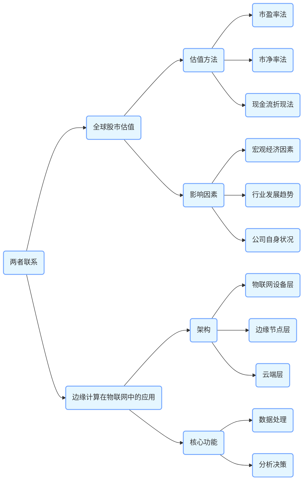

# 全球股市估值与边缘计算在物联网中的应用

> 关键词：全球股市估值、边缘计算、物联网、估值模型、应用场景

> 摘要：本文深入探讨了全球股市估值与边缘计算在物联网中应用这两个看似不同但又存在潜在联系的领域。首先详细介绍了全球股市估值的背景、方法和影响因素，阐述了边缘计算在物联网中的核心概念、原理和架构。接着通过具体的算法原理、数学模型及实际案例，分别对股市估值和边缘计算在物联网中的应用进行了剖析。还探讨了边缘计算应用对股市相关企业估值的潜在影响。最后分析了这两个领域的未来发展趋势与挑战，为相关领域的从业者和研究者提供了全面且深入的参考。

## 1. 背景介绍 
### 1.1 目的和范围
本文旨在全面研究全球股市估值的方法和影响因素，同时深入探讨边缘计算在物联网中的具体应用。在股市估值方面，我们将涵盖常见的估值模型，分析宏观经济、行业发展等因素对股市估值的影响。对于边缘计算在物联网中的应用，我们将研究其技术原理、架构和实际应用场景。此外，还将探讨边缘计算在物联网中的发展对相关上市企业股市估值的潜在影响，以揭示这两个领域之间的内在联系。

### 1.2 预期读者
本文适合金融分析师、投资经理、物联网和边缘计算领域的技术专家、研究人员以及对金融市场和新兴技术感兴趣的爱好者阅读。金融从业者可以从本文中了解边缘计算技术发展对股市相关板块的影响，为投资决策提供参考；技术人员可以通过对股市估值的了解，更好地把握行业发展的经济环境和市场需求；爱好者则可以获得对这两个领域的全面认识。

### 1.3 文档结构概述
本文首先介绍背景信息，包括目的、预期读者和文档结构。接着阐述全球股市估值和边缘计算在物联网中的核心概念与联系。然后分别讲解股市估值和边缘计算的核心算法原理及具体操作步骤，以及相关的数学模型和公式，并举例说明。之后通过实际项目案例，详细解释股市估值分析和边缘计算在物联网中的代码实现。再探讨边缘计算在物联网中的实际应用场景，推荐相关的学习资源、开发工具和论文著作。最后总结两个领域的未来发展趋势与挑战，并提供常见问题解答和扩展阅读参考资料。

### 1.4 术语表
#### 1.4.1 核心术语定义
- **全球股市估值**：指对全球范围内各个股票市场上上市公司的价值进行评估的过程和方法，通过分析公司的财务状况、盈利能力、行业前景等因素，确定股票的合理价格。
- **边缘计算**：是一种将计算和数据存储靠近数据源的分布式计算范式，在物联网设备或其附近进行数据处理和分析，减少数据传输延迟，提高系统的响应速度和效率。
- **物联网（IoT）**：通过各种信息传感器、射频识别技术、全球定位系统等技术和装置，将任何物品与互联网相连接，进行信息交换和通信，以实现智能化识别、定位、跟踪、监控和管理的一种网络。

#### 1.4.2 相关概念解释
- **市盈率（P/E）**：是股票价格除以每股收益的比率，反映了市场对公司盈利能力的预期，是股市估值中常用的指标之一。
- **数据聚合**：在边缘计算中，将多个物联网设备产生的分散数据进行收集和整合的过程，以便进行更有效的处理和分析。

#### 1.4.3 缩略词列表
- **P/E**：市盈率（Price-to-Earnings Ratio）
- **IoT**：物联网（Internet of Things）

## 2. 核心概念与联系 

### 2.1 全球股市估值核心概念
全球股市估值是金融领域的重要课题，其目的是确定上市公司股票的内在价值。常见的估值方法包括市盈率法、市净率法、现金流折现法等。市盈率法通过比较公司的市盈率与行业平均市盈率，判断股票是否被高估或低估。市净率法是用股票价格除以每股净资产，反映了市场对公司净资产的定价。现金流折现法是将公司未来的现金流按照一定的折现率折现到当前，以评估公司的价值。

影响全球股市估值的因素众多，宏观经济因素如 GDP 增长率、通货膨胀率、利率等会影响整个股市的估值水平。行业发展趋势也会对相关企业的估值产生重要影响，新兴行业如科技、医疗等往往具有较高的估值，而传统行业的估值相对较低。公司自身的财务状况、盈利能力、市场竞争力等也是决定其估值的关键因素。

### 2.2 边缘计算在物联网中的核心概念
边缘计算是物联网发展的关键技术之一。在传统的物联网架构中，大量的数据需要传输到云端进行处理，这会导致数据传输延迟、带宽压力大等问题。边缘计算通过在物联网设备或其附近设置边缘节点，将部分数据处理和分析任务放在本地进行，减少了数据传输的距离和时间，提高了系统的响应速度和可靠性。

边缘计算的架构通常包括物联网设备层、边缘节点层和云端层。物联网设备层负责采集各种数据，如传感器数据、视频图像等。边缘节点层对这些数据进行初步处理和分析，如数据过滤、聚合、特征提取等。云端层则负责对边缘节点上传的经过处理的数据进行进一步的分析和存储，以及提供全局的决策和管理。

### 2.3 两者的联系
边缘计算在物联网中的应用对相关上市企业的股市估值具有潜在影响。随着物联网市场的不断扩大，边缘计算技术的需求也在增加。掌握边缘计算核心技术的企业有望在物联网市场中获得竞争优势，提高市场份额和盈利能力，从而提升其股市估值。例如，一些提供边缘计算解决方案的科技公司，其业绩可能会随着物联网项目的增加而增长，进而推动其股价上涨。

反之，股市估值的变化也会影响边缘计算和物联网领域的发展。如果相关企业的股市估值较高，企业可以通过融资获得更多的资金，用于技术研发和市场拓展，促进边缘计算和物联网技术的创新和应用。

### 核心概念原理和架构的文本示意图
```plaintext
全球股市估值
├── 估值方法
│   ├── 市盈率法
│   ├── 市净率法
│   ├── 现金流折现法
├── 影响因素
│   ├── 宏观经济因素
│   ├── 行业发展趋势
│   ├── 公司自身状况

边缘计算在物联网中的应用
├── 架构
│   ├── 物联网设备层
│   ├── 边缘节点层
│   ├── 云端层
├── 核心功能
│   ├── 数据处理
│   ├── 分析决策
```

### Mermaid 流程图


## 3. 核心算法原理 & 具体操作步骤 

### 3.1 全球股市估值核心算法原理及步骤
#### 3.1.1 市盈率法
市盈率法是最常用的股市估值方法之一。其基本原理是通过比较公司的市盈率与行业平均市盈率，来判断股票的估值水平。市盈率的计算公式为：
$$P/E = \frac{股价}{每股收益}$$

具体操作步骤如下：
```python
# 示例代码：使用市盈率法进行股市估值
def pe_valuation(stock_price, earnings_per_share, industry_pe):
    """
    计算股票的合理价格并判断估值情况
    :param stock_price: 当前股票价格
    :param earnings_per_share: 每股收益
    :param industry_pe: 行业平均市盈率
    :return: 合理价格，估值情况
    """
    # 计算合理价格
    fair_price = earnings_per_share * industry_pe
    if stock_price > fair_price:
        valuation_status = "高估"
    elif stock_price < fair_price:
        valuation_status = "低估"
    else:
        valuation_status = "合理"
    return fair_price, valuation_status

# 示例数据
stock_price = 50
earnings_per_share = 2
industry_pe = 20

fair_price, valuation_status = pe_valuation(stock_price, earnings_per_share, industry_pe)
print(f"合理价格: {fair_price} 元，当前股票估值情况: {valuation_status}")
```

#### 3.1.2 现金流折现法
现金流折现法的原理是将公司未来的现金流按照一定的折现率折现到当前，以评估公司的价值。其基本公式为：
$$V = \sum_{t=1}^{n} \frac{CF_t}{(1 + r)^t}$$
其中，$V$ 表示公司的价值，$CF_t$ 表示第 $t$ 期的现金流，$r$ 表示折现率，$n$ 表示预测期数。

具体操作步骤如下：
```python
# 示例代码：使用现金流折现法进行股市估值
def dcf_valuation(cash_flows, discount_rate):
    """
    计算公司的价值
    :param cash_flows: 未来各期的现金流列表
    :param discount_rate: 折现率
    :return: 公司的价值
    """
    company_value = 0
    for t, cf in enumerate(cash_flows, start=1):
        company_value += cf / ((1 + discount_rate) ** t)
    return company_value

# 示例数据
cash_flows = [100, 120, 150, 180, 200]
discount_rate = 0.1

company_value = dcf_valuation(cash_flows, discount_rate)
print(f"公司的价值: {company_value} 元")
```

### 3.2 边缘计算在物联网中的核心算法原理及步骤
#### 3.2.1 数据过滤算法
在边缘计算中，数据过滤是减少数据传输量的重要步骤。常见的数据过滤算法有阈值过滤法。其原理是设置一个阈值，当数据超过或低于该阈值时，才将数据传输到云端。

具体操作步骤如下：
```python
# 示例代码：使用阈值过滤法进行数据过滤
def threshold_filter(data, threshold):
    """
    阈值过滤函数
    :param data: 输入的数据列表
    :param threshold: 阈值
    :return: 过滤后的数据列表
    """
    filtered_data = []
    for value in data:
        if abs(value) > threshold:
            filtered_data.append(value)
    return filtered_data

# 示例数据
data = [1, 5, -2, 8, 3, -1]
threshold = 3

filtered_data = threshold_filter(data, threshold)
print(f"过滤后的数据: {filtered_data}")
```

#### 3.2.2 数据聚合算法
数据聚合算法用于将多个物联网设备产生的分散数据进行整合。常见的数据聚合算法有平均值聚合算法。其原理是计算一组数据的平均值。

具体操作步骤如下：
```python
# 示例代码：使用平均值聚合算法进行数据聚合
def average_aggregation(data):
    """
    平均值聚合函数
    :param data: 输入的数据列表
    :return: 聚合后的平均值
    """
    if len(data) == 0:
        return 0
    return sum(data) / len(data)

# 示例数据
data = [10, 20, 30, 40, 50]

aggregated_value = average_aggregation(data)
print(f"聚合后的平均值: {aggregated_value}")
```

## 4. 数学模型和公式 & 详细讲解 & 举例说明 

### 4.1 全球股市估值数学模型和公式
#### 4.1.1 市盈率法
市盈率法的数学模型为：
$$P = EPS \times PE$$
其中，$P$ 表示股票的合理价格，$EPS$ 表示每股收益，$PE$ 表示市盈率。

例如，某公司的每股收益为 3 元，行业平均市盈率为 25，则该公司股票的合理价格为：
$$P = 3 \times 25 = 75$$（元）

如果该公司当前的股票价格为 80 元，则说明该股票可能被高估。

#### 4.1.2 市净率法
市净率法的数学模型为：
$$P = BVPS \times PB$$
其中，$P$ 表示股票的合理价格，$BVPS$ 表示每股净资产，$PB$ 表示市净率。

例如，某公司的每股净资产为 10 元，行业平均市净率为 2，则该公司股票的合理价格为：
$$P = 10 \times 2 = 20$$（元）

#### 4.1.3 现金流折现法
现金流折现法的数学模型为：
$$V = \sum_{t=1}^{n} \frac{CF_t}{(1 + r)^t}$$
其中，$V$ 表示公司的价值，$CF_t$ 表示第 $t$ 期的现金流，$r$ 表示折现率，$n$ 表示预测期数。

假设某公司未来 5 年的现金流分别为 100 万元、120 万元、150 万元、180 万元、200 万元，折现率为 10%，则该公司的价值为：
$$V = \frac{100}{(1 + 0.1)^1} + \frac{120}{(1 + 0.1)^2} + \frac{150}{(1 + 0.1)^3} + \frac{180}{(1 + 0.1)^4} + \frac{200}{(1 + 0.1)^5}$$
```python
import math

cash_flows = [100, 120, 150, 180, 200]
discount_rate = 0.1
company_value = 0
for t, cf in enumerate(cash_flows, start=1):
    company_value += cf / math.pow(1 + discount_rate, t)

print(f"公司的价值: {company_value} 万元")
```

### 4.2 边缘计算在物联网中的数学模型和公式
#### 4.2.1 数据过滤算法
阈值过滤法的数学模型可以表示为：
$$
f(x) = 
\begin{cases}
x, & \text{if } |x| > \theta \\
0, & \text{otherwise}
\end{cases}
$$
其中，$x$ 表示输入的数据，$\theta$ 表示阈值，$f(x)$ 表示过滤后的数据。

例如，当阈值 $\theta = 3$ 时，输入数据 $x = 5$，则过滤后的数据 $f(5) = 5$；输入数据 $x = 2$，则过滤后的数据 $f(2) = 0$。

#### 4.2.2 数据聚合算法
平均值聚合算法的数学模型为：
$$\bar{x} = \frac{1}{n} \sum_{i=1}^{n} x_i$$
其中，$\bar{x}$ 表示聚合后的平均值，$x_i$ 表示第 $i$ 个数据，$n$ 表示数据的个数。

例如，有一组数据 $x_1 = 10$，$x_2 = 20$，$x_3 = 30$，则聚合后的平均值为：
$$\bar{x} = \frac{10 + 20 + 30}{3} = 20$$

## 5. 项目实战：代码实际案例和详细解释说明 

### 5.1  开发环境搭建
#### 5.1.1 股市估值分析环境搭建
- **编程语言**：Python 是进行股市估值分析的常用语言，我们可以使用 Anaconda 来管理 Python 环境。
- **开发工具**：推荐使用 PyCharm 作为集成开发环境（IDE），它具有强大的代码编辑、调试和项目管理功能。
- **数据获取**：可以使用第三方库如 `pandas-datareader` 来获取股票数据，使用 `yfinance` 库获取雅虎财经的股票数据。

安装相关库的命令如下：
```sh
pip install pandas-datareader yfinance
```

#### 5.1.2 边缘计算在物联网中的应用环境搭建
- **编程语言**：Python 同样适用于边缘计算在物联网中的开发，也可以使用 C、C++ 等语言进行性能优化。
- **开发工具**：使用 Visual Studio Code 作为代码编辑器，它支持多种编程语言和丰富的插件。
- **模拟物联网设备**：可以使用 Raspberry Pi 等单板计算机模拟物联网设备，使用 MQTT 协议进行数据传输。

安装 MQTT 客户端库的命令如下：
```sh
pip install paho-mqtt
```

### 5.2  源代码详细实现和代码解读
#### 5.2.1 股市估值分析代码实现
```python
import yfinance as yf
import pandas as pd

# 获取股票数据
def get_stock_data(ticker, start_date, end_date):
    """
    获取指定股票在指定日期范围内的数据
    :param ticker: 股票代码
    :param start_date: 开始日期
    :param end_date: 结束日期
    :return: 股票数据
    """
    stock = yf.Ticker(ticker)
    data = stock.history(start=start_date, end=end_date)
    return data

# 计算每股收益
def calculate_eps(net_income, shares_outstanding):
    """
    计算每股收益
    :param net_income: 净利润
    :param shares_outstanding: 流通股数量
    :return: 每股收益
    """
    return net_income / shares_outstanding

# 使用市盈率法进行估值
def pe_valuation(stock_price, earnings_per_share, industry_pe):
    """
    计算股票的合理价格并判断估值情况
    :param stock_price: 当前股票价格
    :param earnings_per_share: 每股收益
    :param industry_pe: 行业平均市盈率
    :return: 合理价格，估值情况
    """
    fair_price = earnings_per_share * industry_pe
    if stock_price > fair_price:
        valuation_status = "高估"
    elif stock_price < fair_price:
        valuation_status = "低估"
    else:
        valuation_status = "合理"
    return fair_price, valuation_status

# 示例数据
ticker = "AAPL"
start_date = "2023-01-01"
end_date = "2023-12-31"
net_income = 10000000000  # 假设净利润为 100 亿美元
shares_outstanding = 1000000000  # 假设流通股数量为 10 亿股
industry_pe = 20

# 获取股票数据
stock_data = get_stock_data(ticker, start_date, end_date)
last_close_price = stock_data['Close'].iloc[-1]

# 计算每股收益
eps = calculate_eps(net_income, shares_outstanding)

# 进行估值分析
fair_price, valuation_status = pe_valuation(last_close_price, eps, industry_pe)

print(f"股票代码: {ticker}")
print(f"当前股票价格: {last_close_price} 美元")
print(f"每股收益: {eps} 美元")
print(f"合理价格: {fair_price} 美元，当前股票估值情况: {valuation_status}")
```

**代码解读**：
- `get_stock_data` 函数使用 `yfinance` 库获取指定股票在指定日期范围内的历史数据。
- `calculate_eps` 函数根据净利润和流通股数量计算每股收益。
- `pe_valuation` 函数使用市盈率法计算股票的合理价格，并判断股票的估值情况。
- 主程序中，我们首先获取苹果公司（股票代码为 "AAPL"）的股票数据，然后计算每股收益，最后进行估值分析并输出结果。

#### 5.2.2 边缘计算在物联网中的应用代码实现
```python
import paho.mqtt.client as mqtt
import random
import time

# 模拟物联网设备
def simulate_iot_device(client, topic):
    """
    模拟物联网设备发送数据
    :param client: MQTT 客户端
    :param topic: MQTT 主题
    """
    while True:
        # 模拟传感器数据
        sensor_data = random.randint(0, 100)
        client.publish(topic, str(sensor_data))
        print(f"发送数据: {sensor_data}")
        time.sleep(5)

# 边缘节点数据处理
def on_message(client, userdata, msg):
    """
    处理接收到的 MQTT 消息
    :param client: MQTT 客户端
    :param userdata: 用户数据
    :param msg: MQTT 消息
    """
    data = int(msg.payload.decode())
    # 简单的数据过滤，假设阈值为 30
    if data > 30:
        print(f"接收到有效数据: {data}")
    else:
        print(f"数据过滤: {data} 被过滤")

# MQTT 连接回调函数
def on_connect(client, userdata, flags, rc):
    """
    MQTT 连接成功回调函数
    :param client: MQTT 客户端
    :param userdata: 用户数据
    :param flags: 连接标志
    :param rc: 连接结果码
    """
    print("Connected with result code " + str(rc))
    client.subscribe("iot/sensor")

# 创建 MQTT 客户端
client = mqtt.Client()
client.on_connect = on_connect
client.on_message = on_message

# 连接 MQTT 服务器
client.connect("localhost", 1883, 60)

# 启动循环处理网络流量
client.loop_start()

# 模拟物联网设备发送数据
simulate_iot_device(client, "iot/sensor")
```

**代码解读**：
- `simulate_iot_device` 函数模拟物联网设备，每隔 5 秒随机生成一个 0 到 100 之间的传感器数据，并通过 MQTT 协议发送到指定主题。
- `on_message` 函数是 MQTT 消息处理回调函数，当接收到消息时，将消息转换为整数，并进行简单的数据过滤，当数据大于 30 时认为是有效数据。
- `on_connect` 函数是 MQTT 连接成功回调函数，连接成功后订阅 "iot/sensor" 主题。
- 主程序中，我们创建 MQTT 客户端，设置回调函数，连接到 MQTT 服务器，启动循环处理网络流量，最后模拟物联网设备发送数据。

### 5.3  代码解读与分析
#### 5.3.1 股市估值分析代码分析
- **数据获取**：使用 `yfinance` 库可以方便地获取股票的历史数据，但需要注意网络连接和数据的准确性。
- **估值计算**：市盈率法是一种简单直观的估值方法，但它忽略了公司的未来增长潜力和风险等因素。在实际应用中，可以结合其他估值方法进行综合分析。
- **结果判断**：估值结果只是一个参考，股票市场受到多种因素的影响，实际股价可能会偏离合理价格。

#### 5.3.2 边缘计算在物联网中的应用代码分析
- **数据传输**：使用 MQTT 协议进行数据传输，具有轻量级、易于实现的特点，但需要注意网络安全和可靠性。
- **数据处理**：简单的数据过滤算法可以减少数据传输量，但对于复杂的数据分析需求，需要使用更高级的算法和技术。
- **系统扩展性**：该示例代码可以作为基础框架，通过添加更多的物联网设备和边缘节点，以及更复杂的数据处理逻辑，实现更强大的边缘计算系统。

## 6. 实际应用场景 
### 6.1 全球股市估值的应用场景
#### 6.1.1 投资决策
投资者可以使用股市估值方法来评估股票的价值，判断股票是否被高估或低估，从而做出投资决策。例如，当股票被低估时，投资者可以考虑买入；当股票被高估时，投资者可以考虑卖出或持币观望。

#### 6.1.2 公司并购
在公司并购过程中，需要对目标公司进行估值，以确定合理的收购价格。股市估值方法可以为并购交易提供参考，帮助双方达成公平的交易。

#### 6.1.3 行业分析
通过对行业内不同公司的估值分析，可以了解行业的发展趋势和竞争格局。例如，如果某个行业内大部分公司的估值都较高，说明该行业具有较好的发展前景；如果某个行业内公司的估值普遍较低，可能意味着该行业面临着较大的竞争压力或发展瓶颈。

### 6.2 边缘计算在物联网中的应用场景
#### 6.2.1 工业物联网
在工业生产中，大量的传感器和设备会产生海量的数据。边缘计算可以在本地对这些数据进行实时处理和分析，及时发现设备故障和生产异常，提高生产效率和质量。例如，在智能工厂中，边缘计算可以对机器设备的运行状态进行实时监测，提前预测设备故障，减少停机时间。

#### 6.2.2 智能交通
在智能交通系统中，边缘计算可以用于处理交通摄像头、传感器等设备产生的数据。例如，通过边缘计算可以实时分析交通流量、识别违章行为，实现交通信号的智能控制，提高交通效率和安全性。

#### 6.2.3 智能家居
在智能家居中，边缘计算可以使智能设备在本地进行数据处理和决策，减少对云端的依赖。例如，智能门锁可以在本地对指纹、人脸等识别数据进行处理，实现快速开锁，提高用户体验。

### 6.3 两者结合的应用场景
随着边缘计算在物联网中的应用不断发展，相关上市企业的业绩和市场前景也会受到影响。金融机构和投资者可以通过分析边缘计算和物联网行业的发展趋势，对相关企业进行股市估值分析，寻找投资机会。例如，对于掌握边缘计算核心技术的物联网企业，如果其市场份额不断扩大，盈利能力不断增强，其股市估值可能会上升，投资者可以考虑买入该企业的股票。

## 7. 工具和资源推荐
### 7.1 学习资源推荐
#### 7.1.1 书籍推荐
- 《证券分析》（Security Analysis）：由本杰明·格雷厄姆（Benjamin Graham）和戴维·多德（David Dodd）所著，是股市估值和投资分析的经典著作，介绍了多种估值方法和投资原则。
- 《物联网：技术、应用与标准》：全面介绍了物联网的技术架构、应用场景和标准规范，对于了解物联网的基本概念和发展趋势有很大帮助。
- 《边缘计算：原理、技术与应用》：详细阐述了边缘计算的原理、技术和应用案例，是学习边缘计算的重要参考书籍。

#### 7.1.2 在线课程
- Coursera 上的 “Financial Markets” 课程：由耶鲁大学教授罗伯特·席勒（Robert Shiller）授课，介绍了金融市场的基本原理和投资策略，包括股市估值方法。
- edX 上的 “Internet of Things (IoT) Fundamentals” 课程：讲解了物联网的基础知识、技术架构和应用案例，适合初学者学习。
- Udemy 上的 “Edge Computing for Beginners” 课程：从入门到实践，介绍了边缘计算的概念、技术和应用开发。

#### 7.1.3 技术博客和网站
- Seeking Alpha：提供了大量的股市分析和估值报告，是投资者获取股市信息和分析的重要平台。
- IoT Agenda：专注于物联网技术和应用的新闻和分析，涵盖了边缘计算、传感器技术等方面的内容。
- Edge Computing World：专门介绍边缘计算的最新技术、应用案例和行业动态。

### 7.2 开发工具框架推荐
#### 7.2.1 IDE和编辑器
- PyCharm：功能强大的 Python 集成开发环境，适合进行股市估值分析和边缘计算在物联网中的 Python 开发。
- Visual Studio Code：轻量级的代码编辑器，支持多种编程语言和丰富的插件，可用于边缘计算和物联网项目的开发。
- Eclipse：广泛使用的 Java 开发工具，也可以用于开发物联网和边缘计算相关的 Java 项目。

#### 7.2.2 调试和性能分析工具
- pdb：Python 自带的调试器，可以帮助开发者调试 Python 代码，查找程序中的错误。
- VisualVM：一款开源的 Java 性能分析工具，可以对 Java 程序进行内存分析、线程分析等，优化程序性能。
- Wireshark：网络协议分析工具，可以用于分析 MQTT 等网络协议的数据包，排查网络通信问题。

#### 7.2.3 相关框架和库
- Pandas：Python 中用于数据处理和分析的强大库，可用于处理股票数据和物联网传感器数据。
- Scikit-learn：Python 中的机器学习库，可用于股市估值模型的训练和预测，以及边缘计算中的数据分析和模式识别。
- Eclipse Vert.x：用于构建响应式、分布式应用程序的 Java 框架，可用于开发边缘计算和物联网应用。

### 7.3 相关论文著作推荐
#### 7.3.1 经典论文
- “The Theory of Investment Value” by John Burr Williams：提出了现金流折现法的基本原理，是股市估值领域的经典论文。
- “Edge Computing: Vision and Challenges” by Willy Zeng et al.：对边缘计算的概念、架构和面临的挑战进行了深入探讨，是边缘计算领域的重要论文。

#### 7.3.2 最新研究成果
- 在 IEEE Transactions on Industrial Informatics、ACM Transactions on Sensor Networks 等期刊上可以找到关于边缘计算在物联网中应用的最新研究成果。
- 在 Journal of Financial Economics、Review of Financial Studies 等期刊上可以了解到股市估值方法的最新研究进展。

#### 7.3.3 应用案例分析
- 一些知名企业如 Google、Amazon 等会发布关于边缘计算和物联网应用的案例分析报告，可以通过企业官网或相关技术论坛获取。
- 金融机构和研究机构也会发布关于股市估值和投资分析的案例研究报告，为投资者提供参考。

## 8. 总结：未来发展趋势与挑战
### 8.1 全球股市估值的未来发展趋势与挑战
#### 8.1.1 发展趋势
- **多因素模型的应用**：未来股市估值将越来越多地采用多因素模型，综合考虑宏观经济、行业发展、公司治理等多个因素，提高估值的准确性和可靠性。
- **大数据和人工智能的应用**：随着大数据和人工智能技术的发展，股市估值将可以利用更多的数据来源和更复杂的算法进行分析。例如，通过分析社交媒体数据、新闻报道等非结构化数据，挖掘市场情绪和潜在的投资机会。
- **国际化趋势加强**：全球金融市场的一体化程度不断提高，股市估值也将更加注重国际比较和全球视野。投资者将更加关注不同国家和地区股市的估值差异，进行跨境投资和资产配置。

#### 8.1.2 挑战
- **数据质量和可靠性**：股市估值需要大量的财务数据和市场信息，数据的质量和可靠性直接影响估值的准确性。然而，数据造假、信息不对称等问题仍然存在，给股市估值带来了挑战。
- **市场不确定性**：股市受到宏观经济、政策变化、突发事件等多种因素的影响，市场不确定性增加。如何在不确定的市场环境中准确评估股票的价值，是股市估值面临的重要挑战。
- **模型的局限性**：现有的股市估值模型都有一定的局限性，无法完全准确地反映股票的真实价值。例如，市盈率法忽略了公司的未来增长潜力，现金流折现法对未来现金流和折现率的预测存在较大的不确定性。

### 8.2 边缘计算在物联网中的未来发展趋势与挑战
#### 8.2.1 发展趋势
- **与人工智能的深度融合**：边缘计算将与人工智能技术深度融合，实现边缘智能。在边缘节点上进行机器学习和深度学习模型的训练和推理，提高物联网系统的智能决策能力和实时响应速度。
- **标准化和互操作性增强**：随着边缘计算的发展，标准化和互操作性问题将得到重视。制定统一的标准和规范，促进不同厂商的边缘计算设备和平台之间的互联互通，推动边缘计算在物联网中的大规模应用。
- **应用场景不断拓展**：边缘计算在物联网中的应用场景将不断拓展，除了工业物联网、智能交通、智能家居等领域，还将在医疗、能源、农业等领域得到广泛应用。

#### 8.2.2 挑战
- **资源受限**：边缘节点通常具有有限的计算资源、存储资源和能源供应，如何在资源受限的情况下实现高效的数据处理和分析，是边缘计算面临的重要挑战。
- **安全和隐私问题**：边缘计算涉及大量的物联网设备和用户数据，安全和隐私问题至关重要。如何保障边缘计算系统的安全性，防止数据泄露和攻击，是需要解决的关键问题。
- **网络通信问题**：边缘计算需要与云端和其他边缘节点进行通信，网络通信的稳定性和可靠性直接影响边缘计算的性能。如何优化网络通信，减少数据传输延迟和丢包率，是边缘计算需要解决的问题。

### 8.3 两者结合的未来发展趋势与挑战
#### 8.3.1 发展趋势
- **金融科技的创新应用**：边缘计算在物联网中的应用将为金融科技带来新的创新机遇。例如，通过实时获取物联网设备产生的企业运营数据，金融机构可以更准确地评估企业的信用风险，进行精准的信贷决策。
- **投资机会的增加**：随着边缘计算和物联网行业的发展，相关上市企业的数量和规模将不断增加，为投资者提供更多的投资机会。投资者可以通过深入了解边缘计算和物联网技术，挖掘具有潜力的企业进行投资。

#### 8.3.2 挑战
- **技术评估难度大**：边缘计算和物联网技术发展迅速，技术更新换代快。金融机构和投资者在评估相关企业的技术实力和发展前景时，面临较大的难度。
- **行业监管的不确定性**：边缘计算和物联网行业涉及多个领域和行业，行业监管政策尚不完善。监管政策的不确定性可能会对相关企业的发展和股市估值产生影响。

## 9. 附录：常见问题与解答
### 9.1 全球股市估值相关问题
#### 9.1.1 问：市盈率法适用于所有行业吗？
答：市盈率法并不适用于所有行业。一些新兴行业如科技、生物制药等，由于其未来增长潜力较大，市盈率通常较高；而一些传统行业如钢铁、煤炭等，市盈率相对较低。此外，处于亏损状态的公司无法使用市盈率法进行估值。

#### 9.1.2 问：现金流折现法中的折现率如何确定？
答：折现率的确定是现金流折现法的关键和难点。折现率通常反映了投资者对投资风险的预期。可以参考市场利率、行业平均收益率等因素来确定折现率。一般来说，风险越高的投资，折现率越高。

### 9.2 边缘计算在物联网中的应用相关问题
#### 9.2.1 问：边缘计算和云计算有什么区别？
答：边缘计算将计算和数据存储靠近数据源，在本地进行数据处理和分析，减少了数据传输延迟，提高了系统的响应速度和可靠性。云计算则是将数据集中存储和处理在云端服务器上，适合处理大规模的数据和复杂的计算任务。边缘计算和云计算可以相互补充，共同构建物联网的计算架构。

#### 9.2.2 问：边缘计算如何保障数据安全？
答：边缘计算可以通过多种方式保障数据安全。例如，采用加密技术对数据进行加密传输和存储，防止数据泄露；使用访问控制技术，限制对边缘节点和数据的访问权限；进行安全审计和监测，及时发现和处理安全威胁。

### 9.3 两者结合相关问题
#### 9.3.1 问：边缘计算在物联网中的应用对股市相关企业估值有多大影响？
答：边缘计算在物联网中的应用对股市相关企业估值的影响程度取决于多个因素。如果企业能够成功应用边缘计算技术，提高生产效率、降低成本、拓展市场份额，那么其业绩可能会增长，从而提升股市估值。但如果企业在技术研发、市场推广等方面遇到困难，可能无法实现预期的收益，对股市估值的影响也会有限。

#### 9.3.2 问：投资者如何评估边缘计算和物联网相关企业的投资价值？
答：投资者可以从多个方面评估边缘计算和物联网相关企业的投资价值。首先，要关注企业的技术实力和创新能力，了解其在边缘计算和物联网领域的核心技术和专利情况。其次，要分析企业的市场份额和客户群体，判断其市场竞争力。此外，还要考虑企业的财务状况、盈利能力和发展前景等因素。

## 10. 扩展阅读 & 参考资料
### 10.1 扩展阅读
- 《聪明的投资者》（The Intelligent Investor）：同样是本杰明·格雷厄姆的经典著作，进一步阐述了价值投资的理念和方法，对于股市估值和投资决策有很大的启示。
- 《工业 4.0：即将来袭的第四次工业革命》：介绍了工业 4.0 的概念、技术和应用，其中涉及到边缘计算和物联网在工业领域的应用，有助于深入了解相关技术的发展趋势。
- 《智能时代：大数据与智能革命重新定义未来》：探讨了大数据和人工智能技术对社会和经济的影响，对于理解边缘计算和物联网在智能时代的重要性有很大帮助。

### 10.2 参考资料
- 雅虎财经（https://finance.yahoo.com/）：提供全球股市的实时行情、财务数据和分析报告。
- IEEE 官网（https://www.ieee.org/）：发布关于边缘计算、物联网等领域的最新研究成果和技术标准。
- 中国证券监督管理委员会（https://www.csrc.gov.cn/）：提供中国股市的政策法规、市场监管等方面的信息。

以上文章从多个方面对全球股市估值与边缘计算在物联网中的应用进行了深入探讨，希望能为读者提供有价值的参考和启示。在实际应用中，读者可以根据具体情况进一步深入研究和实践。 