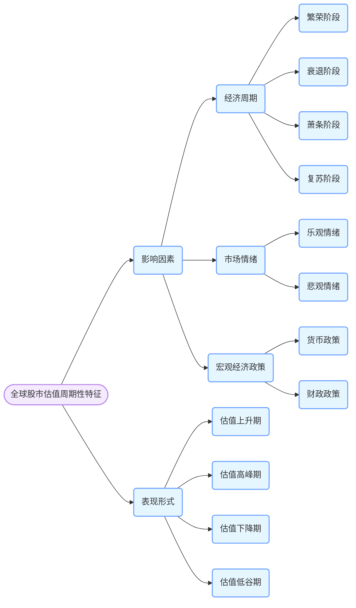

# 全球股市估值周期性特征探讨

> 关键词：全球股市、估值、周期性特征、经济周期、市场情绪

> 摘要：本文旨在深入探讨全球股市估值的周期性特征。通过对相关核心概念的阐述，分析股市估值周期性变化的原理和影响因素。运用数学模型和算法对股市估值进行量化分析，并结合实际案例进行详细解读。同时，探讨全球股市估值周期性特征在不同实际应用场景中的表现，推荐相关的学习资源、开发工具和研究论文。最后，总结全球股市估值周期性特征的未来发展趋势与挑战，解答常见问题并提供扩展阅读和参考资料，为投资者和研究人员全面了解全球股市估值的周期性变化提供参考。

## 1. 背景介绍 
### 1.1 目的和范围
全球股市作为经济的重要组成部分，其估值的周期性变化对于投资者的决策、金融市场的稳定以及宏观经济的运行都具有重要影响。本文的目的在于系统地探讨全球股市估值的周期性特征，包括其形成原因、表现形式以及对市场的影响。研究范围涵盖了全球主要股票市场，如美国股市、欧洲股市、亚洲股市等，通过对不同市场的综合分析，揭示全球股市估值周期性变化的共性和特性。

### 1.2 预期读者
本文预期读者包括金融投资者、金融分析师、学术研究人员以及对全球股市感兴趣的人士。对于投资者来说，了解股市估值的周期性特征有助于制定合理的投资策略，降低投资风险；对于金融分析师而言，能够为其进行市场分析和预测提供理论支持；对于学术研究人员，可作为进一步深入研究的参考；对于普通读者，能增进对全球股市运行机制的理解。

### 1.3 文档结构概述
本文首先介绍全球股市估值周期性特征探讨的背景信息，包括目的、预期读者和文档结构概述等。接着阐述核心概念与联系，通过文本示意图和 Mermaid 流程图展示相关原理和架构。然后详细讲解核心算法原理和具体操作步骤，并用 Python 源代码进行阐述。之后介绍数学模型和公式，通过举例说明其应用。再通过项目实战，展示代码实际案例并进行详细解释。随后探讨实际应用场景，推荐相关的工具和资源。最后总结未来发展趋势与挑战，解答常见问题并提供扩展阅读和参考资料。

### 1.4 术语表
#### 1.4.1 核心术语定义
- **股市估值**：指对股票市场整体或个别股票的价值进行评估的过程和结果。常见的估值指标包括市盈率（P/E）、市净率（P/B）、股息率等。
- **周期性特征**：指事物在发展过程中呈现出的有规律的重复变化特征。在全球股市中，估值的周期性特征表现为股市估值在一定时间内经历上升、下降的循环过程。
- **经济周期**：指经济活动沿着经济发展的总体趋势所经历的有规律的扩张和收缩。经济周期通常包括繁荣、衰退、萧条和复苏四个阶段。

#### 1.4.2 相关概念解释
- **市场情绪**：指投资者对市场的信心和预期，是影响股市估值的重要因素之一。市场情绪乐观时，投资者愿意支付更高的价格购买股票，推动股市估值上升；反之，市场情绪悲观时，股市估值往往下降。
- **宏观经济政策**：政府为了实现宏观经济目标而采取的一系列政策措施，如货币政策、财政政策等。宏观经济政策的调整会对股市估值产生重要影响。例如，宽松的货币政策会增加市场流动性，推动股市估值上升。

#### 1.4.3 缩略词列表
- **P/E**：市盈率（Price-to-Earnings Ratio），指股票价格与每股收益的比率，是衡量股票估值的常用指标之一。
- **P/B**：市净率（Price-to-Book Ratio），指股票价格与每股净资产的比率，反映了市场对公司净资产的估值水平。

## 2. 核心概念与联系 

### 核心概念原理
股市估值的周期性变化是多种因素共同作用的结果。从宏观层面来看，经济周期是影响股市估值的重要因素。在经济繁荣阶段，企业盈利增长，投资者对市场前景乐观，股市估值往往上升；而在经济衰退阶段，企业盈利下降，投资者信心受挫，股市估值下降。

市场情绪也对股市估值的周期性变化产生重要影响。投资者的情绪波动会导致股票市场的供需关系发生变化，进而影响股市估值。例如，当市场出现利好消息时，投资者情绪高涨，纷纷买入股票，推动股市估值上升；反之，当市场出现利空消息时，投资者情绪恐慌，纷纷卖出股票，导致股市估值下降。

宏观经济政策的调整也会对股市估值的周期性变化产生影响。政府通过货币政策和财政政策来调节经济增长和稳定物价，这些政策的变化会直接或间接地影响企业的盈利和投资者的预期，从而影响股市估值。

### 架构的文本示意图
```plaintext
全球股市估值周期性特征
|-- 影响因素
|   |-- 经济周期
|   |   |-- 繁荣阶段（企业盈利增长，股市估值上升）
|   |   |-- 衰退阶段（企业盈利下降，股市估值下降）
|   |   |-- 萧条阶段（股市估值低迷）
|   |   |-- 复苏阶段（股市估值逐渐回升）
|   |-- 市场情绪
|   |   |-- 乐观情绪（投资者买入，股市估值上升）
|   |   |-- 悲观情绪（投资者卖出，股市估值下降）
|   |-- 宏观经济政策
|   |   |-- 货币政策（宽松货币政策，股市估值上升；紧缩货币政策，股市估值下降）
|   |   |-- 财政政策（积极财政政策，股市估值上升；消极财政政策，股市估值下降）
|-- 表现形式
|   |-- 估值上升期
|   |-- 估值高峰期
|   |-- 估值下降期
|   |-- 估值低谷期
```

### Mermaid 流程图


## 3. 核心算法原理 & 具体操作步骤 

### 核心算法原理
我们可以通过对股市估值指标（如市盈率、市净率等）的时间序列数据进行分析，来识别股市估值的周期性特征。一种常用的方法是使用傅里叶变换将时间序列数据转换到频域，从而找出数据中的周期性成分。

傅里叶变换的基本思想是将一个复杂的周期信号分解为一系列不同频率的正弦和余弦波的叠加。对于一个离散的时间序列 $x[n]$，其离散傅里叶变换（DFT）定义为：

$X[k] = \sum_{n=0}^{N-1} x[n] e^{-i \frac{2\pi}{N} k n}$

其中，$N$ 是时间序列的长度，$k = 0, 1, \cdots, N - 1$。

通过计算 $X[k]$ 的模 $|X[k]|$，我们可以得到时间序列的频谱，频谱中的峰值对应着时间序列中的主要周期性成分。

### 具体操作步骤
1. **数据收集**：收集全球主要股票市场的估值指标（如市盈率、市净率等）的时间序列数据。
2. **数据预处理**：对收集到的数据进行清洗和预处理，包括去除缺失值、异常值等。
3. **傅里叶变换**：使用 Python 中的 `numpy.fft.fft` 函数对预处理后的数据进行离散傅里叶变换。
4. **频谱分析**：计算傅里叶变换结果的模，找出频谱中的峰值，确定主要的周期性成分。
5. **周期识别**：根据频谱中的峰值对应的频率，计算出股市估值的周期。

### Python 源代码
```python
import numpy as np
import matplotlib.pyplot as plt

# 模拟股市估值时间序列数据
np.random.seed(0)
N = 1000  # 数据长度
t = np.arange(N)
# 假设存在一个周期为 100 的周期性成分，以及一些随机噪声
x = np.sin(2 * np.pi * t / 100) + 0.1 * np.random.randn(N)

# 进行离散傅里叶变换
X = np.fft.fft(x)

# 计算频谱
freqs = np.fft.fftfreq(N)
magnitude = np.abs(X)

# 找出频谱中的峰值
peak_index = np.argmax(magnitude[1:N//2]) + 1  # 忽略直流分量
peak_freq = freqs[peak_index]
period = 1 / np.abs(peak_freq)

# 绘制原始数据和频谱
plt.figure(figsize=(12, 6))
plt.subplot(2, 1, 1)
plt.plot(t, x)
plt.title('Original Stock Valuation Time Series')
plt.xlabel('Time')
plt.ylabel('Valuation')

plt.subplot(2, 1, 2)
plt.plot(freqs[:N//2], magnitude[:N//2])
plt.title('Spectrum of Stock Valuation Time Series')
plt.xlabel('Frequency')
plt.ylabel('Magnitude')
plt.scatter(peak_freq, magnitude[peak_index], color='r', label=f'Peak at {peak_freq:.4f} Hz, Period = {period:.2f}')
plt.legend()

plt.tight_layout()
plt.show()

print(f'The main period of the stock valuation time series is {period:.2f} time units.')
```

## 4. 数学模型和公式 & 详细讲解 & 举例说明 

### 数学模型和公式
#### 离散傅里叶变换（DFT）
离散傅里叶变换（DFT）是将一个离散的时间序列转换到频域的数学工具。对于一个长度为 $N$ 的离散时间序列 $x[n]$，其 DFT 定义为：

$$X[k] = \sum_{n=0}^{N-1} x[n] e^{-i \frac{2\pi}{N} k n}, \quad k = 0, 1, \cdots, N - 1$$

其中，$X[k]$ 是频域中的系数，$e^{-i \frac{2\pi}{N} k n}$ 是复指数函数，$i$ 是虚数单位。

#### 逆离散傅里叶变换（IDFT）
逆离散傅里叶变换（IDFT）是将频域中的系数转换回时间序列的数学工具。对于频域系数 $X[k]$，其 IDFT 定义为：

$$x[n] = \frac{1}{N} \sum_{k=0}^{N-1} X[k] e^{i \frac{2\pi}{N} k n}, \quad n = 0, 1, \cdots, N - 1$$

### 详细讲解
离散傅里叶变换的核心思想是将一个离散的时间序列表示为一系列不同频率的复指数函数的线性组合。每个复指数函数的系数 $X[k]$ 表示该频率成分在时间序列中的幅度和相位。

频谱是通过计算 $X[k]$ 的模 $|X[k]|$ 得到的，它反映了时间序列中不同频率成分的强度。频谱中的峰值对应着时间序列中的主要周期性成分，通过找出峰值对应的频率 $f$，可以计算出周期 $T$：

$$T = \frac{1}{|f|}$$

### 举例说明
假设我们有一个长度为 $N = 100$ 的离散时间序列 $x[n]$，其表达式为：

$$x[n] = \sin(2\pi \frac{n}{10}) + 0.5 \sin(2\pi \frac{n}{20})$$

这个时间序列包含两个周期性成分，周期分别为 $T_1 = 10$ 和 $T_2 = 20$。

我们可以使用 Python 代码来计算该时间序列的 DFT 和频谱：

```python
import numpy as np
import matplotlib.pyplot as plt

# 生成时间序列
N = 100
n = np.arange(N)
x = np.sin(2 * np.pi * n / 10) + 0.5 * np.sin(2 * np.pi * n / 20)

# 进行离散傅里叶变换
X = np.fft.fft(x)

# 计算频谱
freqs = np.fft.fftfreq(N)
magnitude = np.abs(X)

# 绘制原始数据和频谱
plt.figure(figsize=(12, 6))
plt.subplot(2, 1, 1)
plt.plot(n, x)
plt.title('Original Time Series')
plt.xlabel('Time')
plt.ylabel('Amplitude')

plt.subplot(2, 1, 2)
plt.plot(freqs[:N//2], magnitude[:N//2])
plt.title('Spectrum of Time Series')
plt.xlabel('Frequency')
plt.ylabel('Magnitude')

plt.tight_layout()
plt.show()
```

运行上述代码后，我们可以看到频谱中在频率 $f_1 = \frac{1}{10}$ 和 $f_2 = \frac{1}{20}$ 处有明显的峰值，这对应着时间序列中的两个周期性成分。

## 5. 项目实战：代码实际案例和详细解释说明 

### 5.1  开发环境搭建
在进行全球股市估值周期性特征分析的项目实战之前，我们需要搭建相应的开发环境。以下是具体的步骤：

#### 安装 Python
首先，确保你已经安装了 Python 3.x 版本。你可以从 Python 官方网站（https://www.python.org/downloads/） 下载并安装适合你操作系统的 Python 版本。

#### 安装必要的库
我们需要安装一些用于数据处理、分析和可视化的 Python 库，包括 `pandas`、`numpy`、`matplotlib`、`yfinance` 等。可以使用以下命令来安装这些库：

```sh
pip install pandas numpy matplotlib yfinance
```

### 5.2  源代码详细实现和代码解读
以下是一个完整的 Python 代码示例，用于分析美国股市（以标普 500 指数为例）的市盈率估值的周期性特征：

```python
import yfinance as yf
import pandas as pd
import numpy as np
import matplotlib.pyplot as plt

# 下载标普 500 指数的市盈率数据
ticker = '^GSPC'
start_date = '2000-01-01'
end_date = '2023-12-31'
data = yf.Ticker(ticker).history(start=start_date, end=end_date)
pe_ratio = data['P/E Ratio']  # 假设 yfinance 能获取市盈率数据，实际可能需要其他数据源

# 数据预处理
pe_ratio = pe_ratio.dropna()  # 去除缺失值

# 进行离散傅里叶变换
N = len(pe_ratio)
X = np.fft.fft(pe_ratio)

# 计算频谱
freqs = np.fft.fftfreq(N)
magnitude = np.abs(X)

# 找出频谱中的峰值
peak_index = np.argmax(magnitude[1:N//2]) + 1  # 忽略直流分量
peak_freq = freqs[peak_index]
period = 1 / np.abs(peak_freq)

# 绘制原始数据和频谱
plt.figure(figsize=(12, 6))
plt.subplot(2, 1, 1)
plt.plot(pe_ratio.index, pe_ratio)
plt.title('S&P 500 P/E Ratio Time Series')
plt.xlabel('Date')
plt.ylabel('P/E Ratio')

plt.subplot(2, 1, 2)
plt.plot(freqs[:N//2], magnitude[:N//2])
plt.title('Spectrum of S&P 500 P/E Ratio Time Series')
plt.xlabel('Frequency')
plt.ylabel('Magnitude')
plt.scatter(peak_freq, magnitude[peak_index], color='r', label=f'Peak at {peak_freq:.4f} Hz, Period = {period:.2f}')
plt.legend()

plt.tight_layout()
plt.show()

print(f'The main period of the S&P 500 P/E ratio time series is {period:.2f} days.')
```

### 5.3  代码解读与分析
1. **数据下载**：使用 `yfinance` 库下载标普 500 指数的历史数据。需要注意的是，`yfinance` 可能无法直接获取市盈率数据，实际应用中可能需要从其他数据源获取。
2. **数据预处理**：使用 `dropna()` 方法去除数据中的缺失值，以确保数据的质量。
3. **离散傅里叶变换**：使用 `np.fft.fft()` 函数对市盈率时间序列数据进行离散傅里叶变换，得到频域系数。
4. **频谱计算**：计算频域系数的模，得到频谱。频谱反映了时间序列中不同频率成分的强度。
5. **峰值识别**：找出频谱中的峰值，忽略直流分量（频率为 0 的成分）。峰值对应的频率即为主要的周期性成分的频率。
6. **周期计算**：根据峰值对应的频率，计算出股市估值的周期。
7. **可视化**：使用 `matplotlib` 库绘制原始的市盈率时间序列数据和频谱，直观地展示数据的特征和周期性成分。

通过对代码的运行结果进行分析，我们可以得到标普 500 指数市盈率估值的主要周期，从而了解美国股市估值的周期性特征。

## 6. 实际应用场景 
### 投资决策
投资者可以根据全球股市估值的周期性特征来制定投资策略。在股市估值处于低谷期时，投资者可以考虑增加股票投资，因为此时股票价格相对较低，具有较高的投资价值；而在股市估值处于高峰期时，投资者可以考虑减少股票投资，以避免市场回调带来的风险。例如，在 2008 年全球金融危机后，全球股市估值大幅下降，许多投资者抓住了这个机会，在低谷期买入股票，随着市场的复苏，获得了丰厚的回报。

### 风险管理
金融机构和投资者可以利用股市估值的周期性特征来进行风险管理。通过监测股市估值的变化，及时调整投资组合的风险暴露程度。当股市估值接近峰值时，金融机构可以增加风险对冲措施，如买入看跌期权、增加债券投资等，以降低投资组合的风险；当股市估值接近低谷时，可以适当增加风险资产的配置，提高投资组合的预期收益。

### 宏观经济分析
股市估值的周期性特征可以作为宏观经济分析的重要参考指标。股市是经济的晴雨表，股市估值的变化反映了投资者对宏观经济前景的预期。当股市估值上升时，通常意味着投资者对经济前景乐观，经济可能处于扩张阶段；当股市估值下降时，可能意味着投资者对经济前景悲观，经济可能面临衰退风险。政府和政策制定者可以根据股市估值的周期性变化，及时调整宏观经济政策，以促进经济的稳定增长。

### 市场监管
证券监管机构可以通过监测股市估值的周期性特征，及时发现市场异常波动和潜在的风险。当股市估值出现异常快速上升或下降时，监管机构可以采取相应的措施，如加强市场监管、调整交易规则等，以维护市场的稳定和公平。例如，在股市泡沫时期，监管机构可以加强对市场操纵、内幕交易等违法行为的打击力度，防止市场过度投机。

## 7. 工具和资源推荐
### 7.1 学习资源推荐
#### 7.1.1 书籍推荐
- 《金融市场与金融机构基础》（Fundamentals of Financial Markets and Institutions）：这本书全面介绍了金融市场和金融机构的基本概念、运作机制和风险管理等内容，对于理解全球股市的运行机制和估值原理具有重要的参考价值。
- 《聪明的投资者》（The Intelligent Investor）：被誉为投资领域的圣经，作者本杰明·格雷厄姆（Benjamin Graham）提出了价值投资的理念和方法，对于投资者如何评估股票估值、制定投资策略具有重要的指导意义。
- 《漫步华尔街》（A Random Walk Down Wall Street）：这本书深入浅出地介绍了股票市场的投资理论和实践，包括有效市场假说、资产配置等内容，帮助读者了解股市的周期性特征和投资规律。

#### 7.1.2 在线课程
- Coursera 上的 “Financial Markets” 课程：由耶鲁大学教授罗伯特·席勒（Robert Shiller）主讲，该课程系统地介绍了金融市场的基本原理、投资策略和风险管理等内容，对于学习全球股市估值和投资具有很大的帮助。
- edX 上的 “Investment Management” 课程：由哥伦比亚大学教授主讲，该课程深入探讨了投资管理的理论和实践，包括资产定价、投资组合管理等内容，适合有一定金融基础的学习者。

#### 7.1.3 技术博客和网站
- Seeking Alpha：这是一个专业的金融投资网站，提供全球股市的实时行情、分析评论和投资建议等内容，对于了解全球股市估值的最新动态和市场趋势具有重要的参考价值。
- Bloomberg：全球知名的金融资讯提供商，提供全面的金融市场数据、新闻和分析报告，是金融从业者和投资者获取信息的重要来源。

### 7.2 开发工具框架推荐
#### 7.2.1 IDE和编辑器
- PyCharm：一款专业的 Python 集成开发环境（IDE），具有强大的代码编辑、调试和分析功能，适合进行金融数据分析和算法开发。
- Jupyter Notebook：一种交互式的开发环境，支持多种编程语言，尤其适合进行数据探索和可视化分析。在金融数据分析中，Jupyter Notebook 可以方便地展示代码和分析结果，便于交流和分享。

#### 7.2.2 调试和性能分析工具
- PDB：Python 自带的调试器，可以帮助开发者逐行调试代码，查找和解决代码中的问题。
- cProfile：Python 标准库中的性能分析工具，可以统计代码的运行时间和函数调用次数，帮助开发者找出代码中的性能瓶颈。

#### 7.2.3 相关框架和库
- Pandas：一个强大的数据处理和分析库，提供了高效的数据结构和数据操作方法，适合处理金融时间序列数据。
- Numpy：Python 的数值计算库，提供了高效的数组和矩阵运算功能，是进行金融数据分析和算法实现的基础库。
- Matplotlib：一个用于数据可视化的 Python 库，可以绘制各种类型的图表，如折线图、柱状图、散点图等，帮助开发者直观地展示数据和分析结果。

### 7.3 相关论文著作推荐
#### 7.3.1 经典论文
- Eugene F. Fama, “Efficient Capital Markets: A Review of Theory and Empirical Work”：这篇论文提出了有效市场假说（Efficient Market Hypothesis），对金融市场的定价机制和效率进行了深入的探讨，是金融领域的经典论文之一。
- Robert J. Shiller, “Do Stock Prices Move Too Much to Be Justified by Subsequent Changes in Dividends?”：这篇论文通过实证研究发现股票价格的波动幅度往往超过了股息的变化幅度，对有效市场假说提出了挑战，引发了学术界对股市估值和市场波动的深入研究。

#### 7.3.2 最新研究成果
- 关注顶级金融学术期刊，如 The Journal of Finance、The Review of Financial Studies 等，这些期刊发表了大量关于金融市场、资产定价和投资策略等方面的最新研究成果，可以及时了解全球股市估值周期性特征的最新研究动态。

#### 7.3.3 应用案例分析
- 可以参考一些专业的金融研究报告和案例分析，如麦肯锡、波士顿咨询等咨询公司发布的关于金融市场和投资领域的研究报告，这些报告通常包含了丰富的实际案例和数据分析，对于理解全球股市估值的周期性特征在实际应用中的表现具有重要的参考价值。

## 8. 总结：未来发展趋势与挑战
### 未来发展趋势
- **全球化趋势加强**：随着全球经济一体化的不断深入，全球股市之间的联系将更加紧密，股市估值的周期性特征也将更加趋于同步。投资者需要更加关注全球经济和金融市场的动态，以更好地把握股市估值的变化趋势。
- **科技驱动创新**：科技的不断进步将为股市估值的分析和预测带来新的方法和工具。例如，人工智能、机器学习等技术的应用将能够更准确地分析股市估值的周期性特征，提高投资决策的效率和准确性。
- **可持续投资兴起**：随着社会对可持续发展的关注度不断提高，可持续投资将成为未来股市投资的重要趋势。投资者将更加关注企业的环境、社会和治理（ESG）表现，这将对股市估值的周期性特征产生影响。

### 挑战
- **不确定性增加**：全球政治、经济环境的不确定性不断增加，如贸易摩擦、地缘政治冲突等，这些因素将增加股市估值的波动性和不确定性，给投资者的决策带来更大的挑战。
- **数据质量和隐私问题**：在利用大数据和人工智能技术进行股市估值分析时，数据质量和隐私问题将成为重要的挑战。如何确保数据的准确性、完整性和安全性，以及如何保护投资者的隐私，将是需要解决的关键问题。
- **模型风险**：现有的股市估值分析模型大多基于历史数据和假设，存在一定的局限性。在市场环境发生重大变化时，模型的预测能力可能会下降，甚至失效。因此，如何提高模型的适应性和鲁棒性，降低模型风险，是未来需要面对的挑战之一。

## 9. 附录：常见问题与解答
### 问题 1：如何准确判断股市估值处于周期的哪个阶段？
解答：判断股市估值处于周期的哪个阶段需要综合考虑多个因素，包括宏观经济数据、市场情绪指标、估值指标（如市盈率、市净率等）以及历史数据的比较等。例如，当宏观经济数据显示经济处于扩张阶段，市场情绪乐观，估值指标高于历史均值时，股市估值可能处于上升期或高峰期；反之，当经济数据不佳，市场情绪悲观，估值指标低于历史均值时，股市估值可能处于下降期或低谷期。

### 问题 2：股市估值的周期性特征是否会受到突发事件的影响？
解答：会。突发事件，如自然灾害、政治事件、公共卫生事件等，可能会对股市估值的周期性特征产生短期或长期的影响。例如，2020 年新冠疫情的爆发导致全球股市大幅下跌，打乱了原有的估值周期。突发事件会改变投资者的预期和市场情绪，从而影响股市的供需关系和估值水平。

### 问题 3：不同国家和地区的股市估值周期性特征有何差异？
解答：不同国家和地区的股市估值周期性特征可能存在差异，这主要受到当地的经济发展水平、政治稳定性、货币政策、文化背景等因素的影响。例如，发达国家的股市通常更加成熟，估值周期性特征相对较为稳定；而新兴市场国家的股市由于经济增长较快、市场机制不完善等原因，估值周期性特征可能更加剧烈和不稳定。

### 问题 4：如何利用股市估值的周期性特征进行投资组合的优化？
解答：投资者可以根据股市估值的周期性特征，在股市估值处于低谷期时增加股票投资的比例，在股市估值处于高峰期时减少股票投资的比例，同时增加债券、现金等其他资产的配置，以降低投资组合的风险。此外，还可以根据不同国家和地区股市估值的周期性差异，进行全球资产配置，实现投资组合的多元化和优化。

## 10. 扩展阅读 & 参考资料
### 扩展阅读
- 《金融炼金术》（The Alchemy of Finance）：作者乔治·索罗斯（George Soros）提出了反身性理论，探讨了金融市场中投资者的认知和行为对市场价格的影响，对于理解股市估值的周期性变化具有重要的启示作用。
- 《非理性繁荣》（Irrational Exuberance）：罗伯特·席勒（Robert Shiller）的著作，分析了股市泡沫的形成和破灭机制，以及投资者的非理性行为对股市估值的影响。

### 参考资料
- 各国证券交易所官方网站，获取股市的实时行情和相关数据。
- 国际货币基金组织（IMF）、世界银行等国际组织发布的经济报告和研究数据，用于分析全球经济形势和宏观经济政策对股市估值的影响。
- 金融学术数据库，如 SSRN、EconLit 等，获取最新的金融学术研究成果和论文。