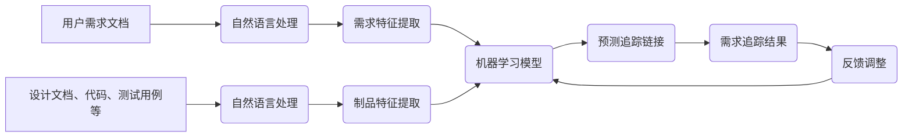

# 利用人工智能进行软件需求追踪

> 关键词：人工智能、软件需求追踪、自然语言处理、机器学习、需求工程、软件质量、追踪技术

> 摘要：本文聚焦于利用人工智能进行软件需求追踪这一前沿技术领域。软件需求追踪在软件开发过程中起着至关重要的作用，它有助于确保软件系统满足用户需求，提高软件质量和可维护性。随着人工智能技术的飞速发展，将其应用于软件需求追踪为解决传统追踪方法的诸多问题提供了新的思路和方法。文章详细介绍了软件需求追踪的背景知识，阐述了相关核心概念与联系，深入剖析了利用人工智能实现需求追踪的核心算法原理及具体操作步骤，给出了相应的数学模型和公式，并结合实际案例进行了说明。此外，还探讨了该技术的实际应用场景，推荐了相关的学习资源、开发工具框架以及论文著作。最后，对未来的发展趋势与挑战进行了总结，旨在为相关领域的研究者和从业者提供全面且深入的参考。

## 1. 背景介绍 
### 1.1 目的和范围
软件需求追踪的目的在于建立从用户需求到软件系统各个层次的可追溯性，确保软件系统的每一个部分都与用户需求相关联。当需求发生变更时，能够快速准确地评估其影响范围，保证软件的一致性和完整性。利用人工智能进行软件需求追踪的范围涵盖了从需求文档的分析、需求与设计文档的关联、需求与代码的映射等多个方面，旨在提高需求追踪的准确性、效率和自动化程度。

### 1.2 预期读者
本文预期读者包括软件工程师、需求分析师、软件项目经理、人工智能研究者以及对软件需求工程和人工智能应用感兴趣的相关人员。对于软件工程师和需求分析师，本文可以帮助他们了解如何利用人工智能技术改进现有的需求追踪方法，提高工作效率和软件质量；对于软件项目经理，有助于他们更好地管理项目进度和质量；对于人工智能研究者，提供了一个新的应用场景和研究方向。

### 1.3 文档结构概述
本文首先介绍了软件需求追踪的背景知识，包括目的、预期读者和文档结构概述等内容。接着阐述了利用人工智能进行软件需求追踪的核心概念与联系，通过文本示意图和 Mermaid 流程图进行直观展示。然后深入讲解了核心算法原理及具体操作步骤，并给出了 Python 源代码示例。随后介绍了相关的数学模型和公式，并通过举例进行说明。在项目实战部分，详细介绍了开发环境搭建、源代码实现和代码解读。之后探讨了该技术的实际应用场景，推荐了相关的学习资源、开发工具框架和论文著作。最后对未来发展趋势与挑战进行总结，并提供了常见问题与解答以及扩展阅读和参考资料。

### 1.4 术语表
#### 1.4.1 核心术语定义
- **软件需求追踪**：在整个软件开发过程中，建立和维护需求与其他软件制品（如设计文档、代码、测试用例等）之间的可追溯性联系的过程。
- **人工智能**：研究如何使计算机能够模拟人类的智能行为，包括学习、推理、决策等能力的学科。
- **自然语言处理（NLP）**：人工智能的一个分支，主要研究如何让计算机处理和理解人类语言。
- **机器学习**：人工智能的一个重要领域，通过让计算机从数据中学习模式和规律，从而实现预测和决策等任务。

#### 1.4.2 相关概念解释
- **需求文档**：记录用户需求的文档，通常包括功能需求、非功能需求等内容。
- **设计文档**：描述软件系统的架构、模块划分、接口等设计信息的文档。
- **代码**：实现软件系统功能的程序代码。
- **追踪链接**：用于表示需求与其他软件制品之间的关联关系的信息。

#### 1.4.3 缩略词列表
- **NLP**：自然语言处理（Natural Language Processing）
- **ML**：机器学习（Machine Learning）
- **AI**：人工智能（Artificial Intelligence）

## 2. 核心概念与联系 
### 2.1 软件需求追踪的基本概念
软件需求追踪是确保软件系统与用户需求一致性的重要手段。它主要包括两种类型的追踪：正向追踪和反向追踪。正向追踪是从需求到设计、代码、测试用例等的追踪，用于确保需求得到了正确的实现；反向追踪是从代码、测试用例等到需求的追踪，用于在软件变更时评估需求的影响范围。

### 2.2 人工智能在需求追踪中的应用
人工智能技术在软件需求追踪中具有重要的应用价值。自然语言处理技术可以用于对需求文档和其他软件制品进行文本分析，提取关键信息；机器学习技术可以用于训练模型，预测需求与其他软件制品之间的关联关系。通过人工智能的应用，可以提高需求追踪的自动化程度和准确性。

### 2.3 核心概念原理和架构的文本示意图
```plaintext
用户需求文档 --(自然语言处理)--> 需求特征提取
                |
                v
设计文档、代码、测试用例等 --(自然语言处理)--> 制品特征提取
                |
                v
机器学习模型 --(训练)--> 预测追踪链接
                |
                v
需求追踪结果 --(反馈调整)--> 机器学习模型
```

### 2.4 Mermaid 流程图


## 3. 核心算法原理 & 具体操作步骤 
### 3.1 基于自然语言处理的特征提取算法
自然语言处理在需求追踪中起着关键作用，它可以将文本数据转换为计算机能够处理的特征向量。常用的自然语言处理技术包括词法分析、句法分析和语义分析。以下是一个简单的基于 Python 的词频统计特征提取示例：

```python
import re
from collections import Counter

def preprocess_text(text):
    # 去除标点符号和转换为小写
    text = re.sub(r'[^\w\s]', '', text).lower()
    return text

def extract_features(text):
    text = preprocess_text(text)
    words = text.split()
    word_counts = Counter(words)
    return word_counts

# 示例用法
需求文档 = "这个软件需要实现用户登录和注册功能。"
features = extract_features(需求文档)
print(features)
```

### 3.2 机器学习模型训练算法
在特征提取之后，需要使用机器学习模型来训练预测追踪链接。常用的机器学习算法包括支持向量机（SVM）、决策树、神经网络等。以下是一个基于 Python 的支持向量机模型训练示例：

```python
from sklearn.feature_extraction.text import TfidfVectorizer
from sklearn.svm import SVC
from sklearn.model_selection import train_test_split
from sklearn.metrics import accuracy_score

# 示例数据
需求文档列表 = ["这个软件需要实现用户登录和注册功能。", "该系统应具备数据存储和查询功能。"]
制品文档列表 = ["用户登录模块的实现代码。", "数据存储类的设计文档。"]
标签列表 = [1, 1]  # 1 表示相关，0 表示不相关

# 特征提取
vectorizer = TfidfVectorizer()
需求特征 = vectorizer.fit_transform(需求文档列表)
制品特征 = vectorizer.transform(制品文档列表)

# 划分训练集和测试集
X = 需求特征
y = 标签列表
X_train, X_test, y_train, y_test = train_test_split(X, y, test_size=0.2, random_state=42)

# 训练模型
model = SVC()
model.fit(X_train, y_train)

# 预测
y_pred = model.predict(X_test)

# 评估模型
accuracy = accuracy_score(y_test, y_pred)
print(f"模型准确率: {accuracy}")
```

### 3.3 具体操作步骤
1. **数据收集**：收集需求文档、设计文档、代码、测试用例等相关数据。
2. **数据预处理**：对收集到的数据进行清洗、分词、去除停用词等预处理操作。
3. **特征提取**：使用自然语言处理技术提取需求文档和其他软件制品的特征。
4. **模型训练**：选择合适的机器学习模型，使用提取的特征进行训练。
5. **预测追踪链接**：使用训练好的模型对新的数据进行预测，得到需求与其他软件制品之间的追踪链接。
6. **评估和调整**：对预测结果进行评估，根据评估结果调整模型和特征提取方法。

## 4. 数学模型和公式 & 详细讲解 & 举例说明 
### 4.1 词频 - 逆文档频率（TF - IDF）模型
词频 - 逆文档频率（TF - IDF）是一种常用的文本特征表示方法，用于衡量一个词在文档中的重要性。其计算公式如下：

$$TF - IDF(t, d, D) = TF(t, d) \times IDF(t, D)$$

其中，$TF(t, d)$ 表示词 $t$ 在文档 $d$ 中的词频，计算公式为：

$$TF(t, d) = \frac{词 t 在文档 d 中出现的次数}{文档 d 中的总词数}$$

$IDF(t, D)$ 表示词 $t$ 在文档集合 $D$ 中的逆文档频率，计算公式为：

$$IDF(t, D) = \log(\frac{文档集合 D 中的文档总数}{包含词 t 的文档数 + 1})$$

### 4.2 支持向量机（SVM）模型
支持向量机（SVM）是一种常用的分类模型，其目标是找到一个最优的超平面，将不同类别的数据分开。对于线性可分的情况，SVM 的优化目标可以表示为：

$$\min_{w, b} \frac{1}{2} \|w\|^2$$

$$s.t. y_i(w^T x_i + b) \geq 1, i = 1, 2, \cdots, n$$

其中，$w$ 是超平面的法向量，$b$ 是偏置，$x_i$ 是第 $i$ 个样本的特征向量，$y_i$ 是第 $i$ 个样本的标签。

### 4.3 举例说明
假设我们有一个文档集合 $D$ 包含三个文档：

$d_1$: "苹果 香蕉 橙子"
$d_2$: "苹果 葡萄"
$d_3$: "香蕉 草莓"

我们来计算词 "苹果" 的 TF - IDF 值。

- **计算词频（TF）**：
  - 在 $d_1$ 中，"苹果" 的词频 $TF(苹果, d_1) = \frac{1}{3}$
  - 在 $d_2$ 中，"苹果" 的词频 $TF(苹果, d_2) = \frac{1}{2}$
  - 在 $d_3$ 中，"苹果" 的词频 $TF(苹果, d_3) = 0$

- **计算逆文档频率（IDF）**：
  包含 "苹果" 的文档数为 2，文档集合 $D$ 中的文档总数为 3，则 $IDF(苹果, D) = \log(\frac{3}{2 + 1}) = \log(1) = 0$

- **计算 TF - IDF**：
  - 在 $d_1$ 中，$TF - IDF(苹果, d_1, D) = TF(苹果, d_1) \times IDF(苹果, D) = \frac{1}{3} \times 0 = 0$
  - 在 $d_2$ 中，$TF - IDF(苹果, d_2, D) = TF(苹果, d_2) \times IDF(苹果, D) = \frac{1}{2} \times 0 = 0$
  - 在 $d_3$ 中，$TF - IDF(苹果, d_3, D) = TF(苹果, d_3) \times IDF(苹果, D) = 0 \times 0 = 0$

## 5. 项目实战：代码实际案例和详细解释说明 
### 5.1  开发环境搭建
1. **安装 Python**：建议使用 Python 3.7 及以上版本，可以从 Python 官方网站（https://www.python.org/downloads/）下载并安装。
2. **安装必要的库**：使用 pip 命令安装所需的库，例如：
```bash
pip install scikit-learn nltk pandas numpy
```
3. **安装开发工具**：可以选择使用 PyCharm、Jupyter Notebook 等开发工具。

### 5.2  源代码详细实现和代码解读
以下是一个完整的利用人工智能进行软件需求追踪的项目示例：

```python
import re
from collections import Counter
from sklearn.feature_extraction.text import TfidfVectorizer
from sklearn.svm import SVC
from sklearn.model_selection import train_test_split
from sklearn.metrics import accuracy_score
import nltk
from nltk.corpus import stopwords
nltk.download('stopwords')

# 数据收集
需求文档列表 = ["这个软件需要实现用户登录和注册功能。", "该系统应具备数据存储和查询功能。"]
制品文档列表 = ["用户登录模块的实现代码。", "数据存储类的设计文档。"]
标签列表 = [1, 1]  # 1 表示相关，0 表示不相关

# 数据预处理
def preprocess_text(text):
    # 去除标点符号和转换为小写
    text = re.sub(r'[^\w\s]', '', text).lower()
    # 去除停用词
    stop_words = set(stopwords.words('chinese'))
    words = text.split()
    filtered_words = [word for word in words if word not in stop_words]
    return " ".join(filtered_words)

需求文档列表 = [preprocess_text(text) for text in 需求文档列表]
制品文档列表 = [preprocess_text(text) for text in 制品文档列表]

# 特征提取
vectorizer = TfidfVectorizer()
需求特征 = vectorizer.fit_transform(需求文档列表)
制品特征 = vectorizer.transform(制品文档列表)

# 划分训练集和测试集
X = 需求特征
y = 标签列表
X_train, X_test, y_train, y_test = train_test_split(X, y, test_size=0.2, random_state=42)

# 训练模型
model = SVC()
model.fit(X_train, y_train)

# 预测
y_pred = model.predict(X_test)

# 评估模型
accuracy = accuracy_score(y_test, y_pred)
print(f"模型准确率: {accuracy}")
```

### 5.3  代码解读与分析
1. **数据收集**：定义了需求文档列表、制品文档列表和标签列表，模拟实际的数据收集过程。
2. **数据预处理**：使用 `preprocess_text` 函数对文本数据进行预处理，包括去除标点符号、转换为小写和去除停用词。
3. **特征提取**：使用 `TfidfVectorizer` 类将文本数据转换为 TF - IDF 特征向量。
4. **划分训练集和测试集**：使用 `train_test_split` 函数将数据划分为训练集和测试集。
5. **训练模型**：使用支持向量机（SVM）模型进行训练。
6. **预测和评估**：使用训练好的模型进行预测，并使用 `accuracy_score` 函数评估模型的准确率。

## 6. 实际应用场景 
### 6.1 大型软件项目开发
在大型软件项目开发中，需求文档往往非常复杂，涉及到多个功能模块和多个团队的协作。利用人工智能进行软件需求追踪可以帮助项目团队快速准确地找到需求与设计、代码之间的关联关系，提高项目的开发效率和质量。当需求发生变更时，能够及时评估其影响范围，避免因需求变更导致的错误和延误。

### 6.2 软件维护和升级
在软件维护和升级过程中，需要对现有的软件系统进行修改和扩展。通过需求追踪，可以确保修改和扩展的部分与原有的需求保持一致，避免引入新的问题。同时，也可以帮助开发人员更好地理解软件系统的架构和功能，提高维护和升级的效率。

### 6.3 软件质量保证
软件质量保证部门可以利用需求追踪技术来检查软件系统是否满足用户需求。通过对需求与测试用例的关联分析，可以确保测试用例覆盖了所有的需求，提高软件的测试覆盖率和质量。

## 7. 工具和资源推荐
### 7.1 学习资源推荐
#### 7.1.1 书籍推荐
- 《自然语言处理入门》：介绍了自然语言处理的基本概念、算法和应用，适合初学者入门。
- 《机器学习》：详细讲解了机器学习的各种算法和模型，是学习机器学习的经典教材。
- 《软件需求最佳实践：SERU过程框架原理与应用》：深入探讨了软件需求工程的相关知识和实践方法。

#### 7.1.2 在线课程
- Coursera 上的 "Natural Language Processing Specialization"：由顶尖大学的教授授课，系统地介绍了自然语言处理的知识和技术。
- edX 上的 "Machine Learning Fundamentals"：帮助学习者掌握机器学习的基本原理和方法。
- 中国大学 MOOC 上的 "软件需求工程"：提供了软件需求工程的相关课程，适合对需求工程感兴趣的学习者。

#### 7.1.3 技术博客和网站
- 博客园：有很多关于软件开发、人工智能和需求工程的技术文章和经验分享。
- 开源中国：提供了丰富的开源项目和技术资讯，对学习和实践有很大的帮助。
- Towards Data Science：专注于数据科学和人工智能领域的技术博客，有很多高质量的文章。

### 7.2 开发工具框架推荐
#### 7.2.1 IDE和编辑器
- PyCharm：一款专门为 Python 开发设计的集成开发环境，功能强大，方便调试和开发。
- Jupyter Notebook：交互式的开发环境，适合进行数据探索和模型实验。
- Visual Studio Code：轻量级的代码编辑器，支持多种编程语言和插件扩展。

#### 7.2.2 调试和性能分析工具
- PySnooper：可以方便地调试 Python 代码，查看变量的值和函数的调用过程。
- cProfile：Python 自带的性能分析工具，用于分析代码的性能瓶颈。
- TensorBoard：用于可视化深度学习模型的训练过程和性能指标。

#### 7.2.3 相关框架和库
- NLTK：自然语言处理的经典库，提供了丰富的工具和数据集。
- Scikit-learn：机器学习的常用库，包含了各种机器学习算法和工具。
- TensorFlow 和 PyTorch：深度学习的框架，用于构建和训练神经网络模型。

### 7.3 相关论文著作推荐
#### 7.3.1 经典论文
- "Automatic Requirements Tracing Using Machine Learning Techniques"：介绍了利用机器学习技术进行需求追踪的方法和实验结果。
- "A Survey on Requirements Traceability"：对需求追踪的相关技术和方法进行了全面的综述。

#### 7.3.2 最新研究成果
- 关注顶级学术会议（如 ICSE、RE 等）和期刊（如 IEEE Transactions on Software Engineering 等）上的最新研究成果，了解利用人工智能进行软件需求追踪的前沿技术。

#### 7.3.3 应用案例分析
- 一些知名企业的技术博客和研究报告中会分享他们在软件需求追踪方面的实践经验和应用案例，可以从中学习到实际应用中的技巧和方法。

## 8. 总结：未来发展趋势与挑战
### 8.1 未来发展趋势
- **多模态数据融合**：未来的需求追踪将不仅仅局限于文本数据，还会融合图像、音频等多模态数据，以更全面地理解用户需求和软件系统。
- **深度学习的应用**：深度学习技术在自然语言处理和机器学习领域取得了巨大的成功，未来将更多地应用于需求追踪中，提高追踪的准确性和效率。
- **智能化的需求管理系统**：结合人工智能技术，开发智能化的需求管理系统，实现需求的自动收集、分析、追踪和变更管理。

### 8.2 挑战
- **数据质量问题**：需求文档和其他软件制品的数据质量往往参差不齐，存在噪声、歧义等问题，影响人工智能模型的训练和预测效果。
- **语义理解的局限性**：自然语言处理技术在语义理解方面还存在一定的局限性，对于一些复杂的需求和领域特定的术语，难以准确理解其含义。
- **模型可解释性**：一些复杂的人工智能模型（如深度学习模型）的可解释性较差，难以理解模型的决策过程和依据，给需求追踪的结果验证和质量保证带来困难。

## 9. 附录：常见问题与解答
### 9.1 如何处理不同语言的需求文档？
可以使用不同语言的自然语言处理工具和数据集，例如对于英语可以使用 NLTK，对于中文可以使用 jieba 等工具。同时，在特征提取和模型训练过程中，要考虑语言的特点和差异。

### 9.2 如何提高需求追踪的准确性？
可以从以下几个方面入手：提高数据质量，选择合适的特征提取方法和机器学习模型，进行充分的模型训练和调优，结合人工验证和反馈等。

### 9.3 人工智能模型训练需要多少数据？
数据量的需求取决于具体的模型和任务。一般来说，数据量越大，模型的泛化能力越强。但也需要注意数据的质量和多样性，避免过拟合。

## 10. 扩展阅读 & 参考资料
### 10.1 扩展阅读
- 《人工智能简史》：了解人工智能的发展历程和重要事件。
- 《代码大全》：学习软件开发的最佳实践和编程技巧。

### 10.2 参考资料
- 相关学术论文和研究报告。
- 开源项目的文档和代码。
- 各大技术论坛和社区的讨论和分享。