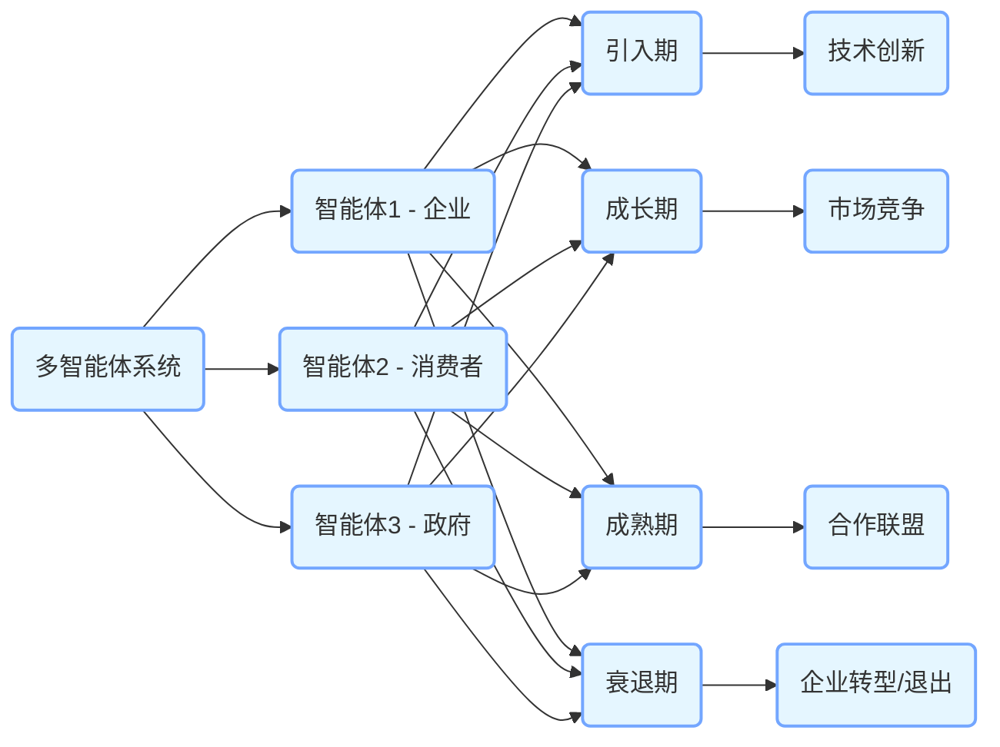

# 利用多智能体系统构建动态行业生命周期模型

> 关键词：多智能体系统、动态行业生命周期模型、智能体交互、行业演化、系统建模

> 摘要：本文聚焦于利用多智能体系统构建动态行业生命周期模型。首先介绍了相关背景知识，包括研究目的、预期读者等内容。接着阐述了多智能体系统与行业生命周期模型的核心概念及联系，通过文本示意图和 Mermaid 流程图进行清晰展示。详细讲解了核心算法原理，使用 Python 代码进行阐述，同时给出数学模型和公式并举例说明。通过项目实战，展示了开发环境搭建、源代码实现与解读。分析了该模型的实际应用场景，推荐了相关学习资源、开发工具框架及论文著作。最后总结了未来发展趋势与挑战，提供常见问题解答及扩展阅读参考资料，旨在为利用多智能体系统构建动态行业生命周期模型提供全面深入的技术指导。

## 1. 背景介绍 
### 1.1 目的和范围
在当今复杂多变的商业环境中，准确理解和预测行业的发展趋势对于企业决策、政策制定以及学术研究都具有至关重要的意义。传统的行业生命周期模型往往基于静态假设，难以反映行业中各个主体之间复杂的交互作用以及外部环境的动态变化。本研究的目的在于利用多智能体系统（Multi - Agent System, MAS）的优势，构建一个能够动态模拟行业发展过程的生命周期模型。

本研究的范围涵盖了从多智能体系统的基本原理到行业生命周期模型的构建过程，包括核心概念的阐述、算法原理的讲解、数学模型的推导、项目实战的演示以及实际应用场景的分析等方面。通过本研究，旨在为相关领域的研究者和实践者提供一个全面、深入且具有可操作性的动态行业生命周期模型构建方法。

### 1.2 预期读者
本文的预期读者包括但不限于以下几类人群：
- **学术研究者**：对复杂系统建模、多智能体系统、产业经济学等领域感兴趣的学者和研究人员，可通过本文了解多智能体系统在行业生命周期建模中的应用，为进一步的学术研究提供思路和方法。
- **企业管理者**：希望深入了解行业发展趋势，以便制定更具前瞻性和适应性的企业战略的管理者。通过本文构建的动态模型，管理者可以更好地把握行业发展的脉搏，做出更明智的决策。
- **政策制定者**：负责制定产业政策的政府部门工作人员。动态行业生命周期模型可以帮助政策制定者更准确地评估政策对行业发展的影响，从而制定出更科学、合理的产业政策。
- **计算机科学与技术从业者**：对多智能体系统编程、系统建模等技术感兴趣的程序员和软件工程师。本文提供的 Python 代码实现和详细的技术讲解，可为他们在相关领域的开发工作提供参考和借鉴。

### 1.3 文档结构概述
本文的文档结构如下：
- **核心概念与联系**：介绍多智能体系统和行业生命周期模型的核心概念，通过文本示意图和 Mermaid 流程图展示它们之间的联系。
- **核心算法原理 & 具体操作步骤**：详细讲解构建动态行业生命周期模型所使用的核心算法原理，并使用 Python 代码进行具体实现和说明。
- **数学模型和公式 & 详细讲解 & 举例说明**：推导动态行业生命周期模型的数学模型和公式，对其进行详细讲解，并通过具体例子说明其应用。
- **项目实战：代码实际案例和详细解释说明**：通过一个实际的项目案例，展示如何搭建开发环境、实现源代码以及对代码进行解读和分析。
- **实际应用场景**：分析动态行业生命周期模型在不同领域的实际应用场景。
- **工具和资源推荐**：推荐相关的学习资源、开发工具框架以及论文著作。
- **总结：未来发展趋势与挑战**：总结利用多智能体系统构建动态行业生命周期模型的未来发展趋势，并分析可能面临的挑战。
- **附录：常见问题与解答**：提供一些常见问题的解答，帮助读者更好地理解和应用本文所介绍的内容。
- **扩展阅读 & 参考资料**：列出相关的扩展阅读材料和参考资料，方便读者进一步深入研究。

### 1.4 术语表
#### 1.4.1 核心术语定义
- **多智能体系统（Multi - Agent System, MAS）**：由多个智能体组成的系统，每个智能体具有一定的自主性、智能性和交互能力，它们通过相互协作和竞争来完成系统的整体目标。
- **智能体（Agent）**：在多智能体系统中具有自主决策和行动能力的实体，能够感知环境信息，并根据自身的目标和规则做出相应的决策和行动。
- **行业生命周期模型（Industry Life Cycle Model）**：描述行业从诞生、成长、成熟到衰退的整个发展过程的模型，通常包括引入期、成长期、成熟期和衰退期四个阶段。
- **动态模型（Dynamic Model）**：能够反映系统随时间变化的模型，考虑了系统内部各个要素之间的动态交互以及外部环境的变化。

#### 1.4.2 相关概念解释
- **自主性（Autonomy）**：智能体能够独立地感知环境、做出决策和执行行动，不受其他智能体或外部因素的直接控制。
- **智能性（Intelligence）**：智能体具有一定的认知能力和学习能力，能够根据环境信息和自身经验调整自己的行为。
- **交互性（Interactivity）**：智能体之间能够通过某种通信机制进行信息交换和协作，以实现共同的目标或解决复杂的问题。

#### 1.4.3 缩略词列表
- **MAS**：Multi - Agent System（多智能体系统）
- **AI**：Artificial Intelligence（人工智能）
- **GDP**：Gross Domestic Product（国内生产总值）

## 2. 核心概念与联系 

### 多智能体系统原理
多智能体系统是一种分布式人工智能系统，它由多个智能体组成。每个智能体都有自己的目标、知识和能力，并且能够在一定的环境中自主地感知、决策和行动。智能体之间通过通信和交互来协调彼此的行为，以实现系统的整体目标。

多智能体系统的基本架构包括智能体层、通信层和环境层。智能体层包含多个智能体，每个智能体都有自己的内部状态和行为规则。通信层负责智能体之间的信息传递和交互，它提供了一种通信机制，使得智能体能够发送和接收消息。环境层是智能体所处的外部环境，它提供了智能体感知和行动的场所。

### 行业生命周期模型原理
行业生命周期模型描述了一个行业从诞生到衰退的整个发展过程。一般来说，行业生命周期可以分为四个阶段：引入期、成长期、成熟期和衰退期。

- **引入期**：行业刚刚诞生，技术还不成熟，市场需求较小，企业数量较少，竞争不激烈。
- **成长期**：随着技术的不断进步和市场需求的逐渐扩大，行业进入快速发展阶段，企业数量迅速增加，竞争加剧。
- **成熟期**：行业发展到一定阶段后，市场需求趋于饱和，企业数量稳定，竞争格局相对固定，行业利润水平相对稳定。
- **衰退期**：由于技术创新、市场需求变化等原因，行业逐渐失去竞争力，市场需求下降，企业数量减少，行业逐渐走向衰退。

### 两者联系的文本示意图
多智能体系统与行业生命周期模型的联系可以通过以下文本示意图来描述：

在行业生命周期的不同阶段，多智能体系统中的智能体可以代表不同的市场主体，如企业、消费者、政府等。这些智能体之间的交互作用影响着行业的发展和演化。例如，在引入期，企业智能体通过技术创新和市场推广来开拓市场，消费者智能体对新产品的接受程度影响着市场需求的增长速度。在成长期，企业智能体之间的竞争加剧，它们通过不断提高产品质量、降低成本等方式来争夺市场份额。在成熟期，企业智能体之间的合作和联盟增多，以维持市场的稳定和利润水平。在衰退期，企业智能体可能会选择退出市场或进行转型，消费者智能体的需求也会发生变化。

### Mermaid 流程图


这个流程图展示了多智能体系统中的不同智能体（企业、消费者、政府）在行业生命周期的不同阶段（引入期、成长期、成熟期、衰退期）所发挥的作用，以及这些阶段所对应的主要特征（技术创新、市场竞争、合作联盟、企业转型/退出）。

## 3. 核心算法原理 & 具体操作步骤 

### 核心算法原理
构建动态行业生命周期模型的核心算法基于多智能体系统的思想，通过模拟智能体之间的交互作用来实现行业的动态演化。主要包括以下几个方面：

- **智能体建模**：对不同类型的智能体（如企业、消费者、政府）进行建模，定义它们的属性、行为规则和决策机制。
- **环境建模**：对行业所处的外部环境进行建模，包括市场需求、技术水平、政策法规等因素。
- **交互机制**：定义智能体之间的交互机制，如通信协议、合作规则、竞争规则等。
- **演化规则**：制定行业的演化规则，根据智能体的行为和交互结果来更新行业的状态。

### 具体操作步骤
#### 步骤 1：定义智能体类
首先，我们需要定义不同类型的智能体类，包括企业智能体、消费者智能体和政府智能体。以下是一个简单的 Python 代码示例：

```python
class Agent:
    def __init__(self, id):
        self.id = id

class EnterpriseAgent(Agent):
    def __init__(self, id, technology_level, capital):
        super().__init__(id)
        self.technology_level = technology_level
        self.capital = capital

    def make_decision(self, market_demand, competitors):
        # 企业决策逻辑
        if market_demand > 0:
            if self.capital > 100:
                self.technology_level += 1
                self.capital -= 50
            else:
                self.capital += 20
        else:
            self.capital -= 10

class ConsumerAgent(Agent):
    def __init__(self, id, preference):
        super().__init__(id)
        self.preference = preference

    def make_purchase(self, products):
        # 消费者购买决策逻辑
        for product in products:
            if product.technology_level >= self.preference:
                return product
        return None

class GovernmentAgent(Agent):
    def __init__(self, id, policy):
        super().__init__(id)
        self.policy = policy

    def implement_policy(self, enterprises):
        # 政府政策实施逻辑
        if self.policy == 'subsidy':
            for enterprise in enterprises:
                enterprise.capital += 30
```

#### 步骤 2：定义环境类
接下来，我们需要定义环境类，用于模拟行业的外部环境。以下是一个简单的 Python 代码示例：

```python
class Environment:
    def __init__(self, market_demand, technology_level):
        self.market_demand = market_demand
        self.technology_level = technology_level

    def update_environment(self):
        # 环境更新逻辑
        self.market_demand += 10
        self.technology_level += 1
```

#### 步骤 3：定义多智能体系统类
然后，我们需要定义多智能体系统类，用于管理智能体和环境，并实现智能体之间的交互和行业的演化。以下是一个简单的 Python 代码示例：

```python
class MultiAgentSystem:
    def __init__(self):
        self.enterprises = []
        self.consumers = []
        self.government = None
        self.environment = Environment(100, 1)

    def add_enterprise(self, enterprise):
        self.enterprises.append(enterprise)

    def add_consumer(self, consumer):
        self.consumers.append(consumer)

    def set_government(self, government):
        self.government = government

    def run(self, steps):
        for step in range(steps):
            # 政府实施政策
            if self.government:
                self.government.implement_policy(self.enterprises)

            # 企业决策
            for enterprise in self.enterprises:
                enterprise.make_decision(self.environment.market_demand, self.enterprises)

            # 消费者购买决策
            for consumer in self.consumers:
                product = consumer.make_purchase(self.enterprises)
                if product:
                    product.capital += 50

            # 更新环境
            self.environment.update_environment()
```

#### 步骤 4：运行模拟
最后，我们可以创建智能体和多智能体系统对象，并运行模拟。以下是一个简单的 Python 代码示例：

```python
# 创建智能体
enterprise1 = EnterpriseAgent(1, 1, 200)
enterprise2 = EnterpriseAgent(2, 2, 150)
consumer1 = ConsumerAgent(1, 2)
government = GovernmentAgent(1, 'subsidy')

# 创建多智能体系统
mas = MultiAgentSystem()
mas.add_enterprise(enterprise1)
mas.add_enterprise(enterprise2)
mas.add_consumer(consumer1)
mas.set_government(government)

# 运行模拟
mas.run(10)

# 输出结果
print(f"Enterprise 1 capital: {enterprise1.capital}")
print(f"Enterprise 2 capital: {enterprise2.capital}")
```

这个代码示例展示了如何使用多智能体系统来模拟行业的动态演化过程。通过定义不同类型的智能体、环境和多智能体系统类，并实现智能体之间的交互和环境的更新，我们可以模拟行业在不同阶段的发展情况。

## 4. 数学模型和公式 & 详细讲解 & 举例说明 

### 数学模型和公式
#### 企业智能体的资本变化模型
企业智能体的资本变化可以用以下公式表示：

$$C_{t + 1} = C_t + R_t - E_t$$

其中，$C_t$ 表示企业在时间 $t$ 的资本，$R_t$ 表示企业在时间 $t$ 的收入，$E_t$ 表示企业在时间 $t$ 的支出。

企业的收入 $R_t$ 可以根据市场需求和企业的市场份额来计算：

$$R_t = D_t \times S_t \times P_t$$

其中，$D_t$ 表示市场在时间 $t$ 的需求，$S_t$ 表示企业在时间 $t$ 的市场份额，$P_t$ 表示企业产品在时间 $t$ 的价格。

企业的支出 $E_t$ 包括生产成本、研发成本等：

$$E_t = C_{p,t} + C_{r,t}$$

其中，$C_{p,t}$ 表示企业在时间 $t$ 的生产成本，$C_{r,t}$ 表示企业在时间 $t$ 的研发成本。

#### 消费者智能体的购买决策模型
消费者智能体的购买决策可以用效用函数来表示。假设消费者对产品的效用 $U$ 与产品的技术水平 $T$ 和价格 $P$ 有关，可以用以下公式表示：

$$U = aT - bP$$

其中，$a$ 和 $b$ 是正的常数，表示消费者对技术水平和价格的偏好程度。消费者会选择效用最大的产品进行购买。

#### 行业生命周期阶段的划分模型
行业生命周期阶段的划分可以根据行业的增长率 $g$ 来确定。行业增长率 $g$ 可以用以下公式表示：

$$g = \frac{D_{t + 1}-D_t}{D_t}$$

根据行业增长率的不同，可以将行业生命周期划分为以下几个阶段：
- **引入期**：$g < 0.1$
- **成长期**：$0.1 \leq g < 0.3$
- **成熟期**：$0.3 \leq g < 0.05$
- **衰退期**：$g < 0$

### 详细讲解
#### 企业智能体的资本变化模型
企业的资本变化模型反映了企业的财务状况在时间上的演变。企业的收入取决于市场需求、市场份额和产品价格。市场需求的增加会导致企业的收入增加，而市场份额的提高也会使企业获得更多的收入。企业的支出包括生产成本和研发成本，生产成本主要用于生产产品，研发成本用于提高企业的技术水平。

#### 消费者智能体的购买决策模型
消费者的购买决策模型基于效用最大化原则。消费者会根据产品的技术水平和价格来计算产品的效用，并选择效用最大的产品进行购买。这反映了消费者在购买产品时会综合考虑产品的质量和价格因素。

#### 行业生命周期阶段的划分模型
行业生命周期阶段的划分模型根据行业的增长率来确定行业所处的阶段。在引入期，行业增长率较低，说明行业刚刚起步，市场需求较小。在成长期，行业增长率较高，说明行业发展迅速，市场需求不断增加。在成熟期，行业增长率逐渐下降，说明行业发展趋于稳定，市场需求接近饱和。在衰退期，行业增长率为负，说明行业逐渐走向衰退，市场需求下降。

### 举例说明
假设一个行业在时间 $t$ 的市场需求 $D_t = 100$，企业 A 的市场份额 $S_t = 0.2$，产品价格 $P_t = 10$，生产成本 $C_{p,t} = 50$，研发成本 $C_{r,t} = 20$。则企业 A 在时间 $t$ 的收入为：

$$R_t = D_t \times S_t \times P_t = 100 \times 0.2 \times 10 = 200$$

企业 A 在时间 $t$ 的支出为：

$$E_t = C_{p,t} + C_{r,t} = 50 + 20 = 70$$

假设企业 A 在时间 $t$ 的资本 $C_t = 300$，则企业 A 在时间 $t + 1$ 的资本为：

$$C_{t + 1} = C_t + R_t - E_t = 300 + 200 - 70 = 430$$

假设消费者对产品的效用函数为 $U = 2T - 0.5P$，有两个产品，产品 1 的技术水平 $T_1 = 3$，价格 $P_1 = 10$，产品 2 的技术水平 $T_2 = 4$，价格 $P_2 = 12$。则产品 1 的效用为：

$$U_1 = 2 \times 3 - 0.5 \times 10 = 1$$

产品 2 的效用为：

$$U_2 = 2 \times 4 - 0.5 \times 12 = 2$$

由于 $U_2 > U_1$，消费者会选择产品 2 进行购买。

假设该行业在时间 $t$ 的市场需求 $D_t = 100$，在时间 $t + 1$ 的市场需求 $D_{t + 1} = 120$，则行业的增长率为：

$$g = \frac{D_{t + 1}-D_t}{D_t} = \frac{120 - 100}{100} = 0.2$$

由于 $0.1 \leq g < 0.3$，该行业处于成长期。

## 5. 项目实战：代码实际案例和详细解释说明 

### 5.1  开发环境搭建
#### 编程语言选择
本项目选择 Python 作为开发语言，因为 Python 具有简洁易读的语法，丰富的库和工具，非常适合快速开发和实现多智能体系统。

#### 开发工具选择
可以使用 PyCharm 作为集成开发环境（IDE），它提供了代码编辑、调试、代码分析等功能，能够提高开发效率。

#### 库的安装
本项目需要安装一些必要的 Python 库，如 `numpy`、`matplotlib` 等。可以使用以下命令进行安装：

```sh
pip install numpy matplotlib
```

### 5.2  源代码详细实现和代码解读
以下是一个完整的项目实战代码示例，用于模拟利用多智能体系统构建动态行业生命周期模型：

```python
import numpy as np
import matplotlib.pyplot as plt

# 定义智能体类
class Agent:
    def __init__(self, id):
        self.id = id

class EnterpriseAgent(Agent):
    def __init__(self, id, technology_level, capital):
        super().__init__(id)
        self.technology_level = technology_level
        self.capital = capital
        self.market_share = 0

    def make_decision(self, market_demand, competitors):
        # 计算市场份额
        total_technology_level = sum([enterprise.technology_level for enterprise in competitors])
        if total_technology_level > 0:
            self.market_share = self.technology_level / total_technology_level
        else:
            self.market_share = 0

        # 计算收入
        price = 10
        revenue = market_demand * self.market_share * price

        # 计算支出
        production_cost = 50
        research_cost = 20 if self.capital > 100 else 0
        expenditure = production_cost + research_cost

        # 更新资本
        self.capital += revenue - expenditure

        # 更新技术水平
        if self.capital > 100:
            self.technology_level += 1

class ConsumerAgent(Agent):
    def __init__(self, id, preference):
        super().__init__(id)
        self.preference = preference

    def make_purchase(self, enterprises):
        products = []
        for enterprise in enterprises:
            products.append((enterprise, enterprise.technology_level))
        products.sort(key=lambda x: x[1], reverse=True)
        for product in products:
            if product[1] >= self.preference:
                return product[0]
        return None

class GovernmentAgent(Agent):
    def __init__(self, id, policy):
        super().__init__(id)
        self.policy = policy

    def implement_policy(self, enterprises):
        if self.policy == 'subsidy':
            for enterprise in enterprises:
                enterprise.capital += 30

# 定义环境类
class Environment:
    def __init__(self, market_demand, technology_level):
        self.market_demand = market_demand
        self.technology_level = technology_level

    def update_environment(self):
        # 市场需求增长
        growth_rate = np.random.uniform(0.05, 0.2)
        self.market_demand *= (1 + growth_rate)

        # 技术水平提升
        self.technology_level += 1

# 定义多智能体系统类
class MultiAgentSystem:
    def __init__(self):
        self.enterprises = []
        self.consumers = []
        self.government = None
        self.environment = Environment(100, 1)
        self.time_steps = []
        self.enterprise_capitals = []

    def add_enterprise(self, enterprise):
        self.enterprises.append(enterprise)

    def add_consumer(self, consumer):
        self.consumers.append(consumer)

    def set_government(self, government):
        self.government = government

    def run(self, steps):
        for step in range(steps):
            # 记录时间步
            self.time_steps.append(step)

            # 政府实施政策
            if self.government:
                self.government.implement_policy(self.enterprises)

            # 企业决策
            for enterprise in self.enterprises:
                enterprise.make_decision(self.environment.market_demand, self.enterprises)

            # 消费者购买决策
            for consumer in self.consumers:
                product = consumer.make_purchase(self.enterprises)
                if product:
                    product.capital += 50

            # 记录企业资本
            self.enterprise_capitals.append([enterprise.capital for enterprise in self.enterprises])

            # 更新环境
            self.environment.update_environment()

    def plot_enterprise_capitals(self):
        plt.figure(figsize=(10, 6))
        for i in range(len(self.enterprises)):
            plt.plot(self.time_steps, [capital[i] for capital in self.enterprise_capitals], label=f'Enterprise {i + 1}')
        plt.xlabel('Time Steps')
        plt.ylabel('Capital')
        plt.title('Enterprise Capitals over Time')
        plt.legend()
        plt.grid(True)
        plt.show()

# 主程序
if __name__ == '__main__':
    # 创建智能体
    enterprise1 = EnterpriseAgent(1, 1, 200)
    enterprise2 = EnterpriseAgent(2, 2, 150)
    consumer1 = ConsumerAgent(1, 2)
    government = GovernmentAgent(1, 'subsidy')

    # 创建多智能体系统
    mas = MultiAgentSystem()
    mas.add_enterprise(enterprise1)
    mas.add_enterprise(enterprise2)
    mas.add_consumer(consumer1)
    mas.set_government(government)

    # 运行模拟
    mas.run(20)

    # 绘制企业资本变化曲线
    mas.plot_enterprise_capitals()
```

### 5.3  代码解读与分析
#### 智能体类
- **EnterpriseAgent**：企业智能体类，包含企业的技术水平、资本和市场份额等属性。`make_decision` 方法用于企业的决策，包括计算市场份额、收入、支出，更新资本和技术水平。
- **ConsumerAgent**：消费者智能体类，包含消费者的偏好属性。`make_purchase` 方法用于消费者的购买决策，选择技术水平满足偏好的产品。
- **GovernmentAgent**：政府智能体类，包含政府的政策属性。`implement_policy` 方法用于政府实施政策，如补贴企业。

#### 环境类
- **Environment**：环境类，包含市场需求和技术水平等属性。`update_environment` 方法用于更新环境，包括市场需求的增长和技术水平的提升。

#### 多智能体系统类
- **MultiAgentSystem**：多智能体系统类，用于管理智能体和环境。`run` 方法用于运行模拟，包括政府实施政策、企业决策、消费者购买决策和环境更新等步骤。`plot_enterprise_capitals` 方法用于绘制企业资本随时间的变化曲线。

#### 主程序
在主程序中，我们创建了企业智能体、消费者智能体和政府智能体，创建了多智能体系统对象，运行模拟并绘制企业资本变化曲线。通过这个项目实战，我们可以直观地观察到多智能体系统中智能体之间的交互作用以及行业的动态演化过程。

## 6. 实际应用场景 
### 企业战略规划
企业可以利用动态行业生命周期模型来制定战略规划。在行业的引入期，企业可以通过技术创新和市场推广来开拓市场，争取在市场中占据领先地位。在成长期，企业可以加大投资，扩大生产规模，提高市场份额。在成熟期，企业可以通过产品差异化和成本控制来维持市场竞争力。在衰退期，企业可以选择转型或退出市场，以避免损失。

例如，苹果公司在智能手机行业的发展过程中，通过不断的技术创新和产品升级，在行业的成长期和成熟期保持了领先地位。当智能手机行业逐渐进入成熟期后，苹果公司开始拓展其他业务领域，如可穿戴设备和服务业务，以实现企业的持续发展。

### 政府产业政策制定
政府可以利用动态行业生命周期模型来制定产业政策。在行业的引入期，政府可以通过财政补贴、税收优惠等政策来鼓励企业进行技术创新和创业。在成长期，政府可以加强基础设施建设，提高行业的整体竞争力。在成熟期，政府可以通过反垄断政策来维护市场竞争秩序。在衰退期，政府可以引导企业进行转型和升级，促进产业结构调整。

例如，中国政府在新能源汽车行业的发展过程中，出台了一系列的产业政策，包括购车补贴、税收减免、充电桩建设等，促进了新能源汽车行业的快速发展。

### 投资者决策
投资者可以利用动态行业生命周期模型来评估投资风险和收益。在行业的引入期，投资风险较高，但潜在收益也较大。在成长期，投资风险相对较低，收益增长较快。在成熟期，投资风险和收益相对稳定。在衰退期，投资风险较高，收益可能下降。

例如，风险投资机构在投资新兴行业时，通常会在行业的引入期或成长期进行投资，以获取较高的收益。而传统的投资者可能更倾向于在行业的成熟期进行投资，以获取稳定的收益。

### 学术研究
动态行业生命周期模型可以为学术研究提供一个新的视角和方法。研究者可以通过模拟不同的市场环境和智能体行为，研究行业的演化规律和影响因素。例如，研究技术创新、市场竞争、政策法规等因素对行业生命周期的影响。

## 7. 工具和资源推荐
### 7.1 学习资源推荐
#### 7.1.1 书籍推荐
- 《多智能体系统》：全面介绍了多智能体系统的基本概念、理论和方法，是学习多智能体系统的经典教材。
- 《复杂系统建模与仿真》：讲解了复杂系统建模和仿真的基本原理和方法，对于理解动态行业生命周期模型的构建有很大帮助。
- 《产业经济学》：介绍了产业经济学的基本理论和方法，包括行业生命周期理论等内容，为研究行业发展提供了理论基础。

#### 7.1.2 在线课程
- Coursera 上的“Multi - Agent Systems”课程：由知名高校的教授授课，系统地介绍了多智能体系统的相关知识。
- edX 上的“Complex Systems Modeling and Simulation”课程：提供了复杂系统建模和仿真的实践教学，帮助学习者掌握相关技能。
- 中国大学 MOOC 上的“产业经济学”课程：结合中国的产业发展实际，讲解产业经济学的基本理论和应用。

#### 7.1.3 技术博客和网站
- AI 社区：提供了多智能体系统、人工智能等领域的最新技术文章和案例分析。
- 复杂系统研究网：专注于复杂系统的研究和讨论，分享复杂系统建模和仿真的最新成果。
- 产业经济研究网：关注产业经济领域的研究动态和政策解读，为研究行业发展提供参考。

### 7.2 开发工具框架推荐
#### 7.2.1 IDE和编辑器
- PyCharm：功能强大的 Python 集成开发环境，提供了代码编辑、调试、代码分析等功能，适合开发多智能体系统相关的 Python 代码。
- Visual Studio Code：轻量级的代码编辑器，支持多种编程语言和插件扩展，可用于快速开发和调试多智能体系统代码。

#### 7.2.2 调试和性能分析工具
- PySnooper：简单易用的 Python 调试工具，可以自动记录函数的执行过程和变量的值，方便调试代码。
- cProfile：Python 内置的性能分析工具，可以分析代码的性能瓶颈，帮助优化代码。

#### 7.2.3 相关框架和库
- Mesa：用于构建基于代理的仿真模型的 Python 框架，提供了丰富的智能体建模和交互功能，可用于构建动态行业生命周期模型。
- NetworkX：用于创建、操作和研究复杂网络的 Python 库，可以用于模拟智能体之间的交互网络。

### 7.3 相关论文著作推荐
#### 7.3.1 经典论文
- “Multi - Agent Systems: A Modern Approach to Distributed Artificial Intelligence”：该论文系统地介绍了多智能体系统的基本概念、理论和方法，是多智能体系统领域的经典之作。
- “The Theory of Industrial Organization”：阐述了产业组织理论的基本原理和方法，对于理解行业竞争和市场结构有重要意义。

#### 7.3.2 最新研究成果
- 近年来在《Artificial Intelligence》《Management Science》等学术期刊上发表的关于多智能体系统在行业建模和预测方面的研究论文，反映了该领域的最新研究动态和成果。

#### 7.3.3 应用案例分析
- 一些关于多智能体系统在金融、医疗、交通等领域应用的案例分析报告，通过实际案例展示了多智能体系统的应用效果和价值。

## 8. 总结：未来发展趋势与挑战
### 未来发展趋势
#### 与大数据和人工智能的深度融合
随着大数据和人工智能技术的不断发展，动态行业生命周期模型将与这些技术深度融合。通过收集和分析大量的行业数据，利用人工智能算法对行业发展趋势进行更准确的预测和分析。例如，利用机器学习算法对行业数据进行挖掘，发现潜在的市场需求和竞争趋势，为企业决策和政府政策制定提供更有力的支持。

#### 跨学科研究的加强
动态行业生命周期模型的研究涉及到计算机科学、经济学、管理学等多个学科领域。未来，跨学科研究将进一步加强，不同学科的专家将共同合作，从不同的角度对行业发展进行研究和分析。例如，计算机科学家可以提供先进的建模和仿真技术，经济学家可以提供行业经济理论和数据分析方法，管理学家可以提供企业战略和决策理论，通过跨学科的研究可以更全面、深入地理解行业发展的规律和机制。

#### 应用领域的拓展
动态行业生命周期模型的应用领域将不断拓展。除了企业战略规划、政府产业政策制定和投资者决策等传统领域外，还将应用于环境保护、社会治理、医疗卫生等领域。例如，在环境保护领域，可以利用动态行业生命周期模型来研究能源行业的发展对环境的影响，制定可持续发展的能源政策。在社会治理领域，可以利用该模型来研究城市发展过程中不同行业的相互作用，优化城市规划和资源配置。

### 挑战
#### 数据质量和可用性
构建动态行业生命周期模型需要大量的行业数据，包括市场需求、企业财务状况、技术创新等方面的数据。然而，目前很多行业的数据存在质量不高、不完整、不及时等问题，这给模型的构建和应用带来了很大的困难。此外，一些敏感数据的获取也受到法律法规和隐私保护的限制，进一步影响了数据的可用性。

#### 模型的复杂性和可解释性
动态行业生命周期模型通常是一个复杂的系统，包含多个智能体和复杂的交互关系。随着模型的不断发展和完善，模型的复杂性也在不断增加。这不仅增加了模型的开发和维护难度，也影响了模型的可解释性。在实际应用中，决策者需要理解模型的运行机制和结果，以便做出合理的决策。因此，如何在保证模型准确性的前提下，提高模型的可解释性是一个亟待解决的问题。

#### 智能体行为的不确定性
在多智能体系统中，智能体的行为具有一定的不确定性。智能体的决策受到多种因素的影响，如环境信息、自身目标、其他智能体的行为等。这些因素的不确定性导致智能体的行为难以准确预测，从而增加了模型的不确定性。如何处理智能体行为的不确定性，提高模型的可靠性和稳定性，是动态行业生命周期模型研究面临的一个重要挑战。

## 9. 附录：常见问题与解答
### 问题 1：多智能体系统中的智能体是如何进行通信和交互的？
智能体之间的通信和交互可以通过多种方式实现，如消息传递、共享内存、网络通信等。在 Python 实现中，可以通过定义智能体类的方法来实现智能体之间的交互。例如，在消费者智能体的 `make_purchase` 方法中，消费者智能体可以获取企业智能体的产品信息，从而做出购买决策。

### 问题 2：如何确定行业生命周期的阶段？
可以根据行业的增长率、市场需求、企业数量等指标来确定行业生命周期的阶段。在本文的数学模型中，根据行业增长率的不同将行业生命周期划分为引入期、成长期、成熟期和衰退期。实际应用中，可以结合多个指标进行综合判断。

### 问题 3：动态行业生命周期模型的准确性如何保证？
模型的准确性受到多种因素的影响，如数据质量、模型结构、参数设置等。为了保证模型的准确性，需要收集高质量的行业数据，选择合适的模型结构和算法，进行合理的参数设置和模型验证。此外，还可以通过与实际数据进行对比和分析，不断优化模型。

### 问题 4：如何扩展动态行业生命周期模型？
可以从以下几个方面扩展动态行业生命周期模型：增加智能体的类型和数量，考虑更多的环境因素和交互关系，引入更复杂的决策机制和行为规则，采用更先进的建模和仿真技术等。例如，可以增加供应商智能体、竞争对手智能体等，考虑技术创新的不确定性、政策变化的影响等因素。

## 10. 扩展阅读 & 参考资料
### 扩展阅读
- 《人工智能：一种现代方法》：全面介绍了人工智能的基本概念、理论和方法，对于理解多智能体系统的智能性和决策机制有很大帮助。
- 《创新者的窘境》：探讨了企业在面对技术创新和市场变化时的困境和应对策略，与动态行业生命周期模型的研究有一定的关联。
- 《复杂经济学：经济思想的新框架》：介绍了复杂经济学的基本理论和方法，为研究行业的复杂性和动态性提供了新的视角。

### 参考资料
- 相关学术期刊文章，如《Artificial Intelligence》《Management Science》《Journal of Economic Dynamics and Control》等。
- 相关会议论文，如国际多智能体系统会议（International Conference on Autonomous Agents and Multi - Agent Systems）等。
- 相关的政府报告和统计数据，如国家统计局发布的行业统计数据、政府部门发布的产业政策报告等。