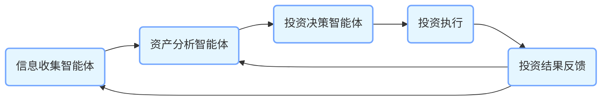

# 利用多智能体系统进行全球资产配置：价值投资的国际化

> 关键词：多智能体系统、全球资产配置、价值投资、国际化、金融科技

> 摘要：本文聚焦于利用多智能体系统进行全球资产配置这一前沿领域，深入探讨其在价值投资国际化进程中的应用。首先介绍多智能体系统和全球资产配置的背景知识，阐述核心概念与联系。接着详细讲解多智能体系统用于全球资产配置的核心算法原理，结合 Python 代码进行说明，并给出相关数学模型和公式。通过项目实战展示具体的代码实现和解读，分析其在实际应用场景中的作用。同时推荐学习资源、开发工具框架以及相关论文著作，最后总结未来发展趋势与挑战，为投资者和研究者提供全面的参考。

## 1. 背景介绍 
### 1.1 目的和范围
在经济全球化的背景下，全球资产配置已成为投资者分散风险、获取更高收益的重要手段。传统的资产配置方法往往依赖于人工经验和简单的数学模型，难以应对复杂多变的全球金融市场。多智能体系统作为一种新兴的人工智能技术，能够模拟多个智能体之间的交互和协作，为全球资产配置提供了一种更加智能、灵活的解决方案。本文的目的在于深入研究多智能体系统在全球资产配置中的应用，探讨其在价值投资国际化方面的潜力和优势。范围涵盖多智能体系统的原理、核心算法、数学模型，以及如何将其应用于实际的全球资产配置项目中。

### 1.2 预期读者
本文预期读者包括金融投资者、金融分析师、人工智能研究者、金融科技从业者以及对全球资产配置和人工智能技术感兴趣的相关人员。对于投资者来说，本文可以提供一种新的资产配置思路和方法；对于研究者和从业者，本文可以作为深入研究和实践的参考资料。

### 1.3 文档结构概述
本文共分为十个部分。第一部分为背景介绍，包括目的和范围、预期读者、文档结构概述以及术语表。第二部分介绍多智能体系统和全球资产配置的核心概念与联系，并给出相应的示意图和流程图。第三部分详细讲解多智能体系统用于全球资产配置的核心算法原理，并使用 Python 代码进行阐述。第四部分给出相关的数学模型和公式，并进行详细讲解和举例说明。第五部分通过项目实战展示具体的代码实现和解读。第六部分分析多智能体系统在全球资产配置中的实际应用场景。第七部分推荐学习资源、开发工具框架以及相关论文著作。第八部分总结未来发展趋势与挑战。第九部分为附录，解答常见问题。第十部分提供扩展阅读和参考资料。

### 1.4 术语表
#### 1.4.1 核心术语定义
- **多智能体系统（Multi - Agent System，MAS）**：由多个智能体组成的系统，每个智能体具有一定的自主决策能力，能够感知环境并与其他智能体进行交互和协作，以实现共同的目标。
- **全球资产配置**：投资者将资金分散投资于不同国家和地区的各类资产，如股票、债券、基金、房地产等，以降低风险、提高收益的投资策略。
- **价值投资**：一种基于对资产内在价值的评估，以低于内在价值的价格买入资产，并长期持有的投资策略。
- **智能体**：具有感知、决策和行动能力的实体，能够在特定环境中自主地执行任务。

#### 1.4.2 相关概念解释
- **人工智能**：研究如何使计算机模拟人类智能的学科，包括机器学习、自然语言处理、计算机视觉等多个领域。
- **金融科技**：将金融和科技相结合的领域，利用先进的技术手段提升金融服务的效率和质量。
- **资产组合理论**：研究如何通过合理配置资产来降低风险、提高收益的理论，主要包括均值 - 方差模型等。

#### 1.4.3 缩略词列表
- **MAS**：Multi - Agent System（多智能体系统）
- **AI**：Artificial Intelligence（人工智能）
- **FinTech**：Financial Technology（金融科技）

## 2. 核心概念与联系 

### 2.1 多智能体系统原理
多智能体系统由多个智能体组成，每个智能体具有以下特点：
- **自主性**：智能体能够独立地感知环境，并根据自身的目标和知识进行决策和行动。
- **交互性**：智能体之间可以通过通信机制进行信息交换和协作，共同完成任务。
- **适应性**：智能体能够根据环境的变化调整自己的行为和策略。

多智能体系统的架构通常包括智能体层、通信层和协调层。智能体层包含多个智能体，负责感知环境和执行任务；通信层负责智能体之间的信息传递；协调层负责协调智能体之间的行为，以实现系统的整体目标。

### 2.2 全球资产配置原理
全球资产配置的核心思想是通过分散投资来降低风险、提高收益。投资者可以将资金分散投资于不同国家和地区的各类资产，因为不同资产之间的相关性较低，当某一资产表现不佳时，其他资产可能表现较好，从而降低整个投资组合的风险。

全球资产配置的步骤通常包括：
1. **确定投资目标**：明确投资者的风险承受能力、收益目标等。
2. **资产分类**：将全球资产分为股票、债券、基金、房地产等不同类别。
3. **资产选择**：根据投资目标和资产分类，选择合适的资产进行投资。
4. **资产配置比例确定**：确定不同资产在投资组合中的比例。
5. **投资组合监控和调整**：定期监控投资组合的表现，并根据市场变化进行调整。

### 2.3 多智能体系统与全球资产配置的联系
多智能体系统可以为全球资产配置提供更加智能、灵活的解决方案。在全球资产配置中，可以将不同的智能体看作是不同的投资者或投资策略，每个智能体可以根据自己的目标和知识进行资产选择和配置。智能体之间可以通过交互和协作，共享信息和经验，优化投资组合。例如，一个智能体可以负责收集全球金融市场的信息，另一个智能体可以根据这些信息进行资产分析和评估，还有一个智能体可以负责执行投资决策。通过多智能体系统的协作，可以提高全球资产配置的效率和准确性。

### 2.4 文本示意图
多智能体系统与全球资产配置的关系可以用以下示意图表示：

多智能体系统由多个智能体组成，包括信息收集智能体、资产分析智能体、投资决策智能体等。这些智能体通过通信机制进行信息交换和协作。信息收集智能体负责收集全球金融市场的信息，如股票价格、债券收益率、宏观经济数据等；资产分析智能体根据这些信息对不同资产进行分析和评估，计算资产的内在价值、风险等指标；投资决策智能体根据资产分析的结果，结合投资者的目标和风险承受能力，制定投资策略和资产配置方案。同时，投资决策智能体还可以将投资结果反馈给信息收集智能体和资产分析智能体，以便它们进行调整和优化。

### 2.5 Mermaid 流程图


## 3. 核心算法原理 & 具体操作步骤 

### 3.1 核心算法原理
在利用多智能体系统进行全球资产配置中，常用的算法包括强化学习算法、遗传算法等。这里以强化学习算法为例进行讲解。

强化学习是一种通过智能体与环境进行交互，不断尝试不同的行为，并根据环境给予的奖励来学习最优行为策略的机器学习方法。在全球资产配置中，智能体可以看作是投资者，环境可以看作是全球金融市场，智能体的行为可以看作是资产配置决策，奖励可以看作是投资收益。

智能体通过不断地尝试不同的资产配置方案，观察投资收益的变化，并根据奖励信号调整自己的行为策略，最终找到最优的资产配置方案。

### 3.2 具体操作步骤
1. **定义环境**：定义全球金融市场的环境，包括资产种类、资产价格、宏观经济数据等。
2. **定义智能体**：定义智能体的状态、行为和奖励函数。智能体的状态可以包括当前的资产组合、市场行情等；智能体的行为可以包括买入、卖出、持有等资产配置决策；奖励函数可以根据投资收益来定义。
3. **初始化智能体**：初始化智能体的策略和参数。
4. **智能体与环境交互**：智能体根据当前状态选择一个行为，执行该行为并观察环境的反馈（奖励和下一个状态）。
5. **更新智能体策略**：根据环境的反馈，更新智能体的策略和参数，以提高未来的奖励。
6. **重复步骤 4 和 5**：直到智能体找到最优的资产配置策略。

### 3.3 Python 源代码详细阐述
```python
import numpy as np

# 定义环境
class GlobalAssetEnvironment:
    def __init__(self, num_assets, initial_prices, num_steps):
        self.num_assets = num_assets
        self.initial_prices = initial_prices
        self.num_steps = num_steps
        self.current_step = 0
        self.current_prices = initial_prices.copy()

    def reset(self):
        self.current_step = 0
        self.current_prices = self.initial_prices.copy()
        return self.current_prices

    def step(self, action):
        # 模拟资产价格变化
        price_changes = np.random.normal(0, 0.01, self.num_assets)
        self.current_prices += price_changes

        # 计算奖励
        portfolio_value = np.dot(action, self.current_prices)
        reward = portfolio_value

        self.current_step += 1
        done = self.current_step == self.num_steps
        return self.current_prices, reward, done, {}

# 定义智能体
class AssetAllocationAgent:
    def __init__(self, num_assets):
        self.num_assets = num_assets
        self.weights = np.ones(num_assets) / num_assets

    def act(self, state):
        return self.weights

    def update(self, state, action, reward, next_state):
        # 简单的策略更新，根据奖励调整权重
        if reward > 0:
            self.weights += 0.01
        else:
            self.weights -= 0.01
        self.weights = np.clip(self.weights, 0, 1)
        self.weights /= np.sum(self.weights)

# 主程序
num_assets = 5
initial_prices = np.array([100, 120, 90, 110, 105])
num_steps = 100

env = GlobalAssetEnvironment(num_assets, initial_prices, num_steps)
agent = AssetAllocationAgent(num_assets)

state = env.reset()
total_reward = 0

for _ in range(num_steps):
    action = agent.act(state)
    next_state, reward, done, _ = env.step(action)
    agent.update(state, action, reward, next_state)
    state = next_state
    total_reward += reward

print("Total reward:", total_reward)
```
### 3.4 代码解释
- **GlobalAssetEnvironment 类**：定义了全球资产配置的环境，包括资产数量、初始价格和模拟的时间步数。`reset` 方法用于重置环境，`step` 方法用于执行智能体的行为，并返回下一个状态、奖励、是否结束等信息。
- **AssetAllocationAgent 类**：定义了资产配置智能体，包括资产数量和初始权重。`act` 方法用于根据当前状态选择行为，`update` 方法用于根据奖励更新智能体的策略。
- **主程序**：创建环境和智能体，进行模拟训练，记录总奖励并输出。

## 4. 数学模型和公式 & 详细讲解 & 举例说明 

### 4.1 强化学习数学模型
强化学习的数学模型可以用马尔可夫决策过程（Markov Decision Process，MDP）来描述。一个 MDP 由一个五元组 $(S, A, P, R, \gamma)$ 组成，其中：
- $S$ 是状态空间，表示智能体可能处于的所有状态。
- $A$ 是动作空间，表示智能体可以采取的所有动作。
- $P: S \times A \times S \to [0, 1]$ 是状态转移概率函数，表示在状态 $s$ 采取动作 $a$ 后转移到状态 $s'$ 的概率。
- $R: S \times A \to \mathbb{R}$ 是奖励函数，表示在状态 $s$ 采取动作 $a$ 后获得的奖励。
- $\gamma \in [0, 1]$ 是折扣因子，表示未来奖励的重要性。

智能体的目标是找到一个策略 $\pi: S \to A$，使得长期累积奖励的期望最大，即：
$$
V^{\pi}(s) = \mathbb{E}_{\pi}\left[\sum_{t = 0}^{\infty} \gamma^{t} R(S_t, A_t) | S_0 = s\right]
$$
其中，$V^{\pi}(s)$ 是策略 $\pi$ 下状态 $s$ 的价值函数。

### 4.2 价值函数更新公式
在强化学习中，常用的价值函数更新方法是 Q - learning 算法。Q - learning 算法的更新公式为：
$$
Q(s, a) \leftarrow Q(s, a) + \alpha\left[R(s, a) + \gamma \max_{a'} Q(s', a') - Q(s, a)\right]
$$
其中，$Q(s, a)$ 是状态 $s$ 下采取动作 $a$ 的动作价值函数，$\alpha$ 是学习率。

### 4.3 举例说明
假设一个简单的全球资产配置问题，有两种资产 $A$ 和 $B$，状态空间 $S = \{s_1, s_2\}$，动作空间 $A = \{a_1, a_2\}$，其中 $a_1$ 表示买入资产 $A$，$a_2$ 表示买入资产 $B$。初始时，$Q(s_1, a_1) = 0$，$Q(s_1, a_2) = 0$，$\alpha = 0.1$，$\gamma = 0.9$。

在状态 $s_1$ 采取动作 $a_1$ 后，转移到状态 $s_2$，获得奖励 $R(s_1, a_1) = 10$。此时，$\max_{a'} Q(s_2, a') = 5$。根据 Q - learning 算法的更新公式，有：
$$
Q(s_1, a_1) \leftarrow 0 + 0.1\left[10 + 0.9 \times 5 - 0\right] = 1.45
$$

## 5. 项目实战：代码实际案例和详细解释说明 

### 5.1  开发环境搭建
- **Python 环境**：安装 Python 3.7 及以上版本。
- **依赖库**：安装 `numpy`、`pandas`、`matplotlib` 等常用库。可以使用以下命令进行安装：
```sh
pip install numpy pandas matplotlib
```

### 5.2  源代码详细实现和代码解读
```python
import numpy as np
import pandas as pd
import matplotlib.pyplot as plt

# 生成模拟的全球资产价格数据
def generate_asset_prices(num_assets, num_steps):
    prices = np.zeros((num_steps, num_assets))
    initial_prices = np.random.uniform(100, 200, num_assets)
    prices[0] = initial_prices

    for i in range(1, num_steps):
        price_changes = np.random.normal(0, 1, num_assets)
        prices[i] = prices[i - 1] + price_changes

    return prices

# 定义多智能体系统
class MultiAgentSystem:
    def __init__(self, num_agents, num_assets):
        self.num_agents = num_agents
        self.num_assets = num_assets
        self.agents = [AssetAllocationAgent(num_assets) for _ in range(num_agents)]

    def run(self, prices, num_steps):
        portfolio_values = np.zeros((num_steps, self.num_agents))

        for t in range(num_steps):
            for i, agent in enumerate(self.agents):
                action = agent.act(prices[t])
                portfolio_value = np.dot(action, prices[t])
                portfolio_values[t, i] = portfolio_value
                if t > 0:
                    reward = portfolio_value - np.dot(agent.weights, prices[t - 1])
                    agent.update(prices[t - 1], action, reward, prices[t])

        return portfolio_values

# 定义资产配置智能体
class AssetAllocationAgent:
    def __init__(self, num_assets):
        self.num_assets = num_assets
        self.weights = np.ones(num_assets) / num_assets

    def act(self, state):
        return self.weights

    def update(self, state, action, reward, next_state):
        if reward > 0:
            self.weights += 0.01
        else:
            self.weights -= 0.01
        self.weights = np.clip(self.weights, 0, 1)
        self.weights /= np.sum(self.weights)

# 主程序
num_assets = 5
num_steps = 200
num_agents = 3

prices = generate_asset_prices(num_assets, num_steps)
mas = MultiAgentSystem(num_agents, num_assets)
portfolio_values = mas.run(prices, num_steps)

# 绘制投资组合价值曲线
plt.figure(figsize=(10, 6))
for i in range(num_agents):
    plt.plot(portfolio_values[:, i], label=f'Agent {i + 1}')
plt.xlabel('Time Step')
plt.ylabel('Portfolio Value')
plt.title('Portfolio Value of Multi - Agent System')
plt.legend()
plt.show()
```
### 5.3  代码解读与分析
- **generate_asset_prices 函数**：生成模拟的全球资产价格数据，通过随机模拟资产价格的变化来生成价格序列。
- **MultiAgentSystem 类**：定义了多智能体系统，包含多个资产配置智能体。`run` 方法用于模拟多智能体系统的运行过程，记录每个智能体的投资组合价值，并根据奖励更新智能体的策略。
- **AssetAllocationAgent 类**：定义了资产配置智能体，与前面的代码类似，根据奖励更新资产配置权重。
- **主程序**：生成模拟的资产价格数据，创建多智能体系统，运行系统并记录投资组合价值，最后绘制投资组合价值曲线。

通过分析投资组合价值曲线，可以观察到不同智能体的投资表现，以及多智能体系统在全球资产配置中的效果。

## 6. 实际应用场景 
### 6.1 个人投资者
对于个人投资者来说，利用多智能体系统进行全球资产配置可以帮助他们更好地分散风险、提高收益。个人投资者可以根据自己的风险承受能力和投资目标，选择合适的智能体策略，实现个性化的资产配置。例如，一个风险偏好较低的投资者可以选择保守型的智能体策略，将大部分资金投资于债券等低风险资产；而一个风险偏好较高的投资者可以选择激进型的智能体策略，增加股票等风险资产的投资比例。

### 6.2 机构投资者
机构投资者如基金公司、保险公司等，管理着大量的资金，需要进行大规模的全球资产配置。多智能体系统可以帮助机构投资者更高效地进行资产配置决策，降低人力成本和决策误差。例如，基金公司可以利用多智能体系统对全球市场上的数千只股票、债券等资产进行分析和评估，快速制定最优的资产配置方案。

### 6.3 金融监管机构
金融监管机构可以利用多智能体系统对全球金融市场进行监测和预警。通过模拟不同智能体的行为和决策，可以预测市场的变化趋势，及时发现潜在的金融风险。例如，当多个智能体同时大量卖出某一资产时，可能预示着该资产存在风险，监管机构可以及时采取措施进行防范。

## 7. 工具和资源推荐
### 7.1 学习资源推荐
#### 7.1.1 书籍推荐
- 《人工智能：一种现代的方法》：全面介绍了人工智能的基本概念、算法和应用，是学习人工智能的经典教材。
- 《强化学习：原理与Python实现》：详细讲解了强化学习的原理和算法，并通过 Python 代码进行实现，适合学习强化学习的读者。
- 《资产配置的艺术》：深入探讨了资产配置的理论和实践，对于理解全球资产配置有很大帮助。

#### 7.1.2 在线课程
- Coursera 上的“人工智能基础”课程：由知名大学的教授授课，系统地介绍了人工智能的基础知识。
- edX 上的“强化学习”课程：提供了强化学习的理论和实践内容，有丰富的案例和作业。
- 中国大学MOOC上的“金融投资学”课程：讲解了金融投资的基本原理和方法，对于学习全球资产配置有很大帮助。

#### 7.1.3 技术博客和网站
- Medium 上的 AI 相关博客：有很多人工智能领域的专家分享最新的研究成果和实践经验。
- 机器之心：专注于人工智能技术的报道和分析，提供了很多有价值的技术文章。
- 金融界：提供了丰富的金融市场信息和投资分析，对于了解全球金融市场有很大帮助。

### 7.2 开发工具框架推荐
#### 7.2.1 IDE和编辑器
- PyCharm：一款功能强大的 Python 集成开发环境，提供了代码编辑、调试、版本控制等功能。
- Jupyter Notebook：一种交互式的开发环境，适合进行数据分析和机器学习实验。
- Visual Studio Code：一款轻量级的代码编辑器，支持多种编程语言，有丰富的插件。

#### 7.2.2 调试和性能分析工具
- PDB：Python 自带的调试器，可以帮助开发者调试代码。
- cProfile：Python 标准库中的性能分析工具，可以分析代码的运行时间和内存使用情况。
- TensorBoard：用于可视化深度学习模型训练过程的工具，可以帮助开发者优化模型。

#### 7.2.3 相关框架和库
- OpenAI Gym：一个用于开发和比较强化学习算法的工具包，提供了多种环境和示例代码。
- Stable Baselines3：一个基于 PyTorch 的强化学习库，提供了多种预训练的强化学习算法。
- Pandas：一个用于数据处理和分析的 Python 库，非常适合处理金融数据。

### 7.3 相关论文著作推荐
#### 7.3.1 经典论文
- “Reinforcement Learning: A Survey”：对强化学习的发展历程和主要算法进行了全面的综述。
- “Portfolio Selection”：马科维茨的经典论文，提出了均值 - 方差模型，奠定了现代资产组合理论的基础。

#### 7.3.2 最新研究成果
- “Multi - Agent Reinforcement Learning for Portfolio Optimization”：研究了多智能体强化学习在资产组合优化中的应用。
- “Deep Reinforcement Learning for Global Asset Allocation”：探讨了深度强化学习在全球资产配置中的应用。

#### 7.3.3 应用案例分析
- “Case Studies in Global Asset Allocation”：通过实际案例分析了全球资产配置的方法和策略。
- “Application of Multi - Agent Systems in Financial Markets”：介绍了多智能体系统在金融市场中的应用案例。

## 8. 总结：未来发展趋势与挑战
### 8.1 未来发展趋势
- **智能化程度不断提高**：随着人工智能技术的不断发展，多智能体系统在全球资产配置中的智能化程度将不断提高。智能体将能够更加准确地感知市场环境，做出更加合理的投资决策。
- **与其他技术融合**：多智能体系统将与区块链、大数据、云计算等技术融合，为全球资产配置提供更加安全、高效、智能的解决方案。例如，区块链技术可以保证资产交易的安全性和透明度，大数据技术可以提供更加丰富的市场信息，云计算技术可以提供强大的计算能力。
- **个性化服务**：多智能体系统将能够根据投资者的个性化需求，提供定制化的资产配置方案。投资者可以根据自己的风险承受能力、投资目标、投资期限等因素，选择适合自己的智能体策略。

### 8.2 挑战
- **数据质量和安全**：多智能体系统需要大量的金融数据来进行训练和决策，数据的质量和安全直接影响系统的性能和可靠性。如何获取高质量的金融数据，以及如何保证数据的安全和隐私，是面临的重要挑战。
- **模型复杂性和可解释性**：多智能体系统和强化学习模型通常比较复杂，难以理解和解释。在金融领域，模型的可解释性非常重要，因为投资者需要了解系统的决策过程和依据。如何提高模型的可解释性，是需要解决的问题。
- **市场不确定性**：全球金融市场具有高度的不确定性，市场行情随时可能发生变化。多智能体系统如何适应市场的变化，及时调整投资策略，是面临的挑战之一。

## 9. 附录：常见问题与解答
### 9.1 多智能体系统在全球资产配置中的优势是什么？
多智能体系统在全球资产配置中的优势包括：
- **智能决策**：能够根据市场环境和投资者目标，自动做出合理的资产配置决策。
- **协作与共享**：多个智能体可以通过协作和信息共享，优化投资组合，提高投资收益。
- **适应性**：能够根据市场变化及时调整投资策略，适应不同的市场环境。

### 9.2 如何评估多智能体系统在全球资产配置中的性能？
可以从以下几个方面评估多智能体系统在全球资产配置中的性能：
- **投资收益**：比较多智能体系统的投资收益与其他投资策略的收益，评估其盈利能力。
- **风险控制**：分析多智能体系统的投资组合风险，如波动率、最大回撤等，评估其风险控制能力。
- **稳定性**：观察多智能体系统在不同市场环境下的表现，评估其稳定性。

### 9.3 多智能体系统在全球资产配置中会取代人类投资者吗？
多智能体系统不会完全取代人类投资者。虽然多智能体系统具有智能决策和高效执行的能力，但人类投资者具有丰富的经验、直觉和判断力。在全球资产配置中，多智能体系统可以作为人类投资者的辅助工具，帮助他们做出更好的投资决策。

## 10. 扩展阅读 & 参考资料
### 10.1 扩展阅读
- 《金融科技前沿：多智能体系统在金融领域的应用》
- 《价值投资的新时代：全球资产配置的创新方法》

### 10.2 参考资料
- 相关学术期刊，如《Journal of Financial Economics》、《Journal of Artificial Intelligence Research》等。
- 金融机构的研究报告，如摩根大通、高盛等的研究报告。
- 相关的技术文档和开源代码库，如 OpenAI Gym 的官方文档和代码库。