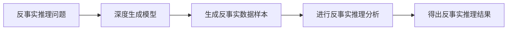

# 反事实推理中深度生成模型的前沿应用研究

> 关键词：反事实推理、深度生成模型、因果推断、人工智能、前沿应用、机器学习、数据生成

> 摘要：本文聚焦于反事实推理中深度生成模型的前沿应用研究。首先介绍了研究的背景、目的、预期读者等内容，随后深入探讨了反事实推理和深度生成模型的核心概念与联系，详细阐述了相关核心算法原理并给出Python代码示例。通过数学模型和公式进一步剖析其内在逻辑，结合项目实战展示代码的实际应用与解读。分析了反事实推理中深度生成模型在不同领域的实际应用场景，推荐了相关的学习资源、开发工具框架以及论文著作。最后总结了其未来发展趋势与挑战，解答常见问题并提供扩展阅读和参考资料，旨在全面深入地展现该领域的研究现状与前景。

## 1. 背景介绍 
### 1.1 目的和范围
反事实推理在众多领域，如医疗、经济、政策评估等有着重要的应用价值。它旨在回答“如果某个因素发生改变，结果会怎样”的问题，从而为决策提供更深入的依据。而深度生成模型作为一种强大的机器学习工具，能够学习数据的分布并生成新的数据样本。本研究的目的在于探索深度生成模型在反事实推理中的前沿应用，分析其原理、算法、实际案例等，涵盖从理论到实践的多个方面，以全面揭示其在不同场景下的潜力和应用效果。

### 1.2 预期读者
本文预期读者包括对人工智能、机器学习、因果推断等领域感兴趣的研究人员、学生，以及从事相关领域开发的工程师和技术人员。对于希望深入了解反事实推理和深度生成模型结合应用的专业人士，本文将提供有价值的参考信息。

### 1.3 文档结构概述
本文首先介绍背景信息，让读者了解研究的目的和范围。接着阐述反事实推理和深度生成模型的核心概念与联系，为后续内容奠定基础。然后详细讲解核心算法原理和具体操作步骤，并给出Python代码示例。通过数学模型和公式进一步深入剖析。结合项目实战展示实际应用和代码解读。分析实际应用场景，推荐相关的学习资源、开发工具框架和论文著作。最后总结未来发展趋势与挑战，解答常见问题并提供扩展阅读和参考资料。

### 1.4 术语表
#### 1.4.1 核心术语定义
- **反事实推理（Counterfactual Reasoning）**：是一种基于因果关系的推理方法，通过设想在与事实相反的条件下，结果会发生怎样的变化，从而推断出某个因素对结果的因果效应。
- **深度生成模型（Deep Generative Model）**：是一类基于深度学习的模型，能够学习数据的潜在分布，并根据学习到的分布生成新的数据样本。常见的深度生成模型包括生成对抗网络（GAN）、变分自编码器（VAE）等。

#### 1.4.2 相关概念解释
- **因果推断（Causal Inference）**：旨在确定变量之间的因果关系，而不是仅仅观察到的相关性。反事实推理是因果推断中的重要方法之一。
- **潜在变量（Latent Variable）**：在深度生成模型中，潜在变量是指模型中未直接观测到的变量，它通常表示数据的潜在结构或特征。

#### 1.4.3 缩略词列表
- **GAN**：生成对抗网络（Generative Adversarial Network）
- **VAE**：变分自编码器（Variational Autoencoder）
- **ML**：机器学习（Machine Learning）
- **AI**：人工智能（Artificial Intelligence）

## 2. 核心概念与联系 

### 反事实推理原理
反事实推理的核心在于构建一个与事实相反的情景，并预测在该情景下的结果。例如，在医疗领域，我们想知道如果某个患者接受了不同的治疗方案，其康复情况会如何。这就需要我们基于已知的信息和因果关系，推断出在反事实情况下的结果。

### 深度生成模型原理
深度生成模型通过学习数据的分布，能够生成与原始数据相似的新样本。以生成对抗网络（GAN）为例，它由生成器和判别器组成。生成器尝试生成逼真的数据样本，而判别器则负责区分生成的样本和真实的样本。通过不断的对抗训练，生成器能够逐渐学习到数据的分布，从而生成高质量的样本。

### 两者联系
深度生成模型可以为反事实推理提供数据支持。在反事实推理中，往往需要生成在反事实情况下的数据样本，而深度生成模型正好可以完成这个任务。例如，通过生成对抗网络生成在不同治疗方案下患者的特征数据，从而辅助进行反事实推理，评估不同治疗方案的效果。

### 文本示意图
反事实推理与深度生成模型的联系可以用以下文本描述：反事实推理提出对不同情景下结果的疑问，深度生成模型通过学习数据分布生成反事实情景下的数据样本，为反事实推理提供数据基础，进而辅助得出更准确的反事实推理结果。

### Mermaid流程图


## 3. 核心算法原理 & 具体操作步骤 

### 生成对抗网络（GAN）原理
生成对抗网络由生成器 $G$ 和判别器 $D$ 组成。生成器的目标是生成尽可能逼真的数据样本，而判别器的目标是准确区分生成的样本和真实的样本。两者通过对抗训练不断优化。

#### Python代码示例
```python
import torch
import torch.nn as nn
import torch.optim as optim
import numpy as np
import matplotlib.pyplot as plt

# 定义生成器
class Generator(nn.Module):
    def __init__(self, input_dim, output_dim):
        super(Generator, self).__init__()
        self.model = nn.Sequential(
            nn.Linear(input_dim, 128),
            nn.LeakyReLU(0.2),
            nn.Linear(128, 256),
            nn.BatchNorm1d(256),
            nn.LeakyReLU(0.2),
            nn.Linear(256, 512),
            nn.BatchNorm1d(512),
            nn.LeakyReLU(0.2),
            nn.Linear(512, output_dim),
            nn.Tanh()
        )

    def forward(self, z):
        return self.model(z)

# 定义判别器
class Discriminator(nn.Module):
    def __init__(self, input_dim):
        super(Discriminator, self).__init__()
        self.model = nn.Sequential(
            nn.Linear(input_dim, 512),
            nn.LeakyReLU(0.2),
            nn.Linear(512, 256),
            nn.LeakyReLU(0.2),
            nn.Linear(256, 1),
            nn.Sigmoid()
        )

    def forward(self, x):
        return self.model(x)

# 超参数设置
input_dim = 100
output_dim = 784
batch_size = 32
epochs = 100
lr = 0.0002

# 初始化生成器和判别器
generator = Generator(input_dim, output_dim)
discriminator = Discriminator(output_dim)

# 定义损失函数和优化器
criterion = nn.BCELoss()
g_optimizer = optim.Adam(generator.parameters(), lr=lr)
d_optimizer = optim.Adam(discriminator.parameters(), lr=lr)

# 模拟真实数据
real_data = torch.randn(batch_size, output_dim)

for epoch in range(epochs):
    # 训练判别器
    discriminator.zero_grad()
    real_labels = torch.ones(batch_size, 1)
    fake_labels = torch.zeros(batch_size, 1)

    # 计算判别器对真实数据的损失
    real_output = discriminator(real_data)
    d_real_loss = criterion(real_output, real_labels)

    # 生成假数据
    z = torch.randn(batch_size, input_dim)
    fake_data = generator(z)

    # 计算判别器对假数据的损失
    fake_output = discriminator(fake_data.detach())
    d_fake_loss = criterion(fake_output, fake_labels)

    # 判别器总损失
    d_loss = d_real_loss + d_fake_loss
    d_loss.backward()
    d_optimizer.step()

    # 训练生成器
    generator.zero_grad()
    fake_output = discriminator(fake_data)
    g_loss = criterion(fake_output, real_labels)
    g_loss.backward()
    g_optimizer.step()

    if epoch % 10 == 0:
        print(f'Epoch {epoch}, D_loss: {d_loss.item()}, G_loss: {g_loss.item()}')
```

### 具体操作步骤
1. **数据准备**：收集和整理用于训练的真实数据。
2. **模型初始化**：初始化生成器和判别器的参数。
3. **训练判别器**：计算判别器对真实数据和假数据的损失，更新判别器的参数。
4. **训练生成器**：计算生成器的损失，更新生成器的参数。
5. **迭代训练**：重复步骤3和4，直到模型收敛。

## 4. 数学模型和公式 & 详细讲解 & 举例说明 

### 生成对抗网络的数学模型
生成对抗网络的目标是最小化生成器的损失，同时最大化判别器的损失。其数学模型可以表示为以下的极小极大博弈问题：

$$\min_{G}\max_{D} V(D, G) = \mathbb{E}_{x\sim p_{data}(x)}[\log D(x)] + \mathbb{E}_{z\sim p_{z}(z)}[\log(1 - D(G(z)))]$$

其中，$p_{data}(x)$ 表示真实数据的分布，$p_{z}(z)$ 表示噪声的分布，$G(z)$ 表示生成器根据噪声 $z$ 生成的数据样本，$D(x)$ 表示判别器对数据样本 $x$ 的判别结果。

### 详细讲解
- **判别器的目标**：判别器的目标是最大化 $V(D, G)$，即准确区分真实数据和生成的数据。对于真实数据 $x$，判别器希望 $D(x)$ 接近1；对于生成的数据 $G(z)$，判别器希望 $D(G(z))$ 接近0。
- **生成器的目标**：生成器的目标是最小化 $V(D, G)$，即生成能够欺骗判别器的数据样本。生成器希望 $D(G(z))$ 接近1。

### 举例说明
假设我们有一个二维的真实数据分布，生成器的输入是一个一维的噪声向量。通过不断的训练，生成器会学习到真实数据的分布，从而生成与真实数据相似的二维数据点。判别器则会不断提高区分真实数据和生成数据的能力。最终，当模型收敛时，生成器能够生成高质量的与真实数据分布相似的数据样本。

## 5. 项目实战：代码实际案例和详细解释说明 

### 5.1  开发环境搭建
- **操作系统**：可以选择Windows、Linux或macOS。
- **Python环境**：建议使用Python 3.7及以上版本。
- **深度学习框架**：使用PyTorch作为深度学习框架，可以通过以下命令安装：
```bash
pip install torch torchvision
```
- **其他依赖库**：安装`numpy`、`matplotlib`等常用库：
```bash
pip install numpy matplotlib
```

### 5.2  源代码详细实现和代码解读
以下是一个完整的使用生成对抗网络进行手写数字生成的代码示例：

```python
import torch
import torch.nn as nn
import torch.optim as optim
import torchvision
import torchvision.datasets as datasets
import torchvision.transforms as transforms
import matplotlib.pyplot as plt
import numpy as np

# 定义生成器
class Generator(nn.Module):
    def __init__(self, input_dim, output_dim):
        super(Generator, self).__init__()
        self.model = nn.Sequential(
            nn.Linear(input_dim, 256),
            nn.LeakyReLU(0.2),
            nn.Linear(256, 512),
            nn.LeakyReLU(0.2),
            nn.Linear(512, 1024),
            nn.LeakyReLU(0.2),
            nn.Linear(1024, output_dim),
            nn.Tanh()
        )

    def forward(self, z):
        return self.model(z)

# 定义判别器
class Discriminator(nn.Module):
    def __init__(self, input_dim):
        super(Discriminator, self).__init__()
        self.model = nn.Sequential(
            nn.Linear(input_dim, 1024),
            nn.LeakyReLU(0.2),
            nn.Dropout(0.3),
            nn.Linear(1024, 512),
            nn.LeakyReLU(0.2),
            nn.Dropout(0.3),
            nn.Linear(512, 256),
            nn.LeakyReLU(0.2),
            nn.Dropout(0.3),
            nn.Linear(256, 1),
            nn.Sigmoid()
        )

    def forward(self, x):
        return self.model(x)

# 超参数设置
input_dim = 100
output_dim = 784  # 28x28 手写数字图像
batch_size = 32
epochs = 50
lr = 0.0002

# 数据加载
transform = transforms.Compose([
    transforms.ToTensor(),
    transforms.Normalize((0.5,), (0.5,))
])

train_dataset = datasets.MNIST(root='./data', train=True, transform=transform, download=True)
train_loader = torch.utils.data.DataLoader(train_dataset, batch_size=batch_size, shuffle=True)

# 初始化生成器和判别器
generator = Generator(input_dim, output_dim)
discriminator = Discriminator(output_dim)

# 定义损失函数和优化器
criterion = nn.BCELoss()
g_optimizer = optim.Adam(generator.parameters(), lr=lr)
d_optimizer = optim.Adam(discriminator.parameters(), lr=lr)

# 训练过程
for epoch in range(epochs):
    for i, (real_images, _) in enumerate(train_loader):
        real_images = real_images.view(real_images.size(0), -1)
        batch_size = real_images.size(0)

        # 训练判别器
        discriminator.zero_grad()
        real_labels = torch.ones(batch_size, 1)
        fake_labels = torch.zeros(batch_size, 1)

        # 计算判别器对真实数据的损失
        real_output = discriminator(real_images)
        d_real_loss = criterion(real_output, real_labels)

        # 生成假数据
        z = torch.randn(batch_size, input_dim)
        fake_data = generator(z)

        # 计算判别器对假数据的损失
        fake_output = discriminator(fake_data.detach())
        d_fake_loss = criterion(fake_output, fake_labels)

        # 判别器总损失
        d_loss = d_real_loss + d_fake_loss
        d_loss.backward()
        d_optimizer.step()

        # 训练生成器
        generator.zero_grad()
        fake_output = discriminator(fake_data)
        g_loss = criterion(fake_output, real_labels)
        g_loss.backward()
        g_optimizer.step()

    if epoch % 10 == 0:
        print(f'Epoch {epoch}, D_loss: {d_loss.item()}, G_loss: {g_loss.item()}')

# 生成一些样本进行可视化
z = torch.randn(16, input_dim)
generated_images = generator(z).detach().view(-1, 1, 28, 28)
generated_images = (generated_images + 1) / 2.0  # 反归一化

fig, axes = plt.subplots(4, 4, figsize=(4, 4))
axes = axes.flatten()
for i in range(16):
    axes[i].imshow(generated_images[i].squeeze(), cmap='gray')
    axes[i].axis('off')
plt.show()
```

### 代码解读
1. **数据加载**：使用`torchvision`加载MNIST手写数字数据集，并进行归一化处理。
2. **模型定义**：定义了生成器和判别器的网络结构。生成器将随机噪声向量映射到784维的图像向量，判别器用于判断输入的图像是真实的还是生成的。
3. **训练过程**：交替训练判别器和生成器。判别器的目标是准确区分真实图像和生成图像，生成器的目标是生成能够欺骗判别器的图像。
4. **可视化**：训练结束后，生成一些样本并进行可视化展示。

### 5.3  代码解读与分析
- **判别器训练**：判别器的训练分为两部分，分别计算对真实数据和假数据的损失，然后将两者相加得到总损失，通过反向传播更新判别器的参数。
- **生成器训练**：生成器的训练目标是让判别器将生成的假数据判断为真实数据，通过计算生成数据在判别器中的输出与真实标签的损失，反向传播更新生成器的参数。
- **模型性能**：通过观察判别器和生成器的损失变化，可以评估模型的训练效果。如果判别器的损失过小，可能表示生成器的性能较差；如果生成器的损失过小，可能表示判别器的性能较差。

## 6. 实际应用场景 
### 医疗领域
在医疗领域，反事实推理中深度生成模型可以用于评估不同治疗方案的效果。例如，对于患有某种疾病的患者，通过深度生成模型生成在不同治疗方案下患者的特征数据，然后进行反事实推理，比较不同治疗方案的疗效，为医生制定个性化的治疗方案提供参考。

### 经济领域
在经济领域，反事实推理中深度生成模型可以用于政策评估。例如，评估某项经济政策的实施效果时，通过生成在没有实施该政策情况下的经济数据，与实际数据进行对比，从而更准确地评估政策的影响。

### 交通领域
在交通领域，反事实推理中深度生成模型可以用于交通流量预测和交通管理。例如，预测在不同交通管制措施下的交通流量，通过生成反事实情况下的交通数据，帮助交通管理部门制定更合理的交通策略。

### 教育领域
在教育领域，反事实推理中深度生成模型可以用于评估不同教学方法的效果。例如，通过生成在不同教学方法下学生的学习数据，进行反事实推理，比较不同教学方法的优劣，为教师改进教学提供依据。

## 7. 工具和资源推荐
### 7.1 学习资源推荐
#### 7.1.1 书籍推荐
- 《深度学习》（Deep Learning）：由Ian Goodfellow、Yoshua Bengio和Aaron Courville所著，是深度学习领域的经典教材，涵盖了深度生成模型等多个方面的内容。
- 《生成对抗网络实战》（GANs in Action）：详细介绍了生成对抗网络的原理和应用，通过大量的代码示例帮助读者深入理解。

#### 7.1.2 在线课程
- Coursera上的“深度学习专项课程”（Deep Learning Specialization）：由Andrew Ng教授授课，包含了深度学习的多个方面，包括深度生成模型。
- edX上的“人工智能基础”（Fundamentals of Artificial Intelligence）：提供了人工智能领域的基础知识，包括因果推断和反事实推理的相关内容。

#### 7.1.3 技术博客和网站
- Medium：有许多关于深度学习和深度生成模型的技术博客，如Towards Data Science。
- arXiv：是一个开放的学术预印本平台，提供了大量关于反事实推理和深度生成模型的最新研究论文。

### 7.2 开发工具框架推荐
#### 7.2.1 IDE和编辑器
- PyCharm：是一款专业的Python集成开发环境，提供了丰富的代码编辑、调试和版本控制功能。
- Jupyter Notebook：是一个交互式的开发环境，适合进行数据探索和模型实验。

#### 7.2.2 调试和性能分析工具
- TensorBoard：是TensorFlow的可视化工具，也可以用于PyTorch模型的可视化和性能分析。
- PyTorch Profiler：可以帮助用户分析PyTorch模型的性能瓶颈。

#### 7.2.3 相关框架和库
- PyTorch：是一个广泛使用的深度学习框架，提供了丰富的深度学习模型和工具。
- TensorFlow：是另一个流行的深度学习框架，具有强大的分布式训练和部署能力。

### 7.3 相关论文著作推荐
#### 7.3.1 经典论文
- “Generative Adversarial Nets”：由Ian Goodfellow等人发表，首次提出了生成对抗网络的概念。
- “Auto-Encoding Variational Bayes”：介绍了变分自编码器的原理和应用。

#### 7.3.2 最新研究成果
- 可以通过arXiv和相关学术会议，如NeurIPS、ICML等，获取反事实推理和深度生成模型的最新研究成果。

#### 7.3.3 应用案例分析
- 可以参考相关领域的学术期刊和会议论文，了解反事实推理中深度生成模型在不同领域的应用案例。

## 8. 总结：未来发展趋势与挑战
### 未来发展趋势
- **多模态融合**：将深度生成模型与多模态数据（如图像、文本、音频等）相结合，实现更复杂的反事实推理任务。
- **可解释性增强**：提高深度生成模型和反事实推理的可解释性，使得模型的决策过程更加透明，便于用户理解和信任。
- **跨领域应用拓展**：将反事实推理中深度生成模型的应用拓展到更多领域，如金融、能源、环境等。

### 挑战
- **数据质量和隐私问题**：深度生成模型需要大量高质量的数据进行训练，同时需要保护数据的隐私和安全。
- **模型训练和优化**：深度生成模型的训练过程复杂，容易出现不稳定和收敛困难的问题，需要进一步研究有效的训练和优化方法。
- **因果关系建模**：准确地建模因果关系是反事实推理的关键，但在实际应用中，因果关系往往复杂且难以确定。

## 9. 附录：常见问题与解答
### 问题1：深度生成模型在反事实推理中一定能得到准确的结果吗？
答：不一定。深度生成模型的性能受到多种因素的影响，如数据质量、模型结构、训练方法等。此外，反事实推理本身也存在一定的不确定性，因为我们无法直接观测到反事实情况下的真实结果。因此，深度生成模型在反事实推理中只能提供参考，需要结合其他方法和领域知识进行综合判断。

### 问题2：如何选择合适的深度生成模型用于反事实推理？
答：选择合适的深度生成模型需要考虑多个因素，如数据类型、任务需求、计算资源等。例如，如果数据是图像数据，可以考虑使用生成对抗网络；如果需要对数据进行概率建模，可以考虑使用变分自编码器。此外，还可以通过实验比较不同模型的性能，选择最适合的模型。

### 问题3：深度生成模型的训练过程中出现过拟合怎么办？
答：可以采取以下措施来解决过拟合问题：增加训练数据、使用正则化方法（如L1、L2正则化）、使用Dropout层、调整模型结构（如减少模型参数）等。

## 10. 扩展阅读 & 参考资料
### 扩展阅读
- 《因果革命：数据科学如何走向因果推断》：深入探讨了因果推断的理论和方法，对于理解反事实推理有很大的帮助。
- 《深度学习进阶：算法与应用》：进一步介绍了深度学习的高级算法和应用，包括深度生成模型的最新进展。

### 参考资料
- Goodfellow, I. J., et al. (2014). Generative adversarial nets. Advances in neural information processing systems.
- Kingma, D. P., & Welling, M. (2013). Auto-encoding variational bayes. arXiv preprint arXiv:1312.6114.
- Pearl, J. (2009). Causality: models, reasoning, and inference. Cambridge university press.