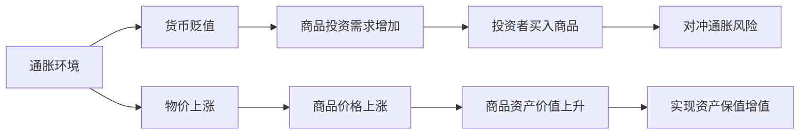

# 商品投资：在通胀环境中的对冲作用

> 关键词：商品投资、通胀环境、对冲作用、投资策略、资产配置

> 摘要：本文聚焦于商品投资在通胀环境中的对冲作用。首先介绍了商品投资及通胀的背景知识，深入剖析了商品投资与通胀之间的核心概念及内在联系。接着阐述了相关的核心算法原理和具体操作步骤，运用数学模型和公式对其进行量化分析。通过项目实战案例展示商品投资在实际操作中的具体实现和效果。探讨了商品投资在不同场景下的实际应用，推荐了学习、开发相关的工具和资源。最后总结了商品投资在通胀环境中应用的未来发展趋势与挑战，并对常见问题进行解答，为投资者在通胀环境下合理运用商品投资进行资产配置提供全面的参考。

## 1. 背景介绍 
### 1.1 目的和范围
在经济发展过程中，通胀是一个常见的经济现象，它会对各类资产的价值产生影响。商品投资作为一种重要的投资方式，其在通胀环境中的表现备受关注。本文旨在深入探讨商品投资在通胀环境中的对冲作用，详细分析其原理、策略和实际应用，范围涵盖商品投资的各个方面，包括不同商品种类、投资方式以及与通胀的相互关系等。通过对这些内容的研究，为投资者提供在通胀环境下进行商品投资的理论依据和实践指导。

### 1.2 预期读者
本文预期读者包括专业投资者、金融从业者、经济研究人员以及对商品投资和通胀问题感兴趣的普通投资者。对于专业投资者和金融从业者，本文可以为他们在制定投资策略和资产配置方案时提供深入的理论支持和实践参考；对于经济研究人员，有助于他们进一步研究商品市场与宏观经济的关系；对于普通投资者，能够帮助他们了解商品投资在通胀环境中的作用，提升投资知识和决策能力。

### 1.3 文档结构概述
本文共分为十个部分。第一部分为背景介绍，阐述了文章的目的、预期读者和文档结构概述，并对相关术语进行解释。第二部分分析核心概念与联系，包括商品投资、通胀的原理以及它们之间的内在逻辑关系，并通过示意图和流程图展示。第三部分讲解核心算法原理和具体操作步骤，运用 Python 代码详细阐述相关算法。第四部分介绍数学模型和公式，对商品投资在通胀环境中的作用进行量化分析并举例说明。第五部分通过项目实战，展示代码实际案例并进行详细解释。第六部分探讨实际应用场景，分析商品投资在不同场景下的应用方式和效果。第七部分推荐学习、开发相关的工具和资源，包括书籍、在线课程、技术博客、开发工具、框架和相关论文等。第八部分总结未来发展趋势与挑战，对商品投资在通胀环境中的发展前景进行展望。第九部分为附录，解答常见问题。第十部分提供扩展阅读和参考资料，方便读者进一步深入研究。

### 1.4 术语表
#### 1.4.1 核心术语定义
- **商品投资**：指投资者将资金投入到各类商品市场，包括农产品、能源、金属等实物商品或与商品相关的金融衍生品，以获取投资收益的行为。
- **通胀**：即通货膨胀，是指在货币流通条件下，因货币供给大于货币实际需求，也即现实购买力大于产出供给,导致货币贬值，而引起的一段时间内物价持续而普遍地上涨现象。其实质是社会总需求大于社会总供给 （供远小于求）。
- **对冲**：是一种在降低商业风险的同时仍然能在投资中获利的手法。一般对冲是同时进行两笔行情相关、方向相反、数量相当、盈亏相抵的交易。在通胀环境中，商品投资的对冲作用是指通过投资商品来抵消因通胀导致的资产价值缩水的风险。

#### 1.4.2 相关概念解释
- **商品期货**：是一种标准化的合约，约定在未来某个特定时间和地点交割一定数量和质量的商品。投资者可以通过买卖商品期货合约来参与商品市场的投资，期货市场具有杠杆效应，能够放大投资收益和风险。
- **消费者物价指数（CPI）**：是反映与居民生活有关的消费品及服务价格水平的变动情况的重要宏观经济指标，通常作为衡量通货膨胀水平的重要指标。当 CPI 持续上涨时，表明存在通货膨胀压力。

#### 1.4.3 缩略词列表
- **CPI**：Consumer Price Index，消费者物价指数

## 2. 核心概念与联系 

### 商品投资原理
商品投资的基本原理是基于商品的供需关系和价值波动。不同种类的商品具有不同的特性和市场供需情况。例如，农产品的供给受到季节、气候等因素的影响，而能源商品的需求则与经济增长、工业生产等密切相关。投资者通过分析商品的基本面信息，如产量、库存、需求趋势等，来判断商品价格的走势，从而进行投资决策。当预期商品价格上涨时，投资者可以买入商品或相关的金融衍生品，待价格上涨后卖出获利；反之，当预期价格下跌时，可以进行卖空操作。

### 通胀原理
通胀的产生主要源于货币供应量的增加、需求拉动、成本推动等因素。当货币供应量超过经济实际需求时，过多的货币追逐相对较少的商品和服务，导致物价上涨。需求拉动型通胀是指由于总需求超过总供给，使得物价水平上升。成本推动型通胀则是由于生产成本的上升，如原材料价格上涨、劳动力成本增加等，导致企业提高产品价格，进而引发物价普遍上涨。

### 商品投资与通胀的联系
在通胀环境下，商品投资具有重要的对冲作用。一方面，许多商品本身具有内在价值，如黄金、白银等贵金属，它们的价值相对稳定，不会因货币贬值而大幅缩水。当通胀发生时，货币的购买力下降，而商品的价格往往会上涨，投资者持有的商品资产价值也会随之上升，从而抵消了货币贬值带来的损失。另一方面，一些商品的价格与通胀直接相关，如能源和农产品。能源是经济活动的基础，随着通胀的加剧，能源需求往往会增加，同时生产成本也会上升，这会推动能源价格上涨。农产品的价格也会受到通胀的影响，因为通胀会导致生产成本上升，同时需求也可能因人口增长和消费升级而增加。

### 文本示意图
```plaintext
              通胀环境
                │
                │
       ┌────────┴─────────┐
       │                  │
  货币贬值            物价上涨
       │                  │
       │                  │
  商品投资需求增加     商品价格上涨
       │                  │
       │                  │
  投资者买入商品       商品资产价值上升
       │                  │
       │                  │
  对冲通胀风险        实现资产保值增值
```

### Mermaid 流程图


## 3. 核心算法原理 & 具体操作步骤 

### 核心算法原理
在商品投资中，一个重要的算法是基于趋势分析的投资策略。该策略的核心思想是通过分析商品价格的历史数据，识别价格的趋势，然后根据趋势进行投资决策。常见的趋势分析方法包括移动平均线法和动量分析法。

#### 移动平均线法
移动平均线是一种平滑价格数据的方法，它通过计算一定时间周期内的价格平均值来反映价格的趋势。常见的移动平均线有简单移动平均线（SMA）和指数移动平均线（EMA）。简单移动平均线的计算公式为：

$$SMA_n = \frac{\sum_{i = 0}^{n - 1} P_{t - i}}{n}$$

其中，$SMA_n$ 表示 $n$ 周期的简单移动平均线，$P_{t - i}$ 表示第 $t - i$ 期的价格，$n$ 表示计算移动平均线的周期数。

指数移动平均线则对近期的价格数据赋予更高的权重，其计算公式为：

$$EMA_t = \alpha P_t + (1 - \alpha) EMA_{t - 1}$$

其中，$EMA_t$ 表示第 $t$ 期的指数移动平均线，$P_t$ 表示第 $t$ 期的价格，$\alpha$ 表示平滑系数，其取值范围为 $(0, 1)$。

#### 动量分析法
动量分析法是基于价格的变化速度来判断趋势的方法。动量指标（Momentum）的计算公式为：

$$M_t = P_t - P_{t - n}$$

其中，$M_t$ 表示第 $t$ 期的动量指标，$P_t$ 表示第 $t$ 期的价格，$P_{t - n}$ 表示 $n$ 期前的价格。

### 具体操作步骤
#### 数据收集
首先需要收集商品价格的历史数据，可以从金融数据提供商、交易所等渠道获取。数据的时间跨度和频率根据投资策略的需求进行选择，一般来说，较长的时间跨度和较高的数据频率可以提供更准确的分析结果。

#### 数据预处理
对收集到的数据进行清洗和预处理，包括去除缺失值、异常值等。可以使用 Python 的 Pandas 库进行数据处理。

#### 计算指标
根据选择的趋势分析方法，计算相应的指标，如移动平均线、动量指标等。

#### 制定投资策略
根据计算得到的指标，制定投资策略。例如，当短期移动平均线向上穿过长期移动平均线时，发出买入信号；当短期移动平均线向下穿过长期移动平均线时，发出卖出信号。

#### 回测和优化
使用历史数据对投资策略进行回测，评估策略的性能。根据回测结果对策略进行优化，调整参数以提高策略的收益率和风险控制能力。

### Python 源代码实现
```python
import pandas as pd
import numpy as np
import matplotlib.pyplot as plt

# 模拟商品价格数据
np.random.seed(0)
dates = pd.date_range(start='2020-01-01', periods=365, freq='D')
prices = np.random.randn(365).cumsum() + 100
data = pd.DataFrame({'price': prices}, index=dates)

# 计算简单移动平均线
data['SMA_20'] = data['price'].rolling(window=20).mean()
data['SMA_50'] = data['price'].rolling(window=50).mean()

# 计算动量指标
data['momentum'] = data['price'].diff(20)

# 制定投资策略
data['signal'] = 0
data.loc[data['SMA_20'] > data['SMA_50'], 'signal'] = 1  # 买入信号
data.loc[data['SMA_20'] < data['SMA_50'], 'signal'] = -1  # 卖出信号

# 计算持仓
data['position'] = data['signal'].diff()

# 绘制图表
plt.figure(figsize=(12, 6))
plt.plot(data['price'], label='Price')
plt.plot(data['SMA_20'], label='SMA 20')
plt.plot(data['SMA_50'], label='SMA 50')
plt.plot(data[data['position'] == 1].index, data['price'][data['position'] == 1], '^', markersize=10, color='g', label='Buy Signal')
plt.plot(data[data['position'] == -1].index, data['price'][data['position'] == -1], 'v', markersize=10, color='r', label='Sell Signal')
plt.title('Commodity Investment Strategy')
plt.xlabel('Date')
plt.ylabel('Price')
plt.legend()
plt.show()
```

## 4. 数学模型和公式 & 详细讲解 & 举例说明 

### 夏普比率模型
夏普比率（Sharpe Ratio）是衡量投资组合风险调整后收益的重要指标，它反映了投资组合在承担单位风险时所能获得的超额收益。夏普比率的计算公式为：

$$Sharpe Ratio = \frac{R_p - R_f}{\sigma_p}$$

其中，$R_p$ 表示投资组合的预期收益率，$R_f$ 表示无风险收益率，$\sigma_p$ 表示投资组合的收益率标准差。

### 详细讲解
夏普比率的分子 $R_p - R_f$ 表示投资组合的超额收益率，即投资组合的收益率超过无风险收益率的部分。分母 $\sigma_p$ 表示投资组合的风险，用收益率的标准差来衡量。夏普比率越高，说明投资组合在承担相同风险的情况下能够获得更高的超额收益，投资组合的绩效越好。

### 举例说明
假设一个商品投资组合在过去一年的收益率为 15%，无风险收益率为 3%，投资组合的收益率标准差为 20%。则该投资组合的夏普比率为：

$$Sharpe Ratio = \frac{0.15 - 0.03}{0.2} = 0.6$$

这意味着该投资组合每承担 1% 的风险，可以获得 0.6% 的超额收益。如果另一个投资组合的夏普比率为 0.8，则说明该投资组合在风险调整后的收益表现更好。

### 资本资产定价模型（CAPM）
资本资产定价模型（CAPM）用于描述资产的预期收益率与系统性风险之间的关系。其公式为：

$$E(R_i) = R_f + \beta_i (E(R_m) - R_f)$$

其中，$E(R_i)$ 表示资产 $i$ 的预期收益率，$R_f$ 表示无风险收益率，$\beta_i$ 表示资产 $i$ 的贝塔系数，$E(R_m)$ 表示市场组合的预期收益率。

### 详细讲解
贝塔系数 $\beta_i$ 衡量了资产 $i$ 的收益率相对于市场组合收益率的波动程度。当 $\beta_i > 1$ 时，说明资产 $i$ 的波动幅度大于市场组合，具有较高的系统性风险；当 $\beta_i < 1$ 时，说明资产 $i$ 的波动幅度小于市场组合，系统性风险较低。

### 举例说明
假设无风险收益率为 3%，市场组合的预期收益率为 10%，某商品投资的贝塔系数为 1.2。则该商品投资的预期收益率为：

$$E(R_i) = 0.03 + 1.2 \times (0.1 - 0.03) = 0.114 = 11.4\%$$

这意味着在给定的市场条件下，该商品投资的预期收益率为 11.4%。

## 5. 项目实战：代码实际案例和详细解释说明 

### 5.1  开发环境搭建
#### 安装 Python
首先需要安装 Python 开发环境，建议使用 Python 3.7 及以上版本。可以从 Python 官方网站（https://www.python.org/downloads/） 下载适合自己操作系统的安装包，按照安装向导进行安装。

#### 安装必要的库
在商品投资项目中，需要使用一些常用的 Python 库，如 Pandas、Numpy、Matplotlib 等。可以使用 pip 命令进行安装：

```sh
pip install pandas numpy matplotlib
```

### 5.2  源代码详细实现和代码解读
```python
import pandas as pd
import numpy as np
import matplotlib.pyplot as plt

# 数据收集和预处理
# 假设从 CSV 文件中读取商品价格数据
data = pd.read_csv('commodity_prices.csv')
data['Date'] = pd.to_datetime(data['Date'])
data.set_index('Date', inplace=True)

# 计算简单移动平均线
short_window = 20
long_window = 50
data['SMA_short'] = data['Price'].rolling(window=short_window).mean()
data['SMA_long'] = data['Price'].rolling(window=long_window).mean()

# 生成交易信号
data['signal'] = 0
data.loc[data['SMA_short'] > data['SMA_long'], 'signal'] = 1
data.loc[data['SMA_short'] < data['SMA_long'], 'signal'] = -1

# 计算持仓
data['position'] = data['signal'].diff()

# 计算策略收益
data['returns'] = data['Price'].pct_change()
data['strategy_returns'] = data['returns'] * data['signal'].shift(1)

# 计算累计收益
data['cumulative_returns'] = (1 + data['returns']).cumprod()
data['cumulative_strategy_returns'] = (1 + data['strategy_returns']).cumprod()

# 绘制图表
plt.figure(figsize=(12, 6))
plt.plot(data['cumulative_returns'], label='Buy and Hold')
plt.plot(data['cumulative_strategy_returns'], label='Strategy')
plt.title('Commodity Investment Strategy Performance')
plt.xlabel('Date')
plt.ylabel('Cumulative Returns')
plt.legend()
plt.show()
```

### 5.3  代码解读与分析
#### 数据收集和预处理
使用 Pandas 的 `read_csv` 函数从 CSV 文件中读取商品价格数据，并将日期列转换为日期时间类型，设置为索引。

#### 计算简单移动平均线
使用 Pandas 的 `rolling` 函数计算短期（20 天）和长期（50 天）的简单移动平均线。

#### 生成交易信号
根据短期和长期移动平均线的交叉情况生成交易信号。当短期移动平均线大于长期移动平均线时，发出买入信号（信号值为 1）；当短期移动平均线小于长期移动平均线时，发出卖出信号（信号值为 -1）。

#### 计算持仓
通过计算交易信号的差值得到持仓情况。当持仓值为 1 时，表示买入；当持仓值为 -1 时，表示卖出。

#### 计算策略收益
计算商品价格的每日收益率，并根据交易信号计算策略的每日收益率。

#### 计算累计收益
使用 `cumprod` 函数计算买入持有策略和投资策略的累计收益率。

#### 绘制图表
使用 Matplotlib 库绘制买入持有策略和投资策略的累计收益率曲线，直观展示投资策略的性能。

## 6. 实际应用场景 

### 个人投资者资产配置
对于个人投资者来说，在通胀环境下，商品投资可以作为资产配置的一部分，起到对冲通胀风险的作用。例如，个人可以适当投资黄金、白银等贵金属，这些贵金属具有保值增值的特性，在通胀时期往往能够抵御货币贬值的影响。此外，也可以通过投资商品 ETF（交易型开放式指数基金）来参与商品市场，商品 ETF 可以追踪特定商品指数的表现，为投资者提供多样化的投资选择。

### 企业风险管理
企业在生产经营过程中面临着原材料价格波动的风险，特别是在通胀环境下，原材料价格可能会大幅上涨，增加企业的生产成本。企业可以通过商品投资进行风险管理，例如，石油企业可以通过期货市场进行套期保值，锁定未来的石油采购价格，避免因油价上涨而导致成本增加。同样，农产品加工企业可以通过投资农产品期货来对冲农产品价格波动的风险。

### 机构投资者投资组合优化
机构投资者如基金公司、保险公司等，通常会管理大规模的投资组合。在通胀环境下，他们可以将商品投资纳入投资组合，以优化投资组合的风险收益特征。通过合理配置不同种类的商品资产，可以降低投资组合的整体风险，提高投资组合的抗通胀能力。例如，一些全球宏观对冲基金在投资组合中会配置一定比例的商品期货，以应对不同国家和地区的通胀风险。

## 7. 工具和资源推荐
### 7.1 学习资源推荐
#### 7.1.1 书籍推荐
- 《期货市场技术分析》（John J. Murphy 著）：这本书是期货市场技术分析领域的经典著作，详细介绍了期货市场的技术分析方法和工具，对于学习商品投资的技术分析具有重要的参考价值。
- 《聪明的投资者》（本杰明·格雷厄姆 著）：该书是价值投资的经典之作，虽然主要讨论股票投资，但其中的投资理念和方法对于商品投资也具有一定的借鉴意义。
- 《商品投资手册》（杰里米·西格尔 著）：全面介绍了商品投资的相关知识，包括商品市场的特点、投资策略、风险管理等内容，是学习商品投资的重要参考书籍。

#### 7.1.2 在线课程
- Coursera 平台上的“Financial Markets”（金融市场）课程：由耶鲁大学教授罗伯特·席勒（Robert Shiller）主讲，该课程涵盖了金融市场的各个方面，包括商品市场，对于理解金融市场的运行机制和商品投资具有很大的帮助。
- 中国大学 MOOC 平台上的“投资学”课程：由国内知名高校的教授授课，系统介绍了投资学的基本理论和方法，包括商品投资的相关内容。

#### 7.1.3 技术博客和网站
- 华尔街见闻（https://wallstreetcn.com/）：提供全球金融市场的实时资讯和分析，包括商品市场的动态，对于投资者及时了解市场信息和行情变化非常有帮助。
- 期货日报网（http://www.qhrb.com.cn/）：专注于期货市场的专业网站，提供期货市场的政策法规、行情分析、研究报告等内容，是学习商品期货投资的重要资源。

### 7.2 开发工具框架推荐
#### 7.2.1 IDE和编辑器
- PyCharm：是一款专业的 Python 集成开发环境，具有强大的代码编辑、调试、代码分析等功能，适合开发商品投资相关的 Python 程序。
- Jupyter Notebook：是一个交互式的开发环境，支持 Python、R 等多种编程语言。在数据分析和可视化方面具有很大的优势，适合进行商品投资策略的研究和开发。

#### 7.2.2 调试和性能分析工具
- PDB：Python 自带的调试工具，可以帮助开发者逐步执行代码，查看变量的值和程序的执行流程，方便调试商品投资相关的代码。
- cProfile：Python 的性能分析工具，可以统计程序中各个函数的执行时间和调用次数，帮助开发者找出程序中的性能瓶颈，优化代码性能。

#### 7.2.3 相关框架和库
- Pandas：是一个强大的数据分析库，提供了丰富的数据结构和数据处理功能，非常适合处理商品价格数据和进行数据分析。
- Numpy：是 Python 的科学计算库，提供了高效的数组操作和数学函数，在商品投资的算法实现中经常使用。
- Matplotlib：是一个常用的绘图库，可以绘制各种类型的图表，如折线图、柱状图、散点图等，方便可视化商品投资的分析结果。

### 7.3 相关论文著作推荐
#### 7.3.1 经典论文
- "Futures Prices, Expectations, and Normal Backwardation"（Holbrook Working 著）：该论文对期货价格的形成机制和期货市场的功能进行了深入研究，对于理解商品期货市场具有重要的理论意义。
- "The Theory of Storage"（Nelson C. F. and H. R. Plosser 著）：提出了商品存储理论，解释了商品现货价格和期货价格之间的关系，是商品投资领域的经典理论之一。

#### 7.3.2 最新研究成果
- 可以通过学术数据库如 Web of Science、EBSCOhost 等搜索关于商品投资和通胀关系的最新研究论文，了解该领域的前沿动态和研究成果。

#### 7.3.3 应用案例分析
- 一些金融机构和研究机构会发布关于商品投资的应用案例分析报告，例如高盛、摩根大通等投资银行的研究报告，这些报告可以提供实际的投资案例和分析方法，对于投资者具有一定的参考价值。

## 8. 总结：未来发展趋势与挑战

### 未来发展趋势
#### 商品投资的多元化
随着金融市场的不断发展和创新，商品投资的种类和方式将越来越多元化。除了传统的商品期货、现货投资外，商品 ETF、商品期权等金融衍生品将得到更广泛的应用。同时，一些新兴的商品领域，如新能源、稀有金属等，也将成为商品投资的热点。

#### 与宏观经济的联系更加紧密
商品市场与宏观经济的联系将更加紧密，通胀、利率、汇率等宏观经济因素对商品价格的影响将更加显著。投资者需要更加关注宏观经济形势的变化，运用宏观经济分析方法来指导商品投资决策。

#### 技术创新推动投资策略升级
随着人工智能、大数据、区块链等技术的不断发展，商品投资领域将迎来技术创新的浪潮。这些技术将为投资者提供更精准的市场分析和投资决策支持，推动商品投资策略的升级和优化。

### 挑战
#### 市场波动风险
商品市场的价格波动较大，受到供需关系、地缘政治、自然灾害等多种因素的影响。投资者在进行商品投资时，需要面临较高的市场波动风险，如何有效控制风险是投资者面临的重要挑战。

#### 政策法规变化
商品市场受到政策法规的严格监管，政策法规的变化可能会对商品投资产生重大影响。例如，政府对商品市场的调控政策、税收政策等的调整，都可能改变商品市场的供需关系和价格走势，投资者需要及时关注政策法规的变化，调整投资策略。

#### 信息不对称
在商品投资市场中，信息不对称是一个普遍存在的问题。一些大型机构投资者和专业投资者可能拥有更多的信息资源和分析能力，而普通投资者则可能处于信息劣势地位。如何获取准确、及时的市场信息，提高自身的信息分析能力，是普通投资者面临的挑战之一。

## 9. 附录：常见问题与解答

### 商品投资的风险主要有哪些？
商品投资的风险主要包括市场风险、信用风险、流动性风险等。市场风险是指由于商品价格波动导致的投资损失风险；信用风险是指交易对手违约导致的损失风险；流动性风险是指在需要变现时无法及时以合理价格卖出商品的风险。

### 如何选择适合自己的商品投资品种？
选择适合自己的商品投资品种需要考虑多个因素，如个人的投资目标、风险承受能力、投资经验等。如果投资者风险承受能力较低，可以选择一些相对稳定的商品，如黄金、白银等贵金属；如果投资者风险承受能力较高，可以考虑投资一些波动较大的商品，如原油、铜等。同时，投资者还需要了解不同商品的市场供需情况、价格走势等信息，进行综合分析和判断。

### 商品投资与股票投资有什么区别？
商品投资与股票投资的主要区别在于投资对象和投资特点。商品投资的对象是实物商品或与商品相关的金融衍生品，其价格受到供需关系、生产成本等因素的影响；股票投资的对象是公司的股权，其价格受到公司业绩、市场预期等因素的影响。商品投资的波动通常较大，具有较强的周期性；股票投资的波动相对较小，但也受到宏观经济和行业发展的影响。

### 如何进行商品投资的风险管理？
进行商品投资的风险管理可以采取多种方法，如分散投资、套期保值、设置止损等。分散投资可以通过投资不同种类的商品来降低单一商品价格波动对投资组合的影响；套期保值可以通过期货市场等工具锁定商品价格，避免价格波动带来的损失；设置止损可以在投资损失达到一定程度时及时平仓，控制损失的扩大。

## 10. 扩展阅读 & 参考资料

### 扩展阅读
- 《金融炼金术》（乔治·索罗斯 著）：该书介绍了索罗斯的投资哲学和投资方法，对于理解金融市场的运行机制和投资策略具有一定的启发作用。
- 《黑天鹅：如何应对不可预知的未来》（纳西姆·尼古拉斯·塔勒布 著）：探讨了极端事件对金融市场的影响，提醒投资者要关注不确定性和风险。

### 参考资料
- 中国期货业协会发布的相关行业报告和研究资料。
- 各大金融机构发布的商品投资研究报告和市场分析报告。
- 相关学术期刊上发表的关于商品投资和通胀的研究论文。