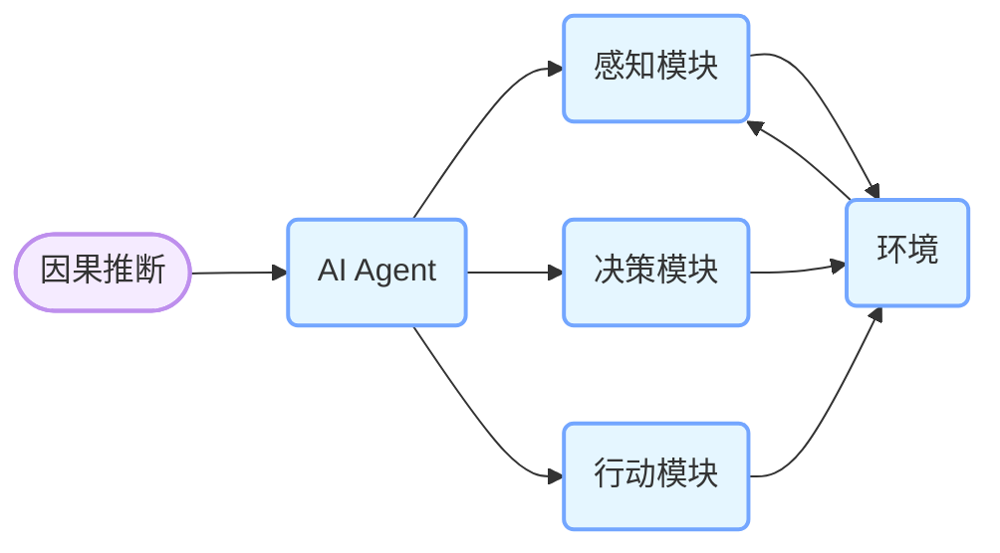

# 因果推断：增强AI Agent的因果理解

> 关键词：因果推断、AI Agent、因果理解、机器学习、人工智能、数据科学、决策模型

> 摘要：本文聚焦于因果推断在增强AI Agent因果理解方面的重要作用。首先介绍了因果推断及AI Agent的相关背景知识，明确目的、预期读者和文档结构。接着深入阐述因果推断和AI Agent的核心概念及联系，给出原理和架构示意图与流程图。详细讲解核心算法原理，结合Python代码进行说明，并给出数学模型和公式。通过项目实战展示代码实现和解读，探讨实际应用场景。推荐相关学习资源、开发工具框架和论文著作。最后总结未来发展趋势与挑战，提供常见问题解答和扩展阅读参考资料，旨在全面深入地探讨如何利用因果推断提升AI Agent的因果理解能力，推动人工智能技术的发展。

## 1. 背景介绍 
### 1.1 目的和范围
在人工智能领域，AI Agent被广泛应用于各种场景，如自动驾驶、智能医疗、金融风险评估等。然而，当前的AI Agent大多基于关联分析和统计学习，缺乏对因果关系的深入理解。这导致在面对复杂、动态的环境时，AI Agent的决策可能不够准确和可靠。本文章的目的在于探讨如何利用因果推断技术增强AI Agent的因果理解能力，使其能够做出更合理、更具解释性的决策。范围涵盖因果推断的基本原理、相关算法、在AI Agent中的应用实践，以及未来的发展趋势和面临的挑战。

### 1.2 预期读者
本文预期读者包括对人工智能、机器学习、数据科学等领域感兴趣的研究人员、工程师、学生，以及希望了解因果推断和AI Agent相关知识的技术爱好者。对于有一定编程基础和数学知识的读者，能够更好地理解文章中的算法原理和代码实现；而对于初学者，也可以通过文章了解因果推断和AI Agent的基本概念和应用场景。

### 1.3 文档结构概述
本文共分为十个部分。第一部分为背景介绍，阐述文章的目的、预期读者和文档结构，以及相关术语。第二部分介绍因果推断和AI Agent的核心概念及联系，给出原理和架构示意图与流程图。第三部分详细讲解核心算法原理，并通过Python代码进行说明。第四部分给出数学模型和公式，并进行详细讲解和举例说明。第五部分通过项目实战展示代码实现和解读。第六部分探讨因果推断在AI Agent中的实际应用场景。第七部分推荐相关学习资源、开发工具框架和论文著作。第八部分总结未来发展趋势与挑战。第九部分提供常见问题解答。第十部分给出扩展阅读和参考资料。

### 1.4 术语表
#### 1.4.1 核心术语定义
- **因果推断（Causal Inference）**：是一种从数据中识别因果关系的统计方法，旨在确定某个变量的变化是否会导致另一个变量的变化，以及这种变化的程度和方向。
- **AI Agent（人工智能智能体）**：是一种能够感知环境、进行决策并采取行动的人工智能实体。它可以是软件程序、机器人或其他智能设备，通过与环境的交互来实现特定的目标。
- **因果关系（Causal Relationship）**：指一个事件（原因）的发生导致另一个事件（结果）的发生的关系。因果关系具有方向性和可干预性。
- **关联关系（Association Relationship）**：指两个或多个变量之间存在的某种统计上的相关性，但并不一定意味着存在因果关系。

#### 1.4.2 相关概念解释
- **混淆变量（Confounder）**：是指与原因变量和结果变量都相关的变量，它会干扰对因果关系的判断。例如，在研究吸烟与肺癌的关系时，年龄可能是一个混淆变量，因为年龄既与吸烟行为有关，又与患肺癌的风险有关。
- **干预（Intervention）**：是指对某个变量进行人为的改变，以观察其对其他变量的影响。在因果推断中，干预是确定因果关系的重要手段。
- **反事实（Counterfactual）**：是指在某个特定条件下，假设某个事件没有发生或发生了不同的情况，所得到的结果。反事实推理在因果推断中用于评估因果效应。

#### 1.4.3 缩略词列表
- **ML（Machine Learning）**：机器学习
- **AI（Artificial Intelligence）**：人工智能
- **DAG（Directed Acyclic Graph）**：有向无环图
- **ATE（Average Treatment Effect）**：平均处理效应

## 2. 核心概念与联系 

### 因果推断的核心概念原理
因果推断的核心目标是从数据中识别出因果关系，而不仅仅是关联关系。传统的统计方法主要关注变量之间的相关性，例如通过计算相关系数来衡量两个变量之间的线性关系。然而，相关性并不等同于因果性。例如，冰淇淋的销量和游泳池溺水事故的数量可能呈现出正相关关系，但这并不意味着冰淇淋的销售导致了溺水事故，而是因为它们都受到天气炎热这一共同因素的影响。

因果推断的基本原理基于潜在结果框架（Potential Outcomes Framework）。该框架假设对于每个个体，在不同的处理条件下（例如接受治疗或不接受治疗）都存在一个潜在的结果。然而，在实际观察中，我们只能观察到个体在一种处理条件下的结果，而另一种潜在结果是不可观察的，这就是所谓的“因果推断的基本问题”。为了估计因果效应，我们需要通过一定的方法来对不可观察的潜在结果进行推断。

### AI Agent的核心概念原理
AI Agent是一种能够感知环境、进行决策并采取行动的人工智能实体。它通常由感知模块、决策模块和行动模块组成。感知模块负责收集环境信息，例如通过传感器获取图像、声音、温度等数据；决策模块根据感知到的信息进行分析和推理，选择最优的行动方案；行动模块则执行决策模块选择的行动，对环境产生影响。

AI Agent的决策过程通常基于某种目标函数，例如最大化奖励或最小化损失。传统的AI Agent决策方法主要基于关联分析和统计学习，例如通过强化学习算法来学习最优的行动策略。然而，这种方法缺乏对因果关系的深入理解，可能导致在复杂环境下的决策不够准确和可靠。

### 因果推断与AI Agent的联系
将因果推断引入AI Agent中，可以增强其因果理解能力，使其能够做出更合理、更具解释性的决策。具体来说，因果推断可以帮助AI Agent：
1. **识别因果关系**：通过因果推断技术，AI Agent可以从数据中识别出变量之间的因果关系，而不仅仅是关联关系。这有助于AI Agent更好地理解环境，预测行动的后果。
2. **进行反事实推理**：因果推断可以支持AI Agent进行反事实推理，即假设某个事件没有发生或发生了不同的情况，所得到的结果。这有助于AI Agent评估不同行动方案的效果，选择最优的行动。
3. **提高决策的可解释性**：因果推断可以为AI Agent的决策提供因果解释，使其决策过程更加透明和可理解。这对于一些对决策可解释性要求较高的应用场景，如医疗诊断、金融风险评估等尤为重要。

### 文本示意图
```plaintext
因果推断与AI Agent的联系

              因果推断
                |
                | 提供因果关系信息
                v
            AI Agent
      /          |          \
感知模块       决策模块       行动模块
  |              |              |
  | 收集环境信息 | 基于因果关系决策 | 执行行动
  v              v              v
  环境           环境           环境
```

### Mermaid流程图


## 3. 核心算法原理 & 具体操作步骤 

### 潜在结果框架下的因果效应估计
潜在结果框架是因果推断中最常用的框架之一。假设我们有一个处理变量 $T$（例如是否接受治疗），取值为 $0$ 或 $1$，以及一个结果变量 $Y$（例如疾病是否治愈）。对于每个个体 $i$，存在两个潜在结果 $Y_i(0)$ 和 $Y_i(1)$，分别表示个体 $i$ 在未接受治疗（$T = 0$）和接受治疗（$T = 1$）的情况下的结果。然而，在实际观察中，我们只能观察到一个潜在结果，即 $Y_i = T_iY_i(1)+(1 - T_i)Y_i(0)$。

平均处理效应（Average Treatment Effect, ATE）是因果推断中常用的一个指标，它表示接受治疗的总体平均结果与未接受治疗的总体平均结果之间的差异，即：

$$ATE = E[Y(1)-Y(0)]$$

其中 $E[\cdot]$ 表示期望。由于我们无法直接观察到 $Y(0)$ 和 $Y(1)$，因此需要通过一定的方法来估计 $ATE$。

### 倾向得分匹配（Propensity Score Matching）算法原理
倾向得分匹配是一种常用的因果效应估计方法，它的基本思想是通过找到处理组和对照组中具有相似倾向得分的个体进行匹配，从而消除混淆变量的影响。倾向得分是指个体接受处理的概率，通常通过逻辑回归等方法进行估计。

具体操作步骤如下：
1. **估计倾向得分**：使用逻辑回归模型，以处理变量 $T$ 为因变量，混淆变量 $X$ 为自变量，估计每个个体的倾向得分 $P(T = 1|X)$。
2. **匹配个体**：根据倾向得分，将处理组和对照组中的个体进行匹配。常见的匹配方法包括最近邻匹配、半径匹配等。
3. **估计因果效应**：对于匹配后的样本，计算处理组和对照组的平均结果差异，作为因果效应的估计值。

### Python代码实现
```python
import numpy as np
import pandas as pd
from sklearn.linear_model import LogisticRegression
from sklearn.neighbors import NearestNeighbors

# 生成模拟数据
np.random.seed(0)
n = 1000
X = np.random.randn(n, 3)  # 混淆变量
T = np.random.binomial(1, 0.5, n)  # 处理变量
Y = 2 * T + 0.5 * X[:, 0] + 0.3 * X[:, 1] + 0.2 * X[:, 2] + np.random.randn(n)  # 结果变量

data = pd.DataFrame({'X1': X[:, 0], 'X2': X[:, 1], 'X3': X[:, 2], 'T': T, 'Y': Y})

# 步骤1：估计倾向得分
logreg = LogisticRegression()
logreg.fit(data[['X1', 'X2', 'X3']], data['T'])
data['propensity_score'] = logreg.predict_proba(data[['X1', 'X2', 'X3']])[:, 1]

# 步骤2：匹配个体
treatment_group = data[data['T'] == 1]
control_group = data[data['T'] == 0]

nbrs = NearestNeighbors(n_neighbors=1).fit(control_group[['propensity_score']])
distances, indices = nbrs.kneighbors(treatment_group[['propensity_score']])

matched_control_group = control_group.iloc[indices.flatten()]

# 步骤3：估计因果效应
treatment_mean = treatment_group['Y'].mean()
control_mean = matched_control_group['Y'].mean()
ate_estimate = treatment_mean - control_mean

print(f"估计的平均处理效应 (ATE): {ate_estimate}")
```

### 代码解释
1. **生成模拟数据**：使用 `numpy` 生成混淆变量 $X$、处理变量 $T$ 和结果变量 $Y$，并将其存储在 `pandas` 数据框中。
2. **估计倾向得分**：使用 `sklearn` 中的 `LogisticRegression` 模型估计每个个体的倾向得分。
3. **匹配个体**：使用 `sklearn` 中的 `NearestNeighbors` 模型进行最近邻匹配，找到处理组中每个个体在对照组中的最近邻。
4. **估计因果效应**：计算处理组和匹配后的对照组的平均结果差异，作为因果效应的估计值。

## 4. 数学模型和公式 & 详细讲解 & 举例说明 

### 潜在结果框架的数学模型
潜在结果框架基于以下几个假设：
1. **稳定单位处理值假设（Stable Unit Treatment Value Assumption, SUTVA）**：每个个体的潜在结果不受其他个体处理状态的影响，并且每个处理水平只有一个潜在结果。
2. **可忽略性假设（Ignorability Assumption）**：在给定混淆变量 $X$ 的条件下，处理变量 $T$ 与潜在结果 $Y(0)$ 和 $Y(1)$ 独立，即：

$$(Y(0), Y(1)) \perp T | X$$

3. **正值假设（Positivity Assumption）**：对于所有的 $X$，$0 < P(T = 1|X) < 1$，即每个个体都有非零的概率接受处理或不接受处理。

在这些假设下，平均处理效应可以表示为：

$$ATE = E[E[Y|T = 1, X]-E[Y|T = 0, X]]$$

### 倾向得分匹配的数学原理
倾向得分 $e(X) = P(T = 1|X)$ 具有以下性质：
1. **平衡性质**：在给定倾向得分 $e(X)$ 的条件下，处理变量 $T$ 与混淆变量 $X$ 独立，即：

$$T \perp X | e(X)$$

2. **可忽略性性质**：在给定倾向得分 $e(X)$ 的条件下，处理变量 $T$ 与潜在结果 $Y(0)$ 和 $Y(1)$ 独立，即：

$$(Y(0), Y(1)) \perp T | e(X)$$

基于这些性质，我们可以通过匹配倾向得分来消除混淆变量的影响，从而估计因果效应。

### 举例说明
假设我们要研究某种药物对患者康复时间的影响。我们收集了以下数据：
- **处理变量 $T$**：是否服用药物，$T = 1$ 表示服用，$T = 0$ 表示未服用。
- **结果变量 $Y$**：患者的康复时间。
- **混淆变量 $X$**：患者的年龄、性别、病情严重程度等。

我们可以使用倾向得分匹配方法来估计药物对康复时间的因果效应。首先，我们使用逻辑回归模型估计每个患者的倾向得分，即服用药物的概率。然后，我们根据倾向得分将服用药物的患者和未服用药物的患者进行匹配。最后，我们计算匹配后的两组患者的平均康复时间差异，作为药物对康复时间的因果效应估计值。

## 5. 项目实战：代码实际案例和详细解释说明 

### 5.1  开发环境搭建
本项目使用Python进行开发，需要安装以下库：
- `numpy`：用于数值计算。
- `pandas`：用于数据处理和分析。
- `sklearn`：用于机器学习算法的实现。

可以使用以下命令安装这些库：
```sh
pip install numpy pandas scikit-learn
```

### 5.2  源代码详细实现和代码解读
以下是一个完整的项目实战代码示例，用于使用倾向得分匹配方法估计因果效应：

```python
import numpy as np
import pandas as pd
from sklearn.linear_model import LogisticRegression
from sklearn.neighbors import NearestNeighbors

# 步骤1：生成模拟数据
np.random.seed(0)
n = 1000
X = np.random.randn(n, 3)  # 混淆变量
T = np.random.binomial(1, 0.5, n)  # 处理变量
Y = 2 * T + 0.5 * X[:, 0] + 0.3 * X[:, 1] + 0.2 * X[:, 2] + np.random.randn(n)  # 结果变量

data = pd.DataFrame({'X1': X[:, 0], 'X2': X[:, 1], 'X3': X[:, 2], 'T': T, 'Y': Y})

# 步骤2：估计倾向得分
logreg = LogisticRegression()
logreg.fit(data[['X1', 'X2', 'X3']], data['T'])
data['propensity_score'] = logreg.predict_proba(data[['X1', 'X2', 'X3']])[:, 1]

# 步骤3：匹配个体
treatment_group = data[data['T'] == 1]
control_group = data[data['T'] == 0]

nbrs = NearestNeighbors(n_neighbors=1).fit(control_group[['propensity_score']])
distances, indices = nbrs.kneighbors(treatment_group[['propensity_score']])

matched_control_group = control_group.iloc[indices.flatten()]

# 步骤4：估计因果效应
treatment_mean = treatment_group['Y'].mean()
control_mean = matched_control_group['Y'].mean()
ate_estimate = treatment_mean - control_mean

print(f"估计的平均处理效应 (ATE): {ate_estimate}")
```

### 代码解读与分析
1. **生成模拟数据**：使用 `numpy` 生成混淆变量 $X$、处理变量 $T$ 和结果变量 $Y$，并将其存储在 `pandas` 数据框中。结果变量 $Y$ 的生成模型中包含了处理变量 $T$ 和混淆变量 $X$ 的影响，以及随机噪声。
2. **估计倾向得分**：使用 `sklearn` 中的 `LogisticRegression` 模型估计每个个体的倾向得分。倾向得分表示个体接受处理的概率，通过逻辑回归模型以处理变量 $T$ 为因变量，混淆变量 $X$ 为自变量进行估计。
3. **匹配个体**：将数据分为处理组和对照组，使用 `sklearn` 中的 `NearestNeighbors` 模型进行最近邻匹配，找到处理组中每个个体在对照组中的最近邻。
4. **估计因果效应**：计算处理组和匹配后的对照组的平均结果差异，作为因果效应的估计值。

### 分析
通过倾向得分匹配方法，我们可以在一定程度上消除混淆变量的影响，从而更准确地估计因果效应。然而，倾向得分匹配方法也存在一些局限性，例如匹配的质量可能受到样本量和倾向得分估计误差的影响。在实际应用中，需要根据具体情况选择合适的因果推断方法。

## 6. 实际应用场景 

### 医疗领域
在医疗领域，因果推断可以帮助医生更好地理解治疗方法与患者康复之间的因果关系。例如，通过分析大量的临床数据，使用因果推断技术可以确定某种药物对不同病情患者的治疗效果，评估手术对患者生存率的影响等。这有助于医生制定更个性化、更有效的治疗方案，提高医疗质量。

### 金融领域
在金融领域，因果推断可以用于风险评估和投资决策。例如，通过分析市场数据和企业财务数据，使用因果推断技术可以确定某个因素（如利率变化、政策调整等）对股票价格、债券收益率等金融指标的因果影响。这有助于投资者更好地理解市场动态，做出更明智的投资决策，降低投资风险。

### 交通领域
在交通领域，因果推断可以用于交通流量预测和交通管理。例如，通过分析交通传感器数据和气象数据，使用因果推断技术可以确定天气条件、交通事故等因素对交通流量的因果影响。这有助于交通管理部门提前采取措施，优化交通信号控制，缓解交通拥堵。

### 智能教育领域
在智能教育领域，因果推断可以用于个性化学习方案的制定。例如，通过分析学生的学习行为数据和成绩数据，使用因果推断技术可以确定不同教学方法、学习资源对学生学习效果的因果影响。这有助于教育机构和教师为学生提供更个性化、更有效的学习支持，提高学生的学习成绩。

## 7. 工具和资源推荐
### 7.1 学习资源推荐
#### 7.1.1 书籍推荐
- 《Causal Inference in Statistics: A Primer》：由Judea Pearl、Madelyn Glymour和Nicholas P. Jewell合著，是一本介绍因果推断基本概念和方法的入门书籍，适合初学者阅读。
- 《Mostly Harmless Econometrics: An Empiricist's Companion》：由Joshua D. Angrist和Jörn-Steffen Pischke合著，主要介绍了因果推断在经济学中的应用，内容丰富，案例生动。
- 《Elements of Causal Inference: Foundations and Learning Algorithms》：由Jonas Peters、Dominik Janzing和Bernhard Schölkopf合著，深入介绍了因果推断的理论和算法，适合有一定基础的读者阅读。

#### 7.1.2 在线课程
- Coursera上的“Causal Diagrams: Draw Your Assumptions Before Your Conclusions”：由Judea Pearl教授讲授，介绍了因果图的基本概念和应用，通过案例分析帮助学习者掌握因果推断的方法。
- edX上的“Data Science for Business: Foundations using Python”：包含了因果推断的相关内容，结合Python代码实现，帮助学习者将理论知识应用到实际项目中。

#### 7.1.3 技术博客和网站
- Towards Data Science：是一个数据科学领域的技术博客平台，上面有很多关于因果推断的文章，涵盖了理论、算法和应用等方面。
- Causal Inference Initiative：是一个专注于因果推断研究和应用的网站，提供了最新的研究成果、学术会议信息和开源代码资源。

### 7.2 开发工具框架推荐
#### 7.2.1 IDE和编辑器
- PyCharm：是一款专业的Python集成开发环境，提供了丰富的代码编辑、调试和版本控制功能，适合开发大型Python项目。
- Jupyter Notebook：是一个交互式的开发环境，支持Python、R等多种编程语言，适合进行数据探索和模型实验。

#### 7.2.2 调试和性能分析工具
- `pdb`：是Python自带的调试工具，可以帮助开发者定位代码中的错误和问题。
- `cProfile`：是Python的性能分析工具，可以帮助开发者分析代码的运行时间和资源消耗情况，优化代码性能。

#### 7.2.3 相关框架和库
- `CausalML`：是一个开源的Python库，提供了多种因果推断算法的实现，包括倾向得分匹配、双重差分法等，方便开发者进行因果效应估计。
- `EconML`：是微软开源的一个Python库，结合了机器学习和经济学方法，提供了多种因果推断和政策评估的算法，支持大规模数据处理。

### 7.3 相关论文著作推荐
#### 7.3.1 经典论文
- “The Central Role of the Propensity Score in Observational Studies for Causal Effects”：由Paul R. Rosenbaum和Donald B. Rubin发表，首次提出了倾向得分的概念，并阐述了其在因果推断中的重要作用。
- “Causal Diagrams for Empirical Research”：由Judea Pearl发表，介绍了因果图的基本理论和应用，为因果推断提供了一种直观的图形化表示方法。

#### 7.3.2 最新研究成果
- “Meta-learners for Estimating Heterogeneous Treatment Effects using Machine Learning”：提出了一种基于机器学习的元学习器方法，用于估计异质处理效应，在因果推断领域引起了广泛关注。
- “Deep Instrumental Variables for Causal Inference”：将深度学习与工具变量方法相结合，提出了深度工具变量模型，用于处理高维数据和复杂的因果关系。

#### 7.3.3 应用案例分析
- “Causal Inference in Observational Healthcare Data: A Practical Guide”：介绍了因果推断在医疗数据中的应用，通过实际案例分析了如何使用因果推断技术解决医疗领域的问题。
- “Using Causal Inference to Evaluate the Impact of Marketing Campaigns”：通过实际案例分析了如何使用因果推断技术评估市场营销活动的效果，为企业的营销决策提供了有力支持。

## 8. 总结：未来发展趋势与挑战

### 未来发展趋势
1. **与深度学习的融合**：因果推断与深度学习的融合是未来的一个重要发展趋势。深度学习在处理高维数据和复杂模式方面具有强大的能力，而因果推断可以为深度学习模型提供因果解释，提高模型的可解释性和可靠性。例如，将因果图与深度学习模型相结合，构建因果深度学习模型，可以更好地处理因果关系和不确定性。
2. **多源数据的因果推断**：随着数据的多元化和复杂化，如何从多源数据中进行因果推断是一个亟待解决的问题。未来的研究将关注如何整合不同来源、不同类型的数据，挖掘其中的因果关系。例如，将医疗数据、社交媒体数据和环境数据相结合，进行综合的因果分析，为健康管理和疾病预防提供更全面的信息。
3. **强化学习中的因果推断**：在强化学习中，智能体的决策通常基于奖励信号，但奖励信号可能受到环境的干扰和噪声的影响，导致决策不够准确和可靠。将因果推断引入强化学习中，可以帮助智能体更好地理解环境的因果结构，做出更合理的决策。例如，通过因果推断技术，智能体可以区分哪些因素是真正导致奖励变化的原因，从而更有效地学习最优策略。
4. **因果推断在社会科学中的应用拓展**：因果推断在社会科学领域的应用前景广阔。未来，因果推断将在经济学、社会学、政治学等领域得到更广泛的应用，帮助研究者更好地理解社会现象的因果关系，制定更有效的政策和决策。例如，在经济学中，因果推断可以用于评估政策的效果，分析经济增长的原因；在社会学中，因果推断可以用于研究社会行为的影响因素，评估社会项目的成效。

### 挑战
1. **数据质量和可用性**：因果推断需要高质量的数据，包括准确的变量测量、足够的样本量和合理的数据分布。然而，在实际应用中，数据往往存在缺失值、噪声、偏差等问题，影响因果推断的准确性和可靠性。此外，一些关键变量可能无法直接观测到，需要通过代理变量进行估计，这也增加了因果推断的难度。
2. **因果假设的验证**：因果推断基于一系列的假设，如可忽略性假设、正值假设等。这些假设在实际应用中往往难以验证，需要研究者根据具体情况进行合理的判断和选择。如果假设不成立，可能会导致因果效应的估计偏差。
3. **计算复杂度**：一些因果推断算法的计算复杂度较高，尤其是在处理大规模数据和复杂因果关系时，计算效率成为一个瓶颈。如何设计高效的因果推断算法，提高计算效率，是未来需要解决的问题之一。
4. **可解释性与复杂性的平衡**：虽然因果推断可以为模型提供因果解释，但随着模型的复杂性增加，解释的难度也会相应增大。如何在保证模型性能的前提下，提高模型的可解释性，实现可解释性与复杂性的平衡，是因果推断面临的一个挑战。

## 9. 附录：常见问题与解答

### 问题1：因果推断和关联分析有什么区别？
关联分析主要关注变量之间的统计相关性，通过计算相关系数等指标来衡量变量之间的关系。然而，相关性并不等同于因果性，两个变量之间的相关性可能是由于其他因素的影响导致的。因果推断则旨在确定变量之间的因果关系，即一个变量的变化是否会导致另一个变量的变化，以及这种变化的程度和方向。因果推断需要考虑变量之间的因果机制和潜在的混淆变量，通过一定的方法来控制这些因素的影响，从而得到更准确的因果效应估计。

### 问题2：倾向得分匹配方法有哪些局限性？
倾向得分匹配方法的局限性主要包括以下几个方面：
1. **匹配质量**：匹配的质量可能受到样本量和倾向得分估计误差的影响。如果样本量较小，可能无法找到足够的匹配个体，导致匹配效果不佳；如果倾向得分估计不准确，也会影响匹配的质量。
2. **混淆变量的选择**：倾向得分匹配方法需要选择合适的混淆变量进行控制。如果遗漏了重要的混淆变量，可能会导致因果效应的估计偏差；如果选择了过多的混淆变量，可能会增加模型的复杂性，降低估计的效率。
3. **因果效应的异质性**：倾向得分匹配方法通常假设因果效应是同质的，即所有个体的因果效应相同。然而，在实际应用中，因果效应可能存在异质性，不同个体的因果效应可能不同。倾向得分匹配方法无法很好地处理这种异质性。

### 问题3：如何验证因果推断的结果？
验证因果推断的结果可以从以下几个方面入手：
1. **敏感性分析**：通过改变因果推断的假设和模型参数，观察结果的稳定性。如果结果对假设和参数的变化不敏感，说明结果比较可靠；如果结果对假设和参数的变化非常敏感，说明结果可能存在较大的误差。
2. **外部验证**：将因果推断的结果与其他研究或实际经验进行比较。如果结果与其他研究或实际经验一致，说明结果比较可信；如果结果与其他研究或实际经验存在较大差异，需要进一步分析原因。
3. **实验验证**：如果条件允许，可以进行随机对照实验来验证因果推断的结果。随机对照实验是验证因果关系的金标准，通过随机分配处理组和对照组，可以有效地控制混淆变量的影响，得到更准确的因果效应估计。

### 问题4：因果推断在AI Agent中的应用有哪些实际案例？
因果推断在AI Agent中的应用实际案例包括：
1. **自动驾驶**：在自动驾驶中，AI Agent需要根据环境信息做出决策，如加速、减速、转弯等。因果推断可以帮助AI Agent更好地理解环境的因果结构，预测其他车辆和行人的行为，从而做出更安全、更合理的决策。例如，通过分析历史交通数据，使用因果推断技术可以确定不同交通场景下其他车辆和行人的行为模式，为自动驾驶决策提供依据。
2. **智能医疗诊断**：在智能医疗诊断中，AI Agent需要根据患者的症状、检查结果等信息进行诊断和治疗建议。因果推断可以帮助AI Agent更好地理解疾病的因果机制，确定不同治疗方法对患者康复的因果影响，从而提供更个性化、更有效的治疗方案。例如，通过分析大量的临床数据，使用因果推断技术可以确定某种药物对不同病情患者的治疗效果，为医生的诊断和治疗提供参考。
3. **智能金融风险评估**：在智能金融风险评估中，AI Agent需要根据市场数据、企业财务数据等信息评估投资风险。因果推断可以帮助AI Agent更好地理解市场动态和企业财务状况的因果关系，预测投资风险的变化，从而做出更明智的投资决策。例如，通过分析市场数据和企业财务数据，使用因果推断技术可以确定某个因素（如利率变化、政策调整等）对股票价格、债券收益率等金融指标的因果影响，为投资者提供风险预警和投资建议。

## 10. 扩展阅读 & 参考资料
1. Pearl, J., Glymour, M., & Jewell, N. P. (2016). Causal Inference in Statistics: A Primer. Wiley.
2. Angrist, J. D., & Pischke, J. -S. (2009). Mostly Harmless Econometrics: An Empiricist's Companion. Princeton University Press.
3. Peters, J., Janzing, D., & Schölkopf, B. (2017). Elements of Causal Inference: Foundations and Learning Algorithms. MIT Press.
4. Rosenbaum, P. R., & Rubin, D. B. (1983). The Central Role of the Propensity Score in Observational Studies for Causal Effects. Biometrika, 70(1), 41 - 55.
5. Pearl, J. (1995). Causal Diagrams for Empirical Research. Biometrika, 82(4), 669 - 688.
6. Kunzel, S. R., Sekhon, J. S., Bickel, P. J., & Yu, B. (2018). Meta - learners for Estimating Heterogeneous Treatment Effects using Machine Learning. Proceedings of the National Academy of Sciences, 116(10), 4156 - 4165.
7. Hartford, J. H., Lewis, G. W., Leyton - Brown, K., & Taddy, M. (2017). Deep Instrumental Variables for Causal Inference. arXiv preprint arXiv:1706.03461.
8. CausalML documentation: https://causalml.readthedocs.io/en/latest/
9. EconML documentation: https://econml.azurewebsites.net/
10. Towards Data Science: https://towardsdatascience.com/
11. Causal Inference Initiative: https://causalinference.org/