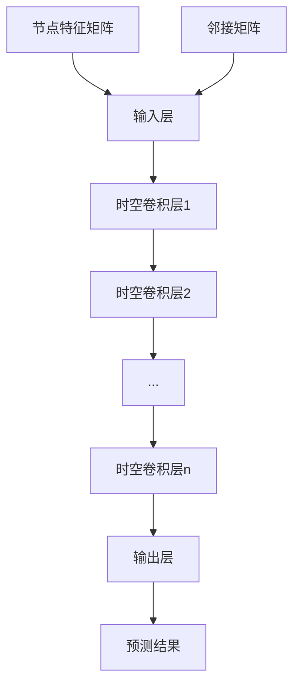

# 因果推理中时空图卷积网络的创新应用研究

> 关键词：因果推理、时空图卷积网络、图结构数据、深度学习、时空信息处理

> 摘要：本文聚焦于因果推理中时空图卷积网络的创新应用。首先介绍了研究的背景和目的，旨在解决时空图结构数据中的因果关系挖掘问题。接着阐述了时空图卷积网络的核心概念与联系，包括其原理和架构。详细讲解了核心算法原理及具体操作步骤，并用Python代码进行了说明。通过数学模型和公式对其进行深入剖析，并举例说明。在项目实战部分，给出了代码实际案例及详细解释。探讨了该技术的实际应用场景，推荐了相关的工具和资源。最后总结了未来发展趋势与挑战，并提供了常见问题解答和扩展阅读参考资料，全面展现了时空图卷积网络在因果推理领域的重要价值和应用潜力。

## 1. 背景介绍 
### 1.1 目的和范围
因果推理旨在揭示变量之间的因果关系，在众多领域如医疗、交通、金融等都具有重要意义。然而，传统的因果推理方法在处理时空图结构数据时面临诸多挑战，例如难以捕捉数据中的复杂时空依赖关系和图结构信息。时空图卷积网络作为一种新兴的深度学习模型，能够有效融合时空信息和图结构信息，为因果推理提供了新的思路和方法。本研究的目的在于探索时空图卷积网络在因果推理中的创新应用，提高因果推理的准确性和效率，解决传统方法在处理时空图数据时的局限性。研究范围涵盖了时空图卷积网络的原理、算法、应用场景等多个方面，通过理论分析、实验验证和实际案例应用，全面深入地研究其在因果推理中的应用。

### 1.2 预期读者
本文预期读者包括计算机科学、统计学、机器学习等领域的研究人员和学者，他们对因果推理和深度学习技术感兴趣，希望深入了解时空图卷积网络在因果推理中的应用。同时，也适合从事相关领域开发的工程师和技术人员，他们可以从本文中获取实际应用的指导和参考。此外，对新兴技术有好奇心的学生和爱好者也能通过本文初步了解因果推理和时空图卷积网络的相关知识。

### 1.3 文档结构概述
本文共分为十个部分。第一部分背景介绍，阐述了研究的目的、范围、预期读者和文档结构概述，并对相关术语进行了定义和解释。第二部分介绍核心概念与联系，包括时空图卷积网络的原理和架构，并用文本示意图和Mermaid流程图进行说明。第三部分详细讲解核心算法原理及具体操作步骤，使用Python源代码进行阐述。第四部分给出数学模型和公式，并进行详细讲解和举例说明。第五部分是项目实战，包括开发环境搭建、源代码详细实现和代码解读。第六部分探讨实际应用场景。第七部分推荐相关的工具和资源，包括学习资源、开发工具框架和相关论文著作。第八部分总结未来发展趋势与挑战。第九部分是附录，提供常见问题与解答。第十部分给出扩展阅读和参考资料。

### 1.4 术语表
#### 1.4.1 核心术语定义
- **因果推理（Causal Inference）**：是指从数据中推断变量之间因果关系的过程，旨在回答“如果改变某个变量，其他变量会如何变化”的问题。
- **时空图卷积网络（Spatio - Temporal Graph Convolutional Network, STGCN）**：是一种结合了图卷积网络（GCN）和时间序列分析的深度学习模型，用于处理具有时空特性的图结构数据。
- **图结构数据（Graph - structured Data）**：由节点和边组成的数据结构，节点表示实体，边表示实体之间的关系。
- **图卷积网络（Graph Convolutional Network, GCN）**：是一种用于处理图结构数据的神经网络，通过聚合节点的邻居信息来更新节点的特征表示。
- **时间序列（Time Series）**：是指按照时间顺序排列的一组数据点，用于描述某个变量随时间的变化情况。

#### 1.4.2 相关概念解释
- **时空信息**：是指数据中包含的时间和空间维度的信息。在时空图结构数据中，空间信息通过图的节点和边来表示，时间信息通过时间序列来表示。
- **因果关系**：是指一个事件（原因）的发生导致另一个事件（结果）的发生。因果关系具有方向性，与相关性不同，相关性只表示两个变量之间的关联程度，而不涉及因果方向。
- **深度学习**：是一种基于人工神经网络的机器学习方法，通过构建多层神经网络来学习数据的复杂特征表示。

#### 1.4.3 缩略词列表
- **STGCN**：Spatio - Temporal Graph Convolutional Network（时空图卷积网络）
- **GCN**：Graph Convolutional Network（图卷积网络）
- **CNN**：Convolutional Neural Network（卷积神经网络）
- **RNN**：Recurrent Neural Network（循环神经网络）
- **LSTM**：Long Short - Term Memory（长短期记忆网络）

## 2. 核心概念与联系 
时空图卷积网络（STGCN）是一种专门用于处理时空图结构数据的深度学习模型。它结合了图卷积网络（GCN）和时间序列分析的思想，能够有效地捕捉数据中的时空依赖关系和图结构信息。

### 核心概念原理
#### 图卷积网络（GCN）原理
图卷积网络的核心思想是通过聚合节点的邻居信息来更新节点的特征表示。给定一个图 $G=(V, E)$，其中 $V$ 是节点集合，$E$ 是边集合。每个节点 $v_i$ 都有一个特征向量 $x_i$。图卷积层的输入是节点的特征矩阵 $X\in\mathbb{R}^{N\times D}$，其中 $N$ 是节点数量，$D$ 是特征维度。图卷积层的输出是更新后的节点特征矩阵 $H\in\mathbb{R}^{N\times F}$，其中 $F$ 是输出特征维度。图卷积操作可以表示为：

$$H = \sigma(\tilde{D}^{-\frac{1}{2}}\tilde{A}\tilde{D}^{-\frac{1}{2}}XW)$$

其中，$\tilde{A}=A + I$ 是邻接矩阵 $A$ 加上自环的矩阵，$I$ 是单位矩阵；$\tilde{D}$ 是 $\tilde{A}$ 的度矩阵；$W\in\mathbb{R}^{D\times F}$ 是可学习的权重矩阵；$\sigma$ 是激活函数，如ReLU函数。

#### 时间序列分析与时空信息处理
时间序列分析是研究时间序列数据的统计特性和变化规律的方法。在时空图卷积网络中，时间序列信息通过循环神经网络（RNN）或其变体如长短期记忆网络（LSTM）来处理。LSTM能够有效地处理长序列数据中的长期依赖关系，通过门控机制来控制信息的流动。

#### 时空图卷积网络（STGCN）原理
时空图卷积网络将图卷积和时间序列分析相结合，通过交替进行空间卷积和时间卷积来捕捉时空信息。在空间维度上，使用图卷积网络聚合节点的邻居信息；在时间维度上，使用LSTM或其他时间序列模型处理时间序列数据。

### 架构的文本示意图
时空图卷积网络的架构主要由输入层、时空卷积层和输出层组成。输入层接收时空图结构数据，包括节点的特征矩阵和邻接矩阵。时空卷积层由多个时空卷积块组成，每个时空卷积块包含一个空间卷积层和一个时间卷积层。空间卷积层用于聚合节点的邻居信息，时间卷积层用于处理时间序列数据。输出层根据具体任务输出预测结果，如节点的标签、未来的时间序列值等。

### Mermaid 流程图


## 3. 核心算法原理 & 具体操作步骤 
### 核心算法原理
时空图卷积网络的核心算法主要包括空间卷积和时间卷积两个部分。

#### 空间卷积
空间卷积使用图卷积网络（GCN）来聚合节点的邻居信息。具体步骤如下：
1. 计算邻接矩阵 $A$ 加上自环的矩阵 $\tilde{A}=A + I$。
2. 计算 $\tilde{A}$ 的度矩阵 $\tilde{D}$。
3. 对 $\tilde{D}$ 和 $\tilde{A}$ 进行归一化处理，得到 $\tilde{D}^{-\frac{1}{2}}\tilde{A}\tilde{D}^{-\frac{1}{2}}$。
4. 将输入的节点特征矩阵 $X$ 与可学习的权重矩阵 $W$ 相乘，再与归一化后的邻接矩阵相乘，最后通过激活函数 $\sigma$ 得到更新后的节点特征矩阵 $H$。

#### 时间卷积
时间卷积使用LSTM或其他时间序列模型来处理时间序列数据。具体步骤如下：
1. 将空间卷积得到的节点特征矩阵按时间维度展开，得到一系列的时间步长的特征矩阵。
2. 将每个时间步长的特征矩阵输入到LSTM中，LSTM通过门控机制来控制信息的流动，输出每个时间步长的隐藏状态。
3. 将LSTM的输出作为时间卷积的结果。

### 具体操作步骤
以下是使用Python和PyTorch实现时空图卷积网络的具体操作步骤：

```python
import torch
import torch.nn as nn
import torch.nn.functional as F

# 定义图卷积层
class GraphConvolution(nn.Module):
    def __init__(self, in_features, out_features, bias=True):
        super(GraphConvolution, self).__init__()
        self.in_features = in_features
        self.out_features = out_features
        self.weight = nn.Parameter(torch.FloatTensor(in_features, out_features))
        if bias:
            self.bias = nn.Parameter(torch.FloatTensor(out_features))
        else:
            self.register_parameter('bias', None)
        self.reset_parameters()

    def reset_parameters(self):
        nn.init.xavier_uniform_(self.weight)
        if self.bias is not None:
            nn.init.zeros_(self.bias)

    def forward(self, input, adj):
        support = torch.mm(input, self.weight)
        output = torch.spmm(adj, support)
        if self.bias is not None:
            return output + self.bias
        else:
            return output

# 定义LSTM层
class LSTM(nn.Module):
    def __init__(self, input_size, hidden_size, num_layers, output_size):
        super(LSTM, self).__init__()
        self.hidden_size = hidden_size
        self.num_layers = num_layers
        self.lstm = nn.LSTM(input_size, hidden_size, num_layers, batch_first=True)
        self.fc = nn.Linear(hidden_size, output_size)

    def forward(self, x):
        h0 = torch.zeros(self.num_layers, x.size(0), self.hidden_size).to(x.device)
        c0 = torch.zeros(self.num_layers, x.size(0), self.hidden_size).to(x.device)
        out, _ = self.lstm(x, (h0, c0))
        out = self.fc(out[:, -1, :])
        return out

# 定义时空图卷积网络
class STGCN(nn.Module):
    def __init__(self, in_features, hidden_features, out_features, num_layers, lstm_hidden_size, lstm_num_layers, lstm_output_size):
        super(STGCN, self).__init__()
        self.gc1 = GraphConvolution(in_features, hidden_features)
        self.gc2 = GraphConvolution(hidden_features, out_features)
        self.lstm = LSTM(out_features, lstm_hidden_size, lstm_num_layers, lstm_output_size)

    def forward(self, x, adj):
        x = F.relu(self.gc1(x, adj))
        x = self.gc2(x, adj)
        # 假设输入的x是三维张量 (batch_size, num_nodes, num_features)
        x = x.unsqueeze(0)  # 添加时间维度
        x = self.lstm(x)
        return x

# 示例使用
in_features = 10
hidden_features = 20
out_features = 30
num_layers = 2
lstm_hidden_size = 40
lstm_num_layers = 1
lstm_output_size = 1

model = STGCN(in_features, hidden_features, out_features, num_layers, lstm_hidden_size, lstm_num_layers, lstm_output_size)

# 生成示例数据
num_nodes = 5
x = torch.randn(num_nodes, in_features)
adj = torch.randn(num_nodes, num_nodes)
adj = (adj > 0).float()  # 生成邻接矩阵

output = model(x, adj)
print(output)
```

### 代码解释
1. **GraphConvolution类**：定义了图卷积层，包括权重矩阵和偏置的初始化，以及前向传播函数。
2. **LSTM类**：定义了LSTM层，包括LSTM单元和全连接层，用于处理时间序列数据。
3. **STGCN类**：定义了时空图卷积网络，包括两个图卷积层和一个LSTM层。
4. **示例使用**：生成示例数据，包括节点特征矩阵和邻接矩阵，将数据输入到模型中进行前向传播，输出预测结果。

## 4. 数学模型和公式 & 详细讲解 & 举例说明 
### 数学模型和公式
#### 图卷积网络（GCN）
图卷积网络的数学模型可以表示为：

$$H^{(l + 1)} = \sigma(\tilde{D}^{-\frac{1}{2}}\tilde{A}\tilde{D}^{-\frac{1}{2}}H^{(l)}W^{(l)})$$

其中，$H^{(l)}$ 是第 $l$ 层的节点特征矩阵，$W^{(l)}$ 是第 $l$ 层的可学习权重矩阵，$\tilde{A}=A + I$ 是邻接矩阵 $A$ 加上自环的矩阵，$\tilde{D}$ 是 $\tilde{A}$ 的度矩阵，$\sigma$ 是激活函数。

#### 长短期记忆网络（LSTM）
LSTM的数学模型可以表示为：

$$i_t = \sigma(W_{ii}x_t + W_{hi}h_{t - 1}+b_{ii}+b_{hi})$$
$$f_t = \sigma(W_{if}x_t + W_{hf}h_{t - 1}+b_{if}+b_{hf})$$
$$o_t = \sigma(W_{io}x_t + W_{ho}h_{t - 1}+b_{io}+b_{ho})$$
$$\tilde{C}_t=\tanh(W_{ic}x_t + W_{hc}h_{t - 1}+b_{ic}+b_{hc})$$
$$C_t = f_t\odot C_{t - 1}+i_t\odot\tilde{C}_t$$
$$h_t = o_t\odot\tanh(C_t)$$

其中，$i_t$ 是输入门，$f_t$ 是遗忘门，$o_t$ 是输出门，$\tilde{C}_t$ 是候选细胞状态，$C_t$ 是细胞状态，$h_t$ 是隐藏状态，$x_t$ 是输入，$W$ 是权重矩阵，$b$ 是偏置，$\sigma$ 是Sigmoid函数，$\tanh$ 是双曲正切函数，$\odot$ 是逐元素相乘。

#### 时空图卷积网络（STGCN）
时空图卷积网络的数学模型是图卷积和LSTM的结合。假设输入的时空图结构数据为 $X\in\mathbb{R}^{T\times N\times D}$，其中 $T$ 是时间步长，$N$ 是节点数量，$D$ 是特征维度。首先进行空间卷积：

$$X_{s}^{(l + 1)} = \sigma(\tilde{D}^{-\frac{1}{2}}\tilde{A}\tilde{D}^{-\frac{1}{2}}X_{s}^{(l)}W_{s}^{(l)})$$

然后进行时间卷积：

$$X_{t}^{(l + 1)} = LSTM(X_{s}^{(l + 1)})$$

### 详细讲解
#### 图卷积网络（GCN）
图卷积网络的核心思想是通过聚合节点的邻居信息来更新节点的特征表示。邻接矩阵 $A$ 表示节点之间的连接关系，加上自环的矩阵 $\tilde{A}$ 确保每个节点都能聚合自身的信息。度矩阵 $\tilde{D}$ 用于对邻接矩阵进行归一化处理，使得不同节点的邻居信息具有相同的权重。可学习的权重矩阵 $W$ 用于调整不同特征的重要性，激活函数 $\sigma$ 引入非线性，增强模型的表达能力。

#### 长短期记忆网络（LSTM）
LSTM通过门控机制来控制信息的流动，解决了传统RNN中的梯度消失和梯度爆炸问题。输入门 $i_t$ 决定了当前输入 $x_t$ 中有多少信息可以进入细胞状态 $C_t$；遗忘门 $f_t$ 决定了上一时刻的细胞状态 $C_{t - 1}$ 中有多少信息需要被遗忘；输出门 $o_t$ 决定了当前细胞状态 $C_t$ 中有多少信息可以输出到隐藏状态 $h_t$。候选细胞状态 $\tilde{C}_t$ 是根据当前输入 $x_t$ 和上一时刻的隐藏状态 $h_{t - 1}$ 计算得到的。

#### 时空图卷积网络（STGCN）
时空图卷积网络将图卷积和LSTM相结合，通过交替进行空间卷积和时间卷积来捕捉时空信息。空间卷积用于聚合节点的邻居信息，时间卷积用于处理时间序列数据。通过这种方式，STGCN能够有效地捕捉时空图结构数据中的复杂时空依赖关系。

### 举例说明
假设我们有一个简单的时空图结构数据，包含3个节点，每个节点有2个特征，时间步长为2。节点的特征矩阵 $X$ 为：

$$X=\begin{bmatrix}
\begin{bmatrix}
1 & 2\\
3 & 4\\
5 & 6
\end{bmatrix}\\
\begin{bmatrix}
7 & 8\\
9 & 10\\
11 & 12
\end{bmatrix}
\end{bmatrix}$$

邻接矩阵 $A$ 为：

$$A=\begin{bmatrix}
0 & 1 & 0\\
1 & 0 & 1\\
0 & 1 & 0
\end{bmatrix}$$

首先进行空间卷积，计算 $\tilde{A}=A + I$ 和 $\tilde{D}$，然后根据图卷积公式更新节点的特征矩阵。接着将更新后的节点特征矩阵按时间维度展开，输入到LSTM中进行时间卷积，得到最终的输出。

## 5. 项目实战：代码实际案例和详细解释说明 
### 5.1  开发环境搭建
#### 操作系统
本项目可以在Windows、Linux或Mac OS等操作系统上进行开发，建议使用Linux系统，如Ubuntu 18.04或更高版本。

#### 编程语言和深度学习框架
- **Python**：建议使用Python 3.7或更高版本。
- **PyTorch**：是一个开源的深度学习框架，提供了丰富的神经网络模块和优化算法。可以通过以下命令安装PyTorch：
```sh
pip install torch torchvision
```

#### 其他依赖库
- **NumPy**：用于数值计算和数组操作。
```sh
pip install numpy
```
- **Matplotlib**：用于数据可视化。
```sh
pip install matplotlib
```

### 5.2  源代码详细实现和代码解读
以下是一个完整的时空图卷积网络在因果推理任务中的代码示例，假设我们要预测某个节点在未来时刻的状态。

```python
import torch
import torch.nn as nn
import torch.optim as optim
import numpy as np
import matplotlib.pyplot as plt

# 定义图卷积层
class GraphConvolution(nn.Module):
    def __init__(self, in_features, out_features, bias=True):
        super(GraphConvolution, self).__init__()
        self.in_features = in_features
        self.out_features = out_features
        self.weight = nn.Parameter(torch.FloatTensor(in_features, out_features))
        if bias:
            self.bias = nn.Parameter(torch.FloatTensor(out_features))
        else:
            self.register_parameter('bias', None)
        self.reset_parameters()

    def reset_parameters(self):
        nn.init.xavier_uniform_(self.weight)
        if self.bias is not None:
            nn.init.zeros_(self.bias)

    def forward(self, input, adj):
        support = torch.mm(input, self.weight)
        output = torch.spmm(adj, support)
        if self.bias is not None:
            return output + self.bias
        else:
            return output

# 定义LSTM层
class LSTM(nn.Module):
    def __init__(self, input_size, hidden_size, num_layers, output_size):
        super(LSTM, self).__init__()
        self.hidden_size = hidden_size
        self.num_layers = num_layers
        self.lstm = nn.LSTM(input_size, hidden_size, num_layers, batch_first=True)
        self.fc = nn.Linear(hidden_size, output_size)

    def forward(self, x):
        h0 = torch.zeros(self.num_layers, x.size(0), self.hidden_size).to(x.device)
        c0 = torch.zeros(self.num_layers, x.size(0), self.hidden_size).to(x.device)
        out, _ = self.lstm(x, (h0, c0))
        out = self.fc(out[:, -1, :])
        return out

# 定义时空图卷积网络
class STGCN(nn.Module):
    def __init__(self, in_features, hidden_features, out_features, num_layers, lstm_hidden_size, lstm_num_layers, lstm_output_size):
        super(STGCN, self).__init__()
        self.gc1 = GraphConvolution(in_features, hidden_features)
        self.gc2 = GraphConvolution(hidden_features, out_features)
        self.lstm = LSTM(out_features, lstm_hidden_size, lstm_num_layers, lstm_output_size)

    def forward(self, x, adj):
        x = F.relu(self.gc1(x, adj))
        x = self.gc2(x, adj)
        x = x.unsqueeze(0)  # 添加时间维度
        x = self.lstm(x)
        return x

# 生成示例数据
num_nodes = 5
in_features = 10
out_features = 1
time_steps = 10

# 随机生成节点特征矩阵
X = torch.randn(time_steps, num_nodes, in_features)

# 随机生成邻接矩阵
adj = torch.randn(num_nodes, num_nodes)
adj = (adj > 0).float()  # 生成邻接矩阵

# 生成标签
y = torch.randn(time_steps, out_features)

# 初始化模型
model = STGCN(in_features, 20, 30, 2, 40, 1, out_features)

# 定义损失函数和优化器
criterion = nn.MSELoss()
optimizer = optim.Adam(model.parameters(), lr=0.01)

# 训练模型
num_epochs = 100
losses = []
for epoch in range(num_epochs):
    total_loss = 0
    for t in range(time_steps - 1):
        optimizer.zero_grad()
        input_x = X[t]
        target_y = y[t + 1]
        output = model(input_x, adj)
        loss = criterion(output, target_y)
        loss.backward()
        optimizer.step()
        total_loss += loss.item()
    average_loss = total_loss / (time_steps - 1)
    losses.append(average_loss)
    if (epoch + 1) % 10 == 0:
        print(f'Epoch [{epoch + 1}/{num_epochs}], Loss: {average_loss:.4f}')

# 绘制损失曲线
plt.plot(losses)
plt.xlabel('Epoch')
plt.ylabel('Loss')
plt.title('Training Loss')
plt.show()
```

### 5.3  代码解读与分析
#### 数据生成
- `X`：随机生成的节点特征矩阵，形状为 `(time_steps, num_nodes, in_features)`。
- `adj`：随机生成的邻接矩阵，形状为 `(num_nodes, num_nodes)`。
- `y`：随机生成的标签，形状为 `(time_steps, out_features)`。

#### 模型定义
- `GraphConvolution` 类：定义了图卷积层，用于聚合节点的邻居信息。
- `LSTM` 类：定义了LSTM层，用于处理时间序列数据。
- `STGCN` 类：定义了时空图卷积网络，结合了图卷积和LSTM。

#### 训练过程
- 定义损失函数 `criterion` 为均方误差损失（MSE）。
- 定义优化器 `optimizer` 为Adam优化器。
- 进行 `num_epochs` 轮训练，每一轮遍历所有时间步长，计算损失并进行反向传播和参数更新。

#### 损失曲线绘制
- 使用 `matplotlib` 库绘制训练损失曲线，直观地观察模型的训练过程。

## 6. 实际应用场景 
### 交通流量预测
在交通领域，交通流量数据具有明显的时空特性。不同路段的交通流量之间存在空间上的依赖关系，同一路段的交通流量在不同时间点也存在时间上的依赖关系。时空图卷积网络可以用于构建交通流量预测模型，通过捕捉交通网络中不同路段之间的空间关系和时间序列数据中的时间依赖关系，准确预测未来的交通流量，为交通管理和规划提供决策支持。

### 疾病传播预测
在公共卫生领域，疾病传播数据可以用时空图结构来表示。不同地区之间的人员流动和接触关系构成了图的结构，每个地区的疾病感染人数随时间的变化构成了时间序列数据。时空图卷积网络可以用于预测疾病的传播趋势，通过分析不同地区之间的空间联系和疾病传播的时间动态，提前采取防控措施，减少疾病的传播范围和影响。

### 能源消耗预测
在能源领域，能源消耗数据具有时空特性。不同地区的能源消耗之间存在空间上的关联，同一地区的能源消耗在不同时间点也存在时间上的变化。时空图卷积网络可以用于构建能源消耗预测模型，通过分析能源网络中不同节点之间的空间关系和能源消耗的时间序列数据，准确预测未来的能源消耗，为能源管理和调度提供依据。

### 社交网络分析
在社交网络中，用户之间的关系构成了图的结构，用户的行为和活动随时间的变化构成了时间序列数据。时空图卷积网络可以用于分析社交网络中的信息传播、用户行为预测等问题，通过捕捉用户之间的空间关系和时间动态，深入理解社交网络的运行机制。

## 7. 工具和资源推荐
### 7.1 学习资源推荐
#### 7.1.1 书籍推荐
- 《深度学习》（Deep Learning）：由Ian Goodfellow、Yoshua Bengio和Aaron Courville合著，是深度学习领域的经典教材，涵盖了深度学习的基本概念、算法和应用。
- 《图神经网络：基础、前沿与应用》：介绍了图神经网络的基本原理、算法和应用，对时空图卷积网络的学习有很大的帮助。
- 《时间序列分析与预测》：详细介绍了时间序列分析的方法和技术，对于理解时空图卷积网络中的时间序列处理部分有重要的参考价值。

#### 7.1.2 在线课程
- Coursera上的“深度学习专项课程”（Deep Learning Specialization）：由Andrew Ng教授授课，全面介绍了深度学习的各个方面，包括神经网络、卷积神经网络、循环神经网络等。
- edX上的“图机器学习”（Graph Machine Learning）：介绍了图机器学习的基本概念、算法和应用，对时空图卷积网络的学习有一定的指导作用。
- 哔哩哔哩上的一些深度学习和图神经网络的教程，如“李沐的深度学习课程”，讲解生动易懂，适合初学者学习。

#### 7.1.3 技术博客和网站
- Medium：是一个技术博客平台，上面有很多关于深度学习、图神经网络和因果推理的文章，可以及时了解最新的研究成果和技术动态。
- arXiv：是一个预印本平台，提供了大量的学术论文，包括时空图卷积网络和因果推理领域的最新研究成果。
- 机器之心：是一个专注于人工智能领域的媒体平台，提供了丰富的技术文章、研究报告和行业资讯。

### 7.2 开发工具框架推荐
#### 7.2.1 IDE和编辑器
- PyCharm：是一款专门为Python开发设计的集成开发环境（IDE），提供了丰富的代码编辑、调试和项目管理功能。
- Jupyter Notebook：是一个交互式的开发环境，适合进行数据探索、模型训练和结果展示，非常方便进行深度学习模型的开发和实验。
- Visual Studio Code：是一个轻量级的代码编辑器，支持多种编程语言和插件扩展，具有丰富的代码编辑和调试功能。

#### 7.2.2 调试和性能分析工具
- PyTorch Profiler：是PyTorch提供的性能分析工具，可以帮助开发者分析模型的性能瓶颈，优化模型的运行效率。
- TensorBoard：是TensorFlow提供的可视化工具，也可以与PyTorch结合使用，用于可视化模型的训练过程、损失曲线、模型结构等信息。
- cProfile：是Python标准库中的性能分析工具，可以帮助开发者分析代码的运行时间和函数调用关系，找出性能瓶颈。

#### 7.2.3 相关框架和库
- PyTorch Geometric：是一个基于PyTorch的图神经网络库，提供了丰富的图神经网络模块和数据集，方便开发者进行图神经网络的开发和实验。
- DGL（Deep Graph Library）：是一个开源的图神经网络框架，支持多种深度学习框架，提供了高效的图神经网络实现和分布式训练功能。
- NetworkX：是一个用于创建、操作和研究复杂网络的Python库，可以用于图数据的处理和分析。

### 7.3 相关论文著作推荐
#### 7.3.1 经典论文
- “Semi - Supervised Classification with Graph Convolutional Networks”：提出了图卷积网络（GCN）的基本思想和算法，是图神经网络领域的经典论文。
- “Long Short - Term Memory”：介绍了长短期记忆网络（LSTM）的原理和算法，解决了传统RNN中的梯度消失和梯度爆炸问题。
- “Spatio - Temporal Graph Convolutional Networks: A Deep Learning Framework for Traffic Forecasting”：提出了时空图卷积网络（STGCN）的基本框架和算法，用于交通流量预测。

#### 7.3.2 最新研究成果
- 关注arXiv和各大人工智能学术会议（如NeurIPS、ICML、CVPR等）上的最新研究成果，了解时空图卷积网络和因果推理领域的最新进展。

#### 7.3.3 应用案例分析
- 一些关于时空图卷积网络在交通、医疗、能源等领域的应用案例分析论文，可以帮助开发者了解如何将时空图卷积网络应用到实际问题中。

## 8. 总结：未来发展趋势与挑战
### 未来发展趋势
#### 模型融合与创新
未来，时空图卷积网络可能会与其他深度学习模型（如生成对抗网络、强化学习等）进行融合，产生更加强大的模型。例如，将时空图卷积网络与生成对抗网络结合，可以生成更加真实的时空图结构数据；将时空图卷积网络与强化学习结合，可以实现更加智能的决策和控制。

#### 跨领域应用拓展
时空图卷积网络在交通、医疗、能源等领域已经取得了一定的应用成果，未来有望拓展到更多的领域，如金融、教育、环境等。例如，在金融领域，可以用于股票价格预测、风险评估等；在教育领域，可以用于学生学习行为分析、教学质量评估等。

#### 理论基础完善
随着研究的深入，时空图卷积网络的理论基础将不断完善。例如，对于图卷积网络的收敛性、泛化性等理论问题的研究将更加深入，为模型的设计和优化提供更加坚实的理论支持。

### 挑战
#### 数据获取与处理
时空图结构数据的获取和处理是一个挑战。一方面，数据的收集需要耗费大量的人力、物力和财力；另一方面，数据的质量和完整性也会影响模型的性能。此外，如何对大规模的时空图结构数据进行高效的存储和处理也是一个需要解决的问题。

#### 模型可解释性
深度学习模型的可解释性一直是一个难题，时空图卷积网络也不例外。由于模型的结构复杂，很难解释模型的决策过程和结果。在一些对可解释性要求较高的领域（如医疗、金融等），模型的可解释性问题将成为限制其应用的重要因素。

#### 计算资源需求
时空图卷积网络的训练和推理需要大量的计算资源，尤其是在处理大规模的时空图结构数据时。如何降低模型的计算复杂度，提高模型的运行效率，是一个需要解决的问题。

## 9. 附录：常见问题与解答
### 问题1：时空图卷积网络与传统的卷积神经网络（CNN）有什么区别？
解答：传统的卷积神经网络（CNN）主要用于处理规则的网格结构数据（如图像、音频等），通过卷积核在数据上进行滑动卷积来提取特征。而时空图卷积网络（STGCN）用于处理时空图结构数据，这种数据具有不规则的图结构和时间序列特性。STGCN通过图卷积网络（GCN）来处理图结构信息，通过时间序列模型（如LSTM）来处理时间信息，能够有效捕捉数据中的时空依赖关系。

### 问题2：如何选择合适的图卷积层和时间序列模型？
解答：选择合适的图卷积层和时间序列模型需要考虑数据的特点和任务的需求。对于图卷积层，可以根据图的规模和复杂度选择不同的图卷积算法，如GCN、GraphSAGE等。对于时间序列模型，如果数据中存在长期依赖关系，可以选择LSTM或GRU等能够处理长序列的模型；如果数据的时间序列特性比较简单，可以选择简单的RNN模型。

### 问题3：时空图卷积网络的训练过程中容易出现哪些问题？
解答：时空图卷积网络的训练过程中容易出现以下问题：
- **过拟合**：如果模型的复杂度过高，训练数据过少，容易出现过拟合现象。可以通过增加训练数据、使用正则化方法（如L1、L2正则化）、Dropout等方法来缓解过拟合问题。
- **梯度消失或梯度爆炸**：在使用RNN或LSTM等时间序列模型时，容易出现梯度消失或梯度爆炸问题。可以使用梯度裁剪、使用LSTM或GRU等具有门控机制的模型来解决这个问题。
- **训练不稳定**：由于时空图卷积网络的结构复杂，训练过程可能会不稳定。可以通过调整学习率、优化器等超参数来提高训练的稳定性。

### 问题4：如何评估时空图卷积网络的性能？
解答：评估时空图卷积网络的性能可以根据具体的任务选择合适的评估指标。例如，在回归任务中，可以使用均方误差（MSE）、均方根误差（RMSE）、平均绝对误差（MAE）等指标；在分类任务中，可以使用准确率、召回率、F1值等指标。此外，还可以通过可视化模型的预测结果和实际结果来直观地评估模型的性能。

## 10. 扩展阅读 & 参考资料
### 扩展阅读
- 《人工智能：现代方法》：全面介绍了人工智能的基本概念、算法和应用，对因果推理和深度学习等领域有深入的阐述。
- 《图论及其应用》：介绍了图论的基本概念、算法和应用，对于理解时空图卷积网络中的图结构数据有很大的帮助。
- 《时间序列分析：预测与控制》：详细介绍了时间序列分析的方法和技术，包括自回归模型、移动平均模型、ARIMA模型等，对于时空图卷积网络中的时间序列处理部分有重要的参考价值。

### 参考资料
- Goodfellow, I., Bengio, Y., & Courville, A. (2016). Deep Learning. MIT Press.
- Kipf, T. N., & Welling, M. (2016). Semi - Supervised Classification with Graph Convolutional Networks. arXiv preprint arXiv:1609.02907.
- Hochreiter, S., & Schmidhuber, J. (1997). Long Short - Term Memory. Neural computation, 9(8), 1735 - 1780.
- Yu, B., Yin, H., & Zhu, Z. (2017). Spatio - Temporal Graph Convolutional Networks: A Deep Learning Framework for Traffic Forecasting. arXiv preprint arXiv:1709.04875.