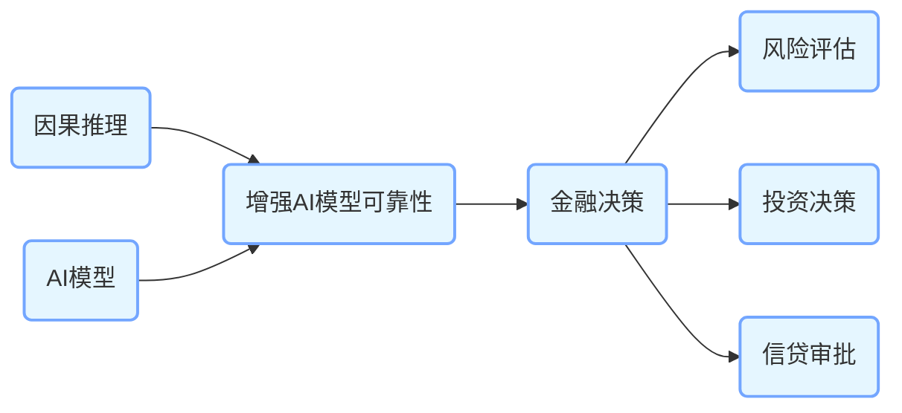

# 因果推理增强AI模型在金融决策中的可靠性

> 关键词：因果推理、AI模型、金融决策、可靠性、机器学习、因果效应、金融风险

> 摘要：本文聚焦于因果推理增强AI模型在金融决策中的可靠性这一核心主题。随着金融市场的日益复杂和数据量的急剧增长，传统AI模型在金融决策中面临诸多挑战，而因果推理的引入为解决这些问题提供了新的思路。文章深入探讨因果推理的核心概念、算法原理以及数学模型，通过项目实战展示如何运用因果推理增强AI模型，并分析其在金融决策中的实际应用场景。同时，推荐了相关的学习资源、开发工具和论文著作，最后对未来发展趋势与挑战进行总结，旨在为金融领域的研究者和从业者提供全面且深入的技术参考。

## 1. 背景介绍 
### 1.1 目的和范围
在当今金融领域，数据驱动的决策方式越来越受到重视。AI模型凭借其强大的数据分析和预测能力，在金融决策中得到了广泛应用，如风险评估、投资决策、信贷审批等。然而，传统AI模型大多基于相关性分析，缺乏对因果关系的理解，这可能导致决策的偏差和不可靠性。本文的目的在于探讨如何利用因果推理来增强AI模型在金融决策中的可靠性，通过深入研究因果推理的原理和方法，结合实际金融场景，为提高金融决策的准确性和稳定性提供理论支持和实践指导。

本文的范围涵盖因果推理的基本概念、相关算法原理、数学模型，以及在金融决策中的具体应用案例。同时，还将介绍相关的学习资源、开发工具和最新研究成果，为读者提供一个全面的技术知识体系。

### 1.2 预期读者
本文预期读者包括金融领域的从业者，如金融分析师、投资经理、风险管理人员等，他们希望通过引入因果推理技术来优化现有的AI模型，提高金融决策的质量。此外，计算机科学领域的研究者和开发者，特别是对机器学习、人工智能和因果推断感兴趣的人员，也可以从本文中获取关于因果推理在金融领域应用的最新技术和实践经验。同时，高校相关专业的学生，如金融工程、计算机科学、统计学等专业的学生，也可以将本文作为学习和研究的参考资料。

### 1.3 文档结构概述
本文将按照以下结构进行组织：
- 核心概念与联系：介绍因果推理和AI模型的基本概念，以及它们之间的联系和相互作用，通过文本示意图和Mermaid流程图进行直观展示。
- 核心算法原理 & 具体操作步骤：详细讲解因果推理的核心算法原理，并用Python源代码进行阐述，同时给出具体的操作步骤。
- 数学模型和公式 & 详细讲解 & 举例说明：介绍因果推理的数学模型和相关公式，并通过具体例子进行详细讲解。
- 项目实战：代码实际案例和详细解释说明：通过一个实际的金融决策项目，展示如何使用因果推理增强AI模型，包括开发环境搭建、源代码实现和代码解读。
- 实际应用场景：分析因果推理增强AI模型在金融决策中的实际应用场景，如风险评估、投资组合优化等。
- 工具和资源推荐：推荐相关的学习资源、开发工具框架和论文著作，帮助读者进一步深入学习和研究。
- 总结：未来发展趋势与挑战：对因果推理增强AI模型在金融决策中的未来发展趋势进行展望，并分析可能面临的挑战。
- 附录：常见问题与解答：解答读者在学习和实践过程中可能遇到的常见问题。
- 扩展阅读 & 参考资料：提供相关的扩展阅读材料和参考资料，方便读者进一步查阅。

### 1.4 术语表
#### 1.4.1 核心术语定义
- **因果推理（Causal Inference）**：是一种从数据中推断因果关系的方法，旨在确定某个变量的变化是否会导致另一个变量的变化，以及这种因果关系的强度和方向。
- **AI模型（Artificial Intelligence Model）**：是指基于人工智能技术构建的模型，用于处理和分析数据，进行预测、分类、决策等任务。
- **金融决策（Financial Decision）**：是指在金融领域中，为了实现特定的目标，如利润最大化、风险最小化等，对各种金融活动和资源进行选择和安排的过程。
- **因果效应（Causal Effect）**：是指某个原因变量对结果变量产生的影响程度，通常用统计指标来衡量。
- **反事实（Counterfactual）**：是指在假设某个原因变量取不同值的情况下，结果变量可能出现的情况，用于评估因果效应。

#### 1.4.2 相关概念解释
- **相关性（Correlation）**：是指两个变量之间的统计关联程度，它只表明变量之间的变化趋势是否一致，但不能确定因果关系。例如，冰淇淋销量和太阳镜销量可能呈现正相关，但它们之间并没有因果关系，而是都受到天气炎热这一共同因素的影响。
- **混淆变量（Confounder）**：是指同时影响原因变量和结果变量的变量，它会导致因果关系的估计出现偏差。例如，在研究吸烟与肺癌的关系时，年龄可能是一个混淆变量，因为年龄既影响吸烟的概率，又影响患肺癌的风险。
- **干预（Intervention）**：是指对原因变量进行人为的改变，以观察结果变量的变化，从而确定因果关系。例如，通过随机分配患者接受不同的治疗方案，来评估治疗方法对疾病康复的因果效应。

#### 1.4.3 缩略词列表
- **AI**：Artificial Intelligence（人工智能）
- **ML**：Machine Learning（机器学习）
- **DL**：Deep Learning（深度学习）
- **ATE**：Average Treatment Effect（平均处理效应）
- **CATE**：Conditional Average Treatment Effect（条件平均处理效应）

## 2. 核心概念与联系 
### 2.1 因果推理的基本概念
因果推理是一种旨在从数据中推断因果关系的方法。在实际应用中，我们常常面临的是观察数据，这些数据是在自然状态下收集的，没有对变量进行人为的干预。因果推理的目标就是从这些观察数据中识别出真正的因果关系，而不仅仅是相关性。

例如，在金融领域，我们可能观察到股票价格和某个宏观经济指标之间存在很强的相关性，但这并不意味着宏观经济指标的变化直接导致了股票价格的变化，可能存在其他因素同时影响这两个变量。因果推理可以帮助我们区分这些关系，确定哪些因素是真正的原因，哪些是结果。

### 2.2 AI模型的基本概念
AI模型是基于人工智能技术构建的模型，用于处理和分析数据，进行预测、分类、决策等任务。常见的AI模型包括机器学习模型（如决策树、支持向量机、神经网络等）和深度学习模型（如卷积神经网络、循环神经网络等）。

这些模型通过对大量数据的学习，提取数据中的模式和规律，从而对未知数据进行预测和决策。在金融领域，AI模型可以用于风险评估、投资组合优化、信贷审批等任务。

### 2.3 因果推理与AI模型的联系
传统的AI模型大多基于相关性分析，它们通过学习数据中的统计规律来进行预测和决策。然而，相关性并不等同于因果关系，基于相关性的模型可能会受到混淆变量的影响，导致决策的偏差和不可靠性。

因果推理的引入可以增强AI模型的可靠性。通过识别因果关系，AI模型可以更好地理解变量之间的内在机制，从而做出更准确的预测和决策。例如，在风险评估中，因果推理可以帮助我们确定哪些因素是真正导致风险的原因，从而更准确地评估风险水平。

### 2.4 文本示意图
```plaintext
因果推理与AI模型在金融决策中的关系

|---------------------|       |---------------------|
|      因果推理       |       |        AI模型       |
|---------------------|       |---------------------|
| - 识别因果关系      |       | - 数据学习          |
| - 处理混淆变量      |       | - 模式提取          |
| - 评估因果效应      |       | - 预测和决策        |
|---------------------|       |---------------------|
          |                          |
          |          相互作用        |
          |                          |
|------------------------------------------------|
|            金融决策（增强可靠性）            |
|------------------------------------------------|
```

### 2.5 Mermaid流程图


## 3. 核心算法原理 & 具体操作步骤 
### 3.1 潜在结果框架
潜在结果框架是因果推理中最常用的框架之一，它基于反事实的概念。假设我们有一个处理变量 $T$（例如，是否接受某种治疗）和一个结果变量 $Y$（例如，疾病是否康复）。对于每个个体 $i$，存在两个潜在结果：$Y_i(1)$ 表示个体 $i$ 接受处理时的结果，$Y_i(0)$ 表示个体 $i$ 不接受处理时的结果。

由于我们只能观察到个体的实际结果，即 $Y_i = T_iY_i(1)+(1 - T_i)Y_i(0)$，其中 $T_i$ 是个体 $i$ 的处理状态（$T_i = 1$ 表示接受处理，$T_i = 0$ 表示不接受处理），因此我们无法直接观察到反事实结果。因果推理的目标就是通过观察数据来估计因果效应。

### 3.2 平均处理效应（ATE）
平均处理效应是指在总体中，处理对结果的平均影响。其定义为：
$$ATE = E[Y(1)-Y(0)]$$
其中 $E[\cdot]$ 表示期望。

在实际应用中，我们可以通过随机对照试验（RCT）来估计ATE。在RCT中，个体被随机分配到处理组和对照组，这样处理变量 $T$ 与潜在结果 $Y(1)$ 和 $Y(0)$ 是独立的，我们可以通过比较处理组和对照组的平均结果来估计ATE。

### 3.3 倾向得分匹配（PSM）
当无法进行随机对照试验时，我们可以使用倾向得分匹配来估计因果效应。倾向得分是指个体接受处理的概率，定义为：
$$e(X)=P(T = 1|X)$$
其中 $X$ 是个体的协变量。

倾向得分匹配的基本思想是，找到处理组和对照组中倾向得分相近的个体进行匹配，然后比较匹配后的个体的结果，从而估计因果效应。

### 3.4 Python源代码实现
```python
import numpy as np
import pandas as pd
from sklearn.linear_model import LogisticRegression
from sklearn.preprocessing import StandardScaler

# 生成模拟数据
np.random.seed(42)
n = 1000
X = np.random.randn(n, 5)
T = np.random.binomial(1, 0.5, n)
Y = 2 * T + 0.5 * X[:, 0] + np.random.randn(n)

data = pd.DataFrame({'X1': X[:, 0], 'X2': X[:, 1], 'X3': X[:, 2], 'X4': X[:, 3], 'X5': X[:, 4], 'T': T, 'Y': Y})

# 计算倾向得分
scaler = StandardScaler()
X_scaled = scaler.fit_transform(data[['X1', 'X2', 'X3', 'X4', 'X5']])

logreg = LogisticRegression()
logreg.fit(X_scaled, data['T'])
data['propensity_score'] = logreg.predict_proba(X_scaled)[:, 1]

# 倾向得分匹配
def match(data, caliper=0.01):
    treated = data[data['T'] == 1]
    control = data[data['T'] == 0]

    matched_pairs = []
    for _, treated_row in treated.iterrows():
        control_rows = control.copy()
        control_rows['distance'] = np.abs(control_rows['propensity_score'] - treated_row['propensity_score'])
        closest_control = control_rows[control_rows['distance'] <= caliper].sort_values('distance').head(1)
        if not closest_control.empty:
            matched_pairs.append((treated_row.name, closest_control.index[0]))

    return matched_pairs

matched_pairs = match(data)

# 计算平均处理效应
treated_matched = data.loc[[pair[0] for pair in matched_pairs]]
control_matched = data.loc[[pair[1] for pair in matched_pairs]]

ate = np.mean(treated_matched['Y']) - np.mean(control_matched['Y'])
print(f"平均处理效应 (ATE): {ate}")
```

### 3.5 具体操作步骤
1. **数据准备**：收集包含处理变量、结果变量和协变量的数据，并进行清洗和预处理。
2. **计算倾向得分**：使用逻辑回归等方法计算每个个体的倾向得分。
3. **倾向得分匹配**：根据倾向得分找到处理组和对照组中相近的个体进行匹配。
4. **估计因果效应**：比较匹配后的处理组和对照组的平均结果，估计平均处理效应。

## 4. 数学模型和公式 & 详细讲解 & 举例说明 
### 4.1 潜在结果框架的数学模型
潜在结果框架基于以下假设：
- **稳定单位处理值假设（SUTVA）**：个体的潜在结果不受其他个体处理状态的影响，即每个个体的结果只取决于自身的处理状态。
- **可忽略性假设**：在给定协变量 $X$ 的条件下，处理变量 $T$ 与潜在结果 $Y(1)$ 和 $Y(0)$ 是独立的，即 $Y(1), Y(0) \perp T|X$。

在这些假设下，我们可以通过观察数据来估计因果效应。例如，平均处理效应可以表示为：
$$ATE = E[E[Y|T = 1, X]-E[Y|T = 0, X]]$$

### 4.2 倾向得分的数学原理
倾向得分的作用是平衡处理组和对照组的协变量分布。根据罗森鲍姆和鲁宾（Rosenbaum and Rubin, 1983）的定理，如果可忽略性假设成立，那么在给定倾向得分 $e(X)$ 的条件下，处理变量 $T$ 与潜在结果 $Y(1)$ 和 $Y(0)$ 也是独立的，即 $Y(1), Y(0) \perp T|e(X)$。

这意味着，我们可以通过倾向得分来控制协变量的影响，从而估计因果效应。

### 4.3 举例说明
假设我们要研究一种新的投资策略对投资回报率的影响。我们收集了1000个投资者的数据，其中500个投资者采用了新的投资策略（处理组），500个投资者采用了传统的投资策略（对照组）。我们还收集了每个投资者的一些协变量，如年龄、投资经验、风险偏好等。

首先，我们使用逻辑回归计算每个投资者的倾向得分，即采用新投资策略的概率。然后，我们根据倾向得分进行匹配，找到处理组和对照组中倾向得分相近的投资者。最后，我们比较匹配后的处理组和对照组的平均投资回报率，估计新投资策略对投资回报率的平均处理效应。

假设匹配后处理组的平均投资回报率为15%，对照组的平均投资回报率为10%，那么平均处理效应为：
$$ATE = 15\% - 10\% = 5\%$$
这意味着新的投资策略平均可以提高5%的投资回报率。

## 5. 项目实战：代码实际案例和详细解释说明 
### 5.1  开发环境搭建
#### 5.1.1 操作系统
可以选择Windows、Linux或macOS操作系统。本项目在Python环境下运行，对操作系统的兼容性较好。

#### 5.1.2 Python环境
建议使用Python 3.7及以上版本。可以通过Anaconda或Miniconda来管理Python环境，以下是安装步骤：
1. 下载并安装Anaconda或Miniconda：可以从官方网站（https://www.anaconda.com/products/individual 或 https://docs.conda.io/en/latest/miniconda.html）下载适合自己操作系统的安装包，并按照安装向导进行安装。
2. 创建虚拟环境：打开终端或命令提示符，输入以下命令创建一个名为 `causal_inference` 的虚拟环境：
```bash
conda create -n causal_inference python=3.8
```
3. 激活虚拟环境：
```bash
conda activate causal_inference
```

#### 5.1.3 安装必要的库
在激活的虚拟环境中，使用以下命令安装必要的库：
```bash
pip install numpy pandas scikit-learn
```

### 5.2  源代码详细实现和代码解读
```python
import numpy as np
import pandas as pd
from sklearn.linear_model import LogisticRegression
from sklearn.preprocessing import StandardScaler

# 生成模拟数据
np.random.seed(42)
n = 1000
# 生成5个协变量
X = np.random.randn(n, 5)
# 生成处理变量，以0.5的概率取值为1
T = np.random.binomial(1, 0.5, n)
# 生成结果变量，受处理变量和第一个协变量的影响，同时加入噪声
Y = 2 * T + 0.5 * X[:, 0] + np.random.randn(n)

# 将数据转换为DataFrame格式
data = pd.DataFrame({'X1': X[:, 0], 'X2': X[:, 1], 'X3': X[:, 2], 'X4': X[:, 3], 'X5': X[:, 4], 'T': T, 'Y': Y})

# 计算倾向得分
# 对协变量进行标准化处理
scaler = StandardScaler()
X_scaled = scaler.fit_transform(data[['X1', 'X2', 'X3', 'X4', 'X5']])

# 使用逻辑回归模型计算倾向得分
logreg = LogisticRegression()
logreg.fit(X_scaled, data['T'])
data['propensity_score'] = logreg.predict_proba(X_scaled)[:, 1]

# 倾向得分匹配
def match(data, caliper=0.01):
    # 分离处理组和对照组
    treated = data[data['T'] == 1]
    control = data[data['T'] == 0]

    matched_pairs = []
    for _, treated_row in treated.iterrows():
        control_rows = control.copy()
        # 计算处理组个体与对照组个体的倾向得分距离
        control_rows['distance'] = np.abs(control_rows['propensity_score'] - treated_row['propensity_score'])
        # 找到距离小于等于caliper的最近的对照组个体
        closest_control = control_rows[control_rows['distance'] <= caliper].sort_values('distance').head(1)
        if not closest_control.empty:
            # 记录匹配的个体对
            matched_pairs.append((treated_row.name, closest_control.index[0]))

    return matched_pairs

matched_pairs = match(data)

# 计算平均处理效应
treated_matched = data.loc[[pair[0] for pair in matched_pairs]]
control_matched = data.loc[[pair[1] for pair in matched_pairs]]

ate = np.mean(treated_matched['Y']) - np.mean(control_matched['Y'])
print(f"平均处理效应 (ATE): {ate}")
```

### 5.3  代码解读与分析
1. **数据生成**：使用 `numpy` 库生成模拟数据，包括5个协变量 `X`、处理变量 `T` 和结果变量 `Y`。结果变量 `Y` 受处理变量 `T` 和第一个协变量 `X[:, 0]` 的影响，同时加入了噪声。
2. **倾向得分计算**：使用 `sklearn` 库中的 `LogisticRegression` 模型计算每个个体的倾向得分。在计算之前，对协变量进行了标准化处理，以提高模型的性能。
3. **倾向得分匹配**：定义了一个 `match` 函数，用于进行倾向得分匹配。该函数遍历处理组的每个个体，找到与其倾向得分距离小于等于 `caliper` 的最近的对照组个体，并记录匹配的个体对。
4. **平均处理效应计算**：根据匹配的个体对，分离出处理组和对照组的匹配数据，然后计算它们的平均结果之差，得到平均处理效应。

通过这个项目实战，我们可以看到如何使用倾向得分匹配方法来估计因果效应，从而增强AI模型在金融决策中的可靠性。

## 6. 实际应用场景 
### 6.1 风险评估
在金融风险评估中，因果推理可以帮助我们确定哪些因素是真正导致风险的原因，而不仅仅是与风险相关的因素。例如，在信用风险评估中，传统的模型可能会发现借款人的收入和信用评分与违约风险相关，但因果推理可以进一步分析收入和信用评分对违约风险的因果影响，以及其他可能的混淆变量（如经济环境、行业竞争等）的作用。

通过引入因果推理，我们可以更准确地评估风险水平，制定更合理的风险控制策略。例如，银行可以根据因果关系调整贷款审批标准，对那些真正影响违约风险的因素进行重点关注。

### 6.2 投资组合优化
在投资组合优化中，因果推理可以帮助我们理解不同资产之间的因果关系，从而构建更有效的投资组合。例如，传统的投资组合优化模型通常基于资产之间的相关性来进行资产配置，但相关性并不等同于因果关系。因果推理可以帮助我们确定哪些资产的价格变化是由其他资产的价格变化引起的，哪些是由外部因素（如宏观经济指标、政策变化等）引起的。

通过考虑因果关系，我们可以更好地预测资产价格的变化，降低投资组合的风险，提高投资回报率。例如，投资者可以根据因果关系调整资产配置比例，减少对那些受其他资产影响较大的资产的投资。

### 6.3 信贷审批
在信贷审批中，因果推理可以帮助银行更准确地评估借款人的信用风险，提高信贷审批的准确性和效率。例如，银行可以使用因果推理分析借款人的各种特征（如收入、负债、信用记录等）与违约风险之间的因果关系，从而确定哪些特征是最重要的风险因素。

通过引入因果推理，银行可以优化信贷审批流程，减少不必要的审批环节，提高审批速度。同时，也可以降低信贷风险，减少不良贷款的发生。

### 6.4 金融市场预测
在金融市场预测中，因果推理可以帮助我们理解市场变化的内在机制，提高预测的准确性。例如，股票市场的价格变化受到多种因素的影响，包括宏观经济指标、公司财务状况、政策变化等。因果推理可以帮助我们确定这些因素之间的因果关系，从而更准确地预测股票价格的走势。

通过考虑因果关系，我们可以避免被虚假的相关性所误导，提高金融市场预测的可靠性。例如，分析师可以根据因果关系调整预测模型，对那些真正影响市场变化的因素进行重点分析。

## 7. 工具和资源推荐
### 7.1 学习资源推荐
#### 7.1.1 书籍推荐
- 《Causal Inference for Statistics, Social, and Biomedical Sciences: An Introduction》（《统计学、社会科学和生物医学科学中的因果推断：导论》）：这本书是因果推理领域的经典教材，系统地介绍了因果推理的基本概念、方法和应用。
- 《Mastering 'Metrics: The Path from Cause to Effect》（《精通计量：从原因到结果的探寻之旅》）：以通俗易懂的语言介绍了因果推断的方法和应用，适合初学者阅读。
- 《The Book of Why: The New Science of Cause and Effect》（《为什么：关于因果关系的新科学》）：由图灵奖获得者朱迪亚·珀尔（Judea Pearl）所著，从哲学和科学的角度探讨了因果关系的本质和因果推理的方法。

#### 7.1.2 在线课程
- Coursera上的“Causal Diagrams: Draw Your Assumptions Before Your Conclusions”：该课程由朱迪亚·珀尔（Judea Pearl）等专家授课，介绍了因果图的基本概念和应用。
- edX上的“Data Science for Social Good: Causal Inference”：该课程结合实际案例，介绍了因果推理在社会公益领域的应用。
- Udemy上的“Causal Inference in Python”：该课程使用Python语言介绍了因果推理的方法和实现。

#### 7.1.3 技术博客和网站
- Towards Data Science：这是一个专注于数据科学和机器学习的技术博客，上面有很多关于因果推理的文章和案例。
- Causal Inference Initiative：这是一个专注于因果推理研究的网站，提供了最新的研究成果和资源。
- The Society for Causal Inference：这是一个因果推理领域的学术组织，其网站上提供了相关的会议信息、研究论文和资源。

### 7.2 开发工具框架推荐
#### 7.2.1 IDE和编辑器
- PyCharm：是一款功能强大的Python集成开发环境，提供了代码编辑、调试、版本控制等功能，适合开发Python项目。
- Jupyter Notebook：是一个交互式的开发环境，支持Python、R等多种编程语言，适合进行数据探索和模型开发。
- Visual Studio Code：是一款轻量级的代码编辑器，支持多种编程语言和插件，适合快速开发和调试代码。

#### 7.2.2 调试和性能分析工具
- PDB：是Python自带的调试工具，可以帮助我们调试代码，查找问题。
- cProfile：是Python自带的性能分析工具，可以帮助我们分析代码的性能瓶颈。
- Py-Spy：是一个开源的性能分析工具，可以实时监控Python程序的性能。

#### 7.2.3 相关框架和库
- CausalML：是一个开源的Python库，提供了多种因果推理算法和工具，如倾向得分匹配、双重差分法等。
- EconML：是一个微软开源的Python库，专注于因果推理和经济计量学，提供了多种因果效应估计方法。
- DoWhy：是一个开源的Python库，提供了统一的因果推理接口，支持多种因果推理方法。

### 7.3 相关论文著作推荐
#### 7.3.1 经典论文
- Rosenbaum, P. R., & Rubin, D. B. (1983). The central role of the propensity score in observational studies for causal effects. Biometrika, 70(1), 41-55.：这篇论文提出了倾向得分的概念，并证明了其在因果推断中的重要作用。
- Pearl, J. (2009). Causality: Models, reasoning, and inference. Cambridge university press.：这本书是朱迪亚·珀尔（Judea Pearl）的经典著作，系统地介绍了因果推理的理论和方法。
- Angrist, J. D., & Pischke, J. -S. (2008). Mostly harmless econometrics: An empiricist's companion. Princeton university press.：这本书是计量经济学领域的经典教材，介绍了因果推断在经济学中的应用。

#### 7.3.2 最新研究成果
- Athey, S., & Imbens, G. W. (2016). Recursive partitioning for heterogeneous causal effects. Proceedings of the National Academy of Sciences, 113(27), 7353-7360.：这篇论文提出了一种基于递归划分的方法，用于估计异质因果效应。
- Chernozhukov, V., Chetverikov, D., Demirer, M., Duflo, E., Hansen, C., & Newey, W. (2018). Double/debiased machine learning for treatment and structural parameters. The Econometrics Journal, 21(1), C1-C68.：这篇论文提出了双重/去偏机器学习方法，用于估计因果效应。
- Kallus, N., & Zhou, A. (2018). Policy learning with observational data. arXiv preprint arXiv:1802.09026.：这篇论文研究了如何利用观察数据进行政策学习，以估计最优政策。

#### 7.3.3 应用案例分析
- Bergquist, P., & Gray, C. (2018). Causal inference in marketing: The promise of a new approach. Journal of Marketing Research, 55(6), 931-948.：这篇论文介绍了因果推理在市场营销中的应用案例。
- Gandhi, A., & Nayak, R. (2019). Causal inference in healthcare: A review. Journal of Biomedical Informatics, 96, 103222.：这篇论文对因果推理在医疗保健领域的应用进行了综述。
- Kuchler, T., & Stroebel, J. (2018). Can the market misprice assets? Evidence from a housing market experiment. The Quarterly Journal of Economics, 133(3), 1219-1270.：这篇论文通过住房市场实验，研究了市场资产定价的因果关系。

## 8. 总结：未来发展趋势与挑战
### 8.1 未来发展趋势
#### 8.1.1 与深度学习的融合
随着深度学习技术的不断发展，因果推理与深度学习的融合将成为未来的一个重要发展趋势。深度学习模型可以自动提取数据中的复杂特征，而因果推理可以帮助我们理解这些特征之间的因果关系，从而提高模型的可解释性和可靠性。例如，在金融领域，可以使用深度学习模型预测股票价格，然后使用因果推理分析影响股票价格的因素，从而更好地进行投资决策。

#### 8.1.2 多源数据的应用
未来，因果推理将更多地应用于多源数据，包括结构化数据、非结构化数据（如文本、图像、视频等）。通过整合多源数据，可以更全面地了解因果关系，提高因果推理的准确性和可靠性。例如，在金融风险评估中，可以结合财务报表数据、新闻文本数据和社交媒体数据，更准确地评估企业的信用风险。

#### 8.1.3 实时因果推理
随着金融市场的快速变化，实时因果推理将变得越来越重要。未来的因果推理模型将能够实时处理大量的数据，快速识别因果关系的变化，为金融决策提供及时的支持。例如，在高频交易中，实时因果推理可以帮助交易员快速分析市场变化的原因，做出及时的交易决策。

#### 8.1.4 因果强化学习
因果强化学习是因果推理与强化学习的结合，它可以帮助智能体更好地理解环境中的因果关系，从而做出更合理的决策。在金融领域，因果强化学习可以用于投资组合优化、风险管理等任务，提高金融决策的效率和准确性。

### 8.2 挑战
#### 8.2.1 数据质量和可用性
因果推理需要高质量的数据来估计因果效应，但在实际应用中，数据往往存在噪声、缺失值和偏差等问题，这会影响因果推理的准确性。此外，一些关键数据可能由于隐私、安全等原因无法获取，限制了因果推理的应用范围。

#### 8.2.2 因果关系的识别和验证
因果关系的识别和验证是因果推理中的关键问题，但在实际应用中，很难确定变量之间的真正因果关系。由于存在混淆变量、选择偏差等问题，可能会导致因果关系的估计出现偏差。此外，如何验证因果关系的有效性也是一个挑战。

#### 8.2.3 模型的可解释性和复杂性
虽然因果推理可以提高AI模型的可解释性，但一些复杂的因果推理模型可能仍然难以解释。此外，随着模型的复杂性增加，计算成本和训练时间也会相应增加，这会影响模型的实际应用。

#### 8.2.4 伦理和法律问题
因果推理的应用可能会涉及到伦理和法律问题，例如隐私保护、公平性等。在金融决策中，使用因果推理模型进行风险评估和信贷审批时，需要确保模型的公平性，避免对某些群体造成歧视。此外，如何保护数据的隐私和安全也是一个重要的问题。

## 9. 附录：常见问题与解答
### 9.1 因果推理与相关性分析有什么区别？
因果推理旨在确定变量之间的因果关系，即一个变量的变化是否会导致另一个变量的变化。而相关性分析只是衡量变量之间的统计关联程度，它不能确定因果关系。例如，两个变量可能呈现很强的相关性，但它们之间可能并没有因果关系，而是受到其他共同因素的影响。

### 9.2 倾向得分匹配的原理是什么？
倾向得分匹配的原理是通过计算个体接受处理的概率（倾向得分），然后找到处理组和对照组中倾向得分相近的个体进行匹配。在给定倾向得分的条件下，处理变量与潜在结果是独立的，因此可以通过比较匹配后的个体的结果来估计因果效应。

### 9.3 因果推理在金融决策中的应用有哪些局限性？
因果推理在金融决策中的应用存在一些局限性。首先，数据质量和可用性可能会影响因果推理的准确性。其次，因果关系的识别和验证是一个复杂的问题，可能会存在偏差。此外，一些复杂的因果推理模型可能难以解释，计算成本也较高。最后，因果推理的应用还可能涉及到伦理和法律问题。

### 9.4 如何选择合适的因果推理方法？
选择合适的因果推理方法需要考虑多个因素，包括数据类型、研究问题、假设条件等。例如，如果数据是通过随机对照试验收集的，可以使用简单的均值比较方法来估计因果效应。如果数据是观察数据，可能需要使用倾向得分匹配、双重差分法等方法。此外，还需要根据研究问题的特点选择合适的方法，例如，如果研究的是异质因果效应，可以使用基于机器学习的方法。

### 9.5 因果推理模型的可解释性如何提高？
提高因果推理模型的可解释性可以从多个方面入手。首先，可以选择简单的模型结构，避免使用过于复杂的模型。其次，可以使用可视化工具来展示因果关系，例如因果图。此外，还可以对模型的输出进行解释，例如计算特征的重要性、解释因果效应的含义等。

## 10. 扩展阅读 & 参考资料
### 10.1 扩展阅读
- Pearl, J., Glymour, M., & Jewell, N. P. (2016). Causal inference in statistics: A primer. John Wiley & Sons.：这本书是因果推理领域的入门书籍，介绍了因果推理的基本概念和方法。
- Imbens, G. W., & Rubin, D. B. (2015). Causal inference in statistics, social, and biomedical sciences. Cambridge University Press.：这本书系统地介绍了因果推理在统计学、社会科学和生物医学科学中的应用。
- Peters, J., Janzing, D., & Schölkopf, B. (2017). Elements of causal inference: Foundations and learning algorithms. The MIT Press.：这本书介绍了因果推理的理论基础和学习算法。

### 10.2 参考资料
- Rosenbaum, P. R. (2010). Design of observational studies. Springer.：这本书介绍了观察性研究的设计方法，包括因果推理的应用。
- Angrist, J. D., & Pischke, J. -S. (2014). Mastering'metrics: The path from cause to effect. Princeton University Press.：这本书以通俗易懂的语言介绍了因果推断的方法和应用。
- Rubin, D. B. (1974). Estimating causal effects of treatments in randomized and nonrandomized studies. Journal of Educational Psychology, 66(5), 688-701.：这篇论文提出了潜在结果框架，为因果推理奠定了基础。