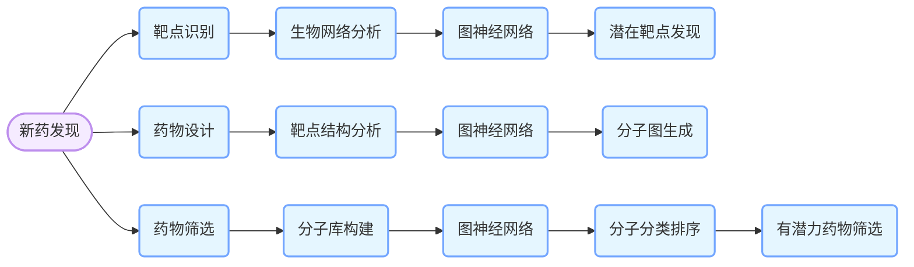

# 图神经网络在新药发现过程中的应用研究

> 关键词：图神经网络、新药发现、分子图、药物靶点预测、药物设计

> 摘要：新药发现是一个复杂且漫长的过程，需要耗费大量的时间和资源。图神经网络（Graph Neural Networks, GNN）作为一种强大的机器学习方法，在处理图结构数据方面具有独特优势。本文深入探讨了图神经网络在新药发现过程中的应用，从核心概念和原理出发，详细阐述了相关算法和数学模型，通过实际案例展示其在药物靶点预测、药物设计等方面的应用，分析了实际应用场景，并推荐了相关的工具和资源，最后总结了图神经网络在新药发现领域的未来发展趋势与挑战。

## 1. 背景介绍 
### 1.1 目的和范围
新药发现的传统方法面临着诸多挑战，如研发周期长、成本高、成功率低等。图神经网络能够有效地处理分子和生物网络等图结构数据，为新药发现提供了新的思路和方法。本文的目的是全面介绍图神经网络在新药发现过程中的应用，涵盖从基本概念到实际应用的各个方面，为相关研究人员和从业者提供系统的参考。

### 1.2 预期读者
本文预期读者包括生物信息学、药物化学、机器学习等领域的研究人员、研究生，以及从事新药研发的专业人士。对于对图神经网络和新药发现感兴趣的初学者，本文也提供了详细的基础知识和逐步分析，有助于他们快速了解该领域。

### 1.3 文档结构概述
本文首先介绍图神经网络和新药发现的相关背景知识，包括术语定义和概念解释。接着阐述图神经网络的核心概念和联系，通过示意图和流程图展示其架构。然后详细讲解核心算法原理和具体操作步骤，结合Python源代码进行说明。之后介绍相关的数学模型和公式，并举例说明。通过实际案例展示图神经网络在新药发现中的应用，包括开发环境搭建、源代码实现和代码解读。分析图神经网络在新药发现中的实际应用场景，推荐相关的学习资源、开发工具和论文著作。最后总结图神经网络在新药发现领域的未来发展趋势与挑战，并提供常见问题解答和扩展阅读参考资料。

### 1.4 术语表
#### 1.4.1 核心术语定义
- **图神经网络（Graph Neural Networks, GNN）**：一类专门用于处理图结构数据的神经网络模型，通过节点之间的消息传递来学习节点和图的表示。
- **新药发现（New Drug Discovery）**：从确定疾病靶点到开发出安全有效的药物的整个过程，包括靶点识别、药物设计、药物筛选等多个阶段。
- **分子图（Molecular Graph）**：将分子表示为图结构，其中原子作为节点，化学键作为边。
- **药物靶点（Drug Target）**：药物在体内作用的生物大分子，如蛋白质、核酸等。
- **药物设计（Drug Design）**：根据药物靶点的结构和功能信息，设计具有特定活性和性质的药物分子。

#### 1.4.2 相关概念解释
- **消息传递机制**：图神经网络中节点之间信息交换的方式，通过聚合相邻节点的特征来更新当前节点的表示。
- **图嵌入（Graph Embedding）**：将图结构数据映射到低维向量空间的过程，以便于机器学习算法处理。
- **深度学习（Deep Learning）**：一类基于神经网络的机器学习方法，通过多层神经网络自动学习数据的特征表示。

#### 1.4.3 缩略词列表
- **GNN**：Graph Neural Networks（图神经网络）
- **MLP**：Multilayer Perceptron（多层感知机）
- **CNN**：Convolutional Neural Network（卷积神经网络）
- **RNN**：Recurrent Neural Network（循环神经网络）

## 2. 核心概念与联系 
### 2.1 图神经网络的基本概念
图神经网络是一种用于处理图结构数据的神经网络模型。图是由节点（Vertex）和边（Edge）组成的数据结构，节点表示实体，边表示实体之间的关系。在新药发现中，分子可以表示为图，其中原子作为节点，化学键作为边；生物网络也可以表示为图，其中蛋白质、基因等作为节点，它们之间的相互作用作为边。

图神经网络的核心思想是通过节点之间的消息传递来学习节点和图的表示。具体来说，每个节点会聚合其相邻节点的特征信息，并更新自身的特征表示。经过多次消息传递，节点的特征表示会逐渐融合其邻居节点的信息，从而捕捉图的结构和语义信息。

### 2.2 图神经网络的架构
图神经网络的架构可以分为节点级、边级和图级三个层次。节点级的图神经网络主要用于学习节点的特征表示，边级的图神经网络用于学习边的特征表示，图级的图神经网络用于学习整个图的特征表示。

常见的图神经网络模型包括图卷积网络（Graph Convolutional Network, GCN）、图注意力网络（Graph Attention Network, GAT）、图自编码器（Graph Autoencoder）等。这些模型的核心都是消息传递机制，只是在消息聚合和特征更新的方式上有所不同。

### 2.3 图神经网络与新药发现的联系
在新药发现过程中，图神经网络可以用于多个方面。例如，在药物靶点预测中，可以将蛋白质和小分子药物表示为图，通过图神经网络学习它们的特征表示，预测药物与靶点之间的相互作用。在药物设计中，可以利用图神经网络生成具有特定活性和性质的分子图。在药物筛选中，可以使用图神经网络对大量的分子进行分类和排序，筛选出有潜力的药物分子。

### 2.4 文本示意图和Mermaid流程图
#### 2.4.1 文本示意图
图神经网络在新药发现中的应用可以用以下示意图表示：

新药发现过程包括靶点识别、药物设计、药物筛选等阶段。在每个阶段，图神经网络都可以发挥重要作用。在靶点识别阶段，通过对生物网络的图结构分析，图神经网络可以帮助发现潜在的药物靶点。在药物设计阶段，图神经网络可以根据靶点的结构和功能信息，生成具有特定活性的分子图。在药物筛选阶段，图神经网络可以对大量的分子进行分类和排序，筛选出有潜力的药物分子。

#### 2.4.2 Mermaid流程图


## 3. 核心算法原理 & 具体操作步骤 
### 3.1 图卷积网络（GCN）原理
图卷积网络（GCN）是一种常用的图神经网络模型，其核心思想是通过聚合相邻节点的特征信息来更新当前节点的表示。具体来说，GCN的第 $l$ 层到第 $l+1$ 层的节点特征更新公式如下：

$$H^{(l+1)} = \sigma(\tilde{D}^{-\frac{1}{2}}\tilde{A}\tilde{D}^{-\frac{1}{2}}H^{(l)}W^{(l)})$$

其中，$H^{(l)}$ 是第 $l$ 层的节点特征矩阵，$W^{(l)}$ 是第 $l$ 层的可学习权重矩阵，$\tilde{A} = A + I$ 是邻接矩阵 $A$ 加上自环的矩阵，$\tilde{D}$ 是 $\tilde{A}$ 的度矩阵，$\sigma$ 是激活函数。

### 3.2 图注意力网络（GAT）原理
图注意力网络（GAT）在消息传递过程中引入了注意力机制，允许节点在聚合相邻节点信息时对不同的邻居节点赋予不同的权重。具体来说，GAT的注意力系数计算如下：

$$e_{ij} = \text{LeakyReLU}(\mathbf{a}^T[\mathbf{W}h_i || \mathbf{W}h_j])$$

其中，$h_i$ 和 $h_j$ 分别是节点 $i$ 和节点 $j$ 的特征向量，$\mathbf{W}$ 是可学习的权重矩阵，$\mathbf{a}$ 是可学习的注意力向量，$||$ 表示拼接操作。

注意力系数 $e_{ij}$ 经过softmax函数归一化后得到注意力权重 $\alpha_{ij}$：

$$\alpha_{ij} = \frac{\exp(e_{ij})}{\sum_{k\in\mathcal{N}(i)}\exp(e_{ik})}$$

其中，$\mathcal{N}(i)$ 是节点 $i$ 的邻居节点集合。

节点 $i$ 的特征更新公式如下：

$$h_i' = \sigma\left(\sum_{j\in\mathcal{N}(i)}\alpha_{ij}\mathbf{W}h_j\right)$$

### 3.3 具体操作步骤
以下是使用Python和PyTorch实现一个简单的图卷积网络（GCN）的具体操作步骤：

#### 3.3.1 安装必要的库
```python
pip install torch torch_geometric
```

#### 3.3.2 导入必要的库
```python
import torch
import torch.nn.functional as F
from torch_geometric.nn import GCNConv
```

#### 3.3.3 定义GCN模型
```python
class GCN(torch.nn.Module):
    def __init__(self, in_channels, hidden_channels, out_channels):
        super(GCN, self).__init__()
        self.conv1 = GCNConv(in_channels, hidden_channels)
        self.conv2 = GCNConv(hidden_channels, out_channels)

    def forward(self, x, edge_index):
        x = self.conv1(x, edge_index)
        x = F.relu(x)
        x = F.dropout(x, training=self.training)
        x = self.conv2(x, edge_index)
        return F.log_softmax(x, dim=1)
```

#### 3.3.4 训练模型
```python
# 假设已经有了节点特征矩阵x和邻接矩阵edge_index
# 以及节点标签y
model = GCN(in_channels=num_node_features, hidden_channels=16, out_channels=num_classes)
optimizer = torch.optim.Adam(model.parameters(), lr=0.01, weight_decay=5e-4)

def train():
    model.train()
    optimizer.zero_grad()
    out = model(x, edge_index)
    loss = F.nll_loss(out[train_mask], y[train_mask])
    loss.backward()
    optimizer.step()
    return loss.item()

for epoch in range(200):
    loss = train()
    print(f'Epoch: {epoch+1}, Loss: {loss:.4f}')
```

## 4. 数学模型和公式 & 详细讲解 & 举例说明 
### 4.1 图神经网络的数学基础
图神经网络的数学基础主要涉及图论和线性代数。图可以用邻接矩阵 $A$ 来表示，其中 $A_{ij}$ 表示节点 $i$ 和节点 $j$ 之间是否存在边。节点的特征可以用特征向量 $h_i$ 来表示，所有节点的特征可以组成特征矩阵 $H$。

图神经网络的核心是消息传递机制，其数学表达式可以表示为：

$$h_i^{(l+1)} = \text{Update}\left(h_i^{(l)}, \text{Aggregate}\left(\{h_j^{(l)}: j\in\mathcal{N}(i)\}\right)\right)$$

其中，$h_i^{(l)}$ 是节点 $i$ 在第 $l$ 层的特征向量，$\mathcal{N}(i)$ 是节点 $i$ 的邻居节点集合，$\text{Aggregate}$ 是聚合函数，$\text{Update}$ 是更新函数。

### 4.2 图卷积网络（GCN）的数学模型
图卷积网络（GCN）的数学模型可以表示为：

$$H^{(l+1)} = \sigma(\tilde{D}^{-\frac{1}{2}}\tilde{A}\tilde{D}^{-\frac{1}{2}}H^{(l)}W^{(l)})$$

其中，$\tilde{A} = A + I$ 是邻接矩阵 $A$ 加上自环的矩阵，$\tilde{D}$ 是 $\tilde{A}$ 的度矩阵，$H^{(l)}$ 是第 $l$ 层的节点特征矩阵，$W^{(l)}$ 是第 $l$ 层的可学习权重矩阵，$\sigma$ 是激活函数。

### 4.3 图注意力网络（GAT）的数学模型
图注意力网络（GAT）的数学模型主要包括注意力系数计算和节点特征更新两部分。

注意力系数计算：

$$e_{ij} = \text{LeakyReLU}(\mathbf{a}^T[\mathbf{W}h_i || \mathbf{W}h_j])$$

注意力权重计算：

$$\alpha_{ij} = \frac{\exp(e_{ij})}{\sum_{k\in\mathcal{N}(i)}\exp(e_{ik})}$$

节点特征更新：

$$h_i' = \sigma\left(\sum_{j\in\mathcal{N}(i)}\alpha_{ij}\mathbf{W}h_j\right)$$

### 4.4 举例说明
假设我们有一个简单的图，包含3个节点，其邻接矩阵 $A$ 为：

$$A = \begin{bmatrix}
0 & 1 & 1 \\
1 & 0 & 1 \\
1 & 1 & 0
\end{bmatrix}$$

节点的初始特征矩阵 $H^{(0)}$ 为：

$$H^{(0)} = \begin{bmatrix}
1 & 0 \\
0 & 1 \\
1 & 1
\end{bmatrix}$$

可学习的权重矩阵 $W^{(0)}$ 为：

$$W^{(0)} = \begin{bmatrix}
0.1 & 0.2 \\
0.3 & 0.4
\end{bmatrix}$$

首先计算 $\tilde{A} = A + I$：

$$\tilde{A} = \begin{bmatrix}
1 & 1 & 1 \\
1 & 1 & 1 \\
1 & 1 & 1
\end{bmatrix}$$

$\tilde{D}$ 为：

$$\tilde{D} = \begin{bmatrix}
3 & 0 & 0 \\
0 & 3 & 0 \\
0 & 0 & 3
\end{bmatrix}$$

$\tilde{D}^{-\frac{1}{2}}$ 为：

$$\tilde{D}^{-\frac{1}{2}} = \begin{bmatrix}
\frac{1}{\sqrt{3}} & 0 & 0 \\
0 & \frac{1}{\sqrt{3}} & 0 \\
0 & 0 & \frac{1}{\sqrt{3}}
\end{bmatrix}$$

计算 $\tilde{D}^{-\frac{1}{2}}\tilde{A}\tilde{D}^{-\frac{1}{2}}$：

$$\tilde{D}^{-\frac{1}{2}}\tilde{A}\tilde{D}^{-\frac{1}{2}} = \begin{bmatrix}
\frac{1}{3} & \frac{1}{3} & \frac{1}{3} \\
\frac{1}{3} & \frac{1}{3} & \frac{1}{3} \\
\frac{1}{3} & \frac{1}{3} & \frac{1}{3}
\end{bmatrix}$$

计算 $\tilde{D}^{-\frac{1}{2}}\tilde{A}\tilde{D}^{-\frac{1}{2}}H^{(0)}$：

$$\tilde{D}^{-\frac{1}{2}}\tilde{A}\tilde{D}^{-\frac{1}{2}}H^{(0)} = \begin{bmatrix}
\frac{2}{3} & \frac{2}{3} \\
\frac{2}{3} & \frac{2}{3} \\
\frac{2}{3} & \frac{2}{3}
\end{bmatrix}$$

计算 $\tilde{D}^{-\frac{1}{2}}\tilde{A}\tilde{D}^{-\frac{1}{2}}H^{(0)}W^{(0)}$：

$$\tilde{D}^{-\frac{1}{2}}\tilde{A}\tilde{D}^{-\frac{1}{2}}H^{(0)}W^{(0)} = \begin{bmatrix}
\frac{2}{3}\times0.1 + \frac{2}{3}\times0.3 & \frac{2}{3}\times0.2 + \frac{2}{3}\times0.4 \\
\frac{2}{3}\times0.1 + \frac{2}{3}\times0.3 & \frac{2}{3}\times0.2 + \frac{2}{3}\times0.4 \\
\frac{2}{3}\times0.1 + \frac{2}{3}\times0.3 & \frac{2}{3}\times0.2 + \frac{2}{3}\times0.4
\end{bmatrix} = \begin{bmatrix}
\frac{8}{30} & \frac{12}{30} \\
\frac{8}{30} & \frac{12}{30} \\
\frac{8}{30} & \frac{12}{30}
\end{bmatrix}$$

假设激活函数 $\sigma$ 为ReLU函数，则：

$$H^{(1)} = \sigma(\tilde{D}^{-\frac{1}{2}}\tilde{A}\tilde{D}^{-\frac{1}{2}}H^{(0)}W^{(0)}) = \begin{bmatrix}
\frac{8}{30} & \frac{12}{30} \\
\frac{8}{30} & \frac{12}{30} \\
\frac{8}{30} & \frac{12}{30}
\end{bmatrix}$$

## 5. 项目实战：代码实际案例和详细解释说明 
### 5.1  开发环境搭建
#### 5.1.1 安装Python
首先需要安装Python，建议使用Python 3.7及以上版本。可以从Python官方网站（https://www.python.org/downloads/） 下载并安装。

#### 5.1.2 安装必要的库
使用pip安装必要的库，包括torch、torch_geometric等：

```python
pip install torch torch_geometric
```

### 5.2  源代码详细实现和代码解读
#### 5.2.1 数据加载
```python
from torch_geometric.datasets import TUDataset
from torch_geometric.loader import DataLoader

# 加载数据集
dataset = TUDataset(root='data/TUDataset', name='MUTAG')

# 划分训练集和测试集
train_dataset = dataset[:int(len(dataset) * 0.8)]
test_dataset = dataset[int(len(dataset) * 0.8):]

# 创建数据加载器
train_loader = DataLoader(train_dataset, batch_size=32, shuffle=True)
test_loader = DataLoader(test_dataset, batch_size=32, shuffle=False)
```

#### 5.2.2 定义图神经网络模型
```python
import torch
import torch.nn.functional as F
from torch_geometric.nn import GCNConv

class GCN(torch.nn.Module):
    def __init__(self, in_channels, hidden_channels, out_channels):
        super(GCN, self).__init__()
        self.conv1 = GCNConv(in_channels, hidden_channels)
        self.conv2 = GCNConv(hidden_channels, out_channels)

    def forward(self, x, edge_index, batch):
        x = self.conv1(x, edge_index)
        x = F.relu(x)
        x = F.dropout(x, training=self.training)
        x = self.conv2(x, edge_index)
        x = global_mean_pool(x, batch)  # 全局池化
        return F.log_softmax(x, dim=1)
```

#### 5.2.3 训练模型
```python
import torch.optim as optim
from torch_geometric.nn import global_mean_pool

device = torch.device('cuda' if torch.cuda.is_available() else 'cpu')
model = GCN(dataset.num_node_features, 64, dataset.num_classes).to(device)
optimizer = optim.Adam(model.parameters(), lr=0.01)

def train():
    model.train()
    for data in train_loader:
        data = data.to(device)
        optimizer.zero_grad()
        out = model(data.x, data.edge_index, data.batch)
        loss = F.nll_loss(out, data.y)
        loss.backward()
        optimizer.step()
    return loss.item()

for epoch in range(200):
    loss = train()
    print(f'Epoch: {epoch+1}, Loss: {loss:.4f}')
```

#### 5.2.4 测试模型
```python
def test(loader):
    model.eval()
    correct = 0
    for data in loader:
        data = data.to(device)
        out = model(data.x, data.edge_index, data.batch)
        pred = out.argmax(dim=1)
        correct += int((pred == data.y).sum())
    return correct / len(loader.dataset)

test_acc = test(test_loader)
print(f'Test Acc: {test_acc:.4f}')
```

### 5.3  代码解读与分析
#### 5.3.1 数据加载部分
使用`torch_geometric.datasets.TUDataset`加载数据集，将数据集划分为训练集和测试集，并使用`torch_geometric.loader.DataLoader`创建数据加载器。

#### 5.3.2 模型定义部分
定义了一个简单的图卷积网络（GCN）模型，包含两个图卷积层和一个全局池化层。图卷积层用于学习节点的特征表示，全局池化层用于将节点特征聚合为图的特征表示。

#### 5.3.3 训练部分
在训练过程中，使用负对数似然损失函数（`F.nll_loss`）计算损失，并使用Adam优化器进行参数更新。

#### 5.3.4 测试部分
在测试过程中，计算模型的准确率，即预测正确的样本数占总样本数的比例。

## 6. 实际应用场景 
### 6.1 药物靶点预测
药物靶点预测是新药发现的重要环节。通过将蛋白质和小分子药物表示为图，使用图神经网络学习它们的特征表示，可以预测药物与靶点之间的相互作用。例如，通过分析蛋白质的三维结构和小分子药物的化学结构，图神经网络可以预测药物是否能够与靶点结合，以及结合的亲和力大小。

### 6.2 药物设计
药物设计是根据药物靶点的结构和功能信息，设计具有特定活性和性质的药物分子。图神经网络可以用于生成新的分子图，通过学习已知活性分子的结构和性质，生成具有相似活性的新分子。例如，使用图生成模型可以生成具有特定药理活性的小分子药物，为药物研发提供更多的候选分子。

### 6.3 药物筛选
药物筛选是从大量的分子库中筛选出有潜力的药物分子的过程。图神经网络可以对分子进行分类和排序，筛选出具有特定活性和性质的分子。例如，使用图神经网络对分子的化学结构进行分析，预测分子的生物活性，从而筛选出有潜力的药物分子，减少药物研发的成本和时间。

### 6.4 生物网络分析
生物网络如蛋白质相互作用网络、基因调控网络等可以表示为图结构。图神经网络可以用于分析生物网络的结构和功能，发现潜在的药物靶点和生物标志物。例如，通过分析蛋白质相互作用网络，图神经网络可以发现与疾病相关的关键蛋白质，为药物研发提供新的靶点。

## 7. 工具和资源推荐
### 7.1 学习资源推荐
#### 7.1.1 书籍推荐
- 《图神经网络：基础与前沿》：全面介绍了图神经网络的基本概念、算法和应用，适合初学者和研究人员阅读。
- 《深度学习》：深度学习领域的经典著作，对神经网络的基本原理和算法进行了详细的介绍，为学习图神经网络提供了理论基础。
- 《药物化学》：介绍了药物研发的基本原理和方法，包括药物设计、药物筛选等方面的知识，与图神经网络在新药发现中的应用密切相关。

#### 7.1.2 在线课程
- Coursera上的“Graph Neural Networks for Machine Learning”：由知名学者授课，系统介绍了图神经网络的理论和应用。
- edX上的“Deep Learning for Medicine”：介绍了深度学习在医学领域的应用，包括药物发现、疾病诊断等方面，涉及图神经网络的相关内容。

#### 7.1.3 技术博客和网站
- Medium上的“Towards Data Science”：有许多关于图神经网络和机器学习的技术文章，包括最新的研究成果和应用案例。
- arXiv.org：提供了大量的学术论文，包括图神经网络和新药发现领域的最新研究成果。

### 7.2 开发工具框架推荐
#### 7.2.1 IDE和编辑器
- PyCharm：功能强大的Python集成开发环境，提供了代码编辑、调试、版本控制等功能，适合开发图神经网络相关的项目。
- Jupyter Notebook：交互式的开发环境，适合进行数据探索、模型调试和结果展示，在图神经网络的研究和开发中广泛使用。

#### 7.2.2 调试和性能分析工具
- TensorBoard：用于可视化训练过程和模型性能的工具，可以帮助开发者监控模型的训练过程，分析模型的性能。
- PyTorch Profiler：用于分析PyTorch代码的性能，找出性能瓶颈，优化代码效率。

#### 7.2.3 相关框架和库
- PyTorch Geometric：用于图神经网络的PyTorch扩展库，提供了丰富的图神经网络模型和工具，方便开发者进行图神经网络的研究和开发。
- DeepChem：用于深度学习在化学和药物发现领域的应用的开源库，提供了许多与药物发现相关的数据集和模型。

### 7.3 相关论文著作推荐
#### 7.3.1 经典论文
- “Semi-Supervised Classification with Graph Convolutional Networks”：介绍了图卷积网络（GCN）的基本原理和算法，是图神经网络领域的经典论文。
- “Graph Attention Networks”：提出了图注意力网络（GAT），引入了注意力机制，提高了图神经网络的性能。

#### 7.3.2 最新研究成果
- 关注arXiv.org上的最新论文，了解图神经网络在新药发现领域的最新研究进展。
- 参加相关的学术会议，如NeurIPS、ICML等，获取最新的研究成果和前沿动态。

#### 7.3.3 应用案例分析
- 阅读相关的学术论文和技术报告，了解图神经网络在实际新药发现项目中的应用案例，学习其方法和经验。

## 8. 总结：未来发展趋势与挑战
### 8.1 未来发展趋势
#### 8.1.1 多模态数据融合
未来的图神经网络将更加注重多模态数据的融合，如将分子的化学结构数据、生物网络数据、基因表达数据等多种模态的数据结合起来，以更全面地描述生物系统和药物分子的特性，提高新药发现的效率和准确性。

#### 8.1.2 生成式图神经网络
生成式图神经网络将在药物设计中发挥更大的作用。通过学习已知活性分子的结构和性质，生成式图神经网络可以生成具有特定活性和性质的新分子，为药物研发提供更多的候选分子。

#### 8.1.3 可解释性图神经网络
随着图神经网络在新药发现中的应用越来越广泛，其可解释性变得越来越重要。未来的研究将致力于开发可解释性的图神经网络模型，以便更好地理解模型的决策过程，为药物研发提供更有价值的信息。

#### 8.1.4 与其他技术的结合
图神经网络将与其他技术如量子计算、人工智能芯片等相结合，提高计算效率和模型性能。例如，量子计算可以加速图神经网络的训练过程，人工智能芯片可以提高图神经网络的推理速度。

### 8.2 挑战
#### 8.2.1 数据质量和数量
图神经网络的性能很大程度上依赖于数据的质量和数量。在新药发现领域，高质量的数据往往难以获取，而且数据量相对较小。如何获取更多高质量的数据，并有效地利用这些数据是一个挑战。

#### 8.2.2 模型复杂度和计算资源
图神经网络模型通常比较复杂，需要大量的计算资源来训练和推理。如何优化模型结构，减少计算资源的需求，是一个亟待解决的问题。

#### 8.2.3 可解释性
图神经网络是一种黑盒模型，其决策过程往往难以解释。在新药发现领域，可解释性是非常重要的，因为医生和研究人员需要了解模型的决策依据，以便做出合理的决策。如何提高图神经网络的可解释性是一个挑战。

#### 8.2.4 伦理和法律问题
随着图神经网络在新药发现中的应用越来越广泛，伦理和法律问题也日益凸显。例如，如何保护患者的隐私，如何确保模型的公正性和可靠性等问题需要得到重视。

## 9. 附录：常见问题与解答
### 9.1 图神经网络与传统机器学习方法有什么区别？
图神经网络专门用于处理图结构数据，能够捕捉节点之间的关系和图的结构信息。而传统机器学习方法通常假设数据是独立同分布的，难以处理图结构数据。图神经网络通过消息传递机制学习节点和图的表示，具有更强的表达能力。

### 9.2 如何选择合适的图神经网络模型？
选择合适的图神经网络模型需要考虑多个因素，如数据的特点、任务的需求、计算资源等。如果数据的节点之间关系比较简单，可以选择图卷积网络（GCN）；如果需要考虑节点之间的重要性差异，可以选择图注意力网络（GAT）。同时，还可以根据任务的需求选择节点级、边级或图级的图神经网络模型。

### 9.3 图神经网络在新药发现中的应用有哪些局限性？
图神经网络在新药发现中的应用存在一些局限性。例如，数据质量和数量的限制可能影响模型的性能；模型的可解释性较差，难以理解模型的决策过程；图神经网络模型通常比较复杂，需要大量的计算资源。

### 9.4 如何提高图神经网络在新药发现中的性能？
可以通过以下方法提高图神经网络在新药发现中的性能：获取更多高质量的数据；优化模型结构，选择合适的图神经网络模型；采用数据增强和正则化方法，防止过拟合；结合多模态数据，提高模型的表达能力。

## 10. 扩展阅读 & 参考资料
### 10.1 扩展阅读
- 《人工智能：现代方法》：全面介绍了人工智能的基本概念、算法和应用，对理解图神经网络的原理和应用有很大的帮助。
- 《药物研发的历程与挑战》：介绍了药物研发的整个过程和面临的挑战，为理解图神经网络在新药发现中的应用背景提供了参考。

### 10.2 参考资料
- [PyTorch Geometric官方文档](https://pytorch-geometric.readthedocs.io/en/latest/)
- [DeepChem官方文档](https://deepchem.readthedocs.io/en/latest/)
- [arXiv.org](https://arxiv.org/)
- [NeurIPS会议官网](https://neurips.cc/)
- [ICML会议官网](https://icml.cc/)