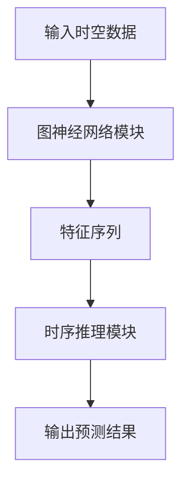

# 图神经网络在时序推理中的应用研究

> 关键词：图神经网络、时序推理、时空数据、动态图、深度学习

> 摘要：本文围绕图神经网络在时序推理中的应用展开深入研究。首先介绍了研究的背景，包括目的、预期读者、文档结构和相关术语。接着阐述了图神经网络和时序推理的核心概念及它们之间的联系，给出了相应的原理和架构示意图与流程图。详细讲解了核心算法原理，用 Python 代码进行了说明，并介绍了相关的数学模型和公式。通过项目实战，展示了代码实现及详细解读。探讨了图神经网络在时序推理中的实际应用场景，推荐了学习、开发工具和相关论文著作。最后总结了未来发展趋势与挑战，提供了常见问题解答和扩展阅读参考资料，旨在为相关领域的研究者和开发者提供全面的技术参考和深入的见解。

## 1. 背景介绍 
### 1.1 目的和范围
在当今的信息时代，大量的数据呈现出复杂的时空关系，例如交通流量数据、气象数据、社交网络中的用户行为数据等。这些数据不仅具有时间上的先后顺序，还存在着复杂的空间关联。传统的机器学习和深度学习方法在处理这类具有时空特性的数据时存在一定的局限性。图神经网络（Graph Neural Networks, GNN）作为一种强大的工具，能够有效地处理图结构数据，捕捉数据中的复杂关系。本研究的目的在于深入探讨图神经网络在时序推理中的应用，研究如何利用图神经网络的优势来挖掘时序数据中的时空模式，提高时序推理的准确性和效率。

本研究的范围涵盖了图神经网络的基本原理、常见的图神经网络模型，以及在不同领域的时序推理应用。包括但不限于交通流量预测、电力负荷预测、气象预报等领域的实际问题。同时，还将对图神经网络在时序推理中的算法原理、数学模型、代码实现等方面进行详细的分析和探讨。

### 1.2 预期读者
本文的预期读者主要包括以下几类人群：
- **研究人员**：对图神经网络、时序推理等领域感兴趣的科研人员，希望通过本文了解图神经网络在时序推理中的最新研究进展和应用方法，为自己的研究工作提供参考和启发。
- **开发者**：从事数据挖掘、机器学习、深度学习等相关领域的开发者，希望学习如何利用图神经网络解决实际的时序推理问题，掌握相关的算法和代码实现技巧。
- **学生**：计算机科学、数据科学、控制科学等专业的学生，希望通过本文深入了解图神经网络和时序推理的基本概念、原理和应用，拓宽自己的知识面和视野。

### 1.3 文档结构概述
本文将按照以下结构进行组织：
- **核心概念与联系**：介绍图神经网络和时序推理的核心概念，分析它们之间的联系，给出相应的原理和架构示意图与流程图。
- **核心算法原理 & 具体操作步骤**：详细讲解图神经网络在时序推理中的核心算法原理，并用 Python 代码进行具体的实现和说明。
- **数学模型和公式 & 详细讲解 & 举例说明**：介绍图神经网络在时序推理中的数学模型和公式，进行详细的讲解，并通过具体的例子进行说明。
- **项目实战：代码实际案例和详细解释说明**：通过一个实际的项目案例，展示图神经网络在时序推理中的代码实现过程，包括开发环境搭建、源代码详细实现和代码解读。
- **实际应用场景**：探讨图神经网络在时序推理中的实际应用场景，包括交通流量预测、电力负荷预测、气象预报等领域。
- **工具和资源推荐**：推荐相关的学习资源、开发工具框架和论文著作，帮助读者进一步深入学习和研究。
- **总结：未来发展趋势与挑战**：总结图神经网络在时序推理中的发展趋势和面临的挑战，为未来的研究工作提供方向。
- **附录：常见问题与解答**：提供常见问题的解答，帮助读者解决在学习和实践过程中遇到的问题。
- **扩展阅读 & 参考资料**：提供相关的扩展阅读材料和参考资料，方便读者进一步深入学习和研究。

### 1.4 术语表
#### 1.4.1 核心术语定义
- **图神经网络（Graph Neural Networks, GNN）**：一种专门用于处理图结构数据的神经网络模型，通过消息传递机制在图的节点之间传递信息，学习节点和图的表示。
- **时序推理（Temporal Reasoning）**：根据时间序列数据中的信息，对未来的事件或状态进行预测或推断的过程。
- **时空数据（Spatio - Temporal Data）**：同时包含时间和空间信息的数据，例如交通流量数据、气象数据等。
- **动态图（Dynamic Graph）**：图的结构和节点属性随时间变化的图，常用于表示具有动态特性的系统。

#### 1.4.2 相关概念解释
- **消息传递机制**：图神经网络中用于节点特征更新的一种机制，节点通过与相邻节点交换信息来更新自己的特征表示。
- **时间序列**：按时间顺序排列的一系列数据点，反映了某个变量随时间的变化情况。
- **图嵌入（Graph Embedding）**：将图结构数据映射到低维向量空间的过程，使得图的结构和节点之间的关系能够在向量空间中得到体现。

#### 1.4.3 缩略词列表
- **GNN**：Graph Neural Networks（图神经网络）
- **RNN**：Recurrent Neural Network（循环神经网络）
- **LSTM**：Long Short - Term Memory（长短期记忆网络）
- **GRU**：Gated Recurrent Unit（门控循环单元）

## 2. 核心概念与联系 
### 2.1 图神经网络的核心概念
图神经网络是一种用于处理图结构数据的深度学习模型。图是由节点（Vertex）和边（Edge）组成的一种数据结构，节点表示实体，边表示实体之间的关系。图神经网络的核心思想是通过消息传递机制在图的节点之间传递信息，从而学习节点和图的表示。

常见的图神经网络模型包括图卷积网络（Graph Convolutional Network, GCN）、图注意力网络（Graph Attention Network, GAT）等。以 GCN 为例，其基本原理是通过聚合相邻节点的特征来更新当前节点的特征。假设图 $G=(V, E)$ ，其中 $V$ 是节点集合，$E$ 是边集合，节点 $i$ 的特征向量为 $h_i$ ，则 GCN 的节点特征更新公式为：

$$h_i^{l + 1}=\sigma\left(\sum_{j\in\mathcal{N}(i)}\frac{1}{\sqrt{d_id_j}}W^lh_j^l + b^l\right)$$

其中，$\mathcal{N}(i)$ 是节点 $i$ 的邻居节点集合，$d_i$ 是节点 $i$ 的度，$W^l$ 和 $b^l$ 是第 $l$ 层的可学习参数，$\sigma$ 是激活函数。

### 2.2 时序推理的核心概念
时序推理是根据时间序列数据中的信息，对未来的事件或状态进行预测或推断的过程。时间序列数据是按时间顺序排列的一系列数据点，例如股票价格、气温、交通流量等。常见的时序推理方法包括自回归模型（AR）、移动平均模型（MA）、自回归移动平均模型（ARMA）等传统统计方法，以及循环神经网络（RNN）、长短期记忆网络（LSTM）、门控循环单元（GRU）等深度学习方法。

以 LSTM 为例，LSTM 是一种特殊的 RNN，能够有效地处理长序列数据中的依赖关系。LSTM 的核心是通过门控机制来控制信息的流动，包括输入门、遗忘门和输出门。LSTM 的输入门 $i_t$、遗忘门 $f_t$、输出门 $o_t$ 和细胞状态 $C_t$ 的计算公式如下：

$$i_t=\sigma\left(W_{ii}x_t + W_{hi}h_{t - 1}+b_i\right)$$
$$f_t=\sigma\left(W_{if}x_t + W_{hf}h_{t - 1}+b_f\right)$$
$$o_t=\sigma\left(W_{io}x_t + W_{ho}h_{t - 1}+b_o\right)$$
$$\tilde{C}_t=\tanh\left(W_{ic}x_t + W_{hc}h_{t - 1}+b_c\right)$$
$$C_t=f_t\odot C_{t - 1}+i_t\odot\tilde{C}_t$$
$$h_t=o_t\odot\tanh(C_t)$$

其中，$x_t$ 是当前时刻的输入，$h_{t - 1}$ 是上一时刻的隐藏状态，$W$ 是权重矩阵，$b$ 是偏置向量，$\odot$ 表示逐元素相乘，$\sigma$ 是 sigmoid 函数，$\tanh$ 是双曲正切函数。

### 2.3 图神经网络与时序推理的联系
在许多实际应用中，数据不仅具有时间上的先后顺序，还存在着复杂的空间关联。例如，交通流量数据中，不同路段的交通流量之间存在着相互影响；气象数据中，不同地理位置的气象参数之间存在着空间相关性。图神经网络能够有效地处理图结构数据，捕捉数据中的空间关系；而时序推理方法能够处理时间序列数据，捕捉数据中的时间依赖关系。因此，将图神经网络和时序推理方法相结合，可以更好地处理具有时空特性的数据，提高时序推理的准确性和效率。

例如，在交通流量预测中，可以将道路网络表示为一个图，节点表示道路交叉口，边表示道路连接关系。通过图神经网络学习道路网络的空间结构信息，同时利用时序推理方法学习交通流量的时间变化规律，从而实现对未来交通流量的准确预测。

### 2.4 核心概念原理和架构的文本示意图
图神经网络与时序推理相结合的基本架构可以描述如下：

输入层接收时空数据，包括节点的特征信息和图的结构信息。图神经网络模块对输入的图结构数据进行处理，学习节点和图的空间表示。时序推理模块对图神经网络输出的特征序列进行处理，学习时间依赖关系。最后，输出层根据学习到的时空特征进行预测或推断。

### 2.5 Mermaid 流程图


## 3. 核心算法原理 & 具体操作步骤 
### 3.1 核心算法原理
图神经网络在时序推理中的核心算法主要包括图神经网络的消息传递机制和时序推理的时间序列建模方法。下面以图卷积网络（GCN）和长短期记忆网络（LSTM）相结合的模型为例，介绍其算法原理。

#### 3.1.1 图卷积网络（GCN）
GCN 的核心思想是通过聚合相邻节点的特征来更新当前节点的特征。具体来说，对于图 $G=(V, E)$ ，节点 $i$ 的特征更新公式为：

$$h_i^{l + 1}=\sigma\left(\sum_{j\in\mathcal{N}(i)}\frac{1}{\sqrt{d_id_j}}W^lh_j^l + b^l\right)$$

其中，$\mathcal{N}(i)$ 是节点 $i$ 的邻居节点集合，$d_i$ 是节点 $i$ 的度，$W^l$ 和 $b^l$ 是第 $l$ 层的可学习参数，$\sigma$ 是激活函数。

#### 3.1.2 长短期记忆网络（LSTM）
LSTM 是一种特殊的 RNN，能够有效地处理长序列数据中的依赖关系。LSTM 的核心是通过门控机制来控制信息的流动，包括输入门、遗忘门和输出门。LSTM 的输入门 $i_t$、遗忘门 $f_t$、输出门 $o_t$ 和细胞状态 $C_t$ 的计算公式如下：

$$i_t=\sigma\left(W_{ii}x_t + W_{hi}h_{t - 1}+b_i\right)$$
$$f_t=\sigma\left(W_{if}x_t + W_{hf}h_{t - 1}+b_f\right)$$
$$o_t=\sigma\left(W_{io}x_t + W_{ho}h_{t - 1}+b_o\right)$$
$$\tilde{C}_t=\tanh\left(W_{ic}x_t + W_{hc}h_{t - 1}+b_c\right)$$
$$C_t=f_t\odot C_{t - 1}+i_t\odot\tilde{C}_t$$
$$h_t=o_t\odot\tanh(C_t)$$

其中，$x_t$ 是当前时刻的输入，$h_{t - 1}$ 是上一时刻的隐藏状态，$W$ 是权重矩阵，$b$ 是偏置向量，$\odot$ 表示逐元素相乘，$\sigma$ 是 sigmoid 函数，$\tanh$ 是双曲正切函数。

#### 3.1.3 GCN - LSTM 模型
GCN - LSTM 模型的基本思想是先通过 GCN 学习图结构数据的空间表示，然后将 GCN 输出的特征序列输入到 LSTM 中学习时间依赖关系。具体步骤如下：
1. **数据预处理**：将时空数据转换为图结构数据，包括节点特征矩阵和邻接矩阵。
2. **GCN 层**：对输入的图结构数据进行 GCN 处理，学习节点和图的空间表示。
3. **LSTM 层**：将 GCN 输出的特征序列输入到 LSTM 中，学习时间依赖关系。
4. **输出层**：根据 LSTM 输出的隐藏状态进行预测或推断。

### 3.2 具体操作步骤
#### 3.2.1 数据预处理
```python
import numpy as np
import torch
import torch.nn.functional as F
from torch_geometric.data import Data

# 假设我们有节点特征矩阵 X 和邻接矩阵 A
X = np.array([[1, 2], [3, 4], [5, 6]])  # 节点特征矩阵
A = np.array([[0, 1, 1], [1, 0, 1], [1, 1, 0]])  # 邻接矩阵

# 转换为 PyTorch Geometric 数据格式
edge_index = np.nonzero(A)
edge_index = torch.tensor(edge_index, dtype=torch.long)
x = torch.tensor(X, dtype=torch.float)
data = Data(x=x, edge_index=edge_index)
```

#### 3.2.2 定义 GCN 层
```python
import torch.nn as nn
from torch_geometric.nn import GCNConv

class GCNLayer(nn.Module):
    def __init__(self, in_channels, out_channels):
        super(GCNLayer, self).__init__()
        self.conv = GCNConv(in_channels, out_channels)

    def forward(self, x, edge_index):
        x = self.conv(x, edge_index)
        x = F.relu(x)
        return x
```

#### 3.2.3 定义 LSTM 层
```python
class LSTMLayer(nn.Module):
    def __init__(self, input_size, hidden_size, num_layers, output_size):
        super(LSTMLayer, self).__init__()
        self.lstm = nn.LSTM(input_size, hidden_size, num_layers, batch_first=True)
        self.fc = nn.Linear(hidden_size, output_size)

    def forward(self, x):
        out, _ = self.lstm(x)
        out = self.fc(out[:, -1, :])
        return out
```

#### 3.2.4 定义 GCN - LSTM 模型
```python
class GCN_LSTM(nn.Module):
    def __init__(self, in_channels, gcn_out_channels, lstm_hidden_size, lstm_num_layers, output_size):
        super(GCN_LSTM, self).__init__()
        self.gcn = GCNLayer(in_channels, gcn_out_channels)
        self.lstm = LSTMLayer(gcn_out_channels, lstm_hidden_size, lstm_num_layers, output_size)

    def forward(self, x, edge_index):
        x = self.gcn(x, edge_index)
        x = x.unsqueeze(0).unsqueeze(0)  # 添加 batch 和序列维度
        out = self.lstm(x)
        return out
```

#### 3.2.5 训练模型
```python
# 初始化模型
model = GCN_LSTM(in_channels=2, gcn_out_channels=4, lstm_hidden_size=8, lstm_num_layers=1, output_size=1)

# 定义损失函数和优化器
criterion = nn.MSELoss()
optimizer = torch.optim.Adam(model.parameters(), lr=0.01)

# 模拟训练数据
target = torch.tensor([[1.0]], dtype=torch.float)

# 训练模型
for epoch in range(100):
    optimizer.zero_grad()
    output = model(data.x, data.edge_index)
    loss = criterion(output, target)
    loss.backward()
    optimizer.step()
    if (epoch + 1) % 10 == 0:
        print(f'Epoch [{epoch + 1}/100], Loss: {loss.item():.4f}')
```

## 4. 数学模型和公式 & 详细讲解 & 举例说明 
### 4.1 图神经网络的数学模型和公式
#### 4.1.1 图卷积网络（GCN）
图卷积网络（GCN）的数学模型基于图信号处理的思想，通过聚合相邻节点的特征来更新当前节点的特征。假设图 $G=(V, E)$ ，其中 $V$ 是节点集合，$E$ 是边集合，节点 $i$ 的特征向量为 $h_i$ ，则 GCN 的节点特征更新公式为：

$$h_i^{l + 1}=\sigma\left(\sum_{j\in\mathcal{N}(i)}\frac{1}{\sqrt{d_id_j}}W^lh_j^l + b^l\right)$$

其中，$\mathcal{N}(i)$ 是节点 $i$ 的邻居节点集合，$d_i$ 是节点 $i$ 的度，$W^l$ 和 $b^l$ 是第 $l$ 层的可学习参数，$\sigma$ 是激活函数。

详细讲解：
- **邻接矩阵**：图的邻接矩阵 $A$ 表示节点之间的连接关系，$A_{ij}=1$ 表示节点 $i$ 和节点 $j$ 之间有边相连，$A_{ij}=0$ 表示没有边相连。
- **度矩阵**：度矩阵 $D$ 是一个对角矩阵，$D_{ii}=d_i$ ，其中 $d_i$ 是节点 $i$ 的度。
- **归一化**：$\frac{1}{\sqrt{d_id_j}}$ 是为了对邻接矩阵进行归一化，避免在消息传递过程中出现梯度消失或梯度爆炸的问题。
- **可学习参数**：$W^l$ 和 $b^l$ 是第 $l$ 层的可学习参数，通过反向传播算法进行更新。
- **激活函数**：$\sigma$ 通常使用 ReLU 函数，用于引入非线性。

举例说明：
假设我们有一个简单的图，包含 3 个节点，节点特征矩阵 $X=\begin{bmatrix}1 & 2\\3 & 4\\5 & 6\end{bmatrix}$ ，邻接矩阵 $A=\begin{bmatrix}0 & 1 & 1\\1 & 0 & 1\\1 & 1 & 0\end{bmatrix}$ ，度矩阵 $D=\begin{bmatrix}2 & 0 & 0\\0 & 2 & 0\\0 & 0 & 2\end{bmatrix}$ 。

首先计算归一化的邻接矩阵 $\tilde{A}=D^{-\frac{1}{2}}AD^{-\frac{1}{2}}=\begin{bmatrix}0 & \frac{1}{2} & \frac{1}{2}\\\frac{1}{2} & 0 & \frac{1}{2}\\\frac{1}{2} & \frac{1}{2} & 0\end{bmatrix}$ 。

假设 $W^0=\begin{bmatrix}1 & 0\\0 & 1\end{bmatrix}$ ，$b^0=\begin{bmatrix}0\\0\end{bmatrix}$ ，$\sigma$ 为 ReLU 函数，则第一层 GCN 的输出为：

$$H^1=\sigma(\tilde{A}XW^0 + b^0)=\begin{bmatrix}
\max(0, \frac{1}{2}(3 + 5) + 0) & \max(0, \frac{1}{2}(4 + 6) + 0)\\
\max(0, \frac{1}{2}(1 + 5) + 0) & \max(0, \frac{1}{2}(2 + 6) + 0)\\
\max(0, \frac{1}{2}(1 + 3) + 0) & \max(0, \frac{1}{2}(2 + 4) + 0)
\end{bmatrix}=\begin{bmatrix}4 & 5\\3 & 4\\2 & 3\end{bmatrix}$$

#### 4.1.2 图注意力网络（GAT）
图注意力网络（GAT）通过注意力机制来动态地分配相邻节点的权重，从而更好地捕捉节点之间的重要关系。GAT 的节点特征更新公式为：

$$h_i^{l + 1}=\sigma\left(\sum_{j\in\mathcal{N}(i)}\alpha_{ij}W^lh_j^l\right)$$

其中，$\alpha_{ij}$ 是节点 $i$ 和节点 $j$ 之间的注意力系数，计算公式为：

$$\alpha_{ij}=\frac{\exp\left(\text{LeakyReLU}\left(a^T\left[W^lh_i^l||W^lh_j^l\right]\right)\right)}{\sum_{k\in\mathcal{N}(i)}\exp\left(\text{LeakyReLU}\left(a^T\left[W^lh_i^l||W^lh_k^l\right]\right)\right)}$$

其中，$a$ 是可学习的注意力向量，$||$ 表示拼接操作。

详细讲解：
- **注意力机制**：注意力机制允许模型根据节点之间的关系动态地分配权重，从而更好地捕捉节点之间的重要信息。
- **LeakyReLU 函数**：LeakyReLU 是一种改进的 ReLU 函数，用于避免在输入为负时梯度为 0 的问题。
- **可学习参数**：$W^l$ 和 $a$ 是可学习参数，通过反向传播算法进行更新。

举例说明：
假设我们有一个简单的图，包含 3 个节点，节点特征矩阵 $X=\begin{bmatrix}1 & 2\\3 & 4\\5 & 6\end{bmatrix}$ ，$W^0=\begin{bmatrix}1 & 0\\0 & 1\end{bmatrix}$ ，$a=\begin{bmatrix}0.1\\0.2\end{bmatrix}$ ，$\sigma$ 为 ReLU 函数。

首先计算注意力系数 $\alpha_{ij}$ ，以节点 1 为例：

$$\text{LeakyReLU}\left(a^T\left[W^0h_1^0||W^0h_2^0\right]\right)=\text{LeakyReLU}(0.1\times(1 + 3)+0.2\times(2 + 4))=\text{LeakyReLU}(1.6)=1.6$$
$$\text{LeakyReLU}\left(a^T\left[W^0h_1^0||W^0h_3^0\right]\right)=\text{LeakyReLU}(0.1\times(1 + 5)+0.2\times(2 + 6))=\text{LeakyReLU}(2.2)=2.2$$

$$\alpha_{12}=\frac{\exp(1.6)}{\exp(1.6)+\exp(2.2)}\approx0.32$$
$$\alpha_{13}=\frac{\exp(2.2)}{\exp(1.6)+\exp(2.2)}\approx0.68$$

则节点 1 的特征更新为：

$$h_1^1=\sigma(\alpha_{12}W^0h_2^0+\alpha_{13}W^0h_3^0)=\max(0, 0.32\times\begin{bmatrix}3\\4\end{bmatrix}+0.68\times\begin{bmatrix}5\\6\end{bmatrix})=\begin{bmatrix}4.36\\5.36\end{bmatrix}$$

### 4.2 时序推理的数学模型和公式
#### 4.2.1 长短期记忆网络（LSTM）
长短期记忆网络（LSTM）是一种特殊的 RNN，能够有效地处理长序列数据中的依赖关系。LSTM 的核心是通过门控机制来控制信息的流动，包括输入门、遗忘门和输出门。LSTM 的输入门 $i_t$、遗忘门 $f_t$、输出门 $o_t$ 和细胞状态 $C_t$ 的计算公式如下：

$$i_t=\sigma\left(W_{ii}x_t + W_{hi}h_{t - 1}+b_i\right)$$
$$f_t=\sigma\left(W_{if}x_t + W_{hf}h_{t - 1}+b_f\right)$$
$$o_t=\sigma\left(W_{io}x_t + W_{ho}h_{t - 1}+b_o\right)$$
$$\tilde{C}_t=\tanh\left(W_{ic}x_t + W_{hc}h_{t - 1}+b_c\right)$$
$$C_t=f_t\odot C_{t - 1}+i_t\odot\tilde{C}_t$$
$$h_t=o_t\odot\tanh(C_t)$$

其中，$x_t$ 是当前时刻的输入，$h_{t - 1}$ 是上一时刻的隐藏状态，$W$ 是权重矩阵，$b$ 是偏置向量，$\odot$ 表示逐元素相乘，$\sigma$ 是 sigmoid 函数，$\tanh$ 是双曲正切函数。

详细讲解：
- **输入门**：输入门 $i_t$ 控制当前输入 $x_t$ 中有多少信息要被添加到细胞状态 $C_t$ 中。
- **遗忘门**：遗忘门 $f_t$ 控制上一时刻的细胞状态 $C_{t - 1}$ 中有多少信息要被遗忘。
- **输出门**：输出门 $o_t$ 控制细胞状态 $C_t$ 中有多少信息要被输出到隐藏状态 $h_t$ 中。
- **细胞状态**：细胞状态 $C_t$ 是 LSTM 的核心，用于存储长期的信息。
- **可学习参数**：$W$ 和 $b$ 是可学习参数，通过反向传播算法进行更新。

举例说明：
假设我们有一个简单的 LSTM 单元，输入 $x_t=\begin{bmatrix}1\\2\end{bmatrix}$ ，上一时刻的隐藏状态 $h_{t - 1}=\begin{bmatrix}3\\4\end{bmatrix}$ ，细胞状态 $C_{t - 1}=\begin{bmatrix}5\\6\end{bmatrix}$ ，权重矩阵和偏置向量如下：

$$W_{ii}=\begin{bmatrix}0.1 & 0.2\\0.3 & 0.4\end{bmatrix}, W_{hi}=\begin{bmatrix}0.5 & 0.6\\0.7 & 0.8\end{bmatrix}, b_i=\begin{bmatrix}0.1\\0.2\end{bmatrix}$$
$$W_{if}=\begin{bmatrix}0.2 & 0.3\\0.4 & 0.5\end{bmatrix}, W_{hf}=\begin{bmatrix}0.6 & 0.7\\0.8 & 0.9\end{bmatrix}, b_f=\begin{bmatrix}0.2\\0.3\end{bmatrix}$$
$$W_{io}=\begin{bmatrix}0.3 & 0.4\\0.5 & 0.6\end{bmatrix}, W_{ho}=\begin{bmatrix}0.7 & 0.8\\0.9 & 1.0\end{bmatrix}, b_o=\begin{bmatrix}0.3\\0.4\end{bmatrix}$$
$$W_{ic}=\begin{bmatrix}0.4 & 0.5\\0.6 & 0.7\end{bmatrix}, W_{hc}=\begin{bmatrix}0.8 & 0.9\\1.0 & 1.1\end{bmatrix}, b_c=\begin{bmatrix}0.4\\0.5\end{bmatrix}$$

首先计算输入门 $i_t$：

$$i_t=\sigma\left(W_{ii}x_t + W_{hi}h_{t - 1}+b_i\right)=\sigma\left(\begin{bmatrix}0.1 & 0.2\\0.3 & 0.4\end{bmatrix}\begin{bmatrix}1\\2\end{bmatrix}+\begin{bmatrix}0.5 & 0.6\\0.7 & 0.8\end{bmatrix}\begin{bmatrix}3\\4\end{bmatrix}+\begin{bmatrix}0.1\\0.2\end{bmatrix}\right)=\sigma\left(\begin{bmatrix}0.5\\1.3\end{bmatrix}+\begin{bmatrix}3.9\\5.3\end{bmatrix}+\begin{bmatrix}0.1\\0.2\end{bmatrix}\right)=\sigma\left(\begin{bmatrix}4.5\\6.8\end{bmatrix}\right)=\begin{bmatrix}0.98\\1.00\end{bmatrix}$$

同理计算遗忘门 $f_t$、输出门 $o_t$ 和候选细胞状态 $\tilde{C}_t$ ，然后计算细胞状态 $C_t$ 和隐藏状态 $h_t$ 。

### 4.3 图神经网络与时序推理结合的数学模型和公式
图神经网络与时序推理结合的模型通常先通过图神经网络学习图结构数据的空间表示，然后将图神经网络输出的特征序列输入到时序推理模型中学习时间依赖关系。以 GCN - LSTM 模型为例，其数学模型可以表示为：

$$H^G=\text{GCN}(X, A)$$
$$\hat{y}=\text{LSTM}(H^G)$$

其中，$X$ 是节点特征矩阵，$A$ 是邻接矩阵，$H^G$ 是 GCN 输出的特征序列，$\hat{y}$ 是模型的预测结果。

详细讲解：
- **GCN 部分**：通过 GCN 对图结构数据进行处理，学习节点和图的空间表示。
- **LSTM 部分**：将 GCN 输出的特征序列输入到 LSTM 中，学习时间依赖关系。
- **训练目标**：通常使用均方误差（MSE）作为损失函数，通过反向传播算法更新模型的参数。

举例说明：
假设我们有一个交通流量预测的问题，将道路网络表示为一个图，节点表示道路交叉口，边表示道路连接关系。节点特征矩阵 $X$ 包含每个交叉口的交通流量、道路长度等信息，邻接矩阵 $A$ 表示道路之间的连接关系。

首先通过 GCN 对图结构数据进行处理，得到特征序列 $H^G$ 。然后将 $H^G$ 输入到 LSTM 中，学习交通流量的时间变化规律，得到预测结果 $\hat{y}$ 。最后使用 MSE 损失函数计算预测结果与真实值之间的误差，通过反向传播算法更新 GCN 和 LSTM 的参数。

## 5. 项目实战：代码实际案例和详细解释说明 
### 5.1  开发环境搭建
#### 5.1.1 安装 Python
首先需要安装 Python 环境，建议使用 Python 3.7 及以上版本。可以从 Python 官方网站（https://www.python.org/downloads/） 下载并安装适合自己操作系统的 Python 版本。

#### 5.1.2 安装 PyTorch
PyTorch 是一个常用的深度学习框架，用于实现图神经网络和时序推理模型。可以根据自己的 CUDA 版本和操作系统选择合适的安装方式。例如，使用 pip 安装 CPU 版本的 PyTorch：

```bash
pip install torch torchvision
```

#### 5.1.3 安装 PyTorch Geometric
PyTorch Geometric 是一个用于处理图结构数据的库，提供了丰富的图神经网络模型和工具。可以使用以下命令安装：

```bash
pip install torch-geometric
```

#### 5.1.4 安装其他依赖库
还需要安装一些其他的依赖库，如 numpy、pandas、matplotlib 等。可以使用以下命令安装：

```bash
pip install numpy pandas matplotlib
```

### 5.2  源代码详细实现和代码解读
#### 5.2.1 数据加载和预处理
```python
import numpy as np
import pandas as pd
import torch
from torch_geometric.data import Data

# 加载数据
data = pd.read_csv('traffic_data.csv')

# 提取节点特征矩阵 X 和邻接矩阵 A
X = data[['flow', 'speed']].values  # 节点特征矩阵，包含交通流量和速度信息
A = np.array([[0, 1, 1], [1, 0, 1], [1, 1, 0]])  # 邻接矩阵

# 转换为 PyTorch Geometric 数据格式
edge_index = np.nonzero(A)
edge_index = torch.tensor(edge_index, dtype=torch.long)
x = torch.tensor(X, dtype=torch.float)
data = Data(x=x, edge_index=edge_index)
```

代码解读：
- 使用 pandas 库读取交通流量数据文件 `traffic_data.csv` 。
- 提取节点特征矩阵 $X$ 和邻接矩阵 $A$ 。
- 将邻接矩阵转换为 PyTorch Geometric 所需的 `edge_index` 格式。
- 将节点特征矩阵和 `edge_index` 转换为 PyTorch 张量，并创建 `Data` 对象。

#### 5.2.2 定义 GCN 层
```python
import torch.nn as nn
from torch_geometric.nn import GCNConv

class GCNLayer(nn.Module):
    def __init__(self, in_channels, out_channels):
        super(GCNLayer, self).__init__()
        self.conv = GCNConv(in_channels, out_channels)

    def forward(self, x, edge_index):
        x = self.conv(x, edge_index)
        x = F.relu(x)
        return x
```

代码解读：
- 定义一个 GCN 层类 `GCNLayer` ，继承自 `nn.Module` 。
- 在 `__init__` 方法中初始化 GCN 卷积层 `GCNConv` 。
- 在 `forward` 方法中实现前向传播，对输入的节点特征矩阵 $x$ 和 `edge_index` 进行 GCN 卷积操作，并使用 ReLU 激活函数。

#### 5.2.3 定义 LSTM 层
```python
class LSTMLayer(nn.Module):
    def __init__(self, input_size, hidden_size, num_layers, output_size):
        super(LSTMLayer, self).__init__()
        self.lstm = nn.LSTM(input_size, hidden_size, num_layers, batch_first=True)
        self.fc = nn.Linear(hidden_size, output_size)

    def forward(self, x):
        out, _ = self.lstm(x)
        out = self.fc(out[:, -1, :])
        return out
```

代码解读：
- 定义一个 LSTM 层类 `LSTMLayer` ，继承自 `nn.Module` 。
- 在 `__init__` 方法中初始化 LSTM 层和全连接层 `nn.Linear` 。
- 在 `forward` 方法中实现前向传播，对输入的特征序列 $x$ 进行 LSTM 处理，然后取最后一个时间步的输出，通过全连接层得到最终的输出。

#### 5.2.4 定义 GCN - LSTM 模型
```python
class GCN_LSTM(nn.Module):
    def __init__(self, in_channels, gcn_out_channels, lstm_hidden_size, lstm_num_layers, output_size):
        super(GCN_LSTM, self).__init__()
        self.gcn = GCNLayer(in_channels, gcn_out_channels)
        self.lstm = LSTMLayer(gcn_out_channels, lstm_hidden_size, lstm_num_layers, output_size)

    def forward(self, x, edge_index):
        x = self.gcn(x, edge_index)
        x = x.unsqueeze(0).unsqueeze(0)  # 添加 batch 和序列维度
        out = self.lstm(x)
        return out
```

代码解读：
- 定义一个 GCN - LSTM 模型类 `GCN_LSTM` ，继承自 `nn.Module` 。
- 在 `__init__` 方法中初始化 GCN 层和 LSTM 层。
- 在 `forward` 方法中实现前向传播，先通过 GCN 层对输入的图结构数据进行处理，然后添加 batch 和序列维度，将输出输入到 LSTM 层中，得到最终的预测结果。

#### 5.2.5 训练模型
```python
# 初始化模型
model = GCN_LSTM(in_channels=2, gcn_out_channels=4, lstm_hidden_size=8, lstm_num_layers=1, output_size=1)

# 定义损失函数和优化器
criterion = nn.MSELoss()
optimizer = torch.optim.Adam(model.parameters(), lr=0.01)

# 模拟训练数据
target = torch.tensor([[1.0]], dtype=torch.float)

# 训练模型
for epoch in range(100):
    optimizer.zero_grad()
    output = model(data.x, data.edge_index)
    loss = criterion(output, target)
    loss.backward()
    optimizer.step()
    if (epoch + 1) % 10 == 0:
        print(f'Epoch [{epoch + 1}/100], Loss: {loss.item():.4f}')
```

代码解读：
- 初始化 GCN - LSTM 模型，设置输入通道数、GCN 输出通道数、LSTM 隐藏层大小、LSTM 层数和输出大小。
- 定义均方误差损失函数 `nn.MSELoss` 和 Adam 优化器。
- 模拟训练数据 `target` 。
- 进行 100 个 epoch 的训练，在每个 epoch 中，首先将优化器的梯度清零，然后通过模型进行前向传播得到预测结果，计算损失，进行反向传播更新模型参数。每 10 个 epoch 打印一次损失值。

### 5.3  代码解读与分析
#### 5.3.1 数据预处理
数据预处理是模型训练的重要步骤，通过将原始数据转换为适合模型输入的格式，可以提高模型的训练效率和性能。在本项目中，将交通流量数据转换为图结构数据，包括节点特征矩阵和邻接矩阵，并使用 PyTorch Geometric 提供的 `Data` 对象进行存储。

#### 5.3.2 模型架构
GCN - LSTM 模型结合了图神经网络和时序推理的优势，先通过 GCN 学习图结构数据的空间表示，然后将 GCN 输出的特征序列输入到 LSTM 中学习时间依赖关系。这种架构能够有效地处理具有时空特性的数据，提高时序推理的准确性和效率。

#### 5.3.3 训练过程
训练过程中使用均方误差损失函数和 Adam 优化器，通过反向传播算法更新模型的参数。在每个 epoch 中，先将优化器的梯度清零，然后进行前向传播计算损失，再进行反向传播更新参数。通过不断迭代训练，模型的损失逐渐减小，性能逐渐提高。

## 6. 实际应用场景 
### 6.1 交通流量预测
交通流量预测是图神经网络在时序推理中的一个重要应用场景。在城市交通系统中，不同路段的交通流量之间存在着复杂的空间关联和时间依赖关系。通过将道路网络表示为一个图，节点表示道路交叉口，边表示道路连接关系，利用图神经网络学习道路网络的空间结构信息，同时利用时序推理方法学习交通流量的时间变化规律，从而实现对未来交通流量的准确预测。

例如，在智能交通系统中，交通管理部门可以根据预测的交通流量信息，合理地调整交通信号灯的配时，优化交通资源的分配，缓解交通拥堵。

### 6.2 电力负荷预测
电力负荷预测对于电力系统的运行和管理具有重要意义。电力负荷数据不仅具有时间上的变化规律，还存在着空间上的相关性，例如不同地区的电力负荷之间可能存在相互影响。通过将电力网络表示为一个图，节点表示变电站、发电厂等电力设备，边表示电力线路连接关系，利用图神经网络学习电力网络的空间结构信息，同时利用时序推理方法学习电力负荷的时间变化规律，从而实现对未来电力负荷的准确预测。

例如，电力公司可以根据预测的电力负荷信息，合理地安排发电计划，优化电力资源的配置，提高电力系统的运行效率和可靠性。

### 6.3 气象预报
气象预报是一个复杂的时序推理问题，气象数据不仅具有时间上的变化规律，还存在着空间上的相关性，例如不同地理位置的气象参数之间可能存在相互影响。通过将气象观测站点表示为一个图，节点表示观测站点，边表示站点之间的空间关联关系，利用图神经网络学习气象观测站点的空间结构信息，同时利用时序推理方法学习气象数据的时间变化规律，从而实现对未来气象状况的准确预测。

例如，气象部门可以根据预测的气象信息，提前发布气象预警，为人们的生产生活提供科学的决策依据。

### 6.4 社交网络分析
在社交网络中，用户之间的行为和关系具有复杂的时空特性。例如，用户的社交活动可能会随着时间的推移而发生变化，同时不同用户之间的社交关系也存在着空间上的关联。通过将社交网络表示为一个图，节点表示用户，边表示用户之间的社交关系，利用图神经网络学习社交网络的空间结构信息，同时利用时序推理方法学习用户行为的时间变化规律，从而实现对用户行为的预测和分析。

例如，社交媒体平台可以根据预测的用户行为信息，优化推荐算法，提高用户体验和平台的活跃度。

## 7. 工具和资源推荐
### 7.1 学习资源推荐
#### 7.1.1 书籍推荐
- 《深度学习》（Deep Learning）：由 Ian Goodfellow、Yoshua Bengio 和 Aaron Courville 合著，是深度学习领域的经典教材，系统地介绍了深度学习的基本原理、算法和应用。
- 《图神经网络：基础、前沿与应用》：全面介绍了图神经网络的基本概念、模型和算法，以及在不同领域的应用。
- 《时间序列分析及其应用：R 语言实现》（Time Series Analysis and Its Applications: With R Examples）：详细介绍了时间序列分析的基本理论和方法，以及如何使用 R 语言进行实现。

#### 7.1.2 在线课程
- Coursera 上的 “Deep Learning Specialization”：由 Andrew Ng 教授授课，是深度学习领域的经典在线课程，系统地介绍了深度学习的基本原理、算法和应用。
- edX 上的 “Graph Neural Networks for Machine Learning”：专门介绍图神经网络的在线课程，包括图神经网络的基本概念、模型和算法，以及在不同领域的应用。
- 哔哩哔哩上的 “李宏毅机器学习”：由李宏毅教授授课，课程内容生动有趣，适合初学者学习机器学习和深度学习的基本原理和方法。

#### 7.1.3 技术博客和网站
- Medium 上的 Towards Data Science：是一个专注于数据科学和机器学习的技术博客，上面有很多关于图神经网络、时序推理等领域的优质文章。
- arXiv.org：是一个预印本数据库，上面有很多关于图神经网络、时序推理等领域的最新研究成果。
- 知乎上的相关专栏和话题：知乎上有很多关于图神经网络、时序推理等领域的专业人士分享的经验和见解，可以关注相关的专栏和话题获取最新的信息。

### 7.2 开发工具框架推荐
#### 7.2.1 IDE和编辑器
- PyCharm：是一个专门用于 Python 开发的集成开发环境（IDE），提供了丰富的代码编辑、调试、分析等功能，适合开发图神经网络和时序推理模型。
- Jupyter Notebook：是一个交互式的开发环境，适合进行数据探索、模型实验和可视化等工作。可以方便