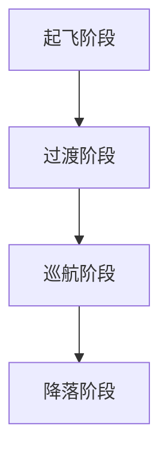

# 垂直起降飞行器（eVTOL）的发展与投资前景

> 关键词：垂直起降飞行器（eVTOL）、发展历程、技术原理、应用场景、投资前景

> 摘要：本文围绕垂直起降飞行器（eVTOL）展开，全面探讨其发展与投资前景。首先介绍eVTOL的背景，包括目的、预期读者、文档结构和相关术语。接着阐述其核心概念、算法原理、数学模型，通过实际案例深入分析。然后探讨eVTOL的实际应用场景，推荐学习资源、开发工具和相关论文。最后总结其未来发展趋势与挑战，解答常见问题并提供扩展阅读与参考资料，旨在为读者全面了解eVTOL提供深度视角，帮助投资者把握投资前景，为从业者提供技术和应用方面的参考。

## 1. 背景介绍 
### 1.1 目的和范围
垂直起降飞行器（eVTOL）作为一种新型的空中交通工具，近年来受到了广泛的关注。本文章的目的在于深入探讨eVTOL的发展历程、技术原理、应用场景以及投资前景。通过对这些方面的详细分析，为读者提供全面而深入的了解，帮助投资者评估投资风险和收益，为相关从业者提供技术和市场方面的参考，同时也为普通读者普及eVTOL的相关知识。

文章的范围涵盖了eVTOL的各个方面，包括其起源和发展、不同类型的eVTOL技术、核心算法和数学模型、实际应用案例、市场现状和未来趋势等。同时，还将对投资eVTOL相关领域的机会和挑战进行分析，为有兴趣的投资者提供有价值的信息。

### 1.2 预期读者
本文预期读者包括以下几类人群：
1. **投资者**：对新兴科技领域有投资兴趣，希望了解eVTOL的市场潜力和投资前景，以便做出合理的投资决策。
2. **航空航天从业者**：包括飞机设计师、工程师、研究人员等，他们希望深入了解eVTOL的技术原理和发展趋势，为相关的研发和创新工作提供参考。
3. **普通读者**：对科技和未来交通感兴趣，希望通过本文了解eVTOL的基本概念、应用场景和发展动态，拓宽知识面。
4. **政策制定者**：关注交通运输领域的发展和创新，希望通过了解eVTOL的情况，制定相关的政策和法规，促进其健康发展。

### 1.3 文档结构概述
本文将按照以下结构进行组织：
1. **背景介绍**：介绍文章的目的、范围、预期读者、文档结构和相关术语。
2. **核心概念与联系**：阐述eVTOL的核心概念、工作原理和不同类型的eVTOL技术，通过文本示意图和Mermaid流程图进行直观展示。
3. **核心算法原理 & 具体操作步骤**：详细讲解eVTOL的核心算法原理，包括飞行控制算法、导航算法等，并使用Python源代码进行具体阐述。
4. **数学模型和公式 & 详细讲解 & 举例说明**：介绍eVTOL相关的数学模型和公式，如空气动力学模型、动力学模型等，并进行详细讲解和举例说明。
5. **项目实战：代码实际案例和详细解释说明**：通过实际的项目案例，展示eVTOL的开发过程，包括开发环境搭建、源代码实现和代码解读。
6. **实际应用场景**：探讨eVTOL在不同领域的实际应用场景，如城市空中交通、物流配送、应急救援等。
7. **工具和资源推荐**：推荐学习eVTOL相关知识的资源，包括书籍、在线课程、技术博客和网站，以及开发工具、框架和相关论文著作。
8. **总结：未来发展趋势与挑战**：总结eVTOL的未来发展趋势，分析面临的挑战，并对其发展前景进行展望。
9. **附录：常见问题与解答**：解答读者在阅读过程中可能遇到的常见问题。
10. **扩展阅读 & 参考资料**：提供相关的扩展阅读材料和参考资料，方便读者进一步深入研究。

### 1.4 术语表
#### 1.4.1 核心术语定义
1. **垂直起降飞行器（eVTOL）**：Electric Vertical Takeoff and Landing vehicle的缩写，指的是能够垂直起飞和降落的电动飞行器。它结合了直升机的垂直起降能力和固定翼飞机的高效巡航能力，通常采用电动动力系统，具有低噪音、零排放等优点。
2. **升力系统**：eVTOL中用于产生升力的系统，常见的升力系统包括旋翼、倾转旋翼、涵道风扇等。
3. **推进系统**：eVTOL中用于提供前进动力的系统，推进系统的设计和性能直接影响eVTOL的飞行速度和航程。
4. **飞行控制系统**：用于控制eVTOL飞行姿态、高度、速度等参数的系统，是eVTOL安全飞行的关键。
5. **电池能量密度**：指电池单位体积或单位质量所存储的能量，电池能量密度的高低直接影响eVTOL的续航能力。

#### 1.4.2 相关概念解释
1. **分布式电动推进**：一种将多个电动推进器分布在飞行器不同位置的推进方式，通过合理配置推进器的位置和推力，可以提高飞行器的效率和性能。
2. **混合动力eVTOL**：结合了电动动力系统和传统燃油动力系统的eVTOL，在起飞和降落阶段使用电动动力系统，在巡航阶段使用燃油动力系统，以提高续航能力。
3. **自主飞行**：eVTOL在无需人工干预的情况下，能够自动完成起飞、巡航、降落等飞行任务的能力，自主飞行技术是eVTOL实现商业化应用的关键。

#### 1.4.3 缩略词列表
1. **eVTOL**：Electric Vertical Takeoff and Landing vehicle（垂直起降飞行器）
2. **UAM**：Urban Air Mobility（城市空中交通）
3. **FAA**：Federal Aviation Administration（美国联邦航空管理局）
4. **EASA**：European Union Aviation Safety Agency（欧洲航空安全局）

## 2. 核心概念与联系 
### 2.1 eVTOL的核心概念
垂直起降飞行器（eVTOL）是一种创新的飞行器，它打破了传统飞行器对跑道的依赖，能够在有限的空间内垂直起飞和降落。eVTOL的核心特点在于其电动动力系统，相较于传统的燃油动力系统，电动动力系统具有低噪音、零排放、高效等优点，符合现代社会对环保和可持续发展的要求。

eVTOL的设计理念是将直升机的垂直起降能力与固定翼飞机的高效巡航能力相结合，以实现快速、便捷的空中运输。在起飞和降落阶段，eVTOL通过升力系统产生垂直向上的升力，实现垂直起降；在巡航阶段，eVTOL则通过推进系统提供前进动力，以较高的速度飞行。

### 2.2 工作原理
eVTOL的工作原理主要涉及升力系统和推进系统的协同工作。升力系统的作用是在起飞和降落阶段产生足够的升力，使飞行器能够垂直起飞和降落。常见的升力系统包括旋翼、倾转旋翼、涵道风扇等。

旋翼是一种常见的升力系统，它通过旋转叶片产生升力。倾转旋翼则是在旋翼的基础上进行改进，它可以在起飞和降落阶段像直升机一样垂直起降，在巡航阶段则将旋翼向前倾转，像固定翼飞机一样飞行。涵道风扇是一种将风扇安装在涵道内的升力系统，它具有较高的效率和安全性。

推进系统的作用是在巡航阶段提供前进动力，使飞行器能够以较高的速度飞行。推进系统的设计和性能直接影响eVTOL的飞行速度和航程。常见的推进系统包括螺旋桨、喷气发动机等。

### 2.3 不同类型的eVTOL技术
根据升力系统和推进系统的不同组合，eVTOL可以分为多种类型，常见的类型包括以下几种：
1. **多旋翼eVTOL**：多旋翼eVTOL采用多个旋翼作为升力系统，通过调整旋翼的转速来控制飞行器的姿态和飞行方向。多旋翼eVTOL具有结构简单、控制方便等优点，但续航能力相对较弱。
2. **倾转旋翼eVTOL**：倾转旋翼eVTOL结合了直升机和固定翼飞机的特点，它在起飞和降落阶段像直升机一样垂直起降，在巡航阶段则将旋翼向前倾转，像固定翼飞机一样飞行。倾转旋翼eVTOL具有较高的飞行速度和航程，但结构复杂，控制难度较大。
3. **涵道风扇eVTOL**：涵道风扇eVTOL采用涵道风扇作为升力系统，涵道风扇具有较高的效率和安全性。涵道风扇eVTOL通常具有较好的静音性能和垂直起降能力，但巡航速度相对较低。

### 2.4 文本示意图和Mermaid流程图
#### 2.4.1 文本示意图
eVTOL的工作过程可以用以下文本示意图表示：

1. **起飞阶段**：升力系统启动，产生垂直向上的升力，使飞行器垂直起飞。
2. **过渡阶段**：飞行器从垂直飞行状态逐渐过渡到水平飞行状态，升力系统和推进系统协同工作。
3. **巡航阶段**：推进系统提供前进动力，飞行器以较高的速度水平飞行。
4. **降落阶段**：飞行器从水平飞行状态逐渐过渡到垂直飞行状态，升力系统产生垂直向上的升力，使飞行器垂直降落。

#### 2.4.2 Mermaid流程图


## 3. 核心算法原理 & 具体操作步骤 
### 3.1 飞行控制算法原理
飞行控制算法是eVTOL安全飞行的关键，它的主要作用是根据飞行器的状态信息和飞行任务要求，实时调整飞行器的姿态、高度、速度等参数，确保飞行器按照预定的轨迹飞行。

常见的飞行控制算法包括PID控制算法、模糊控制算法、神经网络控制算法等。其中，PID控制算法是一种经典的控制算法，它具有结构简单、易于实现等优点，在eVTOL飞行控制中得到了广泛的应用。

#### 3.1.1 PID控制算法原理
PID控制算法是一种基于误差反馈的控制算法，它通过计算当前误差、误差的积分和误差的微分，来调整控制量的大小。PID控制算法的数学表达式如下：

$$u(t) = K_p e(t) + K_i \int_{0}^{t} e(\tau) d\tau + K_d \frac{de(t)}{dt}$$

其中，$u(t)$ 是控制量，$e(t)$ 是误差，$K_p$ 是比例系数，$K_i$ 是积分系数，$K_d$ 是微分系数。

#### 3.1.2 Python代码实现
```python
class PIDController:
    def __init__(self, Kp, Ki, Kd):
        self.Kp = Kp
        self.Ki = Ki
        self.Kd = Kd
        self.prev_error = 0
        self.integral = 0

    def update(self, error, dt):
        self.integral += error * dt
        derivative = (error - self.prev_error) / dt
        output = self.Kp * error + self.Ki * self.integral + self.Kd * derivative
        self.prev_error = error
        return output
```

### 3.2 导航算法原理
导航算法的主要作用是确定飞行器的位置、速度和姿态信息，为飞行控制算法提供必要的输入。常见的导航算法包括惯性导航算法、卫星导航算法、组合导航算法等。

#### 3.2.1 惯性导航算法原理
惯性导航算法是一种基于惯性测量单元（IMU）的导航算法，它通过测量飞行器的加速度和角速度，来计算飞行器的位置、速度和姿态信息。惯性导航算法的优点是不受外界环境的影响，具有较高的自主性和可靠性，但缺点是误差会随着时间的积累而增大。

#### 3.2.2 卫星导航算法原理
卫星导航算法是一种基于卫星信号的导航算法，它通过接收卫星信号，来确定飞行器的位置和速度信息。卫星导航算法的优点是精度高、全球覆盖，但缺点是受外界环境的影响较大，如遮挡、干扰等。

#### 3.2.3 组合导航算法原理
组合导航算法是将惯性导航算法和卫星导航算法相结合的一种导航算法，它通过融合两种算法的优点，来提高导航的精度和可靠性。常见的组合导航算法包括卡尔曼滤波算法、扩展卡尔曼滤波算法等。

#### 3.2.4 Python代码实现（简单的卡尔曼滤波示例）
```python
import numpy as np

class KalmanFilter:
    def __init__(self, x0, P0, A, H, Q, R):
        self.x = x0
        self.P = P0
        self.A = A
        self.H = H
        self.Q = Q
        self.R = R

    def predict(self):
        self.x = np.dot(self.A, self.x)
        self.P = np.dot(np.dot(self.A, self.P), self.A.T) + self.Q
        return self.x

    def update(self, z):
        y = z - np.dot(self.H, self.x)
        S = np.dot(np.dot(self.H, self.P), self.H.T) + self.R
        K = np.dot(np.dot(self.P, self.H.T), np.linalg.inv(S))
        self.x = self.x + np.dot(K, y)
        self.P = np.dot((np.eye(self.P.shape[0]) - np.dot(K, self.H)), self.P)
        return self.x
```

### 3.3 具体操作步骤
#### 3.3.1 飞行前准备
1. **系统检查**：对eVTOL的各个系统进行全面检查，包括升力系统、推进系统、飞行控制系统、导航系统等，确保系统正常运行。
2. **参数设置**：根据飞行任务的要求，设置飞行控制算法和导航算法的参数，如PID控制算法的比例系数、积分系数、微分系数等。
3. **环境评估**：对飞行环境进行评估，包括气象条件、地形地貌、障碍物等，确保飞行安全。

#### 3.3.2 起飞阶段
1. **启动升力系统**：根据飞行控制算法的指令，启动升力系统，使飞行器产生垂直向上的升力。
2. **垂直起飞**：逐渐增加升力系统的功率，使飞行器垂直起飞，同时通过飞行控制算法调整飞行器的姿态，保持稳定。

#### 3.3.3 过渡阶段
1. **调整飞行姿态**：随着飞行器的上升，逐渐调整飞行姿态，使飞行器从垂直飞行状态逐渐过渡到水平飞行状态。
2. **启动推进系统**：在飞行器达到一定的高度和速度后，启动推进系统，提供前进动力。

#### 3.3.4 巡航阶段
1. **保持飞行状态**：通过飞行控制算法和导航算法，保持飞行器的飞行姿态、高度、速度等参数稳定，按照预定的轨迹飞行。
2. **实时监测**：实时监测飞行器的状态信息和飞行环境信息，如电池电量、气象条件等，确保飞行安全。

#### 3.3.5 降落阶段
1. **调整飞行姿态**：在接近降落地点时，逐渐调整飞行姿态，使飞行器从水平飞行状态逐渐过渡到垂直飞行状态。
2. **垂直降落**：逐渐降低升力系统的功率，使飞行器垂直降落，同时通过飞行控制算法调整飞行器的姿态，保持稳定。

## 4. 数学模型和公式 & 详细讲解 & 举例说明 
### 4.1 空气动力学模型
空气动力学模型是研究eVTOL在飞行过程中与空气相互作用的模型，它是eVTOL设计和性能分析的基础。常见的空气动力学模型包括翼型理论、涡理论、计算流体力学（CFD）模型等。

#### 4.1.1 翼型理论
翼型理论是研究机翼在气流中产生升力和阻力的理论，它是空气动力学的基础理论之一。翼型的升力和阻力可以用以下公式表示：

$$L = \frac{1}{2} \rho V^2 S C_L$$

$$D = \frac{1}{2} \rho V^2 S C_D$$

其中，$L$ 是升力，$D$ 是阻力，$\rho$ 是空气密度，$V$ 是气流速度，$S$ 是机翼面积，$C_L$ 是升力系数，$C_D$ 是阻力系数。

#### 4.1.2 举例说明
假设一架eVTOL的机翼面积为 $S = 10 m^2$，飞行速度为 $V = 50 m/s$，空气密度为 $\rho = 1.225 kg/m^3$，升力系数为 $C_L = 1.0$，阻力系数为 $C_D = 0.1$。则该eVTOL的升力和阻力分别为：

$$L = \frac{1}{2} \times 1.225 \times 50^2 \times 10 \times 1.0 = 15312.5 N$$

$$D = \frac{1}{2} \times 1.225 \times 50^2 \times 10 \times 0.1 = 1531.25 N$$

### 4.2 动力学模型
动力学模型是研究eVTOL在飞行过程中受力和运动状态变化的模型，它是eVTOL飞行控制和性能分析的重要依据。常见的动力学模型包括刚体动力学模型、多体动力学模型等。

#### 4.2.1 刚体动力学模型
刚体动力学模型将eVTOL视为一个刚体，忽略其弹性变形和内部运动，研究其在受力作用下的运动状态变化。刚体动力学模型可以用牛顿第二定律和欧拉方程来描述。

牛顿第二定律：

$$\sum F = m \frac{dV}{dt}$$

欧拉方程：

$$\sum M = I \frac{d\omega}{dt} + \omega \times I \omega$$

其中，$\sum F$ 是作用在刚体上的合力，$m$ 是刚体的质量，$V$ 是刚体的速度，$\sum M$ 是作用在刚体上的合力矩，$I$ 是刚体的转动惯量，$\omega$ 是刚体的角速度。

#### 4.2.2 举例说明
假设一架eVTOL的质量为 $m = 1000 kg$，受到的合力为 $\sum F = 5000 N$，则该eVTOL的加速度为：

$$a = \frac{\sum F}{m} = \frac{5000}{1000} = 5 m/s^2$$

### 4.3 能量模型
能量模型是研究eVTOL在飞行过程中能量转换和消耗的模型，它是eVTOL续航能力分析和优化的重要依据。常见的能量模型包括电池能量模型、电机能量模型、推进系统能量模型等。

#### 4.3.1 电池能量模型
电池能量模型是研究电池在充放电过程中能量转换和消耗的模型，它可以用以下公式表示：

$$E_{battery} = C \times V$$

其中，$E_{battery}$ 是电池的能量，$C$ 是电池的容量，$V$ 是电池的电压。

#### 4.3.2 举例说明
假设一块电池的容量为 $C = 100 Ah$，电压为 $V = 48 V$，则该电池的能量为：

$$E_{battery} = 100 \times 48 = 4800 Wh = 4.8 kWh$$

## 5. 项目实战：代码实际案例和详细解释说明 
### 5.1  开发环境搭建
#### 5.1.1 硬件环境
1. **飞行器平台**：选择一款适合的eVTOL飞行器平台，如开源的Pixhawk飞控板搭配相应的电机、电调、螺旋桨等组件。
2. **传感器**：配备必要的传感器，如惯性测量单元（IMU）、气压计、GPS模块等，用于获取飞行器的状态信息。
3. **计算机**：用于开发和调试代码，建议使用性能较好的笔记本电脑或台式机。

#### 5.1.2 软件环境
1. **操作系统**：选择合适的操作系统，如Ubuntu Linux或Windows。
2. **开发工具**：安装Python开发环境，建议使用Anaconda来管理Python环境。同时，安装必要的开发工具，如PyCharm或VS Code等。
3. **相关库**：安装用于飞行控制和导航的相关Python库，如NumPy、SciPy、Matplotlib等。

### 5.2  源代码详细实现和代码解读
#### 5.2.1 飞行控制代码实现
```python
import time
import numpy as np

# 定义PID控制器类
class PIDController:
    def __init__(self, Kp, Ki, Kd):
        self.Kp = Kp
        self.Ki = Ki
        self.Kd = Kd
        self.prev_error = 0
        self.integral = 0

    def update(self, error, dt):
        self.integral += error * dt
        derivative = (error - self.prev_error) / dt
        output = self.Kp * error + self.Ki * self.integral + self.Kd * derivative
        self.prev_error = error
        return output

# 模拟飞行器状态
class Aircraft:
    def __init__(self):
        self.altitude = 0
        self.velocity = 0

    def update(self, thrust, dt):
        # 简单的动力学模型
        mass = 1000  # 飞行器质量
        g = 9.81  # 重力加速度
        acceleration = (thrust - mass * g) / mass
        self.velocity += acceleration * dt
        self.altitude += self.velocity * dt
        return self.altitude

# 主程序
if __name__ == "__main__":
    # 初始化PID控制器
    pid = PIDController(Kp=1.0, Ki=0.1, Kd=0.01)
    # 初始化飞行器
    aircraft = Aircraft()
    # 设定目标高度
    target_altitude = 100
    # 时间步长
    dt = 0.1
    # 模拟飞行时间
    total_time = 60
    # 记录高度数据
    altitude_data = []
    time_data = []

    for t in np.arange(0, total_time, dt):
        # 计算误差
        error = target_altitude - aircraft.altitude
        # 计算控制量
        thrust = pid.update(error, dt)
        # 更新飞行器状态
        altitude = aircraft.update(thrust, dt)
        # 记录数据
        altitude_data.append(altitude)
        time_data.append(t)
        # 打印信息
        print(f"Time: {t:.1f} s, Altitude: {altitude:.2f} m")
        time.sleep(dt)

    # 绘制高度曲线
    import matplotlib.pyplot as plt
    plt.plot(time_data, altitude_data)
    plt.xlabel('Time (s)')
    plt.ylabel('Altitude (m)')
    plt.title('eVTOL Altitude Control')
    plt.show()
```

#### 5.2.2 代码解读
1. **PIDController类**：实现了PID控制算法，通过 `update` 方法根据当前误差计算控制量。
2. **Aircraft类**：模拟了飞行器的状态，包括高度和速度，并通过 `update` 方法根据推力更新飞行器的状态。
3. **主程序**：初始化PID控制器和飞行器，设定目标高度，然后在一个循环中不断计算误差、控制量，并更新飞行器状态，同时记录高度数据。最后，使用Matplotlib库绘制高度曲线。

### 5.3  代码解读与分析
#### 5.3.1 代码功能分析
该代码实现了一个简单的eVTOL飞行高度控制模拟程序，通过PID控制算法根据目标高度和当前高度的误差计算推力，从而控制飞行器的高度。

#### 5.3.2 代码优化建议
1. **增加更多的传感器数据**：实际的eVTOL飞行控制需要考虑更多的传感器数据，如姿态信息、速度信息等，以提高控制的精度和稳定性。
2. **改进动力学模型**：代码中使用的动力学模型比较简单，实际应用中需要使用更精确的动力学模型，考虑空气阻力、风等因素的影响。
3. **优化PID参数**：PID参数的选择对控制效果有很大的影响，需要通过实验和优化来确定最佳的PID参数。

## 6. 实际应用场景 
### 6.1 城市空中交通（UAM）
城市空中交通（UAM）是eVTOL最具潜力的应用场景之一。随着城市化进程的加速，城市交通拥堵问题日益严重，eVTOL作为一种新型的空中交通工具，可以在城市中实现快速、便捷的点对点运输，有效缓解地面交通压力。

eVTOL可以用于城市内的通勤、商务出行、旅游观光等场景。例如，上班族可以乘坐eVTOL快速到达工作地点，避免地面交通的拥堵；游客可以乘坐eVTOL在空中欣赏城市的美景，提高旅游体验。

### 6.2 物流配送
eVTOL在物流配送领域也具有广阔的应用前景。传统的物流配送方式受地面交通和地理条件的限制，效率较低，而eVTOL可以不受这些限制，实现快速、高效的物流配送。

eVTOL可以用于快递配送、生鲜配送、医疗物资配送等场景。例如，快递公司可以使用eVTOL将包裹快速送达客户手中，减少配送时间；医院可以使用eVTOL将紧急医疗物资快速送达需要的地方，提高救治效率。

### 6.3 应急救援
在应急救援领域，eVTOL可以发挥重要作用。eVTOL具有垂直起降和快速响应的特点，可以在短时间内到达事故现场，为救援工作提供支持。

eVTOL可以用于火灾救援、地震救援、海上救援等场景。例如，在火灾发生时，eVTOL可以搭载消防设备和救援人员快速到达火灾现场，进行灭火和救援工作；在地震发生后，eVTOL可以搭载医疗物资和救援人员快速到达灾区，进行救援和救治工作。

### 6.4 农业应用
eVTOL在农业领域也有一定的应用。eVTOL可以搭载农药、化肥等物资，对农田进行精准喷洒，提高农业生产效率和质量。

eVTOL还可以用于农田监测，通过搭载摄像头、传感器等设备，对农田的土壤湿度、作物生长情况等进行实时监测，为农业生产提供决策支持。

## 7. 工具和资源推荐
### 7.1 学习资源推荐
#### 7.1.1 书籍推荐
1. 《无人机设计与控制》：这本书全面介绍了无人机的设计原理、飞行控制算法、导航技术等方面的知识，对于学习eVTOL相关知识有很大的帮助。
2. 《空气动力学基础》：空气动力学是eVTOL设计和性能分析的基础，这本书详细介绍了空气动力学的基本原理和方法，是学习空气动力学的经典教材。
3. 《现代控制理论》：控制理论是eVTOL飞行控制的核心，这本书介绍了现代控制理论的基本概念、方法和应用，对于理解eVTOL的飞行控制算法有很大的帮助。

#### 7.1.2 在线课程
1. Coursera上的“无人机基础”课程：该课程由知名高校的教授授课，系统地介绍了无人机的设计、控制、导航等方面的知识，是学习无人机相关知识的优质课程。
2. edX上的“空气动力学导论”课程：该课程深入讲解了空气动力学的基本原理和方法，通过理论讲解和实际案例分析，帮助学员掌握空气动力学的核心知识。
3. Udemy上的“Python飞行控制编程”课程：该课程通过Python代码实现了各种飞行控制算法，如PID控制算法、卡尔曼滤波算法等，对于学习eVTOL的飞行控制编程有很大的帮助。

#### 7.1.3 技术博客和网站
1. 无人机网（https://www.51uav.cn/）：该网站是国内专业的无人机技术交流平台，提供了丰富的无人机技术文章、行业资讯和产品信息，对于了解eVTOL的发展动态和技术趋势有很大的帮助。
2. IEEE Xplore（https://ieeexplore.ieee.org/）：该网站是全球最大的电气电子工程师协会（IEEE）的数字图书馆，提供了大量的学术论文和技术报告，对于深入研究eVTOL的相关技术有很大的帮助。
3. 开源无人机项目（https://ardupilot.org/）：该项目是一个开源的无人机飞行控制软件项目，提供了丰富的源代码和文档，对于学习eVTOL的飞行控制技术有很大的帮助。

### 7.2 开发工具框架推荐
#### 7.2.1 IDE和编辑器
1. PyCharm：是一款专门为Python开发设计的集成开发环境（IDE），具有代码编辑、调试、代码分析等功能，对于开发eVTOL的Python代码非常方便。
2. VS Code：是一款轻量级的代码编辑器，支持多种编程语言和插件扩展，具有丰富的功能和良好的用户体验，对于开发eVTOL的代码也非常实用。

#### 7.2.2 调试和性能分析工具
1. GDB：是一款强大的调试工具，支持多种编程语言，可以用于调试eVTOL的嵌入式系统代码。
2. Valgrind：是一款内存调试和性能分析工具，可以帮助开发者发现代码中的内存泄漏和性能瓶颈，提高代码的质量和性能。

#### 7.2.3 相关框架和库
1. ROS（Robot Operating System）：是一个开源的机器人操作系统，提供了丰富的工具和库，用于开发机器人的感知、决策和控制算法，对于开发eVTOL的飞行控制系统非常有用。
2. NumPy：是Python中用于科学计算的基础库，提供了高效的数组操作和数学函数，对于实现eVTOL的飞行控制算法和导航算法非常有用。
3. SciPy：是Python中用于科学计算的扩展库，提供了更多的数学函数和算法，如优化算法、信号处理算法等，对于eVTOL的性能分析和优化非常有用。

### 7.3 相关论文著作推荐
#### 7.3.1 经典论文
1. “Vertical Takeoff and Landing (VTOL) Aircraft Design and Analysis”：该论文详细介绍了垂直起降飞行器的设计原理和分析方法，是研究eVTOL设计的经典论文。
2. “Autonomous Flight Control for Electric Vertical Takeoff and Landing (eVTOL) Vehicles”：该论文研究了eVTOL的自主飞行控制技术，提出了一种基于模型预测控制的飞行控制算法，对于提高eVTOL的飞行安全性和稳定性具有重要意义。

#### 7.3.2 最新研究成果
1. 关注IEEE Transactions on Aerospace and Electronic Systems、Journal of Aircraft等学术期刊，这些期刊发表了大量关于eVTOL的最新研究成果。
2. 参加国际航空航天领域的学术会议，如AIAA（American Institute of Aeronautics and Astronautics）会议等，了解eVTOL的最新研究动态和技术趋势。

#### 7.3.3 应用案例分析
1. 研究国内外eVTOL企业的实际应用案例，如Joby Aviation、Volocopter等公司的eVTOL产品，了解eVTOL在不同领域的应用情况和市场需求。
2. 分析eVTOL在应急救援、物流配送等领域的实际应用案例，总结经验教训，为eVTOL的进一步发展提供参考。

## 8. 总结：未来发展趋势与挑战
### 8.1 未来发展趋势
1. **技术不断创新**：随着电池技术、电机技术、飞行控制技术等的不断发展，eVTOL的性能将不断提高，续航能力、飞行速度、安全性等将得到显著改善。
2. **市场需求增长**：随着城市化进程的加速和人们对出行效率的要求不断提高，eVTOL在城市空中交通、物流配送、应急救援等领域的市场需求将不断增长。
3. **产业生态完善**：eVTOL产业将逐渐形成完善的产业生态，包括飞行器制造商、运营商、基础设施提供商、服务提供商等，推动eVTOL产业的健康发展。
4. **政策支持加强**：政府将出台更多的政策支持eVTOL的发展，包括制定相关的法规标准、提供补贴和优惠政策等，促进eVTOL的商业化应用。

### 8.2 挑战
1. **技术挑战**：eVTOL的技术还存在一些挑战，如电池能量密度低、飞行控制系统可靠性有待提高、自主飞行技术还不够成熟等，需要进一步的研发和创新来解决。
2. **安全挑战**：eVTOL的安全问题是制约其发展的关键因素之一，需要建立完善的安全标准和监管体系，确保eVTOL的飞行安全。
3. **市场挑战**：eVTOL市场还处于发展初期，市场认知度和接受度较低，需要加强市场推广和宣传，提高市场认知度和接受度。
4. **基础设施挑战**：eVTOL的运行需要相应的基础设施支持，如起降场地、充电设施等，目前基础设施建设还比较滞后，需要加快基础设施建设的步伐。

## 9. 附录：常见问题与解答
### 9.1 eVTOL的安全性如何保障？
eVTOL的安全性保障主要通过以下几个方面来实现：
1. **设计和制造标准**：严格按照相关的设计和制造标准进行飞行器的设计和制造，确保飞行器的结构强度、可靠性等符合要求。
2. **飞行控制系统**：采用先进的飞行控制系统，如冗余设计、故障诊断和容错技术等，确保飞行器在飞行过程中的稳定性和安全性。
3. **安全监管体系**：建立完善的安全监管体系，对eVTOL的设计、制造、运营等环节进行严格的监管，确保其符合安全标准。
4. **飞行员培训**：加强飞行员的培训，提高飞行员的技能和素质，确保其能够熟练操作eVTOL，应对各种突发情况。

### 9.2 eVTOL的续航能力如何提高？
提高eVTOL的续航能力可以从以下几个方面入手：
1. **电池技术**：研发高能量密度的电池，提高电池的续航能力。
2. **动力系统优化**：优化eVTOL的动力系统，提高能源利用效率，减少能量损耗。
3. **轻量化设计**：采用轻量化的材料和结构设计，降低飞行器的重量，减少能量消耗。
4. **混合动力技术**：采用混合动力技术，结合电动动力系统和传统燃油动力系统，提高续航能力。

### 9.3 eVTOL的成本如何降低？
降低eVTOL的成本可以从以下几个方面入手：
1. **规模化生产**：通过规模化生产，降低飞行器的制造成本。
2. **技术创新**：不断进行技术创新，提高飞行器的性能和可靠性，降低维护成本。
3. **供应链管理**：优化供应链管理，降低原材料采购成本和物流成本。
4. **政策支持**：政府出台相关的政策支持，如补贴、税收优惠等，降低eVTOL的运营成本。

## 10. 扩展阅读 & 参考资料
### 10.1 扩展阅读
1. 《未来交通：从自动驾驶到空中出行》：这本书探讨了未来交通的发展趋势，包括自动驾驶汽车、eVTOL等新型交通工具的发展前景和挑战。
2. 《航空航天技术前沿》：该杂志介绍了航空航天领域的最新技术和研究成果，对于了解eVTOL的技术发展动态有很大的帮助。

### 10.2 参考资料
1. 各eVTOL企业的官方网站，如Joby Aviation（https://www.jobyaviation.com/）、Volocopter（https://www.volocopter.com/）等，获取企业的产品信息和技术资料。
2. 国际航空航天组织的相关报告和标准，如国际民用航空组织（ICAO）的相关文件，了解eVTOL的国际标准和规范。
3. 学术数据库，如IEEE Xplore、ACM Digital Library等，获取关于eVTOL的学术论文和研究报告。