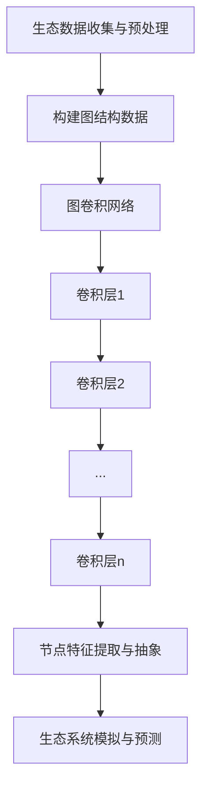

# 基于图卷积网络的复杂系统推理在生态系统模拟中的应用

> 关键词：图卷积网络、复杂系统推理、生态系统模拟、深度学习、网络模型

> 摘要：本文聚焦于基于图卷积网络的复杂系统推理在生态系统模拟中的应用。首先介绍了相关的背景知识，包括研究目的、预期读者、文档结构和术语表等。接着阐述了图卷积网络及复杂系统推理的核心概念与联系，通过文本示意图和 Mermaid 流程图进行清晰展示。详细讲解了核心算法原理，并给出 Python 源代码示例。深入探讨了数学模型和公式，辅以举例说明。通过项目实战，从开发环境搭建到源代码实现与解读，全面展示了如何在实际中运用该技术。分析了其实际应用场景，推荐了相关的学习资源、开发工具框架和论文著作。最后总结了未来发展趋势与挑战，提供常见问题解答和扩展阅读参考资料，旨在为相关领域的研究和实践提供全面且深入的指导。

## 1. 背景介绍 
### 1.1 目的和范围
生态系统是一个极其复杂的系统，包含了众多的生物和非生物因素，它们之间相互作用、相互影响。传统的生态系统模拟方法往往难以全面、准确地捕捉这些复杂的相互关系。本研究的目的在于探索如何利用图卷积网络的强大能力，对生态系统中的复杂关系进行建模和推理，从而实现更精准的生态系统模拟。

本研究的范围涵盖了图卷积网络的基本原理、复杂系统推理的相关理论，以及如何将这些技术应用于生态系统模拟的各个环节。包括从生态数据的收集和预处理，到图卷积网络模型的构建、训练和优化，再到模拟结果的分析和验证等。

### 1.2 预期读者
本文预期读者包括生态科学领域的研究人员、计算机科学领域的学者和工程师、对生态系统模拟和深度学习技术感兴趣的学生和爱好者等。对于生态科学研究人员，本文可以为他们提供新的研究思路和方法，帮助他们更好地理解和模拟生态系统的动态变化。对于计算机科学领域的人员，本文可以展示图卷积网络在实际应用中的潜力和挑战，促进跨学科的研究和合作。对于学生和爱好者，本文可以作为一个入门的参考资料，引导他们进入这个充满挑战和机遇的领域。

### 1.3 文档结构概述
本文共分为十个部分。第一部分是背景介绍，包括研究目的、预期读者、文档结构概述和术语表。第二部分阐述核心概念与联系，通过文本示意图和 Mermaid 流程图展示图卷积网络和复杂系统推理的相关概念。第三部分讲解核心算法原理，并给出 Python 源代码示例。第四部分探讨数学模型和公式，辅以举例说明。第五部分是项目实战，包括开发环境搭建、源代码详细实现和代码解读。第六部分分析实际应用场景。第七部分推荐相关的工具和资源，包括学习资源、开发工具框架和论文著作。第八部分总结未来发展趋势与挑战。第九部分是附录，提供常见问题与解答。第十部分是扩展阅读和参考资料。

### 1.4 术语表
#### 1.4.1 核心术语定义
- **图卷积网络（Graph Convolutional Network, GCN）**：是一种专门用于处理图结构数据的深度学习模型，它通过对图中节点及其邻居节点的特征进行卷积操作，来学习节点的表示。
- **复杂系统推理**：是指对具有复杂结构和相互关系的系统进行分析和推断的过程，旨在理解系统的行为和动态变化。
- **生态系统模拟**：是指利用数学模型和计算机技术，对生态系统的结构、功能和动态变化进行模拟和预测的过程。

#### 1.4.2 相关概念解释
- **图结构数据**：是一种由节点和边组成的数据结构，节点表示实体，边表示实体之间的关系。在生态系统中，节点可以表示生物个体、物种或生态环境因素，边可以表示它们之间的相互作用，如捕食、竞争、共生等。
- **卷积操作**：是一种在信号处理和图像处理中广泛应用的操作，它通过对输入数据和卷积核进行加权求和，来提取数据的特征。在图卷积网络中，卷积操作是对图中节点及其邻居节点的特征进行加权求和，以学习节点的表示。

#### 1.4.3 缩略词列表
- **GCN**：Graph Convolutional Network（图卷积网络）
- **MLP**：Multi - Layer Perceptron（多层感知机）
- **ReLU**：Rectified Linear Unit（修正线性单元）

## 2. 核心概念与联系 
### 核心概念原理
#### 图卷积网络（GCN）
图卷积网络是一种基于图结构数据的深度学习模型。传统的卷积神经网络（CNN）主要用于处理规则的网格结构数据，如图像和音频。而图结构数据的节点和边的连接关系是不规则的，GCN 可以有效地处理这种不规则的数据。

GCN 的基本思想是通过对节点及其邻居节点的特征进行聚合和变换，来学习节点的表示。具体来说，GCN 的每一层都会将节点的特征与邻居节点的特征进行加权求和，并通过一个非线性激活函数进行变换，得到新的节点特征。

#### 复杂系统推理
复杂系统是指由大量相互作用的组件组成的系统，其行为和动态变化往往具有高度的复杂性和不确定性。复杂系统推理的目标是通过对系统的结构、行为和相互关系的分析，来理解系统的运行机制和预测系统的未来状态。

在生态系统中，复杂系统推理可以帮助我们理解生物之间的相互作用、生态环境因素对生物的影响，以及生态系统的整体动态变化。通过图卷积网络，我们可以将生态系统表示为一个图结构，节点表示生物个体、物种或生态环境因素，边表示它们之间的相互作用，从而利用 GCN 进行复杂系统推理。

### 架构的文本示意图
我们可以将生态系统模拟中的图卷积网络架构描述如下：

首先，生态数据被收集和预处理，形成图结构数据。图中的节点包含生物个体、物种或生态环境因素的特征信息，边表示它们之间的相互作用关系。

然后，这些图结构数据被输入到图卷积网络中。图卷积网络通常由多个卷积层组成，每一层都会对节点的特征进行更新。在每一层中，节点会收集其邻居节点的特征，并进行加权求和，然后通过一个非线性激活函数进行变换，得到新的节点特征。

最后，经过多层卷积操作后，节点的特征被进一步提取和抽象，得到最终的节点表示。这些节点表示可以用于生态系统的模拟和预测，例如预测物种的分布、生态系统的稳定性等。

### Mermaid 流程图


## 3. 核心算法原理 & 具体操作步骤 
### 核心算法原理
图卷积网络的核心算法基于消息传递机制。在每一层的卷积操作中，节点会从其邻居节点接收消息，并将这些消息与自身的特征进行聚合和变换。

具体来说，设图 $G=(V, E)$，其中 $V$ 是节点集合，$E$ 是边集合。节点 $i$ 的特征向量为 $h_i^{(l)}$，其中 $l$ 表示当前的卷积层。节点 $i$ 的邻居节点集合为 $N(i)$。

在第 $l + 1$ 层的卷积操作中，节点 $i$ 的新特征向量 $h_i^{(l + 1)}$ 可以通过以下公式计算：

$$h_i^{(l + 1)} = \sigma\left(\sum_{j\in N(i)\cup\{i\}}\frac{1}{\sqrt{d_i d_j}}W^{(l)}h_j^{(l)}\right)$$

其中，$d_i$ 和 $d_j$ 分别是节点 $i$ 和节点 $j$ 的度，$W^{(l)}$ 是第 $l$ 层的可学习权重矩阵，$\sigma$ 是非线性激活函数，如 ReLU 函数。

### 具体操作步骤
1. **数据准备**：收集生态系统的相关数据，包括生物个体、物种的特征信息和它们之间的相互关系。将这些数据预处理成图结构数据，节点表示生物个体、物种或生态环境因素，边表示它们之间的相互作用。
2. **模型构建**：构建图卷积网络模型，确定网络的层数、每层的神经元数量和激活函数等超参数。
3. **模型训练**：使用准备好的图结构数据对图卷积网络模型进行训练。在训练过程中，通过最小化损失函数来调整模型的参数，使得模型能够更好地学习图中节点的特征表示。
4. **模型评估**：使用测试数据对训练好的模型进行评估，计算模型的性能指标，如准确率、召回率等。
5. **生态系统模拟与预测**：使用训练好的模型对生态系统进行模拟和预测，例如预测物种的分布、生态系统的稳定性等。

### Python 源代码示例
```python
import torch
import torch.nn.functional as F
from torch_geometric.nn import GCNConv

# 定义图卷积网络模型
class GCN(torch.nn.Module):
    def __init__(self, in_channels, hidden_channels, out_channels):
        super(GCN, self).__init__()
        self.conv1 = GCNConv(in_channels, hidden_channels)
        self.conv2 = GCNConv(hidden_channels, out_channels)

    def forward(self, x, edge_index):
        x = self.conv1(x, edge_index)
        x = F.relu(x)
        x = F.dropout(x, training=self.training)
        x = self.conv2(x, edge_index)
        return F.log_softmax(x, dim=1)

# 初始化模型
in_channels = 16  # 输入特征维度
hidden_channels = 32  # 隐藏层维度
out_channels = 8  # 输出特征维度
model = GCN(in_channels, hidden_channels, out_channels)

# 定义优化器和损失函数
optimizer = torch.optim.Adam(model.parameters(), lr=0.01)
criterion = torch.nn.NLLLoss()

# 模拟训练数据
x = torch.randn(100, in_channels)  # 节点特征
edge_index = torch.tensor([[0, 1, 1, 2], [1, 0, 2, 1]], dtype=torch.long)  # 边索引
y = torch.randint(0, out_channels, (100,))  # 节点标签

# 训练模型
for epoch in range(200):
    model.train()
    optimizer.zero_grad()
    out = model(x, edge_index)
    loss = criterion(out, y)
    loss.backward()
    optimizer.step()
    if (epoch + 1) % 10 == 0:
        print(f'Epoch: {epoch + 1}, Loss: {loss.item()}')
```

## 4. 数学模型和公式 & 详细讲解 & 举例说明 
### 数学模型和公式
#### 图卷积操作的数学公式
如前所述，图卷积网络的核心操作是图卷积操作，其数学公式为：

$$h_i^{(l + 1)} = \sigma\left(\sum_{j\in N(i)\cup\{i\}}\frac{1}{\sqrt{d_i d_j}}W^{(l)}h_j^{(l)}\right)$$

其中：
- $h_i^{(l)}$ 是节点 $i$ 在第 $l$ 层的特征向量。
- $N(i)$ 是节点 $i$ 的邻居节点集合。
- $d_i$ 和 $d_j$ 分别是节点 $i$ 和节点 $j$ 的度。
- $W^{(l)}$ 是第 $l$ 层的可学习权重矩阵。
- $\sigma$ 是非线性激活函数，如 ReLU 函数，定义为 $\sigma(x)=\max(0, x)$。

#### 损失函数
在图卷积网络的训练过程中，通常使用交叉熵损失函数来衡量模型的预测结果与真实标签之间的差异。对于分类任务，交叉熵损失函数的公式为：

$$L = -\frac{1}{N}\sum_{i = 1}^{N}\sum_{k = 1}^{K}y_{ik}\log(p_{ik})$$

其中：
- $N$ 是节点的数量。
- $K$ 是类别的数量。
- $y_{ik}$ 是节点 $i$ 属于类别 $k$ 的真实标签，通常是一个 one - hot 向量。
- $p_{ik}$ 是模型预测节点 $i$ 属于类别 $k$ 的概率。

### 详细讲解
#### 图卷积操作
图卷积操作的核心思想是通过对节点及其邻居节点的特征进行加权求和，来学习节点的表示。权重 $\frac{1}{\sqrt{d_i d_j}}$ 是为了对不同度的节点进行归一化，使得不同节点的贡献更加均衡。

可学习权重矩阵 $W^{(l)}$ 用于对节点的特征进行线性变换，从而提取节点的有用信息。非线性激活函数 $\sigma$ 则引入了非线性因素，使得模型能够学习到更复杂的特征表示。

#### 损失函数
交叉熵损失函数的目的是最小化模型的预测结果与真实标签之间的差异。当模型的预测结果与真实标签越接近时，交叉熵损失函数的值越小。在训练过程中，通过不断调整模型的参数，使得损失函数的值逐渐减小，从而提高模型的性能。

### 举例说明
假设我们有一个简单的图，包含 3 个节点，节点的特征向量维度为 2。节点的特征矩阵 $X$ 为：

$$X=\begin{bmatrix}1 & 2\\3 & 4\\5 & 6\end{bmatrix}$$

边索引矩阵为：

$$edge\_index=\begin{bmatrix}0 & 1\\1 & 0\\1 & 2\\2 & 1\end{bmatrix}$$

节点的度分别为 $d_0 = 1$，$d_1 = 2$，$d_2 = 1$。

设第一层的可学习权重矩阵 $W^{(0)}$ 为：

$$W^{(0)}=\begin{bmatrix}0.1 & 0.2\\0.3 & 0.4\end{bmatrix}$$

非线性激活函数 $\sigma$ 为 ReLU 函数。

首先，对于节点 0，其邻居节点为 1。根据图卷积操作的公式：

$$h_0^{(1)} = \sigma\left(\frac{1}{\sqrt{d_0 d_1}}W^{(0)}h_0^{(0)}+\frac{1}{\sqrt{d_0 d_1}}W^{(0)}h_1^{(0)}\right)$$

计算可得：

$$\frac{1}{\sqrt{d_0 d_1}}W^{(0)}h_0^{(0)}=\frac{1}{\sqrt{1\times2}}\begin{bmatrix}0.1 & 0.2\\0.3 & 0.4\end{bmatrix}\begin{bmatrix}1\\2\end{bmatrix}=\frac{1}{\sqrt{2}}\begin{bmatrix}0.5\\1.1\end{bmatrix}$$

$$\frac{1}{\sqrt{d_0 d_1}}W^{(0)}h_1^{(0)}=\frac{1}{\sqrt{1\times2}}\begin{bmatrix}0.1 & 0.2\\0.3 & 0.4\end{bmatrix}\begin{bmatrix}3\\4\end{bmatrix}=\frac{1}{\sqrt{2}}\begin{bmatrix}1.1\\2.5\end{bmatrix}$$

$$h_0^{(1)} = \sigma\left(\frac{1}{\sqrt{2}}\begin{bmatrix}0.5 + 1.1\\1.1+2.5\end{bmatrix}\right)=\sigma\left(\frac{1}{\sqrt{2}}\begin{bmatrix}1.6\\3.6\end{bmatrix}\right)=\begin{bmatrix}\max(0,\frac{1.6}{\sqrt{2}})\\\max(0,\frac{3.6}{\sqrt{2}})\end{bmatrix}\approx\begin{bmatrix}1.13\\2.55\end{bmatrix}$$

同理，可以计算出节点 1 和节点 2 的新特征向量。

## 5. 项目实战：代码实际案例和详细解释说明 
### 5.1  开发环境搭建
#### 安装 Python
首先，确保你已经安装了 Python 3.6 或更高版本。你可以从 Python 官方网站（https://www.python.org/downloads/） 下载并安装适合你操作系统的 Python 版本。

#### 安装 PyTorch 和 PyTorch Geometric
PyTorch 是一个广泛使用的深度学习框架，PyTorch Geometric 是一个专门用于处理图结构数据的库。你可以使用以下命令安装它们：

```bash
pip install torch
pip install torch-geometric
```

#### 安装其他依赖库
还需要安装一些其他的依赖库，如 NumPy、Matplotlib 等。可以使用以下命令安装：

```bash
pip install numpy matplotlib
```

### 5.2  源代码详细实现和代码解读
```python
import torch
import torch.nn.functional as F
from torch_geometric.data import Data
from torch_geometric.nn import GCNConv
import numpy as np
import matplotlib.pyplot as plt

# 定义图卷积网络模型
class GCN(torch.nn.Module):
    def __init__(self, in_channels, hidden_channels, out_channels):
        super(GCN, self).__init__()
        self.conv1 = GCNConv(in_channels, hidden_channels)
        self.conv2 = GCNConv(hidden_channels, out_channels)

    def forward(self, x, edge_index):
        x = self.conv1(x, edge_index)
        x = F.relu(x)
        x = F.dropout(x, training=self.training)
        x = self.conv2(x, edge_index)
        return F.log_softmax(x, dim=1)

# 生成模拟生态数据
# 节点特征
x = torch.tensor([[1, 2], [3, 4], [5, 6], [7, 8]], dtype=torch.float)
# 边索引
edge_index = torch.tensor([[0, 1, 1, 2, 2, 3], [1, 0, 2, 1, 3, 2]], dtype=torch.long)
# 节点标签
y = torch.tensor([0, 1, 0, 1], dtype=torch.long)

# 创建图数据对象
data = Data(x=x, edge_index=edge_index, y=y)

# 初始化模型
in_channels = 2  # 输入特征维度
hidden_channels = 16  # 隐藏层维度
out_channels = 2  # 输出特征维度
model = GCN(in_channels, hidden_channels, out_channels)

# 定义优化器和损失函数
optimizer = torch.optim.Adam(model.parameters(), lr=0.01)
criterion = torch.nn.NLLLoss()

# 训练模型
losses = []
for epoch in range(200):
    model.train()
    optimizer.zero_grad()
    out = model(data.x, data.edge_index)
    loss = criterion(out, data.y)
    loss.backward()
    optimizer.step()
    losses.append(loss.item())
    if (epoch + 1) % 10 == 0:
        print(f'Epoch: {epoch + 1}, Loss: {loss.item()}')

# 绘制损失曲线
plt.plot(losses)
plt.xlabel('Epoch')
plt.ylabel('Loss')
plt.title('Training Loss')
plt.show()
```

### 5.3  代码解读与分析
#### 模型定义
`GCN` 类定义了一个简单的图卷积网络模型，包含两个图卷积层。在 `__init__` 方法中，初始化了两个 `GCNConv` 层，分别用于特征提取和分类。在 `forward` 方法中，定义了模型的前向传播过程，包括卷积操作、ReLU 激活函数和 Dropout 操作，最后通过 `log_softmax` 函数输出分类概率。

#### 数据生成
使用 `torch.tensor` 生成模拟的节点特征、边索引和节点标签。然后使用 `Data` 类创建图数据对象。

#### 模型训练
使用 Adam 优化器和 NLLLoss 损失函数进行模型训练。在每个训练 epoch 中，首先将模型设置为训练模式，然后进行前向传播计算损失，接着进行反向传播更新模型参数。

#### 损失曲线绘制
使用 Matplotlib 库绘制训练过程中的损失曲线，直观地展示模型的训练过程。

## 6. 实际应用场景 
### 物种分布预测
生态系统中的物种分布受到多种因素的影响，如气候、地形、食物资源等。通过将这些因素表示为图结构数据，利用图卷积网络进行复杂系统推理，可以预测物种在不同环境条件下的分布情况。例如，预测某种珍稀植物在不同气候区域的分布范围，为物种保护提供科学依据。

### 生态系统稳定性评估
生态系统的稳定性取决于生物之间的相互作用和生态环境的变化。图卷积网络可以对生态系统中的复杂关系进行建模和分析，评估生态系统的稳定性。例如，通过分析食物链中物种之间的捕食和竞争关系，预测生态系统在受到外部干扰时的响应，为生态系统的管理和保护提供决策支持。

### 生态修复方案设计
在生态修复过程中，需要了解生态系统的现状和问题，以及不同修复措施对生态系统的影响。图卷积网络可以帮助我们模拟不同修复方案下生态系统的动态变化，评估修复方案的效果，从而选择最优的生态修复方案。例如，在湿地生态修复中，通过模拟不同植被恢复方案对湿地生态系统的影响，选择最适合的植被种植方案。

## 7. 工具和资源推荐
### 7.1 学习资源推荐
#### 7.1.1 书籍推荐
- 《深度学习》（Deep Learning）：由 Ian Goodfellow、Yoshua Bengio 和 Aaron Courville 所著，是深度学习领域的经典教材，涵盖了深度学习的基本原理、算法和应用。
- 《图神经网络入门》（Graph Neural Networks: Foundations, Frontiers, and Applications）：全面介绍了图神经网络的基本概念、算法和应用，对于理解图卷积网络有很大的帮助。

#### 7.1.2 在线课程
- Coursera 上的“深度学习专项课程”（Deep Learning Specialization）：由 Andrew Ng 教授主讲，是深度学习领域的经典在线课程，涵盖了深度学习的各个方面。
- edX 上的“图神经网络”（Graph Neural Networks）：详细介绍了图神经网络的原理、算法和应用，适合对图卷积网络感兴趣的学习者。

#### 7.1.3 技术博客和网站
- Medium 上的 Towards Data Science：是一个关于数据科学和机器学习的技术博客平台，有很多关于图卷积网络和生态系统模拟的优秀文章。
- arXiv 网站：是一个预印本论文库，包含了很多最新的关于图卷积网络和生态系统模拟的研究成果。

### 7.2 开发工具框架推荐
#### 7.2.1 IDE和编辑器
- PyCharm：是一个专门用于 Python 开发的集成开发环境，具有强大的代码编辑、调试和项目管理功能。
- Jupyter Notebook：是一个交互式的开发环境，适合进行数据探索、模型训练和结果可视化。

#### 7.2.2 调试和性能分析工具
- PyTorch Profiler：是 PyTorch 自带的性能分析工具，可以帮助我们分析模型的训练时间、内存使用等性能指标。
- TensorBoard：是一个可视化工具，可以帮助我们可视化模型的训练过程、损失曲线、准确率等指标。

#### 7.2.3 相关框架和库
- PyTorch Geometric：是一个专门用于处理图结构数据的 PyTorch 扩展库，提供了丰富的图神经网络模型和工具。
- NetworkX：是一个用于创建、操作和研究复杂网络的 Python 库，可以帮助我们构建和分析图结构数据。

### 7.3 相关论文著作推荐
#### 7.3.1 经典论文
- “Semi - Supervised Classification with Graph Convolutional Networks”：提出了图卷积网络的基本框架，是图卷积网络领域的经典论文。
- “Graph Attention Networks”：提出了图注意力网络，为图神经网络的发展提供了新的思路。

#### 7.3.2 最新研究成果
- 关注 arXiv 上的最新预印本论文，了解图卷积网络在生态系统模拟中的最新研究进展。

#### 7.3.3 应用案例分析
- 查阅相关的学术期刊和会议论文，了解图卷积网络在生态系统模拟中的实际应用案例，学习他人的经验和方法。

## 8. 总结：未来发展趋势与挑战
### 未来发展趋势
#### 多模态数据融合
未来的生态系统模拟可能会融合更多的多模态数据，如遥感图像、气象数据、生物监测数据等。图卷积网络可以更好地处理这些多模态数据之间的复杂关系，提高生态系统模拟的准确性和可靠性。

#### 强化学习与图卷积网络的结合
强化学习可以用于优化生态系统的管理和决策。将强化学习与图卷积网络相结合，可以在动态的生态系统环境中进行实时的决策和优化，提高生态系统的管理效率。

#### 跨学科研究的深入
生态系统模拟是一个跨学科的研究领域，涉及生态科学、计算机科学、数学等多个学科。未来的研究将更加注重跨学科的合作和交流，推动图卷积网络在生态系统模拟中的应用和发展。

### 挑战
#### 数据质量和可用性
生态系统的数据往往具有复杂性、不确定性和高维性，数据的质量和可用性是影响图卷积网络应用效果的重要因素。如何收集、整理和预处理高质量的生态数据是一个亟待解决的问题。

#### 模型解释性
图卷积网络是一种深度学习模型，其模型结构和决策过程往往比较复杂，缺乏解释性。在生态系统模拟中，需要对模型的预测结果进行解释和理解，以便为生态决策提供科学依据。如何提高图卷积网络的解释性是一个重要的挑战。

#### 计算资源需求
图卷积网络的训练和推理需要大量的计算资源，尤其是在处理大规模的生态系统数据时。如何优化图卷积网络的算法和模型结构，降低计算资源需求，是一个需要解决的问题。

## 9. 附录：常见问题与解答
### 问题 1：图卷积网络与传统的卷积神经网络有什么区别？
答：传统的卷积神经网络主要用于处理规则的网格结构数据，如图像和音频。而图卷积网络可以处理不规则的图结构数据，节点和边的连接关系可以是任意的。图卷积网络通过对节点及其邻居节点的特征进行聚合和变换，来学习节点的表示。

### 问题 2：如何选择图卷积网络的超参数？
答：选择图卷积网络的超参数通常需要进行实验和调优。常见的超参数包括网络的层数、每层的神经元数量、学习率、Dropout 率等。可以使用网格搜索、随机搜索等方法来寻找最优的超参数组合。

### 问题 3：图卷积网络在生态系统模拟中的应用有哪些局限性？
答：图卷积网络在生态系统模拟中的应用存在一些局限性。例如，生态系统的数据往往具有复杂性和不确定性，图卷积网络可能无法完全捕捉这些复杂的关系。此外，图卷积网络的模型解释性较差，难以对模型的预测结果进行解释和理解。

## 10. 扩展阅读 & 参考资料
### 扩展阅读
- 《生态系统建模与模拟》：深入介绍了生态系统建模和模拟的方法和技术，对于理解生态系统模拟的原理和应用有很大的帮助。
- 《深度学习进阶：算法与应用》：进一步探讨了深度学习的高级算法和应用，对于深入理解图卷积网络的原理和实现有一定的参考价值。

### 参考资料
- Kipf, T. N., & Welling, M. (2016). Semi - Supervised Classification with Graph Convolutional Networks. arXiv preprint arXiv:1609.02907.
- Veličković, P., Cucurull, G., Casanova, A., Romero, A., Lio, P., & Bengio, Y. (2017). Graph Attention Networks. arXiv preprint arXiv:1710.10903.
- 相关的学术期刊和会议论文，如《Ecology》、《Journal of Artificial Intelligence Research》等。