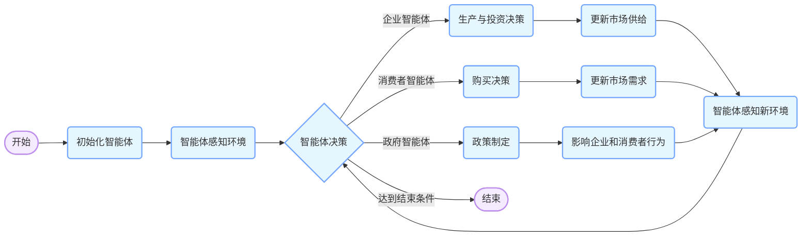

# 基于多智能体的自动化产业周期分析

> 关键词：多智能体、自动化产业、产业周期分析、智能体交互、系统建模

> 摘要：本文聚焦于基于多智能体的自动化产业周期分析，旨在深入探究多智能体系统在自动化产业周期研究中的应用。通过介绍多智能体的核心概念、算法原理、数学模型等内容，结合项目实战案例，详细阐述如何运用多智能体技术对自动化产业周期进行分析。同时，探讨了该技术在实际应用场景中的作用，推荐了相关的学习资源、开发工具和论文著作，最后总结了未来发展趋势与挑战，为自动化产业周期分析提供了全面且深入的技术视角和研究思路。

## 1. 背景介绍 
### 1.1 目的和范围
自动化产业在现代经济中占据着至关重要的地位，其发展呈现出明显的周期性特征。准确分析自动化产业周期对于企业制定战略决策、政府进行产业规划以及投资者把握市场趋势都具有重要意义。本研究的目的在于引入多智能体技术，构建一个更加准确、动态的自动化产业周期分析模型，从而更深入地理解自动化产业的发展规律。

本研究的范围涵盖了多智能体系统的基本原理、自动化产业周期的基本概念、基于多智能体的自动化产业周期分析的算法与模型，以及实际应用案例的分析。同时，对相关的工具、资源和未来发展趋势也进行了探讨。

### 1.2 预期读者
本文预期读者包括自动化产业领域的企业管理者、技术研发人员、政府产业政策制定者、投资机构的分析师以及对多智能体技术和产业周期分析感兴趣的研究人员和学生。

### 1.3 文档结构概述
本文首先介绍了研究的背景和相关概念，包括多智能体和自动化产业周期的基本定义。接着阐述了多智能体系统的核心概念与联系，通过文本示意图和 Mermaid 流程图进行详细说明。然后讲解了基于多智能体的自动化产业周期分析的核心算法原理和具体操作步骤，包括 Python 源代码的实现。之后介绍了相关的数学模型和公式，并通过举例进行详细讲解。再通过项目实战案例，展示了代码的实际实现和详细解释。随后探讨了该技术在实际应用场景中的作用。接着推荐了相关的学习资源、开发工具和论文著作。最后总结了未来发展趋势与挑战，并提供了常见问题与解答以及扩展阅读和参考资料。

### 1.4 术语表
#### 1.4.1 核心术语定义
- **多智能体系统（Multi - Agent System, MAS）**：由多个智能体组成的系统，智能体之间通过交互和协作来完成特定的任务。智能体具有自主性、反应性、社会性等特点。
- **自动化产业**：利用自动化技术进行生产、服务等活动的产业，包括工业自动化、办公自动化、家居自动化等多个领域。
- **产业周期**：指产业从诞生、成长、成熟到衰退的整个过程，通常可以分为导入期、成长期、成熟期和衰退期四个阶段。
- **智能体**：具有一定的感知能力、决策能力和行动能力的实体，可以是软件程序、机器人等。

#### 1.4.2 相关概念解释
- **智能体的自主性**：智能体能够在一定程度上独立地做出决策和采取行动，不受外部的直接控制。
- **智能体的反应性**：智能体能够对外部环境的变化做出及时的反应，调整自己的行为。
- **智能体的社会性**：智能体能够与其他智能体进行交互和协作，共同完成任务。

#### 1.4.3 缩略词列表
- **MAS**：Multi - Agent System（多智能体系统）
- **AI**：Artificial Intelligence（人工智能）

## 2. 核心概念与联系 
### 多智能体系统的核心概念
多智能体系统是由多个智能体组成的复杂系统。每个智能体都有自己的目标、知识和能力，并且能够与其他智能体进行交互。智能体的行为可以基于规则、机器学习算法或其他决策机制。

智能体之间的交互方式包括通信、合作、竞争等。通信是智能体之间交换信息的过程，合作是指智能体为了共同的目标而协同工作，竞争则是指智能体为了争夺资源或实现自己的目标而相互竞争。

### 多智能体与自动化产业周期的联系
在自动化产业周期分析中，多智能体系统可以用来模拟产业中不同参与者的行为和决策。例如，可以将企业、消费者、政府等视为不同的智能体，每个智能体都有自己的行为规则和目标。通过模拟这些智能体之间的交互，可以更深入地理解自动化产业的发展过程和周期变化。

### 文本示意图
多智能体系统在自动化产业周期分析中的应用可以用以下文本示意图表示：

多智能体系统包含多个智能体，这些智能体包括企业智能体、消费者智能体、政府智能体等。企业智能体的目标是追求利润最大化，它会根据市场需求、技术发展等因素进行生产决策和投资决策。消费者智能体的目标是满足自己的需求，它会根据产品价格、质量等因素进行购买决策。政府智能体的目标是促进产业的健康发展，它会通过制定政策、提供支持等方式来影响产业的发展。

这些智能体之间通过信息交互和行为交互相互影响。例如，企业智能体的生产决策会影响市场的供给，消费者智能体的购买决策会影响市场的需求，政府智能体的政策会影响企业和消费者的行为。通过模拟这些智能体之间的交互，可以得到自动化产业的发展轨迹，从而分析产业周期。

### Mermaid 流程图


## 3. 核心算法原理 & 具体操作步骤 
### 核心算法原理
基于多智能体的自动化产业周期分析的核心算法是模拟智能体的行为和交互。每个智能体都有自己的决策模型，根据感知到的环境信息和自身的目标来做出决策。

以下是一个简单的企业智能体决策模型的 Python 代码示例：

```python
import random

class EnterpriseAgent:
    def __init__(self, initial_capital, production_cost):
        self.capital = initial_capital
        self.production_cost = production_cost
        self.production_volume = 0

    def perceive_environment(self, market_demand, market_price):
        self.market_demand = market_demand
        self.market_price = market_price

    def make_decision(self):
        # 简单的决策规则：如果市场价格高于生产成本且有足够的资本，则增加生产
        if self.market_price > self.production_cost and self.capital > self.production_cost:
            self.production_volume += 1
            self.capital -= self.production_cost
        else:
            self.production_volume = 0

    def update_capital(self):
        revenue = self.production_volume * self.market_price
        self.capital += revenue
```

### 具体操作步骤
1. **初始化智能体**：根据实际情况初始化不同类型的智能体，包括企业智能体、消费者智能体、政府智能体等，并设置它们的初始属性，如企业的初始资本、生产成本，消费者的初始需求等。
2. **智能体感知环境**：每个智能体获取当前的环境信息，如市场需求、市场价格、政策等。
3. **智能体决策**：每个智能体根据感知到的环境信息和自身的目标进行决策，如企业智能体决定生产和投资，消费者智能体决定购买，政府智能体决定政策。
4. **更新环境**：根据智能体的决策更新环境信息，如更新市场供给、市场需求等。
5. **重复步骤 2 - 4**：不断重复上述步骤，模拟智能体的交互和产业的发展过程。
6. **分析结果**：根据模拟的结果分析自动化产业的发展轨迹和周期变化。

## 4. 数学模型和公式 & 详细讲解 & 举例说明 
### 数学模型
在基于多智能体的自动化产业周期分析中，可以使用以下数学模型来描述智能体的行为和产业的发展。

#### 企业智能体的生产决策模型
设 $C_t$ 为企业在第 $t$ 期的资本，$c$ 为单位生产成本，$p_t$ 为第 $t$ 期的市场价格，$q_t$ 为第 $t$ 期的生产数量。则企业的生产决策可以表示为：

$$
q_t = 
\begin{cases}
1, & \text{if } p_t > c \text{ and } C_t > c \\
0, & \text{otherwise}
\end{cases}
$$

企业的资本更新公式为：

$$
C_{t + 1} = C_t - cq_t + p_tq_t
$$

#### 市场均衡模型
市场均衡是指市场供给和市场需求相等的状态。设 $Q^s_t$ 为第 $t$ 期的市场供给，$Q^d_t$ 为第 $t$ 期的市场需求，则市场均衡条件为：

$$
Q^s_t = Q^d_t
$$

市场价格可以通过供求关系来确定，例如使用线性需求和供给函数：

$$
Q^d_t = a - bp_t
$$

$$
Q^s_t = \sum_{i = 1}^{n} q_{it}
$$

其中 $a$ 和 $b$ 为需求函数的参数，$n$ 为企业的数量。

### 详细讲解
企业智能体的生产决策模型表示企业会根据市场价格和自身资本情况来决定是否进行生产。如果市场价格高于生产成本且企业有足够的资本，企业会增加生产；否则，企业会停止生产。

市场均衡模型描述了市场供给和市场需求之间的关系。当市场供给等于市场需求时，市场达到均衡状态。市场价格通过供求关系来确定，需求函数表示消费者对产品的需求与价格之间的关系，供给函数表示企业的生产总量。

### 举例说明
假设市场需求函数为 $Q^d = 100 - 2p$，有 10 个企业，每个企业的生产成本 $c = 10$，初始资本 $C_0 = 50$。

在第 1 期，市场价格 $p_1 = 20$。对于每个企业，由于 $p_1 > c$ 且 $C_0 > c$，每个企业都会生产 1 个单位的产品，所以市场供给 $Q^s_1 = 10$。

根据市场需求函数，$Q^d_1 = 100 - 2\times20 = 60$。由于 $Q^d_1 > Q^s_1$，市场供不应求，价格可能会上升。

在第 2 期，假设价格上升到 $p_2 = 30$。同样，每个企业都会生产 1 个单位的产品，$Q^s_2 = 10$，$Q^d_2 = 100 - 2\times30 = 40$。市场仍然供不应求，但差距缩小。

随着时间的推移，企业会根据市场价格和自身资本情况不断调整生产决策，市场价格也会不断变化，从而模拟出产业的发展过程。

## 5. 项目实战：代码实际案例和详细解释说明 
### 5.1  开发环境搭建
本项目使用 Python 语言进行开发，推荐使用 Anaconda 作为 Python 环境管理工具。以下是具体的环境搭建步骤：

1. **安装 Anaconda**：从 Anaconda 官方网站（https://www.anaconda.com/products/individual）下载适合自己操作系统的 Anaconda 安装包，并按照安装向导进行安装。
2. **创建虚拟环境**：打开 Anaconda Prompt（Windows）或终端（Linux/Mac），输入以下命令创建一个新的虚拟环境：
```sh
conda create -n mas_automation python=3.8
```
3. **激活虚拟环境**：输入以下命令激活虚拟环境：
```sh
conda activate mas_automation
```
4. **安装必要的库**：本项目需要使用 `numpy`、`matplotlib` 等库，输入以下命令进行安装：
```sh
pip install numpy matplotlib
```

### 5.2  源代码详细实现和代码解读
以下是一个完整的基于多智能体的自动化产业周期分析的 Python 代码示例：

```python
import numpy as np
import matplotlib.pyplot as plt

# 定义企业智能体类
class EnterpriseAgent:
    def __init__(self, initial_capital, production_cost):
        self.capital = initial_capital
        self.production_cost = production_cost
        self.production_volume = 0

    def perceive_environment(self, market_demand, market_price):
        self.market_demand = market_demand
        self.market_price = market_price

    def make_decision(self):
        if self.market_price > self.production_cost and self.capital > self.production_cost:
            self.production_volume += 1
            self.capital -= self.production_cost
        else:
            self.production_volume = 0

    def update_capital(self):
        revenue = self.production_volume * self.market_price
        self.capital += revenue

# 定义市场类
class Market:
    def __init__(self, a, b, num_enterprises, initial_capital, production_cost):
        self.a = a
        self.b = b
        self.num_enterprises = num_enterprises
        self.enterprises = [EnterpriseAgent(initial_capital, production_cost) for _ in range(num_enterprises)]
        self.time_steps = []
        self.market_prices = []
        self.market_demands = []
        self.market_supplies = []

    def run_simulation(self, num_steps):
        for t in range(num_steps):
            # 计算市场需求
            market_price = np.random.uniform(10, 50)
            market_demand = self.a - self.b * market_price

            # 智能体感知环境
            for enterprise in self.enterprises:
                enterprise.perceive_environment(market_demand, market_price)

            # 智能体决策
            for enterprise in self.enterprises:
                enterprise.make_decision()

            # 计算市场供给
            market_supply = sum([enterprise.production_volume for enterprise in self.enterprises])

            # 智能体更新资本
            for enterprise in self.enterprises:
                enterprise.update_capital()

            # 记录数据
            self.time_steps.append(t)
            self.market_prices.append(market_price)
            self.market_demands.append(market_demand)
            self.market_supplies.append(market_supply)

    def plot_results(self):
        plt.figure(figsize=(12, 6))
        plt.subplot(2, 1, 1)
        plt.plot(self.time_steps, self.market_prices, label='Market Price')
        plt.xlabel('Time Step')
        plt.ylabel('Price')
        plt.legend()

        plt.subplot(2, 1, 2)
        plt.plot(self.time_steps, self.market_demands, label='Market Demand')
        plt.plot(self.time_steps, self.market_supplies, label='Market Supply')
        plt.xlabel('Time Step')
        plt.ylabel('Quantity')
        plt.legend()

        plt.show()

# 主函数
if __name__ == '__main__':
    a = 100
    b = 2
    num_enterprises = 10
    initial_capital = 50
    production_cost = 10
    num_steps = 50

    market = Market(a, b, num_enterprises, initial_capital, production_cost)
    market.run_simulation(num_steps)
    market.plot_results()
```

### 5.3  代码解读与分析
- **EnterpriseAgent 类**：表示企业智能体，包含初始化方法 `__init__`、感知环境方法 `perceive_environment`、决策方法 `make_decision` 和更新资本方法 `update_capital`。
- **Market 类**：表示市场，包含初始化方法 `__init__`、运行模拟方法 `run_simulation` 和绘制结果方法 `plot_results`。在 `run_simulation` 方法中，模拟了智能体的感知、决策、市场供给和需求的计算以及智能体资本的更新过程。
- **主函数**：设置市场参数，创建市场对象，运行模拟并绘制结果。

通过运行这个代码，我们可以观察到市场价格、市场需求和市场供给随时间的变化情况，从而分析自动化产业的发展趋势和周期变化。

## 6. 实际应用场景 
### 企业战略决策
企业可以利用基于多智能体的自动化产业周期分析模型来预测市场趋势，制定生产、投资和营销策略。例如，在产业的导入期，企业可以加大研发投入，抢占市场份额；在成长期，企业可以扩大生产规模，提高市场占有率；在成熟期，企业可以优化产品结构，降低成本；在衰退期，企业可以寻找新的业务增长点。

### 政府产业政策制定
政府可以通过该模型分析产业发展的瓶颈和问题，制定相应的产业政策。例如，在产业的导入期，政府可以提供财政补贴、税收优惠等政策支持，促进产业的发展；在成长期，政府可以加强基础设施建设，提高产业的竞争力；在成熟期，政府可以引导产业升级，推动产业的可持续发展；在衰退期，政府可以帮助企业转型，减少失业等社会问题。

### 投资者决策
投资者可以利用该模型评估自动化产业的投资价值和风险。在产业的导入期，虽然投资风险较大，但潜在收益也较高；在成长期，投资风险相对较小，收益也较为可观；在成熟期，投资收益相对稳定，但增长空间有限；在衰退期，投资风险较大，应谨慎投资。

## 7. 工具和资源推荐
### 7.1 学习资源推荐
#### 7.1.1 书籍推荐
- 《多智能体系统导论》：全面介绍了多智能体系统的基本概念、理论和方法。
- 《产业经济学》：深入阐述了产业发展的规律和周期变化。
- 《Python 数据分析实战》：介绍了 Python 在数据分析中的应用，对于处理和分析基于多智能体的模拟数据非常有帮助。

#### 7.1.2 在线课程
- Coursera 上的“Multi - Agent Systems”课程：由知名高校的教授授课，系统讲解多智能体系统的知识。
- 中国大学 MOOC 上的“产业经济学”课程：国内优秀教师的讲解，有助于理解产业周期的相关知识。

#### 7.1.3 技术博客和网站
- AI 社区：提供多智能体技术和人工智能领域的最新研究成果和实践经验。
- 产业经济研究网：发布产业经济领域的研究报告和政策解读。

### 7.2 开发工具框架推荐
#### 7.2.1 IDE和编辑器
- PyCharm：功能强大的 Python 集成开发环境，提供代码编辑、调试、版本控制等功能。
- Jupyter Notebook：交互式的开发环境，适合进行数据分析和模型验证。

#### 7.2.2 调试和性能分析工具
- Py-Spy：用于分析 Python 程序的性能瓶颈。
- pdb：Python 自带的调试工具，方便调试代码。

#### 7.2.3 相关框架和库
- Mesa：用于构建多智能体系统的 Python 框架，提供了丰富的智能体模型和交互机制。
- NumPy：用于高效的数值计算。
- Matplotlib：用于数据可视化。

### 7.3 相关论文著作推荐
#### 7.3.1 经典论文
- “Multi - Agent Systems: A Modern Approach to Distributed Artificial Intelligence”：介绍了多智能体系统的基本理论和方法。
- “The Theory of Industrial Organization”：阐述了产业组织的基本理论，对于理解产业周期有重要意义。

#### 7.3.2 最新研究成果
- 国际学术期刊如《Artificial Intelligence》《Management Science》等上发表的关于多智能体和产业周期分析的最新研究论文。

#### 7.3.3 应用案例分析
- 相关行业报告和研究机构发布的关于自动化产业周期分析的应用案例，如麦肯锡、波士顿咨询等机构的报告。

## 8. 总结：未来发展趋势与挑战
### 未来发展趋势
- **与大数据和人工智能的深度融合**：利用大数据技术获取更多的产业信息，结合人工智能算法提高多智能体模型的准确性和智能性。
- **跨学科研究的加强**：多智能体的自动化产业周期分析涉及计算机科学、经济学、管理学等多个学科，未来跨学科研究将更加深入，推动该领域的发展。
- **应用领域的拓展**：除了自动化产业，该技术还将应用于其他产业的周期分析，如金融、医疗等领域。

### 挑战
- **模型的复杂性和准确性**：多智能体系统的模型较为复杂，如何保证模型的准确性和可靠性是一个挑战。
- **数据的获取和处理**：准确的产业数据是进行分析的基础，但数据的获取和处理存在一定的困难，如数据的质量、隐私等问题。
- **智能体行为的模拟**：如何准确地模拟智能体的行为和决策是一个关键问题，需要进一步研究智能体的行为机制。

## 9. 附录：常见问题与解答
### 问题 1：多智能体系统在自动化产业周期分析中的优势是什么？
答：多智能体系统可以模拟产业中不同参与者的行为和决策，考虑到了参与者之间的交互和动态变化，能够更准确地反映自动化产业的发展过程和周期变化。与传统的静态模型相比，多智能体模型更加灵活和真实。

### 问题 2：如何确定多智能体模型中的参数？
答：参数的确定可以通过多种方法，如历史数据统计分析、专家经验、实验模拟等。可以根据实际情况选择合适的方法来确定参数，并且在模型运行过程中不断调整和优化参数。

### 问题 3：基于多智能体的自动化产业周期分析模型的计算复杂度如何？
答：计算复杂度与智能体的数量、交互的复杂程度等因素有关。一般来说，随着智能体数量的增加和交互的复杂程度的提高，计算复杂度会相应增加。可以采用并行计算、简化模型等方法来降低计算复杂度。

## 10. 扩展阅读 & 参考资料
### 扩展阅读
- 《复杂系统理论与应用》：深入介绍复杂系统的理论和方法，有助于理解多智能体系统的复杂性。
- 《人工智能与产业变革》：探讨人工智能技术对产业发展的影响和变革。

### 参考资料
- 相关学术期刊和会议论文。
- 行业报告和统计数据。
- 在线课程和技术博客的相关内容。