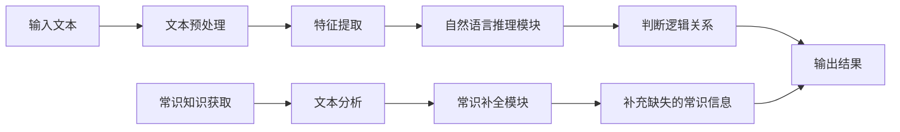

# 基于深度学习的AI自然语言推理与常识补全系统

> 关键词：深度学习、自然语言推理、常识补全、AI系统、神经网络、语义理解、知识图谱

> 摘要：本文聚焦于基于深度学习的AI自然语言推理与常识补全系统，全面深入地探讨了该系统的核心概念、算法原理、数学模型等内容。详细阐述了自然语言推理和常识补全的基本原理及相互联系，通过Python代码展示核心算法的实现。结合实际案例，对系统的开发环境搭建、源代码实现和解读进行了分析。同时探讨了系统在多个领域的实际应用场景，推荐了相关的学习资源、开发工具框架以及论文著作。最后总结了系统未来的发展趋势与面临的挑战，并对常见问题进行了解答。

## 1. 背景介绍 
### 1.1 目的和范围
自然语言处理（NLP）是人工智能领域的一个重要分支，旨在让计算机理解和处理人类语言。基于深度学习的AI自然语言推理与常识补全系统的目的在于提高计算机对自然语言的理解能力，使其能够像人类一样进行逻辑推理，并补全文本中缺失的常识信息。该系统的范围涵盖了从基础的文本预处理到复杂的推理和常识补全任务，涉及到多种深度学习模型和技术的应用。

### 1.2 预期读者
本文预期读者包括自然语言处理领域的研究人员、人工智能开发者、对深度学习和自然语言推理感兴趣的学生以及相关行业的技术人员。通过阅读本文，读者可以深入了解基于深度学习的自然语言推理与常识补全系统的原理、实现方法和应用场景，为进一步的研究和开发提供参考。

### 1.3 文档结构概述
本文首先介绍系统的背景信息，包括目的、预期读者和文档结构。接着阐述核心概念与联系，展示核心概念的原理和架构。然后详细讲解核心算法原理和具体操作步骤，给出Python源代码。之后介绍数学模型和公式，并举例说明。通过项目实战部分展示代码实际案例和详细解释。再探讨实际应用场景，推荐相关工具和资源。最后总结系统的未来发展趋势与挑战，解答常见问题，并提供扩展阅读和参考资料。

### 1.4 术语表
#### 1.4.1 核心术语定义
- **自然语言推理（Natural Language Inference, NLI）**：判断两个文本之间的逻辑关系，如蕴含、矛盾或中立。
- **常识补全（Common Sense Completion）**：在文本中补充缺失的常识信息，使文本的语义更加完整。
- **深度学习（Deep Learning）**：一种基于人工神经网络的机器学习方法，通过多层神经网络自动学习数据的特征和模式。
- **神经网络（Neural Network）**：由大量神经元组成的计算模型，用于模拟人类大脑的信息处理过程。
- **知识图谱（Knowledge Graph）**：一种语义网络，用于表示实体之间的关系和知识。

#### 1.4.2 相关概念解释
- **语义理解（Semantic Understanding）**：理解文本的含义和语义信息，包括词汇、句法和语义等层面的分析。
- **词嵌入（Word Embedding）**：将词语表示为低维向量的技术，使计算机能够处理文本数据。
- **注意力机制（Attention Mechanism）**：一种在神经网络中模拟人类注意力的机制，用于聚焦于输入数据的重要部分。

#### 1.4.3 缩略词列表
- **NLP**：Natural Language Processing（自然语言处理）
- **NLI**：Natural Language Inference（自然语言推理）
- **LSTM**：Long Short - Term Memory（长短期记忆网络）
- **GRU**：Gated Recurrent Unit（门控循环单元）
- **BERT**：Bidirectional Encoder Representations from Transformers（基于变换器的双向编码器表示）

## 2. 核心概念与联系 

### 2.1 自然语言推理的原理
自然语言推理的目标是判断两个文本（前提和假设）之间的逻辑关系。常见的逻辑关系包括蕴含（假设可以从前提中推出）、矛盾（假设与前提相互矛盾）和中立（假设与前提没有明显的逻辑关系）。

自然语言推理的过程通常包括文本预处理、特征提取和分类三个步骤。在文本预处理阶段，需要对输入的文本进行分词、去除停用词等操作。特征提取阶段将文本转换为向量表示，以便计算机进行处理。最后，使用分类模型对向量进行分类，判断文本之间的逻辑关系。

### 2.2 常识补全的原理
常识补全是在文本中补充缺失的常识信息。常识信息是人类在日常生活中积累的一般性知识，如物体的属性、事件的因果关系等。常识补全的过程通常包括常识知识的获取、文本分析和信息补全三个步骤。

常识知识可以从知识图谱、百科全书等数据源中获取。文本分析阶段需要对输入的文本进行语义理解，找出其中缺失的常识信息。最后，根据获取的常识知识，对文本进行信息补全。

### 2.3 自然语言推理与常识补全的联系
自然语言推理和常识补全是相互关联的任务。在自然语言推理中，常识信息可以帮助计算机更好地理解文本的含义，从而提高推理的准确性。例如，在判断“小明吃了一个苹果”和“小明吃了一个水果”之间的逻辑关系时，需要知道苹果是水果的一种这个常识信息。

另一方面，自然语言推理的结果也可以为常识补全提供线索。例如，如果推理出两个文本之间存在蕴含关系，那么可以根据前提文本中的信息补全假设文本中缺失的常识信息。

### 2.4 核心概念原理和架构的文本示意图
```plaintext
输入文本
|
|-- 文本预处理（分词、去除停用词等）
|
|-- 特征提取（词嵌入、深度学习模型）
|
|-- 自然语言推理模块（分类模型）
|       |
|       |-- 判断逻辑关系（蕴含、矛盾、中立）
|
|-- 常识知识获取（知识图谱、百科全书等）
|
|-- 文本分析（语义理解）
|
|-- 常识补全模块
        |
        |-- 补充缺失的常识信息
|
输出结果（推理结果、补全后的文本）
```

### 2.5 Mermaid流程图


## 3. 核心算法原理 & 具体操作步骤 

### 3.1 基于BERT的自然语言推理算法原理
BERT是一种预训练的语言模型，它通过双向编码器表示学习文本的上下文信息。在自然语言推理任务中，可以使用BERT对前提和假设文本进行编码，然后将编码后的向量输入到分类器中进行分类。

#### 3.1.1 算法步骤
1. **输入处理**：将前提和假设文本拼接在一起，中间用特殊符号分隔。
2. **BERT编码**：使用预训练的BERT模型对拼接后的文本进行编码，得到每个词的上下文向量表示。
3. **特征提取**：提取[CLS]标记的向量表示作为整个文本的特征向量。
4. **分类**：将特征向量输入到分类器（如全连接层）中，输出文本之间的逻辑关系。

#### 3.1.2 Python源代码实现
```python
import torch
from transformers import BertTokenizer, BertForSequenceClassification

# 加载预训练的BERT模型和分词器
tokenizer = BertTokenizer.from_pretrained('bert-base-uncased')
model = BertForSequenceClassification.from_pretrained('bert-base-uncased', num_labels=3)

# 定义前提和假设文本
premise = "The cat is on the mat."
hypothesis = "There is an animal on the mat."

# 输入处理
input_text = premise + " [SEP] " + hypothesis
inputs = tokenizer(input_text, return_tensors='pt')

# BERT编码和分类
outputs = model(**inputs)
logits = outputs.logits
predicted_class_id = torch.argmax(logits, dim=-1).item()

# 定义逻辑关系标签
labels = ["entailment", "contradiction", "neutral"]
predicted_label = labels[predicted_class_id]

print(f"Predicted label: {predicted_label}")
```

### 3.2 基于知识图谱的常识补全算法原理
知识图谱是一种语义网络，用于表示实体之间的关系和知识。在常识补全任务中，可以使用知识图谱查找与输入文本相关的常识信息，并进行补全。

#### 3.2.1 算法步骤
1. **实体识别**：从输入文本中识别出实体。
2. **知识图谱查询**：在知识图谱中查询与实体相关的常识信息。
3. **信息匹配**：将查询到的常识信息与输入文本进行匹配，找出缺失的信息。
4. **信息补全**：将缺失的信息补充到输入文本中。

#### 3.2.2 Python源代码实现
```python
from py2neo import Graph

# 连接到知识图谱数据库
graph = Graph("bolt://localhost:7687", auth=("neo4j", "password"))

# 定义输入文本
input_text = "小明喜欢吃水果，他最喜欢的是苹果。"

# 实体识别（简单示例，实际中可使用更复杂的方法）
entities = ["小明", "苹果"]

# 知识图谱查询
for entity in entities:
    query = f"MATCH (n)-[r]->(m) WHERE n.name = '{entity}' RETURN r, m"
    results = graph.run(query)
    for record in results:
        relation = record['r']
        target_entity = record['m']
        print(f"Entity: {entity}, Relation: {relation.type}, Target: {target_entity['name']}")

# 信息匹配和补全（简单示例，实际中需要更复杂的逻辑）
if "苹果" in input_text:
    input_text += " 苹果是一种富含维生素的水果。"

print(f"补全后的文本: {input_text}")
```

## 4. 数学模型和公式 & 详细讲解 & 举例说明 

### 4.1 自然语言推理的数学模型
在自然语言推理任务中，通常使用分类模型来判断文本之间的逻辑关系。假设输入的文本对为 $(x_1, x_2)$，其中 $x_1$ 为前提文本，$x_2$ 为假设文本。分类模型的目标是预测一个标签 $y$，$y \in \{0, 1, 2\}$，分别表示蕴含、矛盾和中立。

#### 4.1.1 基于逻辑回归的分类模型
逻辑回归是一种常用的分类模型，其数学模型可以表示为：

$$P(y = k|x_1, x_2) = \frac{\exp(z_k)}{\sum_{j = 0}^{2}\exp(z_j)}$$

其中，$z_k$ 是第 $k$ 类的线性组合：

$$z_k = w_k^T \cdot h + b_k$$

$w_k$ 是第 $k$ 类的权重向量，$h$ 是输入文本的特征向量，$b_k$ 是第 $k$ 类的偏置项。

#### 4.1.2 举例说明
假设我们有一个简单的特征向量 $h = [0.2, 0.3, 0.5]$，权重向量 $w_0 = [0.1, 0.2, 0.3]$，$w_1 = [0.4, 0.5, 0.6]$，$w_2 = [0.7, 0.8, 0.9]$，偏置项 $b_0 = 0.1$，$b_1 = 0.2$，$b_2 = 0.3$。

首先计算 $z_0$，$z_1$ 和 $z_2$：

$$z_0 = w_0^T \cdot h + b_0 = 0.1\times0.2 + 0.2\times0.3 + 0.3\times0.5 + 0.1 = 0.27$$

$$z_1 = w_1^T \cdot h + b_1 = 0.4\times0.2 + 0.5\times0.3 + 0.6\times0.5 + 0.2 = 0.63$$

$$z_2 = w_2^T \cdot h + b_2 = 0.7\times0.2 + 0.8\times0.3 + 0.9\times0.5 + 0.3 = 1.01$$

然后计算概率：

$$P(y = 0|x_1, x_2) = \frac{\exp(0.27)}{\exp(0.27) + \exp(0.63) + \exp(1.01)} \approx 0.21$$

$$P(y = 1|x_1, x_2) = \frac{\exp(0.63)}{\exp(0.27) + \exp(0.63) + \exp(1.01)} \approx 0.32$$

$$P(y = 2|x_1, x_2) = \frac{\exp(1.01)}{\exp(0.27) + \exp(0.63) + \exp(1.01)} \approx 0.47$$

因此，预测的标签为 $y = 2$，即中立关系。

### 4.2 常识补全的数学模型
常识补全可以看作是一个信息检索和匹配的过程。假设知识图谱中的知识可以表示为一个三元组集合 $\mathcal{K} = \{(s, r, o)\}$，其中 $s$ 是主语，$r$ 是关系，$o$ 是宾语。输入文本中的实体集合为 $\mathcal{E}$。

#### 4.2.1 信息检索模型
信息检索的目标是找出与实体集合 $\mathcal{E}$ 相关的三元组。可以使用基于相似度的方法来进行检索，例如余弦相似度。假设实体 $e \in \mathcal{E}$，三元组 $(s, r, o) \in \mathcal{K}$，则实体 $e$ 与三元组的相似度可以表示为：

$$sim(e, (s, r, o)) = \cos(\mathbf{v}_e, \mathbf{v}_{s}) + \cos(\mathbf{v}_e, \mathbf{v}_{o})$$

其中，$\mathbf{v}_e$，$\mathbf{v}_{s}$ 和 $\mathbf{v}_{o}$ 分别是实体 $e$，主语 $s$ 和宾语 $o$ 的向量表示。

#### 4.2.2 信息匹配和补全模型
信息匹配的目标是找出缺失的常识信息。可以使用规则匹配或机器学习方法来进行匹配。假设匹配到的三元组为 $(s, r, o)$，则可以将相关信息补充到输入文本中。

#### 4.2.3 举例说明
假设输入文本中的实体为“苹果”，知识图谱中的一个三元组为 (苹果, 属于, 水果)。苹果的向量表示为 $\mathbf{v}_{苹果} = [0.1, 0.2]$，水果的向量表示为 $\mathbf{v}_{水果} = [0.3, 0.4]$。

计算相似度：

$$sim(苹果, (苹果, 属于, 水果)) = \cos(\mathbf{v}_{苹果}, \mathbf{v}_{苹果}) + \cos(\mathbf{v}_{苹果}, \mathbf{v}_{水果})$$

由于 $\cos(\mathbf{v}_{苹果}, \mathbf{v}_{苹果}) = 1$，$\cos(\mathbf{v}_{苹果}, \mathbf{v}_{水果}) = \frac{\mathbf{v}_{苹果} \cdot \mathbf{v}_{水果}}{\|\mathbf{v}_{苹果}\| \|\mathbf{v}_{水果}\|} = \frac{0.1\times0.3 + 0.2\times0.4}{\sqrt{0.1^2 + 0.2^2} \sqrt{0.3^2 + 0.4^2}} \approx 0.94$

则 $sim(苹果, (苹果, 属于, 水果)) \approx 1 + 0.94 = 1.94$

由于相似度较高，可以将“苹果属于水果”这个常识信息补充到输入文本中。

## 5. 项目实战：代码实际案例和详细解释说明 

### 5.1  开发环境搭建
#### 5.1.1 安装Python
首先需要安装Python环境，建议使用Python 3.7及以上版本。可以从Python官方网站（https://www.python.org/downloads/）下载安装包进行安装。

#### 5.1.2 安装深度学习库
安装PyTorch和Transformers库，用于实现基于BERT的自然语言推理。可以使用以下命令进行安装：
```bash
pip install torch
pip install transformers
```

#### 5.1.3 安装知识图谱数据库
安装Neo4j知识图谱数据库，用于存储和查询常识知识。可以从Neo4j官方网站（https://neo4j.com/download/）下载安装包进行安装。安装完成后，启动Neo4j服务，并创建一个新的数据库。

#### 5.1.4 安装相关依赖库
安装py2neo库，用于与Neo4j数据库进行交互。可以使用以下命令进行安装：
```bash
pip install py2neo
```

### 5.2  源代码详细实现和代码解读
#### 5.2.1 自然语言推理代码实现
```python
import torch
from transformers import BertTokenizer, BertForSequenceClassification

# 加载预训练的BERT模型和分词器
tokenizer = BertTokenizer.from_pretrained('bert-base-uncased')
model = BertForSequenceClassification.from_pretrained('bert-base-uncased', num_labels=3)

# 定义前提和假设文本
premise = "The cat is on the mat."
hypothesis = "There is an animal on the mat."

# 输入处理
input_text = premise + " [SEP] " + hypothesis
inputs = tokenizer(input_text, return_tensors='pt')

# BERT编码和分类
outputs = model(**inputs)
logits = outputs.logits
predicted_class_id = torch.argmax(logits, dim=-1).item()

# 定义逻辑关系标签
labels = ["entailment", "contradiction", "neutral"]
predicted_label = labels[predicted_class_id]

print(f"Predicted label: {predicted_label}")
```
**代码解读**：
- `BertTokenizer.from_pretrained('bert-base-uncased')`：加载预训练的BERT分词器，用于将文本转换为BERT模型可以处理的输入格式。
- `BertForSequenceClassification.from_pretrained('bert-base-uncased', num_labels=3)`：加载预训练的BERT分类模型，`num_labels=3` 表示有三个类别（蕴含、矛盾、中立）。
- `tokenizer(input_text, return_tensors='pt')`：将输入文本进行分词，并转换为PyTorch张量。
- `model(**inputs)`：将输入张量输入到BERT模型中进行编码和分类，得到输出结果。
- `torch.argmax(logits, dim=-1).item()`：从输出的logits中找出概率最大的类别索引。

#### 5.2.2 常识补全代码实现
```python
from py2neo import Graph

# 连接到知识图谱数据库
graph = Graph("bolt://localhost:7687", auth=("neo4j", "password"))

# 定义输入文本
input_text = "小明喜欢吃水果，他最喜欢的是苹果。"

# 实体识别（简单示例，实际中可使用更复杂的方法）
entities = ["小明", "苹果"]

# 知识图谱查询
for entity in entities:
    query = f"MATCH (n)-[r]->(m) WHERE n.name = '{entity}' RETURN r, m"
    results = graph.run(query)
    for record in results:
        relation = record['r']
        target_entity = record['m']
        print(f"Entity: {entity}, Relation: {relation.type}, Target: {target_entity['name']}")

# 信息匹配和补全（简单示例，实际中需要更复杂的逻辑）
if "苹果" in input_text:
    input_text += " 苹果是一种富含维生素的水果。"

print(f"补全后的文本: {input_text}")
```
**代码解读**：
- `Graph("bolt://localhost:7687", auth=("neo4j", "password"))`：连接到Neo4j知识图谱数据库。
- `graph.run(query)`：执行Cypher查询语句，从知识图谱中查询与实体相关的信息。
- `if "苹果" in input_text`：简单的信息匹配逻辑，判断输入文本中是否包含“苹果”这个实体，如果包含则补充相关的常识信息。

### 5.3  代码解读与分析
#### 5.3.1 自然语言推理代码分析
基于BERT的自然语言推理代码使用了预训练的BERT模型，该模型在大规模文本数据上进行了预训练，能够学习到丰富的语言知识和上下文信息。通过将前提和假设文本拼接在一起，并使用BERT模型进行编码和分类，可以有效地判断文本之间的逻辑关系。

然而，该代码也存在一些局限性。例如，BERT模型的计算复杂度较高，在处理大规模数据时可能会遇到性能问题。此外，模型的性能还受到训练数据的质量和数量的影响。

#### 5.3.2 常识补全代码分析
基于知识图谱的常识补全代码通过实体识别和知识图谱查询，能够找出与输入文本相关的常识信息。但是，该代码中的实体识别和信息匹配逻辑比较简单，在实际应用中可能需要使用更复杂的方法，如命名实体识别（NER）和语义匹配算法。

另外，知识图谱的构建和维护也是一个挑战，需要收集和整理大量的常识知识，并保证知识的准确性和一致性。

## 6. 实际应用场景 
### 6.1 智能客服
在智能客服系统中，自然语言推理和常识补全技术可以帮助客服机器人更好地理解用户的问题，并给出准确的回答。例如，当用户询问“苹果手机的电池续航怎么样？”时，客服机器人可以通过常识补全了解到苹果手机是一种电子产品，进而查询相关的电池续航信息进行回答。同时，自然语言推理技术可以帮助机器人判断用户问题的意图，如是否是询问产品性能、是否是比较不同产品等。

### 6.2 智能写作辅助
在智能写作辅助系统中，常识补全技术可以帮助作者补充文本中缺失的常识信息，使文章更加丰富和准确。例如，当作者写到“小明去超市买了一些东西”时，系统可以根据常识知识补全“他可能买了食品、日用品等”。自然语言推理技术可以帮助检查文章中的逻辑关系是否合理，如句子之间是否存在矛盾、是否能够从前提推出结论等。

### 6.3 信息检索
在信息检索系统中，自然语言推理和常识补全技术可以提高检索的准确性和效率。例如，当用户输入“苹果的营养价值”时，系统可以通过常识补全了解到“苹果”是一种水果，进而从知识库中检索出与水果营养价值相关的信息。自然语言推理技术可以帮助判断检索结果与用户查询的逻辑关系，如是否是用户需要的信息、是否与查询相关等。

### 6.4 教育领域
在教育领域，自然语言推理和常识补全技术可以用于智能教学系统和考试评估。例如，在智能教学系统中，系统可以根据学生的回答进行自然语言推理，判断学生的理解程度和逻辑思维能力，并提供相应的指导和反馈。在考试评估中，系统可以使用常识补全技术检查学生的答案是否完整，是否包含必要的常识信息。

## 7. 工具和资源推荐
### 7.1 学习资源推荐
#### 7.1.1 书籍推荐
- 《深度学习》（Deep Learning）：由Ian Goodfellow、Yoshua Bengio和Aaron Courville所著，是深度学习领域的经典教材，涵盖了深度学习的基本概念、算法和应用。
- 《自然语言处理入门》（Natural Language Processing in Action）：由Hobson Lane、Cole Howard和 Hannes Hapke所著，介绍了自然语言处理的基本技术和方法，包括分词、词性标注、命名实体识别等。
- 《知识图谱：方法、实践与应用》：由王昊奋、漆桂林、陈华钧所著，全面介绍了知识图谱的构建、表示、推理和应用等方面的内容。

#### 7.1.2 在线课程
- Coursera上的“深度学习专项课程”（Deep Learning Specialization）：由Andrew Ng教授主讲，包括深度学习的基础知识、卷积神经网络、循环神经网络等内容。
- edX上的“自然语言处理”（Natural Language Processing）：由哥伦比亚大学的教授主讲，介绍了自然语言处理的前沿技术和应用。
- 哔哩哔哩（Bilibili）上的相关技术视频：有很多关于深度学习、自然语言处理和知识图谱的教程和讲解视频，可以帮助初学者快速入门。

#### 7.1.3 技术博客和网站
- Medium：是一个技术博客平台，有很多关于深度学习、自然语言处理和人工智能的优质文章。
- arXiv：是一个预印本数据库，提供了大量的学术论文和研究成果，涵盖了自然语言处理和知识图谱等领域。
- 机器之心：是一个专注于人工智能领域的媒体平台，提供了最新的技术动态、研究成果和行业分析。

### 7.2 开发工具框架推荐
#### 7.2.1 IDE和编辑器
- PyCharm：是一款专门为Python开发设计的集成开发环境（IDE），提供了代码编辑、调试、版本控制等功能，适合开发基于Python的自然语言处理和深度学习项目。
- Visual Studio Code：是一款轻量级的代码编辑器，支持多种编程语言和插件扩展，具有丰富的代码编辑和调试功能。

#### 7.2.2 调试和性能分析工具
- TensorBoard：是TensorFlow提供的可视化工具，可以用于可视化深度学习模型的训练过程、损失函数曲线、模型结构等，帮助开发者进行调试和性能分析。
- PyTorch Profiler：是PyTorch提供的性能分析工具，可以用于分析模型的运行时间、内存使用情况等，帮助开发者优化模型性能。

#### 7.2.3 相关框架和库
- PyTorch：是一个开源的深度学习框架，提供了丰富的深度学习模型和工具，支持GPU加速，适合开发自然语言处理和深度学习项目。
- Transformers：是Hugging Face开发的一个自然语言处理库，提供了预训练的语言模型，如BERT、GPT等，方便开发者进行自然语言推理和文本生成等任务。
- Neo4j：是一个开源的图数据库，用于存储和管理知识图谱数据，提供了Cypher查询语言和Python API，方便开发者进行知识图谱的构建和查询。

### 7.3 相关论文著作推荐
#### 7.3.1 经典论文
- “BERT: Pre-training of Deep Bidirectional Transformers for Language Understanding”：介绍了BERT模型的原理和训练方法，是自然语言处理领域的重要论文。
- “Knowledge Graph Embedding: A Survey of Approaches and Applications”：对知识图谱嵌入技术进行了综述，介绍了各种知识图谱嵌入方法和应用场景。
- “Natural Language Inference in Neural Networks: A Survey”：对神经网络在自然语言推理任务中的应用进行了综述，介绍了各种自然语言推理模型和方法。

#### 7.3.2 最新研究成果
- 可以关注ACL（Association for Computational Linguistics）、EMNLP（Conference on Empirical Methods in Natural Language Processing）等自然语言处理领域的顶级会议，获取最新的研究成果和技术动态。
- arXiv上也有很多关于自然语言推理和常识补全的最新研究论文，可以及时了解该领域的前沿进展。

#### 7.3.3 应用案例分析
- 可以参考一些实际应用案例，如智能客服系统、智能写作辅助系统等的相关论文和报告，了解自然语言推理和常识补全技术在实际应用中的实现方法和效果评估。

## 8. 总结：未来发展趋势与挑战
### 8.1 未来发展趋势
#### 8.1.1 多模态融合
未来的自然语言推理和常识补全系统将不仅仅局限于文本信息，还将融合图像、音频等多模态信息。例如，在理解一个包含图片和文字的新闻报道时，系统可以结合图片中的视觉信息和文字中的语义信息进行推理和常识补全，提高系统的理解能力和准确性。

#### 8.1.2 知识增强的深度学习模型
随着知识图谱技术的不断发展，未来的深度学习模型将更加注重知识的引入和利用。通过将知识图谱中的常识知识融入到深度学习模型中，可以提高模型的推理能力和泛化能力，使其能够更好地处理复杂的自然语言任务。

#### 8.1.3 跨语言和跨文化应用
随着全球化的发展，自然语言推理和常识补全系统将越来越多地应用于跨语言和跨文化的场景中。未来的系统需要能够处理不同语言和文化背景下的自然语言，考虑到不同语言的语法、语义和文化差异，提高系统的通用性和适应性。

### 8.2 挑战
#### 8.2.1 常识知识的获取和表示
常识知识是自然语言推理和常识补全的基础，但是常识知识的获取和表示是一个具有挑战性的问题。常识知识具有多样性、模糊性和动态性等特点，如何从海量的数据源中准确地获取常识知识，并将其有效地表示和存储在知识图谱中，是需要解决的关键问题。

#### 8.2.2 模型的可解释性
深度学习模型通常是黑盒模型，其决策过程难以解释。在自然语言推理和常识补全任务中，模型的可解释性尤为重要。例如，在智能客服系统中，用户需要了解系统为什么给出这样的回答。如何提高深度学习模型的可解释性，使其决策过程更加透明和可理解，是当前面临的一个挑战。

#### 8.2.3 数据的质量和数量
深度学习模型的性能很大程度上依赖于训练数据的质量和数量。在自然语言推理和常识补全任务中，需要大量的标注数据来训练模型。但是，标注数据的获取成本较高，且容易存在标注误差。如何提高数据的质量和数量，是提高模型性能的关键。

## 9. 附录：常见问题与解答
### 9.1 自然语言推理和常识补全有什么区别？
自然语言推理主要关注判断两个文本之间的逻辑关系，如蕴含、矛盾或中立。而常识补全是在文本中补充缺失的常识信息，使文本的语义更加完整。两者的目标和任务不同，但在实际应用中相互关联。

### 9.2 如何选择合适的深度学习模型进行自然语言推理和常识补全？
选择合适的深度学习模型需要考虑多个因素，如任务的复杂度、数据的规模和质量、计算资源等。对于自然语言推理任务，BERT、RoBERTa等预训练语言模型通常表现较好。对于常识补全任务，可以结合知识图谱和深度学习模型，如将知识图谱中的信息融入到神经网络中。

### 9.3 知识图谱在常识补全中有什么作用？
知识图谱是一种语义网络，用于表示实体之间的关系和知识。在常识补全中，知识图谱可以作为常识知识的来源，通过查询知识图谱可以找出与输入文本相关的常识信息，并进行补全。知识图谱还可以帮助系统理解文本中的实体和关系，提高常识补全的准确性。

### 9.4 如何提高自然语言推理和常识补全系统的性能？
可以从以下几个方面提高系统的性能：
- **数据方面**：收集更多高质量的标注数据，进行数据增强和预处理，提高数据的多样性和质量。
- **模型方面**：选择合适的深度学习模型，并进行模型调优和优化，如调整超参数、使用正则化方法等。
- **知识方面**：引入更多的常识知识，如使用知识图谱、百科全书等数据源，将知识融入到模型中。
- **技术方面**：采用多模态融合、注意力机制等先进技术，提高系统的理解能力和推理能力。

## 10. 扩展阅读 & 参考资料
### 10.1 扩展阅读
- 《人工智能：一种现代方法》（Artificial Intelligence: A Modern Approach）：由Stuart Russell和Peter Norvig所著，是人工智能领域的经典教材，涵盖了人工智能的各个方面，包括自然语言处理、机器学习等。
- 《Python自然语言处理》（Natural Language Processing with Python）：由Steven Bird、Ewan Klein和Edward Loper所著，介绍了使用Python进行自然语言处理的基本技术和方法。
- 《深度学习实战》（Deep Learning in Practice）：由Antonino Furnari、Giovanni M. Farinella和Sajid Javed所著，通过实际案例介绍了深度学习的应用和实现方法。

### 10.2 参考资料
- Hugging Face官方文档：https://huggingface.co/docs/transformers/index
- Neo4j官方文档：https://neo4j.com/docs/
- PyTorch官方文档：https://pytorch.org/docs/stable/index.html