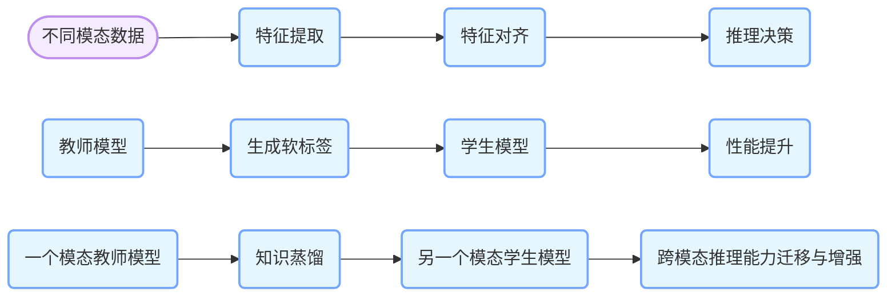

# 基于知识蒸馏的跨模态推理能力迁移与增强

> 关键词：知识蒸馏、跨模态推理、能力迁移、能力增强、人工智能

> 摘要：本文聚焦于基于知识蒸馏的跨模态推理能力迁移与增强这一前沿领域。首先介绍了相关背景，包括研究的目的、预期读者、文档结构等。详细阐述了核心概念，如知识蒸馏、跨模态推理等及其联系，并给出了相应的文本示意图和 Mermaid 流程图。深入讲解了核心算法原理，结合 Python 源代码进行具体操作步骤的说明。通过数学模型和公式进一步剖析其本质，并举例说明。通过项目实战展示了代码的实际应用和详细解释。探讨了实际应用场景，推荐了相关的工具和资源。最后总结了未来发展趋势与挑战，提供了常见问题的解答和扩展阅读参考资料，旨在全面深入地探讨该领域的理论与实践。

## 1. 背景介绍 
### 1.1 目的和范围
在人工智能快速发展的当下，跨模态推理能力的提升对于实现更加智能和通用的人工智能系统具有重要意义。不同模态的数据（如图像、文本、音频等）包含着丰富的信息，但如何有效地利用这些多模态信息进行推理是一个关键问题。知识蒸馏作为一种有效的模型压缩和知识迁移技术，为跨模态推理能力的迁移与增强提供了新的思路。本研究的目的在于探索如何利用知识蒸馏的方法，将一个模态的推理能力迁移到另一个模态，并增强跨模态推理的性能。研究范围涵盖了知识蒸馏的原理、跨模态推理的机制、相关算法的实现以及实际应用场景的探索。

### 1.2 预期读者
本文预期读者包括人工智能领域的研究人员、学者、研究生，对跨模态学习、知识蒸馏等技术感兴趣的程序员和工程师，以及希望深入了解人工智能前沿技术的爱好者。通过阅读本文，读者可以系统地了解基于知识蒸馏的跨模态推理能力迁移与增强的理论和实践，为进一步的研究和应用提供参考。

### 1.3 文档结构概述
本文共分为十个部分。第一部分为背景介绍，阐述研究的目的、预期读者和文档结构。第二部分介绍核心概念与联系，包括知识蒸馏、跨模态推理等核心概念的原理和架构，并给出相应的文本示意图和 Mermaid 流程图。第三部分讲解核心算法原理和具体操作步骤，结合 Python 源代码进行详细阐述。第四部分通过数学模型和公式进一步剖析其本质，并举例说明。第五部分是项目实战，展示代码的实际应用和详细解释。第六部分探讨实际应用场景。第七部分推荐相关的工具和资源。第八部分总结未来发展趋势与挑战。第九部分是附录，提供常见问题的解答。第十部分提供扩展阅读和参考资料。

### 1.4 术语表
#### 1.4.1 核心术语定义
- **知识蒸馏（Knowledge Distillation）**：一种模型压缩和知识迁移技术，通过将一个大的、复杂的教师模型的知识传递给一个小的、简单的学生模型，使得学生模型能够学习到教师模型的泛化能力。
- **跨模态推理（Cross - Modal Reasoning）**：利用不同模态的数据（如图像、文本、音频等）之间的关联和信息，进行推理和决策的过程。
- **模态（Modality）**：指数据的不同表现形式，如视觉模态（图像、视频）、听觉模态（音频）、语言模态（文本）等。
- **教师模型（Teacher Model）**：在知识蒸馏中，通常是一个性能较好、参数较多的模型，用于向学生模型传递知识。
- **学生模型（Student Model）**：在知识蒸馏中，通常是一个参数较少、结构较简单的模型，通过学习教师模型的知识来提升自身性能。

#### 1.4.2 相关概念解释
- **特征表示（Feature Representation）**：在跨模态推理中，不同模态的数据需要被转换为合适的特征表示，以便进行有效的比较和关联。特征表示的质量直接影响跨模态推理的性能。
- **对齐（Alignment）**：指在跨模态学习中，将不同模态的特征表示映射到同一个空间，使得它们能够更好地进行比较和关联。对齐的方法有很多种，如基于深度学习的方法、基于度量学习的方法等。
- **迁移学习（Transfer Learning）**：是一种机器学习技术，通过将在一个任务或领域中学习到的知识迁移到另一个任务或领域中，来提高模型的性能和泛化能力。知识蒸馏可以看作是一种特殊的迁移学习方法。

#### 1.4.3 缩略词列表
- **CNN（Convolutional Neural Network）**：卷积神经网络
- **RNN（Recurrent Neural Network）**：循环神经网络
- **LSTM（Long Short - Term Memory）**：长短期记忆网络
- **GRU（Gated Recurrent Unit）**：门控循环单元
- **MLP（Multi - Layer Perceptron）**：多层感知机

## 2. 核心概念与联系 
### 知识蒸馏原理
知识蒸馏的核心思想是让一个学生模型学习教师模型的输出分布，从而获得教师模型的知识。教师模型通常是一个经过大量数据训练的复杂模型，具有较好的性能。学生模型则是一个相对简单的模型，通过学习教师模型的软标签（soft labels）来提升自身性能。

具体来说，知识蒸馏的过程包括以下几个步骤：
1. 训练教师模型：使用大量的数据对教师模型进行训练，使其达到较好的性能。
2. 生成软标签：在训练学生模型时，将输入数据同时输入到教师模型和学生模型中。教师模型输出的概率分布作为软标签。
3. 训练学生模型：学生模型的目标是最小化其输出与教师模型输出的软标签之间的差异。通常使用 KL 散度（Kullback - Leibler Divergence）作为损失函数。

### 跨模态推理机制
跨模态推理的关键在于如何有效地利用不同模态的数据之间的关联和信息。不同模态的数据具有不同的特征和表示方式，需要进行适当的处理和转换，才能进行有效的推理。

一般来说，跨模态推理的过程包括以下几个步骤：
1. 特征提取：从不同模态的数据中提取特征。例如，对于图像数据，可以使用卷积神经网络（CNN）提取视觉特征；对于文本数据，可以使用循环神经网络（RNN）或预训练语言模型提取语言特征。
2. 特征对齐：将不同模态的特征映射到同一个空间，使得它们能够进行比较和关联。可以使用基于深度学习的方法、基于度量学习的方法等进行特征对齐。
3. 推理决策：在特征对齐的基础上，进行推理和决策。可以使用联合模型、多模态融合模型等进行推理。

### 知识蒸馏与跨模态推理的联系
知识蒸馏可以应用于跨模态推理中，实现跨模态推理能力的迁移与增强。具体来说，可以将一个模态的教师模型的知识蒸馏到另一个模态的学生模型中，使得学生模型能够学习到教师模型的跨模态推理能力。

例如，可以将一个基于图像的教师模型的知识蒸馏到一个基于文本的学生模型中，使得文本模型能够学习到图像模型的跨模态推理能力。这样，文本模型在处理与图像相关的任务时，能够更好地利用图像信息，提高推理性能。

### 文本示意图
知识蒸馏与跨模态推理的关系可以用以下文本示意图表示：

知识蒸馏：教师模型（复杂、高性能） -> 软标签 -> 学生模型（简单、低性能） -> 学生模型性能提升

跨模态推理：不同模态数据（图像、文本、音频等） -> 特征提取 -> 特征对齐 -> 推理决策

知识蒸馏与跨模态推理的结合：一个模态的教师模型 -> 知识蒸馏 -> 另一个模态的学生模型 -> 跨模态推理能力迁移与增强

### Mermaid 流程图


## 3. 核心算法原理 & 具体操作步骤 
### 知识蒸馏算法原理
知识蒸馏的核心是最小化学生模型输出与教师模型输出的软标签之间的差异。通常使用 KL 散度作为损失函数，其定义如下：

$$
KL(p||q)=\sum_{i}p(i)\log\frac{p(i)}{q(i)}
$$

其中，$p(i)$ 是教师模型输出的概率分布，$q(i)$ 是学生模型输出的概率分布。

### 跨模态知识蒸馏算法步骤
1. **数据准备**：收集不同模态的数据，如图像和文本数据。对数据进行预处理，如归一化、分词等。
2. **教师模型训练**：选择一个合适的教师模型，如基于图像的卷积神经网络。使用图像数据对教师模型进行训练，使其达到较好的性能。
3. **学生模型构建**：构建一个学生模型，如基于文本的循环神经网络。学生模型的结构通常比教师模型简单。
4. **知识蒸馏训练**：在训练学生模型时，将输入数据同时输入到教师模型和学生模型中。教师模型输出的概率分布作为软标签。计算学生模型输出与软标签之间的 KL 散度损失，并使用优化算法（如随机梯度下降）更新学生模型的参数。

### Python 源代码实现
```python
import torch
import torch.nn as nn
import torch.optim as optim

# 定义教师模型
class TeacherModel(nn.Module):
    def __init__(self):
        super(TeacherModel, self).__init__()
        self.fc1 = nn.Linear(10, 20)
        self.fc2 = nn.Linear(20, 5)

    def forward(self, x):
        x = torch.relu(self.fc1(x))
        x = self.fc2(x)
        return x

# 定义学生模型
class StudentModel(nn.Module):
    def __init__(self):
        super(StudentModel, self).__init__()
        self.fc1 = nn.Linear(10, 15)
        self.fc2 = nn.Linear(15, 5)

    def forward(self, x):
        x = torch.relu(self.fc1(x))
        x = self.fc2(x)
        return x

# 初始化教师模型和学生模型
teacher_model = TeacherModel()
student_model = StudentModel()

# 定义损失函数和优化器
criterion = nn.KLDivLoss(reduction='batchmean')
optimizer = optim.SGD(student_model.parameters(), lr=0.01)

# 训练数据
input_data = torch.randn(32, 10)

# 知识蒸馏训练过程
for epoch in range(100):
    # 教师模型前向传播
    teacher_output = teacher_model(input_data)
    teacher_probs = torch.softmax(teacher_output, dim=1)

    # 学生模型前向传播
    student_output = student_model(input_data)
    student_log_probs = torch.log_softmax(student_output, dim=1)

    # 计算 KL 散度损失
    loss = criterion(student_log_probs, teacher_probs)

    # 反向传播和参数更新
    optimizer.zero_grad()
    loss.backward()
    optimizer.step()

    if (epoch + 1) % 10 == 0:
        print(f'Epoch {epoch + 1}, Loss: {loss.item()}')
```

### 代码解释
1. **模型定义**：定义了教师模型和学生模型，它们都是简单的全连接神经网络。
2. **损失函数和优化器**：使用 KL 散度作为损失函数，随机梯度下降作为优化器。
3. **训练过程**：在每个训练周期中，将输入数据同时输入到教师模型和学生模型中。教师模型输出的概率分布作为软标签，计算学生模型输出与软标签之间的 KL 散度损失，并更新学生模型的参数。

## 4. 数学模型和公式 & 详细讲解 & 举例说明 
### 知识蒸馏的数学模型
知识蒸馏的目标是让学生模型 $S$ 学习教师模型 $T$ 的知识。设输入数据为 $x$，教师模型的输出为 $y_T = T(x)$，学生模型的输出为 $y_S = S(x)$。教师模型的软标签概率分布为 $p_T = \text{softmax}(y_T / T)$，学生模型的概率分布为 $p_S = \text{softmax}(y_S / T)$，其中 $T$ 是温度参数。

知识蒸馏的损失函数通常由两部分组成：
1. **蒸馏损失（Distillation Loss）**：使用 KL 散度衡量学生模型的概率分布 $p_S$ 与教师模型的软标签概率分布 $p_T$ 之间的差异。
$$
L_{distillation} = KL(p_T||p_S)=\sum_{i}p_T(i)\log\frac{p_T(i)}{p_S(i)}
$$
2. **真实标签损失（True Label Loss）**：使用交叉熵损失衡量学生模型的输出与真实标签 $y$ 之间的差异。
$$
L_{true\ label}=-\sum_{i}y(i)\log p_S(i)
$$

最终的损失函数为：
$$
L = \alpha L_{distillation}+(1 - \alpha)L_{true\ label}
$$

其中，$\alpha$ 是一个超参数，用于平衡蒸馏损失和真实标签损失。

### 详细讲解
- **温度参数 $T$**：温度参数 $T$ 用于控制软标签的平滑程度。当 $T$ 较大时，软标签的分布更加平滑，包含更多的信息；当 $T$ 较小时，软标签的分布更加尖锐，更接近真实标签。
- **超参数 $\alpha$**：超参数 $\alpha$ 用于平衡蒸馏损失和真实标签损失。当 $\alpha$ 较大时，学生模型更注重学习教师模型的知识；当 $\alpha$ 较小时，学生模型更注重学习真实标签。

### 举例说明
假设我们有一个二分类问题，输入数据 $x$ 经过教师模型和学生模型的输出分别为 $y_T = [2, 1]$ 和 $y_S = [1, 0]$。设温度参数 $T = 1$，真实标签 $y = [1, 0]$。

1. **计算教师模型的软标签概率分布 $p_T$**：
$$
p_T=\text{softmax}(y_T/T)=\left[\frac{e^{2}}{e^{2}+e^{1}},\frac{e^{1}}{e^{2}+e^{1}}\right]\approx[0.731, 0.269]
$$
2. **计算学生模型的概率分布 $p_S$**：
$$
p_S=\text{softmax}(y_S/T)=\left[\frac{e^{1}}{e^{1}+e^{0}},\frac{e^{0}}{e^{1}+e^{0}}\right]\approx[0.731, 0.269]
$$
3. **计算蒸馏损失 $L_{distillation}$**：
$$
L_{distillation}=KL(p_T||p_S)=\sum_{i}p_T(i)\log\frac{p_T(i)}{p_S(i)} = 0
$$
4. **计算真实标签损失 $L_{true\ label}$**：
$$
L_{true\ label}=-\sum_{i}y(i)\log p_S(i)=-1\times\log(0.731)\approx0.313
$$
5. **假设 $\alpha = 0.5$，计算最终损失 $L$**：
$$
L=\alpha L_{distillation}+(1 - \alpha)L_{true\ label}=0.5\times0 + 0.5\times0.313 = 0.1565
$$

## 5. 项目实战：代码实际案例和详细解释说明 
### 5.1  开发环境搭建
1. **安装 Python**：建议使用 Python 3.7 及以上版本。可以从 Python 官方网站（https://www.python.org/downloads/） 下载并安装。
2. **安装深度学习框架**：本项目使用 PyTorch 作为深度学习框架。可以使用以下命令安装：
```bash
pip install torch torchvision
```
3. **安装其他依赖库**：根据项目需求，可能需要安装其他依赖库，如 numpy、matplotlib 等。可以使用以下命令安装：
```bash
pip install numpy matplotlib
```

### 5.2  源代码详细实现和代码解读
```python
import torch
import torch.nn as nn
import torch.optim as optim
import torchvision
import torchvision.transforms as transforms
from torch.utils.data import DataLoader

# 定义教师模型
class TeacherModel(nn.Module):
    def __init__(self):
        super(TeacherModel, self).__init__()
        self.conv1 = nn.Conv2d(3, 6, 5)
        self.pool = nn.MaxPool2d(2, 2)
        self.conv2 = nn.Conv2d(6, 16, 5)
        self.fc1 = nn.Linear(16 * 5 * 5, 120)
        self.fc2 = nn.Linear(120, 84)
        self.fc3 = nn.Linear(84, 10)

    def forward(self, x):
        x = self.pool(torch.relu(self.conv1(x)))
        x = self.pool(torch.relu(self.conv2(x)))
        x = x.view(-1, 16 * 5 * 5)
        x = torch.relu(self.fc1(x))
        x = torch.relu(self.fc2(x))
        x = self.fc3(x)
        return x

# 定义学生模型
class StudentModel(nn.Module):
    def __init__(self):
        super(StudentModel, self).__init__()
        self.fc1 = nn.Linear(3 * 32 * 32, 128)
        self.fc2 = nn.Linear(128, 64)
        self.fc3 = nn.Linear(64, 10)

    def forward(self, x):
        x = x.view(-1, 3 * 32 * 32)
        x = torch.relu(self.fc1(x))
        x = torch.relu(self.fc2(x))
        x = self.fc3(x)
        return x

# 数据预处理
transform = transforms.Compose([
    transforms.ToTensor(),
    transforms.Normalize((0.5, 0.5, 0.5), (0.5, 0.5, 0.5))
])

# 加载数据集
trainset = torchvision.datasets.CIFAR10(root='./data', train=True,
                                        download=True, transform=transform)
trainloader = DataLoader(trainset, batch_size=4, shuffle=True)

testset = torchvision.datasets.CIFAR10(root='./data', train=False,
                                       download=True, transform=transform)
testloader = DataLoader(testset, batch_size=4, shuffle=False)

# 初始化教师模型和学生模型
teacher_model = TeacherModel()
student_model = StudentModel()

# 定义损失函数和优化器
criterion_teacher = nn.CrossEntropyLoss()
optimizer_teacher = optim.SGD(teacher_model.parameters(), lr=0.001, momentum=0.9)

criterion_student = nn.KLDivLoss(reduction='batchmean')
optimizer_student = optim.SGD(student_model.parameters(), lr=0.001, momentum=0.9)

# 训练教师模型
for epoch in range(5):
    running_loss = 0.0
    for i, data in enumerate(trainloader, 0):
        inputs, labels = data
        optimizer_teacher.zero_grad()
        outputs = teacher_model(inputs)
        loss = criterion_teacher(outputs, labels)
        loss.backward()
        optimizer_teacher.step()
        running_loss += loss.item()
        if i % 2000 == 1999:
            print(f'[{epoch + 1}, {i + 1:5d}] loss: {running_loss / 2000:.3f}')
            running_loss = 0.0

print('Finished Training Teacher Model')

# 知识蒸馏训练学生模型
temperature = 2
alpha = 0.5
for epoch in range(5):
    running_loss = 0.0
    for i, data in enumerate(trainloader, 0):
        inputs, labels = data

        # 教师模型前向传播
        teacher_outputs = teacher_model(inputs)
        teacher_probs = torch.softmax(teacher_outputs / temperature, dim=1)

        # 学生模型前向传播
        student_outputs = student_model(inputs)
        student_log_probs = torch.log_softmax(student_outputs / temperature, dim=1)

        # 计算蒸馏损失
        distillation_loss = criterion_student(student_log_probs, teacher_probs)

        # 计算真实标签损失
        true_label_loss = nn.CrossEntropyLoss()(student_outputs, labels)

        # 计算最终损失
        loss = alpha * distillation_loss + (1 - alpha) * true_label_loss

        # 反向传播和参数更新
        optimizer_student.zero_grad()
        loss.backward()
        optimizer_student.step()

        running_loss += loss.item()
        if i % 2000 == 1999:
            print(f'[{epoch + 1}, {i + 1:5d}] loss: {running_loss / 2000:.3f}')
            running_loss = 0.0

print('Finished Training Student Model')

# 测试学生模型
correct = 0
total = 0
with torch.no_grad():
    for data in testloader:
        images, labels = data
        outputs = student_model(images)
        _, predicted = torch.max(outputs.data, 1)
        total += labels.size(0)
        correct += (predicted == labels).sum().item()

print(f'Accuracy of the student network on the 10000 test images: {100 * correct / total}%')
```

### 5.3  代码解读与分析
1. **模型定义**：定义了教师模型和学生模型。教师模型是一个简单的卷积神经网络，学生模型是一个全连接神经网络。
2. **数据预处理和加载**：使用 `torchvision` 库加载 CIFAR - 10 数据集，并进行预处理。
3. **教师模型训练**：使用交叉熵损失函数和随机梯度下降优化器训练教师模型。
4. **知识蒸馏训练学生模型**：在训练学生模型时，同时计算蒸馏损失和真实标签损失，并根据超参数 $\alpha$ 进行加权求和。使用 KL 散度作为蒸馏损失函数。
5. **测试学生模型**：在测试集上测试学生模型的准确率。

通过知识蒸馏，学生模型可以学习到教师模型的知识，从而提高自身的性能。

## 6. 实际应用场景 
### 智能客服
在智能客服系统中，用户的问题可能以文本、语音等不同模态的形式输入。基于知识蒸馏的跨模态推理能力迁移与增强技术可以帮助智能客服更好地理解用户的意图。例如，可以将基于文本的教师模型的知识蒸馏到基于语音的学生模型中，使得语音模型能够学习到文本模型的推理能力，从而更准确地回答用户的问题。

### 多媒体信息检索
在多媒体信息检索中，用户可能使用文本、图像等不同模态的查询来检索相关的多媒体信息。跨模态推理技术可以帮助系统更好地理解不同模态的查询，并找到相关的信息。知识蒸馏可以用于将图像模型的知识迁移到文本模型中，或者将文本模型的知识迁移到图像模型中，提高跨模态检索的性能。

### 自动驾驶
在自动驾驶系统中，需要处理多种模态的数据，如摄像头图像、雷达数据、激光雷达数据等。基于知识蒸馏的跨模态推理能力迁移与增强技术可以帮助自动驾驶系统更好地融合不同模态的数据，提高决策的准确性和可靠性。例如，可以将基于图像的教师模型的知识蒸馏到基于雷达数据的学生模型中，使得雷达模型能够学习到图像模型的推理能力，更好地识别障碍物。

### 医疗诊断
在医疗诊断中，医生可能会使用多种模态的数据，如医学图像（X光、CT、MRI 等）、病历文本等进行诊断。跨模态推理技术可以帮助医生更好地综合分析不同模态的数据，提高诊断的准确性。知识蒸馏可以用于将医学图像模型的知识迁移到文本模型中，或者将文本模型的知识迁移到医学图像模型中，辅助医生进行诊断。

## 7. 工具和资源推荐
### 7.1 学习资源推荐
#### 7.1.1 书籍推荐
- 《深度学习》（Deep Learning）：由 Ian Goodfellow、Yoshua Bengio 和 Aaron Courville 合著，是深度学习领域的经典教材，涵盖了深度学习的基本原理、算法和应用。
- 《Python 深度学习》（Deep Learning with Python）：由 Francois Chollet 著，以 Keras 为框架，介绍了深度学习的基本概念和实践方法。
- 《人工智能：一种现代的方法》（Artificial Intelligence: A Modern Approach）：由 Stuart Russell 和 Peter Norvig 合著，是人工智能领域的经典教材，涵盖了人工智能的各个方面，包括知识表示、推理、机器学习等。

#### 7.1.2 在线课程
- Coursera 上的《深度学习专项课程》（Deep Learning Specialization）：由 Andrew Ng 教授讲授，包括五门课程，系统地介绍了深度学习的基本原理和应用。
- edX 上的《强化学习基础》（Fundamentals of Reinforcement Learning）：介绍了强化学习的基本概念和算法。
- 哔哩哔哩（B 站）上有很多关于深度学习和人工智能的教学视频，如李宏毅的机器学习课程等。

#### 7.1.3 技术博客和网站
- arXiv（https://arxiv.org/）：是一个预印本服务器，提供了大量的学术论文，涵盖了人工智能、机器学习等领域的最新研究成果。
- Medium（https://medium.com/）：有很多关于人工智能、深度学习的技术博客，作者包括业内专家和研究人员。
- 机器之心（https://www.almosthuman.cn/）：专注于人工智能领域的技术和产业报道，提供了很多有价值的技术文章和资讯。

### 7.2 开发工具框架推荐
#### 7.2.1 IDE和编辑器
- PyCharm：是一款专门为 Python 开发设计的集成开发环境（IDE），具有代码编辑、调试、版本控制等功能。
- Visual Studio Code：是一款轻量级的代码编辑器，支持多种编程语言，通过安装插件可以实现 Python 开发的各种功能。
- Jupyter Notebook：是一个交互式的开发环境，适合进行数据探索、模型训练和可视化等工作。

#### 7.2.2 调试和性能分析工具
- PyTorch Profiler：是 PyTorch 自带的性能分析工具，可以帮助开发者分析模型的性能瓶颈，优化代码。
- TensorBoard：是 TensorFlow 提供的可视化工具，也可以与 PyTorch 结合使用，用于可视化模型的训练过程和性能指标。
- cProfile：是 Python 自带的性能分析工具，可以帮助开发者分析 Python 代码的性能瓶颈。

#### 7.2.3 相关框架和库
- PyTorch：是一个开源的深度学习框架，具有动态图、自动求导等特点，广泛应用于学术界和工业界。
- TensorFlow：是一个开源的深度学习框架，具有强大的分布式训练和部署能力，被很多大型公司采用。
- scikit - learn：是一个开源的机器学习库，提供了丰富的机器学习算法和工具，适合初学者入门。

### 7.3 相关论文著作推荐
#### 7.3.1 经典论文
- Hinton, G. E., Vinyals, O., & Dean, J. (2015). Distilling the knowledge in a neural network. arXiv preprint arXiv:1503.02531. 该论文首次提出了知识蒸馏的概念。
- Bengio, Y., Courville, A., & Vincent, P. (2013). Representation learning: A review and new perspectives. IEEE transactions on pattern analysis and machine intelligence, 35(8), 1798 - 1828. 该论文对表示学习进行了全面的综述和新的展望。

#### 7.3.2 最新研究成果
可以通过 arXiv、ACM Digital Library、IEEE Xplore 等学术数据库搜索关于知识蒸馏、跨模态推理等领域的最新研究成果。

#### 7.3.3 应用案例分析
可以在相关的学术会议（如 CVPR、ICML、NeurIPS 等）的论文集中查找关于知识蒸馏和跨模态推理的应用案例分析。

## 8. 总结：未来发展趋势与挑战
### 未来发展趋势
1. **多模态融合的深度和广度不断拓展**：未来的研究将更加注重不同模态数据之间的深度融合，不仅仅是简单的特征拼接，而是探索更加复杂和有效的融合方法，以充分发挥多模态数据的优势。
2. **知识蒸馏技术的不断创新**：随着研究的深入，知识蒸馏技术将不断创新，如探索新的蒸馏损失函数、改进蒸馏算法等，以提高知识蒸馏的效率和性能。
3. **跨模态推理在更多领域的应用**：基于知识蒸馏的跨模态推理能力迁移与增强技术将在更多领域得到应用，如教育、娱乐、金融等，为这些领域带来新的发展机遇。
4. **与其他技术的结合**：该技术将与其他人工智能技术（如强化学习、生成对抗网络等）相结合，产生更加智能和强大的系统。

### 挑战
1. **数据的稀缺性和标注成本**：跨模态数据的收集和标注成本较高，且数据的稀缺性可能会影响模型的训练效果。如何有效地利用有限的数据进行跨模态推理是一个挑战。
2. **模态间的语义鸿沟**：不同模态的数据具有不同的特征和表示方式，存在着语义鸿沟。如何有效地弥合模态间的语义鸿沟，实现跨模态的有效推理是一个关键问题。
3. **计算资源的需求**：知识蒸馏和跨模态推理通常需要大量的计算资源，尤其是在处理大规模数据和复杂模型时。如何优化算法，减少计算资源的需求是一个挑战。
4. **模型的可解释性**：深度学习模型通常是黑盒模型，缺乏可解释性。在跨模态推理中，如何提高模型的可解释性，让用户更好地理解模型的决策过程是一个重要的问题。

## 9. 附录：常见问题与解答
### 1. 知识蒸馏中温度参数 $T$ 的作用是什么？
温度参数 $T$ 用于控制软标签的平滑程度。当 $T$ 较大时，软标签的分布更加平滑，包含更多的信息；当 $T$ 较小时，软标签的分布更加尖锐，更接近真实标签。在知识蒸馏中，通过调整温度参数 $T$，可以平衡学生模型学习到的知识的多样性和准确性。

### 2. 跨模态推理中如何进行特征对齐？
跨模态推理中特征对齐的方法有很多种，常见的方法包括：
- **基于深度学习的方法**：通过设计特定的神经网络结构，将不同模态的特征映射到同一个空间。例如，可以使用一个共享的全连接层将不同模态的特征映射到相同的维度。
- **基于度量学习的方法**：通过定义合适的度量函数，学习不同模态特征之间的相似性。例如，可以使用三元组损失函数来学习特征之间的相对距离。

### 3. 知识蒸馏和迁移学习有什么关系？
知识蒸馏可以看作是一种特殊的迁移学习方法。迁移学习的目标是将在一个任务或领域中学习到的知识迁移到另一个任务或领域中，以提高模型的性能和泛化能力。知识蒸馏通过将教师模型的知识传递给学生模型，实现了知识的迁移，从而提升了学生模型的性能。

### 4. 如何选择合适的教师模型和学生模型？
选择合适的教师模型和学生模型需要考虑以下因素：
- **任务需求**：根据具体的任务需求选择合适的模型结构。例如，对于图像分类任务，可以选择卷积神经网络作为教师模型和学生模型。
- **计算资源**：考虑计算资源的限制，选择合适复杂度的模型。教师模型通常可以选择复杂度较高、性能较好的模型，学生模型则可以选择相对简单的模型。
- **数据规模**：根据数据规模的大小选择合适的模型。如果数据规模较小，可以选择简单的模型，避免过拟合。

## 10. 扩展阅读 & 参考资料
### 扩展阅读
- 《动手学深度学习》（Dive into Deep Learning）：通过实际的代码示例和项目，介绍了深度学习的基本概念和实践方法。
- 《深度学习实战》（Deep Learning in Practice）：涵盖了深度学习在计算机视觉、自然语言处理等领域的实际应用。

### 参考资料
1. Goodfellow, I., Bengio, Y., & Courville, A. (2016). Deep learning. MIT press.
2. Chollet, F. (2017). Deep learning with Python. Manning Publications.
3. Russell, S. J., & Norvig, P. (2009). Artificial intelligence: A modern approach. Pearson Education India.
4. Hinton, G. E., Vinyals, O., & Dean, J. (2015). Distilling the knowledge in a neural network. arXiv preprint arXiv:1503.02531.
5. Bengio, Y., Courville, A., & Vincent, P. (2013). Representation learning: A review and new perspectives. IEEE transactions on pattern analysis and machine intelligence, 35(8), 1798 - 1828.