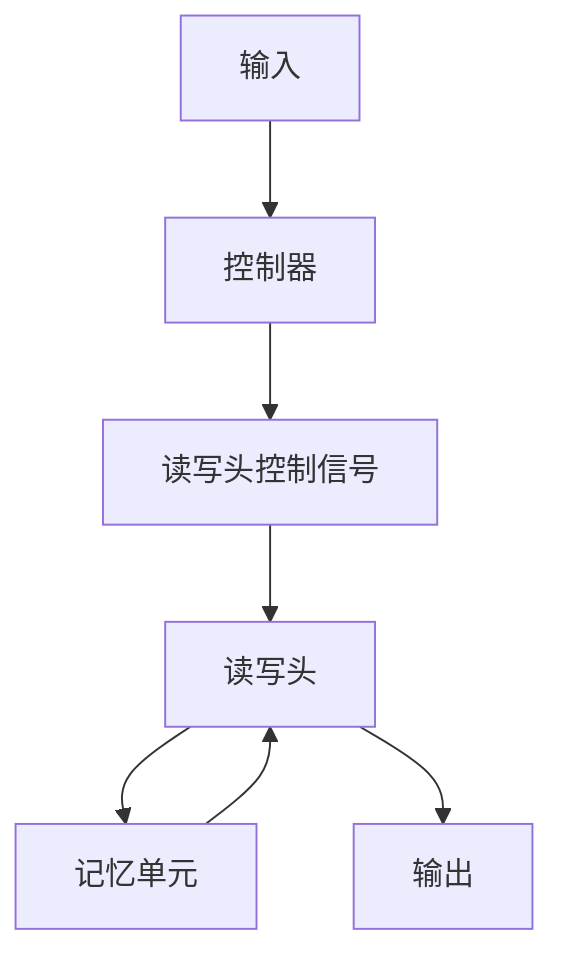

# 基于神经图灵机的算法设计能力增强方法

> 关键词：神经图灵机、算法设计、记忆增强、深度学习、人工智能

> 摘要：本文围绕基于神经图灵机的算法设计能力增强方法展开深入探讨。首先介绍了相关的背景知识，包括目的、预期读者、文档结构等内容。详细阐述了神经图灵机的核心概念与联系，包括其原理和架构，并通过文本示意图和 Mermaid 流程图进行清晰展示。深入剖析了核心算法原理，结合 Python 源代码进行具体操作步骤的讲解。对涉及的数学模型和公式进行详细说明，并举例阐释。通过项目实战，展示代码实际案例并进行详细解释。探讨了该方法的实际应用场景，推荐了相关的工具和资源。最后总结了未来发展趋势与挑战，提供了常见问题解答及扩展阅读和参考资料，旨在全面深入地介绍基于神经图灵机增强算法设计能力的方法和技术。

## 1. 背景介绍 
### 1.1 目的和范围
在当今人工智能和机器学习领域，算法设计的复杂性和难度不断增加。传统的神经网络模型在处理需要长期记忆和复杂推理的任务时，往往表现出一定的局限性。神经图灵机（Neural Turing Machine, NTM）作为一种具有外部记忆能力的深度学习模型，为增强算法设计能力提供了新的思路和方法。

本文的目的在于系统地介绍基于神经图灵机的算法设计能力增强方法，涵盖从理论基础到实际应用的各个方面。范围包括神经图灵机的核心概念、算法原理、数学模型、项目实战、应用场景以及相关工具和资源推荐等内容。

### 1.2 预期读者
本文预期读者包括对人工智能、机器学习、深度学习等领域感兴趣的研究人员、工程师和学生。对于希望深入了解神经图灵机及其在算法设计中应用的专业人士，以及希望拓展知识领域、探索新的算法设计方法的初学者都具有一定的参考价值。

### 1.3 文档结构概述
本文将按照以下结构进行组织：
1. **背景介绍**：介绍本文的目的、预期读者和文档结构概述，以及相关术语的定义和解释。
2. **核心概念与联系**：详细阐述神经图灵机的核心概念、原理和架构，通过文本示意图和 Mermaid 流程图进行直观展示。
3. **核心算法原理 & 具体操作步骤**：深入剖析神经图灵机的核心算法原理，并结合 Python 源代码进行具体操作步骤的讲解。
4. **数学模型和公式 & 详细讲解 & 举例说明**：对神经图灵机涉及的数学模型和公式进行详细说明，并通过具体例子进行阐释。
5. **项目实战：代码实际案例和详细解释说明**：通过一个具体的项目实战，展示基于神经图灵机的算法设计能力增强方法的代码实现，并进行详细的代码解读和分析。
6. **实际应用场景**：探讨基于神经图灵机的算法设计能力增强方法在不同领域的实际应用场景。
7. **工具和资源推荐**：推荐相关的学习资源、开发工具框架和论文著作。
8. **总结：未来发展趋势与挑战**：总结基于神经图灵机的算法设计能力增强方法的未来发展趋势和面临的挑战。
9. **附录：常见问题与解答**：提供常见问题的解答，帮助读者更好地理解和应用本文介绍的方法。
10. **扩展阅读 & 参考资料**：提供相关的扩展阅读材料和参考资料，方便读者进一步深入研究。

### 1.4 术语表
#### 1.4.1 核心术语定义
- **神经图灵机（Neural Turing Machine, NTM）**：一种结合了神经网络和图灵机概念的深度学习模型，具有外部记忆单元，能够进行读写操作，从而实现对长期记忆的存储和访问。
- **控制器（Controller）**：神经图灵机中的一个组件，通常由神经网络实现，负责根据输入产生读写操作的控制信号。
- **记忆单元（Memory）**：神经图灵机中的外部存储结构，用于存储长期记忆信息。
- **读写头（Read/Write Head）**：负责对记忆单元进行读写操作的组件，根据控制器产生的控制信号进行相应的操作。

#### 1.4.2 相关概念解释
- **注意力机制（Attention Mechanism）**：在神经图灵机中，注意力机制用于确定读写头在记忆单元中的位置，通过计算权重来实现对不同记忆位置的聚焦。
- **梯度下降（Gradient Descent）**：一种优化算法，用于更新神经图灵机中的参数，使得模型的损失函数最小化。

#### 1.4.3 缩略词列表
- **NTM**：Neural Turing Machine（神经图灵机）
- **LSTM**：Long Short - Term Memory（长短期记忆网络）
- **RNN**：Recurrent Neural Network（循环神经网络）

## 2. 核心概念与联系 
### 2.1 神经图灵机的原理
神经图灵机的核心思想是将神经网络的强大计算能力与图灵机的外部记忆能力相结合。传统的神经网络在处理序列数据时，其内部状态的存储能力有限，难以处理需要长期记忆的任务。而神经图灵机通过引入外部记忆单元，使得模型能够存储和访问大量的信息。

神经图灵机主要由三个组件组成：控制器、记忆单元和读写头。控制器是一个神经网络，它接收输入并产生控制信号，用于指导读写头对记忆单元进行读写操作。记忆单元是一个二维矩阵，用于存储长期记忆信息。读写头根据控制器的控制信号，在记忆单元中进行读写操作，从而实现对记忆的存储和访问。

### 2.2 神经图灵机的架构
下面是神经图灵机的架构示意图：

```plaintext
输入 ----> 控制器 ----> 读写头控制信号
                    |
                    v
               读写头 ----> 记忆单元（读写操作）
                    |
                    v
               输出（根据读写结果产生）
```

### 2.3 Mermaid 流程图


### 2.4 核心组件之间的联系
控制器是神经图灵机的核心计算单元，它根据输入信息产生读写头的控制信号。读写头根据这些控制信号在记忆单元中进行读写操作。记忆单元存储着长期记忆信息，读写头的操作会改变记忆单元的状态。最终，根据记忆单元的状态和读写结果，神经图灵机产生输出。这种组件之间的协同工作使得神经图灵机能够处理复杂的任务，特别是那些需要长期记忆和复杂推理的任务。

## 3. 核心算法原理 & 具体操作步骤 
### 3.1 核心算法原理
神经图灵机的核心算法主要包括控制器的计算、读写头的操作和记忆单元的更新。

#### 3.1.1 控制器的计算
控制器通常由一个循环神经网络（如 LSTM 或 GRU）实现。控制器接收输入序列 $x_t$，并根据当前的内部状态 $h_{t - 1}$ 计算新的内部状态 $h_t$：

$h_t = f(h_{t - 1}, x_t)$

其中 $f$ 是控制器的计算函数，通常由神经网络的前向传播过程实现。

#### 3.1.2 读写头的操作
读写头的操作包括读操作和写操作。读操作根据控制器产生的读权重 $w_{r,t}$ 从记忆单元 $M_t$ 中读取信息：

$r_t = \sum_{i = 1}^{N} w_{r,t}(i) M_t(i)$

其中 $N$ 是记忆单元的行数，$w_{r,t}(i)$ 是第 $i$ 行的读权重，$M_t(i)$ 是记忆单元的第 $i$ 行。

写操作包括擦除和写入两个步骤。擦除操作根据写权重 $w_{w,t}$ 和擦除向量 $e_t$ 对记忆单元进行擦除：

$M_t' = M_{t - 1} \odot (1 - w_{w,t} \otimes e_t)$

其中 $\odot$ 是逐元素相乘，$\otimes$ 是外积。

写入操作根据写权重 $w_{w,t}$ 和写入向量 $a_t$ 对记忆单元进行写入：

$M_t = M_t' + w_{w,t} \otimes a_t$

#### 3.1.3 记忆单元的更新
记忆单元的更新是通过读写头的操作实现的。在每个时间步，读写头根据控制器的控制信号对记忆单元进行读写操作，从而更新记忆单元的状态。

### 3.2 具体操作步骤
下面是使用 Python 实现神经图灵机的具体操作步骤和源代码：

```python
import torch
import torch.nn as nn
import torch.nn.functional as F

# 定义控制器（LSTM 示例）
class Controller(nn.Module):
    def __init__(self, input_size, hidden_size, num_layers):
        super(Controller, self).__init__()
        self.lstm = nn.LSTM(input_size, hidden_size, num_layers)

    def forward(self, x, h_0, c_0):
        output, (h_n, c_n) = self.lstm(x, (h_0, c_0))
        return output, h_n, c_n

# 定义读写头
class ReadWriteHead(nn.Module):
    def __init__(self, hidden_size, memory_size, memory_dim):
        super(ReadWriteHead, self).__init__()
        self.hidden_size = hidden_size
        self.memory_size = memory_size
        self.memory_dim = memory_dim

        # 计算读权重的线性层
        self.read_weight_layer = nn.Linear(hidden_size, memory_size)
        # 计算写权重的线性层
        self.write_weight_layer = nn.Linear(hidden_size, memory_size)
        # 计算擦除向量的线性层
        self.erase_layer = nn.Linear(hidden_size, memory_dim)
        # 计算写入向量的线性层
        self.add_layer = nn.Linear(hidden_size, memory_dim)

    def read(self, memory, hidden_state):
        read_weights = F.softmax(self.read_weight_layer(hidden_state), dim = 1)
        read_vector = torch.matmul(read_weights, memory)
        return read_vector, read_weights

    def write(self, memory, hidden_state):
        write_weights = F.softmax(self.write_weight_layer(hidden_state), dim = 1)
        erase_vector = torch.sigmoid(self.erase_layer(hidden_state))
        add_vector = self.add_layer(hidden_state)

        memory_prime = memory * (1 - torch.matmul(write_weights.transpose(0, 1), erase_vector))
        memory = memory_prime + torch.matmul(write_weights.transpose(0, 1), add_vector)
        return memory, write_weights

# 定义神经图灵机
class NeuralTuringMachine(nn.Module):
    def __init__(self, input_size, hidden_size, num_layers, memory_size, memory_dim):
        super(NeuralTuringMachine, self).__init__()
        self.controller = Controller(input_size, hidden_size, num_layers)
        self.read_write_head = ReadWriteHead(hidden_size, memory_size, memory_dim)
        self.memory = torch.zeros(memory_size, memory_dim)

    def forward(self, x):
        batch_size, seq_len, input_size = x.size()
        h_0 = torch.zeros(self.controller.lstm.num_layers, batch_size, self.controller.lstm.hidden_size)
        c_0 = torch.zeros(self.controller.lstm.num_layers, batch_size, self.controller.lstm.hidden_size)

        outputs = []
        for t in range(seq_len):
            input_t = x[:, t, :].unsqueeze(1)
            output_t, h_n, c_n = self.controller(input_t, h_0, c_0)
            hidden_state = h_n[-1]

            read_vector, read_weights = self.read_write_head.read(self.memory, hidden_state)
            self.memory, write_weights = self.read_write_head.write(self.memory, hidden_state)

            outputs.append(read_vector)

        outputs = torch.cat(outputs, dim = 1)
        return outputs
```

### 3.3 代码解释
1. **Controller 类**：实现了控制器的功能，使用 LSTM 作为控制器的计算单元。
2. **ReadWriteHead 类**：实现了读写头的功能，包括读操作和写操作。
3. **NeuralTuringMachine 类**：实现了神经图灵机的整体功能，包括控制器、读写头和记忆单元的协同工作。

在 `forward` 方法中，神经图灵机依次处理输入序列的每个时间步。在每个时间步，控制器根据输入计算新的内部状态，读写头根据内部状态对记忆单元进行读写操作，最终输出读取的信息。

## 4. 数学模型和公式 & 详细讲解 & 举例说明 
### 4.1 控制器的数学模型
控制器的数学模型可以表示为一个循环神经网络的前向传播过程。以 LSTM 为例，LSTM 的核心公式如下：

- 输入门：$i_t = \sigma(W_{ii} x_t + W_{hi} h_{t - 1} + b_i)$
- 遗忘门：$f_t = \sigma(W_{if} x_t + W_{hf} h_{t - 1} + b_f)$
- 细胞状态更新：$\tilde{C}_t = \tanh(W_{ic} x_t + W_{hc} h_{t - 1} + b_c)$
- 细胞状态：$C_t = f_t \odot C_{t - 1} + i_t \odot \tilde{C}_t$
- 输出门：$o_t = \sigma(W_{io} x_t + W_{ho} h_{t - 1} + b_o)$
- 隐藏状态：$h_t = o_t \odot \tanh(C_t)$

其中 $\sigma$ 是 sigmoid 函数，$\tanh$ 是双曲正切函数，$W$ 是权重矩阵，$b$ 是偏置向量。

### 4.2 读写头的数学模型
#### 4.2.1 读操作
读操作的数学公式为：

$r_t = \sum_{i = 1}^{N} w_{r,t}(i) M_t(i)$

其中 $w_{r,t}(i)$ 是第 $i$ 行的读权重，$M_t(i)$ 是记忆单元的第 $i$ 行。读权重 $w_{r,t}(i)$ 通常通过 softmax 函数计算得到，以确保权重之和为 1。

#### 4.2.2 写操作
写操作包括擦除和写入两个步骤。

擦除操作的数学公式为：

$M_t' = M_{t - 1} \odot (1 - w_{w,t} \otimes e_t)$

写入操作的数学公式为：

$M_t = M_t' + w_{w,t} \otimes a_t$

其中 $w_{w,t}$ 是写权重，$e_t$ 是擦除向量，$a_t$ 是写入向量。

### 4.3 举例说明
假设记忆单元 $M$ 是一个 $3 \times 2$ 的矩阵：

$$
M = 
\begin{bmatrix}
1 & 2 \\
3 & 4 \\
5 & 6
\end{bmatrix}
$$

读权重 $w_r = [0.2, 0.3, 0.5]$，则读操作的结果为：

$r = 0.2 \times \begin{bmatrix}1 \\ 2\end{bmatrix} + 0.3 \times \begin{bmatrix}3 \\ 4\end{bmatrix} + 0.5 \times \begin{bmatrix}5 \\ 6\end{bmatrix} = \begin{bmatrix}0.2\times1 + 0.3\times3 + 0.5\times5 \\ 0.2\times2 + 0.3\times4 + 0.5\times6\end{bmatrix} = \begin{bmatrix}3.6 \\ 4.6\end{bmatrix}$

假设写权重 $w_w = [0.1, 0.6, 0.3]$，擦除向量 $e = [0.5, 0.5]$，写入向量 $a = [1, 1]$，则擦除操作后的记忆单元 $M'$ 为：

$$
M' = M \odot (1 - w_w \otimes e) = 
\begin{bmatrix}
1 & 2 \\
3 & 4 \\
5 & 6
\end{bmatrix}
\odot 
\left(
\begin{bmatrix}
1 & 1 \\
1 & 1 \\
1 & 1
\end{bmatrix}
-
\begin{bmatrix}
0.1\times0.5 & 0.1\times0.5 \\
0.6\times0.5 & 0.6\times0.5 \\
0.3\times0.5 & 0.3\times0.5
\end{bmatrix}
\right)
= 
\begin{bmatrix}
1\times(1 - 0.05) & 2\times(1 - 0.05) \\
3\times(1 - 0.3) & 4\times(1 - 0.3) \\
5\times(1 - 0.15) & 6\times(1 - 0.15)
\end{bmatrix}
= 
\begin{bmatrix}
0.95 & 1.9 \\
2.1 & 2.8 \\
4.25 & 5.1
\end{bmatrix}
$$

写入操作后的记忆单元 $M$ 为：

$$
M = M' + w_w \otimes a = 
\begin{bmatrix}
0.95 & 1.9 \\
2.1 & 2.8 \\
4.25 & 5.1
\end{bmatrix}
+
\begin{bmatrix}
0.1\times1 & 0.1\times1 \\
0.6\times1 & 0.6\times1 \\
0.3\times1 & 0.3\times1
\end{bmatrix}
= 
\begin{bmatrix}
1.05 & 2.0 \\
2.7 & 3.4 \\
4.55 & 5.4
\end{bmatrix}
$$

## 5. 项目实战：代码实际案例和详细解释说明 
### 5.1  开发环境搭建
#### 5.1.1 安装 Python
首先，确保你已经安装了 Python 3.6 或更高版本。可以从 Python 官方网站（https://www.python.org/downloads/） 下载并安装适合你操作系统的 Python 版本。

#### 5.1.2 安装 PyTorch
PyTorch 是一个用于深度学习的开源框架，我们将使用 PyTorch 来实现神经图灵机。可以根据你的 CUDA 版本和操作系统，从 PyTorch 官方网站（https://pytorch.org/get-started/locally/） 选择合适的安装命令进行安装。例如，如果你使用的是 CPU 版本的 PyTorch，可以使用以下命令进行安装：

```sh
pip install torch torchvision
```

### 5.2  源代码详细实现和代码解读
#### 5.2.1 定义训练数据
我们以一个简单的序列复制任务为例，生成训练数据。

```python
import torch
import torch.nn as nn
import torch.optim as optim
import numpy as np

# 生成训练数据
def generate_data(batch_size, seq_len, input_dim):
    inputs = torch.randint(0, 2, (batch_size, seq_len, input_dim)).float()
    targets = inputs.clone()
    return inputs, targets
```

#### 5.2.2 训练神经图灵机
```python
# 定义超参数
input_size = 10
hidden_size = 20
num_layers = 1
memory_size = 10
memory_dim = 20
batch_size = 32
seq_len = 5
num_epochs = 100
learning_rate = 0.001

# 初始化神经图灵机
ntm = NeuralTuringMachine(input_size, hidden_size, num_layers, memory_size, memory_dim)

# 定义损失函数和优化器
criterion = nn.MSELoss()
optimizer = optim.Adam(ntm.parameters(), lr = learning_rate)

# 训练循环
for epoch in range(num_epochs):
    inputs, targets = generate_data(batch_size, seq_len, input_size)

    optimizer.zero_grad()
    outputs = ntm(inputs)
    loss = criterion(outputs, targets)
    loss.backward()
    optimizer.step()

    if (epoch + 1) % 10 == 0:
        print(f'Epoch [{epoch + 1}/{num_epochs}], Loss: {loss.item():.4f}')
```

### 5.3  代码解读与分析
1. **generate_data 函数**：用于生成训练数据，这里生成的是随机的二进制序列作为输入，目标输出与输入相同，用于序列复制任务。
2. **超参数设置**：设置了输入大小、隐藏层大小、层数、记忆单元大小、记忆单元维度、批量大小、序列长度、训练轮数和学习率等超参数。
3. **神经图灵机初始化**：初始化了神经图灵机模型。
4. **损失函数和优化器**：使用均方误差损失函数（MSE）和 Adam 优化器进行训练。
5. **训练循环**：在每个训练轮次中，生成训练数据，前向传播计算输出，计算损失，反向传播更新参数。每 10 个轮次打印一次损失值，以便观察训练过程。

## 6. 实际应用场景 
### 6.1 自然语言处理
在自然语言处理领域，神经图灵机可以用于处理需要长期记忆的任务，如文本生成、机器翻译等。例如，在文本生成任务中，神经图灵机可以通过记忆之前生成的文本信息，生成更加连贯和有逻辑的文本。在机器翻译任务中，神经图灵机可以记忆源语言文本的相关信息，从而更好地进行翻译。

### 6.2 强化学习
在强化学习中，神经图灵机可以作为智能体的决策模型。智能体在与环境交互的过程中，需要记忆之前的状态和动作信息，以便做出更好的决策。神经图灵机的外部记忆能力可以帮助智能体更好地存储和利用这些信息，从而提高学习效率和性能。

### 6.3 复杂任务推理
对于一些复杂的推理任务，如数学证明、逻辑推理等，神经图灵机可以通过其记忆能力存储中间推理结果，从而实现更复杂的推理过程。例如，在数学证明中，神经图灵机可以记忆已经证明的定理和中间步骤，以便在后续的推理中使用。

## 7. 工具和资源推荐
### 7.1 学习资源推荐
#### 7.1.1 书籍推荐
- 《深度学习》（Deep Learning）：由 Ian Goodfellow、Yoshua Bengio 和 Aaron Courville 合著，是深度学习领域的经典教材，涵盖了神经网络、优化算法、卷积神经网络等多个方面的内容。
- 《Python 深度学习》（Deep Learning with Python）：由 Francois Chollet 著，介绍了如何使用 Python 和 Keras 进行深度学习实践，适合初学者入门。

#### 7.1.2 在线课程
- Coursera 上的“深度学习专项课程”（Deep Learning Specialization）：由 Andrew Ng 教授授课，包括神经网络和深度学习、改善深层神经网络、结构化机器学习项目等多个课程，全面介绍了深度学习的理论和实践。
- edX 上的“强化学习基础”（Foundations of Reinforcement Learning）：介绍了强化学习的基本概念、算法和应用，对于理解神经图灵机在强化学习中的应用有很大帮助。

#### 7.1.3 技术博客和网站
- Medium 上的 Towards Data Science：有许多关于深度学习、人工智能的技术文章和案例分享。
- arXiv：一个预印本数据库，包含了大量的最新研究成果和论文，可以及时了解神经图灵机等领域的最新进展。

### 7.2 开发工具框架推荐
#### 7.2.1 IDE和编辑器
- PyCharm：一款专业的 Python 集成开发环境，提供了代码编辑、调试、版本控制等丰富的功能，适合开发基于 Python 的深度学习项目。
- Jupyter Notebook：一个交互式的开发环境，可以方便地进行代码编写、运行和可视化，对于快速验证和实验神经图灵机的代码非常有用。

#### 7.2.2 调试和性能分析工具
- TensorBoard：一个用于可视化深度学习训练过程的工具，可以帮助我们观察损失函数的变化、模型参数的分布等信息，便于调试和优化模型。
- PyTorch Profiler：可以帮助我们分析模型的性能瓶颈，找出耗时较长的操作，从而进行优化。

#### 7.2.3 相关框架和库
- PyTorch：一个开源的深度学习框架，提供了丰富的神经网络模块和优化算法，方便我们实现神经图灵机等深度学习模型。
- NumPy：一个用于科学计算的 Python 库，提供了高效的数组操作和数学函数，在处理数据和实现算法时非常有用。

### 7.3 相关论文著作推荐
#### 7.3.1 经典论文
- "Neural Turing Machines"：由 Alex Graves、Greg Wayne 和 Ivo Danihelka 发表，首次提出了神经图灵机的概念，详细介绍了神经图灵机的原理和架构。
- "Show, Attend and Tell: Neural Image Caption Generation with Visual Attention"：提出了注意力机制在图像描述生成任务中的应用，对于理解神经图灵机中的注意力机制有一定的参考价值。

#### 7.3.2 最新研究成果
可以通过 arXiv、IEEE Xplore 等数据库搜索关于神经图灵机的最新研究论文，了解该领域的最新进展和研究方向。

#### 7.3.3 应用案例分析
一些会议论文和技术报告中会有神经图灵机在不同领域的应用案例分析，如自然语言处理、强化学习等领域，可以从中学习到实际应用中的经验和技巧。

## 8. 总结：未来发展趋势与挑战
### 8.1 未来发展趋势
#### 8.1.1 与其他模型的融合
神经图灵机可能会与其他深度学习模型，如卷积神经网络（CNN）、生成对抗网络（GAN）等进行融合，以发挥各自的优势，解决更复杂的任务。例如，将神经图灵机与 CNN 结合，可以用于处理图像和视频中的复杂推理任务。

#### 8.1.2 应用领域的拓展
随着技术的不断发展，神经图灵机的应用领域将不断拓展。除了自然语言处理、强化学习等领域，还可能应用于医疗、金融、交通等更多领域，为解决实际问题提供新的方法和思路。

#### 8.1.3 理论研究的深入
对神经图灵机的理论研究将不断深入，包括模型的可解释性、收敛性分析等方面。这将有助于更好地理解神经图灵机的工作原理，提高模型的性能和可靠性。

### 8.2 挑战
#### 8.2.1 计算资源需求高
神经图灵机的训练和推理过程需要大量的计算资源，特别是在处理大规模数据和复杂任务时，计算资源的需求更为突出。这限制了神经图灵机的应用范围和效率。

#### 8.2.2 模型可解释性差
神经图灵机作为一种深度学习模型，其内部的工作机制比较复杂，难以解释。在一些对可解释性要求较高的领域，如医疗诊断、金融决策等，这是一个亟待解决的问题。

#### 8.2.3 训练难度大
神经图灵机的训练过程比较复杂，需要合理设置超参数和优化算法。由于模型的复杂性，训练过程中容易出现梯度消失、梯度爆炸等问题，导致训练不稳定。

## 9. 附录：常见问题与解答
### 9.1 神经图灵机与传统神经网络有什么区别？
神经图灵机与传统神经网络的主要区别在于引入了外部记忆单元。传统神经网络的内部状态存储能力有限，难以处理需要长期记忆的任务。而神经图灵机通过外部记忆单元，可以存储和访问大量的信息，从而更好地处理复杂的任务。

### 9.2 如何选择神经图灵机的超参数？
神经图灵机的超参数包括输入大小、隐藏层大小、层数、记忆单元大小、记忆单元维度等。选择超参数通常需要进行实验和调优。可以从一些经验值开始，然后根据训练过程中的损失函数变化和模型性能进行调整。

### 9.3 神经图灵机的训练时间为什么这么长？
神经图灵机的训练时间长主要是由于其模型的复杂性和计算资源需求高。神经图灵机需要对外部记忆单元进行读写操作，这增加了计算量。此外，训练过程中需要调整的参数较多，也会导致训练时间延长。

### 9.4 如何提高神经图灵机的性能？
可以从以下几个方面提高神经图灵机的性能：
- 合理选择超参数，如隐藏层大小、记忆单元大小等。
- 优化训练算法，如选择合适的优化器和学习率。
- 增加训练数据的数量和多样性，提高模型的泛化能力。
- 结合其他技术，如注意力机制、正则化等，改善模型的性能。

## 10. 扩展阅读 & 参考资料
### 10.1 扩展阅读
- "Attention Is All You Need"：介绍了 Transformer 模型，其中的注意力机制与神经图灵机中的注意力机制有一定的关联，可以深入了解注意力机制的原理和应用。
- "Reinforcement Learning: An Introduction"：全面介绍了强化学习的理论和算法，对于理解神经图灵机在强化学习中的应用有很大帮助。

### 10.2 参考资料
- 相关的学术论文和研究报告，如在 arXiv、IEEE Xplore、ACM Digital Library 等数据库中搜索到的关于神经图灵机的论文。
- 开源代码库，如 GitHub 上的神经图灵机实现代码，可以参考和学习他人的实现方法。