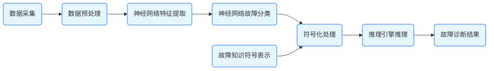

# 基于神经符号推理的自动故障诊断系统

> 关键词：神经符号推理、自动故障诊断、深度学习、符号逻辑、知识表示

> 摘要：本文围绕基于神经符号推理的自动故障诊断系统展开深入探讨。首先介绍了该系统提出的背景、目的、适用读者群体以及文档结构和相关术语。接着详细阐述了神经符号推理和自动故障诊断的核心概念及其联系，给出了原理和架构的文本示意图与 Mermaid 流程图。在核心算法原理部分，通过 Python 源代码详细讲解。同时，介绍了相关的数学模型和公式，并举例说明。项目实战部分展示了开发环境搭建、源代码实现与解读。还分析了该系统的实际应用场景，推荐了学习资源、开发工具框架以及相关论文著作。最后总结了未来发展趋势与挑战，提供了常见问题解答和扩展阅读参考资料，旨在为相关领域的研究和实践提供全面而深入的技术指导。

## 1. 背景介绍 
### 1.1 目的和范围
在现代工业生产、交通运输、航空航天等众多领域，设备的复杂性和自动化程度不断提高。设备故障不仅会导致生产效率下降、成本增加，还可能引发安全事故，造成人员伤亡和财产损失。因此，及时、准确地诊断设备故障至关重要。传统的故障诊断方法往往依赖于专家经验和手工规则，难以应对复杂多变的故障情况。基于神经符号推理的自动故障诊断系统旨在结合深度学习的强大感知能力和符号逻辑的可解释性，实现高效、准确且可解释的故障诊断。本系统的范围涵盖了多种类型的设备和系统，如机械系统、电子电路、工业生产线等。

### 1.2 预期读者
本文预期读者包括从事故障诊断、人工智能、机器学习等领域的研究人员和工程师，以及对自动故障诊断技术感兴趣的高校师生。对于希望将神经符号推理技术应用于实际故障诊断问题的专业人士，本文提供了理论基础、技术细节和实践案例；对于初学者，本文可以帮助他们了解该领域的基本概念和技术原理。

### 1.3 文档结构概述
本文首先介绍背景信息，包括目的、预期读者和文档结构。接着阐述核心概念与联系，包括神经符号推理和自动故障诊断的原理和架构。然后详细讲解核心算法原理和具体操作步骤，通过 Python 代码实现。随后介绍相关的数学模型和公式，并举例说明。项目实战部分展示开发环境搭建、源代码实现和代码解读。接着分析实际应用场景，推荐学习资源、开发工具框架和相关论文著作。最后总结未来发展趋势与挑战，提供常见问题解答和扩展阅读参考资料。

### 1.4 术语表
#### 1.4.1 核心术语定义
- **神经符号推理**：将神经网络的感知能力与符号逻辑的推理能力相结合的一种推理方法。神经网络用于从数据中提取特征和模式，符号逻辑用于对知识进行表示和推理。
- **自动故障诊断**：利用计算机技术和人工智能算法，自动检测设备或系统中的故障，并确定故障的类型和位置。
- **深度学习**：一种基于人工神经网络的机器学习方法，通过多层神经网络对数据进行学习和表示。
- **符号逻辑**：用符号和规则来表示和处理知识的逻辑系统，如一阶逻辑、产生式规则等。
- **知识表示**：将知识以计算机能够处理的形式进行表示的方法，如语义网络、框架、本体等。

#### 1.4.2 相关概念解释
- **神经网络**：由大量神经元组成的计算模型，能够自动学习数据中的模式和特征。常见的神经网络包括卷积神经网络（CNN）、循环神经网络（RNN）等。
- **特征提取**：从原始数据中提取出具有代表性的特征，以便后续的分析和处理。在故障诊断中，特征提取可以帮助识别故障的特征模式。
- **推理引擎**：基于知识表示和推理规则，对输入的信息进行推理和判断，得出结论的软件模块。
- **本体**：一种形式化的知识表示方法，用于描述领域内的概念、关系和规则。本体可以帮助实现知识的共享和重用。

#### 1.4.3 缩略词列表
- **CNN**：Convolutional Neural Network，卷积神经网络
- **RNN**：Recurrent Neural Network，循环神经网络
- **MLP**：Multi - Layer Perceptron，多层感知机
- **FOL**：First - Order Logic，一阶逻辑

## 2. 核心概念与联系 

### 神经符号推理原理
神经符号推理的核心思想是将神经网络和符号逻辑有机结合。神经网络具有强大的感知能力，能够从大量的数据中自动学习到复杂的模式和特征。例如，在图像识别中，卷积神经网络可以自动提取图像中的边缘、纹理等特征。而符号逻辑则具有可解释性和推理能力，能够对知识进行明确的表示和推理。例如，一阶逻辑可以用逻辑公式来表示知识和规则，通过推理规则进行推理。

神经符号推理的实现方式有多种，一种常见的方式是将神经网络的输出作为符号逻辑的输入，然后利用符号逻辑进行推理。另一种方式是将符号知识融入到神经网络的训练过程中，指导神经网络的学习。

### 自动故障诊断原理
自动故障诊断的基本原理是通过对设备或系统的运行数据进行监测和分析，识别出故障的特征模式，从而确定故障的类型和位置。故障诊断的过程通常包括数据采集、特征提取、故障分类和故障定位等步骤。

数据采集是故障诊断的基础，通过传感器等设备获取设备或系统的运行数据，如温度、压力、振动等。特征提取是从采集到的数据中提取出具有代表性的特征，以便后续的分析和处理。故障分类是根据提取的特征将故障分为不同的类型，故障定位是确定故障发生的具体位置。

### 神经符号推理与自动故障诊断的联系
神经符号推理为自动故障诊断提供了一种有效的方法。神经网络可以用于对设备运行数据进行特征提取和故障分类，而符号逻辑可以用于对故障知识进行表示和推理，提高故障诊断的可解释性和准确性。例如，在故障诊断中，可以利用神经网络从传感器数据中提取故障特征，然后利用符号逻辑对这些特征进行推理，判断故障的类型和原因。

### 核心概念原理和架构的文本示意图
神经符号推理的自动故障诊断系统主要由数据采集模块、神经网络模块、符号逻辑模块和推理引擎模块组成。数据采集模块负责采集设备的运行数据，神经网络模块对采集到的数据进行特征提取和故障分类，符号逻辑模块将故障知识进行符号化表示，推理引擎模块根据神经网络的输出和符号知识进行推理，得出故障诊断结果。

### Mermaid 流程图


## 3. 核心算法原理 & 具体操作步骤 

### 核心算法原理
神经符号推理的自动故障诊断系统主要涉及到两个核心算法：神经网络算法和符号逻辑推理算法。

#### 神经网络算法
这里以多层感知机（MLP）为例，多层感知机是一种前馈神经网络，由输入层、隐藏层和输出层组成。其基本原理是通过对输入数据进行加权求和和非线性变换，将输入数据映射到输出空间。

Python 代码实现多层感知机：
```python
import torch
import torch.nn as nn

class MLP(nn.Module):
    def __init__(self, input_size, hidden_size, output_size):
        super(MLP, self).__init__()
        self.fc1 = nn.Linear(input_size, hidden_size)
        self.relu = nn.ReLU()
        self.fc2 = nn.Linear(hidden_size, output_size)

    def forward(self, x):
        out = self.fc1(x)
        out = self.relu(out)
        out = self.fc2(out)
        return out

# 示例使用
input_size = 10
hidden_size = 20
output_size = 5
mlp = MLP(input_size, hidden_size, output_size)
input_data = torch.randn(1, input_size)
output = mlp(input_data)
print(output)
```
在这个代码中，我们定义了一个简单的多层感知机模型，包含一个输入层、一个隐藏层和一个输出层。`forward` 方法定义了数据在模型中的前向传播过程。

#### 符号逻辑推理算法
符号逻辑推理可以使用一阶逻辑（FOL）来实现。一阶逻辑是一种形式化的逻辑系统，用逻辑公式来表示知识和规则。例如，我们可以用一阶逻辑公式表示故障知识：如果设备的温度超过阈值且压力超过阈值，则设备发生故障。

Python 代码实现简单的符号逻辑推理：
```python
# 定义符号逻辑规则
def rule(temperature, pressure, temp_threshold, pressure_threshold):
    if temperature > temp_threshold and pressure > pressure_threshold:
        return True
    else:
        return False

# 示例使用
temperature = 80
pressure = 120
temp_threshold = 70
pressure_threshold = 100
result = rule(temperature, pressure, temp_threshold, pressure_threshold)
print(result)
```
在这个代码中，我们定义了一个简单的符号逻辑规则，根据设备的温度和压力是否超过阈值来判断设备是否发生故障。

### 具体操作步骤
1. **数据采集**：使用传感器等设备采集设备的运行数据，如温度、压力、振动等。
2. **数据预处理**：对采集到的数据进行清洗、归一化等预处理操作，以提高数据的质量和可用性。
3. **神经网络训练**：使用预处理后的数据对神经网络进行训练，使其能够准确地提取故障特征和进行故障分类。
4. **符号知识表示**：将故障知识用符号逻辑进行表示，形成符号知识库。
5. **推理引擎推理**：将神经网络的输出和符号知识库作为输入，利用推理引擎进行推理，得出故障诊断结果。

## 4. 数学模型和公式 & 详细讲解 & 举例说明 

### 神经网络数学模型
#### 多层感知机的数学模型
多层感知机的数学模型可以用以下公式表示：

设输入层有 $n$ 个神经元，隐藏层有 $m$ 个神经元，输出层有 $k$ 个神经元。输入向量为 $\mathbf{x}=(x_1,x_2,\cdots,x_n)^T$，隐藏层的输入为 $\mathbf{z}_1=(z_{11},z_{12},\cdots,z_{1m})^T$，输出为 $\mathbf{h}=(h_1,h_2,\cdots,h_m)^T$，输出层的输入为 $\mathbf{z}_2=(z_{21},z_{22},\cdots,z_{2k})^T$，输出为 $\mathbf{y}=(y_1,y_2,\cdots,y_k)^T$。

隐藏层的输入计算：
$$z_{1j}=\sum_{i = 1}^{n}w_{1ji}x_i + b_{1j}, j = 1,2,\cdots,m$$
其中 $w_{1ji}$ 是输入层第 $i$ 个神经元到隐藏层第 $j$ 个神经元的权重，$b_{1j}$ 是隐藏层第 $j$ 个神经元的偏置。

隐藏层的输出计算：
$$h_j = f(z_{1j}), j = 1,2,\cdots,m$$
其中 $f$ 是激活函数，如 ReLU 函数 $f(x)=\max(0,x)$。

输出层的输入计算：
$$z_{2l}=\sum_{j = 1}^{m}w_{2lj}h_j + b_{2l}, l = 1,2,\cdots,k$$
其中 $w_{2lj}$ 是隐藏层第 $j$ 个神经元到输出层第 $l$ 个神经元的权重，$b_{2l}$ 是输出层第 $l$ 个神经元的偏置。

输出层的输出计算：
$$y_l = g(z_{2l}), l = 1,2,\cdots,k$$
其中 $g$ 是激活函数，如 softmax 函数用于分类问题。

#### 举例说明
假设输入层有 2 个神经元，隐藏层有 3 个神经元，输出层有 1 个神经元。输入向量 $\mathbf{x}=(1,2)^T$，权重矩阵 $\mathbf{W}_1=\begin{bmatrix}0.1 & 0.2\\0.3 & 0.4\\0.5 & 0.6\end{bmatrix}$，偏置向量 $\mathbf{b}_1=(0.1,0.2,0.3)^T$，激活函数为 ReLU 函数。

隐藏层的输入计算：
$$z_{11}=0.1\times1 + 0.2\times2+0.1 = 0.6$$
$$z_{12}=0.3\times1 + 0.4\times2+0.2 = 1.3$$
$$z_{13}=0.5\times1 + 0.6\times2+0.3 = 2$$

隐藏层的输出计算：
$$h_1 = \max(0,0.6)=0.6$$
$$h_2 = \max(0,1.3)=1.3$$
$$h_3 = \max(0,2)=2$$

假设权重矩阵 $\mathbf{W}_2=(0.1,0.2,0.3)$，偏置 $b_2 = 0.1$，激活函数为线性函数。

输出层的输入计算：
$$z_{21}=0.1\times0.6 + 0.2\times1.3+0.3\times2+0.1 = 0.92$$

输出层的输出：
$$y_1 = 0.92$$

### 符号逻辑数学模型
#### 一阶逻辑公式
一阶逻辑公式由原子公式、逻辑连接词和量词组成。原子公式是最基本的逻辑表达式，如 $P(x)$ 表示 $x$ 具有属性 $P$。逻辑连接词包括 $\neg$（非）、$\wedge$（与）、$\vee$（或）、$\rightarrow$（蕴含）等。量词包括 $\forall$（全称量词）和 $\exists$（存在量词）。

例如，一阶逻辑公式 $\forall x (P(x)\rightarrow Q(x))$ 表示对于所有的 $x$，如果 $x$ 具有属性 $P$，则 $x$ 具有属性 $Q$。

#### 推理规则
一阶逻辑的推理规则包括肯定前件规则（Modus Ponens）：如果有 $A\rightarrow B$ 和 $A$，则可以推出 $B$。

#### 举例说明
假设我们有以下知识：
- 规则：$\forall x (Temperature(x)>70\wedge Pressure(x)>100\rightarrow Fault(x))$
- 事实：$Temperature(Device1)=80$，$Pressure(Device1)=120$

根据肯定前件规则，我们可以推出 $Fault(Device1)$，即设备 1 发生故障。

## 5. 项目实战：代码实际案例和详细解释说明 

### 5.1  开发环境搭建
#### 操作系统
可以选择 Linux（如 Ubuntu）、Windows 或 macOS 作为开发环境。

#### 编程语言和框架
- **Python**：作为主要的编程语言，版本建议使用 3.7 及以上。
- **PyTorch**：用于构建和训练神经网络，安装命令：
```bash
pip install torch torchvision
```
- **SymPy**：用于符号逻辑推理，安装命令：
```bash
pip install sympy
```

#### 数据处理工具
- **NumPy**：用于数值计算，安装命令：
```bash
pip install numpy
```
- **Pandas**：用于数据处理和分析，安装命令：
```bash
pip install pandas
```

### 5.2  源代码详细实现和代码解读
```python
import torch
import torch.nn as nn
import torch.optim as optim
import numpy as np
import sympy as sp

# 生成示例数据
np.random.seed(42)
n_samples = 100
input_size = 10
output_size = 2
X = np.random.randn(n_samples, input_size)
y = np.random.randint(0, output_size, n_samples)
X = torch.tensor(X, dtype=torch.float32)
y = torch.tensor(y, dtype=torch.long)

# 定义神经网络模型
class MLP(nn.Module):
    def __init__(self, input_size, hidden_size, output_size):
        super(MLP, self).__init__()
        self.fc1 = nn.Linear(input_size, hidden_size)
        self.relu = nn.ReLU()
        self.fc2 = nn.Linear(hidden_size, output_size)

    def forward(self, x):
        out = self.fc1(x)
        out = self.relu(out)
        out = self.fc2(out)
        return out

# 初始化模型、损失函数和优化器
hidden_size = 20
model = MLP(input_size, hidden_size, output_size)
criterion = nn.CrossEntropyLoss()
optimizer = optim.Adam(model.parameters(), lr=0.001)

# 训练模型
num_epochs = 100
for epoch in range(num_epochs):
    outputs = model(X)
    loss = criterion(outputs, y)

    optimizer.zero_grad()
    loss.backward()
    optimizer.step()

    if (epoch + 1) % 10 == 0:
        print(f'Epoch [{epoch + 1}/{num_epochs}], Loss: {loss.item():.4f}')

# 符号逻辑推理
# 定义符号
temperature, pressure = sp.symbols('temperature pressure')
temp_threshold = 70
pressure_threshold = 100
# 定义规则
rule = (temperature > temp_threshold) & (pressure > pressure_threshold)
# 示例数据
temp_value = 80
pressure_value = 120
# 代入数据进行推理
result = rule.subs({temperature: temp_value, pressure: pressure_value})
print(f'符号逻辑推理结果: {result}')
```
### 5.3  代码解读与分析
#### 数据生成部分
```python
np.random.seed(42)
n_samples = 100
input_size = 10
output_size = 2
X = np.random.randn(n_samples, input_size)
y = np.random.randint(0, output_size, n_samples)
X = torch.tensor(X, dtype=torch.float32)
y = torch.tensor(y, dtype=torch.long)
```
这段代码生成了示例数据，包括输入数据 `X` 和标签数据 `y`，并将其转换为 PyTorch 张量。

#### 神经网络模型部分
```python
class MLP(nn.Module):
    def __init__(self, input_size, hidden_size, output_size):
        super(MLP, self).__init__()
        self.fc1 = nn.Linear(input_size, hidden_size)
        self.relu = nn.ReLU()
        self.fc2 = nn.Linear(hidden_size, output_size)

    def forward(self, x):
        out = self.fc1(x)
        out = self.relu(out)
        out = self.fc2(out)
        return out
```
定义了一个简单的多层感知机模型，包括一个输入层、一个隐藏层和一个输出层。

#### 训练部分
```python
hidden_size = 20
model = MLP(input_size, hidden_size, output_size)
criterion = nn.CrossEntropyLoss()
optimizer = optim.Adam(model.parameters(), lr=0.001)

num_epochs = 100
for epoch in range(num_epochs):
    outputs = model(X)
    loss = criterion(outputs, y)

    optimizer.zero_grad()
    loss.backward()
    optimizer.step()

    if (epoch + 1) % 10 == 0:
        print(f'Epoch [{epoch + 1}/{num_epochs}], Loss: {loss.item():.4f}')
```
初始化模型、损失函数和优化器，然后进行训练，每 10 个 epoch 打印一次损失值。

#### 符号逻辑推理部分
```python
temperature, pressure = sp.symbols('temperature pressure')
temp_threshold = 70
pressure_threshold = 100
rule = (temperature > temp_threshold) & (pressure > pressure_threshold)
temp_value = 80
pressure_value = 120
result = rule.subs({temperature: temp_value, pressure: pressure_value})
print(f'符号逻辑推理结果: {result}')
```
使用 SymPy 定义符号和规则，然后代入具体数据进行推理，输出推理结果。

## 6. 实际应用场景 
### 工业制造领域
在工业制造中，设备的故障会导致生产线停工，影响生产效率和产品质量。基于神经符号推理的自动故障诊断系统可以实时监测设备的运行状态，及时发现故障并进行诊断。例如，在汽车制造生产线中，系统可以对机器人、数控机床等设备进行故障诊断，通过对设备的振动、温度、电流等数据进行分析，结合故障知识进行推理，快速准确地定位故障原因，减少停机时间。

### 交通运输领域
在交通运输领域，如飞机、火车、汽车等交通工具的故障会危及乘客的生命安全。基于神经符号推理的自动故障诊断系统可以对交通工具的发动机、制动系统、电气系统等关键部件进行实时监测和故障诊断。例如，飞机发动机的故障诊断系统可以通过对发动机的转速、温度、压力等数据进行分析，结合发动机的故障知识进行推理，提前发现潜在的故障隐患，确保飞行安全。

### 能源电力领域
在能源电力领域，发电设备、输电线路等的故障会影响电力供应的稳定性。基于神经符号推理的自动故障诊断系统可以对发电设备的运行状态进行监测，对输电线路的故障进行定位。例如，在风力发电场中，系统可以对风力发电机组的叶片、齿轮箱、发电机等部件进行故障诊断，通过对风速、功率、振动等数据进行分析，结合风力发电机组的故障知识进行推理，提高发电效率和可靠性。

## 7. 工具和资源推荐
### 7.1 学习资源推荐
#### 7.1.1 书籍推荐
- 《深度学习》（Deep Learning）：由 Ian Goodfellow、Yoshua Bengio 和 Aaron Courville 所著，是深度学习领域的经典教材，全面介绍了深度学习的基本原理、算法和应用。
- 《人工智能：一种现代的方法》（Artificial Intelligence: A Modern Approach）：由 Stuart Russell 和 Peter Norvig 所著，是人工智能领域的权威教材，涵盖了人工智能的各个方面，包括知识表示、推理、机器学习等。
- 《模式识别与机器学习》（Pattern Recognition and Machine Learning）：由 Christopher Bishop 所著，详细介绍了模式识别和机器学习的基本理论和算法。

#### 7.1.2 在线课程
- Coursera 上的《深度学习专项课程》（Deep Learning Specialization）：由 Andrew Ng 教授授课，系统地介绍了深度学习的理论和实践。
- edX 上的《人工智能导论》（Introduction to Artificial Intelligence）：由麻省理工学院（MIT）的教授授课，全面介绍了人工智能的基本概念和技术。
- 中国大学 MOOC 上的《机器学习》：由周志华教授授课，讲解了机器学习的基本原理和算法。

#### 7.1.3 技术博客和网站
- Medium：有很多关于人工智能、深度学习和故障诊断的技术博客文章，提供了最新的研究成果和实践经验。
- arXiv：是一个预印本服务器，提供了大量的学术论文，包括神经符号推理、自动故障诊断等领域的最新研究成果。
- 机器之心：专注于人工智能领域的资讯和技术分享，提供了丰富的技术文章和案例分析。

### 7.2 开发工具框架推荐
#### 7.2.1 IDE和编辑器
- PyCharm：是一款专门为 Python 开发设计的集成开发环境（IDE），提供了代码编辑、调试、版本控制等功能，方便开发人员进行 Python 项目的开发。
- Jupyter Notebook：是一个交互式的开发环境，支持多种编程语言，适合进行数据探索、模型训练和可视化等工作。
- Visual Studio Code：是一款轻量级的代码编辑器，支持多种编程语言和插件，具有丰富的扩展功能。

#### 7.2.2 调试和性能分析工具
- PyTorch Profiler：是 PyTorch 提供的性能分析工具，可以帮助开发人员分析模型的性能瓶颈，优化模型的训练和推理速度。
- TensorBoard：是 TensorFlow 提供的可视化工具，也可以用于 PyTorch 项目，用于可视化模型的训练过程、损失曲线、准确率等指标。
- cProfile：是 Python 内置的性能分析工具，可以帮助开发人员分析 Python 代码的性能瓶颈。

#### 7.2.3 相关框架和库
- PyTorch：是一个开源的深度学习框架，提供了丰富的神经网络模型和工具，方便开发人员进行深度学习模型的构建和训练。
- TensorFlow：是另一个流行的深度学习框架，具有强大的分布式训练和部署能力。
- SymPy：是一个 Python 库，用于符号数学计算，支持符号逻辑推理、方程求解等功能。

### 7.3 相关论文著作推荐
#### 7.3.1 经典论文
- “Neural-Symbolic Learning and Reasoning: A Survey and Interpretation”：对神经符号学习和推理进行了全面的综述和解释，介绍了神经符号推理的基本概念、方法和应用。
- “Deep Learning for Fault Diagnosis: A Review”：对深度学习在故障诊断中的应用进行了综述，介绍了深度学习在故障诊断中的优势和挑战。

#### 7.3.2 最新研究成果
- 关注 NeurIPS、ICML、CVPR 等顶级学术会议的论文，这些会议收录了神经符号推理、自动故障诊断等领域的最新研究成果。
- 关注相关学术期刊，如《Artificial Intelligence》、《Pattern Recognition》等，这些期刊发表了该领域的高质量研究论文。

#### 7.3.3 应用案例分析
- 一些工业界的技术报告和案例研究，介绍了基于神经符号推理的自动故障诊断系统在实际应用中的效果和经验。
- 开源项目的文档和案例，如一些开源的故障诊断系统的文档，提供了实际应用的代码和案例分析。

## 8. 总结：未来发展趋势与挑战
### 未来发展趋势
#### 多模态数据融合
未来的自动故障诊断系统将融合更多类型的数据，如图像、声音、文本等多模态数据。例如，在工业设备故障诊断中，除了传感器数据外，还可以结合设备的图像信息，通过神经网络提取图像特征，再与传感器数据结合进行故障诊断，提高诊断的准确性。

#### 强化学习与神经符号推理的结合
强化学习可以通过与环境的交互不断优化策略，将强化学习与神经符号推理相结合，可以使自动故障诊断系统在动态环境中自适应地进行故障诊断和决策。例如，在智能电网的故障诊断中，系统可以通过强化学习不断调整诊断策略，以适应电网的动态变化。

#### 跨领域知识融合
将不同领域的知识进行融合，可以提高自动故障诊断系统的泛化能力。例如，将机械工程、电子工程、控制工程等领域的知识融合到故障诊断系统中，可以更好地处理复杂的设备故障。

### 挑战
#### 知识表示和推理的复杂性
随着故障知识的不断增加和复杂化，如何有效地表示和管理知识，以及如何高效地进行推理是一个挑战。需要研究更加高效的知识表示方法和推理算法，以提高系统的性能。

#### 数据质量和标注问题
自动故障诊断系统依赖于大量的高质量数据，但是实际应用中数据可能存在噪声、缺失等问题，影响系统的性能。此外，数据的标注也是一个难题，需要耗费大量的人力和时间。

#### 可解释性和可信度问题
虽然神经符号推理提高了故障诊断的可解释性，但是在一些复杂的情况下，系统的推理过程仍然难以理解。如何进一步提高系统的可解释性和可信度，是未来需要解决的问题。

## 9. 附录：常见问题与解答
### 问题 1：神经符号推理和传统的机器学习方法有什么区别？
神经符号推理结合了神经网络的感知能力和符号逻辑的推理能力，具有可解释性和推理能力强的优点。传统的机器学习方法主要基于数据驱动，缺乏对知识的明确表示和推理能力，解释性较差。

### 问题 2：如何选择合适的神经网络模型进行故障诊断？
选择合适的神经网络模型需要考虑数据的特点和故障诊断的任务。如果数据是图像数据，可以选择卷积神经网络（CNN）；如果数据是序列数据，可以选择循环神经网络（RNN）或其变种（如 LSTM、GRU）；对于一般的数值数据，可以选择多层感知机（MLP）。

### 问题 3：符号逻辑推理的效率如何提高？
可以通过优化推理算法、采用并行计算等方法提高符号逻辑推理的效率。此外，对符号知识库进行合理的组织和管理，也可以提高推理的效率。

### 问题 4：如何处理数据中的噪声和缺失值？
对于数据中的噪声，可以采用滤波、平滑等方法进行处理。对于缺失值，可以采用插值、填充等方法进行处理，也可以使用一些基于机器学习的方法进行预测和填充。

## 10. 扩展阅读 & 参考资料
### 扩展阅读
- 《知识图谱：方法、实践与应用》：深入介绍了知识图谱的构建、推理和应用，对于理解符号知识表示和推理有很大的帮助。
- 《智能计算系统》：介绍了智能计算系统的原理和技术，包括硬件和软件方面的知识，有助于了解自动故障诊断系统的实现和优化。

### 参考资料
- 相关学术论文和技术报告，如在 arXiv、IEEE Xplore 等数据库中搜索到的关于神经符号推理和自动故障诊断的论文。
- 开源项目的文档和代码，如 PyTorch、TensorFlow 等开源框架的官方文档和示例代码。