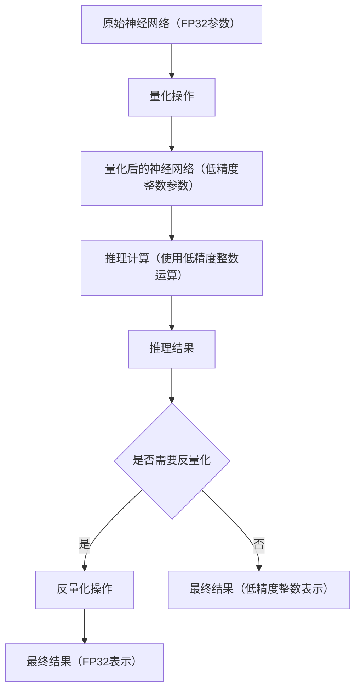

# 基于神经网络量化的边缘AI推理加速技术

> 关键词：神经网络量化、边缘AI、推理加速、深度学习、模型压缩、量化算法、硬件优化

> 摘要：本文围绕基于神经网络量化的边缘AI推理加速技术展开深入探讨。首先介绍了该技术产生的背景和重要意义，包括边缘计算场景下对高效推理的需求。详细阐述了神经网络量化的核心概念、原理及架构，通过Mermaid流程图清晰展示其工作流程。深入分析了核心算法原理，并给出Python源代码进行详细阐述。介绍了相关的数学模型和公式，辅以举例说明。通过项目实战，展示了代码实际案例并进行详细解释。探讨了该技术的实际应用场景，推荐了相关的学习资源、开发工具框架和论文著作。最后总结了未来发展趋势与挑战，为相关领域的研究和实践提供全面且深入的参考。

## 1. 背景介绍 
### 1.1 目的和范围
随着人工智能技术的飞速发展，深度学习模型在图像识别、自然语言处理、语音识别等诸多领域取得了巨大成功。然而，这些模型通常具有大量的参数和复杂的计算，对计算资源和存储资源的需求极高。在边缘设备（如智能手机、物联网设备、智能摄像头等）上运行这些模型面临着计算能力有限、存储容量不足、功耗高等挑战。基于神经网络量化的边缘AI推理加速技术旨在通过对神经网络模型进行量化，减少模型的参数数量和计算量，从而在边缘设备上实现高效的AI推理，提高推理速度，降低功耗，同时尽可能保持模型的准确性。

本文章的范围涵盖了神经网络量化的基本概念、核心算法原理、数学模型、实际应用场景以及项目实战等方面，旨在全面深入地介绍基于神经网络量化的边缘AI推理加速技术。

### 1.2 预期读者
本文预期读者包括对人工智能、深度学习、边缘计算等领域感兴趣的研究人员、工程师、学生以及相关从业者。对于想要了解如何在边缘设备上优化AI模型推理性能的技术人员，本文将提供有价值的参考；对于希望深入学习神经网络量化技术的学生和研究人员，本文将详细介绍相关的理论和实践知识。

### 1.3 文档结构概述
本文将按照以下结构进行组织：
1. **背景介绍**：介绍技术的目的、预期读者和文档结构，以及相关术语的定义和解释。
2. **核心概念与联系**：阐述神经网络量化的核心概念、原理和架构，通过文本示意图和Mermaid流程图进行展示。
3. **核心算法原理 & 具体操作步骤**：详细讲解神经网络量化的核心算法原理，并使用Python源代码进行说明。
4. **数学模型和公式 & 详细讲解 & 举例说明**：介绍相关的数学模型和公式，并通过具体例子进行解释。
5. **项目实战：代码实际案例和详细解释说明**：通过实际项目案例，展示如何在开发环境中实现基于神经网络量化的边缘AI推理加速，并对代码进行详细解读。
6. **实际应用场景**：探讨该技术在不同领域的实际应用场景。
7. **工具和资源推荐**：推荐相关的学习资源、开发工具框架和论文著作。
8. **总结：未来发展趋势与挑战**：总结该技术的未来发展趋势和面临的挑战。
9. **附录：常见问题与解答**：解答读者可能遇到的常见问题。
10. **扩展阅读 & 参考资料**：提供相关的扩展阅读材料和参考资料。

### 1.4 术语表
#### 1.4.1 核心术语定义
- **神经网络量化**：将神经网络中的浮点数参数和计算转换为低精度的整数表示，以减少模型的存储需求和计算量。
- **边缘AI**：将人工智能技术应用于边缘设备，使设备能够在本地进行智能推理，减少对云端服务器的依赖。
- **推理加速**：通过优化算法、硬件等手段，提高神经网络模型的推理速度。
- **模型压缩**：通过各种技术手段减少神经网络模型的参数数量和存储需求。
- **量化算法**：用于实现神经网络量化的具体算法，如线性量化、非线性量化等。

#### 1.4.2 相关概念解释
- **深度学习模型**：基于神经网络的机器学习模型，通常具有多个隐藏层，能够自动从数据中学习特征和模式。
- **参数**：神经网络模型中的可学习变量，用于表示模型的权重和偏置。
- **计算量**：神经网络模型在推理过程中需要进行的计算操作的数量，通常用乘法和加法的次数来衡量。
- **存储容量**：存储神经网络模型所需的存储空间大小。
- **精度**：模型预测结果的准确程度，通常用准确率、召回率等指标来衡量。

#### 1.4.3 缩略词列表
- **AI**：Artificial Intelligence，人工智能
- **DNN**：Deep Neural Network，深度神经网络
- **CNN**：Convolutional Neural Network，卷积神经网络
- **RNN**：Recurrent Neural Network，循环神经网络
- **QAT**：Quantization Aware Training，量化感知训练
- **PTQ**：Post-Training Quantization，训练后量化

## 2. 核心概念与联系 
### 2.1 神经网络量化的基本原理
神经网络量化的基本思想是将神经网络中的浮点数参数和计算转换为低精度的整数表示。在传统的深度学习模型中，参数通常使用32位浮点数（FP32）表示，这种表示方式能够提供较高的精度，但需要较大的存储容量和计算量。而量化后的模型可以使用8位整数（INT8）甚至更低精度的整数来表示参数，从而显著减少存储需求和计算量。

量化过程主要包括两个步骤：量化和反量化。量化是将浮点数转换为低精度整数的过程，通常使用线性映射的方式进行。反量化是将量化后的整数转换回浮点数的过程，以便在计算中使用。

### 2.2 神经网络量化的架构
神经网络量化的架构可以分为训练后量化（PTQ）和量化感知训练（QAT）两种。

#### 2.2.1 训练后量化（PTQ）
训练后量化是在模型训练完成后进行量化的方法。这种方法不需要重新训练模型，只需要对训练好的模型进行量化处理。PTQ的优点是简单快速，不需要额外的训练数据和计算资源，但缺点是可能会导致模型精度的下降。

#### 2.2.2 量化感知训练（QAT）
量化感知训练是在模型训练过程中考虑量化影响的方法。在QAT中，模型的训练过程会模拟量化操作，使得模型能够适应量化带来的精度损失。QAT的优点是能够在量化后保持较高的模型精度，但缺点是需要额外的训练数据和计算资源，训练过程也更加复杂。

### 2.3 文本示意图
```plaintext
原始神经网络（FP32参数）
|
| 量化操作
v
量化后的神经网络（低精度整数参数）
|
| 推理计算（使用低精度整数运算）
v
推理结果
|
| 反量化操作（可选）
v
最终结果（FP32表示）
```

### 2.4 Mermaid流程图


## 3. 核心算法原理 & 具体操作步骤 
### 3.1 线性量化算法原理
线性量化是最常用的量化算法之一，其基本思想是将浮点数范围映射到一个有限的整数范围。假设浮点数范围为 $[a, b]$，整数范围为 $[q_{min}, q_{max}]$，则线性量化的公式为：

$$
q = \text{round}\left(\frac{x - a}{s}\right) + z
$$

其中，$q$ 是量化后的整数，$x$ 是原始浮点数，$s$ 是缩放因子，$z$ 是零点偏移。缩放因子 $s$ 和零点偏移 $z$ 的计算公式为：

$$
s = \frac{b - a}{q_{max} - q_{min}}
$$

$$
z = q_{min} - \text{round}\left(\frac{a}{s}\right)
$$

反量化的公式为：

$$
x = s \times (q - z)
$$

### 3.2 Python源代码实现
```python
import numpy as np

def linear_quantize(x, q_min, q_max):
    """
    线性量化函数
    :param x: 原始浮点数数组
    :param q_min: 量化整数的最小值
    :param q_max: 量化整数的最大值
    :return: 量化后的整数数组，缩放因子，零点偏移
    """
    a = np.min(x)
    b = np.max(x)
    s = (b - a) / (q_max - q_min)
    z = q_min - np.round(a / s)
    q = np.round((x - a) / s) + z
    q = np.clip(q, q_min, q_max)
    return q.astype(np.int8), s, z

def linear_dequantize(q, s, z):
    """
    线性反量化函数
    :param q: 量化后的整数数组
    :param s: 缩放因子
    :param z: 零点偏移
    :return: 反量化后的浮点数数组
    """
    return s * (q - z)

# 示例使用
x = np.random.randn(10)  # 生成随机浮点数数组
q_min = -128
q_max = 127
q, s, z = linear_quantize(x, q_min, q_max)
x_dequantized = linear_dequantize(q, s, z)

print("原始浮点数数组:", x)
print("量化后的整数数组:", q)
print("反量化后的浮点数数组:", x_dequantized)
```

### 3.3 具体操作步骤
1. **数据收集**：收集模型的输入数据，用于确定量化的范围。
2. **确定量化范围**：根据输入数据的最小值和最大值，确定浮点数的范围 $[a, b]$。
3. **计算缩放因子和零点偏移**：根据量化范围和整数范围，计算缩放因子 $s$ 和零点偏移 $z$。
4. **量化操作**：使用线性量化公式将浮点数转换为低精度整数。
5. **推理计算**：使用量化后的整数进行推理计算。
6. **反量化操作（可选）**：如果需要得到最终的浮点数结果，可以使用反量化公式将量化后的整数转换回浮点数。

## 4. 数学模型和公式 & 详细讲解 & 举例说明 
### 4.1 量化误差分析
量化过程会引入一定的误差，主要包括量化噪声和截断误差。量化噪声是由于量化过程中的舍入操作引起的，截断误差是由于量化范围的限制引起的。

量化误差可以用均方误差（MSE）来衡量，其公式为：

$$
\text{MSE} = \frac{1}{N} \sum_{i=1}^{N} (x_i - \hat{x}_i)^2
$$

其中，$x_i$ 是原始浮点数，$\hat{x}_i$ 是反量化后的浮点数，$N$ 是数据的数量。

### 4.2 举例说明
假设我们有一个浮点数数组 $x = [0.1, 0.2, 0.3, 0.4, 0.5]$，量化整数范围为 $[-128, 127]$。

1. **确定量化范围**：
$a = 0.1$，$b = 0.5$

2. **计算缩放因子和零点偏移**：
$s = \frac{0.5 - 0.1}{127 - (-128)} = \frac{0.4}{255} \approx 0.00157$
$z = -128 - \text{round}\left(\frac{0.1}{0.00157}\right) = -128 - 64 = -192$

3. **量化操作**：
$q_1 = \text{round}\left(\frac{0.1 - 0.1}{0.00157}\right) - 192 = -192$
$q_2 = \text{round}\left(\frac{0.2 - 0.1}{0.00157}\right) - 192 = -128$
$q_3 = \text{round}\left(\frac{0.3 - 0.1}{0.00157}\right) - 192 = -64$
$q_4 = \text{round}\left(\frac{0.4 - 0.1}{0.00157}\right) - 192 = 0$
$q_5 = \text{round}\left(\frac{0.5 - 0.1}{0.00157}\right) - 192 = 64$

量化后的整数数组为 $q = [-192, -128, -64, 0, 64]$。

4. **反量化操作**：
$\hat{x}_1 = 0.00157 \times (-192 + 192) = 0$
$\hat{x}_2 = 0.00157 \times (-128 + 192) = 0.1$
$\hat{x}_3 = 0.00157 \times (-64 + 192) = 0.2$
$\hat{x}_4 = 0.00157 \times (0 + 192) = 0.3$
$\hat{x}_5 = 0.00157 \times (64 + 192) = 0.4$

反量化后的浮点数数组为 $\hat{x} = [0, 0.1, 0.2, 0.3, 0.4]$。

5. **计算量化误差**：
$\text{MSE} = \frac{1}{5} \times [(0.1 - 0)^2 + (0.2 - 0.1)^2 + (0.3 - 0.2)^2 + (0.4 - 0.3)^2 + (0.5 - 0.4)^2] = 0.02$

### 4.3 量化对模型性能的影响
量化会对模型的性能产生一定的影响，主要体现在模型的精度和推理速度上。一般来说，量化位数越低，模型的存储需求和计算量越小，推理速度越快，但模型的精度也会相应下降。因此，在实际应用中，需要根据具体需求选择合适的量化位数，以在精度和速度之间取得平衡。

## 5. 项目实战：代码实际案例和详细解释说明 
### 5.1  开发环境搭建
#### 5.1.1 安装Python和相关库
我们使用Python作为开发语言，需要安装以下相关库：
- **TensorFlow**：用于构建和训练深度学习模型。
- **NumPy**：用于数值计算。
- **Matplotlib**：用于可视化。

可以使用以下命令安装这些库：
```bash
pip install tensorflow numpy matplotlib
```

#### 5.1.2 下载数据集
我们使用MNIST手写数字数据集作为示例，该数据集可以通过TensorFlow自动下载。

### 5.2  源代码详细实现和代码解读
```python
import tensorflow as tf
from tensorflow.keras.datasets import mnist
from tensorflow.keras.models import Sequential
from tensorflow.keras.layers import Dense, Flatten
import numpy as np
import matplotlib.pyplot as plt

# 加载MNIST数据集
(x_train, y_train), (x_test, y_test) = mnist.load_data()

# 数据预处理
x_train = x_train / 255.0
x_test = x_test / 255.0

# 构建简单的神经网络模型
model = Sequential([
    Flatten(input_shape=(28, 28)),
    Dense(128, activation='relu'),
    Dense(10, activation='softmax')
])

# 编译模型
model.compile(optimizer='adam',
              loss='sparse_categorical_crossentropy',
              metrics=['accuracy'])

# 训练模型
model.fit(x_train, y_train, epochs=5)

# 评估模型
test_loss, test_acc = model.evaluate(x_test, y_test)
print(f"原始模型测试准确率: {test_acc}")

# 量化模型
converter = tf.lite.TFLiteConverter.from_keras_model(model)
converter.optimizations = [tf.lite.Optimize.DEFAULT]
tflite_quant_model = converter.convert()

# 保存量化后的模型
with open('mnist_quant.tflite', 'wb') as f:
    f.write(tflite_quant_model)

# 加载量化后的模型
interpreter = tf.lite.Interpreter(model_content=tflite_quant_model)
interpreter.allocate_tensors()

# 获取输入和输出张量的索引
input_index = interpreter.get_input_details()[0]["index"]
output_index = interpreter.get_output_details()[0]["index"]

# 评估量化后的模型
quant_accuracies = []
for i in range(len(x_test)):
    input_data = np.expand_dims(x_test[i], axis=0).astype(np.float32)
    interpreter.set_tensor(input_index, input_data)
    interpreter.invoke()
    output_data = interpreter.get_tensor(output_index)
    predicted_label = np.argmax(output_data)
    quant_accuracies.append(predicted_label == y_test[i])

quant_accuracy = np.mean(quant_accuracies)
print(f"量化后模型测试准确率: {quant_accuracy}")

# 可视化结果
plt.figure(figsize=(10, 5))
plt.bar(['原始模型', '量化后模型'], [test_acc, quant_accuracy])
plt.ylabel('准确率')
plt.title('原始模型和量化后模型准确率对比')
plt.show()
```

### 5.3  代码解读与分析
1. **数据加载和预处理**：使用 `mnist.load_data()` 加载MNIST数据集，并将像素值归一化到 $[0, 1]$ 范围。
2. **模型构建和训练**：构建一个简单的全连接神经网络模型，并使用 `model.fit()` 方法进行训练。
3. **模型评估**：使用 `model.evaluate()` 方法评估原始模型的准确率。
4. **模型量化**：使用 `tf.lite.TFLiteConverter` 将Keras模型转换为TFLite模型，并使用 `converter.optimizations = [tf.lite.Optimize.DEFAULT]` 进行量化。
5. **保存量化后的模型**：将量化后的TFLite模型保存到文件中。
6. **加载和评估量化后的模型**：使用 `tf.lite.Interpreter` 加载量化后的TFLite模型，并对测试数据集进行评估。
7. **可视化结果**：使用 `matplotlib` 绘制原始模型和量化后模型的准确率对比图。

通过这个示例，我们可以看到量化后的模型在准确率上可能会有一定的下降，但通常下降幅度较小，同时模型的存储需求和推理速度会得到显著提升。

## 6. 实际应用场景 
### 6.1 智能手机
在智能手机上，基于神经网络量化的边缘AI推理加速技术可以用于实现实时的图像识别、语音识别、智能拍照等功能。通过量化模型，可以减少模型的存储需求和计算量，降低功耗，提高手机的性能和续航能力。

### 6.2 物联网设备
物联网设备通常具有有限的计算资源和存储容量，无法运行复杂的深度学习模型。使用神经网络量化技术，可以将模型压缩到适合物联网设备的大小，实现设备端的智能推理，如智能传感器、智能家居设备等。

### 6.3 智能摄像头
智能摄像头需要实时处理大量的图像数据，对计算能力和功耗有较高的要求。通过量化模型，可以在智能摄像头上实现高效的目标检测、行为分析等功能，减少对云端服务器的依赖。

### 6.4 自动驾驶汽车
自动驾驶汽车需要在短时间内处理大量的传感器数据，对推理速度和准确性有极高的要求。神经网络量化技术可以在保证模型精度的前提下，提高推理速度，降低计算资源的消耗，为自动驾驶汽车的安全行驶提供保障。

## 7. 工具和资源推荐
### 7.1 学习资源推荐
#### 7.1.1 书籍推荐
- 《深度学习》（Deep Learning）：由Ian Goodfellow、Yoshua Bengio和Aaron Courville所著，是深度学习领域的经典教材，全面介绍了深度学习的基本原理和算法。
- 《Python深度学习》（Deep Learning with Python）：由Francois Chollet所著，通过Python代码示例详细介绍了深度学习的实践方法。
- 《神经网络与深度学习》（Neural Networks and Deep Learning）：由Michael Nielsen所著，以通俗易懂的方式介绍了神经网络和深度学习的基本概念和算法。

#### 7.1.2 在线课程
- Coursera上的“深度学习专项课程”（Deep Learning Specialization）：由Andrew Ng教授授课，包括深度学习的基础、卷积神经网络、循环神经网络等多个主题。
- edX上的“强化学习基础”（Fundamentals of Reinforcement Learning）：介绍了强化学习的基本概念和算法。
- 哔哩哔哩上的“李宏毅机器学习”课程：李宏毅教授的机器学习课程，内容生动有趣，适合初学者。

#### 7.1.3 技术博客和网站
- Medium：一个技术博客平台，有很多关于人工智能、深度学习的优质文章。
- arXiv：一个预印本数据库，包含了很多最新的学术研究成果。
- TensorFlow官方文档：提供了TensorFlow框架的详细文档和教程。

### 7.2 开发工具框架推荐
#### 7.2.1 IDE和编辑器
- PyCharm：一款专业的Python集成开发环境，提供了丰富的代码编辑、调试和分析功能。
- Visual Studio Code：一款轻量级的代码编辑器，支持多种编程语言，有丰富的插件生态系统。
- Jupyter Notebook：一种交互式的编程环境，适合进行数据分析和模型训练。

#### 7.2.2 调试和性能分析工具
- TensorBoard：TensorFlow的可视化工具，用于监控模型训练过程、分析模型性能。
- NVIDIA Nsight：NVIDIA提供的性能分析工具，用于优化GPU加速的深度学习模型。
- Intel VTune Profiler：英特尔提供的性能分析工具，用于优化CPU加速的深度学习模型。

#### 7.2.3 相关框架和库
- TensorFlow：一个开源的深度学习框架，提供了丰富的工具和接口，支持模型训练、量化和部署。
- PyTorch：另一个开源的深度学习框架，具有动态图的优势，易于使用和调试。
- ONNX：一个开放的神经网络交换格式，用于在不同的深度学习框架之间转换模型。

### 7.3 相关论文著作推荐
#### 7.3.1 经典论文
- “Deep Compression: Compressing Deep Neural Networks with Pruning, Trained Quantization and Huffman Coding”：介绍了深度压缩技术，包括剪枝、量化和哈夫曼编码，用于压缩深度学习模型。
- “Quantization and Training of Neural Networks for Efficient Integer-Arithmetic-Only Inference”：提出了一种量化感知训练的方法，用于在量化后保持模型的精度。
- “DoReFa-Net: Training Low Bitwidth Convolutional Neural Networks with Low Bitwidth Gradients”：介绍了一种低比特量化的方法，用于训练低比特的卷积神经网络。

#### 7.3.2 最新研究成果
- 关注顶级学术会议如NeurIPS、ICML、CVPR等的最新论文，了解神经网络量化领域的最新研究进展。
- 关注知名学术期刊如Journal of Artificial Intelligence Research (JAIR)、Artificial Intelligence等的相关文章。

#### 7.3.3 应用案例分析
- 参考一些实际应用案例的论文和报告，了解神经网络量化技术在不同领域的应用效果和实践经验。

## 8. 总结：未来发展趋势与挑战
### 8.1 未来发展趋势
- **更低精度量化**：未来的研究可能会探索更低精度的量化方法，如4位、2位甚至1位量化，以进一步减少模型的存储需求和计算量。
- **自适应量化**：根据不同的任务和数据特点，自适应地选择合适的量化位数和量化方法，以在精度和速度之间取得更好的平衡。
- **硬件协同设计**：将神经网络量化技术与硬件设计相结合，开发专门的硬件加速器，以充分发挥量化的优势，提高推理速度和能效。
- **端到端量化**：将量化技术应用于整个深度学习系统的端到端流程，包括数据采集、模型训练、推理等环节，实现系统级的优化。

### 8.2 挑战
- **精度损失**：量化会不可避免地引入一定的精度损失，如何在量化后保持模型的高精度是一个关键挑战。
- **量化算法优化**：需要不断优化量化算法，提高量化的效率和效果，减少量化误差。
- **硬件适配**：不同的硬件平台对量化的支持程度不同，如何实现量化模型在不同硬件上的高效部署是一个挑战。
- **模型复杂度**：随着深度学习模型的不断发展，模型的复杂度越来越高，如何对复杂模型进行有效的量化也是一个挑战。

## 9. 附录：常见问题与解答
### 9.1 量化后的模型精度一定会下降吗？
不一定。虽然量化会引入一定的误差，但通过量化感知训练等方法，可以在一定程度上减少精度损失，甚至在某些情况下可以保持与原始模型相近的精度。

### 9.2 如何选择合适的量化位数？
选择合适的量化位数需要考虑模型的复杂度、任务的要求、硬件的支持等因素。一般来说，量化位数越低，模型的存储需求和计算量越小，但精度也会相应下降。可以通过实验和调优来选择合适的量化位数。

### 9.3 量化后的模型可以在哪些硬件上运行？
量化后的模型可以在多种硬件上运行，包括CPU、GPU、FPGA、ASIC等。不同的硬件对量化的支持程度不同，需要根据具体的硬件平台选择合适的量化方法和工具。

### 9.4 量化感知训练和训练后量化有什么区别？
量化感知训练是在模型训练过程中考虑量化影响的方法，能够在量化后保持较高的模型精度，但需要额外的训练数据和计算资源，训练过程也更加复杂。训练后量化是在模型训练完成后进行量化的方法，简单快速，但可能会导致模型精度的下降。

## 10. 扩展阅读 & 参考资料
### 10.1 扩展阅读
- 阅读相关的学术论文和技术博客，深入了解神经网络量化的最新研究成果和应用案例。
- 参与相关的技术论坛和社区，与其他研究者和开发者交流经验和心得。

### 10.2 参考资料
- TensorFlow官方文档：https://www.tensorflow.org/
- PyTorch官方文档：https://pytorch.org/
- ONNX官方文档：https://onnx.ai/
- 相关学术论文和书籍的引用文献。