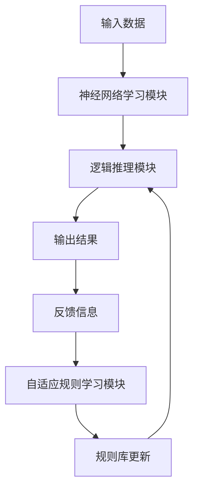

# 基于神经逻辑编程的自适应规则学习

> 关键词：神经逻辑编程、自适应规则学习、逻辑推理、机器学习、知识表示

> 摘要：本文围绕基于神经逻辑编程的自适应规则学习展开深入探讨。首先介绍了神经逻辑编程和自适应规则学习的背景与重要性，阐述了其核心概念及相互联系，详细讲解了核心算法原理并给出Python源代码示例。通过数学模型和公式进一步剖析其内在原理，并结合实际例子进行说明。接着进行项目实战，展示代码实现过程及详细解读。分析了其实际应用场景，推荐了相关的学习资源、开发工具框架以及论文著作。最后总结了未来发展趋势与挑战，为相关领域的研究和应用提供了全面而深入的参考。

## 1. 背景介绍 
### 1.1 目的和范围
在当今的人工智能领域，如何将逻辑推理与机器学习有效结合是一个关键问题。神经逻辑编程作为一种新兴的技术，旨在融合神经网络的学习能力和逻辑编程的推理能力。自适应规则学习则是在动态环境中自动发现和调整规则，以适应不同的任务需求。本文的目的是全面介绍基于神经逻辑编程的自适应规则学习技术，探讨其原理、算法、应用场景等方面的内容，范围涵盖理论基础、算法实现、项目实战以及未来发展趋势等多个层面。

### 1.2 预期读者
本文预期读者包括对人工智能、机器学习、逻辑编程等领域感兴趣的研究人员、开发者、学生等。对于希望深入了解神经逻辑编程和自适应规则学习的专业人士，本文提供了详细的技术讲解和实践指导；对于初学者，也能通过本文建立起对该领域的基本认识和理解。

### 1.3 文档结构概述
本文首先介绍相关背景知识，包括目的、预期读者和文档结构等内容。接着阐述核心概念与联系，给出原理和架构的文本示意图及Mermaid流程图。然后详细讲解核心算法原理并给出Python源代码示例，通过数学模型和公式进一步剖析其内在原理。进行项目实战，展示代码实现过程及详细解读。分析其实际应用场景，推荐相关的学习资源、开发工具框架以及论文著作。最后总结未来发展趋势与挑战，提供常见问题与解答以及扩展阅读和参考资料。

### 1.4 术语表
#### 1.4.1 核心术语定义
- **神经逻辑编程（Neural Logic Programming）**：一种将神经网络的学习能力与逻辑编程的推理能力相结合的技术，旨在通过神经网络来学习逻辑规则，实现知识表示和推理。
- **自适应规则学习（Adaptive Rule Learning）**：在动态环境中，系统能够自动发现、调整和优化规则，以适应不同的任务需求和数据变化。
- **逻辑推理（Logical Reasoning）**：根据逻辑规则从已知事实推导出新的结论的过程。
- **机器学习（Machine Learning）**：让计算机通过数据学习模式和规律，从而实现预测和决策的技术。
- **知识表示（Knowledge Representation）**：将知识以计算机能够处理和理解的方式进行表示的方法。

#### 1.4.2 相关概念解释
- **神经网络（Neural Network）**：由大量神经元组成的计算模型，能够自动学习数据中的模式和特征。
- **逻辑规则（Logical Rule）**：描述事物之间逻辑关系的表达式，通常由前提和结论组成。
- **规则库（Rule Base）**：存储一系列逻辑规则的集合。

#### 1.4.3 缩略词列表
- **NLP**：Neural Logic Programming（神经逻辑编程）
- **ML**：Machine Learning（机器学习）

## 2. 核心概念与联系 
### 核心概念原理
神经逻辑编程的核心思想是将逻辑规则融入到神经网络中，通过神经网络的学习能力来自动发现和调整逻辑规则。传统的逻辑编程基于符号推理，能够处理精确的逻辑关系，但缺乏学习能力；而神经网络具有强大的学习能力，但难以解释其决策过程。神经逻辑编程通过将两者结合，既能利用神经网络的学习能力从数据中提取知识，又能利用逻辑编程的推理能力进行知识的表示和推理。

自适应规则学习则是在神经逻辑编程的基础上，根据环境的变化和任务的需求，自动调整和优化逻辑规则。在动态环境中，数据和任务可能会发生变化，传统的固定规则难以适应这种变化。自适应规则学习能够根据新的数据和反馈信息，动态地调整规则库，以提高系统的性能和适应性。

### 架构的文本示意图
神经逻辑编程的架构主要包括输入层、中间层和输出层。输入层接收原始数据，中间层由神经网络和逻辑推理模块组成，神经网络用于学习数据中的特征和模式，逻辑推理模块根据学习到的知识进行推理。输出层输出推理结果。自适应规则学习模块则负责根据反馈信息对规则库进行调整和优化。

### Mermaid流程图


## 3. 核心算法原理 & 具体操作步骤 
### 核心算法原理
神经逻辑编程的核心算法是将逻辑规则表示为神经网络的结构和参数，通过神经网络的训练来学习逻辑规则。具体来说，逻辑规则可以表示为神经网络的神经元和连接权重，通过调整连接权重来学习规则的强度和置信度。

自适应规则学习的算法则是根据反馈信息对规则库进行调整和优化。反馈信息可以是系统的输出结果与预期结果之间的误差，也可以是用户的评价和建议。根据反馈信息，自适应规则学习算法可以对规则进行添加、删除、修改等操作，以提高规则库的性能和适应性。

### 具体操作步骤
1. **数据预处理**：对输入数据进行清洗、归一化等预处理操作，以提高数据的质量和可用性。
2. **规则初始化**：根据领域知识和经验，初始化规则库。规则可以用逻辑表达式表示，如 `if A and B then C`。
3. **神经网络训练**：将规则库中的规则表示为神经网络的结构和参数，通过训练神经网络来学习规则的强度和置信度。
4. **逻辑推理**：根据训练好的神经网络和输入数据，进行逻辑推理，得出推理结果。
5. **反馈信息收集**：收集系统的输出结果与预期结果之间的误差，以及用户的评价和建议等反馈信息。
6. **规则调整**：根据反馈信息，对规则库进行调整和优化，如添加新规则、删除无效规则、修改规则的强度等。
7. **重复步骤3-6**：不断重复上述步骤，直到系统的性能达到满意的程度。

### Python源代码示例
```python
import numpy as np

# 定义神经网络类
class NeuralNetwork:
    def __init__(self, input_size, hidden_size, output_size):
        self.input_size = input_size
        self.hidden_size = hidden_size
        self.output_size = output_size
        
        # 初始化权重
        self.weights_input_hidden = np.random.rand(self.input_size, self.hidden_size)
        self.weights_hidden_output = np.random.rand(self.hidden_size, self.output_size)
        
    def sigmoid(self, x):
        return 1 / (1 + np.exp(-x))
    
    def sigmoid_derivative(self, x):
        return x * (1 - x)
    
    def forward(self, X):
        # 前向传播
        self.hidden_input = np.dot(X, self.weights_input_hidden)
        self.hidden_output = self.sigmoid(self.hidden_input)
        
        self.final_input = np.dot(self.hidden_output, self.weights_hidden_output)
        self.final_output = self.sigmoid(self.final_input)
        
        return self.final_output
    
    def backward(self, X, y, output):
        # 反向传播
        self.output_error = y - output
        self.output_delta = self.output_error * self.sigmoid_derivative(output)
        
        self.hidden_error = self.output_delta.dot(self.weights_hidden_output.T)
        self.hidden_delta = self.hidden_error * self.sigmoid_derivative(self.hidden_output)
        
        # 更新权重
        self.weights_hidden_output += self.hidden_output.T.dot(self.output_delta)
        self.weights_input_hidden += X.T.dot(self.hidden_delta)
        
    def train(self, X, y, epochs):
        for epoch in range(epochs):
            output = self.forward(X)
            self.backward(X, y, output)

# 示例数据
X = np.array([[0, 0], [0, 1], [1, 0], [1, 1]])
y = np.array([[0], [1], [1], [0]])

# 创建神经网络
nn = NeuralNetwork(input_size=2, hidden_size=2, output_size=1)

# 训练神经网络
nn.train(X, y, epochs=10000)

# 测试神经网络
test_output = nn.forward(X)
print("测试输出:", test_output)
```

## 4. 数学模型和公式 & 详细讲解 & 举例说明 
### 数学模型
神经逻辑编程的数学模型可以用以下公式表示：

设输入向量为 $\mathbf{x} \in \mathbb{R}^n$，隐藏层向量为 $\mathbf{h} \in \mathbb{R}^m$，输出向量为 $\mathbf{y} \in \mathbb{R}^k$。

隐藏层的计算可以表示为：
$$
\mathbf{h} = \sigma(\mathbf{W}_{ih} \mathbf{x} + \mathbf{b}_h)
$$
其中，$\mathbf{W}_{ih}$ 是输入层到隐藏层的权重矩阵，$\mathbf{b}_h$ 是隐藏层的偏置向量，$\sigma$ 是激活函数，如Sigmoid函数。

输出层的计算可以表示为：
$$
\mathbf{y} = \sigma(\mathbf{W}_{ho} \mathbf{h} + \mathbf{b}_o)
$$
其中，$\mathbf{W}_{ho}$ 是隐藏层到输出层的权重矩阵，$\mathbf{b}_o$ 是输出层的偏置向量。

### 详细讲解
上述公式描述了神经网络的前向传播过程。输入向量 $\mathbf{x}$ 经过输入层到隐藏层的线性变换 $\mathbf{W}_{ih} \mathbf{x} + \mathbf{b}_h$，然后通过激活函数 $\sigma$ 进行非线性变换得到隐藏层向量 $\mathbf{h}$。隐藏层向量 $\mathbf{h}$ 再经过隐藏层到输出层的线性变换 $\mathbf{W}_{ho} \mathbf{h} + \mathbf{b}_o$，最后通过激活函数 $\sigma$ 得到输出向量 $\mathbf{y}$。

在训练过程中，我们需要根据输出结果与预期结果之间的误差来调整权重矩阵和偏置向量。误差可以用均方误差（MSE）来表示：
$$
E = \frac{1}{2} \sum_{i=1}^{N} (\mathbf{y}_i - \hat{\mathbf{y}}_i)^2
$$
其中，$\mathbf{y}_i$ 是预期结果，$\hat{\mathbf{y}}_i$ 是实际输出结果，$N$ 是样本数量。

为了最小化误差 $E$，我们可以使用梯度下降法来更新权重矩阵和偏置向量。梯度下降法的更新公式为：
$$
\mathbf{W} \leftarrow \mathbf{W} - \eta \frac{\partial E}{\partial \mathbf{W}}
$$
$$
\mathbf{b} \leftarrow \mathbf{b} - \eta \frac{\partial E}{\partial \mathbf{b}}
$$
其中，$\eta$ 是学习率。

### 举例说明
假设我们有一个简单的逻辑规则：`if A and B then C`。我们可以将其表示为神经网络的结构和参数。设输入层有两个神经元分别表示 $A$ 和 $B$，隐藏层有一个神经元，输出层有一个神经元表示 $C$。

输入向量 $\mathbf{x} = [A, B]$，隐藏层的计算为：
$$
h = \sigma(w_{11} A + w_{21} B + b_h)
$$
输出层的计算为：
$$
y = \sigma(w_{12} h + b_o)
$$
其中，$w_{11}$、$w_{21}$ 是输入层到隐藏层的权重，$w_{12}$ 是隐藏层到输出层的权重，$b_h$、$b_o$ 是偏置。

在训练过程中，我们可以根据样本数据来调整这些权重和偏置，使得神经网络能够学习到这个逻辑规则。

## 5. 项目实战：代码实际案例和详细解释说明 
### 5.1  开发环境搭建
1. **安装Python**：建议使用Python 3.6及以上版本。可以从Python官方网站（https://www.python.org/downloads/）下载并安装。
2. **安装必要的库**：使用`pip`命令安装`numpy`库，用于数值计算。
```bash
pip install numpy
```

### 5.2  源代码详细实现和代码解读
```python
import numpy as np

# 定义神经网络类
class NeuralNetwork:
    def __init__(self, input_size, hidden_size, output_size):
        self.input_size = input_size
        self.hidden_size = hidden_size
        self.output_size = output_size
        
        # 初始化权重
        self.weights_input_hidden = np.random.rand(self.input_size, self.hidden_size)
        self.weights_hidden_output = np.random.rand(self.hidden_size, self.output_size)
        
    def sigmoid(self, x):
        return 1 / (1 + np.exp(-x))
    
    def sigmoid_derivative(self, x):
        return x * (1 - x)
    
    def forward(self, X):
        # 前向传播
        self.hidden_input = np.dot(X, self.weights_input_hidden)
        self.hidden_output = self.sigmoid(self.hidden_input)
        
        self.final_input = np.dot(self.hidden_output, self.weights_hidden_output)
        self.final_output = self.sigmoid(self.final_input)
        
        return self.final_output
    
    def backward(self, X, y, output):
        # 反向传播
        self.output_error = y - output
        self.output_delta = self.output_error * self.sigmoid_derivative(output)
        
        self.hidden_error = self.output_delta.dot(self.weights_hidden_output.T)
        self.hidden_delta = self.hidden_error * self.sigmoid_derivative(self.hidden_output)
        
        # 更新权重
        self.weights_hidden_output += self.hidden_output.T.dot(self.output_delta)
        self.weights_input_hidden += X.T.dot(self.hidden_delta)
        
    def train(self, X, y, epochs):
        for epoch in range(epochs):
            output = self.forward(X)
            self.backward(X, y, output)

# 示例数据
X = np.array([[0, 0], [0, 1], [1, 0], [1, 1]])
y = np.array([[0], [1], [1], [0]])

# 创建神经网络
nn = NeuralNetwork(input_size=2, hidden_size=2, output_size=1)

# 训练神经网络
nn.train(X, y, epochs=10000)

# 测试神经网络
test_output = nn.forward(X)
print("测试输出:", test_output)
```
### 代码解读与分析
1. **类定义**：`NeuralNetwork`类定义了神经网络的结构和操作。`__init__`方法初始化神经网络的输入层、隐藏层和输出层的大小，并随机初始化权重。
2. **激活函数**：`sigmoid`函数和`sigmoid_derivative`函数分别定义了Sigmoid激活函数及其导数。
3. **前向传播**：`forward`方法实现了神经网络的前向传播过程，计算隐藏层和输出层的输出。
4. **反向传播**：`backward`方法实现了神经网络的反向传播过程，根据误差计算梯度并更新权重。
5. **训练方法**：`train`方法通过多次迭代调用`forward`和`backward`方法来训练神经网络。
6. **数据准备**：`X`和`y`分别表示输入数据和预期输出数据。
7. **创建和训练神经网络**：创建`NeuralNetwork`对象，并调用`train`方法进行训练。
8. **测试神经网络**：调用`forward`方法进行测试，并输出测试结果。

## 6. 实际应用场景 
### 智能客服
在智能客服系统中，神经逻辑编程的自适应规则学习可以根据用户的问题和历史对话记录，自动学习和调整规则，以提供更准确和个性化的回答。例如，根据用户的语言习惯、问题类型等因素，动态调整回答策略，提高用户满意度。

### 医疗诊断
在医疗诊断领域，自适应规则学习可以结合患者的病历数据、症状表现等信息，自动学习和优化诊断规则。通过不断更新规则库，提高诊断的准确性和效率，辅助医生做出更科学的诊断决策。

### 金融风险评估
在金融领域，神经逻辑编程的自适应规则学习可以根据市场数据、客户信用记录等信息，自动调整风险评估规则。及时发现潜在的风险因素，为金融机构提供更有效的风险防控措施。

### 自动驾驶
在自动驾驶系统中，自适应规则学习可以根据路况、交通信号等信息，自动学习和优化驾驶规则。提高自动驾驶的安全性和可靠性，实现更加智能和高效的驾驶行为。

## 7. 工具和资源推荐
### 7.1 学习资源推荐
#### 7.1.1 书籍推荐
- 《深度学习》（Deep Learning）：由Ian Goodfellow、Yoshua Bengio和Aaron Courville所著，是深度学习领域的经典教材，涵盖了神经网络、优化算法等基础知识。
- 《人工智能：一种现代的方法》（Artificial Intelligence: A Modern Approach）：由Stuart Russell和Peter Norvig所著，全面介绍了人工智能的各个领域，包括逻辑编程、机器学习等。
- 《Python机器学习》（Python Machine Learning）：由Sebastian Raschka所著，详细介绍了使用Python进行机器学习的方法和技巧。

#### 7.1.2 在线课程
- Coursera上的“深度学习专项课程”（Deep Learning Specialization）：由Andrew Ng教授授课，系统介绍了深度学习的理论和实践。
- edX上的“人工智能导论”（Introduction to Artificial Intelligence）：由麻省理工学院（MIT）提供，涵盖了人工智能的基本概念和方法。
- 网易云课堂上的“Python数据分析与机器学习实战”：详细介绍了Python在数据分析和机器学习中的应用。

#### 7.1.3 技术博客和网站
- 机器之心（https://www.alienzoo.com/）：提供人工智能领域的最新技术动态和研究成果。
- 深度学习技术前沿（https://www.deeplearning.ai/）：专注于深度学习领域的技术分享和交流。
- 开源中国（https://www.oschina.net/）：提供丰富的开源项目和技术文章。

### 7.2 开发工具框架推荐
#### 7.2.1 IDE和编辑器
- PyCharm：一款专业的Python集成开发环境（IDE），提供代码编辑、调试、版本控制等功能。
- Jupyter Notebook：一个交互式的开发环境，适合进行数据探索和模型实验。
- Visual Studio Code：一款轻量级的代码编辑器，支持多种编程语言和插件扩展。

#### 7.2.2 调试和性能分析工具
- PySnooper：一个简单易用的Python调试工具，能够自动记录函数的执行过程和变量的值。
- cProfile：Python内置的性能分析工具，能够分析代码的执行时间和调用关系。
- TensorBoard：TensorFlow提供的可视化工具，用于可视化模型的训练过程和性能指标。

#### 7.2.3 相关框架和库
- TensorFlow：一个开源的机器学习框架，提供了丰富的深度学习模型和工具。
- PyTorch：另一个流行的深度学习框架，具有动态图和易于使用的特点。
- Scikit-learn：一个用于机器学习的Python库，提供了各种机器学习算法和工具。

### 7.3 相关论文著作推荐
#### 7.3.1 经典论文
- “Neural Logic Programming”：首次提出了神经逻辑编程的概念，阐述了其基本原理和方法。
- “Inductive Logic Programming”：介绍了归纳逻辑编程的理论和应用，为神经逻辑编程的发展奠定了基础。
- “Machine Learning: A Probabilistic Perspective”：从概率的角度介绍了机器学习的理论和方法，对理解神经逻辑编程的原理有很大帮助。

#### 7.3.2 最新研究成果
- 关注顶级学术会议如NeurIPS、ICML、AAAI等上的相关论文，了解神经逻辑编程和自适应规则学习的最新研究进展。
- 查阅相关学术期刊如Journal of Artificial Intelligence Research（JAIR）、Artificial Intelligence等上的研究论文。

#### 7.3.3 应用案例分析
- 分析工业界和学术界的实际应用案例，了解神经逻辑编程和自适应规则学习在不同领域的应用效果和实践经验。

## 8. 总结：未来发展趋势与挑战
### 未来发展趋势
- **与其他技术的融合**：神经逻辑编程将与知识图谱、强化学习等技术进一步融合，实现更强大的智能系统。例如，结合知识图谱的丰富知识，提高逻辑推理的准确性和可解释性；与强化学习相结合，实现更智能的决策和控制。
- **应用领域的拓展**：随着技术的不断发展，神经逻辑编程的自适应规则学习将在更多领域得到应用，如智能教育、智能家居、智能交通等。为这些领域带来更高效、智能的解决方案。
- **理论的深入研究**：进一步深入研究神经逻辑编程的理论基础，如逻辑规则的表示、学习和推理算法的优化等，提高系统的性能和可解释性。

### 挑战
- **可解释性问题**：虽然神经逻辑编程在一定程度上提高了神经网络的可解释性，但仍然存在一些挑战。如何更好地解释神经网络学习到的逻辑规则，是未来需要解决的重要问题。
- **计算资源需求**：神经逻辑编程的训练和推理过程通常需要大量的计算资源，尤其是在处理大规模数据和复杂规则时。如何提高计算效率，降低计算成本，是一个亟待解决的问题。
- **规则的自动发现和优化**：在动态环境中，如何自动发现和优化逻辑规则，以适应不同的任务需求和数据变化，仍然是一个具有挑战性的问题。

## 9. 附录：常见问题与解答
### 问题1：神经逻辑编程与传统逻辑编程有什么区别？
传统逻辑编程基于符号推理，能够处理精确的逻辑关系，但缺乏学习能力；而神经逻辑编程将神经网络的学习能力与逻辑编程的推理能力相结合，能够从数据中自动学习逻辑规则，提高了系统的适应性和灵活性。

### 问题2：自适应规则学习的效率如何？
自适应规则学习的效率取决于多种因素，如数据量、规则复杂度、算法的优化程度等。在实际应用中，可以通过优化算法、并行计算等方法来提高学习效率。

### 问题3：神经逻辑编程的可解释性如何保证？
可以通过将逻辑规则显式地表示在神经网络中，以及使用可视化工具等方法来提高神经逻辑编程的可解释性。同时，进一步研究和开发可解释的机器学习算法也是提高可解释性的重要途径。

### 问题4：如何选择合适的激活函数？
激活函数的选择取决于具体的任务和模型结构。常见的激活函数有Sigmoid函数、ReLU函数、Tanh函数等。Sigmoid函数适用于输出概率的任务，ReLU函数在深度学习中应用广泛，Tanh函数则常用于处理正负值的情况。

## 10. 扩展阅读 & 参考资料
- Goodfellow, I., Bengio, Y., & Courville, A. (2016). Deep Learning. MIT Press.
- Russell, S. J., & Norvig, P. (2009). Artificial Intelligence: A Modern Approach. Prentice Hall.
- Raschka, S. (2015). Python Machine Learning. Packt Publishing.
- “Neural Logic Programming”论文
- 相关学术会议和期刊上的研究论文
- 机器之心、深度学习技术前沿等技术博客和网站上的文章