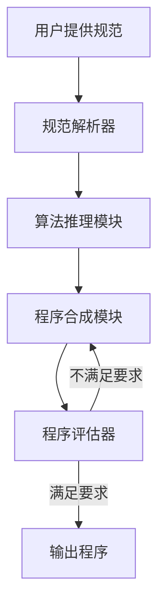

# 基于程序合成的算法推理能力增强方法

> 关键词：程序合成、算法推理、自动化编程、代码生成、人工智能、逻辑推理、机器学习

> 摘要：本文聚焦于基于程序合成的算法推理能力增强方法。随着人工智能和自动化编程的发展，程序合成成为提升算法推理能力的关键技术。文章详细阐述了程序合成和算法推理的核心概念与联系，深入剖析其核心算法原理，给出数学模型和公式，通过项目实战展示代码实现与应用，探讨实际应用场景，推荐相关工具和资源，最后总结未来发展趋势与挑战，旨在为相关领域的研究和实践提供全面而深入的参考。

## 1. 背景介绍 
### 1.1 目的和范围
在当今数字化快速发展的时代，软件开发的需求不断增长，对算法推理能力的要求也日益提高。传统的手工编程方式效率低下且容易出错，而基于程序合成的方法为提升算法推理能力提供了新的途径。本文章的目的在于深入研究基于程序合成的算法推理能力增强方法，探讨其原理、实现步骤和应用场景。范围涵盖从核心概念的阐述到实际项目的实现，以及相关工具和资源的推荐等多个方面。

### 1.2 预期读者
本文预期读者包括计算机科学领域的研究人员、软件开发工程师、人工智能爱好者以及对自动化编程和算法推理感兴趣的专业人士。无论是初学者想要了解相关基础知识，还是有一定经验的开发者希望深入研究技术细节，都能从本文中获得有价值的信息。

### 1.3 文档结构概述
本文将按照以下结构展开：首先介绍程序合成和算法推理的背景知识，包括术语表；接着阐述核心概念与联系，给出原理和架构的文本示意图及 Mermaid 流程图；然后详细讲解核心算法原理和具体操作步骤，并使用 Python 源代码进行阐述；再给出数学模型和公式，并进行详细讲解和举例说明；通过项目实战展示代码实际案例和详细解释；探讨实际应用场景；推荐相关工具和资源；总结未来发展趋势与挑战；提供常见问题与解答；最后列出扩展阅读和参考资料。

### 1.4 术语表
#### 1.4.1 核心术语定义
- **程序合成**：指的是根据给定的规范（如输入输出示例、自然语言描述等）自动生成满足该规范的程序的过程。
- **算法推理**：是指从给定的问题描述和相关信息中，推导出解决该问题的算法步骤的能力。
- **自动化编程**：利用计算机技术自动生成程序代码的过程，程序合成是自动化编程的一种重要实现方式。
- **代码生成**：将某种形式的规范或表示转换为可执行代码的过程。

#### 1.4.2 相关概念解释
- **逻辑推理**：是指从一些已知的前提条件出发，通过合理的逻辑规则推导出结论的过程。在算法推理中，逻辑推理用于确定算法的步骤和流程。
- **机器学习**：是一门多领域交叉学科，涉及概率论、统计学、逼近论、凸分析、算法复杂度理论等多门学科。在程序合成中，机器学习可以用于学习程序的模式和规律，辅助程序的生成。

#### 1.4.3 缩略词列表
- **AI**：Artificial Intelligence，人工智能
- **ML**：Machine Learning，机器学习
- **NLP**：Natural Language Processing，自然语言处理

## 2. 核心概念与联系 
### 核心概念原理
#### 程序合成原理
程序合成的基本原理是通过对给定的规范进行分析和处理，在程序空间中搜索满足该规范的程序。常见的规范形式包括输入输出示例、自然语言描述、形式化规格说明等。程序合成系统通常由以下几个部分组成：
- **规范解析器**：负责将输入的规范转换为系统能够处理的内部表示。
- **搜索算法**：在程序空间中搜索满足规范的程序。搜索算法可以采用不同的策略，如暴力搜索、启发式搜索等。
- **程序评估器**：对搜索到的程序进行评估，判断其是否满足规范。

#### 算法推理原理
算法推理是基于对问题的理解和分析，运用逻辑推理和领域知识，推导出解决问题的算法步骤。算法推理通常包括以下几个步骤：
- **问题理解**：对问题进行分析和理解，明确问题的输入、输出和约束条件。
- **算法设计**：根据问题的特点和要求，设计出解决问题的算法。
- **算法验证**：对设计出的算法进行验证，确保其正确性和有效性。

### 架构的文本示意图
程序合成与算法推理的架构可以描述为一个相互协作的系统。用户首先提供问题的规范，规范解析器将其转换为内部表示。然后，算法推理模块根据问题的特点和领域知识，推导出可能的算法步骤。程序合成模块在算法推理的指导下，在程序空间中搜索满足规范的程序。最后，程序评估器对生成的程序进行评估，如果满足要求则输出该程序，否则继续搜索。

### Mermaid 流程图


## 3. 核心算法原理 & 具体操作步骤 
### 核心算法原理
#### 基于搜索的程序合成算法
基于搜索的程序合成算法是一种常见的程序合成方法。其基本思想是在程序空间中进行搜索，找到满足规范的程序。常用的搜索算法包括广度优先搜索、深度优先搜索、A* 搜索等。

以下是一个基于广度优先搜索的程序合成算法的 Python 示例：

```python
from collections import deque

# 定义程序空间
program_space = ["x + 1", "x * 2", "x - 1"]

# 定义规范（输入输出示例）
spec = [(1, 2), (2, 3), (3, 4)]

# 定义程序评估函数
def evaluate_program(program, spec):
    for input_val, output_val in spec:
        try:
            x = input_val
            result = eval(program)
            if result != output_val:
                return False
        except:
            return False
    return True

# 广度优先搜索算法
def bfs_program_synthesis(program_space, spec):
    queue = deque(program_space)
    while queue:
        program = queue.popleft()
        if evaluate_program(program, spec):
            return program
        # 可以在这里进行程序的扩展，如组合多个程序
        for new_program in program_space:
            combined_program = f"({program}) {new_program}"
            queue.append(combined_program)
    return None

# 运行程序合成算法
result = bfs_program_synthesis(program_space, spec)
if result:
    print(f"找到满足规范的程序: {result}")
else:
    print("未找到满足规范的程序")
```

### 具体操作步骤
1. **规范输入**：用户提供问题的规范，如输入输出示例、自然语言描述等。
2. **规范解析**：将输入的规范转换为系统能够处理的内部表示。
3. **初始化程序空间**：定义程序合成的搜索空间，包括可能的程序片段和操作符。
4. **搜索程序**：使用搜索算法在程序空间中搜索满足规范的程序。
5. **程序评估**：对搜索到的程序进行评估，判断其是否满足规范。
6. **输出结果**：如果找到满足规范的程序，则输出该程序；否则，继续搜索或返回失败信息。

## 4. 数学模型和公式 & 详细讲解 & 举例说明 
### 数学模型
程序合成可以看作是一个搜索问题，其数学模型可以表示为：

给定一个规范 $S$ 和一个程序空间 $P$，目标是找到一个程序 $p \in P$，使得 $p$ 满足规范 $S$。可以用一个函数 $f(p, S)$ 来表示程序 $p$ 是否满足规范 $S$，即：

$$
f(p, S) = 
\begin{cases}
1, & \text{如果 } p \text{ 满足 } S \\
0, & \text{否则}
\end{cases}
$$

程序合成的目标就是找到一个 $p$，使得 $f(p, S) = 1$。

### 详细讲解
在实际应用中，规范 $S$ 可以是输入输出示例的集合，如 $S = \{(x_1, y_1), (x_2, y_2), \cdots, (x_n, y_n)\}$，其中 $x_i$ 是输入，$y_i$ 是对应的输出。程序 $p$ 是一个可以对输入进行计算的表达式。函数 $f(p, S)$ 的计算过程就是对每个输入输出示例 $(x_i, y_i)$，计算 $p(x_i)$，并判断 $p(x_i) = y_i$ 是否成立。如果所有的示例都满足，则 $f(p, S) = 1$，否则 $f(p, S) = 0$。

### 举例说明
假设规范 $S = \{(1, 2), (2, 4), (3, 6)\}$，程序空间 $P = \{x * 2, x + 1, x - 1\}$。

对于程序 $p_1 = x * 2$：
- 当 $x = 1$ 时，$p_1(1) = 1 * 2 = 2$，与示例中的输出 2 相等。
- 当 $x = 2$ 时，$p_1(2) = 2 * 2 = 4$，与示例中的输出 4 相等。
- 当 $x = 3$ 时，$p_1(3) = 3 * 2 = 6$，与示例中的输出 6 相等。

所以 $f(p_1, S) = 1$，即程序 $p_1$ 满足规范 $S$。

对于程序 $p_2 = x + 1$：
- 当 $x = 1$ 时，$p_2(1) = 1 + 1 = 2$，与示例中的输出 2 相等。
- 当 $x = 2$ 时，$p_2(2) = 2 + 1 = 3$，与示例中的输出 4 不相等。

所以 $f(p_2, S) = 0$，即程序 $p_2$ 不满足规范 $S$。

## 5. 项目实战：代码实际案例和详细解释说明 
### 5.1  开发环境搭建
#### 安装 Python
首先，确保你已经安装了 Python 环境。可以从 Python 官方网站（https://www.python.org/downloads/） 下载并安装适合你操作系统的 Python 版本。

#### 安装必要的库
在本项目中，我们主要使用 Python 的内置库，不需要额外安装其他库。

### 5.2  源代码详细实现和代码解读
以下是一个更复杂的程序合成项目的源代码，用于解决简单的算术表达式合成问题：

```python
from itertools import product

# 定义操作符
operators = ['+', '-', '*', '/']

# 定义变量
variables = ['x']

# 定义规范（输入输出示例）
spec = [(1, 3), (2, 5), (3, 7)]

# 生成所有可能的程序
def generate_programs(depth):
    programs = []
    for d in range(1, depth + 1):
        for op in operators:
            for var in variables:
                if d == 1:
                    programs.append(f"{var} {op} 1")
                else:
                    sub_programs = generate_programs(d - 1)
                    for sub_program in sub_programs:
                        programs.append(f"({sub_program}) {op} 1")
    return programs

# 定义程序评估函数
def evaluate_program(program, spec):
    for input_val, output_val in spec:
        try:
            x = input_val
            result = eval(program)
            if abs(result - output_val) > 1e-6:
                return False
        except:
            return False
    return True

# 程序合成主函数
def program_synthesis(depth):
    programs = generate_programs(depth)
    for program in programs:
        if evaluate_program(program, spec):
            return program
    return None

# 运行程序合成
result = program_synthesis(3)
if result:
    print(f"找到满足规范的程序: {result}")
else:
    print("未找到满足规范的程序")
```

### 5.3  代码解读与分析
- **generate_programs 函数**：该函数用于生成所有可能的程序。通过递归的方式，根据操作符和变量生成不同深度的程序表达式。
- **evaluate_program 函数**：该函数用于评估一个程序是否满足给定的规范。对于每个输入输出示例，计算程序的输出并与示例中的输出进行比较。
- **program_synthesis 函数**：该函数是程序合成的主函数，调用 `generate_programs` 函数生成所有可能的程序，然后调用 `evaluate_program` 函数对每个程序进行评估，找到满足规范的程序。

## 6. 实际应用场景 
### 自动化软件开发
在软件开发过程中，程序合成可以用于自动生成代码。例如，根据用户的需求描述，自动生成数据库操作代码、用户界面代码等。这可以大大提高软件开发的效率，减少人工编程的工作量。

### 教育领域
在计算机科学教育中，程序合成可以作为一种教学工具，帮助学生更好地理解算法和编程概念。学生可以通过提供问题的规范，让程序合成系统生成解决方案，然后分析和学习生成的代码。

### 智能助手
智能助手可以利用程序合成技术，根据用户的自然语言请求，自动生成相应的程序代码。例如，用户可以说“写一个程序，计算两个数的和”，智能助手可以通过程序合成技术生成相应的代码。

### 算法优化
程序合成可以用于算法优化。通过对算法的规范进行分析和处理，程序合成系统可以生成更高效的算法实现。例如，对排序算法进行优化，生成更快的排序程序。

## 7. 工具和资源推荐
### 7.1 学习资源推荐
#### 7.1.1 书籍推荐
- 《人工智能：一种现代的方法》：这本书全面介绍了人工智能的各个领域，包括程序合成和算法推理的相关内容。
- 《编程语言实现模式》：深入讲解了编程语言的实现原理，对于理解程序合成的底层机制有很大帮助。
- 《算法导论》：经典的算法教材，对于学习算法推理和设计有重要的指导作用。

#### 7.1.2 在线课程
- Coursera 上的“人工智能基础”课程：系统地介绍了人工智能的基础知识，包括程序合成和算法推理的基本概念和方法。
- edX 上的“编程语言原理”课程：深入探讨了编程语言的原理和实现，对于理解程序合成的技术细节有很大帮助。

#### 7.1.3 技术博客和网站
- arXiv.org：提供了大量的学术论文，包括程序合成和算法推理领域的最新研究成果。
- Medium 上的人工智能相关博客：有很多关于程序合成和算法推理的技术文章和实践经验分享。

### 7.2 开发工具框架推荐
#### 7.2.1 IDE和编辑器
- PyCharm：功能强大的 Python 集成开发环境，提供了代码编辑、调试、自动补全等功能，适合进行程序合成和算法推理的开发。
- Visual Studio Code：轻量级的代码编辑器，支持多种编程语言，有丰富的插件可以扩展功能。

#### 7.2.2 调试和性能分析工具
- pdb：Python 的内置调试器，可以帮助开发者调试程序，找出代码中的问题。
- cProfile：Python 的性能分析工具，可以分析程序的性能瓶颈，帮助开发者优化代码。

#### 7.2.3 相关框架和库
- Z3：一个高效的定理证明器，可以用于程序合成中的约束求解和逻辑推理。
- Keras：深度学习框架，可以用于实现基于机器学习的程序合成方法。

### 7.3 相关论文著作推荐
#### 7.3.1 经典论文
- “Synthesis of Loop-Free Programs”：该论文提出了一种基于搜索的无循环程序合成方法，是程序合成领域的经典之作。
- “Program Synthesis Using Conflict-Driven Learning”：介绍了一种基于冲突驱动学习的程序合成算法，提高了程序合成的效率。

#### 7.3.2 最新研究成果
- 每年在 ACM SIGPLAN 等会议上发表的关于程序合成和算法推理的研究论文，反映了该领域的最新研究进展。

#### 7.3.3 应用案例分析
- 一些开源项目的文档和技术报告，如 Rosette 等程序合成工具的应用案例分析，可以帮助开发者更好地理解和应用程序合成技术。

## 8. 总结：未来发展趋势与挑战
### 未来发展趋势
- **与机器学习的深度融合**：将机器学习技术应用于程序合成中，如使用深度学习模型学习程序的模式和规律，提高程序合成的效率和准确性。
- **支持更复杂的规范**：未来的程序合成系统将能够处理更复杂的规范，如自然语言描述、形式化规格说明等，提高系统的通用性和实用性。
- **跨领域应用**：程序合成技术将在更多领域得到应用，如生物信息学、金融等，为这些领域的问题解决提供新的方法和工具。

### 挑战
- **搜索空间爆炸**：随着程序空间的增大，搜索满足规范的程序变得越来越困难，需要研究更高效的搜索算法和剪枝策略。
- **规范理解和处理**：理解和处理自然语言描述、形式化规格说明等复杂规范是一个挑战，需要发展更先进的自然语言处理和形式化方法。
- **程序的可解释性**：生成的程序往往缺乏可解释性，难以理解和维护，需要研究如何提高程序的可解释性。

## 9. 附录：常见问题与解答
### 问题 1：程序合成与传统编程有什么区别？
程序合成是根据给定的规范自动生成程序，而传统编程是由程序员手动编写代码。程序合成可以提高编程效率，减少人工错误，但目前还不能完全替代传统编程。

### 问题 2：程序合成的搜索空间有多大？
程序合成的搜索空间通常非常大，随着程序的复杂度增加，搜索空间会呈指数级增长。这是程序合成面临的一个主要挑战。

### 问题 3：程序合成生成的程序一定正确吗？
不一定。程序合成生成的程序需要经过验证和测试，确保其满足规范。由于搜索空间的限制和算法的局限性，可能会生成不满足规范的程序。

### 问题 4：如何提高程序合成的效率？
可以采用更高效的搜索算法、剪枝策略、机器学习技术等方法来提高程序合成的效率。同时，合理定义程序空间和规范也可以减少搜索空间，提高效率。

## 10. 扩展阅读 & 参考资料
- “The Art of Computer Programming” by Donald E. Knuth
- “Automated Software Engineering” by Mark Harman and Shane Mac Donell
- https://en.wikipedia.org/wiki/Program_synthesis
- https://www.sigplan.org/

以上就是关于基于程序合成的算法推理能力增强方法的详细介绍，希望对读者有所帮助。