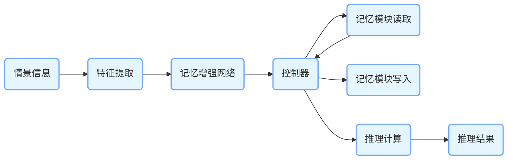

# 基于记忆增强网络的情景推理能力提升

> 关键词：记忆增强网络、情景推理、人工智能、深度学习、神经网络、认知计算、知识表征

> 摘要：本文围绕基于记忆增强网络的情景推理能力提升展开深入探讨。首先介绍了研究的背景、目的、预期读者等内容。详细阐述了记忆增强网络和情景推理的核心概念及其联系，通过Mermaid流程图展示其架构。深入讲解了核心算法原理，结合Python代码进行具体说明，并给出相关数学模型和公式。通过项目实战，展示了代码实际案例及详细解释。分析了其实际应用场景，推荐了学习资源、开发工具框架和相关论文著作。最后总结了未来发展趋势与挑战，还提供了常见问题解答和参考资料，旨在全面呈现基于记忆增强网络提升情景推理能力的相关知识和技术。

## 1. 背景介绍 
### 1.1 目的和范围
在人工智能领域，让机器具备像人类一样的情景推理能力是一个重要的研究目标。情景推理涉及到对复杂环境信息的理解、对事件之间关系的把握以及基于已有知识进行合理推断。记忆增强网络作为一种新兴的技术手段，为提升情景推理能力提供了新的思路和方法。本研究的目的在于深入探究记忆增强网络如何有效提升情景推理能力，分析其原理、算法和应用场景等。范围涵盖了从理论基础的研究到实际项目的应用，涉及到记忆增强网络的结构、训练方法，情景推理的任务定义和评估指标等多个方面。

### 1.2 预期读者
本文预期读者包括人工智能领域的研究人员、开发者、学生以及对情景推理和记忆增强网络技术感兴趣的专业人士。对于研究人员来说，本文可以为他们的学术研究提供新的视角和参考；对于开发者而言，能够帮助他们在实际项目中应用相关技术；对于学生来说，有助于他们深入学习和理解这一领域的知识。

### 1.3 文档结构概述
本文首先介绍研究的背景信息，包括目的、预期读者等。接着阐述记忆增强网络和情景推理的核心概念及其联系，通过图形化方式展示其架构。然后详细讲解核心算法原理，结合Python代码说明具体操作步骤，并给出相关数学模型和公式。通过项目实战展示代码实际案例及详细解释。分析实际应用场景，推荐学习资源、开发工具框架和相关论文著作。最后总结未来发展趋势与挑战，提供常见问题解答和参考资料。

### 1.4 术语表
#### 1.4.1 核心术语定义
- **记忆增强网络（Memory Augmented Neural Network）**：一种在传统神经网络基础上引入外部记忆模块的网络结构，能够存储和检索信息，从而增强网络的记忆和学习能力。
- **情景推理（Situational Reasoning）**：根据给定的情景信息，结合已有知识和经验，对情景中的事件、关系和结果进行推断和预测的能力。
- **知识表征（Knowledge Representation）**：将知识以某种形式表示出来，以便计算机能够处理和理解，常见的形式包括符号表示、向量表示等。
- **注意力机制（Attention Mechanism）**：一种在神经网络中模拟人类注意力的机制，能够自动地关注输入信息中的重要部分，提高模型的性能。

#### 1.4.2 相关概念解释
- **深度学习（Deep Learning）**：一种基于人工神经网络的机器学习方法，通过构建多层神经网络来学习数据的特征和模式，在图像识别、自然语言处理等领域取得了显著的成果。
- **认知计算（Cognitive Computing）**：旨在模拟人类的认知过程，使计算机能够像人类一样感知、理解、学习和推理，是人工智能的一个重要发展方向。
- **强化学习（Reinforcement Learning）**：一种通过智能体与环境进行交互，根据环境反馈的奖励信号来学习最优策略的机器学习方法。

#### 1.4.3 缩略词列表
- **RNN（Recurrent Neural Network）**：循环神经网络
- **LSTM（Long Short - Term Memory）**：长短期记忆网络
- **GRU（Gated Recurrent Unit）**：门控循环单元
- **DNN（Deep Neural Network）**：深度神经网络
- **MLP（Multilayer Perceptron）**：多层感知机

## 2. 核心概念与联系 
### 2.1 记忆增强网络原理
记忆增强网络的核心思想是在传统神经网络中引入一个外部记忆模块，这个记忆模块可以看作是一个可读写的存储器。网络在处理输入信息时，可以根据需要从记忆模块中读取相关信息，也可以将新的信息写入记忆模块。这种机制使得网络能够存储和利用更多的历史信息，从而提高其学习和推理能力。

传统的神经网络，如前馈神经网络（FNN）、循环神经网络（RNN）等，在处理长序列信息或需要大量历史知识的任务时存在一定的局限性。例如，RNN虽然能够处理序列数据，但由于梯度消失或梯度爆炸问题，难以捕捉长距离的依赖关系。而记忆增强网络通过引入外部记忆模块，有效地解决了这些问题。

### 2.2 情景推理原理
情景推理是基于给定的情景信息，结合已有知识和经验，对情景中的事件、关系和结果进行推断和预测的过程。情景信息可以包括环境信息、事件描述、人物状态等多个方面。在进行情景推理时，需要对这些信息进行分析和整合，提取关键特征，并利用已有的知识和规则进行推理。

情景推理的过程可以分为以下几个步骤：
1. **情景感知**：通过传感器或其他方式获取情景信息。
2. **信息处理**：对获取的情景信息进行预处理，如数据清洗、特征提取等。
3. **知识匹配**：将处理后的信息与已有的知识进行匹配，找出相关的知识和规则。
4. **推理决策**：根据匹配的知识和规则，对情景中的事件、关系和结果进行推断和预测。

### 2.3 记忆增强网络与情景推理的联系
记忆增强网络为情景推理提供了有效的技术支持。在情景推理过程中，需要大量的历史知识和经验来进行推断和预测。记忆增强网络的外部记忆模块可以存储这些历史知识和经验，使得网络在处理情景信息时能够快速地检索和利用相关信息。

同时，记忆增强网络的注意力机制可以帮助网络自动地关注情景信息中的重要部分，提高推理的准确性和效率。例如，在一个复杂的情景中，可能包含大量的信息，但只有部分信息与当前的推理任务相关。注意力机制可以帮助网络筛选出这些重要信息，减少无关信息的干扰。

### 2.4 核心概念架构的文本示意图
记忆增强网络与情景推理的核心概念架构可以描述如下：

输入的情景信息首先经过特征提取模块，将原始的情景信息转换为特征向量。然后，这些特征向量作为输入传递给记忆增强网络。记忆增强网络中的控制器根据输入的特征向量，决定从记忆模块中读取哪些信息，并将新的信息写入记忆模块。同时，控制器利用读取的信息和输入的特征向量进行推理计算，输出推理结果。

### 2.5 Mermaid流程图


## 3. 核心算法原理 & 具体操作步骤 
### 3.1 记忆增强网络的核心算法原理
记忆增强网络主要由控制器和记忆模块组成。控制器通常是一个神经网络，如多层感知机（MLP）或循环神经网络（RNN），用于处理输入信息和控制对记忆模块的读写操作。记忆模块是一个可读写的存储器，通常表示为一个矩阵 $M \in \mathbb{R}^{N \times W}$，其中 $N$ 是记忆单元的数量，$W$ 是每个记忆单元的维度。

#### 3.1.1 读取操作
读取操作是指从记忆模块中读取相关信息的过程。控制器根据输入信息生成一个查询向量 $q \in \mathbb{R}^{W}$，然后通过注意力机制计算查询向量与记忆模块中每个记忆单元的相似度。相似度通常使用余弦相似度来计算：

$$
sim_{i} = \frac{q^T M_i}{\|q\| \|M_i\|}
$$

其中 $M_i$ 是记忆模块中的第 $i$ 个记忆单元。然后，根据相似度计算注意力权重：

$$
w_i = \frac{\exp(\beta sim_i)}{\sum_{j=1}^{N} \exp(\beta sim_j)}
$$

其中 $\beta$ 是一个温度参数，用于控制注意力的集中程度。最后，根据注意力权重对记忆单元进行加权求和，得到读取的信息：

$$
r = \sum_{i=1}^{N} w_i M_i
$$

#### 3.1.2 写入操作
写入操作是指将新的信息写入记忆模块的过程。控制器根据输入信息生成一个写入向量 $e \in \mathbb{R}^{W}$ 和一个删除向量 $f \in \mathbb{R}^{W}$。删除向量用于删除记忆模块中与当前信息无关的内容，写入向量用于添加新的信息。

首先，根据删除向量更新记忆模块：

$$
M_i' = M_i \odot (1 - f_i)
$$

其中 $\odot$ 表示逐元素相乘。然后，根据写入向量更新记忆模块：

$$
M_i'' = M_i' + e_i
$$

### 3.2 具体操作步骤的Python代码实现
```python
import torch
import torch.nn as nn
import torch.nn.functional as F

class MemoryAugmentedNetwork(nn.Module):
    def __init__(self, input_size, hidden_size, memory_size, memory_dim):
        super(MemoryAugmentedNetwork, self).__init__()
        self.controller = nn.Linear(input_size, hidden_size)
        self.memory = torch.randn(memory_size, memory_dim)
        self.beta = 1.0

    def read(self, query):
        # 计算相似度
        similarities = F.cosine_similarity(query.unsqueeze(1), self.memory, dim=2)
        # 计算注意力权重
        weights = F.softmax(self.beta * similarities, dim=1)
        # 加权求和得到读取信息
        read_info = torch.sum(weights.unsqueeze(2) * self.memory, dim=1)
        return read_info

    def write(self, query, erase, add):
        # 删除操作
        erase_weights = torch.sigmoid(erase)
        self.memory = self.memory * (1 - erase_weights.unsqueeze(1))
        # 写入操作
        self.memory = self.memory + add.unsqueeze(1)
        return self.memory

    def forward(self, x):
        # 控制器处理输入
        hidden = self.controller(x)
        # 读取信息
        read_info = self.read(hidden)
        # 生成写入向量和删除向量
        erase = self.controller(read_info)
        add = self.controller(read_info)
        # 写入信息
        self.write(read_info, erase, add)
        return read_info
```

### 3.3 代码解释
- **`__init__` 方法**：初始化记忆增强网络的控制器和记忆模块。控制器是一个线性层，用于处理输入信息。记忆模块是一个随机初始化的矩阵。
- **`read` 方法**：实现读取操作。首先计算查询向量与记忆模块中每个记忆单元的相似度，然后计算注意力权重，最后根据注意力权重对记忆单元进行加权求和得到读取的信息。
- **`write` 方法**：实现写入操作。首先根据删除向量更新记忆模块，然后根据写入向量添加新的信息。
- **`forward` 方法**：前向传播过程。首先通过控制器处理输入信息，然后读取相关信息，接着生成写入向量和删除向量，最后进行写入操作并返回读取的信息。

## 4. 数学模型和公式 & 详细讲解 & 举例说明 
### 4.1 读取操作的数学模型和公式
读取操作的核心是通过注意力机制从记忆模块中选择相关信息。我们已经介绍了相似度和注意力权重的计算公式：

- 相似度计算：
$$
sim_{i} = \frac{q^T M_i}{\|q\| \|M_i\|}
$$

这个公式计算了查询向量 $q$ 与记忆模块中第 $i$ 个记忆单元 $M_i$ 的余弦相似度。余弦相似度衡量了两个向量的方向相似性，取值范围在 $[-1, 1]$ 之间，值越大表示两个向量越相似。

- 注意力权重计算：
$$
w_i = \frac{\exp(\beta sim_i)}{\sum_{j=1}^{N} \exp(\beta sim_j)}
$$

这个公式使用了 softmax 函数将相似度转换为注意力权重。$\beta$ 是一个温度参数，用于控制注意力的集中程度。当 $\beta$ 较大时，注意力会更加集中在相似度高的记忆单元上；当 $\beta$ 较小时，注意力会更加分散。

- 读取信息计算：
$$
r = \sum_{i=1}^{N} w_i M_i
$$

这个公式根据注意力权重对记忆单元进行加权求和，得到读取的信息。

### 4.2 写入操作的数学模型和公式
写入操作包括删除和添加两个步骤。

- 删除操作：
$$
M_i' = M_i \odot (1 - f_i)
$$

这个公式根据删除向量 $f$ 对记忆模块中的每个记忆单元进行逐元素相乘，从而删除与当前信息无关的内容。

- 添加操作：
$$
M_i'' = M_i' + e_i
$$

这个公式将写入向量 $e$ 逐元素添加到记忆模块中，从而添加新的信息。

### 4.3 举例说明
假设我们有一个记忆模块 $M$，其中包含 3 个记忆单元，每个记忆单元的维度为 2：

$$
M = \begin{bmatrix}
1 & 2 \\
3 & 4 \\
5 & 6
\end{bmatrix}
$$

查询向量 $q = [2, 3]$，温度参数 $\beta = 1$。

#### 4.3.1 读取操作计算
- 计算相似度：
  - $sim_1 = \frac{[2, 3] \cdot [1, 2]}{\| [2, 3] \| \| [1, 2] \|} = \frac{2\times1 + 3\times2}{\sqrt{2^2 + 3^2} \sqrt{1^2 + 2^2}} \approx 0.98$
  - $sim_2 = \frac{[2, 3] \cdot [3, 4]}{\| [2, 3] \| \| [3, 4] \|} = \frac{2\times3 + 3\times4}{\sqrt{2^2 + 3^2} \sqrt{3^2 + 4^2}} \approx 0.99$
  - $sim_3 = \frac{[2, 3] \cdot [5, 6]}{\| [2, 3] \| \| [5, 6] \|} = \frac{2\times5 + 3\times6}{\sqrt{2^2 + 3^2} \sqrt{5^2 + 6^2}} \approx 0.99$

- 计算注意力权重：
  - $w_1 = \frac{\exp(1\times0.98)}{\exp(1\times0.98) + \exp(1\times0.99) + \exp(1\times0.99)} \approx 0.32$
  - $w_2 = \frac{\exp(1\times0.99)}{\exp(1\times0.98) + \exp(1\times0.99) + \exp(1\times0.99)} \approx 0.34$
  - $w_3 = \frac{\exp(1\times0.99)}{\exp(1\times0.98) + \exp(1\times0.99) + \exp(1\times0.99)} \approx 0.34$

- 计算读取信息：
$$
r = 0.32\times\begin{bmatrix}1 \\ 2\end{bmatrix} + 0.34\times\begin{bmatrix}3 \\ 4\end{bmatrix} + 0.34\times\begin{bmatrix}5 \\ 6\end{bmatrix} = \begin{bmatrix}3.36 \\ 4.64\end{bmatrix}
$$

#### 4.3.2 写入操作计算
假设删除向量 $f = [0.1, 0.2, 0.3]$，写入向量 $e = [1, 2, 3]$。

- 删除操作：
$$
M' = \begin{bmatrix}
1\times(1 - 0.1) & 2\times(1 - 0.1) \\
3\times(1 - 0.2) & 4\times(1 - 0.2) \\
5\times(1 - 0.3) & 6\times(1 - 0.3)
\end{bmatrix} = \begin{bmatrix}
0.9 & 1.8 \\
2.4 & 3.2 \\
3.5 & 4.2
\end{bmatrix}
$$

- 添加操作：
$$
M'' = \begin{bmatrix}
0.9 + 1 & 1.8 + 2 \\
2.4 + 2 & 3.2 + 2 \\
3.5 + 3 & 4.2 + 2
\end{bmatrix} = \begin{bmatrix}
1.9 & 3.8 \\
4.4 & 5.2 \\
6.5 & 6.2
\end{bmatrix}
$$

## 5. 项目实战：代码实际案例和详细解释说明 
### 5.1  开发环境搭建
#### 5.1.1 安装Python
首先，确保你已经安装了Python。建议使用Python 3.6及以上版本。可以从Python官方网站（https://www.python.org/downloads/） 下载并安装适合你操作系统的Python版本。

#### 5.1.2 安装深度学习框架
我们使用PyTorch作为深度学习框架。可以使用以下命令安装PyTorch：

```bash
pip install torch torchvision
```

#### 5.1.3 安装其他依赖库
根据项目需求，可能还需要安装其他依赖库，如 `numpy`、`matplotlib` 等。可以使用以下命令安装：

```bash
pip install numpy matplotlib
```

### 5.2  源代码详细实现和代码解读
#### 5.2.1 定义数据集
假设我们要解决一个简单的序列预测问题，我们可以生成一个简单的数据集。

```python
import numpy as np

# 生成数据集
def generate_data(num_samples, sequence_length):
    data = []
    labels = []
    for _ in range(num_samples):
        sequence = np.random.randint(0, 10, sequence_length)
        label = np.sum(sequence) % 2  # 标签为序列和的奇偶性
        data.append(sequence)
        labels.append(label)
    return np.array(data), np.array(labels)

num_samples = 1000
sequence_length = 10
data, labels = generate_data(num_samples, sequence_length)
```

#### 5.2.2 定义记忆增强网络模型
我们使用之前定义的 `MemoryAugmentedNetwork` 类。

```python
import torch
import torch.nn as nn

class MemoryAugmentedNetwork(nn.Module):
    def __init__(self, input_size, hidden_size, memory_size, memory_dim):
        super(MemoryAugmentedNetwork, self).__init__()
        self.controller = nn.Linear(input_size, hidden_size)
        self.memory = torch.randn(memory_size, memory_dim)
        self.beta = 1.0

    def read(self, query):
        similarities = F.cosine_similarity(query.unsqueeze(1), self.memory, dim=2)
        weights = F.softmax(self.beta * similarities, dim=1)
        read_info = torch.sum(weights.unsqueeze(2) * self.memory, dim=1)
        return read_info

    def write(self, query, erase, add):
        erase_weights = torch.sigmoid(erase)
        self.memory = self.memory * (1 - erase_weights.unsqueeze(1))
        self.memory = self.memory + add.unsqueeze(1)
        return self.memory

    def forward(self, x):
        hidden = self.controller(x)
        read_info = self.read(hidden)
        erase = self.controller(read_info)
        add = self.controller(read_info)
        self.write(read_info, erase, add)
        return read_info
```

#### 5.2.3 训练模型
```python
import torch.optim as optim

# 超参数设置
input_size = sequence_length
hidden_size = 20
memory_size = 10
memory_dim = 20
learning_rate = 0.001
num_epochs = 100

# 初始化模型、损失函数和优化器
model = MemoryAugmentedNetwork(input_size, hidden_size, memory_size, memory_dim)
criterion = nn.CrossEntropyLoss()
optimizer = optim.Adam(model.parameters(), lr=learning_rate)

# 训练模型
for epoch in range(num_epochs):
    inputs = torch.FloatTensor(data)
    targets = torch.LongTensor(labels)

    optimizer.zero_grad()
    outputs = model(inputs)
    loss = criterion(outputs, targets)
    loss.backward()
    optimizer.step()

    if (epoch + 1) % 10 == 0:
        print(f'Epoch [{epoch + 1}/{num_epochs}], Loss: {loss.item():.4f}')
```

### 5.3  代码解读与分析
#### 5.3.1 数据集生成
`generate_data` 函数生成了一个简单的数据集，每个样本是一个长度为 `sequence_length` 的随机整数序列，标签是序列和的奇偶性。

#### 5.3.2 记忆增强网络模型
`MemoryAugmentedNetwork` 类定义了记忆增强网络的结构，包括控制器、记忆模块、读取操作和写入操作。

#### 5.3.3 训练过程
在训练过程中，我们使用交叉熵损失函数和Adam优化器。每次迭代时，将输入数据传递给模型，计算损失，然后进行反向传播和参数更新。

通过不断迭代训练，模型可以学习到如何根据输入序列进行推理，预测序列和的奇偶性。

## 6. 实际应用场景 
### 6.1 自然语言处理
在自然语言处理中，情景推理能力对于理解文本的语义和上下文非常重要。例如，在机器翻译任务中，需要根据上下文信息来选择合适的翻译词汇和语法结构。记忆增强网络可以存储和利用历史文本信息，帮助模型更好地理解上下文，从而提高翻译的准确性。

在问答系统中，也需要情景推理能力来理解用户的问题，并根据已有知识进行回答。记忆增强网络可以存储大量的知识信息，使得系统能够更准确地回答用户的问题。

### 6.2 计算机视觉
在计算机视觉中，情景推理可以帮助模型理解图像或视频中的场景和事件。例如，在视频监控中，需要根据连续的视频帧来判断是否发生了异常事件。记忆增强网络可以存储历史视频帧信息，帮助模型更好地分析和推理当前的场景。

在图像理解任务中，也可以利用情景推理来理解图像中的物体关系和场景信息。例如，在一个包含人物和物体的图像中，通过情景推理可以判断人物与物体之间的交互关系。

### 6.3 智能机器人
智能机器人需要具备情景推理能力来适应不同的环境和任务。例如，在导航任务中，机器人需要根据周围的环境信息和历史路径信息来规划最优路径。记忆增强网络可以存储环境地图和历史路径信息，帮助机器人更好地进行导航。

在人机交互任务中，机器人需要理解人类的语言和行为意图。记忆增强网络可以存储人类的历史交互信息，帮助机器人更好地理解人类的意图，从而做出合适的响应。

### 6.4 金融领域
在金融领域，情景推理能力可以帮助分析师预测市场趋势和风险。例如，在股票市场分析中，需要根据历史股票数据、宏观经济信息和公司财务信息等多方面的信息来预测股票价格的走势。记忆增强网络可以存储这些历史信息，帮助分析师更好地进行情景推理和预测。

在信用风险评估中，也可以利用情景推理来评估借款人的信用风险。通过分析借款人的历史信用记录、收入情况和市场环境等信息，记忆增强网络可以帮助评估人员更准确地判断借款人的信用风险。

## 7. 工具和资源推荐
### 7.1 学习资源推荐
#### 7.1.1 书籍推荐
- 《深度学习》（Deep Learning），作者：Ian Goodfellow、Yoshua Bengio 和 Aaron Courville。这本书是深度学习领域的经典著作，系统地介绍了深度学习的基本概念、算法和应用。
- 《神经网络与深度学习》（Neural Networks and Deep Learning），作者：Michael Nielsen。这本书以通俗易懂的方式介绍了神经网络和深度学习的原理和实现。
- 《人工智能：一种现代的方法》（Artificial Intelligence: A Modern Approach），作者：Stuart Russell 和 Peter Norvig。这本书是人工智能领域的经典教材，涵盖了人工智能的各个方面，包括机器学习、知识表示、推理等。

#### 7.1.2 在线课程
- Coursera 上的“深度学习专项课程”（Deep Learning Specialization），由 Andrew Ng 教授授课。该课程系统地介绍了深度学习的各个方面，包括神经网络基础、卷积神经网络、循环神经网络等。
- edX 上的“人工智能导论”（Introduction to Artificial Intelligence），由麻省理工学院（MIT）的教师授课。该课程介绍了人工智能的基本概念、算法和应用。
- Udemy 上的“Python 深度学习实战”（Deep Learning with Python），该课程通过实际项目介绍了如何使用 Python 和深度学习框架进行深度学习开发。

#### 7.1.3 技术博客和网站
- Medium 上的“Towards Data Science”，这是一个专注于数据科学和人工智能的技术博客，有很多关于深度学习、机器学习等方面的优质文章。
- arXiv.org，这是一个预印本服务器，提供了大量的学术论文，包括人工智能、机器学习等领域的最新研究成果。
- GitHub 上的深度学习相关项目，通过查看开源项目的代码和文档，可以学习到很多实际的开发经验。

### 7.2 开发工具框架推荐
#### 7.2.1 IDE和编辑器
- PyCharm：这是一个专门为 Python 开发设计的集成开发环境（IDE），提供了代码编辑、调试、版本控制等功能，非常适合深度学习开发。
- Jupyter Notebook：这是一个交互式的开发环境，支持 Python 代码的编写、运行和可视化，非常适合进行数据分析和模型实验。
- Visual Studio Code：这是一个轻量级的代码编辑器，支持多种编程语言和插件，通过安装相关插件可以方便地进行深度学习开发。

#### 7.2.2 调试和性能分析工具
- TensorBoard：这是 TensorFlow 提供的一个可视化工具，可以帮助用户可视化模型的训练过程、损失函数曲线、网络结构等信息，方便进行调试和性能分析。
- PyTorch Profiler：这是 PyTorch 提供的一个性能分析工具，可以帮助用户分析模型的性能瓶颈，如计算时间、内存使用等。
- NVIDIA Nsight Systems：这是 NVIDIA 提供的一个性能分析工具，可以帮助用户分析 GPU 加速的深度学习模型的性能。

#### 7.2.3 相关框架和库
- PyTorch：这是一个开源的深度学习框架，提供了丰富的神经网络层和优化算法，支持 GPU 加速，非常适合进行深度学习研究和开发。
- TensorFlow：这是一个广泛使用的深度学习框架，提供了高级的神经网络 API 和分布式训练功能，适用于大规模的深度学习应用。
- Scikit-learn：这是一个用于机器学习的 Python 库，提供了丰富的机器学习算法和工具，如分类、回归、聚类等，可用于数据预处理和模型评估。

### 7.3 相关论文著作推荐
#### 7.3.1 经典论文
- "Memory Networks"，作者：Jason Weston、Sumit Chopra 和 Antoine Bordes。这篇论文首次提出了记忆网络的概念，为记忆增强网络的发展奠定了基础。
- "Neural Turing Machines"，作者：Alex Graves、Greg Wayne 和 Ivo Danihelka。这篇论文提出了神经图灵机的概念，是记忆增强网络的一个重要发展。
- "Show, Attend and Tell: Neural Image Caption Generation with Visual Attention"，作者：Kelvin Xu、Jimmy Ba 等。这篇论文提出了注意力机制在图像描述生成中的应用，为情景推理中的注意力机制提供了重要的参考。

#### 7.3.2 最新研究成果
- 可以通过 arXiv.org、ACM Digital Library、IEEE Xplore 等学术数据库搜索关于记忆增强网络和情景推理的最新研究论文。这些论文通常涵盖了最新的算法改进、应用场景和实验结果。

#### 7.3.3 应用案例分析
- 可以参考一些实际应用案例的论文，如在自然语言处理、计算机视觉、智能机器人等领域的应用案例。这些论文可以帮助我们更好地理解记忆增强网络和情景推理在实际中的应用方法和效果。

## 8. 总结：未来发展趋势与挑战
### 8.1 未来发展趋势
#### 8.1.1 与其他技术的融合
记忆增强网络将与其他人工智能技术，如强化学习、生成对抗网络等进行更深入的融合。例如，将记忆增强网络与强化学习相结合，可以提高智能体在复杂环境中的学习和决策能力。将记忆增强网络与生成对抗网络相结合，可以生成更真实、更有意义的内容。

#### 8.1.2 应用领域的拓展
随着技术的不断发展，记忆增强网络在情景推理方面的应用领域将不断拓展。除了自然语言处理、计算机视觉、智能机器人等领域，还将在医疗、教育、交通等更多领域得到应用。例如，在医疗领域，记忆增强网络可以帮助医生进行疾病诊断和治疗方案推荐。

#### 8.1.3 模型的可解释性和可解释性
未来的研究将更加关注记忆增强网络的可解释性和可解释性。由于记忆增强网络的结构和计算过程较为复杂，其决策过程往往难以理解。提高模型的可解释性可以增强用户对模型的信任，促进其在实际中的应用。

### 8.2 挑战
#### 8.2.1 计算资源的需求
记忆增强网络通常需要大量的计算资源来进行训练和推理。随着模型规模的不断增大，计算资源的需求也会越来越高。如何在有限的计算资源下提高模型的性能是一个亟待解决的问题。

#### 8.2.2 数据的质量和数量
记忆增强网络的性能很大程度上依赖于数据的质量和数量。在实际应用中，获取高质量、大规模的数据往往是一个挑战。同时，数据的标注和预处理也需要大量的人力和时间成本。

#### 8.2.3 模型的泛化能力
记忆增强网络在训练数据上往往表现良好，但在新的数据上的泛化能力可能较差。如何提高模型的泛化能力，使其能够在不同的数据集和任务上都能取得较好的性能，是一个需要解决的问题。

## 9. 附录：常见问题与解答
### 9.1 记忆增强网络与传统神经网络有什么区别？
记忆增强网络在传统神经网络的基础上引入了外部记忆模块，能够存储和检索信息，从而增强网络的记忆和学习能力。传统神经网络在处理长序列信息或需要大量历史知识的任务时存在一定的局限性，而记忆增强网络通过引入外部记忆模块，有效地解决了这些问题。

### 9.2 如何选择记忆增强网络的超参数？
记忆增强网络的超参数包括记忆模块的大小、维度、温度参数等。这些超参数的选择通常需要通过实验来确定。可以使用网格搜索、随机搜索等方法来尝试不同的超参数组合，然后选择在验证集上性能最好的超参数。

### 9.3 记忆增强网络在实际应用中可能会遇到哪些问题？
记忆增强网络在实际应用中可能会遇到计算资源需求大、数据质量和数量不足、模型泛化能力差等问题。此外，由于记忆增强网络的结构和计算过程较为复杂，其决策过程往往难以理解，这也可能会影响其在实际中的应用。

### 9.4 如何评估记忆增强网络在情景推理任务中的性能？
可以使用准确率、召回率、F1 值等指标来评估记忆增强网络在情景推理任务中的性能。此外，还可以使用一些特定的评估指标，如平均精度、平均召回率等，根据具体的任务需求来选择合适的评估指标。

## 10. 扩展阅读 & 参考资料
### 10.1 扩展阅读
- "Deep Learning in Neural Networks: An Overview"，作者：Jürgen Schmidhuber。这篇综述文章对深度学习在神经网络中的发展进行了全面的回顾和总结。
- "Attention Is All You Need"，作者：Ashish Vaswani、Noam Shazeer 等。这篇论文提出了 Transformer 模型，为自然语言处理领域带来了重大的变革。
- "Generative Adversarial Networks"，作者：Ian Goodfellow、Jean Pouget-Abadie 等。这篇论文提出了生成对抗网络的概念，为生成模型的发展开辟了新的道路。

### 10.2 参考资料
- Goodfellow, I., Bengio, Y., & Courville, A. (2016). Deep Learning. MIT Press.
- Nielsen, M. A. (2015). Neural Networks and Deep Learning. Determination Press.
- Russell, S. J., & Norvig, P. (2010). Artificial Intelligence: A Modern Approach. Prentice Hall.
- Weston, J., Chopra, S., & Bordes, A. (2014). Memory Networks. arXiv preprint arXiv:1410.3916.
- Graves, A., Wayne, G., & Danihelka, I. (2014). Neural Turing Machines. arXiv preprint arXiv:1410.5401.
- Xu, K., Ba, J., Kiros, R., Cho, K., Courville, A., Salakhutdinov, R., ... & Bengio, Y. (2015). Show, Attend and Tell: Neural Image Caption Generation with Visual Attention. arXiv preprint arXiv:1502.03044.