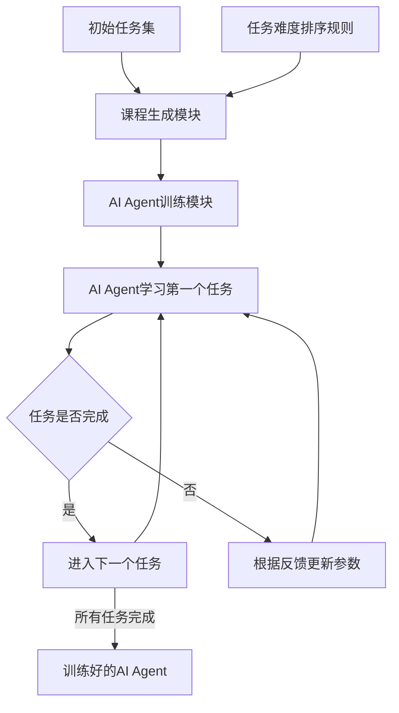

# 基于课程学习的AI Agent能力进阶

> 关键词：课程学习、AI Agent、能力进阶、机器学习、智能体训练

> 摘要：本文围绕基于课程学习的AI Agent能力进阶展开深入探讨。课程学习作为一种有效的训练策略，能帮助AI Agent更高效地学习和提升能力。文章首先介绍相关背景知识，包括目的范围、预期读者等内容；接着阐述核心概念与联系，给出原理和架构的示意图及流程图；详细讲解核心算法原理并结合Python源代码说明具体操作步骤；分析数学模型和公式并举例；通过项目实战展示代码实现与解读；探讨实际应用场景；推荐相关工具和资源；最后总结未来发展趋势与挑战，提供常见问题解答和参考资料，旨在为相关领域的研究者和开发者提供全面的技术参考和指导。

## 1. 背景介绍 
### 1.1 目的和范围
在人工智能领域，AI Agent的训练和能力提升一直是研究的重点。传统的训练方法可能会面临效率低下、难以应对复杂任务等问题。课程学习作为一种新兴的训练策略，通过合理安排学习任务的顺序，让AI Agent逐步学习和掌握知识与技能，从而实现能力的进阶。本文的目的在于深入研究基于课程学习的AI Agent能力进阶的原理、方法和应用，探讨其在不同领域的可行性和优势。范围涵盖课程学习的基本概念、核心算法、数学模型、实际应用案例以及相关工具和资源等方面。

### 1.2 预期读者
本文预期读者包括人工智能领域的研究者、开发者、学生以及对AI Agent和课程学习感兴趣的技术爱好者。对于研究者来说，本文提供了最新的研究进展和理论分析；对于开发者，详细的代码实现和案例分析有助于他们在实际项目中应用课程学习来提升AI Agent的能力；对于学生，本文可以作为学习人工智能和机器学习相关知识的参考资料；对于技术爱好者，通俗易懂的讲解能帮助他们了解课程学习和AI Agent能力进阶的基本原理和应用场景。

### 1.3 文档结构概述
本文共分为十个部分。第一部分为背景介绍，阐述了目的范围、预期读者、文档结构概述和术语表；第二部分介绍核心概念与联系，给出核心概念原理和架构的文本示意图和Mermaid流程图；第三部分讲解核心算法原理并结合Python源代码说明具体操作步骤；第四部分分析数学模型和公式并举例；第五部分通过项目实战展示代码实现与解读；第六部分探讨实际应用场景；第七部分推荐相关工具和资源；第八部分总结未来发展趋势与挑战；第九部分为附录，提供常见问题与解答；第十部分为扩展阅读和参考资料。

### 1.4 术语表
#### 1.4.1 核心术语定义
- **课程学习（Curriculum Learning）**：一种训练策略，按照从简单到复杂的顺序安排学习任务，帮助模型逐步学习和掌握知识与技能，提高学习效率和泛化能力。
- **AI Agent（人工智能智能体）**：能够感知环境、做出决策并执行动作的智能实体，通过与环境的交互来实现特定的目标。
- **能力进阶（Capability Advancement）**：指AI Agent在学习和训练过程中，不断提升自身的性能和智能水平，能够更好地完成各种任务。

#### 1.4.2 相关概念解释
- **强化学习（Reinforcement Learning）**：一种机器学习方法，智能体通过与环境进行交互，根据环境反馈的奖励信号来学习最优的行为策略。
- **监督学习（Supervised Learning）**：一种机器学习方法，通过给定的输入和对应的输出标签来训练模型，让模型学习输入和输出之间的映射关系。

#### 1.4.3 缩略词列表
- **RL**：Reinforcement Learning（强化学习）
- **SL**：Supervised Learning（监督学习）

## 2. 核心概念与联系 

### 核心概念原理
课程学习的核心思想是将学习任务按照难度进行排序，让AI Agent先从简单的任务开始学习，逐步过渡到复杂的任务。这样可以避免AI Agent在面对复杂任务时陷入局部最优解，提高学习效率和泛化能力。例如，在图像识别任务中，可以先让AI Agent学习识别简单的几何图形，然后再学习识别复杂的物体。

AI Agent是一个能够感知环境、做出决策并执行动作的智能实体。它通过与环境的交互来获取信息，并根据这些信息来调整自己的行为策略。AI Agent的能力进阶可以通过不断地学习和训练来实现，而课程学习为其提供了一种有效的训练方法。

### 架构的文本示意图
```plaintext
输入：初始任务集、任务难度排序规则
|
|-- 课程生成模块
|   |-- 根据任务难度排序规则对初始任务集进行排序，生成课程
|
|-- AI Agent训练模块
|   |-- AI Agent从课程的第一个任务开始学习
|   |-- 根据任务的反馈更新AI Agent的参数
|   |-- 当完成一个任务后，进入下一个任务
|
输出：训练好的AI Agent
```

### Mermaid流程图


## 3. 核心算法原理 & 具体操作步骤 

### 核心算法原理
课程学习的核心算法可以分为两个主要部分：课程生成和AI Agent训练。

#### 课程生成
课程生成的目标是根据任务的难度对初始任务集进行排序，生成一个合理的课程。一种常见的方法是根据任务的复杂度指标来排序，例如任务的状态空间大小、动作空间大小等。

#### AI Agent训练
AI Agent训练采用逐步学习的方式，从课程的第一个任务开始学习，根据任务的反馈更新AI Agent的参数。当完成一个任务后，进入下一个任务，直到完成所有任务。

### 具体操作步骤及Python源代码

```python
import numpy as np

# 定义任务类
class Task:
    def __init__(self, difficulty):
        self.difficulty = difficulty

    def get_difficulty(self):
        return self.difficulty

    def evaluate(self, agent):
        # 模拟任务评估，简单返回一个随机得分
        return np.random.rand()

# 定义AI Agent类
class AI_Agent:
    def __init__(self):
        self.parameters = np.random.rand(10)

    def update_parameters(self, feedback):
        # 简单的参数更新方法
        self.parameters += feedback * 0.1

# 课程生成函数
def generate_curriculum(tasks):
    sorted_tasks = sorted(tasks, key=lambda task: task.get_difficulty())
    return sorted_tasks

# AI Agent训练函数
def train_agent(agent, curriculum):
    for task in curriculum:
        feedback = task.evaluate(agent)
        agent.update_parameters(feedback)

# 主函数
if __name__ == "__main__":
    # 生成初始任务集
    tasks = [Task(np.random.rand()) for _ in range(10)]
    # 生成课程
    curriculum = generate_curriculum(tasks)
    # 创建AI Agent
    agent = AI_Agent()
    # 训练AI Agent
    train_agent(agent, curriculum)
    print("Training completed.")
```

### 代码解释
1. **Task类**：表示一个任务，包含任务的难度属性和评估方法。
2. **AI_Agent类**：表示一个AI Agent，包含参数和参数更新方法。
3. **generate_curriculum函数**：根据任务的难度对任务集进行排序，生成课程。
4. **train_agent函数**：让AI Agent从课程的第一个任务开始学习，根据任务的反馈更新参数。
5. **主函数**：生成初始任务集，生成课程，创建AI Agent并进行训练。

## 4. 数学模型和公式 & 详细讲解 & 举例说明 

### 数学模型
课程学习的数学模型可以用马尔可夫决策过程（MDP）来描述。MDP是一个五元组 $(S, A, P, R, \gamma)$，其中：
- $S$ 是状态空间，表示环境的所有可能状态。
- $A$ 是动作空间，表示AI Agent可以采取的所有可能动作。
- $P(s'|s, a)$ 是状态转移概率，表示在状态 $s$ 采取动作 $a$ 后转移到状态 $s'$ 的概率。
- $R(s, a)$ 是奖励函数，表示在状态 $s$ 采取动作 $a$ 后获得的奖励。
- $\gamma$ 是折扣因子，用于平衡即时奖励和未来奖励。

### 数学公式
在课程学习中，AI Agent的目标是最大化长期累积奖励，即：

$$V(s) = \max_{a \in A} \sum_{s' \in S} P(s'|s, a) [R(s, a) + \gamma V(s')]$$

其中 $V(s)$ 是状态 $s$ 的价值函数，表示从状态 $s$ 开始采取最优策略所能获得的长期累积奖励。

### 详细讲解
上述公式表示在每个状态 $s$ 下，AI Agent选择能够最大化长期累积奖励的动作 $a$。状态转移概率 $P(s'|s, a)$ 描述了环境的动态特性，奖励函数 $R(s, a)$ 表示AI Agent采取动作后获得的即时奖励，折扣因子 $\gamma$ 用于平衡即时奖励和未来奖励。通过不断迭代求解上述公式，可以得到AI Agent的最优策略。

### 举例说明
假设一个简单的网格世界环境，AI Agent在一个 $3 \times 3$ 的网格中移动，目标是到达右上角的网格。状态空间 $S$ 包含所有网格的位置，动作空间 $A$ 包含上下左右四个方向的移动。奖励函数 $R(s, a)$ 可以定义为：当AI Agent到达目标网格时获得奖励10，否则获得奖励 -1。折扣因子 $\gamma$ 可以设置为0.9。通过迭代求解上述公式，AI Agent可以学习到最优的移动策略，从而到达目标网格。

## 5. 项目实战：代码实际案例和详细解释说明 

### 5.1  开发环境搭建
本项目使用Python语言进行开发，需要安装以下库：
- `numpy`：用于数值计算。
- `matplotlib`：用于可视化。

可以使用以下命令进行安装：
```sh
pip install numpy matplotlib
```

### 5.2  源代码详细实现和代码解读

```python
import numpy as np
import matplotlib.pyplot as plt

# 定义环境类
class GridWorld:
    def __init__(self, size=3):
        self.size = size
        self.state = (0, 0)
        self.goal = (size - 1, size - 1)

    def reset(self):
        self.state = (0, 0)
        return self.state

    def step(self, action):
        x, y = self.state
        if action == 0:  # 上
            x = max(0, x - 1)
        elif action == 1:  # 下
            x = min(self.size - 1, x + 1)
        elif action == 2:  # 左
            y = max(0, y - 1)
        elif action == 3:  # 右
            y = min(self.size - 1, y + 1)
        self.state = (x, y)
        if self.state == self.goal:
            reward = 10
            done = True
        else:
            reward = -1
            done = False
        return self.state, reward, done

# 定义AI Agent类
class QLearningAgent:
    def __init__(self, state_size, action_size, learning_rate=0.1, discount_factor=0.9):
        self.state_size = state_size
        self.action_size = action_size
        self.learning_rate = learning_rate
        self.discount_factor = discount_factor
        self.q_table = np.zeros((state_size, action_size))

    def get_action(self, state, epsilon=0.1):
        if np.random.uniform(0, 1) < epsilon:
            return np.random.choice(self.action_size)
        else:
            return np.argmax(self.q_table[state])

    def update(self, state, action, reward, next_state):
        q_target = reward + self.discount_factor * np.max(self.q_table[next_state])
        self.q_table[state][action] += self.learning_rate * (q_target - self.q_table[state][action])

# 课程生成函数
def generate_curriculum():
    curriculums = []
    for size in range(2, 6):
        env = GridWorld(size)
        curriculums.append(env)
    return curriculums

# 训练函数
def train(agent, curriculums, episodes=1000):
    total_rewards = []
    for env in curriculums:
        state_size = env.size * env.size
        action_size = 4
        agent.q_table = np.zeros((state_size, action_size))
        for episode in range(episodes):
            state = env.reset()
            state_index = state[0] * env.size + state[1]
            total_reward = 0
            done = False
            while not done:
                action = agent.get_action(state_index)
                next_state, reward, done = env.step(action)
                next_state_index = next_state[0] * env.size + next_state[1]
                agent.update(state_index, action, reward, next_state_index)
                state_index = next_state_index
                total_reward += reward
            total_rewards.append(total_reward)
    return total_rewards

# 主函数
if __name__ == "__main__":
    curriculums = generate_curriculum()
    state_size = curriculums[-1].size * curriculums[-1].size
    action_size = 4
    agent = QLearningAgent(state_size, action_size)
    total_rewards = train(agent, curriculums)
    plt.plot(total_rewards)
    plt.xlabel('Episode')
    plt.ylabel('Total Reward')
    plt.show()
```

### 5.3  代码解读与分析
1. **GridWorld类**：表示一个网格世界环境，包含环境的大小、当前状态和目标状态。提供了重置环境和执行动作的方法。
2. **QLearningAgent类**：表示一个基于Q学习的AI Agent，包含Q表、学习率和折扣因子。提供了选择动作和更新Q表的方法。
3. **generate_curriculum函数**：生成课程，包含不同大小的网格世界环境。
4. **train函数**：让AI Agent在课程中的每个环境中进行训练，记录每个回合的总奖励。
5. **主函数**：生成课程，创建AI Agent，进行训练并绘制总奖励曲线。

通过这个项目实战，我们可以看到课程学习的效果。AI Agent先在简单的网格世界环境中学习，逐步过渡到复杂的环境，从而提高了学习效率和性能。

## 6. 实际应用场景 
### 游戏领域
在游戏开发中，AI Agent可以作为游戏中的智能对手。通过课程学习，AI Agent可以先学习简单的游戏规则和策略，然后逐步学习复杂的战术和技巧，提高游戏的趣味性和挑战性。例如，在策略游戏中，AI Agent可以先学习基本的资源管理和单位建造，然后学习高级的战术和战略，与玩家进行更激烈的对抗。

### 机器人领域
在机器人控制中，课程学习可以帮助机器人更快地学习和掌握各种任务。例如，机器人可以先学习简单的移动和抓取任务，然后学习复杂的导航和操作任务。通过课程学习，机器人可以减少训练时间，提高学习效率，更好地适应不同的环境和任务需求。

### 自动驾驶领域
在自动驾驶中，AI Agent需要学习各种驾驶场景和规则。课程学习可以让AI Agent先学习简单的驾驶场景，如直线行驶和简单的转弯，然后学习复杂的场景，如交通拥堵和交叉路口的行驶。这样可以提高AI Agent的学习效率和安全性，减少交通事故的发生。

### 自然语言处理领域
在自然语言处理中，课程学习可以用于训练语言模型。例如，语言模型可以先学习简单的语法和词汇，然后学习复杂的语义和语用。通过课程学习，语言模型可以提高语言理解和生成的能力，更好地处理各种自然语言任务。

## 7. 工具和资源推荐
### 7.1 学习资源推荐
#### 7.1.1 书籍推荐
- 《人工智能：一种现代的方法》：这是一本经典的人工智能教材，涵盖了人工智能的各个领域，包括机器学习、知识表示、推理等。
- 《强化学习：原理与Python实现》：详细介绍了强化学习的原理和算法，并通过Python代码进行实现，适合初学者学习。
- 《深度学习》：由深度学习领域的三位大牛撰写，全面介绍了深度学习的理论和实践，是深度学习领域的权威书籍。

#### 7.1.2 在线课程
- Coursera上的“机器学习”课程：由吴恩达教授讲授，是机器学习领域的经典课程，适合初学者入门。
- edX上的“强化学习基础”课程：详细介绍了强化学习的基本概念和算法，通过实际案例进行讲解，帮助学习者更好地理解和应用强化学习。
- 网易云课堂上的“深度学习实战”课程：结合实际项目，介绍深度学习的应用和开发，适合有一定基础的学习者。

#### 7.1.3 技术博客和网站
- Medium：一个技术博客平台，有很多关于人工智能和机器学习的优质文章。
- arXiv：一个预印本数据库，提供了最新的人工智能和机器学习研究论文。
- OpenAI Blog：OpenAI发布的博客，分享了很多关于人工智能的最新研究成果和应用案例。

### 7.2 开发工具框架推荐
#### 7.2.1 IDE和编辑器
- PyCharm：一款专业的Python集成开发环境，提供了丰富的功能和插件，方便开发者进行Python代码的开发和调试。
- Jupyter Notebook：一个交互式的开发环境，适合进行数据分析和机器学习实验，支持多种编程语言。
- Visual Studio Code：一款轻量级的代码编辑器，支持多种编程语言，有丰富的插件和扩展，适合快速开发和调试。

#### 7.2.2 调试和性能分析工具
- TensorBoard：TensorFlow的可视化工具，可以帮助开发者可视化训练过程、模型结构和性能指标，方便调试和优化模型。
- Py-Spy：一个Python性能分析工具，可以帮助开发者分析Python代码的性能瓶颈，提高代码的运行效率。
- cProfile：Python的内置性能分析工具，可以帮助开发者分析Python代码的执行时间和调用关系。

#### 7.2.3 相关框架和库
- TensorFlow：一个开源的机器学习框架，提供了丰富的工具和接口，支持深度学习、强化学习等多种机器学习算法。
- PyTorch：一个开源的深度学习框架，具有动态计算图的特点，适合进行研究和开发。
- Stable Baselines：一个开源的强化学习库，提供了多种强化学习算法的实现，方便开发者进行强化学习实验。

### 7.3 相关论文著作推荐
#### 7.3.1 经典论文
- “Curriculum Learning”：由Yoshua Bengio等人发表的论文，首次提出了课程学习的概念，为后续的研究奠定了基础。
- “Reinforcement Learning: An Introduction”：由Richard S. Sutton和Andrew G. Barto撰写的书籍，是强化学习领域的经典著作，系统地介绍了强化学习的理论和算法。
- “Deep Q-Networks”：由DeepMind团队发表的论文，提出了深度Q网络（DQN）算法，开启了深度学习和强化学习相结合的新时代。

#### 7.3.2 最新研究成果
- 关注arXiv上关于课程学习和AI Agent的最新论文，了解最新的研究进展和技术趋势。
- 参加人工智能领域的顶级会议，如NeurIPS、ICML等，听取最新的研究报告和成果分享。

#### 7.3.3 应用案例分析
- 分析OpenAI、DeepMind等机构发布的AI Agent应用案例，了解课程学习在实际应用中的效果和经验。
- 参考工业界的实际应用案例，如自动驾驶、机器人控制等领域，学习如何将课程学习应用到实际项目中。

## 8. 总结：未来发展趋势与挑战
### 未来发展趋势
- **多模态课程学习**：未来的课程学习将不仅仅局限于单一的模态，如文本、图像等，而是会结合多种模态的信息，如视觉、听觉、触觉等，让AI Agent能够更全面地感知和理解环境，提高学习效果和智能水平。
- **自适应课程学习**：AI Agent将能够根据自身的学习状态和环境的变化，自适应地调整学习任务的顺序和难度，实现更加个性化和高效的学习。
- **跨领域课程学习**：课程学习将不再局限于某个特定的领域，而是会跨领域地进行学习和应用。例如，AI Agent可以在不同的领域中学习知识和技能，然后将这些知识和技能迁移到其他领域中，实现更广泛的应用和创新。

### 挑战
- **任务难度评估**：如何准确地评估任务的难度是课程学习面临的一个重要挑战。目前还没有一种通用的方法来评估任务的难度，不同的任务可能需要不同的评估指标和方法。
- **课程生成策略**：如何生成最优的课程是课程学习的关键问题。目前的课程生成策略大多基于经验和启发式方法，缺乏理论依据和优化算法。
- **AI Agent的泛化能力**：虽然课程学习可以提高AI Agent的学习效率和性能，但如何提高AI Agent的泛化能力，使其能够在不同的环境和任务中都能表现良好，仍然是一个有待解决的问题。

## 9. 附录：常见问题与解答
### 1. 课程学习和传统的学习方法有什么区别？
课程学习通过合理安排学习任务的顺序，让AI Agent先从简单的任务开始学习，逐步过渡到复杂的任务。而传统的学习方法通常是随机地选择任务进行学习，可能会导致AI Agent在面对复杂任务时陷入局部最优解，学习效率低下。课程学习可以提高AI Agent的学习效率和泛化能力。

### 2. 如何确定任务的难度？
任务的难度可以根据多种因素来确定，如任务的状态空间大小、动作空间大小、任务的复杂度、任务的目标等。不同的任务可能需要不同的评估指标和方法。例如，在图像识别任务中，可以根据图像的复杂度、类别数量等因素来评估任务的难度。

### 3. 课程学习适用于所有的AI Agent训练任务吗？
课程学习并不适用于所有的AI Agent训练任务。对于一些简单的任务，传统的学习方法可能已经足够。课程学习更适用于复杂的任务，特别是那些任务难度差异较大的任务。在这些任务中，课程学习可以帮助AI Agent更好地学习和掌握知识与技能，提高学习效率和性能。

### 4. 如何生成最优的课程？
目前还没有一种通用的方法来生成最优的课程。一些常见的方法包括基于任务难度排序、基于任务的相关性、基于AI Agent的学习进度等。未来的研究可以探索更加智能和优化的课程生成策略，以提高课程学习的效果。

## 10. 扩展阅读 & 参考资料
### 扩展阅读
- 阅读更多关于课程学习和AI Agent的相关书籍和论文，深入了解其理论和应用。
- 关注人工智能领域的最新研究动态和技术趋势，了解课程学习的最新发展和应用案例。

### 参考资料
- Yoshua Bengio, et al. “Curriculum Learning”. Proceedings of the 26th Annual International Conference on Machine Learning. 2009.
- Richard S. Sutton, Andrew G. Barto. “Reinforcement Learning: An Introduction”. MIT Press. 2018.
- Volodymyr Mnih, et al. “Playing Atari with Deep Reinforcement Learning”. arXiv preprint arXiv:1312.5602. 2013.