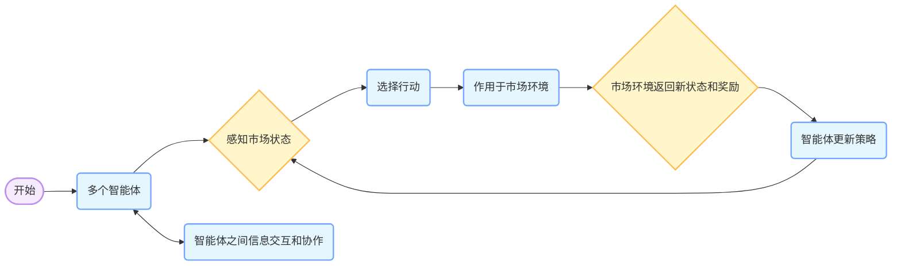

# 多智能体强化学习在优化价值投资的动态仓位管理中的应用

> 关键词：多智能体强化学习、价值投资、动态仓位管理、投资优化、金融应用

> 摘要：本文聚焦于多智能体强化学习在优化价值投资的动态仓位管理中的应用。首先介绍了相关背景，包括目的范围、预期读者等内容。接着阐述了多智能体强化学习和价值投资动态仓位管理的核心概念与联系，详细讲解了核心算法原理及具体操作步骤，通过数学模型和公式进行深入分析并举例说明。随后通过项目实战展示代码实际案例及详细解释。探讨了该技术在实际中的应用场景，推荐了相关的工具和资源。最后总结了未来发展趋势与挑战，提供常见问题解答及扩展阅读参考资料，旨在全面深入地研究多智能体强化学习在价值投资动态仓位管理中的作用与应用。

## 1. 背景介绍 
### 1.1 目的和范围
在金融投资领域，价值投资一直是一种备受关注的投资策略，其核心在于寻找被低估的资产并长期持有。然而，市场环境复杂多变，资产价格波动频繁，如何在价值投资的框架下进行合理的仓位管理是投资者面临的重要挑战。传统的仓位管理方法往往基于固定规则或简单的经验判断，难以适应市场的动态变化。

多智能体强化学习作为一种新兴的人工智能技术，具有在复杂环境中自主学习和决策的能力。本研究的目的在于探索如何将多智能体强化学习应用于价值投资的动态仓位管理中，以提高投资组合的绩效和风险管理能力。

本研究的范围涵盖了多智能体强化学习的基本原理、价值投资的理论基础、动态仓位管理的方法，以及如何将三者有机结合。通过理论分析、算法设计、代码实现和实验验证等步骤，深入探讨多智能体强化学习在优化价值投资的动态仓位管理中的可行性和有效性。

### 1.2 预期读者
本文预期读者包括金融领域的投资者、投资组合经理、量化分析师等，他们希望通过新技术提升投资决策的科学性和有效性。同时，也适合人工智能领域的研究人员和开发者，对多智能体强化学习在金融领域的应用感兴趣，希望了解相关技术和实践经验。此外，对金融科技、机器学习等交叉学科有兴趣的学生和学者也可以从本文中获得有价值的信息。

### 1.3 文档结构概述
本文共分为十个部分。第一部分为背景介绍，阐述了研究的目的和范围、预期读者以及文档结构概述，并给出了相关术语表。第二部分介绍核心概念与联系，包括多智能体强化学习和价值投资动态仓位管理的原理、架构以及它们之间的联系，同时给出文本示意图和 Mermaid 流程图。第三部分详细讲解核心算法原理和具体操作步骤，并使用 Python 源代码进行阐述。第四部分介绍数学模型和公式，对其进行详细讲解并举例说明。第五部分通过项目实战展示代码实际案例，包括开发环境搭建、源代码详细实现和代码解读。第六部分探讨实际应用场景。第七部分推荐相关的工具和资源，包括学习资源、开发工具框架和相关论文著作。第八部分总结未来发展趋势与挑战。第九部分为附录，提供常见问题与解答。第十部分为扩展阅读和参考资料。

### 1.4 术语表
#### 1.4.1 核心术语定义
- **多智能体强化学习（Multi - Agent Reinforcement Learning, MARL）**：是强化学习的一个扩展，多个智能体在同一环境中进行学习和决策，智能体之间可能存在合作、竞争等关系，通过与环境的交互来最大化各自或整体的奖励。
- **价值投资（Value Investing）**：一种投资策略，基于对资产内在价值的分析，寻找被市场低估的资产进行投资，期望在资产价格回归其内在价值时获得收益。
- **动态仓位管理（Dynamic Position Management）**：根据市场情况、资产表现等因素实时调整投资组合中各资产的仓位比例，以实现投资目标和风险管理的目的。
- **智能体（Agent）**：在强化学习中，能够感知环境状态，采取行动，并根据行动的结果获得奖励的实体。
- **状态（State）**：描述环境在某一时刻的信息，智能体根据状态来决定采取的行动。
- **行动（Action）**：智能体在某一状态下采取的决策，如买入、卖出、持有等。
- **奖励（Reward）**：环境对智能体行动的反馈，用于指导智能体的学习，奖励的设计通常与投资目标相关，如最大化投资收益、最小化风险等。

#### 1.4.2 相关概念解释
- **强化学习（Reinforcement Learning）**：一种机器学习范式，智能体通过与环境进行交互，不断尝试不同的行动，根据环境给予的奖励来学习最优的行动策略。
- **策略（Policy）**：智能体在不同状态下选择行动的规则，通常表示为一个函数，如 $\pi(s)$ 表示在状态 $s$ 下选择行动的概率分布。
- **环境（Environment）**：智能体所处的外部世界，它接收智能体的行动并返回新的状态和奖励。
- **投资组合（Portfolio）**：由多种资产组成的集合，投资者通过合理配置资产来实现投资目标。

#### 1.4.3 缩略词列表
- **MARL**：Multi - Agent Reinforcement Learning（多智能体强化学习）
- **RL**：Reinforcement Learning（强化学习）
- **MDP**：Markov Decision Process（马尔可夫决策过程）
- **Q - learning**：一种基于值函数的强化学习算法

## 2. 核心概念与联系 

### 2.1 多智能体强化学习原理
多智能体强化学习是在强化学习的基础上发展而来的。在单智能体强化学习中，一个智能体与环境进行交互，通过不断尝试不同的行动来学习最优策略。而在多智能体强化学习中，存在多个智能体，它们在同一环境中相互作用。

多智能体强化学习的核心在于如何处理智能体之间的关系。智能体之间可能存在合作关系，例如多个智能体共同完成一个复杂的任务，通过协作来最大化整体的奖励；也可能存在竞争关系，如在市场交易中，不同的投资者智能体可能会争夺有限的资源。

多智能体强化学习的基本架构通常包括多个智能体、环境和奖励函数。每个智能体都有自己的策略和状态空间，它们通过感知环境状态，选择行动，并根据奖励函数获得反馈来更新自己的策略。

### 2.2 价值投资动态仓位管理原理
价值投资的核心是寻找被低估的资产。投资者通过对公司的基本面分析，如财务报表、行业前景等，评估资产的内在价值。当资产价格低于其内在价值时，认为该资产被低估，可以考虑买入；当资产价格高于其内在价值时，认为该资产被高估，可以考虑卖出。

动态仓位管理则是在价值投资的基础上，根据市场情况和资产表现实时调整投资组合中各资产的仓位比例。例如，当市场行情向好时，可以适当增加股票的仓位；当市场行情不佳时，可以减少股票仓位，增加债券等防御性资产的仓位。

### 2.3 核心概念联系
多智能体强化学习可以应用于价值投资的动态仓位管理中。在这个应用场景中，每个智能体可以代表一个投资者或一个投资策略。智能体通过感知市场环境的状态，如资产价格、宏观经济指标等，选择合适的行动，如调整仓位比例。环境则根据智能体的行动返回新的状态和奖励，奖励可以根据投资组合的收益、风险等因素来设计。

通过多智能体强化学习，智能体可以不断学习和优化自己的策略，以适应市场的动态变化。多个智能体之间可以通过合作或竞争的方式来提高整体的投资绩效。例如，合作的智能体可以共享信息，共同制定投资策略；竞争的智能体可以通过不断优化自己的策略来在市场中获得更高的收益。

### 2.4 文本示意图
多智能体强化学习在价值投资动态仓位管理中的应用可以用以下文本示意图表示：

多个智能体（投资者或投资策略）处于市场环境中，每个智能体都有自己的状态感知器，用于感知市场环境的状态，如资产价格、宏观经济数据等。智能体根据感知到的状态，依据自己的策略选择行动，如买入、卖出、持有等。行动作用于市场环境，市场环境根据智能体的行动返回新的状态和奖励。奖励反映了智能体行动的效果，如投资收益、风险等。智能体根据奖励来更新自己的策略，以提高未来的行动效果。多个智能体之间可能存在信息交互和协作，共同优化投资组合的仓位管理。

### 2.5 Mermaid 流程图


## 3. 核心算法原理 & 具体操作步骤 

### 3.1 多智能体强化学习算法原理
多智能体强化学习有多种算法，这里以基于 Q - learning 的多智能体算法为例进行讲解。

Q - learning 是一种基于值函数的强化学习算法，其核心思想是学习一个 Q 函数 $Q(s, a)$，表示在状态 $s$ 下采取行动 $a$ 的期望累计奖励。智能体通过不断更新 Q 函数来找到最优策略。

在多智能体环境中，每个智能体都有自己的 Q 函数。假设存在 $n$ 个智能体，第 $i$ 个智能体的 Q 函数为 $Q_i(s_i, a_i)$，其中 $s_i$ 是第 $i$ 个智能体感知到的状态，$a_i$ 是第 $i$ 个智能体采取的行动。

Q 函数的更新公式为：

$Q_i(s_i, a_i) \leftarrow Q_i(s_i, a_i) + \alpha \left[ r_i + \gamma \max_{a_i'} Q_i(s_i', a_i') - Q_i(s_i, a_i) \right]$

其中，$\alpha$ 是学习率，控制每次更新的步长；$\gamma$ 是折扣因子，用于权衡当前奖励和未来奖励的重要性；$r_i$ 是第 $i$ 个智能体获得的奖励；$s_i'$ 是第 $i$ 个智能体在采取行动 $a_i$ 后转移到的新状态。

### 3.2 具体操作步骤
#### 3.2.1 初始化
- 初始化每个智能体的 Q 函数 $Q_i(s_i, a_i)$，通常将其初始化为 0。
- 初始化市场环境的状态 $s$。
- 设置学习率 $\alpha$、折扣因子 $\gamma$ 等参数。

#### 3.2.2 智能体感知状态
每个智能体根据自己的状态感知器感知市场环境的状态 $s_i$。

#### 3.2.3 智能体选择行动
每个智能体根据自己的 Q 函数和当前状态 $s_i$ 选择行动 $a_i$。可以采用 $\epsilon$ - 贪心策略，即以 $\epsilon$ 的概率随机选择行动，以 $1 - \epsilon$ 的概率选择使 $Q_i(s_i, a_i)$ 最大的行动。

#### 3.2.4 行动作用于环境
所有智能体的行动 $a = (a_1, a_2, \cdots, a_n)$ 作用于市场环境，环境根据行动返回新的状态 $s'$ 和每个智能体的奖励 $r = (r_1, r_2, \cdots, r_n)$。

#### 3.2.5 智能体更新 Q 函数
每个智能体根据 Q 函数的更新公式更新自己的 Q 函数。

#### 3.2.6 重复步骤 2 - 5
重复上述步骤，直到达到预定的训练步数或满足终止条件。

### 3.3 Python 源代码实现
```python
import numpy as np

# 定义智能体类
class Agent:
    def __init__(self, state_space, action_space, alpha, gamma, epsilon):
        self.state_space = state_space
        self.action_space = action_space
        self.alpha = alpha
        self.gamma = gamma
        self.epsilon = epsilon
        # 初始化 Q 函数
        self.Q = np.zeros((state_space, action_space))

    def choose_action(self, state):
        if np.random.uniform(0, 1) < self.epsilon:
            # 随机选择行动
            action = np.random.choice(self.action_space)
        else:
            # 选择使 Q 函数最大的行动
            action = np.argmax(self.Q[state, :])
        return action

    def update_Q(self, state, action, reward, next_state):
        # Q 函数更新公式
        self.Q[state, action] = self.Q[state, action] + self.alpha * (reward + self.gamma * np.max(self.Q[next_state, :]) - self.Q[state, action])


# 定义市场环境类
class MarketEnvironment:
    def __init__(self, state_space, action_space):
        self.state_space = state_space
        self.action_space = action_space
        # 初始化环境状态
        self.state = np.random.choice(state_space)

    def step(self, actions):
        # 这里简单模拟环境的状态转移和奖励返回
        next_state = np.random.choice(self.state_space)
        rewards = [np.random.randint(-1, 2) for _ in actions]
        return next_state, rewards


# 主训练函数
def train(num_agents, state_space, action_space, alpha, gamma, epsilon, num_episodes):
    agents = [Agent(state_space, action_space, alpha, gamma, epsilon) for _ in range(num_agents)]
    env = MarketEnvironment(state_space, action_space)

    for episode in range(num_episodes):
        state = env.state
        actions = [agent.choose_action(state) for agent in agents]
        next_state, rewards = env.step(actions)

        for i in range(num_agents):
            agents[i].update_Q(state, actions[i], rewards[i], next_state)

        env.state = next_state

    return agents


# 参数设置
num_agents = 3
state_space = 5
action_space = 3
alpha = 0.1
gamma = 0.9
epsilon = 0.1
num_episodes = 1000

# 训练智能体
trained_agents = train(num_agents, state_space, action_space, alpha, gamma, epsilon, num_episodes)
```

## 4. 数学模型和公式 & 详细讲解 & 举例说明 

### 4.1 马尔可夫决策过程（MDP）
多智能体强化学习可以用马尔可夫决策过程（MDP）来描述。一个 MDP 可以用一个五元组 $\langle S, A, P, R, \gamma \rangle$ 表示，其中：
- $S$ 是状态空间，表示环境可能处于的所有状态。
- $A$ 是行动空间，表示智能体可以采取的所有行动。
- $P(s'|s, a)$ 是状态转移概率，表示在状态 $s$ 下采取行动 $a$ 后转移到状态 $s'$ 的概率。
- $R(s, a)$ 是奖励函数，表示在状态 $s$ 下采取行动 $a$ 获得的奖励。
- $\gamma \in [0, 1]$ 是折扣因子，用于权衡当前奖励和未来奖励的重要性。

在多智能体环境中，状态空间 $S$ 可能是多个智能体状态的组合，行动空间 $A$ 是多个智能体行动的组合。

### 4.2 价值函数
价值函数是强化学习中的重要概念，用于评估状态或状态 - 行动对的价值。在多智能体强化学习中，有状态价值函数 $V(s)$ 和动作价值函数 $Q(s, a)$。

状态价值函数 $V(s)$ 表示在状态 $s$ 下，遵循某一策略 $\pi$ 时的期望累计奖励：

$V^{\pi}(s) = \mathbb{E}_{\pi} \left[ \sum_{t = 0}^{\infty} \gamma^t r_t | s_0 = s \right]$

动作价值函数 $Q(s, a)$ 表示在状态 $s$ 下采取行动 $a$，并遵循某一策略 $\pi$ 时的期望累计奖励：

$Q^{\pi}(s, a) = \mathbb{E}_{\pi} \left[ \sum_{t = 0}^{\infty} \gamma^t r_t | s_0 = s, a_0 = a \right]$

### 4.3 贝尔曼方程
贝尔曼方程是强化学习中的核心方程，用于描述价值函数的递归关系。

对于状态价值函数，贝尔曼方程为：

$V^{\pi}(s) = \sum_{a \in A} \pi(a|s) \left[ R(s, a) + \gamma \sum_{s' \in S} P(s'|s, a) V^{\pi}(s') \right]$

对于动作价值函数，贝尔曼方程为：

$Q^{\pi}(s, a) = R(s, a) + \gamma \sum_{s' \in S} P(s'|s, a) \sum_{a' \in A} \pi(a'|s') Q^{\pi}(s', a')$

### 4.4 最优价值函数和最优策略
最优状态价值函数 $V^*(s)$ 和最优动作价值函数 $Q^*(s, a)$ 分别表示在所有可能的策略中，能获得的最大期望累计奖励：

$V^*(s) = \max_{\pi} V^{\pi}(s)$

$Q^*(s, a) = \max_{\pi} Q^{\pi}(s, a)$

最优策略 $\pi^*$ 是使价值函数达到最优的策略，可以通过最优动作价值函数来确定：

$\pi^*(a|s) = \begin{cases} 1, & \text{if } a = \arg \max_{a'} Q^*(s, a') \\ 0, & \text{otherwise} \end{cases}$

### 4.5 举例说明
假设一个简单的投资环境，状态空间 $S = \{s_1, s_2\}$，行动空间 $A = \{a_1, a_2\}$，状态转移概率 $P(s_2|s_1, a_1) = 0.8$，$P(s_1|s_1, a_1) = 0.2$，$P(s_2|s_1, a_2) = 0.3$，$P(s_1|s_1, a_2) = 0.7$，奖励函数 $R(s_1, a_1) = 1$，$R(s_1, a_2) = - 1$。

设折扣因子 $\gamma = 0.9$，初始策略 $\pi(a_1|s_1) = 0.6$，$\pi(a_2|s_1) = 0.4$。

根据贝尔曼方程计算状态价值函数 $V^{\pi}(s_1)$：

$V^{\pi}(s_1) = \pi(a_1|s_1) \left[ R(s_1, a_1) + \gamma \left( P(s_2|s_1, a_1) V^{\pi}(s_2) + P(s_1|s_1, a_1) V^{\pi}(s_1) \right) \right] + \pi(a_2|s_1) \left[ R(s_1, a_2) + \gamma \left( P(s_2|s_1, a_2) V^{\pi}(s_2) + P(s_1|s_1, a_2) V^{\pi}(s_1) \right) \right]$

假设 $V^{\pi}(s_2) = 0$（简单假设），则：

$V^{\pi}(s_1) = 0.6 \left[ 1 + 0.9 \left( 0.8 \times 0 + 0.2 \times V^{\pi}(s_1) \right) \right] + 0.4 \left[ - 1 + 0.9 \left( 0.3 \times 0 + 0.7 \times V^{\pi}(s_1) \right) \right]$

$V^{\pi}(s_1) = 0.6(1 + 0.18V^{\pi}(s_1)) + 0.4(-1 + 0.63V^{\pi}(s_1))$

$V^{\pi}(s_1) = 0.6 + 0.108V^{\pi}(s_1) - 0.4 + 0.252V^{\pi}(s_1)$

$V^{\pi}(s_1) - 0.108V^{\pi}(s_1) - 0.252V^{\pi}(s_1) = 0.2$

$0.64V^{\pi}(s_1) = 0.2$

$V^{\pi}(s_1)=\frac{0.2}{0.64}=0.3125$


## 5. 项目实战：代码实际案例和详细解释说明 

### 5.1  开发环境搭建
#### 5.1.1 安装 Python
首先需要安装 Python 环境，建议使用 Python 3.6 及以上版本。可以从 Python 官方网站（https://www.python.org/downloads/） 下载适合自己操作系统的安装包，按照安装向导进行安装。

#### 5.1.2 安装必要的库
在本项目中，需要使用一些常用的 Python 库，如 `numpy`、`pandas`、`matplotlib` 等。可以使用 `pip` 命令进行安装：
```bash
pip install numpy pandas matplotlib
```

### 5.2  源代码详细实现和代码解读
```python
import numpy as np
import pandas as pd
import matplotlib.pyplot as plt

# 定义智能体类
class Agent:
    def __init__(self, state_space, action_space, alpha, gamma, epsilon):
        self.state_space = state_space
        self.action_space = action_space
        self.alpha = alpha
        self.gamma = gamma
        self.epsilon = epsilon
        # 初始化 Q 函数
        self.Q = np.zeros((state_space, action_space))

    def choose_action(self, state):
        if np.random.uniform(0, 1) < self.epsilon:
            # 随机选择行动
            action = np.random.choice(self.action_space)
        else:
            # 选择使 Q 函数最大的行动
            action = np.argmax(self.Q[state, :])
        return action

    def update_Q(self, state, action, reward, next_state):
        # Q 函数更新公式
        self.Q[state, action] = self.Q[state, action] + self.alpha * (reward + self.gamma * np.max(self.Q[next_state, :]) - self.Q[state, action])


# 定义市场环境类
class MarketEnvironment:
    def __init__(self, stock_prices):
        self.stock_prices = stock_prices
        self.num_days = len(stock_prices)
        self.current_day = 0
        self.portfolio_value = 1000  # 初始投资组合价值
        self.position = 0  # 初始仓位

    def get_state(self):
        # 简单定义状态为当前股票价格的相对变化
        if self.current_day == 0:
            return 0
        price_change = (self.stock_prices[self.current_day] - self.stock_prices[self.current_day - 1]) / self.stock_prices[self.current_day - 1]
        if price_change > 0.01:
            return 2
        elif price_change < -0.01:
            return 0
        else:
            return 1

    def step(self, action):
        # 0: 卖出, 1: 持有, 2: 买入
        if action == 0:
            self.portfolio_value += self.position * self.stock_prices[self.current_day]
            self.position = 0
        elif action == 2:
            if self.portfolio_value > 0:
                self.position += self.portfolio_value / self.stock_prices[self.current_day]
                self.portfolio_value = 0

        self.current_day += 1
        if self.current_day >= self.num_days:
            done = True
            self.portfolio_value += self.position * self.stock_prices[-1]
            self.position = 0
        else:
            done = False

        # 奖励设计为投资组合价值的变化
        reward = self.portfolio_value - 1000
        next_state = self.get_state()

        return next_state, reward, done


# 主训练函数
def train(stock_prices, state_space, action_space, alpha, gamma, epsilon, num_episodes):
    agent = Agent(state_space, action_space, alpha, gamma, epsilon)
    portfolio_values = []

    for episode in range(num_episodes):
        env = MarketEnvironment(stock_prices)
        state = env.get_state()
        done = False

        while not done:
            action = agent.choose_action(state)
            next_state, reward, done = env.step(action)
            agent.update_Q(state, action, reward, next_state)
            state = next_state

        portfolio_values.append(env.portfolio_value)

    return agent, portfolio_values


# 生成模拟股票价格数据
np.random.seed(42)
num_days = 200
stock_prices = np.cumprod(1 + np.random.normal(0, 0.01, num_days))

# 参数设置
state_space = 3
action_space = 3
alpha = 0.1
gamma = 0.9
epsilon = 0.1
num_episodes = 100

# 训练智能体
trained_agent, portfolio_values = train(stock_prices, state_space, action_space, alpha, gamma, epsilon, num_episodes)

# 绘制投资组合价值变化曲线
plt.plot(portfolio_values)
plt.xlabel('Episode')
plt.ylabel('Portfolio Value')
plt.title('Portfolio Value over Episodes')
plt.show()
```

### 5.3  代码解读与分析
#### 5.3.1 智能体类 `Agent`
- `__init__` 方法：初始化智能体的状态空间、行动空间、学习率、折扣因子、探索率和 Q 函数。
- `choose_action` 方法：根据 $\epsilon$ - 贪心策略选择行动。
- `update_Q` 方法：根据 Q 函数的更新公式更新 Q 函数。

#### 5.3.2 市场环境类 `MarketEnvironment`
- `__init__` 方法：初始化市场环境，包括股票价格数据、当前天数、投资组合价值和仓位。
- `get_state` 方法：根据当前股票价格的相对变化确定状态。
- `step` 方法：根据智能体的行动更新投资组合价值和仓位，返回新的状态、奖励和是否结束的标志。

#### 5.3.3 主训练函数 `train`
- 初始化智能体和环境。
- 在每个训练周期中，智能体与环境进行交互，根据环境返回的状态和奖励更新 Q 函数。
- 记录每个训练周期结束时的投资组合价值。

#### 5.3.4 模拟股票价格数据生成
使用 `numpy` 生成模拟的股票价格数据。

#### 5.3.5 绘制投资组合价值变化曲线
使用 `matplotlib` 绘制每个训练周期结束时投资组合价值的变化曲线，直观展示智能体的学习效果。

## 6. 实际应用场景 
### 6.1 个人投资者
对于个人投资者来说，多智能体强化学习在动态仓位管理中的应用可以帮助他们更好地应对市场变化。个人投资者通常缺乏专业的投资知识和时间来进行深入的市场分析。通过使用多智能体强化学习算法，他们可以根据市场状态自动调整投资组合的仓位。例如，当市场处于牛市时，智能体可以增加股票的仓位；当市场进入熊市时，智能体可以减少股票仓位，增加债券或现金的比例，从而降低投资风险，提高投资收益。

### 6.2 投资基金管理
投资基金管理公司管理着大量的资金，需要对投资组合进行精细的管理。多智能体强化学习可以应用于基金的动态仓位管理中。不同的智能体可以代表不同的投资策略或投资风格，它们可以根据市场情况和基金的投资目标进行协作或竞争。例如，一些智能体可以专注于价值投资，寻找被低估的股票；另一些智能体可以关注市场趋势，进行趋势跟踪投资。通过多智能体的协作，可以优化基金的投资组合，提高基金的绩效。

### 6.3 量化投资机构
量化投资机构依靠数学模型和算法进行投资决策。多智能体强化学习为量化投资提供了一种新的思路和方法。量化投资机构可以使用多智能体强化学习算法来构建动态仓位管理模型，结合各种市场数据和技术指标，实现自动化的投资决策。例如，量化投资机构可以利用多智能体强化学习算法对不同资产类别的仓位进行实时调整，以适应市场的变化，提高投资组合的风险调整后收益。

### 6.4 风险管理
在金融市场中，风险管理是至关重要的。多智能体强化学习可以应用于风险管理中的动态仓位管理。智能体可以根据市场的风险状况，如波动率、相关性等，自动调整投资组合的仓位。例如，当市场波动率增加时，智能体可以减少高风险资产的仓位，增加低风险资产的仓位，以降低投资组合的整体风险。通过实时监控市场风险并调整仓位，投资者可以更好地保护自己的资产。

## 7. 工具和资源推荐
### 7.1 学习资源推荐
#### 7.1.1 书籍推荐
- 《强化学习：原理与Python实现》：这本书详细介绍了强化学习的基本原理和算法，并通过Python代码进行实现，适合初学者入门强化学习。
- 《多智能体系统：算法、博弈论和逻辑基础》：全面介绍了多智能体系统的理论和算法，包括多智能体强化学习的相关内容，对于深入理解多智能体系统有很大帮助。
- 《价值投资：从格雷厄姆到巴菲特》：系统阐述了价值投资的理论和方法，是价值投资领域的经典著作，对于理解价值投资的理念和实践有重要意义。

#### 7.1.2 在线课程
- Coursera上的“Reinforcement Learning Specialization”：由知名学者授课，涵盖了强化学习的基础理论、算法和应用，是学习强化学习的优质在线课程。
- edX上的“Multi - Agent Systems”：介绍了多智能体系统的基本概念、模型和算法，适合对多智能体系统感兴趣的学习者。
- 中国大学MOOC上的“金融投资学”：讲解了金融投资的基本理论和方法，包括价值投资和仓位管理的相关内容，有助于学习者了解金融投资领域的知识。

#### 7.1.3 技术博客和网站
- OpenAI Blog（https://openai.com/blog/）：OpenAI发布的最新研究成果和技术文章，涵盖了人工智能、强化学习等领域的前沿信息。
- Towards Data Science（https://towardsdatascience.com/）：一个数据科学和机器学习的技术博客平台，有很多关于强化学习和金融科技的优质文章。
- 知乎（https://www.zhihu.com/）：有很多关于金融投资、人工智能等领域的讨论和分享，可以从中获取有价值的信息和观点。

### 7.2 开发工具框架推荐
#### 7.2.1 IDE和编辑器
- PyCharm：一款专业的Python集成开发环境，具有代码编辑、调试、版本控制等功能，适合Python开发。
- Jupyter Notebook：一个交互式的开发环境，可以方便地进行代码编写、运行和可视化，对于数据分析和机器学习项目非常有用。
- Visual Studio Code：一款轻量级的代码编辑器，支持多种编程语言和插件扩展，具有丰富的功能和良好的用户体验。

#### 7.2.2 调试和性能分析工具
- PDB：Python自带的调试工具，可以帮助开发者在代码中设置断点、查看变量值等，进行代码调试。
- cProfile：Python的性能分析工具，可以分析代码的运行时间和函数调用次数，帮助开发者优化代码性能。
- TensorBoard：一个可视化工具，常用于深度学习和强化学习项目中，可以可视化训练过程中的损失函数、奖励曲线等信息，方便开发者进行模型调优。

#### 7.2.3 相关框架和库
- Stable Baselines3：一个基于PyTorch的强化学习库，提供了多种强化学习算法的实现，方便开发者快速搭建和训练强化学习模型。
- PettingZoo：一个多智能体强化学习的环境库，提供了多种多智能体环境，如博弈、合作等场景，有助于开发者进行多智能体强化学习的研究和实验。
- Pandas：一个强大的数据分析库，提供了数据结构和数据处理工具，在金融数据分析和投资组合管理中非常有用。

### 7.3 相关论文著作推荐
#### 7.3.1 经典论文
- “Q - learning” by Christopher J. C. H. Watkins and Peter Dayan：介绍了Q - learning算法的基本原理和实现，是强化学习领域的经典论文。
- “Multi - Agent Reinforcement Learning: A Selective Overview of Theories and Algorithms” by Shimon Whiteson and Peter Stone：对多智能体强化学习的理论和算法进行了全面的综述，对于了解多智能体强化学习的发展和现状有重要参考价值。
- “The Intelligent Investor” by Benjamin Graham：价值投资领域的经典著作，阐述了价值投资的理念和方法，对投资界产生了深远的影响。

#### 7.3.2 最新研究成果
- 关注顶级学术会议如NeurIPS（神经信息处理系统大会）、ICML（国际机器学习会议）等的相关论文，这些会议上发表的论文通常代表了人工智能和强化学习领域的最新研究成果。
- 查阅金融领域的学术期刊，如《Journal of Finance》、《Review of Financial Studies》等，了解金融投资领域的最新研究动态。

#### 7.3.3 应用案例分析
- 一些金融科技公司或研究机构发布的关于多智能体强化学习在金融投资领域应用的案例分析报告，这些报告可以提供实际应用中的经验和教训，有助于学习者更好地理解和应用相关技术。

## 8. 总结：未来发展趋势与挑战
### 8.1 未来发展趋势
#### 8.1.1 与其他技术的融合
多智能体强化学习在优化价值投资的动态仓位管理中可能会与其他技术如深度学习、区块链等进一步融合。深度学习可以用于提取更复杂的市场特征，为多智能体强化学习提供更丰富的信息。区块链技术可以提供安全、透明的交易环境，保证投资数据的真实性和完整性，促进多智能体之间的信任和协作。

#### 8.1.2 应用领域的拓展
除了传统的股票、债券等金融市场，多智能体强化学习在动态仓位管理中的应用可能会拓展到其他领域，如大宗商品市场、数字货币市场等。随着金融市场的不断创新和发展，新的投资品种和交易策略不断涌现，多智能体强化学习可以为这些领域的投资决策提供有效的支持。

#### 8.1.3 智能化投资顾问的发展
多智能体强化学习有望推动智能化投资顾问的发展。智能化投资顾问可以根据投资者的风险偏好、投资目标等个性化信息，利用多智能体强化学习算法为投资者提供定制化的投资建议和动态仓位管理方案。随着人工智能技术的不断进步，智能化投资顾问将更加智能化、个性化和高效化。

### 8.2 挑战
#### 8.2.1 数据质量和隐私问题
多智能体强化学习需要大量的市场数据来进行训练和决策。数据的质量直接影响到算法的性能和投资决策的准确性。同时，金融数据涉及到投资者的隐私和敏感信息，如何保证数据的安全性和隐私性是一个重要的挑战。

#### 8.2.2 算法的可解释性
多智能体强化学习算法通常是基于复杂的数学模型和深度学习网络，其决策过程往往难以解释。在金融投资领域，投资者和监管机构需要了解算法的决策依据和风险特征。因此，提高算法的可解释性是多智能体强化学习在动态仓位管理中应用的关键挑战之一。

#### 8.2.3 市场环境的不确定性
金融市场是一个复杂的、充满不确定性的系统。市场环境的变化可能导致多智能体强化学习算法的性能下降。如何使算法具有更强的适应性和鲁棒性，能够在不同的市场环境下稳定运行，是需要解决的重要问题。

#### 8.2.4 伦理和法律问题
多智能体强化学习在金融投资领域的应用可能会引发一系列伦理和法律问题。例如，算法的决策是否公平、是否符合法律法规的要求等。如何建立相应的伦理和法律框架，规范多智能体强化学习在金融投资中的应用，是未来需要关注的重要问题。

## 9. 附录：常见问题与解答
### 9.1 多智能体强化学习与单智能体强化学习有什么区别？
单智能体强化学习中只有一个智能体与环境进行交互，智能体的决策只考虑自身的利益和环境的反馈。而多智能体强化学习中存在多个智能体，智能体之间可能存在合作、竞争等关系，智能体的决策不仅要考虑自身的利益，还要考虑其他智能体的行为和影响。多智能体强化学习需要处理更复杂的交互和协调问题。

### 9.2 如何设计多智能体强化学习中的奖励函数？
奖励函数的设计需要根据具体的应用场景和投资目标来确定。在价值投资的动态仓位管理中，奖励函数可以考虑投资组合的收益、风险等因素。例如，可以将奖励定义为投资组合价值的变化、夏普比率的提高等。奖励函数的设计要合理，能够引导智能体学习到最优的投资策略。

### 9.3 多智能体强化学习在实际应用中需要注意哪些问题？
在实际应用中，需要注意数据质量、算法的可解释性、市场环境的不确定性等问题。同时，要进行充分的实验和验证，确保算法的性能和稳定性。此外，还需要考虑伦理和法律问题，确保算法的应用符合相关规定。

### 9.4 如何评估多智能体强化学习在动态仓位管理中的效果？
可以从多个方面评估多智能体强化学习在动态仓位管理中的效果，如投资组合的收益率、风险指标（如波动率、最大回撤等）、夏普比率等。还可以与传统的仓位管理方法进行对比，评估算法的优势和不足。同时，要进行长期的跟踪和监测，观察算法在不同市场环境下的表现。

## 10. 扩展阅读 & 参考资料
### 10.1 扩展阅读
- 《深度学习》（Deep Learning）：Ian Goodfellow、Yoshua Bengio和Aaron Courville著，深入介绍了深度学习的理论和应用，对于理解多智能体强化学习中可能涉及的深度学习技术有帮助。
- 《金融市场的行为与演进》（The Behavior of Financial Markets）：阐述了金融市场的行为特征和演进规律，有助于深入理解金融市场环境，为多智能体强化学习在金融投资中的应用提供背景知识。
- 《人工智能：一种现代方法》（Artificial Intelligence: A Modern Approach）：全面介绍了人工智能的各个领域，包括搜索、知识表示、机器学习等，对于拓宽人工智能相关知识有很大帮助。

### 10.2 参考资料
- Sutton, R. S., & Barto, A. G. (2018). Reinforcement Learning: An Introduction. MIT press.
- Shoham, Y., & Leyton - Brown, K. (2008). Multiagent Systems: Algorithmic, Game - Theoretic, and Logical Foundations. Cambridge University Press.
- Graham, B. (2003). The Intelligent Investor. HarperBusiness.

以上内容仅供参考，你可以根据实际情况进行调整和补充。在研究和应用多智能体强化学习在优化价值投资的动态仓位管理中，不断探索和创新，以推动该领域的发展。 