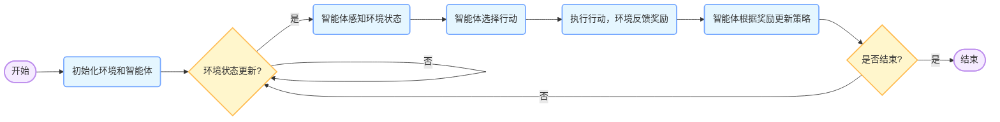

# 多智能体强化学习在股票选择中的应用

> 关键词：多智能体强化学习、股票选择、金融市场、智能决策、深度强化学习

> 摘要：本文深入探讨了多智能体强化学习在股票选择中的应用。首先介绍了相关背景知识，包括研究目的、预期读者等。接着阐述了多智能体强化学习与股票选择的核心概念及联系，详细讲解了核心算法原理和具体操作步骤，给出了相应的数学模型和公式并举例说明。通过项目实战展示了代码的实际案例及详细解释。分析了多智能体强化学习在股票选择中的实际应用场景，推荐了相关的工具和资源。最后总结了未来发展趋势与挑战，提供了常见问题解答和扩展阅读参考资料，旨在为相关领域的研究者和从业者提供全面而深入的技术指导和理论支持。

## 1. 背景介绍 
### 1.1 目的和范围
股票市场作为金融市场的重要组成部分，其复杂性和不确定性给投资者带来了巨大的挑战。传统的股票选择方法往往难以充分考虑市场中的多种因素和动态变化。多智能体强化学习作为一种新兴的人工智能技术，具有在复杂环境中进行智能决策的能力。本研究的目的在于探索多智能体强化学习在股票选择中的应用，通过多个智能体之间的协作和竞争，提高股票选择的准确性和收益率，为投资者提供更有效的决策支持。研究范围涵盖了多智能体强化学习的基本原理、相关算法在股票选择中的实现，以及实际应用案例的分析。

### 1.2 预期读者
本文预期读者包括金融领域的从业者，如股票分析师、投资经理等，他们可以从本文中获取新的股票选择方法和技术思路；人工智能领域的研究者和开发者，能够了解多智能体强化学习在金融领域的具体应用场景和挑战；以及对金融科技和人工智能交叉领域感兴趣的学生和爱好者，为他们提供学习和研究的参考。

### 1.3 文档结构概述
本文首先介绍多智能体强化学习和股票选择的背景知识，包括术语定义和相关概念解释。然后阐述核心概念与联系，通过文本示意图和 Mermaid 流程图展示其原理和架构。接着详细讲解核心算法原理和具体操作步骤，给出 Python 源代码示例。之后介绍数学模型和公式，并举例说明。通过项目实战展示代码的实际应用和详细解释。分析多智能体强化学习在股票选择中的实际应用场景，推荐相关的工具和资源。最后总结未来发展趋势与挑战，提供常见问题解答和扩展阅读参考资料。

### 1.4 术语表
#### 1.4.1 核心术语定义
- **多智能体强化学习（Multi - Agent Reinforcement Learning，MARL）**：是指多个智能体在同一个环境中进行学习和决策，通过智能体之间的交互和协作来优化各自的行为策略，以实现共同或各自的目标。
- **股票选择（Stock Selection）**：是指投资者从众多的股票中挑选出具有投资价值的股票的过程，需要综合考虑多种因素，如公司基本面、市场趋势、行业前景等。
- **智能体（Agent）**：在强化学习中，智能体是能够感知环境状态、采取行动并从环境中获得奖励反馈的实体。
- **状态（State）**：描述环境在某一时刻的特征和信息，智能体根据当前状态来选择行动。
- **行动（Action）**：智能体在某一状态下采取的具体操作，例如买入、卖出或持有股票。
- **奖励（Reward）**：环境根据智能体的行动给予的反馈信号，用于评估行动的好坏，指导智能体学习最优策略。

#### 1.4.2 相关概念解释
- **强化学习（Reinforcement Learning）**：是一种机器学习方法，智能体通过与环境进行交互，不断尝试不同的行动，根据环境给予的奖励来学习最优的行动策略。
- **深度强化学习（Deep Reinforcement Learning）**：结合了深度学习和强化学习的方法，利用深度神经网络来表示智能体的策略和价值函数，能够处理高维的状态和复杂的环境。
- **合作与竞争**：在多智能体强化学习中，智能体之间可能存在合作关系，共同完成一个目标；也可能存在竞争关系，争夺有限的资源或奖励。

#### 1.4.3 缩略词列表
- **MARL**：Multi - Agent Reinforcement Learning（多智能体强化学习）
- **RL**：Reinforcement Learning（强化学习）
- **DRL**：Deep Reinforcement Learning（深度强化学习）

## 2. 核心概念与联系 

### 多智能体强化学习原理
多智能体强化学习的基本原理是多个智能体在同一个环境中进行学习和决策。每个智能体都有自己的状态、行动和奖励函数。智能体通过感知环境状态，选择行动，并根据环境给予的奖励来更新自己的策略。智能体之间的交互可以是合作的，也可以是竞争的。在合作场景中，智能体共同努力实现一个共同的目标；在竞争场景中，智能体争夺有限的资源或奖励。

### 股票选择的核心要素
股票选择需要考虑多个因素，包括公司的基本面信息（如财务报表、盈利能力、市场份额等）、市场的宏观经济环境（如利率、通货膨胀率、GDP 增长率等）、行业的发展趋势（如技术创新、政策支持等）以及股票的技术指标（如价格走势、成交量等）。投资者需要综合分析这些因素，选择具有投资价值的股票。

### 多智能体强化学习与股票选择的联系
在股票选择中，多智能体强化学习可以模拟多个投资者的决策过程。每个智能体可以代表一个投资者或一种投资策略。智能体通过学习市场的状态和其他智能体的行为，选择最优的股票投资组合。智能体之间的合作可以帮助它们更好地应对市场的不确定性，提高投资收益率；竞争则可以促使智能体不断优化自己的策略，提高决策的效率。

### 文本示意图
```plaintext
多智能体强化学习在股票选择中的应用架构

|---------------------- 环境 ----------------------|
| 股票市场（包含各种股票、市场数据、宏观经济环境） |
|--------------------------------------------------|
         ^                          ^
         |                          |
|--------|--------|           |--------|--------|
| 智能体 1（投资策略 1）      | 智能体 2（投资策略 2）      |
| 感知环境状态               | 感知环境状态               |
| 选择行动（买入、卖出、持有） | 选择行动（买入、卖出、持有） |
| 获得奖励（投资收益）       | 获得奖励（投资收益）       |
|---------------------------|---------------------------|
         |                          |
         v                          v
|---------------------- 学习与决策 ----------------------|
| 智能体根据奖励更新策略，与其他智能体交互（合作或竞争） |
|--------------------------------------------------------|
```

### Mermaid 流程图


## 3. 核心算法原理 & 具体操作步骤 

### 核心算法原理
在多智能体强化学习中，常用的算法有深度 Q 网络（Deep Q - Network，DQN）及其扩展算法，如深度双 Q 网络（Double DQN）、优先经验回放 DQN（Prioritized Experience Replay DQN）等。这里以 DQN 为例进行介绍。

DQN 的核心思想是使用深度神经网络来近似值函数 $Q(s, a)$，其中 $s$ 是环境状态，$a$ 是行动。智能体的目标是学习一个最优的策略 $\pi^*$，使得在每个状态 $s$ 下选择的行动 $a$ 能够最大化长期累积奖励。

DQN 通过经验回放机制来解决数据的相关性问题，即智能体将与环境的交互经验 $(s, a, r, s')$ 存储在经验回放缓冲区中，其中 $r$ 是奖励，$s'$ 是下一个状态。在训练时，从经验回放缓冲区中随机采样一批经验进行学习，更新神经网络的参数。

### 具体操作步骤
1. **环境初始化**：初始化股票市场环境，包括股票的初始价格、市场数据、宏观经济环境等。
2. **智能体初始化**：初始化多个智能体，每个智能体有自己的神经网络模型和经验回放缓冲区。
3. **训练循环**：
    - **环境状态更新**：更新股票市场的状态，包括股票价格、成交量等。
    - **智能体感知环境状态**：每个智能体感知当前的环境状态。
    - **智能体选择行动**：根据当前的状态，智能体使用 $\epsilon$-贪心策略选择行动。$\epsilon$-贪心策略以概率 $\epsilon$ 随机选择行动，以概率 $1 - \epsilon$ 选择 $Q$ 值最大的行动。
    - **执行行动，环境反馈奖励**：智能体执行选择的行动，环境根据行动给予奖励，如投资收益。
    - **经验存储**：将智能体的交互经验 $(s, a, r, s')$ 存储在经验回放缓冲区中。
    - **经验回放**：从经验回放缓冲区中随机采样一批经验，计算目标 $Q$ 值和当前 $Q$ 值的误差，使用梯度下降法更新神经网络的参数。
4. **测试阶段**：在训练完成后，使用训练好的智能体进行股票选择，观察投资收益率。

### Python 源代码示例
```python
import numpy as np
import torch
import torch.nn as nn
import torch.optim as optim
import random
from collections import deque

# 定义 DQN 网络
class DQN(nn.Module):
    def __init__(self, input_dim, output_dim):
        super(DQN, self).__init__()
        self.fc1 = nn.Linear(input_dim, 64)
        self.fc2 = nn.Linear(64, 64)
        self.fc3 = nn.Linear(64, output_dim)

    def forward(self, x):
        x = torch.relu(self.fc1(x))
        x = torch.relu(self.fc2(x))
        return self.fc3(x)

# 定义智能体类
class Agent:
    def __init__(self, input_dim, output_dim, lr=0.001, gamma=0.99, epsilon=1.0, epsilon_decay=0.995, epsilon_min=0.01, batch_size=64, memory_size=10000):
        self.input_dim = input_dim
        self.output_dim = output_dim
        self.lr = lr
        self.gamma = gamma
        self.epsilon = epsilon
        self.epsilon_decay = epsilon_decay
        self.epsilon_min = epsilon_min
        self.batch_size = batch_size
        self.memory = deque(maxlen=memory_size)

        self.model = DQN(input_dim, output_dim)
        self.optimizer = optim.Adam(self.model.parameters(), lr=lr)
        self.criterion = nn.MSELoss()

    def remember(self, state, action, reward, next_state, done):
        self.memory.append((state, action, reward, next_state, done))

    def act(self, state):
        if np.random.rand() <= self.epsilon:
            return random.randrange(self.output_dim)
        state = torch.FloatTensor(state).unsqueeze(0)
        q_values = self.model(state)
        action = torch.argmax(q_values).item()
        return action

    def replay(self):
        if len(self.memory) < self.batch_size:
            return
        minibatch = random.sample(self.memory, self.batch_size)
        states, actions, rewards, next_states, dones = zip(*minibatch)

        states = torch.FloatTensor(states)
        actions = torch.LongTensor(actions)
        rewards = torch.FloatTensor(rewards)
        next_states = torch.FloatTensor(next_states)
        dones = torch.FloatTensor(dones)

        q_values = self.model(states)
        next_q_values = self.model(next_states)
        max_next_q_values = torch.max(next_q_values, dim=1)[0]

        target_q_values = q_values.clone()
        for i in range(self.batch_size):
            if dones[i]:
                target_q_values[i][actions[i]] = rewards[i]
            else:
                target_q_values[i][actions[i]] = rewards[i] + self.gamma * max_next_q_values[i]

        self.optimizer.zero_grad()
        loss = self.criterion(q_values, target_q_values)
        loss.backward()
        self.optimizer.step()

        if self.epsilon > self.epsilon_min:
            self.epsilon *= self.epsilon_decay
```

## 4. 数学模型和公式 & 详细讲解 & 举例说明 

### 价值函数
在强化学习中，价值函数用于评估智能体在某个状态下的价值。常见的价值函数有状态价值函数 $V(s)$ 和动作价值函数 $Q(s, a)$。

状态价值函数 $V(s)$ 表示智能体从状态 $s$ 开始，遵循策略 $\pi$ 所能获得的期望累积奖励：
$$V^{\pi}(s) = \mathbb{E}_{\pi}\left[\sum_{t = 0}^{\infty}\gamma^{t}r_{t}\mid s_{0} = s\right]$$
其中，$\gamma \in [0, 1]$ 是折扣因子，用于权衡当前奖励和未来奖励的重要性；$r_{t}$ 是在时间步 $t$ 获得的奖励。

动作价值函数 $Q(s, a)$ 表示智能体在状态 $s$ 下采取动作 $a$，并遵循策略 $\pi$ 所能获得的期望累积奖励：
$$Q^{\pi}(s, a) = \mathbb{E}_{\pi}\left[\sum_{t = 0}^{\infty}\gamma^{t}r_{t}\mid s_{0} = s, a_{0} = a\right]$$

### 贝尔曼方程
贝尔曼方程是强化学习中的核心方程，用于描述价值函数的递归关系。

状态价值函数的贝尔曼方程为：
$$V^{\pi}(s) = \sum_{a}\pi(a\mid s)\sum_{s', r}p(s', r\mid s, a)\left[r + \gamma V^{\pi}(s')\right]$$
其中，$\pi(a\mid s)$ 是策略 $\pi$ 在状态 $s$ 下选择动作 $a$ 的概率；$p(s', r\mid s, a)$ 是在状态 $s$ 下采取动作 $a$ 转移到状态 $s'$ 并获得奖励 $r$ 的概率。

动作价值函数的贝尔曼方程为：
$$Q^{\pi}(s, a) = \sum_{s', r}p(s', r\mid s, a)\left[r + \gamma\sum_{a'}\pi(a'\mid s')Q^{\pi}(s', a')\right]$$

### 最优价值函数和最优策略
最优状态价值函数 $V^*(s)$ 和最优动作价值函数 $Q^*(s, a)$ 分别表示在所有可能的策略中，从状态 $s$ 开始和在状态 $s$ 下采取动作 $a$ 所能获得的最大期望累积奖励：
$$V^*(s) = \max_{\pi}V^{\pi}(s)$$
$$Q^*(s, a) = \max_{\pi}Q^{\pi}(s, a)$$

最优策略 $\pi^*$ 是使得最优价值函数最大化的策略。根据最优动作价值函数，最优策略可以表示为：
$$\pi^*(a\mid s) = \begin{cases}
1, & \text{if } a = \arg\max_{a'}Q^*(s, a') \\
0, & \text{otherwise}
\end{cases}$$

### 举例说明
假设一个简单的股票选择环境，有两种状态：牛市和熊市，三种动作：买入、卖出、持有。智能体在每个时间步获得的奖励是投资收益。

设折扣因子 $\gamma = 0.9$，当前状态 $s$ 是牛市，动作 $a$ 是买入。根据贝尔曼方程，动作价值函数 $Q(s, a)$ 可以表示为：
$$Q(s, a) = p(s_{next} = \text{牛市}, r\mid s = \text{牛市}, a = \text{买入})\left[r + \gamma\max_{a'}Q(s_{next} = \text{牛市}, a')\right] + p(s_{next} = \text{熊市}, r\mid s = \text{牛市}, a = \text{买入})\left[r + \gamma\max_{a'}Q(s_{next} = \text{熊市}, a')\right]$$
其中，$p(s_{next}, r\mid s, a)$ 是状态转移概率和奖励概率。通过计算不同状态和动作的 $Q$ 值，智能体可以选择最优的动作。

## 5. 项目实战：代码实际案例和详细解释说明 

### 5.1  开发环境搭建
- **操作系统**：推荐使用 Linux 或 macOS 系统，也可以使用 Windows 系统。
- **编程语言**：Python 3.7 及以上版本。
- **深度学习框架**：PyTorch 1.7 及以上版本。
- **数据处理库**：NumPy、Pandas 等。
- **绘图库**：Matplotlib 等。

安装所需库的命令如下：
```sh
pip install torch numpy pandas matplotlib
```

### 5.2  源代码详细实现和代码解读
```python
import numpy as np
import torch
import torch.nn as nn
import torch.optim as optim
import random
from collections import deque
import pandas as pd
import matplotlib.pyplot as plt

# 定义 DQN 网络
class DQN(nn.Module):
    def __init__(self, input_dim, output_dim):
        super(DQN, self).__init__()
        self.fc1 = nn.Linear(input_dim, 64)
        self.fc2 = nn.Linear(64, 64)
        self.fc3 = nn.Linear(64, output_dim)

    def forward(self, x):
        x = torch.relu(self.fc1(x))
        x = torch.relu(self.fc2(x))
        return self.fc3(x)

# 定义智能体类
class Agent:
    def __init__(self, input_dim, output_dim, lr=0.001, gamma=0.99, epsilon=1.0, epsilon_decay=0.995, epsilon_min=0.01, batch_size=64, memory_size=10000):
        self.input_dim = input_dim
        self.output_dim = output_dim
        self.lr = lr
        self.gamma = gamma
        self.epsilon = epsilon
        self.epsilon_decay = epsilon_decay
        self.epsilon_min = epsilon_min
        self.batch_size = batch_size
        self.memory = deque(maxlen=memory_size)

        self.model = DQN(input_dim, output_dim)
        self.optimizer = optim.Adam(self.model.parameters(), lr=lr)
        self.criterion = nn.MSELoss()

    def remember(self, state, action, reward, next_state, done):
        self.memory.append((state, action, reward, next_state, done))

    def act(self, state):
        if np.random.rand() <= self.epsilon:
            return random.randrange(self.output_dim)
        state = torch.FloatTensor(state).unsqueeze(0)
        q_values = self.model(state)
        action = torch.argmax(q_values).item()
        return action

    def replay(self):
        if len(self.memory) < self.batch_size:
            return
        minibatch = random.sample(self.memory, self.batch_size)
        states, actions, rewards, next_states, dones = zip(*minibatch)

        states = torch.FloatTensor(states)
        actions = torch.LongTensor(actions)
        rewards = torch.FloatTensor(rewards)
        next_states = torch.FloatTensor(next_states)
        dones = torch.FloatTensor(dones)

        q_values = self.model(states)
        next_q_values = self.model(next_states)
        max_next_q_values = torch.max(next_q_values, dim=1)[0]

        target_q_values = q_values.clone()
        for i in range(self.batch_size):
            if dones[i]:
                target_q_values[i][actions[i]] = rewards[i]
            else:
                target_q_values[i][actions[i]] = rewards[i] + self.gamma * max_next_q_values[i]

        self.optimizer.zero_grad()
        loss = self.criterion(q_values, target_q_values)
        loss.backward()
        self.optimizer.step()

        if self.epsilon > self.epsilon_min:
            self.epsilon *= self.epsilon_decay

# 定义股票市场环境类
class StockMarketEnv:
    def __init__(self, data):
        self.data = data
        self.reset()

    def reset(self):
        self.index = 0
        self.balance = 10000
        self.shares = 0
        state = self._get_state()
        return state

    def step(self, action):
        current_price = self.data[self.index]
        next_price = self.data[self.index + 1] if self.index < len(self.data) - 1 else current_price

        if action == 0:  # 买入
            if self.balance > 0:
                self.shares = self.balance / current_price
                self.balance = 0
        elif action == 1:  # 卖出
            if self.shares > 0:
                self.balance = self.shares * current_price
                self.shares = 0
        else:  # 持有
            pass

        reward = self.balance + self.shares * next_price - (self.balance + self.shares * current_price)
        self.index += 1
        done = self.index >= len(self.data) - 1
        next_state = self._get_state() if not done else None
        return next_state, reward, done

    def _get_state(self):
        price = self.data[self.index]
        balance = self.balance
        shares = self.shares
        return np.array([price, balance, shares])

# 训练函数
def train(agent, env, episodes=100):
    total_rewards = []
    for episode in range(episodes):
        state = env.reset()
        total_reward = 0
        done = False
        while not done:
            action = agent.act(state)
            next_state, reward, done = env.step(action)
            agent.remember(state, action, reward, next_state, done)
            agent.replay()
            state = next_state
            total_reward += reward
        total_rewards.append(total_reward)
        print(f"Episode {episode + 1}: Total Reward = {total_reward}")
    return total_rewards

# 主函数
if __name__ == "__main__":
    # 加载股票数据
    data = pd.read_csv('stock_data.csv')['Close'].values
    env = StockMarketEnv(data)
    input_dim = 3
    output_dim = 3
    agent = Agent(input_dim, output_dim)
    total_rewards = train(agent, env, episodes=100)

    # 绘制训练曲线
    plt.plot(total_rewards)
    plt.xlabel('Episode')
    plt.ylabel('Total Reward')
    plt.title('Training Curve')
    plt.show()
```

### 5.3  代码解读与分析
- **DQN 网络**：定义了一个简单的三层全连接神经网络，用于近似动作价值函数 $Q(s, a)$。
- **智能体类**：实现了智能体的基本功能，包括记忆经验、选择动作、经验回放等。
- **股票市场环境类**：模拟了股票市场的环境，包括初始化环境、执行动作、计算奖励等。
- **训练函数**：在多个回合中训练智能体，每个回合中智能体与环境进行交互，学习最优策略。
- **主函数**：加载股票数据，初始化环境和智能体，调用训练函数进行训练，并绘制训练曲线。

通过训练曲线可以观察智能体的学习过程，随着训练回合的增加，智能体的总奖励逐渐增加，说明智能体在不断学习和优化策略。

## 6. 实际应用场景 
### 投资组合管理
多智能体强化学习可以用于构建投资组合管理系统。每个智能体可以代表一种投资策略，通过学习市场的状态和其他智能体的行为，选择最优的股票投资组合。智能体之间的合作可以帮助它们更好地分散风险，提高投资收益率。

### 量化交易
在量化交易中，多智能体强化学习可以用于实时决策。智能体根据市场的实时数据，如股票价格、成交量等，选择买入、卖出或持有股票的时机。多个智能体可以同时对不同的股票进行交易，提高交易效率和收益率。

### 风险评估
多智能体强化学习可以用于股票市场的风险评估。智能体可以学习市场的风险特征，预测股票价格的波动和市场的不确定性。通过多个智能体的协作，可以更准确地评估风险，为投资者提供风险预警和风险管理建议。

### 市场趋势预测
智能体可以通过学习历史数据和市场信息，预测股票市场的趋势。多个智能体可以从不同的角度和维度进行分析，提高预测的准确性。市场趋势预测可以帮助投资者提前做出决策，把握投资机会。

## 7. 工具和资源推荐
### 7.1 学习资源推荐
#### 7.1.1 书籍推荐
- 《强化学习：原理与Python实现》：系统介绍了强化学习的基本原理和算法，包含大量的Python代码示例，适合初学者入门。
- 《深度强化学习实战》：深入讲解了深度强化学习的理论和实践，包括多智能体强化学习的相关内容，适合有一定基础的读者。
- 《金融机器学习》：结合金融领域的实际问题，介绍了机器学习和强化学习在金融市场中的应用，对多智能体强化学习在股票选择中的应用有很好的参考价值。

#### 7.1.2 在线课程
- Coursera上的“强化学习专项课程”：由知名教授授课，系统全面地介绍了强化学习的理论和实践，包括多智能体强化学习的相关内容。
- edX上的“深度强化学习”：课程内容深入，涵盖了深度强化学习的前沿技术和应用，适合有一定基础的学习者。
- 哔哩哔哩上的一些开源强化学习教程：有很多优秀的UP主分享强化学习的学习经验和代码实现，内容生动易懂，适合初学者学习。

#### 7.1.3 技术博客和网站
- OpenAI博客：发布了很多关于强化学习和人工智能的最新研究成果和技术文章，对多智能体强化学习的发展动态有很好的跟踪和报道。
- Medium上的“强化学习社区”：有很多专业的研究者和开发者分享强化学习的经验和见解，包括多智能体强化学习在不同领域的应用案例。
- 知乎上的“强化学习”话题：有很多关于强化学习的讨论和问答，对初学者和有一定基础的学习者都有很大的帮助。

### 7.2 开发工具框架推荐
#### 7.2.1 IDE和编辑器
- PyCharm：是一款专业的Python集成开发环境，具有代码编辑、调试、版本控制等功能，适合开发Python项目。
- Visual Studio Code：是一款轻量级的代码编辑器，支持多种编程语言和插件扩展，对Python开发也有很好的支持。
- Jupyter Notebook：是一个交互式的开发环境，适合进行数据分析和机器学习实验，方便展示代码和结果。

#### 7.2.2 调试和性能分析工具
- PyTorch Profiler：是PyTorch自带的性能分析工具，可以帮助开发者分析模型的运行时间、内存使用等情况，优化模型性能。
- TensorBoard：是TensorFlow的可视化工具，也可以用于PyTorch项目，帮助开发者可视化训练过程和模型性能。
- cProfile：是Python的内置性能分析工具，可以分析Python代码的运行时间和函数调用情况，帮助开发者找出性能瓶颈。

#### 7.2.3 相关框架和库
- PyTorch：是一个开源的深度学习框架，提供了丰富的神经网络模型和优化算法，对强化学习和多智能体强化学习有很好的支持。
- Stable Baselines3：是一个基于PyTorch的强化学习库，提供了多种预训练的强化学习算法和工具，方便开发者快速实现强化学习项目。
- PettingZoo：是一个用于多智能体强化学习的开源环境库，提供了多种多智能体环境和工具，方便开发者进行多智能体强化学习的研究和实验。

### 7.3 相关论文著作推荐
#### 7.3.1 经典论文
- “Playing Atari with Deep Reinforcement Learning”：首次提出了深度 Q 网络（DQN）算法，开启了深度强化学习的时代。
- “Multi - Agent Actor - Critic for Mixed Cooperative - Competitive Environments”：提出了多智能体演员 - 评论家（Multi - Agent Actor - Critic，MAAC）算法，用于解决多智能体合作和竞争环境中的强化学习问题。
- “Deep Deterministic Policy Gradient”：提出了深度确定性策略梯度（Deep Deterministic Policy Gradient，DDPG）算法，用于解决连续动作空间的强化学习问题。

#### 7.3.2 最新研究成果
- 关注顶级学术会议，如NeurIPS、ICML、AAAI等，这些会议上发表了很多关于多智能体强化学习的最新研究成果。
- 阅读知名学术期刊，如Journal of Artificial Intelligence Research（JAIR）、Artificial Intelligence等，这些期刊上也有很多高质量的多智能体强化学习研究论文。

#### 7.3.3 应用案例分析
- 一些金融科技公司和研究机构会发布多智能体强化学习在股票选择和金融市场中的应用案例分析报告，可以通过它们的官方网站或相关学术数据库获取。
- 一些开源项目和竞赛平台上也有很多多智能体强化学习在金融领域的应用案例，可以参考学习。

## 8. 总结：未来发展趋势与挑战
### 未来发展趋势
- **与其他技术的融合**：多智能体强化学习将与区块链、物联网、大数据等技术深度融合，为股票选择和金融市场带来更多的创新应用。例如，结合区块链技术可以实现更加安全和透明的交易，结合物联网技术可以获取更多的市场实时数据。
- **复杂环境下的应用**：未来的多智能体强化学习将能够处理更加复杂的股票市场环境，包括多个市场的联动、政策变化、突发事件等。智能体将能够更好地适应环境的变化，做出更加准确的决策。
- **可解释性和透明度**：随着人工智能技术的发展，对多智能体强化学习的可解释性和透明度的要求也越来越高。未来的研究将致力于提高多智能体强化学习模型的可解释性，让投资者更好地理解智能体的决策过程和依据。

### 挑战
- **数据质量和隐私问题**：股票市场的数据质量和隐私问题是多智能体强化学习面临的重要挑战。数据的准确性、完整性和时效性直接影响智能体的学习效果。同时，数据的隐私保护也是一个关键问题，需要采取有效的措施来保护投资者的隐私。
- **智能体间的协作与竞争平衡**：在多智能体强化学习中，智能体之间的协作与竞争平衡是一个难题。如何设计合理的奖励机制和通信协议，使得智能体能够在合作的同时保持竞争，提高整体的性能，是未来需要研究的重要方向。
- **计算资源和效率**：多智能体强化学习的训练和推理需要大量的计算资源和时间。如何优化算法和模型结构，提高计算效率，降低计算成本，是多智能体强化学习在实际应用中面临的挑战之一。

## 9. 附录：常见问题与解答
### 多智能体强化学习在股票选择中的准确性如何保证？
多智能体强化学习的准确性受到多种因素的影响，包括数据质量、算法选择、模型结构等。为了保证准确性，可以采取以下措施：
- 收集和整理高质量的股票市场数据，包括历史数据和实时数据。
- 选择合适的多智能体强化学习算法，根据具体问题进行调整和优化。
- 设计合理的模型结构，通过实验和调参来确定最优的模型参数。
- 进行充分的训练和验证，使用交叉验证等方法来评估模型的性能。

### 多智能体强化学习与传统股票选择方法相比有哪些优势？
多智能体强化学习与传统股票选择方法相比，具有以下优势：
- **适应性强**：能够自动适应股票市场的动态变化，根据市场状态实时调整投资策略。
- **智能决策**：通过多个智能体之间的协作和竞争，能够综合考虑多种因素，做出更加智能的决策。
- **学习能力**：具有强大的学习能力，能够从大量的历史数据中学习到市场的规律和模式。
- **优化策略**：不断优化投资策略，提高投资收益率和风险控制能力。

### 多智能体强化学习在实际应用中需要注意哪些问题？
在实际应用中，需要注意以下问题：
- **数据安全和隐私**：保护股票市场数据的安全和隐私，避免数据泄露和滥用。
- **模型的可解释性**：确保多智能体强化学习模型的决策过程和结果是可解释的，让投资者能够理解和信任模型。
- **市场环境的变化**：及时调整模型和策略，以适应市场环境的变化，避免模型的过拟合和失效。
- **风险管理**：建立有效的风险管理机制，控制投资风险，避免因模型错误或市场波动导致的损失。

## 10. 扩展阅读 & 参考资料
### 扩展阅读
- 《人工智能：现代方法》：全面介绍了人工智能的基本概念、算法和应用，对多智能体系统和强化学习有深入的讲解。
- 《Python深度学习》：详细介绍了Python在深度学习中的应用，包括神经网络的构建、训练和优化等内容，对理解多智能体强化学习的代码实现有很大的帮助。
- 《金融数学》：介绍了金融领域的数学模型和方法，对理解股票市场的定价机制和风险评估有重要的参考价值。

### 参考资料
- OpenAI官方文档：https://openai.com/
- PyTorch官方文档：https://pytorch.org/
- Stable Baselines3官方文档：https://stable - baselines3.readthedocs.io/
- PettingZoo官方文档：https://pettingzoo.farama.org/