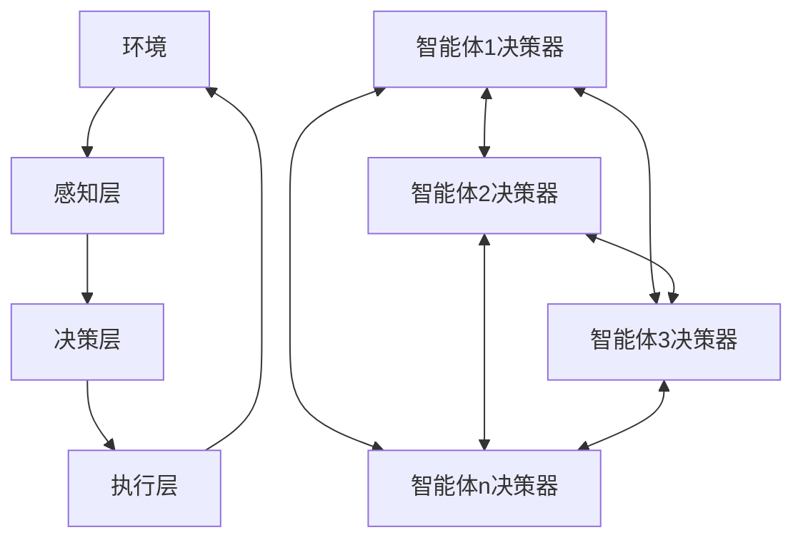

# 多智能体系统在复杂环境中的协作策略

> 关键词：多智能体系统、复杂环境、协作策略、智能体交互、分布式控制

> 摘要：本文聚焦于多智能体系统在复杂环境中的协作策略。随着科技的发展，多智能体系统在诸多领域展现出巨大应用潜力，但复杂环境给其协作带来了诸多挑战。文章首先介绍多智能体系统的背景知识，包括目的、预期读者、文档结构和相关术语。接着阐述核心概念与联系，给出原理和架构示意图及流程图。详细讲解核心算法原理并以Python代码说明具体操作步骤，引入数学模型和公式进行深入分析。通过项目实战展示代码实现和解读，探讨实际应用场景。推荐学习资源、开发工具框架和相关论文著作。最后总结未来发展趋势与挑战，解答常见问题并提供扩展阅读和参考资料，旨在为多智能体系统在复杂环境中的协作研究与应用提供全面且深入的参考。

## 1. 背景介绍 
### 1.1 目的和范围
多智能体系统（Multi - Agent System，MAS）是由多个智能体组成的系统，这些智能体通过交互和协作来完成特定任务。在复杂环境中，如灾难救援场景、城市交通管理、工业自动化生产线等，单个智能体的能力往往有限，需要多个智能体协同工作以实现更高效、更智能的决策和行动。本文的目的在于深入研究多智能体系统在复杂环境中的协作策略，探讨如何设计和优化这些策略，以提高系统的整体性能和适应性。范围涵盖多智能体系统的基本概念、核心算法、数学模型、实际应用案例以及相关的工具和资源等方面。

### 1.2 预期读者
本文预期读者包括对多智能体系统、人工智能、分布式系统等领域感兴趣的研究人员、工程师、学生。对于从事相关领域研究的科研人员，本文提供了深入的理论分析和最新的研究成果；对于工程师，本文包含的实际应用案例和代码实现可以为其在项目开发中提供参考；对于学生，本文有助于他们系统地学习多智能体系统的相关知识和协作策略。

### 1.3 文档结构概述
本文将按照以下结构进行组织：首先介绍多智能体系统的背景知识，包括目的、预期读者、文档结构和相关术语。然后阐述多智能体系统的核心概念与联系，给出原理和架构的文本示意图和Mermaid流程图。接着详细讲解核心算法原理并以Python代码说明具体操作步骤，引入数学模型和公式进行深入分析。通过项目实战展示代码实现和解读，探讨实际应用场景。推荐学习资源、开发工具框架和相关论文著作。最后总结未来发展趋势与挑战，解答常见问题并提供扩展阅读和参考资料。

### 1.4 术语表
#### 1.4.1 核心术语定义
- **多智能体系统（Multi - Agent System，MAS）**：由多个智能体组成的系统，智能体之间通过通信和协作来完成共同的任务。
- **智能体（Agent）**：具有自主性、反应性、社会性和主动性等特性的实体，能够感知环境并根据自身的目标和知识进行决策和行动。
- **复杂环境**：具有不确定性、动态性、多样性等特点的环境，如自然灾害现场、拥挤的城市交通网络等。
- **协作策略**：多智能体系统中智能体之间为了实现共同目标而采用的交互和协调方式。
- **分布式控制**：一种控制方式，系统的控制任务由多个智能体分散执行，通过相互协作实现全局控制目标。

#### 1.4.2 相关概念解释
- **自主性**：智能体能够独立地感知环境、进行决策和行动，不受其他智能体或外部因素的直接控制。
- **反应性**：智能体能够根据当前环境的变化及时做出反应，调整自己的行为。
- **社会性**：智能体能够与其他智能体进行通信和协作，以实现共同的目标。
- **主动性**：智能体能够主动地发起行动，追求自己的目标，而不仅仅是对环境的被动响应。

#### 1.4.3 缩略词列表
- **MAS**：Multi - Agent System（多智能体系统）
- **AI**：Artificial Intelligence（人工智能）
- **RL**：Reinforcement Learning（强化学习）
- **DDPG**：Deep Deterministic Policy Gradient（深度确定性策略梯度）

## 2. 核心概念与联系 
### 核心概念原理
多智能体系统的核心在于多个智能体之间的协作。每个智能体都有自己的感知器、决策器和执行器。感知器用于感知环境信息，决策器根据感知到的信息和自身的目标进行决策，执行器则将决策转化为实际的行动。智能体之间通过通信机制进行信息交换，以协调彼此的行动。

在复杂环境中，智能体面临着诸多挑战，如环境的不确定性、信息的不完全性、其他智能体的行为难以预测等。为了应对这些挑战，需要设计有效的协作策略。协作策略可以分为集中式和分布式两种。集中式协作策略中，有一个中心控制节点负责收集所有智能体的信息并进行全局决策；分布式协作策略中，智能体之间通过局部交互来实现协作，没有中心控制节点。

### 架构的文本示意图
多智能体系统的架构可以分为三层：感知层、决策层和执行层。感知层由各个智能体的感知器组成，负责收集环境信息。决策层由智能体的决策器和通信模块组成，决策器根据感知信息和通信信息进行决策，通信模块用于智能体之间的信息交换。执行层由智能体的执行器组成，负责将决策转化为实际的行动。

```plaintext
+----------------------+
|      环境            |
+----------------------+
         |
         v
+----------------------+
|      感知层          |
|  智能体1感知器       |
|  智能体2感知器       |
|  ...                 |
|  智能体n感知器       |
+----------------------+
         |
         v
+----------------------+
|      决策层          |
|  智能体1决策器       |
|  智能体1通信模块     |
|  智能体2决策器       |
|  智能体2通信模块     |
|  ...                 |
|  智能体n决策器       |
|  智能体n通信模块     |
+----------------------+
         |
         v
+----------------------+
|      执行层          |
|  智能体1执行器       |
|  智能体2执行器       |
|  ...                 |
|  智能体n执行器       |
+----------------------+
         |
         v
+----------------------+
|      环境            |
+----------------------+
```

### Mermaid流程图


## 3. 核心算法原理 & 具体操作步骤 
### 核心算法原理
在多智能体系统中，强化学习是一种常用的算法来实现智能体的协作。强化学习通过智能体与环境的交互，不断地尝试不同的行动，并根据环境反馈的奖励来调整自己的策略，以最大化长期累积奖励。

以深度确定性策略梯度（DDPG）算法为例，DDPG是一种基于Actor - Critic架构的无模型强化学习算法，适用于连续动作空间。在多智能体系统中，每个智能体都有自己的Actor网络和Critic网络。Actor网络用于生成动作，Critic网络用于评估动作的价值。

### 具体操作步骤
1. **初始化**：初始化每个智能体的Actor网络和Critic网络的参数，以及经验回放缓冲区。
2. **智能体与环境交互**：每个智能体根据当前的状态，通过自己的Actor网络生成动作，并执行动作。环境根据智能体的动作给出奖励和下一个状态。
3. **经验存储**：将智能体的状态、动作、奖励、下一个状态等信息存储到经验回放缓冲区中。
4. **样本采样**：从经验回放缓冲区中随机采样一批样本。
5. **Critic网络更新**：根据采样的样本，更新Critic网络的参数，以最小化Critic网络的预测值与目标值之间的误差。
6. **Actor网络更新**：根据更新后的Critic网络，更新Actor网络的参数，以最大化Critic网络对Actor网络生成动作的评估值。
7. **目标网络更新**：软更新目标Actor网络和目标Critic网络的参数。
8. **重复步骤2 - 7**：直到达到训练终止条件。

### Python源代码实现
```python
import numpy as np
import torch
import torch.nn as nn
import torch.optim as optim
import random
from collections import deque

# 定义Actor网络
class Actor(nn.Module):
    def __init__(self, state_dim, action_dim, max_action):
        super(Actor, self).__init__()
        self.fc1 = nn.Linear(state_dim, 400)
        self.fc2 = nn.Linear(400, 300)
        self.fc3 = nn.Linear(300, action_dim)
        self.max_action = max_action

    def forward(self, state):
        x = torch.relu(self.fc1(state))
        x = torch.relu(self.fc2(x))
        x = self.max_action * torch.tanh(self.fc3(x))
        return x

# 定义Critic网络
class Critic(nn.Module):
    def __init__(self, state_dim, action_dim):
        super(Critic, self).__init__()
        self.fc1 = nn.Linear(state_dim + action_dim, 400)
        self.fc2 = nn.Linear(400, 300)
        self.fc3 = nn.Linear(300, 1)

    def forward(self, state, action):
        x = torch.cat([state, action], 1)
        x = torch.relu(self.fc1(x))
        x = torch.relu(self.fc2(x))
        x = self.fc3(x)
        return x

# 定义DDPG智能体
class DDPGAgent:
    def __init__(self, state_dim, action_dim, max_action, gamma=0.99, tau=0.005):
        self.actor = Actor(state_dim, action_dim, max_action)
        self.actor_target = Actor(state_dim, action_dim, max_action)
        self.actor_target.load_state_dict(self.actor.state_dict())
        self.actor_optimizer = optim.Adam(self.actor.parameters(), lr=1e-4)

        self.critic = Critic(state_dim, action_dim)
        self.critic_target = Critic(state_dim, action_dim)
        self.critic_target.load_state_dict(self.critic.state_dict())
        self.critic_optimizer = optim.Adam(self.critic.parameters(), lr=1e-3)

        self.gamma = gamma
        self.tau = tau
        self.max_action = max_action
        self.replay_buffer = deque(maxlen=1000000)

    def select_action(self, state):
        state = torch.FloatTensor(state.reshape(1, -1))
        return self.actor(state).cpu().data.numpy().flatten()

    def train(self, batch_size=64):
        if len(self.replay_buffer) < batch_size:
            return

        batch = random.sample(self.replay_buffer, batch_size)
        state_batch, action_batch, next_state_batch, reward_batch, done_batch = zip(*batch)

        state_batch = torch.FloatTensor(state_batch)
        action_batch = torch.FloatTensor(action_batch)
        next_state_batch = torch.FloatTensor(next_state_batch)
        reward_batch = torch.FloatTensor(reward_batch).unsqueeze(1)
        done_batch = torch.FloatTensor(done_batch).unsqueeze(1)

        # 计算目标Q值
        next_actions = self.actor_target(next_state_batch)
        target_q = self.critic_target(next_state_batch, next_actions)
        target_q = reward_batch + ((1 - done_batch) * self.gamma * target_q).detach()

        # 更新Critic网络
        current_q = self.critic(state_batch, action_batch)
        critic_loss = nn.MSELoss()(current_q, target_q)
        self.critic_optimizer.zero_grad()
        critic_loss.backward()
        self.critic_optimizer.step()

        # 更新Actor网络
        actor_loss = -self.critic(state_batch, self.actor(state_batch)).mean()
        self.actor_optimizer.zero_grad()
        actor_loss.backward()
        self.actor_optimizer.step()

        # 软更新目标网络
        for param, target_param in zip(self.actor.parameters(), self.actor_target.parameters()):
            target_param.data.copy_(self.tau * param.data + (1 - self.tau) * target_param.data)

        for param, target_param in zip(self.critic.parameters(), self.critic_target.parameters()):
            target_param.data.copy_(self.tau * param.data + (1 - self.tau) * target_param.data)

    def add_to_replay_buffer(self, state, action, next_state, reward, done):
        self.replay_buffer.append((state, action, next_state, reward, done))
```

## 4. 数学模型和公式 & 详细讲解 & 举例说明 
### 数学模型
在多智能体系统中，每个智能体的目标是最大化自己的长期累积奖励。设智能体 $i$ 在时间步 $t$ 的状态为 $s_{i,t}$，动作是 $a_{i,t}$，奖励为 $r_{i,t}$。智能体 $i$ 的长期累积奖励可以表示为：

$$R_{i,t}=\sum_{k = 0}^{\infty}\gamma^{k}r_{i,t + k}$$

其中 $\gamma \in [0, 1]$ 是折扣因子，用于平衡短期奖励和长期奖励。

### 详细讲解
在DDPG算法中，Actor网络的目标是学习一个策略 $\mu_{\theta}(s)$，使得Critic网络对该策略生成动作的评估值最大。Critic网络的目标是学习一个Q值函数 $Q_{\phi}(s, a)$，用于评估状态 $s$ 下动作 $a$ 的价值。

Actor网络的更新公式为：

$$\nabla_{\theta}J(\theta)=\mathbb{E}_{s \sim \mathcal{D}}[\nabla_{a}Q_{\phi}(s, a)|_{a = \mu_{\theta}(s)}\nabla_{\theta}\mu_{\theta}(s)]$$

其中 $\mathcal{D}$ 是经验回放缓冲区，$\theta$ 是Actor网络的参数，$\phi$ 是Critic网络的参数。

Critic网络的更新公式为：

$$L(\phi)=\mathbb{E}_{(s, a, r, s') \sim \mathcal{D}}[(Q_{\phi}(s, a)-(r+\gamma Q_{\phi'}(s', \mu_{\theta'}(s'))))^{2}]$$

其中 $\phi'$ 和 $\theta'$ 分别是目标Critic网络和目标Actor网络的参数。

### 举例说明
假设一个多智能体系统中有两个智能体，每个智能体的状态维度为3，动作维度为2。环境的奖励函数根据智能体的动作和状态来计算。智能体通过DDPG算法进行训练，在每个时间步，智能体根据当前状态选择动作，执行动作后得到奖励和下一个状态。将这些信息存储到经验回放缓冲区中，然后从缓冲区中采样一批样本，根据上述公式更新Actor网络和Critic网络的参数。

例如，在某一时刻，智能体1的状态 $s_{1}=[0.1, 0.2, 0.3]$，通过Actor网络生成动作 $a_{1}=[0.4, 0.5]$。执行动作后，环境给出奖励 $r_{1}=0.6$，下一个状态 $s_{1}'=[0.7, 0.8, 0.9]$。将 $(s_{1}, a_{1}, r_{1}, s_{1}')$ 存储到经验回放缓冲区中。当进行训练时，从缓冲区中采样一批样本，根据公式计算Actor网络和Critic网络的损失，并更新网络参数。

## 5. 项目实战：代码实际案例和详细解释说明 
### 5.1  开发环境搭建
1. **安装Python**：确保系统中安装了Python 3.6及以上版本。可以从Python官方网站（https://www.python.org/downloads/）下载并安装。
2. **安装深度学习框架**：使用PyTorch作为深度学习框架。可以通过以下命令安装：
```bash
pip install torch torchvision
```
3. **安装其他依赖库**：安装`numpy`、`random`等常用库：
```bash
pip install numpy
```

### 5.2  源代码详细实现和代码解读
```python
import numpy as np
import torch
import torch.nn as nn
import torch.optim as optim
import random
from collections import deque

# 定义Actor网络
class Actor(nn.Module):
    def __init__(self, state_dim, action_dim, max_action):
        super(Actor, self).__init__()
        self.fc1 = nn.Linear(state_dim, 400)
        self.fc2 = nn.Linear(400, 300)
        self.fc3 = nn.Linear(300, action_dim)
        self.max_action = max_action

    def forward(self, state):
        x = torch.relu(self.fc1(state))
        x = torch.relu(self.fc2(x))
        x = self.max_action * torch.tanh(self.fc3(x))
        return x

# 定义Critic网络
class Critic(nn.Module):
    def __init__(self, state_dim, action_dim):
        super(Critic, self).__init__()
        self.fc1 = nn.Linear(state_dim + action_dim, 400)
        self.fc2 = nn.Linear(400, 300)
        self.fc3 = nn.Linear(300, 1)

    def forward(self, state, action):
        x = torch.cat([state, action], 1)
        x = torch.relu(self.fc1(x))
        x = torch.relu(self.fc2(x))
        x = self.fc3(x)
        return x

# 定义DDPG智能体
class DDPGAgent:
    def __init__(self, state_dim, action_dim, max_action, gamma=0.99, tau=0.005):
        self.actor = Actor(state_dim, action_dim, max_action)
        self.actor_target = Actor(state_dim, action_dim, max_action)
        self.actor_target.load_state_dict(self.actor.state_dict())
        self.actor_optimizer = optim.Adam(self.actor.parameters(), lr=1e-4)

        self.critic = Critic(state_dim, action_dim)
        self.critic_target = Critic(state_dim, action_dim)
        self.critic_target.load_state_dict(self.critic.state_dict())
        self.critic_optimizer = optim.Adam(self.critic.parameters(), lr=1e-3)

        self.gamma = gamma
        self.tau = tau
        self.max_action = max_action
        self.replay_buffer = deque(maxlen=1000000)

    def select_action(self, state):
        state = torch.FloatTensor(state.reshape(1, -1))
        return self.actor(state).cpu().data.numpy().flatten()

    def train(self, batch_size=64):
        if len(self.replay_buffer) < batch_size:
            return

        batch = random.sample(self.replay_buffer, batch_size)
        state_batch, action_batch, next_state_batch, reward_batch, done_batch = zip(*batch)

        state_batch = torch.FloatTensor(state_batch)
        action_batch = torch.FloatTensor(action_batch)
        next_state_batch = torch.FloatTensor(next_state_batch)
        reward_batch = torch.FloatTensor(reward_batch).unsqueeze(1)
        done_batch = torch.FloatTensor(done_batch).unsqueeze(1)

        # 计算目标Q值
        next_actions = self.actor_target(next_state_batch)
        target_q = self.critic_target(next_state_batch, next_actions)
        target_q = reward_batch + ((1 - done_batch) * self.gamma * target_q).detach()

        # 更新Critic网络
        current_q = self.critic(state_batch, action_batch)
        critic_loss = nn.MSELoss()(current_q, target_q)
        self.critic_optimizer.zero_grad()
        critic_loss.backward()
        self.critic_optimizer.step()

        # 更新Actor网络
        actor_loss = -self.critic(state_batch, self.actor(state_batch)).mean()
        self.actor_optimizer.zero_grad()
        actor_loss.backward()
        self.actor_optimizer.step()

        # 软更新目标网络
        for param, target_param in zip(self.actor.parameters(), self.actor_target.parameters()):
            target_param.data.copy_(self.tau * param.data + (1 - self.tau) * target_param.data)

        for param, target_param in zip(self.critic.parameters(), self.critic_target.parameters()):
            target_param.data.copy_(self.tau * param.data + (1 - self.tau) * target_param.data)

    def add_to_replay_buffer(self, state, action, next_state, reward, done):
        self.replay_buffer.append((state, action, next_state, reward, done))

# 模拟环境
class SimpleEnvironment:
    def __init__(self):
        self.state_dim = 3
        self.action_dim = 2
        self.max_action = 1.0

    def reset(self):
        return np.random.rand(self.state_dim)

    def step(self, action):
        next_state = np.random.rand(self.state_dim)
        reward = np.sum(action)
        done = False
        return next_state, reward, done

# 主训练循环
if __name__ == "__main__":
    env = SimpleEnvironment()
    agent = DDPGAgent(env.state_dim, env.action_dim, env.max_action)

    num_episodes = 1000
    for episode in range(num_episodes):
        state = env.reset()
        episode_reward = 0
        done = False
        while not done:
            action = agent.select_action(state)
            next_state, reward, done = env.step(action)
            agent.add_to_replay_buffer(state, action, next_state, reward, done)
            agent.train()
            state = next_state
            episode_reward += reward
        print(f"Episode {episode}: Reward = {episode_reward}")
```

### 5.3  代码解读与分析
1. **Actor网络**：`Actor`类定义了Actor网络的结构，它接受状态作为输入，输出动作。网络由三个全连接层组成，最后一层使用`tanh`激活函数将动作值限制在 $[-1, 1]$ 范围内。
2. **Critic网络**：`Critic`类定义了Critic网络的结构，它接受状态和动作作为输入，输出Q值。网络同样由三个全连接层组成。
3. **DDPG智能体**：`DDPGAgent`类实现了DDPG算法的主要逻辑，包括动作选择、训练和经验回放等功能。
4. **模拟环境**：`SimpleEnvironment`类模拟了一个简单的环境，包含状态维度、动作维度和最大动作值等信息，提供了`reset`和`step`方法。
5. **主训练循环**：在主训练循环中，智能体与环境进行交互，收集经验并进行训练。每个回合结束后，打印该回合的总奖励。

## 6. 实际应用场景 
### 灾难救援场景
在灾难救援场景中，多智能体系统可以由多个无人机、机器人等组成。无人机可以用于空中侦察，获取灾区的地形、建筑物损坏情况等信息；机器人可以进入危险区域进行搜索和救援工作。这些智能体通过协作策略，如信息共享、任务分配等，提高救援效率。例如，无人机将侦察到的信息实时传递给机器人，机器人根据这些信息规划最佳的救援路径。

### 城市交通管理
在城市交通管理中，多智能体系统可以由交通信号灯、自动驾驶车辆等组成。交通信号灯可以根据实时交通流量调整信号时间，自动驾驶车辆可以根据其他车辆的行驶状态和交通信号灯的指示调整自己的行驶速度和路线。通过协作策略，如分布式控制、协同决策等，可以缓解交通拥堵，提高交通效率。

### 工业自动化生产线
在工业自动化生产线中，多智能体系统可以由多个机器人、传感器等组成。机器人负责执行各种生产任务，传感器负责监测生产过程中的各种参数。智能体之间通过协作策略，如任务调度、资源分配等，实现生产线的高效运行。例如，当某个机器人出现故障时，其他机器人可以自动调整任务，确保生产线的正常运转。

## 7. 工具和资源推荐
### 7.1 学习资源推荐
#### 7.1.1 书籍推荐
- 《Multi - Agent Systems: Algorithmic, Game - Theoretic, and Logical Foundations》：这本书全面介绍了多智能体系统的理论基础，包括算法、博弈论和逻辑等方面的内容。
- 《Reinforcement Learning: An Introduction》：这本书是强化学习领域的经典教材，详细介绍了强化学习的基本概念、算法和应用。

#### 7.1.2 在线课程
- Coursera上的“Multi - Agent Artificial Intelligence”课程：该课程由知名教授授课，深入讲解多智能体系统的相关知识。
- Udemy上的“Reinforcement Learning A - Z™: Hands - On Artificial Intelligence”课程：该课程通过实践项目，帮助学习者掌握强化学习的实际应用。

#### 7.1.3 技术博客和网站
- Medium上的“Towards Data Science”：该博客上有很多关于多智能体系统和强化学习的技术文章，涵盖了最新的研究成果和实践经验。
- OpenAI的官方网站：OpenAI是人工智能领域的领先研究机构，其网站上提供了很多关于强化学习和多智能体系统的研究论文和开源代码。

### 7.2 开发工具框架推荐
#### 7.2.1 IDE和编辑器
- PyCharm：一款功能强大的Python集成开发环境，提供了代码编辑、调试、版本控制等功能，非常适合多智能体系统的开发。
- Visual Studio Code：一款轻量级的代码编辑器，支持多种编程语言和插件扩展，可用于快速开发和调试多智能体系统。

#### 7.2.2 调试和性能分析工具
- TensorBoard：一个可视化工具，可用于可视化多智能体系统训练过程中的各种指标，如损失函数、奖励曲线等，帮助开发者分析模型的性能。
- PyTorch Profiler：PyTorch提供的性能分析工具，可用于分析代码的性能瓶颈，优化多智能体系统的训练效率。

#### 7.2.3 相关框架和库
- OpenAI Gym：一个开源的强化学习环境库，提供了多种模拟环境，可用于测试和验证多智能体系统的算法。
- Stable Baselines3：一个基于PyTorch的强化学习库，提供了多种预训练的强化学习算法，可用于快速实现多智能体系统的训练。

### 7.3 相关论文著作推荐
#### 7.3.1 经典论文
- “Multi - Agent Reinforcement Learning: A Selective Overview of Theories and Algorithms”：这篇论文对多智能体强化学习的理论和算法进行了全面的综述，是多智能体强化学习领域的经典文献。
- “Deep Deterministic Policy Gradient”：这篇论文提出了深度确定性策略梯度算法，为连续动作空间的强化学习提供了一种有效的解决方案。

#### 7.3.2 最新研究成果
- 关注《Journal of Artificial Intelligence Research》、《Artificial Intelligence》等顶级期刊，这些期刊上发表了很多关于多智能体系统的最新研究成果。
- 参加国际人工智能会议，如IJCAI、AAAI等，这些会议上展示了多智能体系统领域的最新研究进展。

#### 7.3.3 应用案例分析
- 研究一些实际应用案例，如灾难救援、城市交通管理等领域的多智能体系统应用案例，了解多智能体系统在实际场景中的应用方法和挑战。

## 8. 总结：未来发展趋势与挑战
### 未来发展趋势
1. **与其他技术的融合**：多智能体系统将与区块链、物联网、大数据等技术深度融合，实现更加高效、安全、智能的协作。例如，区块链技术可以提供可信的信息共享和交易机制，物联网技术可以提供更丰富的环境感知数据。
2. **自适应协作策略**：智能体将能够根据环境的变化和任务的需求，自适应地调整协作策略，提高系统的灵活性和适应性。
3. **群体智能的发展**：多智能体系统将更加注重群体智能的发展，通过智能体之间的协作和竞争，涌现出更高层次的智能行为，如群体决策、群体优化等。

### 挑战
1. **通信与协调问题**：在复杂环境中，智能体之间的通信可能受到干扰或延迟，导致信息传递不及时或不准确，影响协作效果。如何设计高效的通信和协调机制是一个挑战。
2. **智能体的自主性与协作性平衡**：智能体需要在保持自主性的同时，与其他智能体进行有效的协作。如何平衡智能体的自主性和协作性，避免出现智能体之间的冲突和不协调，是一个需要解决的问题。
3. **安全与隐私问题**：多智能体系统在信息共享和协作过程中，可能涉及到安全和隐私问题。如何保证智能体之间的通信安全和数据隐私，是一个重要的挑战。

## 9. 附录：常见问题与解答
### 问题1：多智能体系统与传统的分布式系统有什么区别？
解答：多智能体系统强调智能体的自主性、反应性、社会性和主动性等特性，智能体能够根据自身的目标和知识进行决策和行动。而传统的分布式系统主要关注系统的分布式计算和通信，各个节点的行为通常是由中央控制节点或预先设定的规则来决定的。

### 问题2：如何选择合适的协作策略？
解答：选择合适的协作策略需要考虑多个因素，如环境的复杂性、智能体的数量和类型、任务的要求等。一般来说，对于简单的环境和任务，可以采用集中式协作策略；对于复杂的环境和任务，分布式协作策略可能更加合适。同时，还可以根据实际情况结合多种协作策略。

### 问题3：多智能体系统的训练时间通常较长，如何提高训练效率？
解答：可以采用以下方法提高多智能体系统的训练效率：
1. **使用并行计算**：利用GPU或分布式计算平台，加速模型的训练过程。
2. **优化算法**：选择合适的强化学习算法，并对算法进行优化，如调整学习率、批量大小等超参数。
3. **使用经验回放**：经验回放可以增加样本的利用率，减少训练的方差，提高训练效率。

## 10. 扩展阅读 & 参考资料
### 扩展阅读
- 《Swarm Intelligence》：这本书介绍了群体智能的相关知识，群体智能与多智能体系统有很多相似之处，可以为多智能体系统的研究提供新的思路。
- 《Game Theory for Artificial Intelligence》：博弈论在多智能体系统中有着广泛的应用，这本书可以帮助读者深入理解博弈论在多智能体系统中的应用原理。

### 参考资料
1. Wooldridge, M. (2009). An Introduction to MultiAgent Systems. John Wiley & Sons.
2. Sutton, R. S., & Barto, A. G. (2018). Reinforcement Learning: An Introduction. MIT Press.
3. Lillicrap, T. P., et al. (2015). Continuous control with deep reinforcement learning. arXiv preprint arXiv:1509.02971.