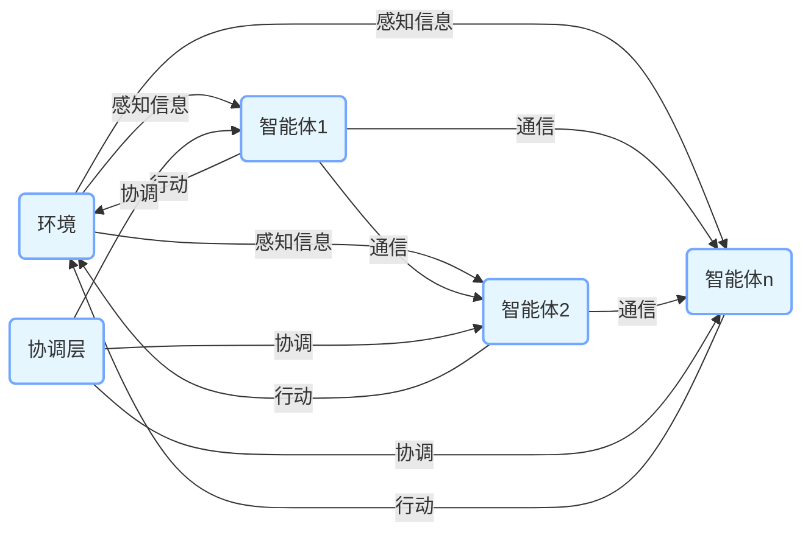

# 多智能体系统在评估无形资产和品牌价值中的应用

> 关键词：多智能体系统、无形资产评估、品牌价值评估、人工智能、决策模型

> 摘要：本文深入探讨了多智能体系统在评估无形资产和品牌价值中的应用。首先介绍了相关背景，包括目的、预期读者等内容。接着阐述了多智能体系统、无形资产和品牌价值的核心概念及其联系，并给出相应的文本示意图和 Mermaid 流程图。详细讲解了多智能体系统用于评估的核心算法原理及具体操作步骤，配以 Python 源代码说明。还分析了相关的数学模型和公式，并举例说明。通过项目实战展示了代码实际案例及详细解释。探讨了多智能体系统在评估无形资产和品牌价值中的实际应用场景，推荐了相关的学习资源、开发工具框架和论文著作。最后总结了未来发展趋势与挑战，提供了常见问题与解答以及扩展阅读和参考资料，旨在为该领域的研究和实践提供全面而深入的指导。

## 1. 背景介绍 
### 1.1 目的和范围
在当今知识经济时代，无形资产和品牌价值在企业的资产结构中占据着越来越重要的地位。准确评估无形资产和品牌价值对于企业的战略决策、财务报告、并购重组等活动具有关键意义。然而，传统的评估方法往往存在主观性强、难以全面考虑复杂因素等局限性。多智能体系统作为一种新兴的人工智能技术，具有分布式、自主性、交互性等特点，能够模拟复杂的市场环境和利益相关者的行为，为无形资产和品牌价值的评估提供了新的思路和方法。

本文的范围涵盖了多智能体系统的基本原理、在无形资产和品牌价值评估中的应用机制、相关算法和数学模型，以及实际案例分析等方面。旨在全面介绍多智能体系统在该领域的应用，为研究人员和从业者提供理论和实践的参考。

### 1.2 预期读者
本文预期读者包括从事资产评估、财务管理、市场营销、人工智能等领域的研究人员、学者，以及企业的管理人员、财务人员、品牌管理人员等。对于对多智能体系统和无形资产评估感兴趣的爱好者，本文也具有一定的参考价值。

### 1.3 文档结构概述
本文共分为十个部分。第一部分为背景介绍，阐述了研究的目的、范围、预期读者和文档结构概述，并对相关术语进行了定义和解释。第二部分介绍了多智能体系统、无形资产和品牌价值的核心概念及其联系，给出了文本示意图和 Mermaid 流程图。第三部分详细讲解了多智能体系统用于评估的核心算法原理及具体操作步骤，配以 Python 源代码说明。第四部分分析了相关的数学模型和公式，并举例说明。第五部分通过项目实战展示了代码实际案例及详细解释。第六部分探讨了多智能体系统在评估无形资产和品牌价值中的实际应用场景。第七部分推荐了相关的学习资源、开发工具框架和论文著作。第八部分总结了未来发展趋势与挑战。第九部分提供了常见问题与解答。第十部分为扩展阅读和参考资料。

### 1.4 术语表
#### 1.4.1 核心术语定义
- **多智能体系统（Multi - Agent System，MAS）**：由多个自主的智能体组成的系统，这些智能体可以感知环境、进行决策和行动，并通过交互来实现系统的整体目标。
- **无形资产**：企业拥有或者控制的没有实物形态的可辨认非货币性资产，如专利权、商标权、著作权、土地使用权等。
- **品牌价值**：品牌所具有的经济价值，是品牌在市场中所获得的认可和信任程度的体现，它反映了品牌在消费者心目中的地位和影响力。

#### 1.4.2 相关概念解释
- **智能体（Agent）**：具有自主性、反应性、社会性和主动性等特征的实体，能够在一定的环境中独立地完成任务或与其他智能体进行协作。
- **分布式系统**：将一个任务或问题分解为多个子任务，由多个节点或智能体并行处理的系统，具有高效、灵活等优点。
- **效用函数**：用于衡量智能体在不同决策下的收益或满意度的函数，是智能体进行决策的重要依据。

#### 1.4.3 缩略词列表
- MAS：Multi - Agent System（多智能体系统）
- AI：Artificial Intelligence（人工智能）

## 2. 核心概念与联系 

### 多智能体系统原理
多智能体系统由多个智能体组成，每个智能体具有自己的目标、知识和能力。智能体通过感知环境获取信息，根据自身的决策机制进行决策，并采取相应的行动。智能体之间可以通过通信进行交互，协作完成系统的整体目标。

多智能体系统的架构通常包括智能体层、通信层和协调层。智能体层包含多个智能体，每个智能体负责特定的任务。通信层负责智能体之间的信息传递，协调层则负责协调智能体的行为，避免冲突，提高系统的效率。

文本示意图：
多智能体系统由多个智能体构成，这些智能体分布在不同的环境中。每个智能体包含感知模块、决策模块和行动模块。感知模块用于获取环境信息，决策模块根据感知信息和自身的目标进行决策，行动模块执行决策结果。智能体之间通过通信通道进行信息交互，协调层对智能体的行为进行协调和管理。

Mermaid 流程图：


### 无形资产和品牌价值概念
无形资产是企业重要的资产组成部分，它虽然没有实物形态，但具有巨大的经济价值。无形资产的价值来源于其能够为企业带来未来经济利益，如通过技术创新提高生产效率、通过品牌优势增加市场份额等。

品牌价值是无形资产的重要组成部分，它是品牌在市场中所具有的影响力和价值。品牌价值的形成与品牌的知名度、美誉度、忠诚度等因素密切相关。一个具有高品牌价值的品牌能够吸引消费者，提高产品或服务的附加值，为企业带来更高的利润。

### 多智能体系统与无形资产和品牌价值评估的联系
多智能体系统可以模拟市场环境中不同利益相关者的行为，如消费者、竞争对手、供应商等。通过智能体之间的交互和决策，可以综合考虑多种因素对无形资产和品牌价值的影响。例如，消费者智能体可以根据品牌的知名度、美誉度等因素进行购买决策，竞争对手智能体可以根据市场情况进行竞争策略调整，这些行为都会影响品牌的市场表现和价值。

多智能体系统还可以对无形资产和品牌价值进行动态评估。随着市场环境的变化，无形资产和品牌价值也会发生变化。多智能体系统可以实时感知环境变化，调整智能体的行为和决策，从而实现对无形资产和品牌价值的动态评估。

## 3. 核心算法原理 & 具体操作步骤 

### 核心算法原理
多智能体系统在评估无形资产和品牌价值中常用的算法包括强化学习算法、博弈论算法等。这里以强化学习算法为例进行讲解。

强化学习是一种通过智能体与环境进行交互，不断学习最优策略以最大化累积奖励的机器学习方法。在多智能体系统中，每个智能体可以看作是一个强化学习智能体，通过与环境和其他智能体的交互来学习最优的决策策略。

强化学习智能体的核心是其决策机制，通常基于价值函数或策略函数。价值函数用于估计智能体在某个状态下采取某个行动的价值，策略函数则直接输出智能体在某个状态下应该采取的行动。

### Python 源代码实现
以下是一个简单的基于 Q - learning 算法的多智能体强化学习示例，用于模拟智能体在评估品牌价值中的决策过程。

```python
import numpy as np

# 定义智能体类
class Agent:
    def __init__(self, num_states, num_actions, learning_rate=0.1, discount_factor=0.9):
        self.num_states = num_states
        self.num_actions = num_actions
        self.learning_rate = learning_rate
        self.discount_factor = discount_factor
        self.q_table = np.zeros((num_states, num_actions))

    def choose_action(self, state, epsilon=0.1):
        if np.random.uniform(0, 1) < epsilon:
            # 探索：随机选择一个动作
            action = np.random.choice(self.num_actions)
        else:
            # 利用：选择 Q 值最大的动作
            action = np.argmax(self.q_table[state, :])
        return action

    def update_q_table(self, state, action, reward, next_state):
        # Q - learning 更新公式
        max_q_next = np.max(self.q_table[next_state, :])
        self.q_table[state, action] += self.learning_rate * (reward + self.discount_factor * max_q_next - self.q_table[state, action])

# 模拟环境
class Environment:
    def __init__(self, num_states):
        self.num_states = num_states
        self.current_state = np.random.randint(0, num_states)

    def step(self, action):
        # 简单模拟状态转移和奖励
        next_state = (self.current_state + action) % self.num_states
        if next_state == 0:
            reward = 10
        else:
            reward = -1
        self.current_state = next_state
        return next_state, reward

# 主程序
if __name__ == "__main__":
    num_states = 10
    num_actions = 2
    num_episodes = 1000

    agent = Agent(num_states, num_actions)
    env = Environment(num_states)

    for episode in range(num_episodes):
        state = env.current_state
        total_reward = 0
        for _ in range(100):
            action = agent.choose_action(state)
            next_state, reward = env.step(action)
            agent.update_q_table(state, action, reward, next_state)
            state = next_state
            total_reward += reward
        print(f"Episode {episode}: Total Reward = {total_reward}")
```

### 具体操作步骤
1. **定义智能体和环境**：确定智能体的状态空间、动作空间、学习率、折扣因子等参数，定义环境的状态转移规则和奖励函数。
2. **初始化 Q 表**：智能体的 Q 表初始化为全零矩阵。
3. **进行训练**：在每个训练周期中，智能体根据当前状态选择动作，与环境进行交互，获取下一个状态和奖励，并更新 Q 表。
4. **评估策略**：训练完成后，根据 Q 表选择最优策略，用于评估无形资产和品牌价值。

## 4. 数学模型和公式 & 详细讲解 & 举例说明 

### 强化学习数学模型
强化学习的数学模型可以用马尔可夫决策过程（Markov Decision Process，MDP）来描述。MDP 由一个四元组 $(S, A, P, R)$ 组成，其中：
- $S$ 是状态空间，表示智能体可能处于的所有状态。
- $A$ 是动作空间，表示智能体可以采取的所有动作。
- $P(s'|s, a)$ 是状态转移概率，表示智能体在状态 $s$ 采取动作 $a$ 后转移到状态 $s'$ 的概率。
- $R(s, a, s')$ 是奖励函数，表示智能体在状态 $s$ 采取动作 $a$ 转移到状态 $s'$ 时获得的奖励。

### Q - learning 算法公式
Q - learning 算法是一种基于价值函数的强化学习算法，其目标是学习一个最优的 Q 函数 $Q^*(s, a)$，表示在状态 $s$ 采取动作 $a$ 的最大期望累积奖励。Q - learning 算法的更新公式为：
$$Q(s, a) \leftarrow Q(s, a) + \alpha [R(s, a, s') + \gamma \max_{a'} Q(s', a') - Q(s, a)]$$
其中：
- $Q(s, a)$ 是当前状态 $s$ 和动作 $a$ 的 Q 值。
- $\alpha$ 是学习率，控制每次更新的步长。
- $R(s, a, s')$ 是智能体在状态 $s$ 采取动作 $a$ 转移到状态 $s'$ 时获得的奖励。
- $\gamma$ 是折扣因子，用于权衡当前奖励和未来奖励的重要性。
- $\max_{a'} Q(s', a')$ 是下一个状态 $s'$ 下所有动作的最大 Q 值。

### 举例说明
假设一个简单的品牌价值评估场景，智能体的状态空间 $S = \{s_1, s_2, s_3\}$ 表示品牌的不同知名度等级，动作空间 $A = \{a_1, a_2\}$ 表示两种不同的营销策略。状态转移概率和奖励函数如下：

| $s$ | $a$ | $s'$ | $P(s'|s, a)$ | $R(s, a, s')$ |
|---|---|---|---|---|
| $s_1$ | $a_1$ | $s_2$ | 0.8 | 10 |
| $s_1$ | $a_1$ | $s_3$ | 0.2 | -5 |
| $s_1$ | $a_2$ | $s_2$ | 0.3 | 5 |
| $s_1$ | $a_2$ | $s_3$ | 0.7 | -2 |

初始时，$Q$ 表全为零。假设智能体在状态 $s_1$ 选择动作 $a_1$，转移到状态 $s_2$，获得奖励 10。学习率 $\alpha = 0.1$，折扣因子 $\gamma = 0.9$。根据 Q - learning 算法更新公式：
$$Q(s_1, a_1) \leftarrow Q(s_1, a_1) + 0.1 [10 + 0.9 \max_{a'} Q(s_2, a') - Q(s_1, a_1)]$$
由于 $Q(s_2, a')$ 初始为零，所以：
$$Q(s_1, a_1) \leftarrow 0 + 0.1 [10 + 0.9 \times 0 - 0] = 1$$

## 5. 项目实战：代码实际案例和详细解释说明 

### 5.1  开发环境搭建
- **Python 安装**：确保系统中安装了 Python 3.x 版本，可以从 Python 官方网站（https://www.python.org/downloads/） 下载并安装。
- **开发工具**：推荐使用 PyCharm 作为开发工具，它具有强大的代码编辑、调试和自动补全功能。可以从 JetBrains 官方网站（https://www.jetbrains.com/pycharm/download/） 下载并安装。
- **依赖库安装**：在项目中需要使用 numpy 库，打开命令行工具，执行以下命令安装：
```sh
pip install numpy
```

### 5.2  源代码详细实现和代码解读
以下是一个完整的多智能体系统用于评估品牌价值的项目代码示例：

```python
import numpy as np
import random

# 定义智能体类
class BrandAgent:
    def __init__(self, num_states, num_actions, learning_rate=0.1, discount_factor=0.9):
        self.num_states = num_states
        self.num_actions = num_actions
        self.learning_rate = learning_rate
        self.discount_factor = discount_factor
        self.q_table = np.zeros((num_states, num_actions))

    def choose_action(self, state, epsilon=0.1):
        if np.random.uniform(0, 1) < epsilon:
            # 探索：随机选择一个动作
            action = np.random.choice(self.num_actions)
        else:
            # 利用：选择 Q 值最大的动作
            action = np.argmax(self.q_table[state, :])
        return action

    def update_q_table(self, state, action, reward, next_state):
        # Q - learning 更新公式
        max_q_next = np.max(self.q_table[next_state, :])
        self.q_table[state, action] += self.learning_rate * (reward + self.discount_factor * max_q_next - self.q_table[state, action])

# 定义环境类
class BrandEnvironment:
    def __init__(self, num_states):
        self.num_states = num_states
        self.current_state = np.random.randint(0, num_states)
        # 简单定义状态转移和奖励规则
        self.state_transition = {
            0: {0: 1, 1: 2},
            1: {0: 2, 1: 0},
            2: {0: 0, 1: 1}
        }
        self.rewards = {
            0: {0: 10, 1: -5},
            1: {0: -2, 1: 8},
            2: {0: 5, 1: -3}
        }

    def step(self, action):
        next_state = self.state_transition[self.current_state][action]
        reward = self.rewards[self.current_state][action]
        self.current_state = next_state
        return next_state, reward

# 主程序
if __name__ == "__main__":
    num_states = 3
    num_actions = 2
    num_episodes = 1000

    agent = BrandAgent(num_states, num_actions)
    env = BrandEnvironment(num_states)

    for episode in range(num_episodes):
        state = env.current_state
        total_reward = 0
        for _ in range(100):
            action = agent.choose_action(state)
            next_state, reward = env.step(action)
            agent.update_q_table(state, action, reward, next_state)
            state = next_state
            total_reward += reward
        if episode % 100 == 0:
            print(f"Episode {episode}: Total Reward = {total_reward}")

    # 输出最终的 Q 表
    print("Final Q - table:")
    print(agent.q_table)
```

### 代码解读与分析
- **BrandAgent 类**：定义了品牌智能体，包含 Q 表的初始化、动作选择和 Q 表更新方法。`choose_action` 方法根据 $\epsilon$ - 贪心策略选择动作，`update_q_table` 方法根据 Q - learning 算法更新 Q 表。
- **BrandEnvironment 类**：定义了品牌环境，包含状态转移和奖励规则。`step` 方法根据当前状态和动作返回下一个状态和奖励。
- **主程序**：初始化智能体和环境，进行多个训练周期的训练。在每个训练周期中，智能体与环境进行交互，更新 Q 表。每 100 个训练周期输出一次总奖励，训练结束后输出最终的 Q 表。

通过这个项目实战，我们可以看到多智能体系统如何使用强化学习算法来模拟品牌价值评估的过程，智能体通过不断学习和调整策略，以最大化累积奖励，从而实现对品牌价值的动态评估。

## 6. 实际应用场景 
### 企业战略决策
在企业制定战略决策时，需要准确评估无形资产和品牌价值。多智能体系统可以模拟市场环境中不同利益相关者的行为，如消费者、竞争对手、供应商等，帮助企业预测不同战略决策对无形资产和品牌价值的影响。例如，企业计划推出新的产品或服务，多智能体系统可以模拟消费者对新产品的接受程度、竞争对手的反应等，从而评估该决策对品牌价值的提升或下降的可能性，为企业的战略决策提供科学依据。

### 并购重组
在企业并购重组过程中，准确评估目标企业的无形资产和品牌价值是关键。多智能体系统可以综合考虑目标企业的市场地位、品牌知名度、技术创新能力等因素，模拟并购重组后市场环境的变化和各方利益相关者的行为，从而更准确地评估目标企业的无形资产和品牌价值。这有助于并购方确定合理的收购价格，避免高估或低估目标企业的价值。

### 品牌管理
品牌管理需要不断监测和提升品牌价值。多智能体系统可以实时感知市场环境的变化，如消费者需求的变化、竞争对手的营销策略调整等，通过智能体之间的交互和决策，为品牌管理者提供及时的决策建议。例如，当市场上出现新的竞争对手时，多智能体系统可以模拟不同的应对策略对品牌价值的影响，帮助品牌管理者选择最优的策略来维护和提升品牌价值。

### 财务报告
在财务报告中，准确披露无形资产和品牌价值对于投资者和其他利益相关者了解企业的财务状况和经营成果至关重要。多智能体系统可以提供更客观、准确的无形资产和品牌价值评估结果，减少传统评估方法的主观性和不确定性。这有助于提高财务报告的质量，增强投资者对企业的信心。

## 7. 工具和资源推荐
### 7.1 学习资源推荐
#### 7.1.1 书籍推荐
- 《多智能体系统》：全面介绍了多智能体系统的基本原理、算法和应用，是学习多智能体系统的经典教材。
- 《强化学习：原理与Python实现》：详细讲解了强化学习的理论和算法，并提供了大量的 Python 代码示例，适合初学者学习强化学习。
- 《品牌资产管理》：深入探讨了品牌价值的评估、管理和提升等方面的内容，对于理解品牌价值的本质和管理方法具有重要的参考价值。

#### 7.1.2 在线课程
- Coursera 平台上的“Artificial Intelligence: Multi - Agent Systems”课程：由知名教授授课，系统地介绍了多智能体系统的相关知识和应用。
- edX 平台上的“Reinforcement Learning”课程：提供了强化学习的深入讲解和实践项目，有助于学习者掌握强化学习的核心算法和应用技巧。

#### 7.1.3 技术博客和网站
- AI Stack Exchange：一个专门讨论人工智能技术的问答社区，用户可以在上面提问、分享经验和获取最新的技术信息。
- Towards Data Science：一个专注于数据科学和人工智能领域的技术博客平台，上面有很多关于多智能体系统、强化学习等方面的优质文章。

### 7.2 开发工具框架推荐
#### 7.2.1 IDE和编辑器
- PyCharm：一款功能强大的 Python 集成开发环境，具有代码编辑、调试、自动补全、版本控制等功能，非常适合开发多智能体系统和强化学习项目。
- Visual Studio Code：一个轻量级的代码编辑器，支持多种编程语言，通过安装相关插件可以实现 Python 开发的高效编程。

#### 7.2.2 调试和性能分析工具
- pdb：Python 自带的调试器，可以帮助开发者逐行调试代码，查找和解决问题。
- cProfile：Python 的性能分析工具，可以分析代码的运行时间和函数调用情况，帮助开发者优化代码性能。

#### 7.2.3 相关框架和库
- Mesa：一个用于构建基于智能体的模型的 Python 框架，提供了丰富的智能体和环境类，方便开发者快速搭建多智能体系统。
- Stable - Baselines3：一个用于强化学习的 Python 库，提供了多种强化学习算法的实现，如 PPO、DQN 等，支持 GPU 加速，提高训练效率。

### 7.3 相关论文著作推荐
#### 7.3.1 经典论文
- “Multi - Agent Systems: A Modern Approach to Distributed Artificial Intelligence”：该论文全面介绍了多智能体系统的基本概念、体系结构和算法，是多智能体系统领域的经典之作。
- “Q - learning”：该论文首次提出了 Q - learning 算法，为强化学习的发展奠定了重要基础。

#### 7.3.2 最新研究成果
- 关注顶级学术会议如 AAAI（Association for the Advancement of Artificial Intelligence）、IJCAI（International Joint Conference on Artificial Intelligence）等会议上的相关论文，了解多智能体系统在评估无形资产和品牌价值中的最新研究进展。
- 查阅相关学术期刊如《Artificial Intelligence》、《Journal of Artificial Intelligence Research》等上的论文，获取前沿的研究成果。

#### 7.3.3 应用案例分析
- 分析一些知名企业在无形资产和品牌价值评估中应用多智能体系统的实际案例，了解多智能体系统在实际应用中的效果和经验教训。例如，分析可口可乐公司在品牌管理中如何利用多智能体系统来评估品牌价值和制定营销策略。

## 8. 总结：未来发展趋势与挑战
### 未来发展趋势
- **与其他技术的融合**：多智能体系统将与大数据、云计算、区块链等技术深度融合，实现更高效、更智能的无形资产和品牌价值评估。例如，利用大数据技术获取更全面、准确的市场信息，利用云计算技术提高系统的计算能力和处理速度，利用区块链技术保证数据的安全性和可信度。
- **智能化程度的提高**：随着人工智能技术的不断发展，多智能体系统的智能化程度将不断提高。智能体将具有更强的学习能力、推理能力和决策能力，能够更好地模拟复杂的市场环境和利益相关者的行为，提高评估的准确性和可靠性。
- **应用领域的拓展**：多智能体系统在评估无形资产和品牌价值中的应用将不断拓展到更多的领域，如文化创意产业、体育产业、医疗卫生等。在这些领域中，无形资产和品牌价值的评估具有重要的意义，多智能体系统将为这些领域的发展提供有力的支持。

### 挑战
- **数据质量和获取难度**：多智能体系统需要大量的高质量数据来进行训练和决策。然而，无形资产和品牌价值评估相关的数据往往难以获取，且数据质量参差不齐。如何获取准确、全面、可靠的数据是一个挑战。
- **模型复杂度和计算资源需求**：多智能体系统的模型复杂度较高，需要大量的计算资源来进行训练和运行。在实际应用中，如何在有限的计算资源下实现高效的评估是一个需要解决的问题。
- **伦理和法律问题**：多智能体系统的应用涉及到一些伦理和法律问题，如数据隐私、算法偏见、责任归属等。如何在保证系统安全、可靠的前提下，解决这些伦理和法律问题是一个重要的挑战。

## 9. 附录：常见问题与解答
### 问题 1：多智能体系统在评估无形资产和品牌价值中的准确性如何保证？
解答：多智能体系统的准确性可以通过以下几个方面来保证。首先，选择合适的算法和模型，如强化学习算法、博弈论算法等，根据具体的评估问题进行调整和优化。其次，获取准确、全面、可靠的数据，数据是模型训练和决策的基础。此外，对模型进行充分的训练和验证，通过实验和实践不断改进模型的性能。最后，结合专家的经验和知识，对评估结果进行综合分析和判断。

### 问题 2：多智能体系统的开发难度大吗？
解答：多智能体系统的开发难度相对较大，需要掌握一定的人工智能、机器学习、分布式系统等方面的知识。同时，开发过程中需要处理智能体的设计、通信、协调等复杂问题。但是，随着相关技术的发展和开源框架的出现，开发难度在逐渐降低。可以利用现有的开源框架，如 Mesa、Stable - Baselines3 等，快速搭建多智能体系统，减少开发工作量。

### 问题 3：多智能体系统在实际应用中需要注意哪些问题？
解答：在实际应用中，需要注意以下几个问题。一是数据安全和隐私保护，确保系统中使用的数据不被泄露和滥用。二是系统的可扩展性和性能优化，随着数据量和智能体数量的增加，系统的性能可能会受到影响，需要进行合理的设计和优化。三是与现有系统的集成，多智能体系统可能需要与企业的其他信息系统进行集成，需要注意接口的兼容性和数据的一致性。四是伦理和法律问题，遵守相关的法律法规和伦理准则，避免出现法律纠纷和伦理争议。

## 10. 扩展阅读 & 参考资料
### 扩展阅读
- 《人工智能：一种现代的方法》：全面介绍了人工智能的基本概念、算法和应用，是学习人工智能的经典著作。
- 《大数据时代：生活、工作与思维的大变革》：探讨了大数据对社会、经济和生活的影响，对于理解多智能体系统与大数据的融合具有重要的参考价值。
- 《区块链：技术驱动金融》：详细介绍了区块链的原理、技术和应用，为多智能体系统与区块链的结合提供了理论基础。

### 参考资料
- 相关学术期刊和会议论文，如《Artificial Intelligence》、《Journal of Artificial Intelligence Research》、AAAI、IJCAI 等。
- 开源项目和代码库，如 Mesa、Stable - Baselines3 等的官方文档和代码示例。
- 企业的研究报告和案例分析，了解多智能体系统在实际应用中的经验和成果。