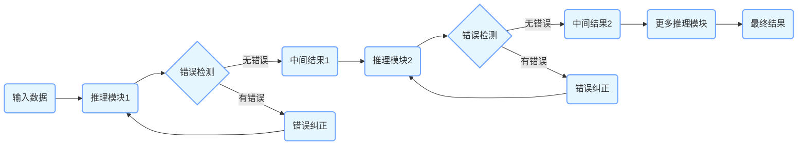

# 多步骤推理任务中的错误传播控制策略

> 关键词：多步骤推理任务、错误传播、控制策略、不确定性、鲁棒性

> 摘要：本文围绕多步骤推理任务中的错误传播控制策略展开深入探讨。多步骤推理任务在众多领域具有重要应用，但错误传播问题严重影响推理结果的准确性和可靠性。文章首先介绍了多步骤推理任务及错误传播的背景知识，阐述核心概念与联系，深入剖析核心算法原理并给出具体操作步骤，运用数学模型和公式进行理论分析，通过项目实战展示代码实现与解读，探讨实际应用场景，推荐相关工具和资源，最后总结未来发展趋势与挑战，解答常见问题并提供扩展阅读与参考资料，旨在为研究者和开发者提供全面且深入的错误传播控制策略指导。

## 1. 背景介绍 
### 1.1 目的和范围
多步骤推理任务在自然语言处理、计算机视觉、知识图谱等多个领域广泛存在，如文本生成、图像识别与推理、知识问答系统等。然而，在推理过程中，错误往往会不断传播和累积，导致最终结果与真实情况偏差较大。本文章的目的在于深入研究多步骤推理任务中错误传播的机制和影响因素，提出有效的控制策略，以提高推理结果的准确性和可靠性。范围涵盖了常见的多步骤推理任务场景，涉及不同的算法和技术，旨在为解决该领域的实际问题提供理论支持和实践指导。

### 1.2 预期读者
本文预期读者包括从事人工智能、机器学习、自然语言处理、计算机视觉等领域的研究人员、开发者，以及对多步骤推理任务和错误传播问题感兴趣的技术爱好者。希望通过本文的介绍，读者能够深入理解错误传播的本质和控制策略，从而在实际项目中应用相关技术，提升推理系统的性能。

### 1.3 文档结构概述
本文将按照以下结构进行组织：首先介绍多步骤推理任务和错误传播的背景知识，包括术语定义和相关概念解释；接着阐述核心概念与联系，通过文本示意图和 Mermaid 流程图展示其架构；然后详细讲解核心算法原理和具体操作步骤，结合 Python 源代码进行说明；再运用数学模型和公式对错误传播进行理论分析，并举例说明；之后通过项目实战展示代码实际案例和详细解释；探讨实际应用场景；推荐相关的工具和资源；最后总结未来发展趋势与挑战，解答常见问题并提供扩展阅读与参考资料。

### 1.4 术语表
#### 1.4.1 核心术语定义
- **多步骤推理任务**：指需要经过多个推理步骤才能得出最终结果的任务，每个步骤的推理结果会作为下一个步骤的输入。
- **错误传播**：在多步骤推理过程中，某个步骤产生的错误会影响后续步骤的推理结果，导致错误在整个推理过程中不断扩散和累积。
- **控制策略**：为了减少错误传播的影响，采取的一系列方法和技术，包括错误检测、纠正、预防等。

#### 1.4.2 相关概念解释
- **不确定性**：在推理过程中，由于数据的不完整性、噪声等因素，导致推理结果存在一定的不确定性。错误传播会加剧这种不确定性。
- **鲁棒性**：指推理系统在存在错误和不确定性的情况下，仍能保持较好性能的能力。控制错误传播有助于提高推理系统的鲁棒性。

#### 1.4.3 缩略词列表
- **NLP**：Natural Language Processing（自然语言处理）
- **CV**：Computer Vision（计算机视觉）
- **KG**：Knowledge Graph（知识图谱）

## 2. 核心概念与联系 

### 核心概念原理
多步骤推理任务通常由多个推理模块组成，每个模块根据输入进行推理并产生输出，该输出作为下一个模块的输入。错误传播的本质是某个模块产生的错误会影响后续模块的输入，进而影响后续模块的推理结果。例如，在自然语言处理的文本生成任务中，第一步对输入文本进行语义理解，如果理解出现错误，那么基于该错误理解生成的中间表示将作为后续生成步骤的输入，导致生成的文本存在偏差。

为了控制错误传播，需要从多个方面入手。一方面，可以在每个推理步骤中进行错误检测，及时发现可能存在的错误；另一方面，可以采取纠正措施，对检测到的错误进行修正。此外，还可以通过设计合理的推理架构和算法，预防错误的产生和传播。

### 架构的文本示意图
多步骤推理任务的基本架构可以描述为：输入数据经过第一个推理模块进行处理，产生中间结果；中间结果作为输入传递给第二个推理模块，以此类推，直到最后一个推理模块产生最终结果。在这个过程中，错误可能在任何一个推理模块中产生，并传播到后续模块。

为了控制错误传播，可以在每个推理模块中添加错误检测和纠正机制，同时在模块之间设置反馈机制，以便在发现错误时能够回溯和修正。

### Mermaid 流程图


## 3. 核心算法原理 & 具体操作步骤 

### 核心算法原理
一种常见的错误传播控制算法是基于置信度的错误检测和纠正算法。该算法的核心思想是在每个推理步骤中，为推理结果分配一个置信度值，置信度值表示推理结果的可靠程度。当置信度值低于某个阈值时，认为该推理结果可能存在错误，需要进行纠正。

### 具体操作步骤
1. **置信度计算**：在每个推理步骤中，根据推理模型的输出和输入数据的特征，计算推理结果的置信度。例如，在分类任务中，可以根据分类器输出的概率分布来计算置信度，概率值越高，置信度越高。
2. **错误检测**：将计算得到的置信度值与预设的阈值进行比较。如果置信度值低于阈值，则认为该推理结果可能存在错误。
3. **错误纠正**：当检测到错误时，可以采取以下几种方法进行纠正：
    - **重新推理**：使用不同的参数或模型对输入数据进行重新推理，以获得更可靠的结果。
    - **回溯修正**：回溯到之前的推理步骤，检查中间结果是否存在错误，并进行修正。
    - **引入外部知识**：利用外部知识库或其他相关信息，对错误的推理结果进行修正。

### Python 源代码实现
```python
import numpy as np

# 模拟推理模块
def inference_module(input_data, model):
    # 这里简单模拟推理过程，返回推理结果和置信度
    output = model.predict(input_data)
    confidence = np.max(model.predict_proba(input_data))
    return output, confidence

# 错误检测函数
def error_detection(confidence, threshold):
    if confidence < threshold:
        return True
    else:
        return False

# 错误纠正函数（简单示例：重新推理）
def error_correction(input_data, model):
    new_output, new_confidence = inference_module(input_data, model)
    return new_output, new_confidence

# 多步骤推理过程
def multi_step_inference(input_data, models, threshold):
    current_input = input_data
    for model in models:
        output, confidence = inference_module(current_input, model)
        while error_detection(confidence, threshold):
            output, confidence = error_correction(current_input, model)
        current_input = output
    return current_input
```

## 4. 数学模型和公式 & 详细讲解 & 举例说明 

### 数学模型和公式
设 $x_0$ 为输入数据，$M_1, M_2, \cdots, M_n$ 为 $n$ 个推理模块，$x_i$ 为第 $i$ 个推理模块的输出，即 $x_i = M_i(x_{i - 1})$，$i = 1, 2, \cdots, n$。

每个推理模块的输出都存在一定的误差，设 $\epsilon_i$ 为第 $i$ 个推理模块的误差，则 $x_i = M_i(x_{i - 1}) + \epsilon_i$。

错误传播的过程可以表示为误差的累积，最终结果 $x_n$ 的误差 $\epsilon_{total}$ 可以近似表示为：

$$\epsilon_{total} \approx \sum_{i = 1}^{n} \epsilon_i$$

为了控制错误传播，我们引入置信度 $c_i$ 来表示第 $i$ 个推理模块输出的可靠程度。置信度的计算可以根据具体的推理模型和任务进行设计，例如在分类任务中，可以使用分类器输出的概率分布来计算置信度：

$$c_i = \max_{j} P(y_j|x_{i - 1})$$

其中 $P(y_j|x_{i - 1})$ 表示在输入 $x_{i - 1}$ 下，分类为第 $j$ 类的概率。

### 详细讲解
上述数学模型描述了多步骤推理任务中错误传播的过程。误差 $\epsilon_i$ 表示每个推理模块的不确定性，由于后续模块的输入依赖于前一个模块的输出，因此误差会不断累积，导致最终结果的误差增大。

置信度 $c_i$ 作为衡量推理结果可靠性的指标，可以帮助我们检测可能存在的错误。当置信度低于某个阈值时，说明该推理结果的可靠性较低，可能存在错误，需要进行纠正。

### 举例说明
假设我们有一个简单的二分类任务，使用逻辑回归模型进行推理。输入数据 $x_0$ 经过第一个推理模块 $M_1$ 得到输出 $x_1$，$M_1$ 输出的概率分布为 $P(y_0|x_0) = 0.3$，$P(y_1|x_0) = 0.7$，则置信度 $c_1 = 0.7$。

如果预设的阈值为 0.8，由于 $c_1 < 0.8$，则认为 $x_1$ 可能存在错误，需要进行纠正。我们可以重新使用逻辑回归模型对 $x_0$ 进行推理，或者调整模型的参数，直到得到的置信度大于等于阈值。

## 5. 项目实战：代码实际案例和详细解释说明 

### 5.1  开发环境搭建
- **操作系统**：Windows 10 或 Ubuntu 18.04 及以上
- **编程语言**：Python 3.7 及以上
- **开发工具**：PyCharm 或 Jupyter Notebook
- **相关库**：`numpy`、`scikit-learn`

可以使用以下命令安装所需的库：
```sh
pip install numpy scikit-learn
```

### 5.2  源代码详细实现和代码解读
```python
import numpy as np
from sklearn.linear_model import LogisticRegression
from sklearn.datasets import make_classification
from sklearn.model_selection import train_test_split

# 生成示例数据
X, y = make_classification(n_samples=1000, n_features=10, n_informative=5, n_redundant=0, random_state=42)
X_train, X_test, y_train, y_test = train_test_split(X, y, test_size=0.2, random_state=42)

# 训练两个逻辑回归模型，模拟多步骤推理
model1 = LogisticRegression()
model1.fit(X_train, y_train)

model2 = LogisticRegression()
model2.fit(X_train, y_train)

# 定义置信度阈值
threshold = 0.8

# 模拟推理模块
def inference_module(input_data, model):
    output = model.predict(input_data)
    confidence = np.max(model.predict_proba(input_data), axis=1)
    return output, confidence

# 错误检测函数
def error_detection(confidence, threshold):
    return confidence < threshold

# 错误纠正函数（简单示例：重新推理）
def error_correction(input_data, model):
    new_output, new_confidence = inference_module(input_data, model)
    while error_detection(new_confidence, threshold):
        new_output, new_confidence = inference_module(input_data, model)
    return new_output, new_confidence

# 多步骤推理过程
def multi_step_inference(input_data, models, threshold):
    current_input = input_data
    for model in models:
        output, confidence = inference_module(current_input, model)
        error_indices = error_detection(confidence, threshold)
        while np.any(error_indices):
            corrected_output, corrected_confidence = error_correction(current_input[error_indices], model)
            output[error_indices] = corrected_output
            confidence[error_indices] = corrected_confidence
            error_indices = error_detection(confidence, threshold)
        current_input = output
    return current_input

# 进行多步骤推理
models = [model1, model2]
final_output = multi_step_inference(X_test, models, threshold)

print("最终推理结果:", final_output)
```

### 5.3  代码解读与分析
1. **数据生成**：使用 `make_classification` 函数生成示例分类数据，并将其分为训练集和测试集。
2. **模型训练**：训练两个逻辑回归模型，模拟多步骤推理中的两个推理模块。
3. **推理模块**：`inference_module` 函数根据输入数据和模型进行推理，返回推理结果和置信度。
4. **错误检测**：`error_detection` 函数根据置信度和阈值判断推理结果是否可能存在错误。
5. **错误纠正**：`error_correction` 函数对可能存在错误的推理结果进行重新推理，直到置信度大于等于阈值。
6. **多步骤推理**：`multi_step_inference` 函数实现了多步骤推理过程，在每个推理步骤中进行错误检测和纠正。

通过这种方式，我们可以有效地控制多步骤推理任务中的错误传播，提高推理结果的准确性。

## 6. 实际应用场景 
### 自然语言处理
在自然语言处理的文本生成任务中，如机器翻译、对话系统等，多步骤推理是常见的处理方式。例如，在机器翻译中，首先对源语言文本进行句法分析和语义理解，然后根据理解结果生成目标语言的中间表示，最后将中间表示转换为目标语言文本。在这个过程中，任何一个步骤的错误都可能导致最终翻译结果的不准确。通过应用错误传播控制策略，可以提高翻译的质量。

### 计算机视觉
在计算机视觉的图像识别与推理任务中，如图像分类、目标检测、图像生成等，也涉及多步骤推理。例如，在目标检测任务中，首先对图像进行特征提取，然后根据提取的特征进行目标定位和分类。如果特征提取出现错误，会影响后续的目标定位和分类结果。错误传播控制策略可以帮助提高目标检测的准确性。

### 知识图谱
在知识图谱的知识推理任务中，需要根据已有的知识和规则进行多步骤推理，以推断出新的知识。例如，在一个医学知识图谱中，根据患者的症状和病史，结合医学知识和规则，推断出可能的疾病和治疗方案。如果推理过程中出现错误，可能会导致误诊和错误的治疗建议。错误传播控制策略可以提高知识推理的可靠性。

## 7. 工具和资源推荐
### 7.1 学习资源推荐
#### 7.1.1 书籍推荐
- 《人工智能：一种现代的方法》：全面介绍了人工智能的基本概念、算法和应用，包括多步骤推理和错误处理的相关内容。
- 《机器学习》：详细讲解了机器学习的各种算法和模型，对于理解多步骤推理任务中的推理模块和错误传播机制有很大帮助。
- 《自然语言处理入门》：介绍了自然语言处理的基本技术和方法，包括文本生成、语义理解等多步骤推理任务的实现。

#### 7.1.2 在线课程
- Coursera 上的 “Machine Learning” 课程：由 Andrew Ng 教授授课，系统地介绍了机器学习的基础知识和算法。
- edX 上的 “Artificial Intelligence” 课程：涵盖了人工智能的各个方面，包括多步骤推理和错误控制的相关内容。
- 哔哩哔哩上的 “自然语言处理教程”：适合初学者快速入门自然语言处理，了解多步骤推理在自然语言处理中的应用。

#### 7.1.3 技术博客和网站
- Medium：有许多关于人工智能、机器学习和自然语言处理的技术博客，其中不乏关于多步骤推理和错误传播控制的文章。
- arXiv：提供了大量的学术论文，包括最新的多步骤推理和错误控制的研究成果。
- 开源中国：有丰富的技术文章和代码示例，对于学习和实践多步骤推理任务很有帮助。

### 7.2 开发工具框架推荐
#### 7.2.1 IDE和编辑器
- PyCharm：功能强大的 Python 集成开发环境，支持代码调试、版本控制等功能，适合开发多步骤推理任务的项目。
- Jupyter Notebook：交互式的开发环境，方便进行代码编写、测试和文档记录，适合快速验证多步骤推理算法。
- Visual Studio Code：轻量级的代码编辑器，支持多种编程语言和插件，可用于开发和调试多步骤推理任务的代码。

#### 7.2.2 调试和性能分析工具
- PDB：Python 自带的调试器，可以帮助我们定位和解决多步骤推理代码中的错误。
- cProfile：Python 的性能分析工具，可以分析代码的运行时间和资源消耗，帮助我们优化多步骤推理算法。
- TensorBoard：用于可视化深度学习模型的训练过程和性能指标，对于调试和优化多步骤推理中的深度学习模型很有帮助。

#### 7.2.3 相关框架和库
- scikit-learn：提供了丰富的机器学习算法和工具，可用于实现多步骤推理任务中的推理模块。
- TensorFlow：开源的深度学习框架，支持构建和训练复杂的多步骤推理模型。
- PyTorch：另一个流行的深度学习框架，具有动态计算图的特点，适合快速实现和调试多步骤推理算法。

### 7.3 相关论文著作推荐
#### 7.3.1 经典论文
- “Probabilistic Reasoning in Intelligent Systems: Networks of Plausible Inference”：介绍了概率推理的基本原理和方法，对于理解多步骤推理中的不确定性和错误传播有重要意义。
- “A Mathematical Theory of Evidence”：提出了证据理论，为处理多步骤推理中的不确定性和错误提供了一种数学方法。
- “On the Dempster-Shafer Framework and New Combination Rules”：进一步探讨了证据理论中的组合规则，对于解决多步骤推理中的错误融合问题有参考价值。

#### 7.3.2 最新研究成果
- 关注 arXiv 上关于多步骤推理、错误传播控制的最新论文，了解该领域的前沿研究动态。
- 参加相关的学术会议，如 NeurIPS、ICML、ACL 等，获取最新的研究成果和技术报告。

#### 7.3.3 应用案例分析
- 研究各大科技公司的技术博客和开源项目，了解他们在实际应用中如何处理多步骤推理任务中的错误传播问题。
- 分析 Kaggle 上的相关竞赛项目，学习其他开发者的经验和技巧，提高自己解决多步骤推理错误传播问题的能力。

## 8. 总结：未来发展趋势与挑战
### 未来发展趋势
- **融合多种技术**：未来的错误传播控制策略将融合机器学习、深度学习、概率推理、知识图谱等多种技术，以提高推理的准确性和可靠性。例如，结合知识图谱的先验知识和深度学习的强大表示能力，更好地处理多步骤推理中的不确定性和错误。
- **自适应控制**：随着技术的发展，错误传播控制策略将更加自适应。系统能够根据不同的任务和数据特点，自动调整控制策略，以达到最佳的效果。
- **可解释性增强**：为了更好地理解和信任推理结果，错误传播控制策略将越来越注重可解释性。能够解释为什么采取某种控制策略，以及该策略对推理结果的影响。

### 挑战
- **不确定性建模**：多步骤推理任务中存在大量的不确定性，如何准确地建模和处理这些不确定性是一个挑战。需要研究更加有效的概率模型和推理算法。
- **计算复杂度**：随着推理步骤的增加和模型的复杂化，错误传播控制的计算复杂度也会增加。如何在保证控制效果的前提下，降低计算复杂度是一个需要解决的问题。
- **数据质量**：数据质量对多步骤推理任务的影响很大。低质量的数据容易导致错误的产生和传播，如何提高数据质量，减少数据噪声的影响是一个长期的挑战。

## 9. 附录：常见问题与解答
### 问题 1：如何选择合适的置信度阈值？
答：选择合适的置信度阈值需要根据具体的任务和数据进行实验和调整。一般来说，可以通过交叉验证的方法，在验证集上尝试不同的阈值，选择能够使推理结果准确性和可靠性达到最佳平衡的阈值。

### 问题 2：错误纠正方法有哪些局限性？
答：不同的错误纠正方法有不同的局限性。例如，重新推理可能会陷入局部最优解，无法得到更准确的结果；回溯修正可能会导致计算复杂度增加，尤其是在推理步骤较多的情况下；引入外部知识可能会受到知识的准确性和完整性的限制。

### 问题 3：如何评估错误传播控制策略的效果？
答：可以使用多种指标来评估错误传播控制策略的效果，如准确率、召回率、F1 值等。此外，还可以通过比较使用控制策略前后的推理结果的误差和不确定性，来评估策略的有效性。

## 10. 扩展阅读 & 参考资料
- Pearl, J. (1988). Probabilistic Reasoning in Intelligent Systems: Networks of Plausible Inference. Morgan Kaufmann.
- Shafer, G. (1976). A Mathematical Theory of Evidence. Princeton University Press.
- Smets, P., & Kennes, R. (1994). The transferable belief model. Artificial Intelligence, 66(2), 191-234.
- Goodfellow, I. J., Bengio, Y., & Courville, A. (2016). Deep Learning. MIT Press.
- Mitchell, T. M. (1997). Machine Learning. McGraw-Hill.
- Jurafsky, D., & Martin, J. H. (2021). Speech and Language Processing. Pearson.

以上参考资料涵盖了多步骤推理、错误传播控制、机器学习、深度学习、自然语言处理等多个领域的经典著作和最新研究成果，可供读者进一步深入学习和研究。