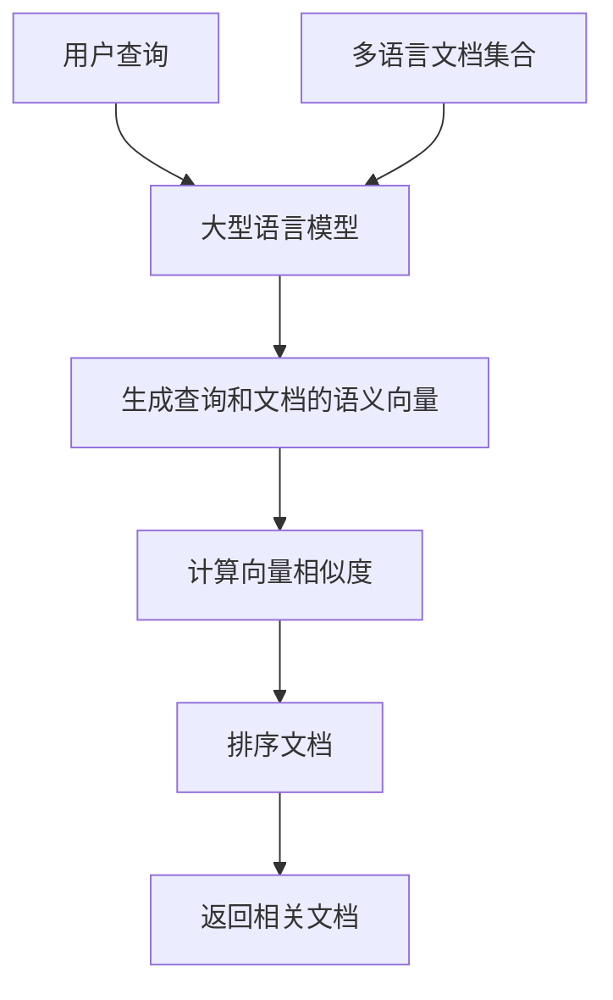

# 大型语言模型在跨语言信息检索中的应用

> 关键词：大型语言模型、跨语言信息检索、自然语言处理、语义理解、多语言表示

> 摘要：本文深入探讨了大型语言模型在跨语言信息检索中的应用。随着全球化的发展，跨语言信息检索的需求日益增长，而大型语言模型凭借其强大的语义理解和多语言处理能力，为解决跨语言信息检索中的难题提供了新的思路和方法。文章首先介绍了研究的背景、目的、预期读者等内容，接着阐述了核心概念与联系，详细讲解了核心算法原理和具体操作步骤，通过数学模型和公式进一步分析，结合项目实战给出代码实际案例及解释，探讨了实际应用场景，推荐了相关工具和资源，最后总结了未来发展趋势与挑战，并提供了常见问题解答和扩展阅读参考资料。

## 1. 背景介绍 
### 1.1 目的和范围
在当今全球化的时代，信息的传播和交流跨越了语言的界限。跨语言信息检索（Cross - Language Information Retrieval，CLIR）旨在帮助用户从不同语言的文档集合中找到与他们查询相关的信息。然而，由于不同语言之间存在着语法、词汇、语义等方面的差异，传统的信息检索技术在处理跨语言信息时面临着诸多挑战。

大型语言模型（Large Language Model，LLM）的出现为跨语言信息检索带来了新的机遇。这些模型通过在大规模文本数据上进行预训练，学习到了丰富的语言知识和语义表示，能够更好地理解不同语言之间的语义关联。本研究的目的在于深入探讨大型语言模型在跨语言信息检索中的应用，分析其优势和局限性，为实际应用提供理论和实践指导。

本研究的范围涵盖了常见的大型语言模型，如BERT、GPT系列等，以及主流的跨语言信息检索任务，包括跨语言文本检索、跨语言图像检索等。

### 1.2 预期读者
本文预期读者包括自然语言处理领域的研究人员、信息检索系统的开发者、对人工智能和跨语言信息处理感兴趣的技术爱好者等。对于研究人员，本文可以为他们的研究提供新的思路和方法；对于开发者，本文可以帮助他们在实际项目中应用大型语言模型来提升跨语言信息检索的性能；对于技术爱好者，本文可以让他们了解跨语言信息检索的前沿技术和发展趋势。

### 1.3 文档结构概述
本文共分为十个部分。第一部分介绍了研究的背景、目的、预期读者和文档结构概述；第二部分阐述了大型语言模型和跨语言信息检索的核心概念与联系，并给出相应的文本示意图和Mermaid流程图；第三部分详细讲解了核心算法原理和具体操作步骤，同时使用Python源代码进行阐述；第四部分介绍了相关的数学模型和公式，并进行详细讲解和举例说明；第五部分通过项目实战给出代码实际案例和详细解释说明；第六部分探讨了大型语言模型在跨语言信息检索中的实际应用场景；第七部分推荐了相关的工具和资源；第八部分总结了未来发展趋势与挑战；第九部分是附录，提供了常见问题与解答；第十部分给出了扩展阅读和参考资料。

### 1.4 术语表
#### 1.4.1 核心术语定义
- **大型语言模型（Large Language Model，LLM）**：基于深度学习技术，在大规模文本数据上进行训练的语言模型，具有强大的语言理解和生成能力。
- **跨语言信息检索（Cross - Language Information Retrieval，CLIR）**：指用户使用一种语言进行查询，从不同语言的文档集合中找到相关信息的过程。
- **语义表示（Semantic Representation）**：将文本的语义信息以某种形式进行表示，以便计算机能够理解和处理。
- **多语言表示学习（Multilingual Representation Learning）**：学习一种能够同时表示多种语言语义信息的表示方法。

#### 1.4.2 相关概念解释
- **预训练（Pre - training）**：大型语言模型在大规模无监督文本数据上进行的训练过程，旨在学习通用的语言知识和语义表示。
- **微调（Fine - tuning）**：在预训练的基础上，使用特定任务的有监督数据对模型进行进一步训练，以适应具体的任务需求。
- **词嵌入（Word Embedding）**：将单词映射到低维向量空间的技术，使得语义相近的单词在向量空间中距离较近。

#### 1.4.3 缩略词列表
- **LLM**：Large Language Model（大型语言模型）
- **CLIR**：Cross - Language Information Retrieval（跨语言信息检索）
- **BERT**：Bidirectional Encoder Representations from Transformers（基于Transformer的双向编码器表示）
- **GPT**：Generative Pretrained Transformer（生成式预训练Transformer）

## 2. 核心概念与联系 

### 2.1 大型语言模型的原理
大型语言模型通常基于Transformer架构，Transformer架构由编码器和解码器组成，通过自注意力机制（Self - Attention Mechanism）能够有效地捕捉文本中的长距离依赖关系。

以BERT为例，它是一种基于Transformer编码器的双向语言模型。BERT通过在大规模无监督文本数据上进行预训练，学习到了丰富的语言知识和语义表示。预训练任务主要包括掩码语言模型（Masked Language Model，MLM）和下一句预测（Next Sentence Prediction，NSP）。

在MLM任务中，输入的文本中会随机选择一些单词进行掩码，模型的任务是预测这些被掩码的单词。通过这个任务，模型能够学习到单词之间的上下文关系。在NSP任务中，模型需要判断两个句子是否是连续的句子，这有助于模型学习到句子之间的语义关联。

### 2.2 跨语言信息检索的原理
跨语言信息检索的核心问题是如何解决不同语言之间的语义鸿沟。传统的跨语言信息检索方法主要基于翻译，即将查询和文档都翻译成同一种语言，然后在同一种语言的空间中进行检索。

而基于大型语言模型的跨语言信息检索方法则是通过学习多语言表示，使得不同语言的文本能够在同一个语义空间中进行比较。具体来说，大型语言模型可以将不同语言的文本映射到一个共享的语义向量空间中，在这个空间中，语义相近的文本向量距离较近，从而可以通过计算向量之间的距离来进行信息检索。

### 2.3 核心概念的联系
大型语言模型为跨语言信息检索提供了强大的语义理解和多语言表示能力。通过大型语言模型的预训练，能够学习到通用的语言知识和语义表示，这些表示可以用于跨语言信息检索任务中。在跨语言信息检索中，可以将查询和文档输入到大型语言模型中，得到它们的语义向量表示，然后通过计算向量之间的相似度来确定文档与查询的相关性。

### 2.4 文本示意图
```plaintext
大型语言模型
|
|-- 预训练（大规模无监督数据）
|   |-- 学习语言知识和语义表示
|
|-- 微调（特定任务有监督数据）
|   |-- 适应跨语言信息检索任务
|
|-- 多语言表示
|   |-- 将不同语言文本映射到共享语义空间
|
|-- 跨语言信息检索
    |-- 计算查询和文档向量相似度
    |-- 确定文档与查询相关性
```

### 2.5 Mermaid流程图


## 3. 核心算法原理 & 具体操作步骤 

### 3.1 核心算法原理
基于大型语言模型的跨语言信息检索算法主要包括以下几个步骤：
1. **文本编码**：将查询和文档输入到大型语言模型中，得到它们的语义向量表示。
2. **相似度计算**：计算查询向量和文档向量之间的相似度，常用的相似度计算方法包括余弦相似度、欧几里得距离等。
3. **文档排序**：根据相似度得分对文档进行排序，将相似度得分高的文档排在前面。

### 3.2 具体操作步骤
#### 3.2.1 安装必要的库
在Python中，我们可以使用`transformers`库来加载和使用大型语言模型，使用`scikit - learn`库来计算向量相似度。
```python
!pip install transformers scikit-learn
```

#### 3.2.2 加载大型语言模型
以`bert-base-multilingual-cased`为例，它是一个多语言的BERT模型，可以处理多种语言的文本。
```python
from transformers import AutoTokenizer, AutoModel
import torch

# 加载分词器和模型
tokenizer = AutoTokenizer.from_pretrained('bert-base-multilingual-cased')
model = AutoModel.from_pretrained('bert-base-multilingual-cased')

# 将模型移动到GPU（如果可用）
device = torch.device("cuda" if torch.cuda.is_available() else "cpu")
model.to(device)
```

#### 3.2.3 文本编码
定义一个函数来对文本进行编码，得到文本的语义向量表示。
```python
def encode_text(text):
    # 对文本进行分词
    inputs = tokenizer(text, return_tensors='pt', padding=True, truncation=True)
    # 将输入移动到GPU（如果可用）
    inputs = {k: v.to(device) for k, v in inputs.items()}
    # 前向传播
    with torch.no_grad():
        outputs = model(**inputs)
    # 取[CLS]标记的输出作为文本的表示
    embeddings = outputs.last_hidden_state[:, 0, :].cpu().numpy()
    return embeddings
```

#### 3.2.4 相似度计算和文档排序
定义一个函数来计算查询和文档之间的相似度，并对文档进行排序。
```python
from sklearn.metrics.pairwise import cosine_similarity

def retrieve_documents(query, documents):
    # 对查询进行编码
    query_embedding = encode_text(query)
    # 对文档进行编码
    document_embeddings = [encode_text(doc) for doc in documents]
    # 计算相似度
    similarities = [cosine_similarity(query_embedding, doc_emb)[0][0] for doc_emb in document_embeddings]
    # 对文档进行排序
    sorted_indices = sorted(range(len(similarities)), key=lambda i: similarities[i], reverse=True)
    sorted_documents = [documents[i] for i in sorted_indices]
    return sorted_documents
```

#### 3.2.5 示例使用
```python
query = "How to learn English?"
documents = [
    "Comment apprendre l'anglais ?",
    "¿Cómo aprender inglés?",
    "怎么学习英语？"
]

sorted_documents = retrieve_documents(query, documents)
for doc in sorted_documents:
    print(doc)
```

## 4. 数学模型和公式 & 详细讲解 & 举例说明 

### 4.1 文本编码的数学模型
在大型语言模型中，文本编码的过程可以表示为：

设输入的文本为 $x = [x_1, x_2, \cdots, x_n]$，其中 $x_i$ 表示文本中的第 $i$ 个单词。经过分词器处理后，得到输入的词元序列 $t = [t_1, t_2, \cdots, t_m]$。

大型语言模型将词元序列 $t$ 映射到一个高维向量空间中，得到每个词元的向量表示 $h_i$。最终，我们取 $[CLS]$ 标记的向量表示作为整个文本的语义向量 $v$，即：

$$v = h_{[CLS]}$$

### 4.2 相似度计算的数学模型
常用的相似度计算方法是余弦相似度。设查询向量为 $q$，文档向量为 $d$，则它们之间的余弦相似度 $sim(q, d)$ 定义为：

$$sim(q, d)=\frac{q\cdot d}{\|q\|\|d\|}$$

其中，$q\cdot d$ 表示向量 $q$ 和 $d$ 的点积，$\|q\|$ 和 $\|d\|$ 分别表示向量 $q$ 和 $d$ 的模。

### 4.3 详细讲解
- **文本编码**：在大型语言模型中，词元的向量表示 $h_i$ 是通过多层Transformer编码器计算得到的。每个Transformer层都包含自注意力机制和前馈神经网络，通过不断地更新词元的向量表示，模型能够捕捉到文本中的长距离依赖关系和语义信息。最终，$[CLS]$ 标记的向量表示 $h_{[CLS]}$ 综合了整个文本的语义信息，因此可以作为文本的语义向量。
- **相似度计算**：余弦相似度衡量的是两个向量之间的夹角余弦值，取值范围在 $[-1, 1]$ 之间。当两个向量的方向相同时，余弦相似度为1，表示它们的语义非常相似；当两个向量的方向相反时，余弦相似度为 - 1，表示它们的语义完全不同。

### 4.4 举例说明
假设查询向量 $q = [0.5, 0.3, 0.2]$，文档向量 $d = [0.4, 0.3, 0.3]$。

首先计算向量的模：
$$\|q\|=\sqrt{0.5^2 + 0.3^2+0.2^2}=\sqrt{0.25 + 0.09+0.04}=\sqrt{0.38}\approx0.616$$
$$\|d\|=\sqrt{0.4^2 + 0.3^2+0.3^2}=\sqrt{0.16 + 0.09+0.09}=\sqrt{0.34}\approx0.583$$

然后计算点积：
$$q\cdot d=0.5\times0.4 + 0.3\times0.3+0.2\times0.3=0.2 + 0.09+0.06=0.35$$

最后计算余弦相似度：
$$sim(q, d)=\frac{0.35}{0.616\times0.583}\approx0.97$$

这表明查询和文档的语义非常相似。

## 5. 项目实战：代码实际案例和详细解释说明 

### 5.1  开发环境搭建
#### 5.1.1 操作系统
可以选择Windows、Linux或macOS等常见的操作系统。建议使用Linux系统，因为它在开发和部署方面具有更好的稳定性和兼容性。

#### 5.1.2 Python环境
安装Python 3.6或更高版本。可以使用Anaconda或Miniconda来管理Python环境。

#### 5.1.3 安装必要的库
在命令行中执行以下命令来安装必要的库：
```bash
pip install transformers scikit-learn torch numpy
```

### 5.2  源代码详细实现和代码解读
#### 5.2.1 数据准备
假设我们有一个包含多种语言文档的数据集，将其存储在一个列表中。
```python
documents = [
    "The cat is on the mat.",
    "Le chat est sur le tapis.",
    "El gato está en la alfombra.",
    "猫在垫子上。"
]
```

#### 5.2.2 加载模型和分词器
```python
from transformers import AutoTokenizer, AutoModel
import torch

# 加载分词器和模型
tokenizer = AutoTokenizer.from_pretrained('bert-base-multilingual-cased')
model = AutoModel.from_pretrained('bert-base-multilingual-cased')

# 将模型移动到GPU（如果可用）
device = torch.device("cuda" if torch.cuda.is_available() else "cpu")
model.to(device)
```

#### 5.2.3 文本编码函数
```python
def encode_text(text):
    # 对文本进行分词
    inputs = tokenizer(text, return_tensors='pt', padding=True, truncation=True)
    # 将输入移动到GPU（如果可用）
    inputs = {k: v.to(device) for k, v in inputs.items()}
    # 前向传播
    with torch.no_grad():
        outputs = model(**inputs)
    # 取[CLS]标记的输出作为文本的表示
    embeddings = outputs.last_hidden_state[:, 0, :].cpu().numpy()
    return embeddings
```
**代码解读**：
- `tokenizer(text, return_tensors='pt', padding=True, truncation=True)`：对输入的文本进行分词，并将结果转换为PyTorch张量。`padding=True` 表示对输入进行填充，使得所有输入的长度相同；`truncation=True` 表示对过长的输入进行截断。
- `inputs = {k: v.to(device) for k, v in inputs.items()}`：将输入的张量移动到GPU（如果可用）。
- `outputs = model(**inputs)`：前向传播，得到模型的输出。
- `embeddings = outputs.last_hidden_state[:, 0, :].cpu().numpy()`：取 `[CLS]` 标记的输出作为文本的语义向量，并将其转换为NumPy数组。

#### 5.2.4 相似度计算和文档排序函数
```python
from sklearn.metrics.pairwise import cosine_similarity

def retrieve_documents(query, documents):
    # 对查询进行编码
    query_embedding = encode_text(query)
    # 对文档进行编码
    document_embeddings = [encode_text(doc) for doc in documents]
    # 计算相似度
    similarities = [cosine_similarity(query_embedding, doc_emb)[0][0] for doc_emb in document_embeddings]
    # 对文档进行排序
    sorted_indices = sorted(range(len(similarities)), key=lambda i: similarities[i], reverse=True)
    sorted_documents = [documents[i] for i in sorted_indices]
    return sorted_documents
```
**代码解读**：
- `query_embedding = encode_text(query)`：对查询进行编码，得到查询的语义向量。
- `document_embeddings = [encode_text(doc) for doc in documents]`：对文档集合中的每个文档进行编码，得到文档的语义向量。
- `similarities = [cosine_similarity(query_embedding, doc_emb)[0][0] for doc_emb in document_embeddings]`：计算查询向量和每个文档向量之间的余弦相似度。
- `sorted_indices = sorted(range(len(similarities)), key=lambda i: similarities[i], reverse=True)`：根据相似度得分对文档进行排序，将相似度得分高的文档排在前面。
- `sorted_documents = [documents[i] for i in sorted_indices]`：根据排序后的索引，得到排序后的文档列表。

#### 5.2.5 示例使用
```python
query = "The cat is on the mat."
sorted_documents = retrieve_documents(query, documents)
for doc in sorted_documents:
    print(doc)
```

### 5.3  代码解读与分析
- **优点**：
  - **简单易用**：使用`transformers`库可以方便地加载和使用大型语言模型，减少了开发的工作量。
  - **跨语言能力**：`bert-base-multilingual-cased`模型可以处理多种语言的文本，能够很好地应用于跨语言信息检索任务。
  - **语义理解**：通过计算向量之间的相似度，能够捕捉到文本的语义信息，提高了信息检索的准确性。
- **局限性**：
  - **计算资源要求高**：大型语言模型通常需要较大的计算资源，包括GPU内存和计算能力。
  - **数据依赖**：模型的性能依赖于训练数据的质量和规模，如果训练数据不充分，可能会影响模型的性能。
  - **语义鸿沟**：虽然大型语言模型在一定程度上能够解决不同语言之间的语义鸿沟，但仍然存在一些语义信息无法准确捕捉的情况。

## 6. 实际应用场景 

### 6.1 跨语言学术文献检索
在学术研究领域，不同国家和地区的学者使用不同的语言发表研究成果。跨语言学术文献检索可以帮助研究人员快速找到与他们研究主题相关的文献，无论这些文献使用何种语言。大型语言模型可以将不同语言的学术文献和查询映射到同一个语义空间中，通过计算相似度来进行文献检索，提高了学术研究的效率。

### 6.2 跨语言电商商品搜索
在电商平台上，用户来自不同的国家和地区，使用不同的语言进行商品搜索。跨语言电商商品搜索可以满足用户的需求，让用户能够使用自己熟悉的语言搜索到全球范围内的商品。大型语言模型可以对商品标题、描述等文本信息进行编码，然后根据用户的查询进行商品检索，提高了电商平台的用户体验。

### 6.3 跨语言新闻检索
新闻媒体每天都会发布大量的不同语言的新闻报道。跨语言新闻检索可以帮助用户快速找到与他们感兴趣的主题相关的新闻报道，无论这些新闻报道使用何种语言。大型语言模型可以对新闻文本进行语义理解和编码，通过计算相似度来进行新闻检索，让用户能够及时了解全球范围内的新闻动态。

### 6.4 跨语言智能客服
在跨国企业的客服系统中，用户可能使用不同的语言进行咨询。跨语言智能客服可以自动识别用户的语言，并使用大型语言模型进行语义理解和回复生成。通过将用户的问题和客服的回答映射到同一个语义空间中，智能客服可以更好地理解用户的意图，提供准确的回答，提高了客服的效率和质量。

## 7. 工具和资源推荐
### 7.1 学习资源推荐
#### 7.1.1 书籍推荐
- 《深度学习》（Deep Learning）：由Ian Goodfellow、Yoshua Bengio和Aaron Courville所著，是深度学习领域的经典教材，涵盖了深度学习的基本原理、算法和应用。
- 《自然语言处理入门》（Natural Language Processing in Action）：由Hobson Lane、Cole Howard和Hugo Bowne - Anderson所著，介绍了自然语言处理的基本概念、算法和实践方法。
- 《Transformer神经网络：注意力机制的魔法》（Transformers for Natural Language Processing）：由Denis Rothman所著，深入介绍了Transformer架构及其在自然语言处理中的应用。

#### 7.1.2 在线课程
- Coursera上的“Natural Language Processing Specialization”：由深度学习领域的知名学者授课，涵盖了自然语言处理的各个方面，包括词嵌入、循环神经网络、Transformer等。
- edX上的“Introduction to Artificial Intelligence”：介绍了人工智能的基本概念、算法和应用，包括自然语言处理和信息检索等内容。
- 哔哩哔哩上的“李宏毅机器学习”：李宏毅教授的机器学习课程，讲解生动形象，包含了自然语言处理和深度学习的相关内容。

#### 7.1.3 技术博客和网站
- Hugging Face Blog：Hugging Face团队发布的关于自然语言处理和深度学习的技术博客，包含了最新的研究成果和模型介绍。
- Towards Data Science：一个专注于数据科学和机器学习的技术博客平台，有很多关于自然语言处理和跨语言信息检索的优质文章。
- arXiv.org：一个预印本服务器，提供了大量的学术论文，包括自然语言处理和深度学习领域的最新研究成果。

### 7.2 开发工具框架推荐
#### 7.2.1 IDE和编辑器
- PyCharm：一个专业的Python集成开发环境，提供了代码编辑、调试、版本控制等功能，适合开发Python项目。
- Visual Studio Code：一个轻量级的代码编辑器，支持多种编程语言，有丰富的插件可以扩展功能，适合快速开发和调试。

#### 7.2.2 调试和性能分析工具
- TensorBoard：一个用于可视化深度学习模型训练过程和性能的工具，可以帮助开发者监控模型的训练进度、损失函数变化等。
- PyTorch Profiler：PyTorch提供的性能分析工具，可以帮助开发者分析模型的性能瓶颈，优化代码。

#### 7.2.3 相关框架和库
- Transformers：Hugging Face开发的一个用于自然语言处理的Python库，提供了多种预训练的大型语言模型，方便开发者使用。
- PyTorch：一个开源的深度学习框架，提供了丰富的深度学习工具和函数，支持GPU加速。
- scikit - learn：一个用于机器学习的Python库，提供了多种机器学习算法和工具，包括相似度计算、分类、聚类等。

### 7.3 相关论文著作推荐
#### 7.3.1 经典论文
- “BERT: Pre-training of Deep Bidirectional Transformers for Language Understanding”：介绍了BERT模型的原理和训练方法，是自然语言处理领域的经典论文。
- “Attention Is All You Need”：提出了Transformer架构，为后续的大型语言模型发展奠定了基础。

#### 7.3.2 最新研究成果
- 关注arXiv.org上关于跨语言信息检索和大型语言模型的最新研究论文，了解该领域的最新发展趋势。

#### 7.3.3 应用案例分析
- 一些知名企业和研究机构会发布关于跨语言信息检索应用案例的报告和论文，可以从中学习到实际应用中的经验和技巧。

## 8. 总结：未来发展趋势与挑战

### 8.1 未来发展趋势
- **多模态融合**：未来的跨语言信息检索系统可能会融合文本、图像、音频等多种模态的信息，提供更加丰富和全面的检索服务。例如，用户可以使用图像或语音进行查询，系统能够理解用户的意图并从多语言的文本和图像数据中找到相关信息。
- **个性化检索**：根据用户的历史查询记录、兴趣偏好等信息，为用户提供个性化的跨语言信息检索服务。系统可以学习用户的语言习惯和兴趣，对检索结果进行个性化排序和推荐，提高用户的满意度。
- **知识增强**：将外部知识图谱与大型语言模型相结合，增强模型的语义理解和推理能力。知识图谱可以提供丰富的实体和关系信息，帮助模型更好地理解文本的语义，提高跨语言信息检索的准确性。
- **低资源语言支持**：目前的大型语言模型在高资源语言上的性能较好，但在低资源语言上的性能有待提高。未来的研究将更加关注低资源语言的处理，开发适用于低资源语言的跨语言信息检索方法和模型。

### 8.2 挑战
- **计算资源限制**：大型语言模型通常需要大量的计算资源来进行训练和推理，这对于一些资源有限的机构和开发者来说是一个挑战。如何在有限的计算资源下提高模型的性能和效率是一个亟待解决的问题。
- **数据隐私和安全**：跨语言信息检索涉及到大量的用户数据和文本信息，数据隐私和安全问题至关重要。如何在保证数据隐私和安全的前提下，有效地利用这些数据来提高模型的性能是一个挑战。
- **语义理解的局限性**：尽管大型语言模型在语义理解方面取得了很大的进展，但仍然存在一些语义信息无法准确捕捉的情况。例如，一些文化背景相关的语义信息、隐喻和双关语等，模型很难准确理解。如何进一步提高模型的语义理解能力是一个挑战。
- **模型可解释性**：大型语言模型通常是黑盒模型，其决策过程和推理机制难以解释。在一些对可解释性要求较高的应用场景中，如法律、医疗等领域，模型的可解释性是一个关键问题。如何提高大型语言模型的可解释性是一个挑战。

## 9. 附录：常见问题与解答

### 9.1 如何选择适合的大型语言模型？
选择适合的大型语言模型需要考虑以下几个因素：
- **语言支持**：如果需要处理多种语言的文本，选择支持多语言的模型，如`bert-base-multilingual-cased`。
- **任务需求**：不同的任务对模型的要求不同。如果是文本分类任务，可以选择预训练的分类模型；如果是文本生成任务，可以选择生成式模型。
- **计算资源**：大型语言模型通常需要较大的计算资源，包括GPU内存和计算能力。选择模型时需要考虑自己的计算资源是否能够支持。

### 9.2 如何提高跨语言信息检索的性能？
可以从以下几个方面提高跨语言信息检索的性能：
- **选择合适的模型**：选择性能较好、语言支持广泛的大型语言模型。
- **数据预处理**：对输入的文本进行预处理，如去除停用词、词干提取等，减少噪声的影响。
- **微调模型**：在特定任务的数据集上对预训练的模型进行微调，使模型更好地适应任务需求。
- **多模型融合**：将多个不同的模型进行融合，综合利用它们的优势，提高检索性能。

### 9.3 大型语言模型在跨语言信息检索中的计算复杂度如何？
大型语言模型的计算复杂度较高，主要体现在以下几个方面：
- **模型训练**：训练大型语言模型需要大量的计算资源和时间，通常需要使用多个GPU进行并行计算。
- **推理过程**：在推理过程中，模型需要对输入的文本进行编码和计算相似度，计算量较大。尤其是在处理大量文档时，计算复杂度会更高。

### 9.4 如何处理低资源语言的跨语言信息检索？
处理低资源语言的跨语言信息检索可以采用以下方法：
- **迁移学习**：利用高资源语言的预训练模型，通过迁移学习的方法将其知识迁移到低资源语言上。
- **多语言联合训练**：将低资源语言和高资源语言一起进行联合训练，让模型学习到不同语言之间的共性和差异。
- **数据增强**：通过数据增强的方法扩充低资源语言的数据集，提高模型的性能。

## 10. 扩展阅读 & 参考资料

### 10.1 扩展阅读
- 《人工智能：现代方法》（Artificial Intelligence: A Modern Approach）：全面介绍了人工智能的各个领域，包括自然语言处理、机器学习等，适合深入学习人工智能的读者。
- 《Python自然语言处理》（Natural Language Processing with Python）：介绍了如何使用Python进行自然语言处理，包括文本处理、词法分析、句法分析等内容。

### 10.2 参考资料
- Hugging Face官方文档：https://huggingface.co/docs
- PyTorch官方文档：https://pytorch.org/docs/stable/index.html
- scikit - learn官方文档：https://scikit-learn.org/stable/documentation.html