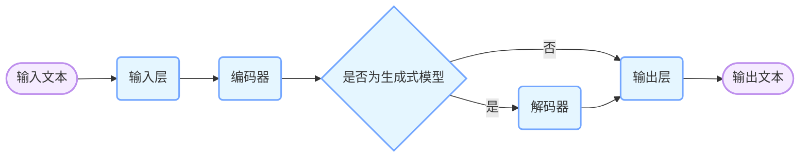

# 大型语言模型的推理能力提升:现状与挑战

> 关键词：大型语言模型、推理能力、现状、挑战、技术原理

> 摘要：本文围绕大型语言模型的推理能力提升展开深入探讨。首先介绍了相关背景，包括目的范围、预期读者等内容。接着详细阐述了大型语言模型推理能力的核心概念与联系，通过文本示意图和 Mermaid 流程图呈现其架构原理。深入讲解了核心算法原理，结合 Python 源代码进行说明，并给出数学模型和公式，辅以举例解释。通过项目实战展示了代码实现与分析，探讨了实际应用场景。推荐了相关的工具和资源，包括学习资源、开发工具框架及论文著作等。最后总结了未来发展趋势与挑战，还设置了附录解答常见问题，并提供扩展阅读和参考资料，旨在全面剖析大型语言模型推理能力提升的现状与面临的挑战，为相关领域的研究和实践提供有价值的参考。

## 1. 背景介绍 
### 1.1 目的和范围
大型语言模型在自然语言处理领域取得了显著进展，已经广泛应用于文本生成、问答系统、机器翻译等多个场景。然而，其推理能力的提升仍面临诸多问题。本文的目的在于全面探讨大型语言模型推理能力提升的现状与挑战，旨在为研究人员、开发者以及相关从业者提供一个清晰的技术图景，帮助他们更好地理解当前的技术水平和未来的发展方向。

本文的范围涵盖了大型语言模型推理能力的基本概念、核心算法原理、数学模型、实际应用场景等多个方面。同时，还会对相关的工具和资源进行推荐，以及对未来的发展趋势和挑战进行分析。

### 1.2 预期读者
本文预期读者包括但不限于自然语言处理领域的研究人员、人工智能开发者、软件工程师、对大型语言模型感兴趣的技术爱好者以及相关领域的学者。对于希望深入了解大型语言模型推理能力提升技术的人员，本文将提供有价值的信息和技术指导。

### 1.3 文档结构概述
本文将按照以下结构进行阐述：首先介绍背景信息，包括目的、预期读者和文档结构概述等。接着详细讲解大型语言模型推理能力的核心概念与联系，通过文本示意图和 Mermaid 流程图展示其原理和架构。然后深入探讨核心算法原理，结合 Python 源代码进行详细说明，并给出数学模型和公式进行理论支持。通过项目实战展示代码的实际应用和详细解释。之后介绍实际应用场景，推荐相关的工具和资源。最后总结未来发展趋势与挑战，设置附录解答常见问题，并提供扩展阅读和参考资料。

### 1.4 术语表
#### 1.4.1 核心术语定义
- **大型语言模型（Large Language Model, LLM）**：指具有大量参数和强大语言处理能力的深度学习模型，通常基于Transformer架构，能够在大规模文本数据上进行预训练，以学习语言的模式和规律。
- **推理能力**：指模型在面对给定问题或任务时，能够运用所学知识和逻辑规则，进行思考、分析和推导，从而得出合理结论或解决方案的能力。
- **预训练**：在大规模无标签文本数据上对模型进行训练，以学习通用的语言表示和模式，为后续的微调或特定任务的应用奠定基础。
- **微调（Fine - Tuning）**：在预训练模型的基础上，使用特定任务的有标签数据对模型进行进一步训练，以适应具体任务的需求。

#### 1.4.2 相关概念解释
- **注意力机制（Attention Mechanism）**：是一种在深度学习中用于处理序列数据的技术，它允许模型在处理序列的每个元素时，动态地关注序列中其他相关元素的信息，从而更好地捕捉序列中的长距离依赖关系。
- **Transformer架构**：是一种基于注意力机制的深度学习架构，它由编码器和解码器组成，具有并行计算的优势，能够高效地处理长序列数据，在自然语言处理领域得到了广泛应用。

#### 1.4.3 缩略词列表
- **LLM**：Large Language Model（大型语言模型）
- **GPT**：Generative Pretrained Transformer（生成式预训练Transformer）
- **BERT**：Bidirectional Encoder Representations from Transformers（基于Transformer的双向编码器表示）

## 2. 核心概念与联系 

### 核心概念原理
大型语言模型的推理能力建立在其对语言的理解和表示之上。模型通过预训练在大规模文本数据上学习到语言的模式、语义和语法信息，形成了对语言的通用表示。在推理过程中，模型根据输入的问题或任务，利用这些学习到的知识进行分析和推导。

以基于Transformer架构的大型语言模型为例，其核心原理在于注意力机制。注意力机制允许模型在处理每个输入词时，动态地分配对其他词的关注度，从而捕捉到词与词之间的语义关系。通过多层的Transformer块，模型能够不断地对输入进行特征提取和转换，最终得到对输入文本的深度表示。

### 架构的文本示意图
大型语言模型的架构通常包括输入层、编码器、解码器（对于生成式模型）和输出层。输入层将文本数据转换为模型能够处理的向量表示。编码器通过多层的Transformer块对输入进行特征提取和转换，学习到文本的语义信息。解码器（如果存在）则根据编码器的输出和之前生成的内容，生成相应的输出文本。输出层将模型的输出转换为最终的文本形式。

### Mermaid 流程图


## 3. 核心算法原理 & 具体操作步骤 

### 核心算法原理
以Transformer架构为例，其核心算法基于多头注意力机制和前馈神经网络。多头注意力机制允许模型在不同的表示子空间中并行地计算注意力，从而捕捉到更丰富的语义信息。前馈神经网络则对注意力机制的输出进行非线性变换，进一步提取特征。

以下是多头注意力机制的Python代码实现：
```python
import torch
import torch.nn as nn
import torch.nn.functional as F

class MultiHeadAttention(nn.Module):
    def __init__(self, d_model, num_heads):
        super(MultiHeadAttention, self).__init__()
        assert d_model % num_heads == 0, "d_model must be divisible by num_heads"

        self.d_model = d_model
        self.num_heads = num_heads
        self.d_k = d_model // num_heads

        self.W_q = nn.Linear(d_model, d_model)
        self.W_k = nn.Linear(d_model, d_model)
        self.W_v = nn.Linear(d_model, d_model)
        self.W_o = nn.Linear(d_model, d_model)

    def scaled_dot_product_attention(self, Q, K, V, mask=None):
        attn_scores = torch.matmul(Q, K.transpose(-2, -1)) / torch.sqrt(torch.tensor(self.d_k, dtype=torch.float32))
        if mask is not None:
            attn_scores = attn_scores.masked_fill(mask == 0, -1e9)
        attn_probs = F.softmax(attn_scores, dim=-1)
        output = torch.matmul(attn_probs, V)
        return output

    def split_heads(self, x):
        batch_size, seq_length, d_model = x.size()
        return x.view(batch_size, seq_length, self.num_heads, self.d_k).transpose(1, 2)

    def combine_heads(self, x):
        batch_size, num_heads, seq_length, d_k = x.size()
        return x.transpose(1, 2).contiguous().view(batch_size, seq_length, self.d_model)

    def forward(self, Q, K, V, mask=None):
        Q = self.split_heads(self.W_q(Q))
        K = self.split_heads(self.W_k(K))
        V = self.split_heads(self.W_v(V))

        attn_output = self.scaled_dot_product_attention(Q, K, V, mask)
        output = self.W_o(self.combine_heads(attn_output))
        return output
```

### 具体操作步骤
1. **数据预处理**：将输入的文本数据进行分词、转换为词向量等操作，使其能够被模型处理。
2. **模型初始化**：初始化Transformer模型的参数，包括多头注意力机制、前馈神经网络等模块的参数。
3. **前向传播**：将预处理后的输入数据输入到模型中，通过编码器和解码器（如果是生成式模型）进行前向传播，得到模型的输出。
4. **损失计算**：根据任务的类型（如分类、生成等），计算模型输出与真实标签之间的损失。
5. **反向传播和参数更新**：通过反向传播算法计算损失对模型参数的梯度，并使用优化器（如Adam）更新模型的参数。
6. **重复训练**：重复步骤3 - 5，直到模型收敛或达到预定的训练轮数。

## 4. 数学模型和公式 & 详细讲解 & 举例说明 

### 多头注意力机制的数学模型和公式
多头注意力机制的核心在于计算注意力分数和加权求和。给定查询矩阵 $Q$、键矩阵 $K$ 和值矩阵 $V$，注意力分数的计算如下：

$$
\text{Attention}(Q, K, V) = \text{softmax}\left(\frac{QK^T}{\sqrt{d_k}}\right)V
$$

其中，$d_k$ 是查询和键的维度，$\text{softmax}$ 函数用于将注意力分数转换为概率分布。

多头注意力机制将输入的查询、键和值分别投影到多个低维子空间中，并行地计算注意力，然后将结果拼接起来并进行线性变换：

$$
\text{MultiHead}(Q, K, V) = \text{Concat}(\text{head}_1, \cdots, \text{head}_h)W^O
$$

其中，$\text{head}_i = \text{Attention}(QW_i^Q, KW_i^K, VW_i^V)$，$W_i^Q$、$W_i^K$、$W_i^V$ 和 $W^O$ 是可学习的参数矩阵。

### 详细讲解
多头注意力机制通过将输入投影到多个子空间中，使得模型能够在不同的表示子空间中捕捉到不同的语义信息。$\frac{QK^T}{\sqrt{d_k}}$ 的计算是为了防止点积结果过大，导致 $\text{softmax}$ 函数的梯度消失。$\text{softmax}$ 函数将注意力分数转换为概率分布，使得模型能够根据重要性对值进行加权求和。

### 举例说明
假设我们有一个输入序列 $x = [x_1, x_2, x_3]$，每个 $x_i$ 的维度为 $d = 6$。我们设置头数 $h = 2$，则 $d_k = d / h = 3$。

首先，我们将 $x$ 分别投影到查询、键和值空间：

$$
Q = xW^Q, \quad K = xW^K, \quad V = xW^V
$$

然后，将 $Q$、$K$ 和 $V$ 分别拆分为两个头：

$$
Q_1, Q_2 = \text{split}(Q), \quad K_1, K_2 = \text{split}(K), \quad V_1, V_2 = \text{split}(V)
$$

接着，分别计算两个头的注意力分数和加权求和：

$$
\text{head}_1 = \text{Attention}(Q_1, K_1, V_1), \quad \text{head}_2 = \text{Attention}(Q_2, K_2, V_2)
$$

最后，将两个头的结果拼接起来并进行线性变换：

$$
\text{MultiHead}(Q, K, V) = \text{Concat}(\text{head}_1, \text{head}_2)W^O
$$

## 5. 项目实战：代码实际案例和详细解释说明 

### 5.1  开发环境搭建
1. **安装Python**：确保系统中安装了Python 3.6及以上版本。
2. **安装深度学习框架**：推荐使用PyTorch，可以通过以下命令安装：
```sh
pip install torch torchvision
```
3. **安装其他依赖库**：如`transformers`库，用于加载预训练的大型语言模型，可以通过以下命令安装：
```sh
pip install transformers
```

### 5.2  源代码详细实现和代码解读
以下是一个使用`transformers`库进行文本分类任务的示例代码：
```python
from transformers import AutoTokenizer, AutoModelForSequenceClassification
import torch

# 加载预训练的tokenizer和模型
tokenizer = AutoTokenizer.from_pretrained('bert-base-uncased')
model = AutoModelForSequenceClassification.from_pretrained('bert-base-uncased', num_labels=2)

# 示例文本
text = "This is a great movie!"

# 对文本进行编码
inputs = tokenizer(text, return_tensors='pt')

# 前向传播
outputs = model(**inputs)

# 获取预测结果
logits = outputs.logits
predicted_class_id = logits.argmax().item()

print(f"Predicted class: {predicted_class_id}")
```
### 代码解读与分析
1. **加载预训练的tokenizer和模型**：使用`AutoTokenizer`和`AutoModelForSequenceClassification`从`transformers`库中加载预训练的BERT模型和对应的tokenizer。`num_labels=2`表示分类任务的类别数为2。
2. **对文本进行编码**：使用tokenizer将输入文本转换为模型能够处理的输入格式，`return_tensors='pt'`表示返回PyTorch张量。
3. **前向传播**：将编码后的输入数据输入到模型中进行前向传播，得到模型的输出。
4. **获取预测结果**：从模型的输出中获取logits，然后使用`argmax`函数找到预测概率最大的类别索引。

## 6. 实际应用场景 
### 问答系统
大型语言模型的推理能力在问答系统中发挥着重要作用。当用户提出问题时，模型需要理解问题的语义，从知识库或上下文中推理出答案。例如，智能客服系统可以利用大型语言模型的推理能力，自动回答用户的常见问题，提高服务效率。

### 文本生成
在文本生成任务中，如故事创作、诗歌生成等，模型需要根据给定的主题或开头，运用推理能力生成连贯、有逻辑的文本内容。模型需要理解语言的结构和语义，合理地组织词汇和句子，以生成高质量的文本。

### 机器翻译
机器翻译任务中，模型需要理解源语言的句子结构和语义，推理出目标语言中对应的表达方式。大型语言模型的推理能力可以帮助提高翻译的准确性和流畅性，处理复杂的语言结构和语义信息。

### 信息检索
在信息检索中，模型可以根据用户的查询，推理出相关的文档或信息。通过对查询的理解和对文档内容的分析，模型可以准确地定位到与查询相关的信息，提高检索的效率和准确性。

## 7. 工具和资源推荐
### 7.1 学习资源推荐
#### 7.1.1 书籍推荐
- 《深度学习》（Deep Learning）：由Ian Goodfellow、Yoshua Bengio和Aaron Courville所著，是深度学习领域的经典教材，涵盖了深度学习的基本原理、算法和应用。
- 《自然语言处理入门》（Natural Language Processing in Action）：介绍了自然语言处理的基本概念、技术和应用，适合初学者学习。
- 《Transformer自然语言处理实战》：详细介绍了Transformer架构及其在自然语言处理中的应用，对于深入理解大型语言模型有很大帮助。

#### 7.1.2 在线课程
- Coursera上的“深度学习专项课程”（Deep Learning Specialization）：由Andrew Ng教授授课，系统地介绍了深度学习的各个方面，包括神经网络、卷积神经网络、循环神经网络等。
- edX上的“自然语言处理”（Natural Language Processing）：课程内容涵盖了自然语言处理的基本技术和算法，适合对自然语言处理感兴趣的学习者。

#### 7.1.3 技术博客和网站
- Hugging Face博客：提供了关于大型语言模型和自然语言处理的最新技术和研究成果，以及`transformers`库的使用教程和案例。
- OpenAI博客：发布了关于大型语言模型的研究和应用，如GPT系列模型的介绍和应用案例。

### 7.2 开发工具框架推荐
#### 7.2.1 IDE和编辑器
- PyCharm：是一款专业的Python集成开发环境，提供了丰富的代码编辑、调试和分析功能，适合Python开发者使用。
- Visual Studio Code：是一款轻量级的代码编辑器，支持多种编程语言，通过安装相关插件可以方便地进行Python开发。

#### 7.2.2 调试和性能分析工具
- PyTorch Profiler：是PyTorch提供的性能分析工具，可以帮助开发者分析模型的运行时间、内存使用等性能指标，优化模型的性能。
- TensorBoard：是TensorFlow提供的可视化工具，也可以与PyTorch集成，用于可视化模型的训练过程、损失曲线等信息。

#### 7.2.3 相关框架和库
- `transformers`：由Hugging Face开发的用于自然语言处理的库，提供了多种预训练的大型语言模型和相关工具，方便开发者进行模型的加载、微调等操作。
- `torchtext`：是PyTorch提供的用于自然语言处理的工具库，包含了常见的数据集、tokenizer和数据处理工具，方便开发者进行数据预处理和模型训练。

### 7.3 相关论文著作推荐
#### 7.3.1 经典论文
- 《Attention Is All You Need》：介绍了Transformer架构，是大型语言模型的基础，提出了多头注意力机制等核心概念。
- 《BERT: Pre-training of Deep Bidirectional Transformers for Language Understanding》：提出了BERT模型，通过双向预训练的方式学习语言的表示，在多个自然语言处理任务中取得了优异的成绩。

#### 7.3.2 最新研究成果
- 关注顶级学术会议如ACL（Annual Meeting of the Association for Computational Linguistics）、EMNLP（Conference on Empirical Methods in Natural Language Processing）等的论文，了解大型语言模型推理能力提升的最新研究进展。

#### 7.3.3 应用案例分析
- 研究实际应用中的案例，如大型语言模型在医疗、金融等领域的应用案例，了解模型在不同场景下的推理能力和应用效果。

## 8. 总结：未来发展趋势与挑战
### 未来发展趋势
- **多模态融合**：未来的大型语言模型可能会与图像、音频等多模态数据进行融合，进一步提升模型的推理能力和应用范围。例如，在智能助手场景中，模型可以同时处理文本、图像和语音信息，提供更全面的服务。
- **知识增强**：通过将外部知识注入到大型语言模型中，增强模型的推理能力。例如，将知识库中的知识与模型的表示进行融合，使模型能够更好地处理需要专业知识的任务。
- **个性化推理**：根据用户的个性化需求和偏好，提供个性化的推理服务。例如，在推荐系统中，模型可以根据用户的历史行为和兴趣，进行更精准的推理和推荐。

### 挑战
- **计算资源需求**：大型语言模型的训练和推理需要大量的计算资源，这限制了模型的应用和发展。如何在有限的计算资源下提高模型的推理效率是一个重要的挑战。
- **数据质量和隐私**：模型的推理能力依赖于大量的数据，但数据的质量和隐私问题也日益突出。如何获取高质量、隐私保护的数据，并在模型训练和推理中有效地利用这些数据是需要解决的问题。
- **可解释性**：大型语言模型通常是黑盒模型，其推理过程和决策依据难以解释。提高模型的可解释性，让用户能够理解模型的推理过程和结果，是增强用户信任和模型应用的关键。

## 9. 附录：常见问题与解答
### 问题1：如何选择合适的预训练模型？
解答：选择合适的预训练模型需要考虑任务的类型、数据的特点和计算资源等因素。如果是通用的自然语言处理任务，可以选择如BERT、GPT等通用的预训练模型。如果是特定领域的任务，可以选择在该领域有预训练的模型，或者在通用模型的基础上进行微调。

### 问题2：如何提高模型的推理速度？
解答：可以通过以下方法提高模型的推理速度：使用更高效的硬件设备，如GPU、TPU等；对模型进行压缩和量化，减少模型的参数数量；优化模型的架构，减少计算复杂度；采用异步推理等技术。

### 问题3：如何处理模型的过拟合问题？
解答：可以采用以下方法处理模型的过拟合问题：增加训练数据的多样性和数量；使用正则化方法，如L1、L2正则化；采用Dropout技术，随机丢弃部分神经元；提前停止训练，避免模型在训练集上过度拟合。

## 10. 扩展阅读 & 参考资料
- Vaswani, Ashish, et al. "Attention is all you need." Advances in neural information processing systems. 2017.
- Devlin, Jacob, et al. "BERT: Pre-training of deep bidirectional transformers for language understanding." arXiv preprint arXiv:1810.04805 (2018).
- Hugging Face官方文档：https://huggingface.co/docs
- OpenAI官方网站：https://openai.com/ 