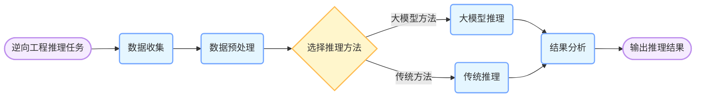

# 大模型在逆向工程推理中的能力边界探索与突破

> 关键词：大模型、逆向工程推理、能力边界、探索、突破

> 摘要：本文聚焦于大模型在逆向工程推理领域的应用，深入探讨其能力边界，并寻求突破的方法。首先介绍了逆向工程推理和大模型的背景知识，明确研究的目的、范围和预期读者。接着阐述大模型在逆向工程推理中的核心概念、联系、算法原理及操作步骤，通过数学模型和公式进行理论支撑。结合项目实战，给出代码实际案例并详细解释。分析大模型在逆向工程推理中的实际应用场景，推荐相关的学习资源、开发工具框架和论文著作。最后总结大模型在该领域的未来发展趋势与挑战，解答常见问题并提供扩展阅读和参考资料，旨在为相关研究和实践提供全面且深入的指导。

## 1. 背景介绍 
### 1.1 目的和范围
逆向工程推理在众多领域如软件安全、硬件设计、知识产权保护等具有重要意义。大模型的出现为逆向工程推理带来了新的机遇和挑战。本研究的目的在于深入探究大模型在逆向工程推理中的能力边界，明确其优势与局限，在此基础上寻求突破的方法和途径，以提升大模型在逆向工程推理中的性能和应用效果。研究范围涵盖了常见的大模型架构，如基于Transformer的语言模型，以及多种逆向工程推理任务，包括代码逆向、硬件电路逆向等。

### 1.2 预期读者
本文预期读者包括从事人工智能、逆向工程、软件工程、硬件设计等领域的研究人员、工程师和技术爱好者。对于希望深入了解大模型在逆向工程推理中应用的专业人士，以及对该领域前沿技术感兴趣的学生和自学人员都具有参考价值。

### 1.3 文档结构概述
本文首先介绍逆向工程推理和大模型的相关背景知识，包括术语定义和概念解释。然后阐述大模型在逆向工程推理中的核心概念、联系、算法原理和操作步骤，通过数学模型和公式进行理论分析。接着结合项目实战，给出代码实际案例并详细解释。之后分析大模型在逆向工程推理中的实际应用场景，推荐相关的学习资源、开发工具框架和论文著作。最后总结大模型在该领域的未来发展趋势与挑战，解答常见问题并提供扩展阅读和参考资料。

### 1.4 术语表
#### 1.4.1 核心术语定义
- **逆向工程推理**：是指通过对产品、系统或代码等的分析和研究，从其表现出的行为、功能和输出等信息，反向推导出其内部结构、设计原理和实现细节的过程。
- **大模型**：通常指具有大量参数的人工智能模型，如基于Transformer架构的语言模型，具有强大的语言理解和生成能力。
- **能力边界**：指大模型在逆向工程推理任务中能够有效发挥作用的范围和限度，超出该范围可能导致性能下降或无法完成任务。

#### 1.4.2 相关概念解释
- **Transformer架构**：是一种基于注意力机制的深度学习架构，在自然语言处理和其他领域取得了显著的成果。它通过多头自注意力机制捕捉序列中元素之间的依赖关系，从而实现对序列的有效建模。
- **注意力机制**：是一种模拟人类注意力的机制，在处理序列数据时，能够自动地关注序列中的重要部分，忽略无关信息，从而提高模型的性能。

#### 1.4.3 缩略词列表
- **GPT**：Generative Pretrained Transformer，生成式预训练Transformer。
- **BERT**：Bidirectional Encoder Representations from Transformers，基于Transformer的双向编码器表示。

## 2. 核心概念与联系 
### 2.1 逆向工程推理的核心概念
逆向工程推理的核心在于通过对目标对象的外部观察和分析，推断其内部的结构和工作原理。在软件领域，逆向工程推理可能涉及对二进制代码的反汇编、反编译，以及对代码逻辑的分析和理解。在硬件领域，可能需要通过对电路的测量和分析，推断其设计和功能。

### 2.2 大模型的核心概念
大模型通常基于深度学习架构，通过大量的数据进行预训练，学习语言的模式和规律。基于Transformer架构的大模型具有强大的语言理解和生成能力，能够处理自然语言文本、代码等多种形式的数据。

### 2.3 大模型与逆向工程推理的联系
大模型可以在逆向工程推理中发挥重要作用。例如，在代码逆向中，大模型可以帮助理解代码的语义，提供代码注释和解释，辅助开发人员进行逆向分析。在硬件逆向中，大模型可以处理相关的技术文档和数据，提供有用的信息和建议。

### 2.4 文本示意图
大模型与逆向工程推理的关系可以用以下文本示意图表示：

逆向工程推理包括软件逆向和硬件逆向等多个领域。大模型作为一种强大的工具，可以应用于逆向工程推理的各个环节，如数据预处理、特征提取、分析推理等。大模型通过学习大量的相关数据，为逆向工程推理提供支持和辅助。

### 2.5 Mermaid流程图


## 3. 核心算法原理 & 具体操作步骤 
### 3.1 大模型的核心算法原理
以基于Transformer架构的大模型为例，其核心算法原理包括多头自注意力机制和前馈神经网络。

#### 3.1.1 多头自注意力机制
多头自注意力机制允许模型在不同的表示子空间中并行地关注输入序列的不同部分。对于输入序列 $X = [x_1, x_2, ..., x_n]$，首先通过线性变换将其映射到查询（$Q$）、键（$K$）和值（$V$）三个矩阵：

$Q = XW^Q$

$K = XW^K$

$V = XW^V$

其中 $W^Q$、$W^K$ 和 $W^V$ 是可学习的权重矩阵。然后计算注意力分数：

$Attention(Q, K, V) = softmax(\frac{QK^T}{\sqrt{d_k}})V$

其中 $d_k$ 是查询和键向量的维度。多头自注意力机制通过多个并行的注意力头来增强模型的表达能力：

$MultiHead(Q, K, V) = Concat(head_1, ..., head_h)W^O$

其中 $head_i = Attention(QW_i^Q, KW_i^K, VW_i^V)$，$W^O$ 是可学习的权重矩阵。

#### 3.1.2 前馈神经网络
在多头自注意力机制之后，模型通过前馈神经网络进行进一步的非线性变换：

$FFN(x) = max(0, xW_1 + b_1)W_2 + b_2$

其中 $W_1$、$W_2$ 是权重矩阵，$b_1$、$b_2$ 是偏置向量。

### 3.2 基于大模型的逆向工程推理具体操作步骤
#### 3.2.1 数据收集
收集与逆向工程推理任务相关的数据，如代码文件、技术文档、硬件电路图纸等。

#### 3.2.2 数据预处理
对收集到的数据进行清洗、标注和特征提取。例如，对于代码数据，可以进行词法分析、语法分析等操作，提取代码的特征表示。

#### 3.2.3 大模型选择和微调
选择合适的大模型，如GPT、BERT等，并根据逆向工程推理任务的特点进行微调。微调的过程通常是在预训练模型的基础上，使用逆向工程推理任务的标注数据进行有监督学习。

#### 3.2.4 推理过程
将预处理后的数据输入到微调后的大模型中，进行推理。大模型根据输入的数据生成相关的推理结果，如代码注释、硬件电路功能解释等。

#### 3.2.5 结果评估和优化
对大模型生成的推理结果进行评估，如使用准确率、召回率等指标。根据评估结果对大模型进行优化，如调整模型参数、增加训练数据等。

### 3.3 Python源代码实现
以下是一个简单的基于Hugging Face Transformers库的大模型微调示例，用于代码注释生成任务：

```python
from transformers import AutoTokenizer, AutoModelForSeq2SeqLM, TrainingArguments, Trainer
import pandas as pd

# 加载预训练模型和分词器
model_name = "t5-base"
tokenizer = AutoTokenizer.from_pretrained(model_name)
model = AutoModelForSeq2SeqLM.from_pretrained(model_name)

# 加载数据集
data = pd.read_csv("code_annotation_dataset.csv")
train_data = data.sample(frac=0.8, random_state=42)
eval_data = data.drop(train_data.index)

# 数据预处理
def preprocess_function(examples):
    inputs = [f"generate annotation: {code}" for code in examples["code"]]
    model_inputs = tokenizer(inputs, max_length=512, truncation=True)

    # Setup the tokenizer for targets
    with tokenizer.as_target_tokenizer():
        labels = tokenizer(examples["annotation"], max_length=128, truncation=True)

    model_inputs["labels"] = labels["input_ids"]
    return model_inputs

train_dataset = train_data.map(preprocess_function, batched=True)
eval_dataset = eval_data.map(preprocess_function, batched=True)

# 训练参数设置
training_args = TrainingArguments(
    output_dir='./results',          # output directory
    num_train_epochs=3,              # total number of training epochs
    per_device_train_batch_size=16,  # batch size per device during training
    per_device_eval_batch_size=64,   # batch size for evaluation
    warmup_steps=500,                # number of warmup steps for learning rate scheduler
    weight_decay=0.01,               # strength of weight decay
    logging_dir='./logs',            # directory for storing logs
    logging_steps=10,
    evaluation_strategy="steps",
    eval_steps=50,
    save_steps=1000,
    save_total_limit=2,
)

# 定义Trainer
trainer = Trainer(
    model=model,
    args=training_args,
    train_dataset=train_dataset,
    eval_dataset=eval_dataset,
)

# 训练模型
trainer.train()

# 保存模型
trainer.save_model("./fine_tuned_model")
```

## 4. 数学模型和公式 & 详细讲解 & 举例说明 
### 4.1 大模型的损失函数
在大模型的微调过程中，通常使用交叉熵损失函数来衡量模型预测结果与真实标签之间的差异。对于一个分类任务，交叉熵损失函数的定义如下：

$$L(y, \hat{y}) = -\sum_{i=1}^{C} y_i \log(\hat{y}_i)$$

其中 $y$ 是真实标签的概率分布，$\hat{y}$ 是模型预测的概率分布，$C$ 是类别数。

### 4.2 梯度下降优化算法
为了最小化损失函数，通常使用梯度下降优化算法来更新模型的参数。梯度下降算法的基本思想是沿着损失函数的负梯度方向更新参数：

$$\theta_{t+1} = \theta_t - \alpha \nabla L(\theta_t)$$

其中 $\theta$ 是模型的参数，$\alpha$ 是学习率，$\nabla L(\theta_t)$ 是损失函数在 $\theta_t$ 处的梯度。

### 4.3 举例说明
假设我们有一个简单的二分类任务，真实标签 $y = [1, 0]$，模型预测的概率分布 $\hat{y} = [0.8, 0.2]$。则交叉熵损失函数的值为：

$$L(y, \hat{y}) = -(1 \times \log(0.8) + 0 \times \log(0.2)) \approx 0.223$$

假设模型的参数 $\theta$ 是一个标量，损失函数 $L(\theta) = \theta^2$，学习率 $\alpha = 0.1$。在 $\theta = 1$ 处，损失函数的梯度 $\nabla L(\theta) = 2\theta = 2$。则更新后的参数值为：

$$\theta_{t+1} = 1 - 0.1 \times 2 = 0.8$$

## 5. 项目实战：代码实际案例和详细解释说明 
### 5.1  开发环境搭建
#### 5.1.1 操作系统
可以选择Linux、Windows或macOS等操作系统。建议使用Linux系统，因为它在开发和部署深度学习模型方面具有更好的性能和兼容性。

#### 5.1.2 编程语言
使用Python作为开发语言，Python具有丰富的深度学习库和工具，方便进行大模型的开发和训练。

#### 5.1.3 深度学习框架
使用Hugging Face Transformers库，它提供了各种预训练的大模型和工具，方便进行模型的加载、微调等操作。

#### 5.1.4 安装依赖库
在终端中运行以下命令安装所需的依赖库：

```bash
pip install transformers pandas datasets
```

### 5.2  源代码详细实现和代码解读
以下是一个完整的代码注释生成项目的源代码示例：

```python
from transformers import AutoTokenizer, AutoModelForSeq2SeqLM, TrainingArguments, Trainer
import pandas as pd
from datasets import Dataset

# 加载预训练模型和分词器
model_name = "t5-base"
tokenizer = AutoTokenizer.from_pretrained(model_name)
model = AutoModelForSeq2SeqLM.from_pretrained(model_name)

# 加载数据集
data = pd.read_csv("code_annotation_dataset.csv")
train_data = data.sample(frac=0.8, random_state=42)
eval_data = data.drop(train_data.index)

# 将DataFrame转换为Dataset对象
train_dataset = Dataset.from_pandas(train_data)
eval_dataset = Dataset.from_pandas(eval_data)

# 数据预处理
def preprocess_function(examples):
    inputs = [f"generate annotation: {code}" for code in examples["code"]]
    model_inputs = tokenizer(inputs, max_length=512, truncation=True)

    # Setup the tokenizer for targets
    with tokenizer.as_target_tokenizer():
        labels = tokenizer(examples["annotation"], max_length=128, truncation=True)

    model_inputs["labels"] = labels["input_ids"]
    return model_inputs

train_dataset = train_dataset.map(preprocess_function, batched=True)
eval_dataset = eval_dataset.map(preprocess_function, batched=True)

# 训练参数设置
training_args = TrainingArguments(
    output_dir='./results',          # output directory
    num_train_epochs=3,              # total number of training epochs
    per_device_train_batch_size=16,  # batch size per device during training
    per_device_eval_batch_size=64,   # batch size for evaluation
    warmup_steps=500,                # number of warmup steps for learning rate scheduler
    weight_decay=0.01,               # strength of weight decay
    logging_dir='./logs',            # directory for storing logs
    logging_steps=10,
    evaluation_strategy="steps",
    eval_steps=50,
    save_steps=1000,
    save_total_limit=2,
)

# 定义Trainer
trainer = Trainer(
    model=model,
    args=training_args,
    train_dataset=train_dataset,
    eval_dataset=eval_dataset,
)

# 训练模型
trainer.train()

# 保存模型
trainer.save_model("./fine_tuned_model")

# 加载微调后的模型进行推理
fine_tuned_model = AutoModelForSeq2SeqLM.from_pretrained("./fine_tuned_model")

# 定义推理函数
def generate_annotation(code):
    input_text = f"generate annotation: {code}"
    input_ids = tokenizer(input_text, return_tensors="pt").input_ids
    output = fine_tuned_model.generate(input_ids)
    annotation = tokenizer.decode(output[0], skip_special_tokens=True)
    return annotation

# 示例代码
example_code = "def add(a, b): return a + b"
annotation = generate_annotation(example_code)
print(f"Code: {example_code}")
print(f"Annotation: {annotation}")
```

### 5.3  代码解读与分析
#### 5.3.1 模型和分词器的加载
使用 `AutoTokenizer.from_pretrained` 和 `AutoModelForSeq2SeqLM.from_pretrained` 函数加载预训练的模型和分词器。

#### 5.3.2 数据集的加载和预处理
使用 `pandas` 库加载数据集，并将其划分为训练集和验证集。然后使用 `datasets` 库将 `DataFrame` 转换为 `Dataset` 对象。数据预处理函数 `preprocess_function` 对输入的代码和注释进行分词，并将注释作为标签。

#### 5.3.3 训练参数的设置
使用 `TrainingArguments` 类设置训练的参数，如训练轮数、批量大小、学习率调度等。

#### 5.3.4 模型的训练和保存
使用 `Trainer` 类进行模型的训练，并使用 `trainer.save_model` 函数保存微调后的模型。

#### 5.3.5 推理过程
加载微调后的模型，定义推理函数 `generate_annotation`，输入代码，输出对应的注释。

## 6. 实际应用场景 
### 6.1 软件逆向工程
在软件逆向工程中，大模型可以帮助理解二进制代码的语义，提供代码注释和解释，辅助开发人员进行漏洞分析、软件破解等任务。例如，在分析恶意软件时，大模型可以快速理解恶意代码的功能和行为，为安全分析提供支持。

### 6.2 硬件逆向工程
在硬件逆向工程中，大模型可以处理相关的技术文档和数据，提供有用的信息和建议。例如，在分析硬件电路时，大模型可以根据电路图纸和相关数据，推断电路的功能和工作原理，帮助工程师进行硬件设计和优化。

### 6.3 知识产权保护
大模型可以用于检测软件和硬件产品中的知识产权侵权行为。通过对代码和设计文档的分析，大模型可以识别出相似的部分，为知识产权保护提供证据。

### 6.4 教育和培训
在教育和培训领域，大模型可以作为教学辅助工具，帮助学生理解复杂的代码和技术原理。例如，在编程课程中，大模型可以为学生提供代码注释和解释，帮助他们更好地理解代码的逻辑。

## 7. 工具和资源推荐
### 7.1 学习资源推荐
#### 7.1.1 书籍推荐
- 《深度学习》（Deep Learning）：由Ian Goodfellow、Yoshua Bengio和Aaron Courville合著，是深度学习领域的经典教材，介绍了深度学习的基本概念、算法和应用。
- 《Python深度学习》（Deep Learning with Python）：由Francois Chollet著，介绍了如何使用Python和Keras库进行深度学习模型的开发和训练。
- 《自然语言处理入门》（Natural Language Processing with Python）：由Steven Bird、Ewan Klein和Edward Loper合著，介绍了自然语言处理的基本概念、算法和应用。

#### 7.1.2 在线课程
- Coursera上的“深度学习专项课程”（Deep Learning Specialization）：由Andrew Ng教授授课，介绍了深度学习的基本概念、算法和应用。
- edX上的“人工智能基础”（Introduction to Artificial Intelligence）：由MIT的教师授课，介绍了人工智能的基本概念、算法和应用。
- 哔哩哔哩上的“李宏毅机器学习课程”：由台湾大学的李宏毅教授授课，介绍了机器学习的基本概念、算法和应用。

#### 7.1.3 技术博客和网站
- Hugging Face博客：提供了关于大模型的最新研究成果、技术文章和应用案例。
- Medium上的AI相关博客：有许多人工智能领域的专家和爱好者分享的技术文章和经验。
- 机器之心：专注于人工智能领域的资讯和技术报道，提供了丰富的学习资源和案例分析。

### 7.2 开发工具框架推荐
#### 7.2.1 IDE和编辑器
- PyCharm：是一款专业的Python集成开发环境，提供了丰富的代码编辑、调试和项目管理功能。
- Visual Studio Code：是一款轻量级的代码编辑器，支持多种编程语言和插件，方便进行深度学习模型的开发和调试。
- Jupyter Notebook：是一款交互式的笔记本环境，适合进行数据探索、模型训练和结果展示。

#### 7.2.2 调试和性能分析工具
- TensorBoard：是TensorFlow提供的可视化工具，可以用于查看模型的训练过程、性能指标和网络结构。
- PyTorch Profiler：是PyTorch提供的性能分析工具，可以用于分析模型的性能瓶颈和资源使用情况。
- NVIDIA Nsight Systems：是NVIDIA提供的性能分析工具，可以用于分析GPU加速的深度学习模型的性能。

#### 7.2.3 相关框架和库
- Hugging Face Transformers：提供了各种预训练的大模型和工具，方便进行模型的加载、微调等操作。
- PyTorch：是一个开源的深度学习框架，具有强大的计算能力和灵活的编程接口。
- TensorFlow：是一个开源的深度学习框架，具有广泛的应用和丰富的工具库。

### 7.3 相关论文著作推荐
#### 7.3.1 经典论文
- “Attention Is All You Need”：介绍了Transformer架构，是自然语言处理领域的经典论文。
- “BERT: Pre-training of Deep Bidirectional Transformers for Language Understanding”：介绍了BERT模型，开创了预训练语言模型的先河。
- “Generative Pretrained Transformer 3”：介绍了GPT-3模型，展示了大模型在语言生成任务中的强大能力。

#### 7.3.2 最新研究成果
- 关注顶级学术会议如NeurIPS、ICML、ACL等的最新论文，了解大模型在逆向工程推理等领域的最新研究成果。
- 关注预印本平台如arXiv，获取最新的研究论文和技术报告。

#### 7.3.3 应用案例分析
- 研究相关的工业界应用案例，了解大模型在实际项目中的应用效果和经验教训。
- 参考开源项目的文档和代码，学习大模型在逆向工程推理中的具体实现方法。

## 8. 总结：未来发展趋势与挑战
### 8.1 未来发展趋势
#### 8.1.1 模型性能的提升
随着计算资源的不断增加和算法的不断改进，大模型的性能将不断提升。模型的参数数量将进一步增加，语言理解和生成能力将更加出色，能够处理更加复杂的逆向工程推理任务。

#### 8.1.2 跨领域融合
大模型将与其他领域的技术如计算机视觉、知识图谱等进行融合，实现多模态的逆向工程推理。例如，结合计算机视觉技术，可以对硬件电路的图像进行分析和理解，提高硬件逆向工程的效率。

#### 8.1.3 自动化和智能化
大模型将在逆向工程推理中实现更高程度的自动化和智能化。例如，自动识别逆向工程推理任务的类型，选择合适的模型和方法进行处理，减少人工干预。

### 8.2 挑战
#### 8.2.1 计算资源需求
大模型的训练和推理需要大量的计算资源，如GPU集群等。这对于许多研究机构和企业来说是一个巨大的挑战，需要不断优化模型和算法，降低计算资源的需求。

#### 8.2.2 数据隐私和安全
逆向工程推理任务通常涉及到敏感数据，如代码、设计文档等。大模型的应用需要确保数据的隐私和安全，防止数据泄露和滥用。

#### 8.2.3 可解释性
大模型通常是黑盒模型，其决策过程难以解释。在逆向工程推理中，需要提高模型的可解释性，以便开发人员和安全专家能够理解模型的推理过程和结果。

## 9. 附录：常见问题与解答
### 9.1 大模型在逆向工程推理中的准确率如何？
大模型在逆向工程推理中的准确率受到多种因素的影响，如模型的架构、训练数据的质量和数量、任务的复杂程度等。一般来说，通过合理的模型选择和微调，大模型可以在一定程度上提高逆向工程推理的准确率。

### 9.2 如何选择合适的大模型进行逆向工程推理？
选择合适的大模型需要考虑任务的特点、数据的类型和规模等因素。例如，如果任务是代码注释生成，可以选择基于Transformer架构的语言模型，如T5、GPT等。同时，需要根据数据的规模和质量进行模型的微调，以提高模型的性能。

### 9.3 大模型在逆向工程推理中存在哪些局限性？
大模型在逆向工程推理中存在一些局限性，如对复杂逻辑的理解能力有限、对缺乏标注数据的任务效果不佳、计算资源需求大等。此外，大模型的可解释性较差，其决策过程难以理解和解释。

### 9.4 如何提高大模型在逆向工程推理中的性能？
可以通过以下方法提高大模型在逆向工程推理中的性能：
- 增加训练数据的数量和质量，提高模型的泛化能力。
- 选择合适的模型架构和超参数，进行模型的微调。
- 结合其他技术和方法，如知识图谱、规则推理等，提高模型的推理能力。
- 优化模型的训练和推理过程，提高计算效率。

## 10. 扩展阅读 & 参考资料
### 10.1 扩展阅读
- 《人工智能：一种现代的方法》（Artificial Intelligence: A Modern Approach）：全面介绍了人工智能的基本概念、算法和应用。
- 《深度学习实战》（Deep Learning in Practice）：介绍了深度学习在各个领域的实际应用案例和经验。
- 《自然语言处理实战》（Natural Language Processing in Practice）：介绍了自然语言处理的实际应用和技术细节。

### 10.2 参考资料
- Hugging Face官方文档：https://huggingface.co/docs
- PyTorch官方文档：https://pytorch.org/docs/stable/index.html
- TensorFlow官方文档：https://www.tensorflow.org/api_docs
- 相关学术论文和技术报告，可以在学术数据库如IEEE Xplore、ACM Digital Library等中查找。