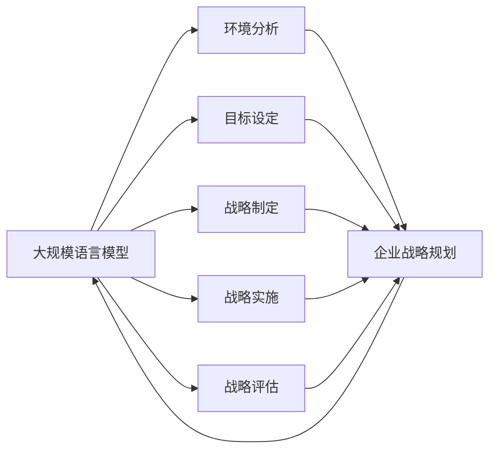

# 大规模语言模型在企业战略规划中的推理应用

> 关键词：大规模语言模型、企业战略规划、推理应用、自然语言处理、数据分析、决策支持、人工智能

> 摘要：本文聚焦于大规模语言模型在企业战略规划中的推理应用。首先介绍了相关背景，包括研究目的、预期读者等内容。接着阐述了大规模语言模型及企业战略规划的核心概念与联系，通过文本示意图和 Mermaid 流程图呈现其架构关系。详细讲解了核心算法原理，并给出 Python 源代码示例，同时深入分析了相关数学模型和公式。通过项目实战，展示了代码实现及解读。探讨了其在企业战略规划中的实际应用场景，推荐了相关学习资源、开发工具框架及论文著作。最后总结了未来发展趋势与挑战，提供了常见问题解答及扩展阅读参考资料，旨在全面剖析大规模语言模型在企业战略规划推理应用中的各个方面，为企业更好地利用这一技术提供理论和实践指导。

## 1. 背景介绍 
### 1.1 目的和范围
在当今数字化时代，企业面临着日益复杂和快速变化的市场环境，制定科学合理的战略规划对于企业的生存和发展至关重要。大规模语言模型的出现为企业战略规划带来了新的机遇和挑战。本文章的目的在于深入探讨大规模语言模型在企业战略规划中的推理应用，详细分析其原理、方法和实际应用效果。范围涵盖了从大规模语言模型的基本概念到其在企业战略规划各个环节的具体应用，包括市场趋势分析、竞争对手评估、战略决策制定等方面。

### 1.2 预期读者
本文预期读者包括企业战略规划师、企业高管、市场分析师、数据科学家、人工智能研究人员以及对企业战略规划和大规模语言模型应用感兴趣的相关人士。这些读者希望通过了解大规模语言模型在企业战略规划中的推理应用，提升自身在战略决策和数据分析方面的能力，为企业的发展提供更科学的依据。

### 1.3 文档结构概述
本文将按照以下结构进行阐述：首先介绍背景信息，包括目的、预期读者和文档结构概述等内容；接着阐述大规模语言模型和企业战略规划的核心概念与联系；然后详细讲解核心算法原理及具体操作步骤，同时给出相关数学模型和公式；通过项目实战展示代码实现和详细解释；探讨其在企业战略规划中的实际应用场景；推荐相关工具和资源；总结未来发展趋势与挑战；提供常见问题解答及扩展阅读参考资料。

### 1.4 术语表
#### 1.4.1 核心术语定义
- **大规模语言模型**：基于深度学习技术，通过在大规模文本数据上进行训练，学习语言的统计规律和语义信息，能够生成自然语言文本、进行语言理解和推理的人工智能模型，如 GPT - 3、BERT 等。
- **企业战略规划**：企业为实现长期目标，对自身内外部环境进行全面分析和评估，制定一系列具有全局性、长远性和方向性的决策和行动计划的过程。
- **推理应用**：利用大规模语言模型的能力，对相关数据和信息进行分析、判断和预测，为企业战略规划提供支持和决策依据的应用方式。

#### 1.4.2 相关概念解释
- **自然语言处理（NLP）**：研究人与计算机之间用自然语言进行有效通信的各种理论和方法，是大规模语言模型的核心技术基础，包括文本分类、情感分析、命名实体识别等任务。
- **数据分析**：对收集到的数据进行清洗、转换、分析和可视化等操作，以发现数据中的规律和价值，为企业决策提供支持，在企业战略规划中起着重要作用。
- **决策支持系统（DSS）**：辅助决策者通过数据、模型和知识，以人机交互方式进行半结构化或非结构化决策的计算机应用系统，大规模语言模型的推理应用可以为 DSS 提供更强大的支持。

#### 1.4.3 缩略词列表
- **NLP**：Natural Language Processing（自然语言处理）
- **DSS**：Decision Support System（决策支持系统）
- **GPT**：Generative Pretrained Transformer（生成式预训练变换器）
- **BERT**：Bidirectional Encoder Representations from Transformers（基于变换器的双向编码器表示）

## 2. 核心概念与联系 

### 大规模语言模型原理
大规模语言模型通常基于深度学习中的神经网络架构，如 Transformer 架构。Transformer 架构由编码器和解码器组成，其中编码器负责对输入的文本进行特征提取和表示，解码器则根据编码器的输出生成相应的文本。其核心机制是注意力机制，注意力机制能够让模型在处理文本时关注到不同位置的信息，从而更好地捕捉文本的语义和上下文关系。

文本示意图：
大规模语言模型接收输入文本，经过嵌入层将文本转换为向量表示，然后通过多个 Transformer 层进行特征提取和变换，最后经过输出层生成预测的文本或概率分布。

Mermaid 流程图：


### 企业战略规划架构
企业战略规划一般包括以下几个主要环节：环境分析、目标设定、战略制定、战略实施和战略评估。环境分析包括对企业内部资源和能力的评估以及对外部市场环境、竞争对手等的分析；目标设定是根据环境分析的结果确定企业的长期和短期目标；战略制定是基于目标和环境分析制定具体的战略方案；战略实施是将战略方案付诸实践；战略评估是对战略实施的效果进行评估和反馈，以便对战略进行调整和优化。

文本示意图：
企业战略规划从环境分析开始，根据分析结果设定目标，基于目标制定战略，然后实施战略，最后对战略实施效果进行评估，评估结果反馈到环境分析环节，形成一个闭环的循环过程。

Mermaid 流程图：


### 大规模语言模型与企业战略规划的联系
大规模语言模型可以在企业战略规划的各个环节发挥重要作用。在环境分析阶段，大规模语言模型可以对大量的市场数据、新闻报道、社交媒体信息等进行文本分析，提取有价值的信息，如市场趋势、竞争对手动态等，帮助企业更好地了解内外部环境。在目标设定阶段，大规模语言模型可以根据环境分析的结果，结合企业的历史数据和行业标准，为企业提供合理的目标建议。在战略制定阶段，大规模语言模型可以对各种战略方案进行评估和预测，分析其可行性和潜在风险，为企业选择最优战略提供支持。在战略实施阶段，大规模语言模型可以对实施过程中的数据进行实时监测和分析，及时发现问题并提供解决方案。在战略评估阶段，大规模语言模型可以对战略实施的效果进行量化评估，分析其与预期目标的差距，为战略调整提供依据。

文本示意图：
大规模语言模型贯穿于企业战略规划的各个环节，为每个环节提供数据支持、分析和决策建议，与企业战略规划形成一个相互关联、相互促进的整体。

Mermaid 流程图：


## 3. 核心算法原理 & 具体操作步骤 

### 核心算法原理
大规模语言模型的核心算法基于深度学习中的神经网络，以 Transformer 架构为例，其核心机制包括多头注意力机制和前馈神经网络。

#### 多头注意力机制
多头注意力机制允许模型在不同的表示子空间中并行地关注输入序列的不同部分，从而捕捉到更丰富的信息。多头注意力的计算公式如下：
$$
\text{MultiHead}(Q, K, V) = \text{Concat}(\text{head}_1, \cdots, \text{head}_h)W^O
$$
其中，
$$
\text{head}_i = \text{Attention}(QW_i^Q, KW_i^K, VW_i^V)
$$
$$
\text{Attention}(Q, K, V) = \text{softmax}(\frac{QK^T}{\sqrt{d_k}})V
$$
$Q$、$K$、$V$ 分别是查询、键和值矩阵，$W_i^Q$、$W_i^K$、$W_i^V$ 是可学习的权重矩阵，$d_k$ 是键向量的维度，$W^O$ 是输出权重矩阵。

#### 前馈神经网络
前馈神经网络由两个线性层和一个激活函数组成，通常使用 ReLU 激活函数。其计算公式如下：
$$
\text{FFN}(x) = \text{max}(0, xW_1 + b_1)W_2 + b_2
$$
其中，$W_1$、$W_2$ 是可学习的权重矩阵，$b_1$、$b_2$ 是偏置向量。

### Python 源代码示例
以下是一个简单的基于 PyTorch 实现的多头注意力机制的代码示例：

```python
import torch
import torch.nn as nn

class MultiHeadAttention(nn.Module):
    def __init__(self, d_model, num_heads):
        super(MultiHeadAttention, self).__init__()
        assert d_model % num_heads == 0, "d_model must be divisible by num_heads"

        self.d_model = d_model
        self.num_heads = num_heads
        self.d_k = d_model // num_heads

        self.W_q = nn.Linear(d_model, d_model)
        self.W_k = nn.Linear(d_model, d_model)
        self.W_v = nn.Linear(d_model, d_model)
        self.W_o = nn.Linear(d_model, d_model)

    def scaled_dot_product_attention(self, Q, K, V, mask=None):
        attn_scores = torch.matmul(Q, K.transpose(-2, -1)) / torch.sqrt(torch.tensor(self.d_k, dtype=torch.float32))
        if mask is not None:
            attn_scores = attn_scores.masked_fill(mask == 0, -1e9)
        attn_probs = torch.softmax(attn_scores, dim=-1)
        output = torch.matmul(attn_probs, V)
        return output

    def split_heads(self, x):
        batch_size, seq_length, d_model = x.size()
        return x.view(batch_size, seq_length, self.num_heads, self.d_k).transpose(1, 2)

    def combine_heads(self, x):
        batch_size, num_heads, seq_length, d_k = x.size()
        return x.transpose(1, 2).contiguous().view(batch_size, seq_length, self.d_model)

    def forward(self, Q, K, V, mask=None):
        Q = self.split_heads(self.W_q(Q))
        K = self.split_heads(self.W_k(K))
        V = self.split_heads(self.W_v(V))

        attn_output = self.scaled_dot_product_attention(Q, K, V, mask)
        output = self.W_o(self.combine_heads(attn_output))
        return output
```

### 具体操作步骤
1. **数据预处理**：将文本数据进行清洗、分词、编码等操作，将其转换为模型可以处理的输入格式。
2. **模型训练**：使用大规模的文本数据对模型进行训练，通过优化损失函数来调整模型的参数，使其能够学习到语言的统计规律和语义信息。
3. **推理应用**：在企业战略规划中，将相关的文本数据输入到训练好的模型中，模型根据输入的信息进行推理和分析，输出相应的结果，如市场趋势预测、竞争对手分析等。
4. **结果评估和优化**：对模型输出的结果进行评估，根据评估结果对模型进行优化和调整，以提高模型的准确性和可靠性。

## 4. 数学模型和公式 & 详细讲解 & 举例说明 

### 损失函数
在训练大规模语言模型时，通常使用交叉熵损失函数来衡量模型预测结果与真实标签之间的差异。交叉熵损失函数的计算公式如下：
$$
L = -\frac{1}{N}\sum_{i=1}^{N}\sum_{j=1}^{C}y_{ij}\log(p_{ij})
$$
其中，$N$ 是样本数量，$C$ 是类别数量，$y_{ij}$ 是第 $i$ 个样本的第 $j$ 个类别的真实标签（通常为 0 或 1），$p_{ij}$ 是模型预测第 $i$ 个样本属于第 $j$ 个类别的概率。

详细讲解：交叉熵损失函数的目的是最小化模型预测结果与真实标签之间的差异。当模型预测的概率分布与真实标签的分布越接近时，交叉熵损失函数的值越小。通过不断优化损失函数，模型可以学习到更准确的语言表示和预测能力。

举例说明：假设有一个文本分类任务，共有 3 个类别（$C = 3$），有 2 个样本（$N = 2$）。真实标签为 $y_1 = [1, 0, 0]$ 和 $y_2 = [0, 1, 0]$，模型预测的概率分布为 $p_1 = [0.8, 0.1, 0.1]$ 和 $p_2 = [0.2, 0.7, 0.1]$。则交叉熵损失函数的值为：
$$
L = -\frac{1}{2}[(1\times\log(0.8) + 0\times\log(0.1) + 0\times\log(0.1)) + (0\times\log(0.2) + 1\times\log(0.7) + 0\times\log(0.1))]
$$

### 优化算法
常用的优化算法有随机梯度下降（SGD）、Adagrad、Adadelta、Adam 等。以 Adam 算法为例，其更新参数的公式如下：
$$
m_t = \beta_1m_{t - 1}+(1 - \beta_1)g_t
$$
$$
v_t = \beta_2v_{t - 1}+(1 - \beta_2)g_t^2
$$
$$
\hat{m}_t=\frac{m_t}{1 - \beta_1^t}
$$
$$
\hat{v}_t=\frac{v_t}{1 - \beta_2^t}
$$
$$
\theta_{t + 1}=\theta_t-\frac{\alpha}{\sqrt{\hat{v}_t}+\epsilon}\hat{m}_t
$$
其中，$m_t$ 和 $v_t$ 分别是梯度的一阶矩估计和二阶矩估计，$\beta_1$ 和 $\beta_2$ 是衰减率，$g_t$ 是当前时刻的梯度，$\alpha$ 是学习率，$\epsilon$ 是一个很小的常数，用于防止分母为零，$\theta_t$ 是当前时刻的参数。

详细讲解：Adam 算法结合了动量和自适应学习率的思想，通过对梯度的一阶矩和二阶矩进行估计，动态地调整每个参数的学习率。这样可以加快模型的收敛速度，提高训练效率。

举例说明：假设模型有一个参数 $\theta$，初始值为 $\theta_0 = 1$，学习率 $\alpha = 0.001$，$\beta_1 = 0.9$，$\beta_2 = 0.999$，$\epsilon = 1e - 8$。在第 1 个时刻，梯度 $g_1 = 0.1$，则：
$$
m_1 = 0.9\times0 + (1 - 0.9)\times0.1 = 0.01
$$
$$
v_1 = 0.999\times0+(1 - 0.999)\times0.1^2 = 1e - 5
$$
$$
\hat{m}_1=\frac{0.01}{1 - 0.9^1}=0.1
$$
$$
\hat{v}_1=\frac{1e - 5}{1 - 0.999^1}=0.01
$$
$$
\theta_1 = 1-\frac{0.001}{\sqrt{0.01}+1e - 8}\times0.1\approx0.999
$$

## 5. 项目实战：代码实际案例和详细解释说明 

### 5.1  开发环境搭建
1. **安装 Python**：建议使用 Python 3.7 及以上版本，可以从 Python 官方网站（https://www.python.org/downloads/） 下载并安装。
2. **安装深度学习框架**：本文使用 PyTorch 作为深度学习框架，可以根据自己的系统和 CUDA 版本选择合适的安装方式，具体安装命令可以参考 PyTorch 官方网站（https://pytorch.org/get-started/locally/）。
3. **安装相关库**：安装一些常用的库，如 numpy、pandas、transformers 等，可以使用 pip 命令进行安装：
```sh
pip install numpy pandas transformers
```

### 5.2  源代码详细实现和代码解读
以下是一个使用 Hugging Face 的 Transformers 库进行文本分类的示例代码，用于分析市场新闻文本的情感倾向，为企业战略规划提供市场情绪信息：

```python
import torch
from transformers import AutoTokenizer, AutoModelForSequenceClassification

# 加载预训练的模型和分词器
model_name = "distilbert-base-uncased-finetuned-sst-2-english"
tokenizer = AutoTokenizer.from_pretrained(model_name)
model = AutoModelForSequenceClassification.from_pretrained(model_name)

# 定义要分析的市场新闻文本
news_text = "The company's new product has received positive reviews from customers."

# 对文本进行分词和编码
inputs = tokenizer(news_text, return_tensors="pt")

# 进行推理
with torch.no_grad():
    outputs = model(**inputs)

# 获取预测结果
logits = outputs.logits
predicted_class_id = logits.argmax().item()
label = model.config.id2label[predicted_class_id]

print(f"新闻文本的情感倾向: {label}")
```

代码解读：
1. **加载预训练的模型和分词器**：使用 `AutoTokenizer` 和 `AutoModelForSequenceClassification` 从 Hugging Face 的模型库中加载预训练的模型和对应的分词器。这里选择的是 `distilbert-base-uncased-finetuned-sst-2-english` 模型，该模型是在英文情感分类任务上进行了微调的。
2. **定义要分析的市场新闻文本**：将需要分析的市场新闻文本赋值给 `news_text` 变量。
3. **对文本进行分词和编码**：使用分词器对文本进行分词和编码，将其转换为模型可以处理的输入格式。`return_tensors="pt"` 表示返回 PyTorch 张量。
4. **进行推理**：使用 `torch.no_grad()` 上下文管理器来禁用梯度计算，提高推理效率。将编码后的输入传递给模型，得到模型的输出。
5. **获取预测结果**：从模型的输出中获取 logits 值，使用 `argmax()` 函数找到最大值的索引，该索引对应预测的类别 ID。通过 `model.config.id2label` 字典将类别 ID 转换为对应的标签，最后打印出预测的情感倾向。

### 5.3  代码解读与分析
- **模型选择**：选择合适的预训练模型对于任务的性能至关重要。在这个示例中，选择了在英文情感分类任务上进行了微调的模型，因为该模型已经在相关任务上进行了训练，能够更好地处理情感分类问题。
- **分词和编码**：分词和编码是将文本数据转换为模型可以处理的输入格式的关键步骤。分词器将文本分割成一个个的词元（tokens），并将其转换为对应的词元 ID。不同的模型有不同的分词器和编码方式，需要根据具体的模型进行选择。
- **推理过程**：在推理过程中，使用 `torch.no_grad()` 上下文管理器可以避免不必要的梯度计算，提高推理效率。模型的输出通常是 logits 值，需要根据具体的任务进行后续处理，如使用 `argmax()` 函数找到预测的类别。
- **结果分析**：预测的结果可以为企业战略规划提供有价值的信息。例如，如果市场新闻文本的情感倾向为积极，说明市场对企业的产品或服务有较好的评价，企业可以考虑加大市场推广力度；如果情感倾向为消极，企业则需要及时调整战略，改进产品或服务。

## 6. 实际应用场景 
### 市场趋势分析
大规模语言模型可以对大量的市场新闻、行业报告、社交媒体数据等进行分析，提取市场趋势信息。例如，通过分析新闻文本中关于新兴技术、消费者需求变化等方面的内容，企业可以及时了解市场的发展方向，调整产品研发和市场推广策略。

### 竞争对手评估
利用大规模语言模型对竞争对手的新闻报道、产品介绍、用户评价等进行分析，了解竞争对手的优势和劣势。例如，分析竞争对手产品的用户评价，找出其产品的不足之处，企业可以针对性地改进自己的产品，提高市场竞争力。

### 战略决策制定
在制定企业战略时，大规模语言模型可以根据企业的内外部环境信息，为企业提供多种战略方案，并对这些方案进行评估和预测。例如，分析不同战略方案在不同市场环境下的可行性和潜在风险，帮助企业选择最优的战略方案。

### 客户需求理解
通过分析客户的反馈、评论、咨询等文本数据，大规模语言模型可以深入了解客户的需求和偏好。企业可以根据这些信息进行产品创新和服务优化，提高客户满意度和忠诚度。

### 风险预警
大规模语言模型可以实时监测市场动态和行业信息，及时发现潜在的风险因素。例如，分析新闻报道中关于政策变化、经济形势、自然灾害等方面的内容，企业可以提前做好应对准备，降低风险损失。

## 7. 工具和资源推荐
### 7.1 学习资源推荐
#### 7.1.1 书籍推荐
- 《深度学习》（Deep Learning）：由 Ian Goodfellow、Yoshua Bengio 和 Aaron Courville 所著，是深度学习领域的经典教材，涵盖了深度学习的基本原理、算法和应用。
- 《自然语言处理入门》（Natural Language Processing in Action）：由 Hobson Lane、Cole Howard 和 Hannes Hapke 所著，介绍了自然语言处理的基本概念、技术和应用，适合初学者阅读。
- 《Python 深度学习》（Deep Learning with Python）：由 Francois Chollet 所著，结合 Keras 深度学习框架，详细介绍了如何使用 Python 进行深度学习开发。

#### 7.1.2 在线课程
- Coursera 上的“深度学习专项课程”（Deep Learning Specialization）：由 Andrew Ng 教授授课，包括深度学习的基础知识、卷积神经网络、循环神经网络等内容。
- edX 上的“自然语言处理”（Natural Language Processing）：由麻省理工学院（MIT）提供，系统地介绍了自然语言处理的理论和方法。
- Udemy 上的“Python 自然语言处理实战”（Natural Language Processing with Python）：通过实际项目讲解如何使用 Python 进行自然语言处理开发。

#### 7.1.3 技术博客和网站
- Hugging Face 博客（https://huggingface.co/blog）：提供了关于大规模语言模型、自然语言处理等方面的最新研究成果和技术应用案例。
- Towards Data Science（https://towardsdatascience.com/）：是一个数据科学和机器学习领域的技术博客，有很多关于大规模语言模型和企业战略规划应用的文章。
- arXiv（https://arxiv.org/）：是一个预印本平台，包含了大量的学术论文，涵盖了人工智能、自然语言处理等领域的最新研究成果。

### 7.2 开发工具框架推荐
#### 7.2.1 IDE和编辑器
- PyCharm：是一款专门为 Python 开发设计的集成开发环境（IDE），提供了代码编辑、调试、版本控制等功能，适合大规模项目的开发。
- Visual Studio Code：是一款轻量级的代码编辑器，支持多种编程语言，通过安装插件可以方便地进行 Python 开发。
- Jupyter Notebook：是一个交互式的开发环境，适合进行数据分析和模型训练的实验和演示。

#### 7.2.2 调试和性能分析工具
- PyTorch Profiler：是 PyTorch 提供的性能分析工具，可以帮助开发者分析模型训练和推理过程中的性能瓶颈，优化代码性能。
- TensorBoard：是 TensorFlow 提供的可视化工具，也可以与 PyTorch 结合使用，用于可视化模型训练过程中的损失函数、准确率等指标。
- cProfile：是 Python 内置的性能分析工具，可以分析 Python 代码的执行时间和函数调用关系。

#### 7.2.3 相关框架和库
- PyTorch：是一个开源的深度学习框架，提供了丰富的深度学习模型和工具，支持 GPU 加速，广泛应用于自然语言处理、计算机视觉等领域。
- TensorFlow：是另一个流行的深度学习框架，具有强大的分布式训练和部署能力，也有很多自然语言处理相关的工具和模型。
- Transformers：是 Hugging Face 开发的一个自然语言处理库，提供了大量的预训练模型和工具，方便开发者进行自然语言处理任务的开发。

### 7.3 相关论文著作推荐
#### 7.3.1 经典论文
- “Attention Is All You Need”：提出了 Transformer 架构，是大规模语言模型的核心技术基础。
- “BERT: Pre-training of Deep Bidirectional Transformers for Language Understanding”：介绍了 BERT 模型，开创了预训练 - 微调的自然语言处理范式。
- “Generative Pretrained Transformer 3 (GPT - 3): Language Models are Few - Shot Learners”：介绍了 GPT - 3 模型，展示了大规模语言模型在少样本学习方面的强大能力。

#### 7.3.2 最新研究成果
- 关注 ACL（Association for Computational Linguistics）、EMNLP（Conference on Empirical Methods in Natural Language Processing）等自然语言处理领域的顶级会议，这些会议上的论文代表了自然语言处理领域的最新研究成果。
- 关注 arXiv 上的最新预印本论文，了解大规模语言模型和企业战略规划应用的最新研究动态。

#### 7.3.3 应用案例分析
- 一些知名企业的技术博客，如 Google AI Blog、Microsoft AI Blog 等，会分享他们在大规模语言模型应用方面的实践经验和案例分析。
- 行业报告和研究机构的分析文章，如 Gartner、Forrester 等发布的报告，会对大规模语言模型在企业战略规划中的应用进行深入分析和评估。

## 8. 总结：未来发展趋势与挑战
### 未来发展趋势
- **模型规模持续扩大**：随着计算资源的不断提升和算法的不断优化，大规模语言模型的规模将继续扩大，其性能和能力也将不断提升。
- **多模态融合**：未来的大规模语言模型将不仅仅局限于处理文本数据，还将融合图像、音频、视频等多模态数据，实现更加全面和深入的信息理解和分析。
- **个性化定制**：根据不同企业的需求和特点，定制个性化的大规模语言模型，提高模型在企业战略规划中的应用效果。
- **与其他技术的深度融合**：大规模语言模型将与区块链、物联网、云计算等技术深度融合，为企业战略规划提供更加全面和强大的支持。

### 挑战
- **数据隐私和安全**：大规模语言模型需要处理大量的企业数据和用户数据，如何保证数据的隐私和安全是一个重要的挑战。
- **模型可解释性**：大规模语言模型通常是一个黑盒模型，其决策过程和结果难以解释，这给企业在战略决策中带来了一定的风险。
- **计算资源和成本**：训练和运行大规模语言模型需要大量的计算资源和成本，如何降低计算资源的需求和成本是一个亟待解决的问题。
- **伦理和道德问题**：大规模语言模型的应用可能会带来一些伦理和道德问题，如虚假信息传播、偏见和歧视等，需要制定相应的规范和准则来进行约束。

## 9. 附录：常见问题与解答
### 问题 1：大规模语言模型在企业战略规划中的应用是否可靠？
解答：大规模语言模型在企业战略规划中的应用具有一定的可靠性，但也存在一定的局限性。其可靠性取决于模型的训练数据、算法和评估方法等因素。在实际应用中，需要结合企业的实际情况和专业知识进行综合判断和分析，不能完全依赖模型的输出结果。

### 问题 2：如何选择适合企业战略规划的大规模语言模型？
解答：选择适合企业战略规划的大规模语言模型需要考虑多个因素，如模型的性能、应用场景、计算资源、成本等。可以根据企业的具体需求和数据特点，选择预训练模型或进行模型的微调。同时，也可以参考相关的研究报告和应用案例，了解不同模型的优缺点。

### 问题 3：大规模语言模型的训练和应用需要具备哪些技术能力？
解答：大规模语言模型的训练和应用需要具备一定的深度学习、自然语言处理、数据分析等方面的技术能力。包括掌握深度学习框架（如 PyTorch、TensorFlow）的使用、熟悉自然语言处理的算法和技术、具备数据预处理和模型评估的能力等。此外，还需要具备一定的编程能力和数学基础。

### 问题 4：如何解决大规模语言模型的可解释性问题？
解答：目前，解决大规模语言模型可解释性问题是一个研究热点。可以采用一些方法来提高模型的可解释性，如特征重要性分析、决策树解释、局部可解释模型等。此外，也可以结合人类专家的知识和经验，对模型的输出结果进行解释和验证。

### 问题 5：大规模语言模型在企业战略规划中的应用会对企业的组织结构和人员产生什么影响？
解答：大规模语言模型在企业战略规划中的应用可能会对企业的组织结构和人员产生一定的影响。一方面，企业可能需要增加数据科学家、人工智能专家等相关专业人员，以支持模型的开发和应用；另一方面，企业的组织结构可能需要进行调整，以更好地适应数据驱动的决策模式。同时，员工也需要不断学习和提升自己的技能，以适应新技术的发展。

## 10. 扩展阅读 & 参考资料
- Goodfellow, I., Bengio, Y., & Courville, A. (2016). Deep Learning. MIT Press.
- Lane, H., Howard, C., & Hapke, H. (2019). Natural Language Processing in Action. Manning Publications.
- Chollet, F. (2018). Deep Learning with Python. Manning Publications.
- Vaswani, A., Shazeer, N., Parmar, N., Uszkoreit, J., Jones, L., Gomez, A. N., ... & Polosukhin, I. (2017). Attention is all you need. In Advances in neural information processing systems (pp. 5998 - 6008).
- Devlin, J., Chang, M. W., Lee, K., & Toutanova, K. (2018). Bert: Pre - training of deep bidirectional transformers for language understanding. arXiv preprint arXiv:1810.04805.
- Brown, T. B., Mann, B., Ryder, N., Subbiah, M., Kaplan, J. D., Dhariwal, P., ... & Amodei, D. (2020). Language models are few - shot learners. arXiv preprint arXiv:2005.14165.
- Hugging Face 官方文档（https://huggingface.co/docs）
- PyTorch 官方文档（https://pytorch.org/docs/stable/index.html）
- TensorFlow 官方文档（https://www.tensorflow.org/api_docs）