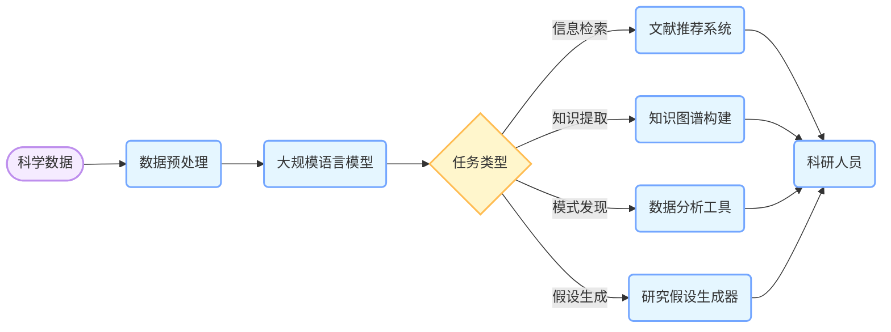

# 大规模语言模型在科学发现辅助中的应用

> 关键词：大规模语言模型、科学发现辅助、自然语言处理、知识图谱、数据挖掘

> 摘要：本文深入探讨了大规模语言模型在科学发现辅助中的应用。首先介绍了相关背景，包括研究目的、预期读者、文档结构和术语表等内容。接着阐述了大规模语言模型及科学发现辅助的核心概念与联系，展示了其原理和架构的示意图与流程图。详细讲解了核心算法原理及具体操作步骤，通过 Python 代码进行了阐述，还介绍了相关数学模型和公式并举例说明。以项目实战的方式给出了代码实际案例和详细解释。分析了大规模语言模型在科学发现辅助中的实际应用场景，推荐了相关的工具和资源。最后总结了未来发展趋势与挑战，解答了常见问题，并提供了扩展阅读和参考资料，旨在全面呈现大规模语言模型在科学发现辅助领域的重要作用和广阔前景。

## 1. 背景介绍 
### 1.1 目的和范围
科学发现是推动人类社会进步的重要力量，然而随着科学研究的不断深入，研究领域日益细分，知识量呈爆炸式增长，科研人员面临着信息过载、知识整合困难等诸多挑战。大规模语言模型的出现为解决这些问题提供了新的思路和方法。本文的目的在于全面探讨大规模语言模型在科学发现辅助中的应用，包括其原理、算法、实际案例以及未来发展趋势等方面，旨在为科研人员、技术开发者和相关领域的决策者提供有价值的参考。

本文的范围涵盖了大规模语言模型的基本概念、核心算法，以及在不同科学领域（如物理学、生物学、化学等）中的具体应用场景，同时对相关的工具和资源进行了推荐，还分析了其面临的挑战和未来发展方向。

### 1.2 预期读者
本文的预期读者包括但不限于以下几类人群：
1. **科研人员**：希望借助大规模语言模型提高科研效率、发现新的研究方向和解决科研难题的科学家和研究人员。
2. **技术开发者**：对自然语言处理、机器学习等领域感兴趣，致力于开发和优化大规模语言模型及相关应用的程序员和软件工程师。
3. **学生**：学习计算机科学、自然科学等相关专业，希望了解前沿技术在科学研究中应用的学生群体。
4. **决策者**：负责科研项目管理、资源分配和政策制定的相关人员，以便更好地了解大规模语言模型在科学发现中的潜力和价值，做出合理的决策。

### 1.3 文档结构概述
本文将按照以下结构进行阐述：
1. **背景介绍**：介绍本文的研究目的、预期读者、文档结构和术语表，为后续内容奠定基础。
2. **核心概念与联系**：阐述大规模语言模型和科学发现辅助的核心概念，展示其原理和架构的示意图与流程图，帮助读者理解两者之间的联系。
3. **核心算法原理 & 具体操作步骤**：详细讲解大规模语言模型的核心算法原理，并通过 Python 代码给出具体操作步骤。
4. **数学模型和公式 & 详细讲解 & 举例说明**：介绍相关的数学模型和公式，进行详细讲解并举例说明，加深读者对算法原理的理解。
5. **项目实战：代码实际案例和详细解释说明**：通过具体的项目实战，给出代码实际案例并进行详细解释，让读者了解如何在实际中应用大规模语言模型进行科学发现辅助。
6. **实际应用场景**：分析大规模语言模型在不同科学领域中的实际应用场景，展示其在科学发现中的具体作用。
7. **工具和资源推荐**：推荐相关的学习资源、开发工具框架和论文著作，帮助读者进一步深入学习和研究。
8. **总结：未来发展趋势与挑战**：总结大规模语言模型在科学发现辅助中的未来发展趋势，分析其面临的挑战。
9. **附录：常见问题与解答**：解答读者在阅读过程中可能遇到的常见问题。
10. **扩展阅读 & 参考资料**：提供相关的扩展阅读内容和参考资料，方便读者进一步查阅和研究。

### 1.4 术语表
#### 1.4.1 核心术语定义
1. **大规模语言模型（Large Language Model，LLM）**：基于深度学习技术，通过在大规模文本数据上进行训练得到的语言模型，能够学习到语言的统计规律和语义信息，具有强大的语言理解和生成能力。
2. **科学发现辅助**：利用各种技术和方法，帮助科研人员更高效地进行科学研究，包括信息检索、知识整合、模式发现、假设生成等方面的支持。
3. **自然语言处理（Natural Language Processing，NLP）**：研究计算机与人类语言之间交互的技术领域，旨在让计算机能够理解、处理和生成自然语言。
4. **知识图谱（Knowledge Graph）**：一种以图的形式表示知识的语义网络，由实体、关系和属性组成，用于存储和组织大量的知识信息。
5. **数据挖掘（Data Mining）**：从大量的数据中发现潜在的模式、规律和知识的过程，通常涉及机器学习、统计学等技术。

#### 1.4.2 相关概念解释
1. **预训练（Pre - training）**：大规模语言模型通常采用预训练的方式，在大规模无监督文本数据上进行训练，学习语言的通用特征和模式，为后续的微调任务奠定基础。
2. **微调（Fine - tuning）**：在预训练的基础上，使用特定领域的有监督数据对模型进行进一步训练，使模型能够更好地适应具体任务的需求。
3. **注意力机制（Attention Mechanism）**：一种在深度学习中广泛应用的机制，能够自动地关注输入序列中的重要部分，提高模型的性能和效率。

#### 1.4.3 缩略词列表
1. **LLM**：Large Language Model（大规模语言模型）
2. **NLP**：Natural Language Processing（自然语言处理）
3. **API**：Application Programming Interface（应用程序编程接口）
4. **GPU**：Graphics Processing Unit（图形处理器）

## 2. 核心概念与联系 
### 核心概念原理
#### 大规模语言模型
大规模语言模型基于深度学习中的神经网络架构，如 Transformer 架构。Transformer 架构通过多头注意力机制能够捕捉输入序列中不同位置之间的依赖关系，从而更好地理解语言的语义信息。大规模语言模型通常采用无监督学习的方式，在大规模的文本语料库上进行预训练，学习语言的统计规律和模式。例如，通过预测下一个词的任务，模型能够学习到语言的上下文信息和语义关联。

#### 科学发现辅助
科学发现辅助是一个综合性的过程，旨在利用各种技术手段帮助科研人员更高效地进行科学研究。它涉及到信息检索、知识整合、模式发现和假设生成等多个方面。信息检索帮助科研人员从海量的文献和数据中快速找到相关的信息；知识整合将不同来源的知识进行融合和组织，形成更全面的知识体系；模式发现通过数据分析和挖掘技术，发现数据中的潜在规律和模式；假设生成则基于已有的知识和数据，提出新的研究假设和方向。

### 架构的文本示意图
大规模语言模型在科学发现辅助中的应用架构可以分为以下几个层次：
1. **数据层**：包含各种科学文献、实验数据、数据库等，是科学发现的基础数据源。
2. **预处理层**：对数据进行清洗、标注、分词等预处理操作，将原始数据转换为适合模型处理的格式。
3. **模型层**：大规模语言模型，如 GPT、BERT 等，通过预训练和微调学习语言的特征和模式，用于信息检索、知识提取等任务。
4. **应用层**：基于模型层的输出，开发各种科学发现辅助应用，如文献推荐系统、知识图谱构建工具、研究假设生成器等。
5. **用户层**：科研人员通过用户界面与应用层进行交互，获取科学发现辅助的服务。

### Mermaid 流程图


这个流程图展示了大规模语言模型在科学发现辅助中的基本流程。首先，科学数据经过预处理后输入到大规模语言模型中。然后，根据不同的任务类型，模型的输出可以用于不同的科学发现辅助应用，最终为科研人员提供服务。

## 3. 核心算法原理 & 具体操作步骤 
### 核心算法原理
大规模语言模型的核心算法基于 Transformer 架构，其主要组成部分包括多头注意力机制、前馈神经网络和残差连接。

#### 多头注意力机制
多头注意力机制允许模型在不同的表示子空间中并行地关注输入序列的不同部分。对于输入序列 $X = [x_1, x_2, \cdots, x_n]$，多头注意力机制的计算过程如下：
1. 计算查询（Query）、键（Key）和值（Value）矩阵：
   - $Q = XW^Q$
   - $K = XW^K$
   - $V = XW^V$
   其中，$W^Q$、$W^K$ 和 $W^V$ 是可学习的权重矩阵。
2. 计算注意力分数：
   - $Attention(Q, K, V) = softmax(\frac{QK^T}{\sqrt{d_k}})V$
   其中，$d_k$ 是键向量的维度。
3. 多头注意力：
   - $MultiHead(Q, K, V) = Concat(head_1, \cdots, head_h)W^O$
   其中，$head_i = Attention(QW_i^Q, KW_i^K, VW_i^V)$，$W_i^Q$、$W_i^K$、$W_i^V$ 和 $W^O$ 是可学习的权重矩阵，$h$ 是头的数量。

#### 前馈神经网络
前馈神经网络由两个线性层和一个非线性激活函数（通常是 ReLU）组成。对于输入 $x$，前馈神经网络的计算过程如下：
1. $FFN(x) = max(0, xW_1 + b_1)W_2 + b_2$
   其中，$W_1$、$W_2$ 是可学习的权重矩阵，$b_1$、$b_2$ 是偏置向量。

#### 残差连接
残差连接用于缓解深度神经网络中的梯度消失问题，提高模型的训练效率和性能。对于输入 $x$ 和经过一个子层（如多头注意力或前馈神经网络）的输出 $y$，残差连接的计算过程如下：
1. $output = LayerNorm(x + y)$
   其中，$LayerNorm$ 是层归一化操作。

### 具体操作步骤（Python 代码实现）
以下是一个使用 PyTorch 实现简单的 Transformer 编码器层的示例代码：

```python
import torch
import torch.nn as nn
import torch.nn.functional as F

class MultiHeadAttention(nn.Module):
    def __init__(self, d_model, num_heads):
        super(MultiHeadAttention, self).__init__()
        assert d_model % num_heads == 0, "d_model must be divisible by num_heads"
        
        self.d_model = d_model
        self.num_heads = num_heads
        self.d_k = d_model // num_heads
        
        self.W_q = nn.Linear(d_model, d_model)
        self.W_k = nn.Linear(d_model, d_model)
        self.W_v = nn.Linear(d_model, d_model)
        self.W_o = nn.Linear(d_model, d_model)
        
    def scaled_dot_product_attention(self, Q, K, V, mask=None):
        attn_scores = torch.matmul(Q, K.transpose(-2, -1)) / torch.sqrt(torch.tensor(self.d_k, dtype=torch.float32))
        if mask is not None:
            attn_scores = attn_scores.masked_fill(mask == 0, -1e9)
        attn_probs = F.softmax(attn_scores, dim=-1)
        output = torch.matmul(attn_probs, V)
        return output
        
    def split_heads(self, x):
        batch_size, seq_length, d_model = x.size()
        return x.view(batch_size, seq_length, self.num_heads, self.d_k).transpose(1, 2)
        
    def combine_heads(self, x):
        batch_size, num_heads, seq_length, d_k = x.size()
        return x.transpose(1, 2).contiguous().view(batch_size, seq_length, self.d_model)
        
    def forward(self, Q, K, V, mask=None):
        Q = self.split_heads(self.W_q(Q))
        K = self.split_heads(self.W_k(K))
        V = self.split_heads(self.W_v(V))
        
        attn_output = self.scaled_dot_product_attention(Q, K, V, mask)
        output = self.W_o(self.combine_heads(attn_output))
        return output

class PositionwiseFeedForward(nn.Module):
    def __init__(self, d_model, d_ff):
        super(PositionwiseFeedForward, self).__init__()
        self.fc1 = nn.Linear(d_model, d_ff)
        self.fc2 = nn.Linear(d_ff, d_model)
        self.relu = nn.ReLU()
        
    def forward(self, x):
        return self.fc2(self.relu(self.fc1(x)))

class EncoderLayer(nn.Module):
    def __init__(self, d_model, num_heads, d_ff, dropout):
        super(EncoderLayer, self).__init__()
        self.self_attn = MultiHeadAttention(d_model, num_heads)
        self.feed_forward = PositionwiseFeedForward(d_model, d_ff)
        self.norm1 = nn.LayerNorm(d_model)
        self.norm2 = nn.LayerNorm(d_model)
        self.dropout = nn.Dropout(dropout)
        
    def forward(self, x, mask):
        attn_output = self.self_attn(x, x, x, mask)
        x = self.norm1(x + self.dropout(attn_output))
        ff_output = self.feed_forward(x)
        x = self.norm2(x + self.dropout(ff_output))
        return x
```

### 代码解释
1. **MultiHeadAttention 类**：实现了多头注意力机制。在 `__init__` 方法中，初始化了查询、键、值和输出的线性层。`scaled_dot_product_attention` 方法计算注意力分数和注意力概率，并返回注意力输出。`split_heads` 和 `combine_heads` 方法用于将输入和输出的维度进行调整，以适应多头注意力的计算。`forward` 方法将输入的查询、键、值经过线性变换后，计算多头注意力并返回输出。
2. **PositionwiseFeedForward 类**：实现了前馈神经网络。在 `__init__` 方法中，初始化了两个线性层和 ReLU 激活函数。`forward` 方法将输入经过两个线性层和激活函数的计算后返回输出。
3. **EncoderLayer 类**：实现了 Transformer 编码器层。在 `__init__` 方法中，初始化了多头注意力机制、前馈神经网络、层归一化和 Dropout 层。`forward` 方法将输入经过多头注意力和前馈神经网络的计算，并使用残差连接和层归一化进行处理后返回输出。

## 4. 数学模型和公式 & 详细讲解 & 举例说明 
### 数学模型和公式
#### 损失函数
在大规模语言模型的训练中，通常使用交叉熵损失函数。对于一个语言模型的预测任务，假设输入序列为 $x = [x_1, x_2, \cdots, x_n]$，模型预测的下一个词的概率分布为 $\hat{y} = [\hat{y}_1, \hat{y}_2, \cdots, \hat{y}_m]$，真实的下一个词的标签为 $y = [y_1, y_2, \cdots, y_m]$（其中 $y$ 是一个 one - hot 向量），则交叉熵损失函数的计算公式为：
$$
L = -\sum_{i = 1}^{m}y_i\log(\hat{y}_i)
$$

#### 优化算法
在训练大规模语言模型时，通常使用随机梯度下降（SGD）的变种，如 Adam 优化算法。Adam 优化算法结合了 AdaGrad 和 RMSProp 的优点，能够自适应地调整每个参数的学习率。Adam 优化算法的更新公式如下：
1. 计算梯度的一阶矩估计（均值）：
   - $m_t=\beta_1m_{t - 1}+(1 - \beta_1)g_t$
2. 计算梯度的二阶矩估计（方差）：
   - $v_t=\beta_2v_{t - 1}+(1 - \beta_2)g_t^2$
3. 修正一阶矩估计的偏差：
   - $\hat{m}_t=\frac{m_t}{1 - \beta_1^t}$
4. 修正二阶矩估计的偏差：
   - $\hat{v}_t=\frac{v_t}{1 - \beta_2^t}$
5. 更新参数：
   - $\theta_{t + 1}=\theta_t-\alpha\frac{\hat{m}_t}{\sqrt{\hat{v}_t}+\epsilon}$
   其中，$g_t$ 是 $t$ 时刻的梯度，$\beta_1$ 和 $\beta_2$ 是衰减率（通常 $\beta_1 = 0.9$，$\beta_2 = 0.999$），$\alpha$ 是学习率，$\epsilon$ 是一个很小的常数（通常 $\epsilon = 10^{-8}$）。

### 详细讲解
#### 交叉熵损失函数
交叉熵损失函数用于衡量模型预测的概率分布与真实标签之间的差异。在语言模型中，模型的目标是预测下一个词的概率分布，交叉熵损失函数能够使模型的预测概率分布尽可能接近真实的概率分布。当模型的预测结果与真实标签完全一致时，交叉熵损失函数的值为 0；当模型的预测结果与真实标签差异较大时，交叉熵损失函数的值较大。

#### Adam 优化算法
Adam 优化算法通过计算梯度的一阶矩估计和二阶矩估计，自适应地调整每个参数的学习率。一阶矩估计能够跟踪梯度的均值，二阶矩估计能够跟踪梯度的方差。通过修正偏差，使得在训练初期能够更快地收敛，在训练后期能够更稳定地收敛。

### 举例说明
假设我们有一个简单的语言模型，输入序列为 "The cat is"，模型需要预测下一个词。真实的下一个词是 "sleeping"，模型预测的概率分布为 $\hat{y} = [0.1, 0.2, 0.3, 0.4]$，对应的词分别为 "running", "jumping", "eating", "sleeping"。真实的标签 $y$ 是一个 one - hot 向量 $[0, 0, 0, 1]$。则交叉熵损失函数的值为：
$$
L = -\sum_{i = 1}^{4}y_i\log(\hat{y}_i)=-\log(0.4)\approx0.916
$$

在训练过程中，使用 Adam 优化算法更新模型的参数。假设初始学习率 $\alpha = 0.001$，$\beta_1 = 0.9$，$\beta_2 = 0.999$，$\epsilon = 10^{-8}$。在第 10 次迭代时，某个参数的梯度 $g_{10} = 0.5$，$m_9 = 0.2$，$v_9 = 0.1$。则：
1. $m_{10}=0.9\times0.2+(1 - 0.9)\times0.5 = 0.23$
2. $v_{10}=0.999\times0.1+(1 - 0.999)\times0.5^2 = 0.10045$
3. $\hat{m}_{10}=\frac{0.23}{1 - 0.9^{10}}\approx0.434$
4. $\hat{v}_{10}=\frac{0.10045}{1 - 0.999^{10}}\approx0.10095$
5. 假设该参数的当前值为 $\theta_{10} = 1$，则更新后的参数值为：
   - $\theta_{11}=1 - 0.001\times\frac{0.434}{\sqrt{0.10095}+10^{-8}}\approx0.999$

## 5. 项目实战：代码实际案例和详细解释说明 
### 5.1  开发环境搭建
#### 硬件环境
1. **CPU**：建议使用多核处理器，如 Intel Core i7 或 AMD Ryzen 7 及以上。
2. **GPU**：如果进行大规模模型的训练，建议使用 NVIDIA GPU，如 NVIDIA GeForce RTX 3080 或 NVIDIA Tesla V100 等。
3. **内存**：至少 16GB 内存，对于大规模模型训练，建议 32GB 或以上。

#### 软件环境
1. **操作系统**：推荐使用 Linux 系统，如 Ubuntu 18.04 或更高版本，也可以使用 Windows 10 或 macOS。
2. **Python**：建议使用 Python 3.7 或更高版本。
3. **深度学习框架**：使用 PyTorch 深度学习框架，安装命令如下：
   - 如果使用 GPU：
     ```sh
     pip install torch torchvision torchaudio --extra-index-url https://download.pytorch.org/whl/cu113
     ```
   - 如果使用 CPU：
     ```sh
     pip install torch torchvision torchaudio
     ```
4. **其他依赖库**：安装 `transformers` 库用于使用预训练的大规模语言模型，安装命令如下：
   ```sh
   pip install transformers
   ```

### 5.2  源代码详细实现和代码解读
以下是一个使用 `transformers` 库进行文本生成的示例代码，模拟科学文献摘要的生成：

```python
from transformers import GPT2LMHeadModel, GPT2Tokenizer

# 加载预训练的 GPT - 2 模型和分词器
tokenizer = GPT2Tokenizer.from_pretrained('gpt2')
model = GPT2LMHeadModel.from_pretrained('gpt2')

# 输入科学文献的开头部分
input_text = "In recent years, the field of artificial intelligence has witnessed significant advancements. "

# 将输入文本转换为模型可以处理的输入格式
input_ids = tokenizer.encode(input_text, return_tensors='pt')

# 生成文本
output = model.generate(input_ids, max_length=200, num_beams=5, no_repeat_ngram_size=2, early_stopping=True)

# 将生成的输出转换为文本
generated_text = tokenizer.decode(output[0], skip_special_tokens=True)

print(generated_text)
```

### 5.3  代码解读与分析
1. **加载预训练的模型和分词器**：
   - `GPT2Tokenizer.from_pretrained('gpt2')`：从 Hugging Face 的模型库中加载 GPT - 2 的分词器，用于将输入文本转换为模型可以处理的 token 序列。
   - `GPT2LMHeadModel.from_pretrained('gpt2')`：从 Hugging Face 的模型库中加载预训练的 GPT - 2 语言模型。
2. **输入文本处理**：
   - `tokenizer.encode(input_text, return_tensors='pt')`：将输入文本编码为 PyTorch 张量，作为模型的输入。
3. **文本生成**：
   - `model.generate(input_ids, max_length=200, num_beams=5, no_repeat_ngram_size=2, early_stopping=True)`：使用模型进行文本生成。`max_length` 表示生成文本的最大长度，`num_beams` 表示束搜索的束宽，`no_repeat_ngram_size` 表示避免重复的 n - gram 大小，`early_stopping` 表示是否在生成完成后提前停止。
4. **输出处理**：
   - `tokenizer.decode(output[0], skip_special_tokens=True)`：将模型生成的 token 序列解码为文本，并跳过特殊的 token。

## 6. 实际应用场景 
### 文献检索与推荐
大规模语言模型可以帮助科研人员更高效地进行文献检索和推荐。通过对文献的标题、摘要和正文进行语义理解，模型能够准确地捕捉文献的主题和关键信息。科研人员可以输入自然语言的查询，模型能够返回与查询相关的文献列表，并根据相关性进行排序。此外，模型还可以根据科研人员的研究兴趣和历史阅读记录，推荐可能感兴趣的文献，帮助科研人员发现新的研究方向和前沿成果。

### 知识图谱构建
知识图谱是一种结构化的知识表示方式，能够将科学领域中的实体、关系和属性进行整合和组织。大规模语言模型可以用于从科学文献和数据中提取实体和关系，自动构建知识图谱。模型可以识别文本中的实体名称，如科学家、研究机构、研究成果等，并分析它们之间的关系，如合作关系、引用关系、因果关系等。通过构建知识图谱，科研人员可以更直观地了解科学领域的知识结构和研究脉络，发现潜在的研究机会和合作关系。

### 研究假设生成
在科学研究中，提出合理的研究假设是关键的一步。大规模语言模型可以基于已有的科学知识和数据，生成新的研究假设。模型可以分析科学文献中的研究趋势、未解之谜和潜在的研究方向，结合自身的语言理解和生成能力，提出有创意的研究假设。这些假设可以为科研人员提供新的思路和方向，促进科学研究的创新和发展。

### 实验设计辅助
大规模语言模型可以为科研人员提供实验设计的辅助。模型可以根据研究问题和目标，分析已有的实验方法和数据，提供优化的实验设计方案。例如，模型可以建议合适的实验样本、实验变量、实验步骤和数据分析方法等。通过利用大规模语言模型的智能辅助，科研人员可以更高效地设计实验，提高实验的成功率和研究效率。

## 7. 工具和资源推荐
### 7.1 学习资源推荐
#### 7.1.1 书籍推荐
1. 《深度学习》（Deep Learning）：由 Ian Goodfellow、Yoshua Bengio 和 Aaron Courville 所著，是深度学习领域的经典教材，详细介绍了深度学习的基本原理、算法和应用。
2. 《自然语言处理入门》（Natural Language Processing with Python）：由 Steven Bird、Ewan Klein 和 Edward Loper 所著，适合初学者学习自然语言处理的基础知识和实践方法。
3. 《Transformer 神经网络：注意力机制带来的革命》（Transformers for Natural Language Processing）：深入介绍了 Transformer 架构及其在自然语言处理中的应用，对于理解大规模语言模型的核心原理有很大帮助。

#### 7.1.2 在线课程
1. Coursera 上的“深度学习专项课程”（Deep Learning Specialization）：由 Andrew Ng 教授授课，涵盖了深度学习的各个方面，包括神经网络、卷积神经网络、循环神经网络和强化学习等。
2. edX 上的“自然语言处理基础”（Foundations of Natural Language Processing）：系统地介绍了自然语言处理的基本概念、算法和技术。
3. Hugging Face 的“自然语言处理课程”（Natural Language Processing Course）：专门介绍了使用 Hugging Face 的 `transformers` 库进行自然语言处理的实践方法，包括文本分类、命名实体识别、文本生成等任务。

#### 7.1.3 技术博客和网站
1. Hugging Face 博客（https://huggingface.co/blog）：提供了关于大规模语言模型和自然语言处理的最新研究成果、技术文章和实践案例。
2. Towards Data Science（https://towardsdatascience.com/）：一个数据科学和机器学习领域的技术博客平台，有很多关于大规模语言模型和科学发现辅助的优质文章。
3. arXiv（https://arxiv.org/）：一个预印本服务器，包含了大量的科学研究论文，特别是计算机科学、物理学、数学等领域的前沿研究成果。

### 7.2 开发工具框架推荐
#### 7.2.1 IDE和编辑器
1. PyCharm：一款专业的 Python 集成开发环境，提供了代码编辑、调试、版本控制等丰富的功能，适合开发大规模的 Python 项目。
2. Visual Studio Code：一款轻量级的代码编辑器，支持多种编程语言，有丰富的插件扩展，可用于快速开发和调试深度学习项目。

#### 7.2.2 调试和性能分析工具
1. PyTorch Profiler：PyTorch 自带的性能分析工具，能够帮助开发者分析模型的训练和推理过程中的性能瓶颈，优化代码性能。
2. TensorBoard：一个可视化工具，可用于可视化模型的训练过程、损失曲线、准确率等指标，帮助开发者监控模型的训练状态。

#### 7.2.3 相关框架和库
1. Hugging Face `transformers` 库：提供了大量预训练的大规模语言模型，如 GPT - 2、BERT、RoBERTa 等，以及方便的接口用于模型的加载、微调、推理等操作。
2. AllenNLP：一个自然语言处理框架，提供了丰富的工具和组件，用于构建和训练自然语言处理模型。
3. SpaCy：一个高效的自然语言处理库，提供了快速的分词、词性标注、命名实体识别等功能，可用于文本预处理和特征提取。

### 7.3 相关论文著作推荐
#### 7.3.1 经典论文
1. “Attention Is All You Need”：介绍了 Transformer 架构，为大规模语言模型的发展奠定了基础。
2. “BERT: Pre - training of Deep Bidirectional Transformers for Language Understanding”：提出了 BERT 模型，开创了预训练语言模型的新时代。
3. “Improving Language Understanding by Generative Pre - Training”：介绍了 GPT 模型的预训练方法和应用。

#### 7.3.2 最新研究成果
1. 关注 arXiv 上关于大规模语言模型和自然语言处理的最新论文，了解该领域的前沿研究动态。
2. 阅读顶级学术会议（如 ACL、EMNLP、NeurIPS 等）上的相关论文，获取最新的研究成果和技术进展。

#### 7.3.3 应用案例分析
1. 查阅相关的研究报告和学术论文，了解大规模语言模型在不同科学领域（如生物学、物理学、化学等）中的具体应用案例和效果分析。
2. 关注行业博客和技术论坛，获取企业和科研机构在实际项目中应用大规模语言模型进行科学发现辅助的经验分享和案例介绍。

## 8. 总结：未来发展趋势与挑战
### 未来发展趋势
1. **模型规模持续扩大**：随着计算资源的不断提升和训练技术的不断改进，大规模语言模型的规模将继续扩大，模型的性能和能力也将不断提高。更大规模的模型有望学习到更丰富的语言知识和世界知识，为科学发现提供更强大的支持。
2. **跨模态融合**：未来的大规模语言模型将不仅仅局限于处理文本数据，还将与图像、音频、视频等多种模态的数据进行融合。通过跨模态融合，模型能够更全面地理解和处理科学信息，为科学发现提供更丰富的视角和方法。
3. **个性化和专业化**：针对不同的科学领域和用户需求，大规模语言模型将实现个性化和专业化。例如，开发专门用于生物学研究的语言模型，能够更好地理解生物学的专业术语和知识，为生物学研究提供更精准的辅助。
4. **与知识图谱深度融合**：大规模语言模型与知识图谱的深度融合将是未来的一个重要发展方向。知识图谱能够为语言模型提供结构化的知识支持，语言模型能够从文本中提取知识更新知识图谱，两者相互补充，共同推动科学发现的发展。

### 挑战
1. **计算资源需求**：大规模语言模型的训练和推理需要大量的计算资源，包括 GPU、TPU 等硬件设备和大规模的计算集群。计算资源的成本和能耗问题是制约大规模语言模型发展的一个重要因素。
2. **数据质量和隐私**：大规模语言模型的性能高度依赖于数据的质量和规模。然而，数据的收集、标注和清洗过程中存在着数据质量参差不齐、数据隐私泄露等问题。如何保证数据的质量和隐私是一个亟待解决的问题。
3. **模型可解释性**：大规模语言模型通常是基于深度学习的黑盒模型，其决策过程和推理机制难以解释。在科学发现中，模型的可解释性至关重要，因为科研人员需要理解模型的输出结果和推理过程，才能做出合理的决策。如何提高模型的可解释性是一个重要的挑战。
4. **伦理和社会问题**：大规模语言模型的应用可能会带来一系列的伦理和社会问题，如虚假信息传播、偏见和歧视、就业结构变化等。如何制定相应的伦理准则和法律法规，规范大规模语言模型的应用，是一个需要关注的问题。

## 9. 附录：常见问题与解答
### 1. 大规模语言模型在科学发现辅助中的准确性如何保证？
大规模语言模型的准确性可以通过以下几个方面来保证：
1. **高质量的数据**：使用经过清洗、标注和验证的高质量科学数据进行训练，确保模型学习到的知识是准确可靠的。
2. **模型优化**：采用先进的训练算法和优化技术，如微调、正则化等，不断优化模型的性能，提高模型的准确性。
3. **多模型融合**：结合多个不同的大规模语言模型或其他机器学习模型的结果，进行综合分析和判断，提高预测的准确性。
4. **人工验证**：对于模型的输出结果，进行人工验证和审核，确保结果的准确性和可靠性。

### 2. 大规模语言模型在不同科学领域的应用有何差异？
不同科学领域的语言特点、知识结构和研究方法存在差异，因此大规模语言模型在不同科学领域的应用也有所不同。例如：
1. **生物学**：生物学领域的文献和数据中包含大量的专业术语和复杂的生物过程描述，模型需要能够准确理解这些术语和过程，为基因分析、药物研发等提供支持。
2. **物理学**：物理学领域的研究通常涉及到大量的数学公式和理论模型，模型需要能够处理和理解这些数学信息，为理论推导、实验设计等提供帮助。
3. **化学**：化学领域的文献和数据中包含分子结构、化学反应等信息，模型需要能够识别和处理这些化学信息，为新材料研发、化学反应优化等提供支持。

### 3. 如何选择适合科学发现辅助的大规模语言模型？
选择适合科学发现辅助的大规模语言模型可以考虑以下几个因素：
1. **模型性能**：评估模型在相关任务上的性能指标，如准确率、召回率、F1 值等，选择性能较好的模型。
2. **模型规模**：根据计算资源和任务需求，选择合适规模的模型。一般来说，较大规模的模型性能更好，但需要更多的计算资源。
3. **领域适应性**：选择在相关科学领域有较好表现的模型，或者对通用模型进行微调，使其适应特定领域的需求。
4. **开源性和易用性**：选择开源的模型，方便进行定制和扩展；同时，选择具有良好文档和接口的模型，提高开发效率。

### 4. 大规模语言模型在科学发现辅助中会完全取代科研人员吗？
不会。大规模语言模型在科学发现辅助中可以提供强大的工具和支持，但不能完全取代科研人员。科研人员具有创造性思维、专业知识和实践经验，能够提出有价值的研究问题、设计实验方案和解释实验结果。大规模语言模型只是辅助科研人员进行信息检索、知识整合和模式发现等工作，最终的科学发现和创新仍然需要科研人员的智慧和努力。

## 10. 扩展阅读 & 参考资料
### 扩展阅读
1. 《人工智能：现代方法》（Artificial Intelligence: A Modern Approach）：全面介绍了人工智能的基本概念、算法和应用，对理解大规模语言模型的背景和相关技术有很大帮助。
2. 《科学发现的逻辑》（The Logic of Scientific Discovery）：探讨了科学发现的方法和逻辑，对于理解科学发现的本质和过程有重要意义。
3. 《知识图谱：方法、实践与应用》：详细介绍了知识图谱的构建方法、技术和应用案例，对于理解大规模语言模型与知识图谱的融合有参考价值。

### 参考资料
1. Hugging Face 官方文档（https://huggingface.co/docs）：提供了关于 `transformers` 库的详细文档和使用指南。
2. PyTorch 官方文档（https://pytorch.org/docs/stable/index.html）：PyTorch 深度学习框架的官方文档，包含了丰富的 API 文档和教程。
3. 相关学术会议论文集（如 ACL、EMNLP、NeurIPS 等）：这些会议的论文集中包含了大规模语言模型和自然语言处理领域的最新研究成果和技术进展。