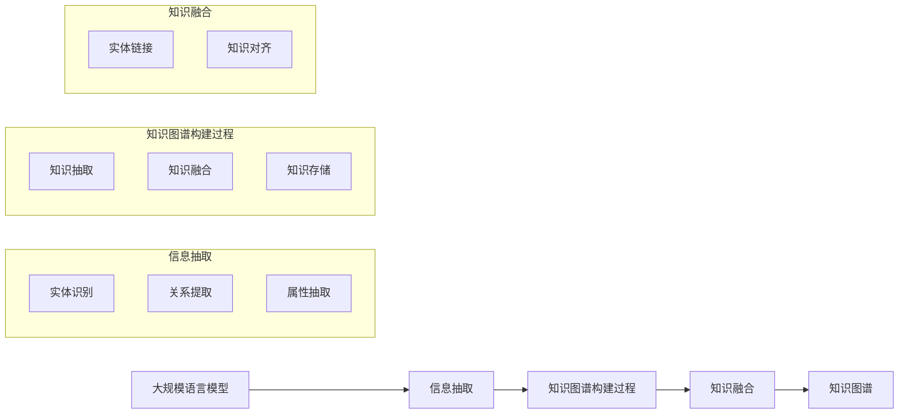

# 大规模语言模型在科学文献知识图谱构建中的应用

> 关键词：大规模语言模型、科学文献、知识图谱、信息抽取、自然语言处理

> 摘要：本文聚焦于大规模语言模型在科学文献知识图谱构建中的应用。首先介绍了相关背景，包括目的范围、预期读者等内容。接着阐述了核心概念与联系，深入讲解了大规模语言模型和知识图谱的原理及架构。详细介绍了核心算法原理与具体操作步骤，通过Python代码进行阐述。对相关数学模型和公式进行了详细讲解与举例说明。在项目实战部分，给出代码实际案例并进行详细解释。探讨了实际应用场景，推荐了相关工具和资源。最后总结了未来发展趋势与挑战，解答了常见问题并提供扩展阅读与参考资料，旨在全面深入地探讨大规模语言模型在科学文献知识图谱构建中的应用及相关技术要点。

## 1. 背景介绍 
### 1.1 目的和范围
随着科学研究的不断发展，科学文献的数量呈现爆炸式增长。这些文献中蕴含着丰富的知识，但如何高效地组织、管理和利用这些知识成为了一个关键问题。知识图谱作为一种强大的知识表示和管理工具，能够将科学文献中的实体、关系和属性以图形化的方式呈现出来，便于知识的检索、推理和挖掘。而大规模语言模型在自然语言处理领域取得了显著的成果，其强大的语言理解和生成能力为科学文献知识图谱的构建提供了新的思路和方法。

本文章的范围主要涵盖大规模语言模型在科学文献知识图谱构建过程中的各个环节，包括信息抽取、实体链接、关系提取等，旨在探讨如何利用大规模语言模型提高知识图谱构建的效率和质量。

### 1.2 预期读者
本文预期读者包括自然语言处理领域的研究人员、知识图谱开发者、数据挖掘工程师、科学文献管理与研究人员以及对人工智能技术在科学领域应用感兴趣的相关人员。

### 1.3 文档结构概述
本文首先介绍背景信息，包括目的、预期读者和文档结构概述等。接着阐述大规模语言模型和知识图谱的核心概念与联系，通过文本示意图和Mermaid流程图进行展示。然后详细讲解核心算法原理和具体操作步骤，使用Python代码进行说明。对相关数学模型和公式进行讲解并举例。在项目实战部分，介绍开发环境搭建、源代码实现和代码解读。探讨实际应用场景，推荐相关工具和资源。最后总结未来发展趋势与挑战，解答常见问题并提供扩展阅读与参考资料。

### 1.4 术语表
#### 1.4.1 核心术语定义
- **大规模语言模型**：基于深度学习的语言模型，通常具有大量的参数和强大的语言理解与生成能力，如GPT、BERT等。
- **科学文献**：记录科学研究成果的各类文献，包括学术论文、研究报告、书籍等。
- **知识图谱**：一种用图结构来描述实体及其之间关系的语义网络，用于表示和存储知识。
- **信息抽取**：从文本中提取出特定信息的过程，如实体、关系、属性等。
- **实体链接**：将文本中的实体提及链接到知识图谱中对应的实体节点的过程。
- **关系提取**：从文本中识别出实体之间关系的过程。

#### 1.4.2 相关概念解释
- **自然语言处理（NLP）**：研究计算机与人类自然语言之间交互的技术领域，旨在让计算机理解和处理自然语言。
- **深度学习**：一种基于人工神经网络的机器学习方法，通过多层神经网络对数据进行建模和学习。
- **语义网络**：一种用节点和边来表示概念及其之间语义关系的图结构。

#### 1.4.3 缩略词列表
- **NLP**：Natural Language Processing（自然语言处理）
- **GPT**：Generative Pretrained Transformer（生成式预训练变换器）
- **BERT**：Bidirectional Encoder Representations from Transformers（基于变换器的双向编码器表示）

## 2. 核心概念与联系 

### 大规模语言模型原理
大规模语言模型基于深度学习技术，通常采用Transformer架构。Transformer架构由编码器和解码器组成，其核心是自注意力机制（Self-Attention）。自注意力机制能够让模型在处理输入序列时，动态地关注序列中不同位置的信息，从而更好地捕捉序列中的语义关系。

以BERT为例，它是一种基于Transformer编码器的预训练语言模型。BERT通过在大规模无监督文本数据上进行预训练，学习到通用的语言表示。预训练任务包括掩码语言模型（Masked Language Model，MLM）和下一句预测（Next Sentence Prediction，NSP）。在MLM任务中，模型需要预测被掩码的词；在NSP任务中，模型需要判断两个句子是否是相邻的句子。

### 知识图谱原理
知识图谱是一种语义网络，由实体（节点）、关系（边）和属性（节点和边的特征）组成。知识图谱的构建过程包括知识抽取、知识融合和知识存储等步骤。知识抽取是从各种数据源中提取出实体、关系和属性等信息；知识融合是将不同数据源中抽取的知识进行整合和对齐；知识存储是将融合后的知识存储到图数据库或其他存储系统中。

### 大规模语言模型与知识图谱的联系
大规模语言模型可以为知识图谱的构建提供强大的语言理解和生成能力。在信息抽取阶段，大规模语言模型可以用于实体识别、关系提取和属性抽取等任务。例如，通过微调大规模语言模型，可以让其准确地识别科学文献中的实体和关系。在知识融合阶段，大规模语言模型可以用于实体链接和知识对齐等任务。例如，利用大规模语言模型计算实体提及与知识图谱中实体的相似度，从而实现实体链接。

### 文本示意图
```plaintext
大规模语言模型
    |
    | 信息抽取（实体识别、关系提取、属性抽取）
    |
    V
知识图谱构建过程（知识抽取、知识融合、知识存储）
    |
    | 知识融合（实体链接、知识对齐）
    |
    V
知识图谱
```

### Mermaid流程图


## 3. 核心算法原理 & 具体操作步骤 

### 实体识别算法原理
实体识别是信息抽取的重要任务之一，其目标是从文本中识别出具有特定语义类别的实体。基于大规模语言模型的实体识别方法通常采用序列标注的方式，将每个词标注为相应的实体类别标签。

以BERT为例，其具体步骤如下：
1. **输入编码**：将输入文本进行分词，并将分词后的词转换为对应的词嵌入（Word Embedding）。同时，为每个词添加位置嵌入（Position Embedding）和段嵌入（Segment Embedding），得到最终的输入表示。
2. **BERT编码**：将输入表示输入到BERT模型中，通过多层Transformer编码器进行编码，得到每个词的上下文表示。
3. **标签预测**：在BERT模型的输出层添加一个全连接层，将每个词的上下文表示映射到实体类别标签空间，通过softmax函数得到每个标签的概率分布，选择概率最大的标签作为该词的实体类别标签。

### Python代码实现
```python
import torch
from transformers import BertTokenizer, BertForTokenClassification

# 加载预训练的BERT模型和分词器
tokenizer = BertTokenizer.from_pretrained('bert-base-chinese')
model = BertForTokenClassification.from_pretrained('bert-base-chinese', num_labels=5)  # 假设共有5个实体类别

# 输入文本
text = "张三是一名科学家，在清华大学工作。"

# 分词
tokens = tokenizer.tokenize(text)
input_ids = tokenizer.convert_tokens_to_ids(tokens)
input_ids = torch.tensor([input_ids])

# 模型预测
outputs = model(input_ids)
logits = outputs.logits
predicted_labels = torch.argmax(logits, dim=2)

# 输出预测结果
predicted_labels = predicted_labels.squeeze().tolist()
for token, label in zip(tokens, predicted_labels):
    print(f"Token: {token}, Label: {label}")
```

### 关系提取算法原理
关系提取的目标是从文本中识别出实体之间的关系。基于大规模语言模型的关系提取方法通常采用分类的方式，将包含实体对的文本片段分类到不同的关系类别中。

具体步骤如下：
1. **文本预处理**：将包含实体对的文本片段进行分词和编码，得到输入表示。
2. **BERT编码**：将输入表示输入到BERT模型中，得到文本的上下文表示。
3. **关系分类**：在BERT模型的输出层添加一个全连接层，将文本的上下文表示映射到关系类别标签空间，通过softmax函数得到每个关系类别的概率分布，选择概率最大的关系类别作为实体对之间的关系。

### Python代码实现
```python
import torch
from transformers import BertTokenizer, BertForSequenceClassification

# 加载预训练的BERT模型和分词器
tokenizer = BertTokenizer.from_pretrained('bert-base-chinese')
model = BertForSequenceClassification.from_pretrained('bert-base-chinese', num_labels=3)  # 假设共有3个关系类别

# 输入文本和实体对
text = "张三是一名科学家，在清华大学工作。"
entity1 = "张三"
entity2 = "清华大学"

# 构造输入文本
input_text = f"{entity1} {entity2} {text}"

# 分词
tokens = tokenizer.tokenize(input_text)
input_ids = tokenizer.convert_tokens_to_ids(tokens)
input_ids = torch.tensor([input_ids])

# 模型预测
outputs = model(input_ids)
logits = outputs.logits
predicted_relation = torch.argmax(logits, dim=1).item()

# 输出预测结果
print(f"Predicted Relation: {predicted_relation}")
```

## 4. 数学模型和公式 & 详细讲解 & 举例说明 

### 自注意力机制数学模型
自注意力机制是Transformer架构的核心，其数学模型如下：

给定输入序列 $X = [x_1, x_2, \cdots, x_n]$，其中 $x_i \in \mathbb{R}^d$ 表示第 $i$ 个输入向量，$d$ 是向量的维度。首先，通过线性变换将输入向量 $x_i$ 分别映射到查询向量 $q_i$、键向量 $k_i$ 和值向量 $v_i$：

$$
q_i = W_q x_i \\
k_i = W_k x_i \\
v_i = W_v x_i
$$

其中 $W_q \in \mathbb{R}^{d_{k} \times d}$，$W_k \in \mathbb{R}^{d_{k} \times d}$，$W_v \in \mathbb{R}^{d_{v} \times d}$ 是可学习的权重矩阵，$d_{k}$ 和 $d_{v}$ 分别是查询向量、键向量和值向量的维度。

然后，计算查询向量 $q_i$ 与所有键向量 $k_j$ 的相似度得分：

$$
s_{ij} = \frac{q_i^T k_j}{\sqrt{d_{k}}}
$$

通过softmax函数将相似度得分转换为概率分布：

$$
a_{ij} = \frac{\exp(s_{ij})}{\sum_{k=1}^{n} \exp(s_{ik})}
$$

最后，计算输出向量 $y_i$：

$$
y_i = \sum_{j=1}^{n} a_{ij} v_j
$$

### 举例说明
假设输入序列 $X = [x_1, x_2, x_3]$，其中 $x_1 = [1, 2]^T$，$x_2 = [3, 4]^T$，$x_3 = [5, 6]^T$，$d = 2$，$d_{k} = d_{v} = 2$。

权重矩阵 $W_q = \begin{bmatrix} 0.1 & 0.2 \\ 0.3 & 0.4 \end{bmatrix}$，$W_k = \begin{bmatrix} 0.5 & 0.6 \\ 0.7 & 0.8 \end{bmatrix}$，$W_v = \begin{bmatrix} 0.9 & 1.0 \\ 1.1 & 1.2 \end{bmatrix}$。

计算查询向量 $q_1$：

$$
q_1 = W_q x_1 = \begin{bmatrix} 0.1 & 0.2 \\ 0.3 & 0.4 \end{bmatrix} \begin{bmatrix} 1 \\ 2 \end{bmatrix} = \begin{bmatrix} 0.5 \\ 1.1 \end{bmatrix}
$$

计算键向量 $k_1$，$k_2$，$k_3$：

$$
k_1 = W_k x_1 = \begin{bmatrix} 0.5 & 0.6 \\ 0.7 & 0.8 \end{bmatrix} \begin{bmatrix} 1 \\ 2 \end{bmatrix} = \begin{bmatrix} 1.7 \\ 2.3 \end{bmatrix}
$$

$$
k_2 = W_k x_2 = \begin{bmatrix} 0.5 & 0.6 \\ 0.7 & 0.8 \end{bmatrix} \begin{bmatrix} 3 \\ 4 \end{bmatrix} = \begin{bmatrix} 3.9 \\ 5.3 \end{bmatrix}
$$

$$
k_3 = W_k x_3 = \begin{bmatrix} 0.5 & 0.6 \\ 0.7 & 0.8 \end{bmatrix} \begin{bmatrix} 5 \\ 6 \end{bmatrix} = \begin{bmatrix} 6.1 \\ 8.3 \end{bmatrix}
$$

计算相似度得分 $s_{11}$，$s_{12}$，$s_{13}$：

$$
s_{11} = \frac{q_1^T k_1}{\sqrt{d_{k}}} = \frac{\begin{bmatrix} 0.5 & 1.1 \end{bmatrix} \begin{bmatrix} 1.7 \\ 2.3 \end{bmatrix}}{\sqrt{2}} \approx 2.24
$$

$$
s_{12} = \frac{q_1^T k_2}{\sqrt{d_{k}}} = \frac{\begin{bmatrix} 0.5 & 1.1 \end{bmatrix} \begin{bmatrix} 3.9 \\ 5.3 \end{bmatrix}}{\sqrt{2}} \approx 4.94
$$

$$
s_{13} = \frac{q_1^T k_3}{\sqrt{d_{k}}} = \frac{\begin{bmatrix} 0.5 & 1.1 \end{bmatrix} \begin{bmatrix} 6.1 \\ 8.3 \end{bmatrix}}{\sqrt{2}} \approx 7.64
$$

计算概率分布 $a_{11}$，$a_{12}$，$a_{13}$：

$$
a_{11} = \frac{\exp(s_{11})}{\exp(s_{11}) + \exp(s_{12}) + \exp(s_{13})} \approx 0.01
$$

$$
a_{12} = \frac{\exp(s_{12})}{\exp(s_{11}) + \exp(s_{12}) + \exp(s_{13})} \approx 0.12
$$

$$
a_{13} = \frac{\exp(s_{13})}{\exp(s_{11}) + \exp(s_{12}) + \exp(s_{13})} \approx 0.87
$$

计算值向量 $v_1$，$v_2$，$v_3$：

$$
v_1 = W_v x_1 = \begin{bmatrix} 0.9 & 1.0 \\ 1.1 & 1.2 \end{bmatrix} \begin{bmatrix} 1 \\ 2 \end{bmatrix} = \begin{bmatrix} 2.9 \\ 3.5 \end{bmatrix}
$$

$$
v_2 = W_v x_2 = \begin{bmatrix} 0.9 & 1.0 \\ 1.1 & 1.2 \end{bmatrix} \begin{bmatrix} 3 \\ 4 \end{bmatrix} = \begin{bmatrix} 6.7 \\ 8.1 \end{bmatrix}
$$

$$
v_3 = W_v x_3 = \begin{bmatrix} 0.9 & 1.0 \\ 1.1 & 1.2 \end{bmatrix} \begin{bmatrix} 5 \\ 6 \end{bmatrix} = \begin{bmatrix} 10.5 \\ 12.7 \end{bmatrix}
$$

计算输出向量 $y_1$：

$$
y_1 = a_{11} v_1 + a_{12} v_2 + a_{13} v_3 \approx 0.01 \begin{bmatrix} 2.9 \\ 3.5 \end{bmatrix} + 0.12 \begin{bmatrix} 6.7 \\ 8.1 \end{bmatrix} + 0.87 \begin{bmatrix} 10.5 \\ 12.7 \end{bmatrix} = \begin{bmatrix} 9.73 \\ 11.78 \end{bmatrix}
$$

### 交叉熵损失函数
在实体识别和关系提取任务中，通常使用交叉熵损失函数来训练模型。交叉熵损失函数的数学公式如下：

对于一个样本 $(x, y)$，其中 $x$ 是输入，$y$ 是真实标签，模型的预测概率分布为 $p(y|x)$。交叉熵损失函数定义为：

$$
L = - \sum_{i=1}^{C} y_i \log(p(y_i|x))
$$

其中 $C$ 是类别数，$y_i$ 是真实标签的第 $i$ 个分量（通常是一个one-hot向量），$p(y_i|x)$ 是模型预测第 $i$ 个类别的概率。

### 举例说明
假设在关系提取任务中，共有3个关系类别，真实标签 $y = [0, 1, 0]$，模型的预测概率分布 $p(y|x) = [0.1, 0.8, 0.1]$。

则交叉熵损失为：

$$
L = - (0 \times \log(0.1) + 1 \times \log(0.8) + 0 \times \log(0.1)) \approx 0.223
$$

## 5. 项目实战：代码实际案例和详细解释说明 

### 5.1  开发环境搭建
#### 操作系统
建议使用Linux或macOS系统，本项目在Ubuntu 20.04系统上进行开发和测试。

#### Python环境
使用Python 3.8及以上版本，可以使用Anaconda或Miniconda来管理Python环境。

创建一个新的Python环境：
```bash
conda create -n knowledge_graph python=3.8
conda activate knowledge_graph
```

#### 安装依赖库
安装必要的Python库，包括`transformers`、`torch`、`numpy`等：
```bash
pip install transformers torch numpy
```

### 5.2  源代码详细实现和代码解读
#### 实体识别代码实现
```python
import torch
from transformers import BertTokenizer, BertForTokenClassification

# 加载预训练的BERT模型和分词器
tokenizer = BertTokenizer.from_pretrained('bert-base-chinese')
model = BertForTokenClassification.from_pretrained('bert-base-chinese', num_labels=5)  # 假设共有5个实体类别

# 输入文本
text = "张三是一名科学家，在清华大学工作。"

# 分词
tokens = tokenizer.tokenize(text)
input_ids = tokenizer.convert_tokens_to_ids(tokens)
input_ids = torch.tensor([input_ids])

# 模型预测
outputs = model(input_ids)
logits = outputs.logits
predicted_labels = torch.argmax(logits, dim=2)

# 输出预测结果
predicted_labels = predicted_labels.squeeze().tolist()
for token, label in zip(tokens, predicted_labels):
    print(f"Token: {token}, Label: {label}")
```
#### 代码解读
1. **加载模型和分词器**：使用`BertTokenizer.from_pretrained`和`BertForTokenClassification.from_pretrained`加载预训练的BERT模型和分词器。
2. **输入文本处理**：将输入文本进行分词，并将分词后的词转换为对应的词ID。
3. **模型预测**：将输入ID输入到模型中，得到模型的输出logits。
4. **标签预测**：通过`torch.argmax`函数找到概率最大的标签。
5. **输出结果**：将预测结果输出。

#### 关系提取代码实现
```python
import torch
from transformers import BertTokenizer, BertForSequenceClassification

# 加载预训练的BERT模型和分词器
tokenizer = BertTokenizer.from_pretrained('bert-base-chinese')
model = BertForSequenceClassification.from_pretrained('bert-base-chinese', num_labels=3)  # 假设共有3个关系类别

# 输入文本和实体对
text = "张三是一名科学家，在清华大学工作。"
entity1 = "张三"
entity2 = "清华大学"

# 构造输入文本
input_text = f"{entity1} {entity2} {text}"

# 分词
tokens = tokenizer.tokenize(input_text)
input_ids = tokenizer.convert_tokens_to_ids(tokens)
input_ids = torch.tensor([input_ids])

# 模型预测
outputs = model(input_ids)
logits = outputs.logits
predicted_relation = torch.argmax(logits, dim=1).item()

# 输出预测结果
print(f"Predicted Relation: {predicted_relation}")
```
#### 代码解读
1. **加载模型和分词器**：使用`BertTokenizer.from_pretrained`和`BertForSequenceClassification.from_pretrained`加载预训练的BERT模型和分词器。
2. **输入文本构造**：将实体对和原始文本组合成一个新的输入文本。
3. **输入文本处理**：将输入文本进行分词，并将分词后的词转换为对应的词ID。
4. **模型预测**：将输入ID输入到模型中，得到模型的输出logits。
5. **关系预测**：通过`torch.argmax`函数找到概率最大的关系类别。
6. **输出结果**：将预测结果输出。

### 5.3  代码解读与分析
#### 实体识别代码分析
- **优点**：使用预训练的BERT模型可以利用其强大的语言理解能力，提高实体识别的准确率。代码实现简单，易于理解和修改。
- **缺点**：预训练模型的计算资源需求较大，训练和推理速度较慢。对于一些特定领域的实体识别任务，可能需要进行微调才能达到较好的效果。

#### 关系提取代码分析
- **优点**：通过将实体对和文本组合成一个新的输入文本，可以让模型更好地捕捉实体之间的关系。同样利用了预训练的BERT模型，具有较高的准确率。
- **缺点**：输入文本的构造方式可能会影响模型的性能，需要进行实验和优化。对于复杂的关系提取任务，可能需要更复杂的模型和方法。

## 6. 实际应用场景 
### 科学研究辅助
大规模语言模型构建的科学文献知识图谱可以为科研人员提供全面的知识支持。科研人员可以通过知识图谱快速了解某个研究领域的研究现状、关键人物、重要成果等信息，从而发现研究的空白点和热点问题，为自己的研究提供方向和灵感。

### 智能问答系统
将科学文献知识图谱与智能问答系统相结合，可以实现对科学问题的智能回答。用户可以通过自然语言提问，系统从知识图谱中检索相关知识并进行回答，提高信息获取的效率和准确性。

### 文献推荐
基于科学文献知识图谱，可以分析文献之间的关联关系，为用户推荐相关的文献。例如，根据用户当前阅读的文献，推荐与之研究主题相似、引用关系密切的其他文献，帮助用户拓展知识面和研究视野。

### 科学数据挖掘
知识图谱中蕴含着丰富的科学数据，通过对知识图谱进行挖掘，可以发现科学研究中的潜在规律和趋势。例如，分析不同研究领域之间的交叉关系、研究成果的发展趋势等，为科学决策提供支持。

## 7. 工具和资源推荐
### 7.1 学习资源推荐
#### 7.1.1 书籍推荐
- 《自然语言处理入门》：介绍了自然语言处理的基本概念、方法和技术，适合初学者。
- 《深度学习》：详细讲解了深度学习的原理和算法，包括神经网络、卷积神经网络、循环神经网络等。
- 《知识图谱：方法、实践与应用》：全面介绍了知识图谱的构建、管理和应用等方面的知识。

#### 7.1.2 在线课程
- Coursera上的“Natural Language Processing Specialization”：由顶尖高校的教授授课，系统地介绍了自然语言处理的各个方面。
- edX上的“Deep Learning for Natural Language Processing”：深入讲解了深度学习在自然语言处理中的应用。

#### 7.1.3 技术博客和网站
- Hugging Face官方博客：提供了关于大规模语言模型的最新研究成果和应用案例。
- ACL Anthology：自然语言处理领域的权威文献库，包含了大量的学术论文和研究报告。

### 7.2 开发工具框架推荐
#### 7.2.1 IDE和编辑器
- PyCharm：一款功能强大的Python集成开发环境，提供了代码编辑、调试、版本控制等功能。
- Visual Studio Code：一款轻量级的代码编辑器，支持多种编程语言和插件扩展。

#### 7.2.2 调试和性能分析工具
- TensorBoard：用于可视化深度学习模型的训练过程和性能指标。
- PyTorch Profiler：用于分析PyTorch模型的性能瓶颈和资源使用情况。

#### 7.2.3 相关框架和库
- Transformers：Hugging Face开发的用于自然语言处理的库，提供了多种预训练的语言模型和工具。
- PyTorch：一个开源的深度学习框架，广泛应用于自然语言处理、计算机视觉等领域。

### 7.3 相关论文著作推荐
#### 7.3.1 经典论文
- “Attention Is All You Need”：介绍了Transformer架构，是大规模语言模型的基础。
- “BERT: Pre-training of Deep Bidirectional Transformers for Language Understanding”：提出了BERT模型，在自然语言处理领域取得了显著的成果。

#### 7.3.2 最新研究成果
- 关注ACL、EMNLP等自然语言处理领域的顶级会议，获取最新的研究成果和进展。

#### 7.3.3 应用案例分析
- 参考相关的学术论文和技术报告，了解大规模语言模型在科学文献知识图谱构建中的实际应用案例和效果。

## 8. 总结：未来发展趋势与挑战
### 未来发展趋势
#### 多模态融合
未来的科学文献知识图谱构建将不仅仅局限于文本信息，还将融合图像、音频、视频等多模态信息。通过多模态融合，可以更全面地表示科学知识，提高知识图谱的丰富性和准确性。

#### 跨语言知识图谱构建
随着全球化的发展，科学研究的国际化程度越来越高。跨语言知识图谱的构建可以打破语言障碍，整合不同语言的科学文献知识，促进国际间的科学交流与合作。

#### 知识图谱的智能推理和决策支持
未来的知识图谱将具备更强大的智能推理能力，能够根据已有的知识进行逻辑推理和预测。同时，知识图谱还可以为科学决策提供支持，帮助科研人员和决策者做出更明智的决策。

### 挑战
#### 数据质量和一致性
科学文献数据来源广泛，质量参差不齐。在知识图谱构建过程中，如何保证数据的质量和一致性是一个挑战。需要采用数据清洗、数据融合等技术来解决数据质量问题。

#### 计算资源和效率
大规模语言模型的训练和推理需要大量的计算资源和时间。如何提高计算效率，降低计算成本，是大规模语言模型在科学文献知识图谱构建中面临的一个重要挑战。

#### 语义理解和知识表示
科学文献中包含大量的专业术语和复杂的语义信息，如何准确地理解这些语义信息并进行有效的知识表示是一个难题。需要进一步研究和发展自然语言处理技术，提高模型的语义理解能力。

## 9. 附录：常见问题与解答
### 问题1：大规模语言模型在科学文献知识图谱构建中的优势是什么？
答：大规模语言模型具有强大的语言理解和生成能力，可以准确地识别科学文献中的实体、关系和属性等信息。同时，大规模语言模型可以利用预训练的知识，提高知识图谱构建的效率和质量。

### 问题2：如何选择合适的大规模语言模型？
答：选择合适的大规模语言模型需要考虑多个因素，如模型的性能、计算资源需求、应用场景等。一般来说，可以根据具体的任务需求选择预训练的语言模型，如BERT、GPT等。如果计算资源有限，可以选择一些轻量级的语言模型。

### 问题3：在知识图谱构建过程中，如何处理数据不平衡问题？
答：数据不平衡问题在知识图谱构建中是比较常见的。可以采用以下方法来处理数据不平衡问题：1. 数据增强：通过对少数类样本进行复制、变换等操作，增加少数类样本的数量。2. 调整损失函数：在训练模型时，对少数类样本的损失进行加权，提高模型对少数类样本的关注度。3. 采用集成学习方法：将多个模型的预测结果进行融合，提高模型的性能。

### 问题4：知识图谱构建完成后，如何进行更新和维护？
答：知识图谱的更新和维护是一个持续的过程。可以定期收集新的科学文献数据，对知识图谱进行增量更新。同时，需要对知识图谱中的知识进行审核和验证，确保知识的准确性和一致性。还可以利用用户反馈和专家意见，对知识图谱进行修正和完善。

## 10. 扩展阅读 & 参考资料
### 扩展阅读
- 《人工智能：一种现代的方法》：全面介绍了人工智能的各个领域和方法，为进一步深入学习提供了广阔的视野。
- 《科学计量学》：介绍了科学计量学的基本理论和方法，对于理解科学文献的特征和规律有很大的帮助。

### 参考资料
- [Hugging Face官方文档](https://huggingface.co/docs/transformers/index)
- [PyTorch官方文档](https://pytorch.org/docs/stable/index.html)
- [ACL Anthology](https://aclanthology.org/)