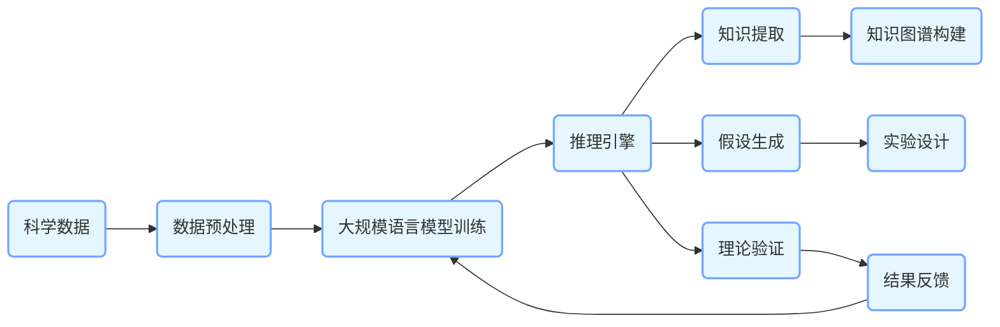

# 大规模语言模型在科学理论生成中的推理应用

> 关键词：大规模语言模型、科学理论生成、推理应用、自然语言处理、人工智能、知识图谱、科学发现

> 摘要：本文聚焦于大规模语言模型在科学理论生成中的推理应用。随着人工智能技术的飞速发展，大规模语言模型展现出强大的语言理解和生成能力，为科学研究带来了新的机遇和挑战。文章深入探讨了大规模语言模型的核心概念、算法原理、数学模型，通过项目实战展示其在科学理论生成中的具体应用，分析实际应用场景，并推荐相关的工具和资源。最后对未来发展趋势与挑战进行总结，旨在为科研人员和相关从业者提供全面且深入的参考，推动大规模语言模型在科学理论生成领域的进一步发展。

## 1. 背景介绍 
### 1.1 目的和范围
本文章的目的在于全面探讨大规模语言模型在科学理论生成中的推理应用。随着科学研究的不断深入，对新理论的需求日益增长，传统的科学理论生成方式面临着效率和创新的双重挑战。大规模语言模型作为一种新兴的技术手段，具有强大的自然语言处理能力，能够处理和分析海量的科学文献和数据，为科学理论的生成提供新的思路和方法。本文将涵盖大规模语言模型的基本概念、算法原理、数学模型，以及其在不同科学领域中的实际应用案例，旨在为读者提供一个系统的、全面的了解。

### 1.2 预期读者
本文预期读者包括科研人员、人工智能领域的从业者、科学哲学家、研究生以及对科学理论生成和人工智能技术感兴趣的爱好者。对于科研人员来说，本文可以为他们在科学研究中利用大规模语言模型提供具体的方法和案例；对于人工智能从业者，有助于他们深入了解大规模语言模型在科学领域的应用需求，推动技术的进一步发展；科学哲学家可以从哲学角度对大规模语言模型在科学理论生成中的作用进行思考；研究生可以将本文作为学习和研究的参考资料；而爱好者则可以通过本文初步了解相关领域的前沿知识。

### 1.3 文档结构概述
本文将按照以下结构进行组织：首先介绍大规模语言模型在科学理论生成中推理应用的背景，包括目的、预期读者和文档结构概述；接着阐述核心概念与联系，通过文本示意图和 Mermaid 流程图展示相关原理和架构；然后详细讲解核心算法原理和具体操作步骤，结合 Python 源代码进行说明；再介绍数学模型和公式，并通过举例进行详细讲解；之后通过项目实战展示代码实际案例和详细解释说明；分析实际应用场景；推荐相关的工具和资源；最后总结未来发展趋势与挑战，提供常见问题与解答以及扩展阅读和参考资料。

### 1.4 术语表
#### 1.4.1 核心术语定义
- **大规模语言模型**：是一种基于深度学习的人工智能模型，通过在大规模文本数据上进行训练，学习语言的模式和规律，能够生成自然语言文本、回答问题、进行文本分类等多种自然语言处理任务。
- **科学理论生成**：指科学家通过观察、实验、推理等方法，构建关于自然现象和规律的理论体系的过程。
- **推理应用**：指利用大规模语言模型的推理能力，在科学理论生成过程中进行知识的提取、关联、预测等操作，辅助科学家发现新的理论和规律。

#### 1.4.2 相关概念解释
- **自然语言处理**：是人工智能的一个重要领域，研究如何让计算机理解和处理人类语言。大规模语言模型是自然语言处理的重要工具之一。
- **知识图谱**：是一种以图的形式表示知识的方法，将实体及其之间的关系进行可视化表示。在科学理论生成中，知识图谱可以帮助大规模语言模型更好地理解科学知识的结构和关联。
- **科学发现**：指科学家在研究过程中发现新的现象、规律和理论的过程。大规模语言模型的推理应用可以为科学发现提供新的线索和思路。

#### 1.4.3 缩略词列表
- **NLP**：Natural Language Processing，自然语言处理
- **LLM**：Large Language Model，大规模语言模型
- **KG**：Knowledge Graph，知识图谱

## 2. 核心概念与联系 

### 核心概念原理
大规模语言模型的核心原理基于深度学习中的神经网络，特别是Transformer架构。Transformer架构通过自注意力机制（Self-Attention Mechanism）能够捕捉文本中不同位置之间的依赖关系，从而更好地理解文本的语义和上下文信息。在训练过程中，大规模语言模型使用无监督学习的方式，通过预测文本中的下一个单词或掩码单词来学习语言的模式和规律。

科学理论生成是一个复杂的过程，涉及到观察、实验、假设、验证等多个环节。大规模语言模型在科学理论生成中的推理应用主要是通过对科学文献、实验数据等文本信息的处理和分析，提取其中的关键知识和信息，发现不同知识之间的关联，从而为新理论的生成提供支持。

### 架构的文本示意图
大规模语言模型在科学理论生成中的推理应用架构主要包括数据层、模型层和应用层。

- **数据层**：包含各种科学文献、实验数据、学术论文等文本数据，以及知识图谱等结构化数据。这些数据是大规模语言模型进行训练和推理的基础。
- **模型层**：主要是大规模语言模型，如GPT、BERT等。模型通过对数据层的数据进行学习和训练，掌握语言的模式和规律，具备自然语言处理和推理能力。
- **应用层**：将大规模语言模型的推理能力应用于科学理论生成的各个环节，如知识提取、假设生成、理论验证等。

### Mermaid 流程图


## 3. 核心算法原理 & 具体操作步骤 

### 核心算法原理
大规模语言模型的核心算法基于Transformer架构，下面我们详细介绍Transformer中的自注意力机制。

自注意力机制的核心思想是计算输入序列中每个位置与其他位置之间的相关性，从而为每个位置分配不同的权重。具体步骤如下：

1. **嵌入（Embedding）**：将输入的文本序列转换为向量表示。
2. **线性变换**：将嵌入向量分别乘以三个不同的权重矩阵，得到查询向量（Query）、键向量（Key）和值向量（Value）。
3. **计算注意力分数**：通过查询向量和键向量的点积计算注意力分数，表示每个位置与其他位置之间的相关性。
4. **应用掩码（可选）**：在某些情况下，需要对注意力分数进行掩码操作，以避免模型关注到未来的信息。
5. **归一化**：使用Softmax函数对注意力分数进行归一化，得到注意力权重。
6. **加权求和**：将注意力权重与值向量相乘并求和，得到每个位置的输出向量。

### Python源代码详细阐述
```python
import torch
import torch.nn as nn
import torch.nn.functional as F

class SelfAttention(nn.Module):
    def __init__(self, input_dim, output_dim, num_heads):
        super(SelfAttention, self).__init__()
        self.input_dim = input_dim
        self.output_dim = output_dim
        self.num_heads = num_heads
        self.head_dim = output_dim // num_heads

        assert (
            self.head_dim * num_heads == output_dim
        ), "Output dimension needs to be divisible by num_heads"

        self.query = nn.Linear(input_dim, output_dim)
        self.key = nn.Linear(input_dim, output_dim)
        self.value = nn.Linear(input_dim, output_dim)
        self.out = nn.Linear(output_dim, output_dim)

    def forward(self, x):
        batch_size, seq_length, input_dim = x.size()

        # 计算查询、键和值向量
        Q = self.query(x)
        K = self.key(x)
        V = self.value(x)

        # 分割多头
        Q = Q.view(batch_size, seq_length, self.num_heads, self.head_dim).transpose(1, 2)
        K = K.view(batch_size, seq_length, self.num_heads, self.head_dim).transpose(1, 2)
        V = V.view(batch_size, seq_length, self.num_heads, self.head_dim).transpose(1, 2)

        # 计算注意力分数
        scores = torch.matmul(Q, K.transpose(-2, -1)) / (self.head_dim ** 0.5)

        # 应用Softmax函数得到注意力权重
        attention_weights = F.softmax(scores, dim=-1)

        # 加权求和得到输出
        out = torch.matmul(attention_weights, V)
        out = out.transpose(1, 2).contiguous().view(batch_size, seq_length, self.output_dim)

        # 线性变换
        out = self.out(out)

        return out

# 示例使用
input_dim = 512
output_dim = 512
num_heads = 8
batch_size = 32
seq_length = 10

x = torch.randn(batch_size, seq_length, input_dim)
self_attention = SelfAttention(input_dim, output_dim, num_heads)
output = self_attention(x)
print(output.shape)
```

### 具体操作步骤
1. **数据准备**：收集和整理科学文献、实验数据等文本数据，并进行预处理，如分词、去除停用词等。
2. **模型选择**：根据具体需求选择合适的大规模语言模型，如GPT、BERT等。
3. **模型训练**：使用预处理后的数据对模型进行训练，调整模型的参数以提高性能。
4. **推理应用**：在科学理论生成的各个环节中，使用训练好的模型进行知识提取、假设生成、理论验证等推理操作。
5. **结果评估**：对推理结果进行评估和验证，根据评估结果调整模型和推理策略。

## 4. 数学模型和公式 & 详细讲解 & 举例说明 

### 自注意力机制的数学模型
自注意力机制的数学模型可以用以下公式表示：

1. **线性变换**：
   - 查询向量 $Q = XW_Q$
   - 键向量 $K = XW_K$
   - 值向量 $V = XW_V$
   其中，$X$ 是输入的嵌入向量，$W_Q$、$W_K$ 和 $W_V$ 分别是查询、键和值的权重矩阵。

2. **注意力分数计算**：
   - 注意力分数 $S = \frac{QK^T}{\sqrt{d_k}}$
   其中，$d_k$ 是键向量的维度。

3. **注意力权重计算**：
   - 注意力权重 $A = \text{Softmax}(S)$

4. **输出计算**：
   - 输出 $O = AV$

### 详细讲解
- **线性变换**：通过线性变换将输入的嵌入向量转换为查询、键和值向量，以便后续计算注意力分数。
- **注意力分数计算**：通过查询向量和键向量的点积计算注意力分数，$\sqrt{d_k}$ 是为了防止点积结果过大，导致Softmax函数的梯度消失。
- **注意力权重计算**：使用Softmax函数对注意力分数进行归一化，得到注意力权重，注意力权重表示每个位置与其他位置之间的相关性。
- **输出计算**：将注意力权重与值向量相乘并求和，得到每个位置的输出向量。

### 举例说明
假设输入的嵌入向量 $X$ 是一个 $3\times 4$ 的矩阵，即有3个位置，每个位置的向量维度为4。查询、键和值的权重矩阵 $W_Q$、$W_K$ 和 $W_V$ 都是 $4\times 4$ 的矩阵。

```python
import torch

# 输入嵌入向量
X = torch.tensor([[1, 2, 3, 4], [5, 6, 7, 8], [9, 10, 11, 12]], dtype=torch.float32)

# 权重矩阵
W_Q = torch.tensor([[0.1, 0.2, 0.3, 0.4], [0.5, 0.6, 0.7, 0.8], [0.9, 1.0, 1.1, 1.2], [1.3, 1.4, 1.5, 1.6]], dtype=torch.float32)
W_K = torch.tensor([[0.2, 0.3, 0.4, 0.5], [0.6, 0.7, 0.8, 0.9], [1.0, 1.1, 1.2, 1.3], [1.4, 1.5, 1.6, 1.7]], dtype=torch.float32)
W_V = torch.tensor([[0.3, 0.4, 0.5, 0.6], [0.7, 0.8, 0.9, 1.0], [1.1, 1.2, 1.3, 1.4], [1.5, 1.6, 1.7, 1.8]], dtype=torch.float32)

# 计算查询、键和值向量
Q = torch.matmul(X, W_Q)
K = torch.matmul(X, W_K)
V = torch.matmul(X, W_V)

# 计算注意力分数
d_k = K.shape[-1]
scores = torch.matmul(Q, K.transpose(-2, -1)) / (d_k ** 0.5)

# 计算注意力权重
attention_weights = torch.softmax(scores, dim=-1)

# 计算输出
out = torch.matmul(attention_weights, V)

print("输入嵌入向量 X:", X)
print("查询向量 Q:", Q)
print("键向量 K:", K)
print("值向量 V:", V)
print("注意力分数 S:", scores)
print("注意力权重 A:", attention_weights)
print("输出 O:", out)
```

通过上述代码，我们可以看到自注意力机制的具体计算过程，从输入嵌入向量到最终输出的详细步骤。

## 5. 项目实战：代码实际案例和详细解释说明 

### 5.1  开发环境搭建
- **操作系统**：推荐使用Linux或macOS系统，也可以使用Windows系统。
- **Python版本**：推荐使用Python 3.7及以上版本。
- **深度学习框架**：使用PyTorch作为深度学习框架，可通过以下命令安装：
```bash
pip install torch torchvision
```
- **其他依赖库**：安装transformers库用于使用预训练的大规模语言模型，以及其他辅助库，如numpy、pandas等。
```bash
pip install transformers numpy pandas
```

### 5.2  源代码详细实现和代码解读
以下是一个使用Hugging Face的transformers库进行科学文献知识提取的示例代码：

```python
from transformers import AutoTokenizer, AutoModelForQuestionAnswering
import torch

# 加载预训练的模型和分词器
model_name = "bert-large-uncased-whole-word-masking-finetuned-squad"
tokenizer = AutoTokenizer.from_pretrained(model_name)
model = AutoModelForQuestionAnswering.from_pretrained(model_name)

# 科学文献文本
context = """
在物理学中，牛顿第二定律是一个非常重要的定律。它指出物体的加速度与作用在物体上的合外力成正比，与物体的质量成反比。
数学表达式为 $F = ma$，其中 $F$ 是合外力，$m$ 是物体的质量，$a$ 是物体的加速度。
"""

# 问题
question = "牛顿第二定律的数学表达式是什么？"

# 对输入进行编码
inputs = tokenizer(question, context, return_tensors='pt')

# 模型推理
with torch.no_grad():
    outputs = model(**inputs)

# 获取答案的起始和结束位置
answer_start_index = outputs.start_logits.argmax()
answer_end_index = outputs.end_logits.argmax()

# 提取答案
predict_answer_tokens = inputs.input_ids[0, answer_start_index : answer_end_index + 1]
answer = tokenizer.decode(predict_answer_tokens)

print("问题:", question)
print("答案:", answer)
```

### 代码解读与分析
1. **模型和分词器加载**：使用`AutoTokenizer`和`AutoModelForQuestionAnswering`从Hugging Face的模型库中加载预训练的BERT模型和对应的分词器。
2. **数据准备**：定义科学文献文本`context`和问题`question`，将问题和文本作为输入传递给分词器进行编码。
3. **模型推理**：使用`torch.no_grad()`上下文管理器关闭梯度计算，提高推理速度。将编码后的输入传递给模型，得到输出结果。
4. **答案提取**：通过`start_logits`和`end_logits`的最大值确定答案的起始和结束位置，然后使用分词器解码提取答案。

这个示例展示了如何使用大规模语言模型进行科学文献中的知识提取，通过提出问题的方式从文本中获取关键信息。

## 6. 实际应用场景 
### 物理学领域
在物理学中，大规模语言模型可以帮助物理学家快速检索和整理大量的文献资料，提取关键的理论和实验数据。例如，在研究新的物理现象时，模型可以通过对相关文献的分析，生成可能的理论假设，为实验设计提供参考。同时，模型还可以对实验数据进行分析和解释，帮助物理学家发现新的规律和现象。

### 生物学领域
在生物学中，大规模语言模型可以应用于基因序列分析、蛋白质结构预测、药物研发等多个方面。例如，通过对大量的基因序列数据进行分析，模型可以预测基因的功能和相互作用，为疾病的诊断和治疗提供新的思路。在药物研发中，模型可以帮助筛选潜在的药物靶点，预测药物的疗效和副作用。

### 化学领域
在化学领域，大规模语言模型可以用于化学反应预测、材料设计等方面。例如，通过对化学反应的机理和条件进行分析，模型可以预测新的化学反应和产物，为化学合成提供指导。在材料设计中，模型可以根据材料的性能要求，设计出具有特定结构和性能的新材料。

### 社会科学领域
在社会科学领域，大规模语言模型可以用于文本分析、舆情监测、政策评估等方面。例如，通过对社交媒体文本的分析，模型可以了解公众的意见和态度，为政策制定提供参考。在政策评估中，模型可以对政策的实施效果进行分析和预测，为政策的调整和优化提供依据。

## 7. 工具和资源推荐
### 7.1 学习资源推荐
#### 7.1.1 书籍推荐
- 《深度学习》（Deep Learning）：由Ian Goodfellow、Yoshua Bengio和Aaron Courville合著，是深度学习领域的经典教材，全面介绍了深度学习的基本原理和方法。
- 《自然语言处理入门》（Natural Language Processing in Action）：由Hobson Lane、Cole Howard和 Hannes Hapke合著，详细介绍了自然语言处理的基本概念和技术，包括大规模语言模型的应用。
- 《人工智能：一种现代的方法》（Artificial Intelligence: A Modern Approach）：由Stuart Russell和Peter Norvig合著，是人工智能领域的权威教材，涵盖了人工智能的各个方面，包括自然语言处理和机器学习。

#### 7.1.2 在线课程
- Coursera上的“深度学习专项课程”（Deep Learning Specialization）：由Andrew Ng教授主讲，包括深度学习的基础、卷积神经网络、循环神经网络等多个课程，是学习深度学习的优质课程。
- edX上的“自然语言处理”（Natural Language Processing）：由Columbia University提供，介绍了自然语言处理的基本概念、技术和应用，包括大规模语言模型的原理和使用。
- 哔哩哔哩（B 站）上有许多关于深度学习和自然语言处理的教学视频，可以帮助初学者快速入门。

#### 7.1.3 技术博客和网站
- Hugging Face博客（https://huggingface.co/blog）：提供了关于大规模语言模型和自然语言处理的最新研究成果和技术应用案例。
- OpenAI博客（https://openai.com/blog）：OpenAI公司的官方博客，发布了关于GPT系列模型的最新进展和研究成果。
- arXiv（https://arxiv.org/）：一个预印本平台，包含了大量的计算机科学、物理学、数学等领域的研究论文，是获取最新研究成果的重要渠道。

### 7.2 开发工具框架推荐
#### 7.2.1 IDE和编辑器
- PyCharm：一款专业的Python集成开发环境，提供了丰富的代码编辑、调试、版本控制等功能，适合大规模项目的开发。
- Visual Studio Code：一款轻量级的代码编辑器，支持多种编程语言和插件扩展，具有良好的用户体验和社区支持。
- Jupyter Notebook：一种交互式的开发环境，适合进行数据分析、模型训练和实验验证，方便代码的展示和分享。

#### 7.2.2 调试和性能分析工具
- PyTorch Profiler：PyTorch自带的性能分析工具，可以帮助开发者分析模型的运行时间、内存使用等情况，优化模型的性能。
- TensorBoard：一个可视化工具，可用于查看模型的训练过程、损失曲线、准确率等指标，帮助开发者调试和优化模型。
- cProfile：Python标准库中的性能分析工具，可以分析Python代码的执行时间和函数调用关系，找出性能瓶颈。

#### 7.2.3 相关框架和库
- Hugging Face Transformers：一个用于自然语言处理的开源库，提供了大量的预训练模型和工具，方便开发者使用和微调大规模语言模型。
- PyTorch：一个开源的深度学习框架，具有动态图和静态图的优点，广泛应用于自然语言处理、计算机视觉等领域。
- NumPy：一个用于科学计算的Python库，提供了高效的多维数组对象和数学函数，是深度学习和自然语言处理的基础库之一。

### 7.3 相关论文著作推荐
#### 7.3.1 经典论文
- “Attention Is All You Need”：介绍了Transformer架构，是大规模语言模型的核心技术之一。
- “BERT: Pre-training of Deep Bidirectional Transformers for Language Understanding”：提出了BERT模型，开创了预训练语言模型的先河。
- “GPT-3: Language Models are Few-Shot Learners”：介绍了GPT-3模型，展示了大规模语言模型在少样本学习方面的强大能力。

#### 7.3.2 最新研究成果
- 关注arXiv、NeurIPS、ACL等学术会议和预印本平台上的最新论文，了解大规模语言模型在科学理论生成中的最新研究进展。

#### 7.3.3 应用案例分析
- 查看相关领域的学术期刊和会议论文，了解大规模语言模型在物理学、生物学、化学等领域的实际应用案例和效果评估。

## 8. 总结：未来发展趋势与挑战
### 未来发展趋势
- **模型规模不断扩大**：随着计算资源的不断提升和技术的不断进步，大规模语言模型的规模将继续扩大，模型的性能和能力将进一步提高。
- **多模态融合**：未来的大规模语言模型将不仅仅局限于文本处理，还将融合图像、音频、视频等多种模态的信息，实现更加全面和深入的理解和推理。
- **领域专用模型**：针对不同的科学领域，将开发出更加专业和高效的领域专用模型，提高模型在特定领域的应用效果。
- **与知识图谱深度融合**：大规模语言模型将与知识图谱深度融合，利用知识图谱的结构化知识来增强模型的推理能力和知识表示能力。

### 挑战
- **数据质量和隐私问题**：大规模语言模型的训练需要大量的数据，数据的质量和隐私问题是一个重要的挑战。如何获取高质量、标注准确的数据，同时保护数据的隐私和安全，是需要解决的问题。
- **计算资源和能耗问题**：训练大规模语言模型需要大量的计算资源和能源消耗，如何降低计算成本和能耗，提高模型的训练效率，是一个亟待解决的问题。
- **模型可解释性问题**：大规模语言模型通常是一个黑盒模型，其决策过程和推理机制难以解释。如何提高模型的可解释性，让科学家和用户能够理解模型的决策依据，是一个重要的研究方向。
- **伦理和社会影响问题**：大规模语言模型的应用可能会带来一些伦理和社会问题，如虚假信息传播、偏见和歧视等。如何规范模型的应用，避免其带来的负面影响，是需要关注的问题。

## 9. 附录：常见问题与解答
### 1. 大规模语言模型在科学理论生成中的准确性如何保证？
大规模语言模型的准确性可以通过以下几个方面来保证：
- **数据质量**：使用高质量、标注准确的数据进行训练，确保模型学习到正确的知识和模式。
- **模型选择和调优**：选择合适的模型架构，并对模型进行调优，以提高模型的性能和准确性。
- **后处理和验证**：对模型的输出结果进行后处理和验证，结合领域知识和专家意见，对结果进行筛选和修正。

### 2. 大规模语言模型是否可以完全替代科学家进行科学理论生成？
目前大规模语言模型还不能完全替代科学家进行科学理论生成。虽然模型具有强大的语言处理和推理能力，但科学理论生成是一个复杂的创造性过程，需要科学家的观察、实验、思考和判断等能力。大规模语言模型可以作为科学家的辅助工具，为科学理论生成提供新的思路和方法。

### 3. 如何选择适合科学理论生成的大规模语言模型？
选择适合科学理论生成的大规模语言模型可以考虑以下几个因素：
- **模型性能**：评估模型在自然语言处理任务上的性能，如准确率、召回率等。
- **模型规模**：模型规模越大，通常性能越好，但计算资源和时间成本也越高。需要根据实际情况选择合适的模型规模。
- **领域适应性**：考虑模型在特定科学领域的适应性，是否有相关的预训练模型或微调方法。
- **可解释性**：对于一些对可解释性要求较高的科学领域，选择具有较好可解释性的模型。

### 4. 大规模语言模型在科学理论生成中的应用是否存在局限性？
大规模语言模型在科学理论生成中的应用存在一定的局限性：
- **知识的局限性**：模型的知识来源于训练数据，可能存在知识的不完整性和偏差。
- **推理能力的局限性**：模型的推理能力主要基于统计和模式匹配，对于一些复杂的逻辑推理和创造性思维能力有限。
- **语言理解的局限性**：模型对语言的理解可能存在歧义，特别是对于一些专业术语和科学概念的理解可能不准确。

## 10. 扩展阅读 & 参考资料
### 扩展阅读
- 《科学革命的结构》（The Structure of Scientific Revolutions）：由Thomas S. Kuhn著，探讨了科学发展的模式和规律，对于理解科学理论生成的过程具有重要的参考价值。
- 《人工智能哲学》（Philosophy of Artificial Intelligence）：由Margaret A. Boden编，介绍了人工智能领域的哲学问题和思考，对于思考大规模语言模型在科学理论生成中的作用和影响具有启发意义。

### 参考资料
- Hugging Face官方文档（https://huggingface.co/docs/transformers/index）：提供了关于Transformer库的详细文档和使用说明。
- PyTorch官方文档（https://pytorch.org/docs/stable/index.html）：PyTorch的官方文档，包含了PyTorch的各种功能和接口的详细介绍。
- OpenAI官方网站（https://openai.com/）：OpenAI公司的官方网站，发布了关于GPT系列模型的最新信息和研究成果。