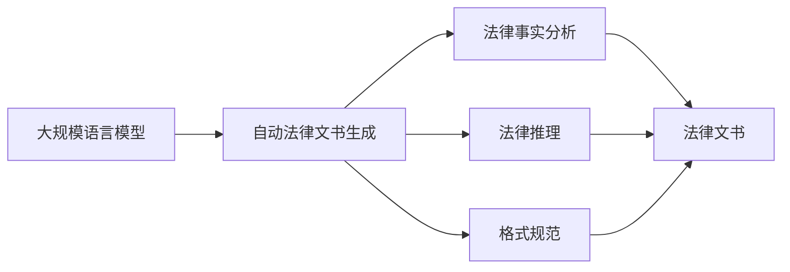

# 大规模语言模型在自动法律文书生成中的应用

> 关键词：大规模语言模型、自动法律文书生成、自然语言处理、法律技术、人工智能、法律推理、文本生成

> 摘要：本文聚焦于大规模语言模型在自动法律文书生成中的应用。首先介绍相关背景，包括目的范围、预期读者等内容。接着阐述大规模语言模型及自动法律文书生成的核心概念与联系，分析其核心算法原理和具体操作步骤，结合数学模型与公式深入讲解。通过项目实战展示代码案例并详细解释，探讨实际应用场景。同时推荐相关工具和资源，总结未来发展趋势与挑战，解答常见问题并提供扩展阅读与参考资料，旨在全面呈现大规模语言模型在自动法律文书生成领域的技术应用与发展前景。

## 1. 背景介绍 
### 1.1 目的和范围
在当今数字化时代，法律行业面临着处理大量文书工作的挑战。自动法律文书生成的目的在于提高法律文书撰写的效率和质量，减少人为错误，同时降低法律从业者的工作负担。本文章的范围主要涵盖大规模语言模型在自动法律文书生成中的原理、技术实现、实际应用以及未来发展等方面，旨在全面探讨如何利用先进的人工智能技术推动法律文书生成的自动化进程。

### 1.2 预期读者
本文预期读者包括法律从业者，如律师、法官、法务人员等，他们可以了解如何借助大规模语言模型提升法律文书撰写工作的效率和准确性；人工智能和自然语言处理领域的研究人员和开发者，他们可以从法律应用场景的角度获取技术创新的灵感；法律科技公司的相关人员，以便更好地开发和推广相关的法律科技产品；以及对法律与科技交叉领域感兴趣的普通读者。

### 1.3 文档结构概述
本文首先介绍背景信息，让读者了解研究的目的、范围和预期读者。接着阐述大规模语言模型和自动法律文书生成的核心概念与联系，为后续内容奠定理论基础。然后详细讲解核心算法原理和具体操作步骤，结合数学模型与公式深入剖析技术细节。通过项目实战展示实际代码案例并进行详细解读，使读者了解技术的实际应用。探讨实际应用场景，分析大规模语言模型在不同法律场景下的作用。推荐相关的工具和资源，帮助读者进一步学习和研究。总结未来发展趋势与挑战，为行业发展提供思考方向。最后通过附录解答常见问题，并提供扩展阅读与参考资料。

### 1.4 术语表
#### 1.4.1 核心术语定义
- **大规模语言模型**：是一种基于深度学习的人工智能模型，通过在大规模文本数据上进行训练，学习语言的模式和规律，能够生成自然流畅的文本。例如GPT - 3、BERT等。
- **自动法律文书生成**：利用计算机技术和人工智能算法，根据给定的法律事实、法律规则等信息，自动生成符合法律规范和格式要求的法律文书的过程。
- **自然语言处理（NLP）**：是计算机科学与语言学的交叉领域，旨在让计算机理解、处理和生成人类语言，包括文本分类、命名实体识别、文本生成等任务。

#### 1.4.2 相关概念解释
- **法律推理**：是指法律人在法律适用过程中，运用证据确认案件事实，寻找、选择和分析法律规范，从而得出法律决定的思维活动。在自动法律文书生成中，法律推理是确定文书内容和逻辑的重要依据。
- **文本生成**：是自然语言处理的一个重要任务，指的是根据给定的输入信息，生成具有一定语义和语法正确性的文本。在自动法律文书生成中，文本生成用于根据法律事实和法律规则生成具体的文书内容。

#### 1.4.3 缩略词列表
- **NLP**：Natural Language Processing（自然语言处理）
- **GPT**：Generative Pretrained Transformer（生成式预训练变换器）
- **BERT**：Bidirectional Encoder Representations from Transformers（基于变换器的双向编码器表示）

## 2. 核心概念与联系 

### 大规模语言模型原理
大规模语言模型通常基于Transformer架构，Transformer是一种基于注意力机制的深度学习模型，它能够捕捉文本中的长距离依赖关系。以GPT系列为例，其采用了自回归的方式进行训练，通过预测下一个单词来学习语言的模式。

### 自动法律文书生成原理
自动法律文书生成需要综合考虑法律事实、法律规则和文书格式等因素。首先对输入的法律事实进行分析和理解，然后根据相关的法律规则进行推理，最后按照特定的文书格式生成最终的法律文书。

### 两者联系
大规模语言模型为自动法律文书生成提供了强大的文本生成能力。它可以根据输入的法律信息，生成符合语法和语义要求的法律文书文本。同时，自动法律文书生成的任务需求也为大规模语言模型的发展提供了新的应用场景和挑战，促使模型不断优化和改进。

### 文本示意图
```plaintext
大规模语言模型
    |
    | 提供文本生成能力
    v
自动法律文书生成
    |
    | 包含法律事实分析、法律推理、格式规范
    v
法律文书
```

### Mermaid流程图


## 3. 核心算法原理 & 具体操作步骤 

### 核心算法原理
以基于Transformer的大规模语言模型为例，其核心是多头自注意力机制。多头自注意力机制允许模型在不同的表示子空间中并行地关注输入序列的不同部分，从而捕捉到更丰富的语义信息。

以下是多头自注意力机制的Python代码实现：
```python
import torch
import torch.nn as nn

class MultiHeadAttention(nn.Module):
    def __init__(self, d_model, num_heads):
        super(MultiHeadAttention, self).__init__()
        self.d_model = d_model
        self.num_heads = num_heads
        self.d_k = d_model // num_heads

        self.W_q = nn.Linear(d_model, d_model)
        self.W_k = nn.Linear(d_model, d_model)
        self.W_v = nn.Linear(d_model, d_model)
        self.W_o = nn.Linear(d_model, d_model)

    def scaled_dot_product_attention(self, Q, K, V, mask=None):
        attn_scores = torch.matmul(Q, K.transpose(-2, -1)) / torch.sqrt(torch.tensor(self.d_k, dtype=torch.float32))
        if mask is not None:
            attn_scores = attn_scores.masked_fill(mask == 0, -1e9)
        attn_probs = torch.softmax(attn_scores, dim=-1)
        output = torch.matmul(attn_probs, V)
        return output

    def split_heads(self, x):
        batch_size, seq_length, d_model = x.size()
        return x.view(batch_size, seq_length, self.num_heads, self.d_k).transpose(1, 2)

    def combine_heads(self, x):
        batch_size, num_heads, seq_length, d_k = x.size()
        return x.transpose(1, 2).contiguous().view(batch_size, seq_length, self.d_model)

    def forward(self, Q, K, V, mask=None):
        Q = self.split_heads(self.W_q(Q))
        K = self.split_heads(self.W_k(K))
        V = self.split_heads(self.W_v(V))

        attn_output = self.scaled_dot_product_attention(Q, K, V, mask)
        output = self.W_o(self.combine_heads(attn_output))
        return output
```

### 具体操作步骤
1. **数据预处理**：收集大量的法律文书数据，对数据进行清洗、标注和分词等处理，将文本数据转换为模型可以处理的格式。
2. **模型训练**：使用预处理后的数据对大规模语言模型进行训练，调整模型的参数，使其能够学习到法律语言的模式和规律。
3. **法律事实输入**：将具体的法律事实以文本的形式输入到模型中。
4. **法律推理和文本生成**：模型根据输入的法律事实，结合训练学到的知识进行法律推理，并生成相应的法律文书文本。
5. **格式调整**：对生成的文本进行格式调整，使其符合法律文书的规范要求。

## 4. 数学模型和公式 & 详细讲解 & 举例说明 

### 多头自注意力机制数学模型
多头自注意力机制的计算过程可以用以下公式表示：

$$
\text{MultiHead}(Q, K, V) = \text{Concat}(\text{head}_1, \ldots, \text{head}_h)W^O
$$

其中，

$$
\text{head}_i = \text{Attention}(QW_i^Q, KW_i^K, VW_i^V)
$$

$$
\text{Attention}(Q, K, V) = \text{softmax}\left(\frac{QK^T}{\sqrt{d_k}}\right)V
$$

### 详细讲解
- $Q$、$K$、$V$ 分别是查询（Query）、键（Key）和值（Value）矩阵，它们是通过对输入的词向量进行线性变换得到的。
- $W_i^Q$、$W_i^K$、$W_i^V$ 是第 $i$ 个头的投影矩阵，用于将输入的词向量投影到不同的子空间中。
- $d_k$ 是键向量的维度，$\sqrt{d_k}$ 用于缩放注意力分数，防止点积结果过大。
- $\text{softmax}$ 函数用于将注意力分数转换为概率分布，使得所有注意力分数的和为 1。
- $W^O$ 是输出投影矩阵，用于将多头注意力的结果进行线性变换，得到最终的输出。

### 举例说明
假设输入的词向量维度为 $d_{model}=512$，多头注意力机制的头数为 $h = 8$，则每个头的键向量维度为 $d_k = \frac{d_{model}}{h} = 64$。对于一个长度为 $n$ 的输入序列，$Q$、$K$、$V$ 矩阵的形状分别为 $(n, d_{model})$。经过线性变换和多头拆分后，每个头的 $Q$、$K$、$V$ 矩阵的形状变为 $(n, d_k)$。然后计算注意力分数，经过 $\text{softmax}$ 函数得到注意力概率分布，再与 $V$ 矩阵相乘得到每个头的输出。最后将所有头的输出拼接起来，经过输出投影矩阵 $W^O$ 得到最终的多头注意力输出。

## 5. 项目实战：代码实际案例和详细解释说明 

### 5.1  开发环境搭建
1. **安装Python**：确保系统中安装了Python 3.7 及以上版本。
2. **安装深度学习框架**：使用 `pip` 安装 PyTorch 深度学习框架，根据自己的 CUDA 版本选择合适的安装命令。例如，对于 CUDA 11.3：
```bash
pip install torch torchvision torchaudio --extra-index-url https://download.pytorch.org/whl/cu113
```
3. **安装其他依赖库**：安装 `transformers` 库，用于使用预训练的大规模语言模型。
```bash
pip install transformers
```

### 5.2  源代码详细实现和代码解读
以下是一个简单的使用 `transformers` 库进行自动法律文书生成的示例代码：
```python
from transformers import AutoTokenizer, AutoModelForCausalLM

# 加载预训练的语言模型和分词器
model_name = "gpt2"
tokenizer = AutoTokenizer.from_pretrained(model_name)
model = AutoModelForCausalLM.from_pretrained(model_name)

# 输入法律事实
legal_fact = "甲向乙借款 10 万元，约定还款日期为 2023 年 12 月 31 日，但甲到期未还。"

# 对输入进行编码
input_ids = tokenizer.encode(legal_fact, return_tensors="pt")

# 生成法律文书文本
output = model.generate(input_ids, max_length=200, num_beams=5, no_repeat_ngram_size=2, early_stopping=True)

# 解码生成的文本
generated_text = tokenizer.decode(output[0], skip_special_tokens=True)

print("生成的法律文书文本：")
print(generated_text)
```
### 代码解读
1. **加载预训练模型和分词器**：使用 `AutoTokenizer` 和 `AutoModelForCausalLM` 从 Hugging Face 的模型库中加载预训练的 GPT - 2 模型和对应的分词器。
2. **输入法律事实**：定义一个法律事实的文本字符串。
3. **编码输入**：使用分词器将输入的法律事实文本编码为模型可以处理的输入 ID。
4. **生成文本**：调用模型的 `generate` 方法生成法律文书文本，设置了最大长度、束搜索的束数、避免重复的 n - gram 大小等参数。
5. **解码文本**：使用分词器将生成的 ID 序列解码为人类可读的文本。

### 5.3  代码解读与分析
- **优点**：使用预训练的大规模语言模型可以快速实现自动法律文书生成，减少了模型训练的时间和成本。`transformers` 库提供了方便的接口，使得代码实现简单易懂。
- **局限性**：预训练的通用语言模型可能对法律领域的专业知识和规则理解不足，生成的法律文书可能存在不准确或不规范的问题。需要进一步对模型进行微调或结合专业的法律知识图谱来提高生成质量。

## 6. 实际应用场景 
### 律师事务所
律师在处理大量案件时，需要撰写各种法律文书，如起诉状、答辩状、代理词等。大规模语言模型可以帮助律师快速生成初步的法律文书文本，律师可以在此基础上进行修改和完善，提高工作效率。

### 法院
法院在审理案件过程中需要制作判决书、裁定书等法律文书。自动法律文书生成系统可以根据案件的事实和法律依据，生成规范的法律文书，减少法官的文书撰写工作量，提高文书的准确性和一致性。

### 企业法务部门
企业法务人员需要处理合同审查、合规文件起草等工作。大规模语言模型可以辅助法务人员生成合同模板、合规报告等法律文件，提高法务工作的效率和质量。

### 法律智能客服
在法律智能客服系统中，大规模语言模型可以根据用户的咨询问题，生成相关的法律建议和文书模板，为用户提供快速的法律帮助。

## 7. 工具和资源推荐
### 7.1 学习资源推荐
#### 7.1.1 书籍推荐
- 《自然语言处理入门》：这本书系统地介绍了自然语言处理的基本概念、算法和技术，适合初学者入门。
- 《深度学习》：由 Ian Goodfellow、Yoshua Bengio 和 Aaron Courville 合著，是深度学习领域的经典教材，深入讲解了深度学习的原理和应用。
- 《法律人工智能：文本分析与信息检索》：专门介绍了人工智能在法律领域的应用，包括文本分析、信息检索和法律文书生成等内容。

#### 7.1.2 在线课程
- Coursera 上的 “Natural Language Processing Specialization”：由斯坦福大学教授授课，全面介绍了自然语言处理的各个方面。
- edX 上的 “Deep Learning Fundamentals”：帮助学习者掌握深度学习的基本概念和技术。
- 中国大学 MOOC 上的 “法律人工智能”：结合法律专业知识和人工智能技术，讲解法律领域的智能应用。

#### 7.1.3 技术博客和网站
- Hugging Face Blog：提供了关于大规模语言模型和自然语言处理的最新研究成果和技术应用案例。
- Towards Data Science：有许多关于人工智能和自然语言处理的技术文章和教程。
- 法律信息网：包含了丰富的法律知识和案例，可用于法律数据的收集和研究。

### 7.2 开发工具框架推荐
#### 7.2.1 IDE和编辑器
- PyCharm：是一款专业的 Python 集成开发环境，提供了丰富的代码编辑、调试和项目管理功能。
- Visual Studio Code：轻量级的代码编辑器，支持多种编程语言和插件扩展，适合快速开发和调试。

#### 7.2.2 调试和性能分析工具
- TensorBoard：是 TensorFlow 提供的可视化工具，可以用于监控模型训练过程中的损失函数、准确率等指标，分析模型的性能。
- PyTorch Profiler：用于分析 PyTorch 模型的性能瓶颈，帮助优化模型的训练和推理速度。

#### 7.2.3 相关框架和库
- Transformers：Hugging Face 开发的用于自然语言处理的开源库，提供了大量预训练的语言模型和工具，方便进行文本生成、分类等任务。
- AllenNLP：一个深度学习框架，专注于自然语言处理任务，提供了丰富的模型和工具，支持快速开发和实验。

### 7.3 相关论文著作推荐
#### 7.3.1 经典论文
- “Attention Is All You Need”：介绍了 Transformer 架构，是大规模语言模型的基础。
- “BERT: Pre-training of Deep Bidirectional Transformers for Language Understanding”：提出了 BERT 模型，开创了预训练语言模型的新时代。

#### 7.3.2 最新研究成果
- 关注 ACL（Association for Computational Linguistics）、EMNLP（Conference on Empirical Methods in Natural Language Processing）等自然语言处理领域的顶级会议，了解最新的研究成果。

#### 7.3.3 应用案例分析
- 可以在法律科技相关的学术期刊和会议上查找关于大规模语言模型在自动法律文书生成中的应用案例分析，学习实际应用中的经验和教训。

## 8. 总结：未来发展趋势与挑战
### 未来发展趋势
- **专业化定制**：大规模语言模型将针对法律领域进行更深入的专业化定制，结合法律知识图谱和专业法律数据，提高生成法律文书的准确性和专业性。
- **多模态融合**：未来的自动法律文书生成系统可能会融合文本、图像、音频等多模态信息，例如结合法庭录像、证人证言等信息，生成更全面、准确的法律文书。
- **人机协作**：实现人与机器的高效协作，律师和法官等法律从业者可以利用大规模语言模型提供的辅助信息，进行更智能、高效的法律决策和文书撰写。

### 挑战
- **法律知识理解**：大规模语言模型需要更好地理解法律知识和法律规则，避免生成的法律文书出现法律错误或逻辑漏洞。
- **数据隐私和安全**：法律数据涉及大量的个人隐私和敏感信息，需要确保数据的隐私和安全，防止数据泄露和滥用。
- **伦理和法律问题**：自动法律文书生成可能会引发一系列伦理和法律问题，如责任归属、文书的法律效力等，需要制定相应的法律法规和伦理准则来规范。

## 9. 附录：常见问题与解答
### 问题 1：大规模语言模型生成的法律文书是否具有法律效力？
解答：目前大规模语言模型生成的法律文书本身不具有法律效力。法律文书的法律效力需要遵循相关的法律程序和规定，由合法的法律主体签署和发布。大规模语言模型生成的文本可以作为参考和辅助，最终的法律文书需要经过法律专业人员的审核和确认。

### 问题 2：如何提高大规模语言模型在自动法律文书生成中的准确性？
解答：可以从以下几个方面提高准确性：1. 使用专业的法律数据对模型进行微调；2. 结合法律知识图谱，为模型提供更准确的法律知识和规则；3. 引入人工审核和修正机制，对生成的法律文书进行质量控制。

### 问题 3：大规模语言模型在自动法律文书生成中会取代法律从业者吗？
解答：不会。大规模语言模型只是一种辅助工具，它可以提高法律文书撰写的效率和质量，但法律从业者的专业知识、经验和判断力是不可替代的。在法律实践中，法律从业者需要对案件进行深入分析、进行法律推理和决策，这些工作需要人类的智慧和专业素养。

## 10. 扩展阅读 & 参考资料
### 扩展阅读
- 《人工智能时代的法律变革》：探讨了人工智能对法律领域的全面影响和变革。
- 《法律的未来：数字时代的法律与社会》：分析了数字时代法律的发展趋势和面临的挑战。

### 参考资料
- Hugging Face 官方文档：https://huggingface.co/docs
- PyTorch 官方文档：https://pytorch.org/docs/stable/index.html
- 相关法律数据库和文献，如北大法宝、中国裁判文书网等。