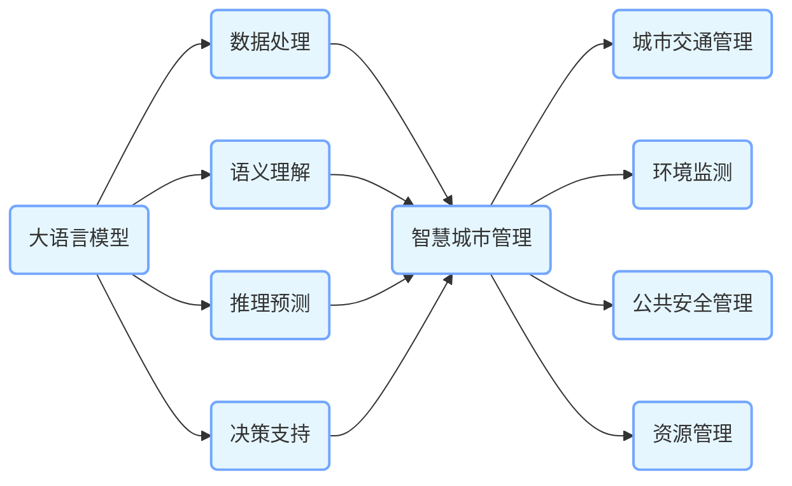

# 大语言模型在智慧城市管理中的推理应用

> 关键词：大语言模型、智慧城市管理、推理应用、人工智能、数据处理、智能决策、城市治理

> 摘要：本文聚焦于大语言模型在智慧城市管理中的推理应用。首先介绍了相关背景，包括目的范围、预期读者等内容。接着阐述大语言模型的核心概念及其与智慧城市管理的联系，详细讲解核心算法原理与操作步骤，通过数学模型和公式深入剖析。结合项目实战给出代码实际案例及解释，探讨其在实际应用场景中的表现。推荐了相关工具和资源，最后总结大语言模型在智慧城市管理中的未来发展趋势与挑战，并对常见问题进行解答，提供扩展阅读与参考资料，旨在全面展示大语言模型在智慧城市管理中推理应用的技术原理、实践方法和发展前景。

## 1. 背景介绍 
### 1.1 目的和范围
在当今数字化时代，智慧城市管理已成为城市发展的重要方向。随着城市规模的不断扩大和人口的持续增长，城市管理面临着越来越多的挑战，如交通拥堵、环境污染、资源分配不均等。大语言模型作为人工智能领域的重要成果，具有强大的自然语言处理和推理能力，为解决智慧城市管理中的复杂问题提供了新的思路和方法。

本文的目的在于深入探讨大语言模型在智慧城市管理中的推理应用，详细阐述其技术原理、实现方法和实际应用效果。范围涵盖了大语言模型在城市交通、环境监测、公共安全、资源管理等多个领域的推理应用，旨在为智慧城市管理者、技术开发者和相关研究人员提供全面的参考和指导。

### 1.2 预期读者
本文的预期读者包括但不限于以下几类人群：
- **智慧城市管理者**：希望通过了解大语言模型的推理应用，提升城市管理的效率和决策的科学性，实现城市的可持续发展。
- **人工智能技术开发者**：对大语言模型在智慧城市管理中的应用感兴趣，希望学习相关技术原理和实现方法，开展具体的开发工作。
- **科研人员**：关注人工智能与智慧城市管理的交叉领域，希望通过本文了解最新的研究成果和发展趋势，为进一步的研究提供参考。
- **相关专业学生**：希望通过阅读本文，拓宽专业视野，了解大语言模型在实际应用中的价值和意义。

### 1.3 文档结构概述
本文共分为十个部分，具体结构如下：
1. **背景介绍**：介绍本文的目的、范围、预期读者和文档结构概述，以及相关术语的定义和解释。
2. **核心概念与联系**：阐述大语言模型和智慧城市管理的核心概念，分析它们之间的联系，并通过文本示意图和 Mermaid 流程图进行展示。
3. **核心算法原理 & 具体操作步骤**：详细讲解大语言模型的核心算法原理，使用 Python 源代码进行阐述，并给出具体的操作步骤。
4. **数学模型和公式 & 详细讲解 & 举例说明**：介绍大语言模型的数学模型和公式，进行详细讲解，并通过具体例子进行说明。
5. **项目实战：代码实际案例和详细解释说明**：结合实际项目，给出大语言模型在智慧城市管理中推理应用的代码案例，并进行详细的解释和分析。
6. **实际应用场景**：探讨大语言模型在城市交通、环境监测、公共安全、资源管理等多个领域的实际应用场景。
7. **工具和资源推荐**：推荐相关的学习资源、开发工具框架和论文著作，帮助读者进一步深入学习和研究。
8. **总结：未来发展趋势与挑战**：总结大语言模型在智慧城市管理中的未来发展趋势和面临的挑战。
9. **附录：常见问题与解答**：对读者可能关心的常见问题进行解答。
10. **扩展阅读 & 参考资料**：提供相关的扩展阅读材料和参考资料，方便读者进一步查阅。

### 1.4 术语表
#### 1.4.1 核心术语定义
- **大语言模型（Large Language Model）**：是一种基于深度学习的人工智能模型，通过对大量文本数据的学习，能够生成自然语言文本、理解语义、进行推理等任务。
- **智慧城市管理（Smart City Management）**：是指利用信息技术和智能化手段，对城市的运行、管理和服务进行全面、高效、精准的管理，以提高城市的运行效率、改善居民生活质量、促进城市的可持续发展。
- **推理（Reasoning）**：是指从已知的事实和规则出发，通过逻辑运算和推导，得出新的结论和知识的过程。在大语言模型中，推理通常是指根据输入的文本信息，生成合理的回答或预测结果。

#### 1.4.2 相关概念解释
- **自然语言处理（Natural Language Processing，NLP）**：是人工智能的一个重要分支，主要研究如何让计算机理解、处理和生成自然语言文本。大语言模型是自然语言处理领域的重要成果之一。
- **人工智能（Artificial Intelligence，AI）**：是指让计算机模拟人类的智能行为，如学习、推理、感知、决策等。大语言模型作为人工智能的一种具体实现形式，具有强大的智能处理能力。
- **机器学习（Machine Learning，ML）**：是人工智能的一个重要方法，主要研究如何让计算机从数据中自动学习规律和模式，以实现预测、分类、聚类等任务。大语言模型通常基于机器学习算法进行训练。

#### 1.4.3 缩略词列表
- **NLP**：Natural Language Processing（自然语言处理）
- **AI**：Artificial Intelligence（人工智能）
- **ML**：Machine Learning（机器学习）

## 2. 核心概念与联系 
### 2.1 大语言模型核心概念
大语言模型是基于深度学习的自然语言处理模型，其核心思想是通过对大规模文本数据的学习，捕捉语言的模式和规律，从而实现对自然语言的理解和生成。目前，常见的大语言模型包括 GPT（Generative Pretrained Transformer）系列、BERT（Bidirectional Encoder Representations from Transformers）等。

大语言模型通常采用 Transformer 架构，该架构具有强大的并行计算能力和长序列处理能力。Transformer 架构主要由编码器（Encoder）和解码器（Decoder）组成，其中编码器用于对输入的文本进行特征提取和表示，解码器用于根据编码器的输出生成目标文本。

### 2.2 智慧城市管理核心概念
智慧城市管理是利用信息技术和智能化手段，对城市的各个领域进行全面、高效、精准的管理。其核心目标是提高城市的运行效率、改善居民生活质量、促进城市的可持续发展。

智慧城市管理涉及城市的多个方面，包括城市交通、环境监测、公共安全、资源管理等。通过采集和分析城市运行过程中的各种数据，如交通流量、空气质量、能源消耗等，利用智能算法和模型进行决策和优化，实现城市的智能化管理。

### 2.3 大语言模型与智慧城市管理的联系
大语言模型在智慧城市管理中具有重要的应用价值。一方面，大语言模型可以对城市运行过程中产生的大量文本数据进行处理和分析，如市民的反馈意见、新闻报道、政策文件等，帮助城市管理者更好地了解城市的运行状况和市民的需求。另一方面，大语言模型可以进行推理和预测，根据城市的历史数据和当前状态，预测未来的发展趋势，为城市管理者提供决策支持。

例如，在城市交通管理中，大语言模型可以对交通流量数据、交通事故信息、道路施工情况等进行分析和推理，预测交通拥堵的发生概率和位置，为交通管理部门提供合理的交通疏导方案。在环境监测中，大语言模型可以对空气质量数据、气象数据、污染源信息等进行分析和推理，预测环境污染的发展趋势，为环保部门提供治理建议。

### 2.4 文本示意图
大语言模型与智慧城市管理的联系可以用以下文本示意图表示：

```plaintext
大语言模型
|
|-- 数据处理：对城市运行中的文本数据进行清洗、分类、标注等处理
|
|-- 语义理解：理解文本数据的语义信息，提取关键信息
|
|-- 推理预测：根据历史数据和当前状态，进行推理和预测
|
|-- 决策支持：为城市管理者提供决策建议和优化方案
|
智慧城市管理
|
|-- 城市交通管理：交通流量预测、交通疏导方案制定等
|
|-- 环境监测：空气质量预测、污染源分析等
|
|-- 公共安全管理：犯罪预测、应急响应方案制定等
|
|-- 资源管理：能源消耗预测、资源分配优化等
```

### 2.5 Mermaid 流程图


## 3. 核心算法原理 & 具体操作步骤 
### 3.1 大语言模型核心算法原理
大语言模型通常基于 Transformer 架构，Transformer 架构的核心是自注意力机制（Self-Attention Mechanism）。自注意力机制允许模型在处理输入序列时，根据序列中不同位置的元素之间的关系，动态地分配注意力权重，从而更好地捕捉序列中的长距离依赖关系。

以下是自注意力机制的 Python 代码实现：

```python
import torch
import torch.nn as nn
import torch.nn.functional as F

class SelfAttention(nn.Module):
    def __init__(self, input_dim, output_dim):
        super(SelfAttention, self).__init__()
        self.query = nn.Linear(input_dim, output_dim)
        self.key = nn.Linear(input_dim, output_dim)
        self.value = nn.Linear(input_dim, output_dim)

    def forward(self, x):
        Q = self.query(x)
        K = self.key(x)
        V = self.value(x)

        attention_scores = torch.matmul(Q, K.transpose(-2, -1))
        attention_probs = F.softmax(attention_scores, dim=-1)
        output = torch.matmul(attention_probs, V)

        return output
```

### 3.2 具体操作步骤
#### 3.2.1 数据收集与预处理
首先，需要收集城市运行过程中的各种文本数据，如市民的反馈意见、新闻报道、政策文件等。然后，对收集到的数据进行预处理，包括数据清洗、分类、标注等操作，以提高数据的质量和可用性。

#### 3.2.2 模型训练
使用预处理后的数据对大语言模型进行训练。训练过程通常包括以下步骤：
1. **选择合适的大语言模型**：根据任务的需求和数据的特点，选择合适的大语言模型，如 GPT、BERT 等。
2. **配置训练参数**：设置训练的批次大小、学习率、训练轮数等参数。
3. **进行训练**：将预处理后的数据输入到模型中进行训练，不断调整模型的参数，以提高模型的性能。

以下是一个简单的使用 PyTorch 进行模型训练的示例代码：

```python
import torch
import torch.nn as nn
import torch.optim as optim
from torch.utils.data import DataLoader, Dataset

# 定义数据集类
class CustomDataset(Dataset):
    def __init__(self, data, labels):
        self.data = data
        self.labels = labels

    def __len__(self):
        return len(self.data)

    def __getitem__(self, idx):
        return self.data[idx], self.labels[idx]

# 定义模型
class SimpleModel(nn.Module):
    def __init__(self, input_dim, output_dim):
        super(SimpleModel, self).__init__()
        self.fc = nn.Linear(input_dim, output_dim)

    def forward(self, x):
        return self.fc(x)

# 生成示例数据
data = torch.randn(100, 10)
labels = torch.randint(0, 2, (100,))

# 创建数据集和数据加载器
dataset = CustomDataset(data, labels)
dataloader = DataLoader(dataset, batch_size=10, shuffle=True)

# 初始化模型、损失函数和优化器
model = SimpleModel(10, 2)
criterion = nn.CrossEntropyLoss()
optimizer = optim.Adam(model.parameters(), lr=0.001)

# 训练模型
num_epochs = 10
for epoch in range(num_epochs):
    running_loss = 0.0
    for inputs, labels in dataloader:
        optimizer.zero_grad()
        outputs = model(inputs)
        loss = criterion(outputs, labels)
        loss.backward()
        optimizer.step()
        running_loss += loss.item()
    print(f'Epoch {epoch + 1}, Loss: {running_loss / len(dataloader)}')
```

#### 3.2.3 推理应用
在模型训练完成后，就可以将其应用于智慧城市管理中的推理任务。具体步骤如下：
1. **输入数据**：将需要进行推理的文本数据输入到训练好的模型中。
2. **模型推理**：模型根据输入的数据进行推理，生成相应的输出结果。
3. **结果处理**：对模型的输出结果进行处理和分析，提取有用的信息，为城市管理者提供决策支持。

## 4. 数学模型和公式 & 详细讲解 & 举例说明 
### 4.1 自注意力机制数学模型和公式
自注意力机制的核心是计算注意力分数和注意力概率，然后根据注意力概率对值进行加权求和。具体公式如下：

#### 4.1.1 计算查询（Query）、键（Key）和值（Value）
给定输入序列 $\mathbf{X} = [\mathbf{x}_1, \mathbf{x}_2, \cdots, \mathbf{x}_n]$，其中 $\mathbf{x}_i \in \mathbb{R}^d$ 表示第 $i$ 个输入向量，$d$ 表示输入向量的维度。通过线性变换得到查询 $\mathbf{Q}$、键 $\mathbf{K}$ 和值 $\mathbf{V}$：

$$
\mathbf{Q} = \mathbf{X} \mathbf{W}_Q \\
\mathbf{K} = \mathbf{X} \mathbf{W}_K \\
\mathbf{V} = \mathbf{X} \mathbf{W}_V
$$

其中 $\mathbf{W}_Q \in \mathbb{R}^{d \times d_k}$，$\mathbf{W}_K \in \mathbb{R}^{d \times d_k}$，$\mathbf{W}_V \in \mathbb{R}^{d \times d_v}$ 是可学习的权重矩阵，$d_k$ 和 $d_v$ 分别表示查询、键和值的维度。

#### 4.1.2 计算注意力分数
注意力分数表示输入序列中不同位置的元素之间的相关性。计算方法是查询 $\mathbf{Q}$ 和键 $\mathbf{K}$ 的点积：

$$
\mathbf{AttentionScores} = \mathbf{Q} \mathbf{K}^T
$$

#### 4.1.3 计算注意力概率
为了将注意力分数转化为概率分布，使用 softmax 函数进行归一化：

$$
\mathbf{AttentionProbs} = \text{softmax}\left(\frac{\mathbf{AttentionScores}}{\sqrt{d_k}}\right)
$$

其中 $\sqrt{d_k}$ 是缩放因子，用于防止点积结果过大。

#### 4.1.4 计算输出
根据注意力概率对值 $\mathbf{V}$ 进行加权求和，得到自注意力机制的输出：

$$
\mathbf{Output} = \mathbf{AttentionProbs} \mathbf{V}
$$

### 4.2 详细讲解
自注意力机制的核心思想是通过计算输入序列中不同位置的元素之间的相关性，动态地分配注意力权重。具体来说，对于每个位置的元素，模型会根据其与其他位置元素的相关性，决定在生成输出时应该关注哪些元素。

缩放因子 $\sqrt{d_k}$ 的作用是防止点积结果过大，导致 softmax 函数的梯度消失。在实际应用中，通常会使用多头注意力机制（Multi-Head Attention），即将输入序列分别投影到多个子空间中，分别计算注意力分数和输出，然后将多个子空间的输出拼接起来，以提高模型的表达能力。

### 4.3 举例说明
假设输入序列 $\mathbf{X} = [\mathbf{x}_1, \mathbf{x}_2, \mathbf{x}_3]$，其中 $\mathbf{x}_i \in \mathbb{R}^4$，$d_k = d_v = 2$。

首先，计算查询 $\mathbf{Q}$、键 $\mathbf{K}$ 和值 $\mathbf{V}$：

$$
\mathbf{Q} = \begin{bmatrix}
1 & 2 \\
3 & 4 \\
5 & 6
\end{bmatrix}, \quad
\mathbf{K} = \begin{bmatrix}
7 & 8 \\
9 & 10 \\
11 & 12
\end{bmatrix}, \quad
\mathbf{V} = \begin{bmatrix}
13 & 14 \\
15 & 16 \\
17 & 18
\end{bmatrix}
$$

然后，计算注意力分数：

$$
\mathbf{AttentionScores} = \mathbf{Q} \mathbf{K}^T = \begin{bmatrix}
1\times7 + 2\times8 & 1\times9 + 2\times10 & 1\times11 + 2\times12 \\
3\times7 + 4\times8 & 3\times9 + 4\times10 & 3\times11 + 4\times12 \\
5\times7 + 6\times8 & 5\times9 + 6\times10 & 5\times11 + 6\times12
\end{bmatrix} = \begin{bmatrix}
23 & 29 & 35 \\
53 & 67 & 81 \\
83 & 105 & 127
\end{bmatrix}
$$

接着，计算注意力概率：

$$
\mathbf{AttentionProbs} = \text{softmax}\left(\frac{\mathbf{AttentionScores}}{\sqrt{2}}\right)
$$

最后，计算输出：

$$
\mathbf{Output} = \mathbf{AttentionProbs} \mathbf{V}
$$

## 5. 项目实战：代码实际案例和详细解释说明 
### 5.1  开发环境搭建
#### 5.1.1 安装 Python
首先，需要安装 Python 环境。建议使用 Python 3.7 及以上版本。可以从 Python 官方网站（https://www.python.org/downloads/） 下载并安装适合自己操作系统的 Python 版本。

#### 5.1.2 安装必要的库
在安装好 Python 后，需要安装一些必要的库，如 PyTorch、Transformers 等。可以使用以下命令进行安装：

```bash
pip install torch
pip install transformers
```

### 5.2  源代码详细实现和代码解读
以下是一个使用 Transformers 库中的 GPT-2 模型进行文本生成的示例代码：

```python
from transformers import GPT2LMHeadModel, GPT2Tokenizer

# 加载预训练的 GPT-2 模型和分词器
model_name = 'gpt2'
tokenizer = GPT2Tokenizer.from_pretrained(model_name)
model = GPT2LMHeadModel.from_pretrained(model_name)

# 输入文本
input_text = "In a智慧城市, the traffic management system"

# 对输入文本进行分词
input_ids = tokenizer.encode(input_text, return_tensors='pt')

# 生成文本
output = model.generate(input_ids, max_length=100, num_beams=5, no_repeat_ngram_size=2, early_stopping=True)

# 解码生成的文本
generated_text = tokenizer.decode(output[0], skip_special_tokens=True)

print(generated_text)
```

### 5.3  代码解读与分析
#### 5.3.1 加载预训练的模型和分词器
```python
model_name = 'gpt2'
tokenizer = GPT2Tokenizer.from_pretrained(model_name)
model = GPT2LMHeadModel.from_pretrained(model_name)
```
这部分代码使用 `GPT2Tokenizer.from_pretrained` 方法加载预训练的 GPT-2 分词器，使用 `GPT2LMHeadModel.from_pretrained` 方法加载预训练的 GPT-2 模型。

#### 5.3.2 对输入文本进行分词
```python
input_text = "In a智慧城市, the traffic management system"
input_ids = tokenizer.encode(input_text, return_tensors='pt')
```
这部分代码将输入文本使用分词器进行分词，并将分词结果转换为 PyTorch 张量。

#### 5.3.3 生成文本
```python
output = model.generate(input_ids, max_length=100, num_beams=5, no_repeat_ngram_size=2, early_stopping=True)
```
这部分代码使用 `model.generate` 方法生成文本。`max_length` 参数指定生成文本的最大长度，`num_beams` 参数指定束搜索的束数，`no_repeat_ngram_size` 参数指定不重复的 n-gram 大小，`early_stopping` 参数指定是否在生成结束时提前停止。

#### 5.3.4 解码生成的文本
```python
generated_text = tokenizer.decode(output[0], skip_special_tokens=True)
print(generated_text)
```
这部分代码使用分词器将生成的文本解码，并打印输出。

## 6. 实际应用场景 
### 6.1 城市交通管理
大语言模型可以在城市交通管理中发挥重要作用。例如，通过对交通流量数据、交通事故信息、道路施工情况等文本数据的分析和推理，预测交通拥堵的发生概率和位置，为交通管理部门提供合理的交通疏导方案。

大语言模型还可以处理市民的交通咨询和反馈，提供实时的交通信息和出行建议，提高市民的出行效率和满意度。

### 6.2 环境监测
在环境监测方面，大语言模型可以对空气质量数据、气象数据、污染源信息等文本数据进行分析和推理，预测环境污染的发展趋势，为环保部门提供治理建议。

大语言模型还可以处理市民的环境投诉和举报，及时响应和处理环境问题，改善城市的环境质量。

### 6.3 公共安全管理
大语言模型可以在公共安全管理中提供决策支持。例如，通过对犯罪数据、社会舆情等文本数据的分析和推理，预测犯罪的发生概率和地点，为公安部门提供预警和防范措施。

大语言模型还可以处理市民的报警和求助信息，快速响应和处理公共安全事件，保障市民的生命财产安全。

### 6.4 资源管理
在资源管理方面，大语言模型可以对能源消耗数据、水资源使用数据、土地利用数据等文本数据进行分析和推理，预测资源的需求和供应情况，为资源管理部门提供优化方案。

大语言模型还可以处理市民的资源咨询和建议，提高资源的利用效率和管理水平。

## 7. 工具和资源推荐
### 7.1 学习资源推荐
#### 7.1.1 书籍推荐
- 《深度学习》（Deep Learning）：由 Ian Goodfellow、Yoshua Bengio 和 Aaron Courville 编写，是深度学习领域的经典教材，介绍了深度学习的基本原理和算法。
- 《自然语言处理入门》（Natural Language Processing in Action）：由 Hobson Lane、Cole Howard 和 Hannes Hapke 编写，介绍了自然语言处理的基本概念和技术。
- 《Python 深度学习》（Deep Learning with Python）：由 Francois Chollet 编写，介绍了如何使用 Python 和 Keras 进行深度学习开发。

#### 7.1.2 在线课程
- Coursera 上的《深度学习专项课程》（Deep Learning Specialization）：由 Andrew Ng 教授授课，包括深度学习的基础、卷积神经网络、循环神经网络等内容。
- edX 上的《自然语言处理》（Natural Language Processing）：由 Carnegie Mellon University 提供，介绍了自然语言处理的基本概念和技术。
- 哔哩哔哩上的《李宏毅机器学习》：由李宏毅教授授课，讲解了机器学习的基本原理和算法，包括深度学习部分。

#### 7.1.3 技术博客和网站
- Medium：是一个技术博客平台，有很多关于人工智能、深度学习、自然语言处理等领域的优秀文章。
- arXiv：是一个预印本平台，提供了大量的学术论文，包括人工智能领域的最新研究成果。
- 机器之心：是一个专注于人工智能领域的科技媒体，提供了丰富的技术文章和行业资讯。

### 7.2 开发工具框架推荐
#### 7.2.1 IDE和编辑器
- PyCharm：是一款专门为 Python 开发设计的集成开发环境（IDE），提供了代码编辑、调试、版本控制等功能。
- Visual Studio Code：是一款轻量级的代码编辑器，支持多种编程语言，有丰富的插件扩展功能。
- Jupyter Notebook：是一个交互式的开发环境，适合进行数据探索、模型训练和可视化等工作。

#### 7.2.2 调试和性能分析工具
- TensorBoard：是 TensorFlow 提供的可视化工具，可以用于查看模型的训练过程、损失函数变化、模型结构等信息。
- PyTorch Profiler：是 PyTorch 提供的性能分析工具，可以用于分析模型的运行时间、内存使用等情况。
- cProfile：是 Python 内置的性能分析工具，可以用于分析 Python 代码的性能瓶颈。

#### 7.2.3 相关框架和库
- PyTorch：是一个开源的深度学习框架，提供了丰富的深度学习模型和工具，支持 GPU 加速。
- TensorFlow：是另一个开源的深度学习框架，广泛应用于工业界和学术界，提供了高级的深度学习 API。
- Transformers：是 Hugging Face 开发的一个自然语言处理库，提供了多种预训练的大语言模型，方便进行自然语言处理任务的开发。

### 7.3 相关论文著作推荐
#### 7.3.1 经典论文
- 《Attention Is All You Need》：介绍了 Transformer 架构，是大语言模型的基础。
- 《BERT: Pre-training of Deep Bidirectional Transformers for Language Understanding》：介绍了 BERT 模型，开启了预训练语言模型的新时代。
- 《Generative Pretrained Transformer 3 (GPT-3)》：介绍了 GPT-3 模型，展示了大语言模型的强大能力。

#### 7.3.2 最新研究成果
- 关注 arXiv 上关于大语言模型和智慧城市管理的最新研究论文，了解该领域的最新发展动态。
- 参加相关的学术会议，如 ACL（Association for Computational Linguistics）、ICML（International Conference on Machine Learning）等，获取最新的研究成果。

#### 7.3.3 应用案例分析
- 查阅相关的技术报告和案例分析，了解大语言模型在智慧城市管理中的实际应用情况和效果。
- 参考一些知名企业和研究机构的实践经验，学习他们在大语言模型应用方面的成功案例。

## 8. 总结：未来发展趋势与挑战
### 8.1 未来发展趋势
#### 8.1.1 模型性能不断提升
随着计算能力的不断提高和训练技术的不断改进，大语言模型的性能将不断提升。未来的大语言模型将具有更强的语言理解和生成能力，能够更好地处理复杂的自然语言任务。

#### 8.1.2 多模态融合
大语言模型将与图像、视频、音频等多模态数据进行融合，实现更加全面和深入的信息处理。例如，在智慧城市管理中，可以结合图像识别技术对城市的交通状况、环境质量等进行实时监测和分析。

#### 8.1.3 个性化服务
大语言模型将根据用户的个性化需求和偏好，提供更加个性化的服务。在智慧城市管理中，可以根据市民的不同需求，提供定制化的交通信息、环境监测报告等服务。

#### 8.1.4 行业应用深化
大语言模型将在智慧城市管理的各个领域得到更广泛和深入的应用。例如，在城市规划中，可以利用大语言模型对城市的发展趋势进行预测和分析，为城市规划提供科学依据。

### 8.2 挑战
#### 8.2.1 数据隐私和安全
大语言模型的训练和应用需要大量的数据，这些数据可能包含市民的个人隐私信息。如何保护数据的隐私和安全，防止数据泄露和滥用，是一个亟待解决的问题。

#### 8.2.2 模型可解释性
大语言模型通常是基于深度学习的黑盒模型，其决策过程和结果难以解释。在智慧城市管理中，需要模型的决策过程和结果具有可解释性，以便城市管理者能够理解和信任模型的输出。

#### 8.2.3 计算资源需求
大语言模型的训练和推理需要大量的计算资源，包括 GPU 等硬件设备。如何降低计算资源的需求，提高模型的训练和推理效率，是一个需要解决的问题。

#### 8.2.4 伦理和社会问题
大语言模型的应用可能会带来一些伦理和社会问题，如虚假信息传播、算法歧视等。如何制定相应的伦理准则和法律法规，规范大语言模型的应用，是一个需要关注的问题。

## 9. 附录：常见问题与解答
### 9.1 大语言模型在智慧城市管理中的应用是否会取代人类管理者？
不会。大语言模型在智慧城市管理中主要起到辅助决策和提供信息的作用，不能完全取代人类管理者。人类管理者具有丰富的经验、判断力和创造力，能够根据具体情况进行综合分析和决策。大语言模型的输出结果需要人类管理者进行审核和评估，以确保决策的科学性和合理性。

### 9.2 大语言模型的训练数据从哪里获取？
大语言模型的训练数据可以从多个渠道获取，包括公开数据集、政府部门发布的数据、企业数据等。在获取数据时，需要遵守相关的法律法规和数据使用协议，确保数据的合法性和合规性。

### 9.3 如何选择适合智慧城市管理的大语言模型？
选择适合智慧城市管理的大语言模型需要考虑多个因素，如模型的性能、适用场景、计算资源需求等。可以根据具体的任务需求和数据特点，选择预训练的大语言模型，如 GPT、BERT 等，也可以根据需要进行微调或定制开发。

### 9.4 大语言模型在智慧城市管理中的应用面临哪些技术难题？
大语言模型在智慧城市管理中的应用面临一些技术难题，如数据质量问题、模型可解释性问题、计算资源需求问题等。需要不断改进数据预处理技术，提高数据的质量和可用性；研究模型可解释性方法，提高模型决策的透明度；优化模型结构和算法，降低计算资源的需求。

## 10. 扩展阅读 & 参考资料
### 10.1 扩展阅读
- 《人工智能时代的智慧城市》：深入探讨了人工智能在智慧城市建设中的应用和发展趋势。
- 《智能交通系统》：介绍了智能交通系统的基本原理和技术，包括交通流量预测、交通控制等内容。
- 《环境监测与管理》：详细讲解了环境监测的方法和技术，以及环境管理的策略和措施。

### 10.2 参考资料
- 《自然语言处理入门教程》：https://nlp.stanford.edu/IR-book/html/htmledition/irbook.html
- 《PyTorch 官方文档》：https://pytorch.org/docs/stable/index.html
- 《Transformers 官方文档》：https://huggingface.co/docs/transformers/index
- 《智慧城市管理相关政策文件》：可从政府部门官方网站获取。