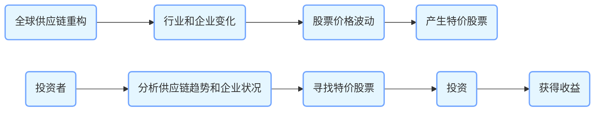

# 如何利用特价股票投资应对全球供应链重构

> 关键词：特价股票、全球供应链重构、投资策略、股票分析、经济趋势

> 摘要：本文聚焦于在全球供应链重构的大背景下，探讨如何利用特价股票进行投资。首先介绍全球供应链重构的背景与影响，阐述特价股票的核心概念。接着深入剖析投资特价股票的核心算法原理及操作步骤，用数学模型和公式辅助理解。通过项目实战展示具体的代码实现与分析，明确其实际应用场景。同时推荐相关的学习资源、开发工具框架以及论文著作，帮助投资者更好地把握投资机会。最后总结未来发展趋势与挑战，解答常见问题，提供扩展阅读与参考资料，为投资者在全球供应链重构的环境中利用特价股票投资提供全面且深入的指导。

## 1. 背景介绍 
### 1.1 目的和范围
全球供应链正在经历深刻的重构，这一过程受到多种因素的影响，如地缘政治、贸易政策、科技发展等。这种重构对各个行业和企业产生了深远的影响，也为投资者带来了新的机遇和挑战。本文的目的在于探讨如何在全球供应链重构的背景下，利用特价股票进行有效的投资。范围涵盖了特价股票的定义、投资策略、相关算法原理、实际应用案例以及未来发展趋势等方面，旨在为投资者提供全面且深入的指导，帮助他们在复杂的市场环境中做出明智的投资决策。

### 1.2 预期读者
本文预期读者包括对股票投资有兴趣的个人投资者、金融从业者、投资分析师以及关注全球经济和供应链发展的研究人员。无论是新手投资者希望了解如何在全球供应链重构背景下进行特价股票投资，还是有经验的从业者寻求更深入的投资策略和技术分析方法，都能从本文中获得有价值的信息和启发。

### 1.3 文档结构概述
本文将按照以下结构展开：首先介绍全球供应链重构的背景以及特价股票投资的相关概念，明确核心概念与联系；接着详细阐述投资特价股票的核心算法原理和具体操作步骤，并通过数学模型和公式进行进一步的解释；然后通过项目实战展示代码实现和详细分析；之后探讨实际应用场景，为投资者提供具体的投资方向；再推荐相关的学习资源、开发工具框架以及论文著作，帮助读者提升投资能力；最后总结未来发展趋势与挑战，解答常见问题，并提供扩展阅读与参考资料，方便读者深入学习和研究。

### 1.4 术语表
#### 1.4.1 核心术语定义
- **特价股票**：指市场价格相对其内在价值被低估的股票。这些股票可能由于市场短期情绪、行业暂时困境或公司特定事件等原因，导致价格低于其实际应有的价值。
- **全球供应链重构**：指全球范围内的供应链网络、结构和运作模式发生重大变化的过程。这可能涉及到生产基地的转移、供应链环节的优化、贸易伙伴的重新选择等，以适应新的经济、政治和技术环境。
- **股票内在价值**：指股票所代表的公司的真实价值，通常基于公司的盈利能力、资产状况、发展前景等因素进行评估。

#### 1.4.2 相关概念解释
- **价值投资**：一种投资策略，强调通过分析股票的内在价值，寻找被低估的股票进行投资，以期在股票价格回归其内在价值时获得收益。
- **供应链风险**：指在供应链运作过程中，由于各种不确定因素导致的供应链中断、成本增加、效率降低等风险。
- **市场情绪**：指投资者对市场的整体看法和预期，会影响股票价格的短期波动。

#### 1.4.3 缩略词列表
- **PE**：市盈率（Price - Earnings Ratio），指股票价格与每股收益的比率，用于衡量股票的估值水平。
- **PB**：市净率（Price - Book Ratio），指股票价格与每股净资产的比率，反映股票价格相对于公司净资产的倍数。

## 2. 核心概念与联系 

### 2.1 全球供应链重构的影响
全球供应链重构是一个复杂且动态的过程，其影响广泛而深远。从宏观经济层面来看，供应链重构可能导致全球贸易格局的变化，一些传统的贸易强国可能会因为供应链的调整而面临经济增长的压力，而一些新兴经济体则可能迎来发展机遇。例如，随着劳动力成本的上升和环保要求的提高，一些制造业可能会从发达国家向劳动力成本更低、资源更丰富的发展中国家转移。

从行业层面来看，不同行业受到供应链重构的影响程度不同。一些依赖全球供应链的行业，如电子、汽车、航空等，可能会面临供应链中断、成本上升等问题。而一些本地市场导向的行业，如食品、医疗、零售等，受到的影响相对较小。例如，电子行业的芯片供应可能会因为全球供应链的重构而受到限制，导致电子产品的生产和销售受到影响。

从企业层面来看，供应链重构对企业的运营和竞争力产生重要影响。企业需要重新评估其供应链战略，优化供应链结构，降低供应链风险。一些企业可能会选择增加本地供应商的比例，以减少对海外供应商的依赖；一些企业可能会加强与供应商的合作，共同应对供应链挑战。例如，汽车企业可能会与本地的零部件供应商建立更紧密的合作关系，以确保零部件的稳定供应。

### 2.2 特价股票的特点与价值
特价股票通常具有以下特点：
- **低估值**：特价股票的市盈率、市净率等估值指标通常低于市场平均水平，这意味着投资者可以以较低的价格购买到相对较高价值的股票。
- **潜在增长潜力**：虽然特价股票目前可能处于困境，但由于其内在价值被低估，一旦公司解决了面临的问题，或者行业环境改善，股票价格可能会出现较大幅度的上涨。
- **市场忽视**：特价股票往往由于市场短期情绪或其他原因被投资者忽视，这为有眼光的投资者提供了机会。

特价股票的价值在于其投资回报潜力。通过投资特价股票，投资者可以在股票价格回归其内在价值时获得收益。此外，特价股票还可以作为投资组合的一部分，降低投资组合的整体风险。

### 2.3 全球供应链重构与特价股票投资的联系
全球供应链重构为特价股票投资带来了新的机遇和挑战。一方面，供应链重构导致一些行业和企业面临困境，股票价格下跌，从而产生了更多的特价股票投资机会。例如，一些受到供应链中断影响的企业，其股票价格可能会大幅下跌，而这些企业的内在价值可能并没有发生实质性的变化，这就为投资者提供了买入的机会。

另一方面，供应链重构也增加了投资的不确定性和风险。由于供应链重构的过程复杂且动态，投资者很难准确预测哪些企业能够在重构中受益，哪些企业会受到负面影响。因此，投资者需要更加深入地研究和分析企业的供应链状况，以降低投资风险。

### 2.4 核心概念原理和架构的文本示意图
全球供应链重构影响着各个行业和企业，导致企业的经营状况发生变化，进而影响股票价格。特价股票是指价格相对内在价值被低估的股票。投资者通过分析全球供应链重构的趋势和企业的供应链状况，寻找被低估的特价股票进行投资，以期获得收益。

### 2.5 Mermaid 流程图


## 3. 核心算法原理 & 具体操作步骤 

### 3.1 核心算法原理
在利用特价股票投资应对全球供应链重构的过程中，核心算法的目标是筛选出具有投资价值的特价股票。我们可以采用多因素分析的方法，综合考虑多个因素来评估股票的价值和潜力。以下是一个简化的算法原理：

#### 3.1.1 数据收集
首先，需要收集相关的数据，包括股票的基本信息（如价格、市盈率、市净率等）、公司的财务报表（如收入、利润、资产负债表等）、行业数据（如行业增长率、市场份额等）以及全球供应链相关的数据（如供应链中断事件、供应商分布等）。

#### 3.1.2 特征提取
从收集到的数据中提取有用的特征，例如，计算股票的估值指标（如市盈率、市净率）、公司的盈利能力指标（如净利润率、净资产收益率）、供应链风险指标（如供应商集中度、供应链中断次数）等。

#### 3.1.3 模型构建
使用机器学习或统计模型来构建股票价值评估模型。例如，可以使用线性回归模型来预测股票的内在价值，使用逻辑回归模型来预测股票是否为特价股票。

#### 3.1.4 模型训练和优化
使用历史数据对模型进行训练和优化，调整模型的参数，以提高模型的准确性和稳定性。

#### 3.1.5 股票筛选
使用训练好的模型对股票进行筛选，选出具有投资价值的特价股票。

### 3.2 具体操作步骤

#### 3.2.1 数据收集
可以使用 Python 的第三方库，如 `pandas`、`yfinance` 等，来收集股票的基本信息和财务报表数据。以下是一个简单的示例代码：
```python
import yfinance as yf
import pandas as pd

# 定义股票代码
stock_symbol = 'AAPL'

# 获取股票数据
stock_data = yf.Ticker(stock_symbol)

# 获取股票的基本信息
info = stock_data.info

# 获取股票的历史价格数据
history_data = stock_data.history(period='1y')

# 获取公司的财务报表数据
financials = stock_data.financials
balance_sheet = stock_data.balance_sheet
cashflow = stock_data.cashflow

print('基本信息：', info)
print('历史价格数据：', history_data)
print('财务报表数据：', financials)
print('资产负债表数据：', balance_sheet)
print('现金流量表数据：', cashflow)
```

#### 3.2.2 特征提取
根据收集到的数据，提取相关的特征。例如，计算股票的市盈率、市净率等估值指标，以及公司的净利润率、净资产收益率等盈利能力指标。以下是一个示例代码：
```python
# 计算市盈率
pe_ratio = info['trailingPE']

# 计算市净率
pb_ratio = info['priceToBook']

# 计算净利润率
net_income = financials.loc['Net Income'].values[0]
total_revenue = financials.loc['Total Revenue'].values[0]
net_profit_margin = net_income / total_revenue

# 计算净资产收益率
total_equity = balance_sheet.loc['Total Stockholder Equity'].values[0]
roe = net_income / total_equity

print('市盈率：', pe_ratio)
print('市净率：', pb_ratio)
print('净利润率：', net_profit_margin)
print('净资产收益率：', roe)
```

#### 3.2.3 模型构建
使用线性回归模型来预测股票的内在价值。以下是一个示例代码：
```python
from sklearn.linear_model import LinearRegression
from sklearn.model_selection import train_test_split
import numpy as np

# 定义特征和目标变量
X = np.array([[pe_ratio, pb_ratio, net_profit_margin, roe]])
y = np.array([info['regularMarketPrice']])

# 划分训练集和测试集
X_train, X_test, y_train, y_test = train_test_split(X, y, test_size=0.2, random_state=42)

# 构建线性回归模型
model = LinearRegression()

# 训练模型
model.fit(X_train, y_train)

# 预测股票的内在价值
intrinsic_value = model.predict(X_test)

print('股票的内在价值：', intrinsic_value)
```

#### 3.2.4 模型训练和优化
使用交叉验证和网格搜索等方法对模型进行训练和优化，调整模型的参数，以提高模型的准确性和稳定性。以下是一个示例代码：
```python
from sklearn.model_selection import GridSearchCV

# 定义参数网格
param_grid = {'fit_intercept': [True, False], 'normalize': [True, False]}

# 构建网格搜索对象
grid_search = GridSearchCV(model, param_grid, cv=5)

# 进行网格搜索
grid_search.fit(X_train, y_train)

# 获取最佳参数
best_params = grid_search.best_params_

# 使用最佳参数重新训练模型
best_model = LinearRegression(**best_params)
best_model.fit(X_train, y_train)

# 评估模型
score = best_model.score(X_test, y_test)

print('最佳参数：', best_params)
print('模型得分：', score)
```

#### 3.2.5 股票筛选
根据模型预测的股票内在价值和当前市场价格，筛选出具有投资价值的特价股票。以下是一个示例代码：
```python
# 获取当前市场价格
current_price = info['regularMarketPrice']

# 判断是否为特价股票
if intrinsic_value > current_price:
    print('该股票是特价股票，具有投资价值')
else:
    print('该股票不是特价股票，不具有投资价值')
```

## 4. 数学模型和公式 & 详细讲解 & 举例说明 

### 4.1 市盈率（PE）模型
市盈率（PE）是指股票价格与每股收益的比率，用于衡量股票的估值水平。其计算公式为：
$$PE = \frac{P}{EPS}$$
其中，$P$ 表示股票价格，$EPS$ 表示每股收益。

市盈率反映了投资者为获取公司每一元盈利所愿意支付的价格。一般来说，市盈率越低，股票越被低估，具有投资价值。例如，某股票的价格为 $50$ 元，每股收益为 $5$ 元，则该股票的市盈率为：
$$PE = \frac{50}{5} = 10$$

### 4.2 市净率（PB）模型
市净率（PB）是指股票价格与每股净资产的比率，反映股票价格相对于公司净资产的倍数。其计算公式为：
$$PB = \frac{P}{BVPS}$$
其中，$P$ 表示股票价格，$BVPS$ 表示每股净资产。

市净率越低，说明股票价格相对于公司净资产越便宜，股票越被低估。例如，某股票的价格为 $30$ 元，每股净资产为 $10$ 元，则该股票的市净率为：
$$PB = \frac{30}{10} = 3$$

### 4.3 线性回归模型
线性回归模型是一种常用的统计模型，用于预测连续变量的值。其基本形式为：
$$y = \beta_0 + \beta_1x_1 + \beta_2x_2 + \cdots + \beta_nx_n + \epsilon$$
其中，$y$ 表示目标变量，$x_1, x_2, \cdots, x_n$ 表示特征变量，$\beta_0, \beta_1, \beta_2, \cdots, \beta_n$ 表示模型的参数，$\epsilon$ 表示误差项。

在股票价值评估中，我们可以使用线性回归模型来预测股票的内在价值。例如，我们可以将市盈率、市净率、净利润率、净资产收益率等作为特征变量，将股票价格作为目标变量，构建线性回归模型。

假设我们有以下数据：
| 市盈率（PE） | 市净率（PB） | 净利润率 | 净资产收益率 | 股票价格 |
| --- | --- | --- | --- | --- |
| 10 | 2 | 0.2 | 0.15 | 50 |
| 12 | 2.5 | 0.18 | 0.12 | 60 |
| 8 | 1.5 | 0.22 | 0.18 | 40 |

我们可以使用 Python 的 `sklearn` 库来构建线性回归模型：
```python
import numpy as np
from sklearn.linear_model import LinearRegression

# 定义特征变量
X = np.array([[10, 2, 0.2, 0.15], [12, 2.5, 0.18, 0.12], [8, 1.5, 0.22, 0.18]])

# 定义目标变量
y = np.array([50, 60, 40])

# 构建线性回归模型
model = LinearRegression()

# 训练模型
model.fit(X, y)

# 预测新数据
new_data = np.array([[11, 2.2, 0.21, 0.16]])
prediction = model.predict(new_data)

print('预测的股票价格：', prediction)
```

### 4.4 逻辑回归模型
逻辑回归模型是一种常用的分类模型，用于预测离散变量的值。其基本形式为：
$$P(y = 1|x) = \frac{1}{1 + e^{-(\beta_0 + \beta_1x_1 + \beta_2x_2 + \cdots + \beta_nx_n)}}$$
其中，$P(y = 1|x)$ 表示在特征变量 $x$ 的条件下，目标变量 $y$ 取值为 $1$ 的概率，$\beta_0, \beta_1, \beta_2, \cdots, \beta_n$ 表示模型的参数。

在股票投资中，我们可以使用逻辑回归模型来预测股票是否为特价股票。例如，我们可以将市盈率、市净率、净利润率、净资产收益率等作为特征变量，将股票是否为特价股票作为目标变量，构建逻辑回归模型。

假设我们有以下数据：
| 市盈率（PE） | 市净率（PB） | 净利润率 | 净资产收益率 | 是否为特价股票 |
| --- | --- | --- | --- | --- |
| 10 | 2 | 0.2 | 0.15 | 1 |
| 12 | 2.5 | 0.18 | 0.12 | 0 |
| 8 | 1.5 | 0.22 | 0.18 | 1 |

我们可以使用 Python 的 `sklearn` 库来构建逻辑回归模型：
```python
import numpy as np
from sklearn.linear_model import LogisticRegression

# 定义特征变量
X = np.array([[10, 2, 0.2, 0.15], [12, 2.5, 0.18, 0.12], [8, 1.5, 0.22, 0.18]])

# 定义目标变量
y = np.array([1, 0, 1])

# 构建逻辑回归模型
model = LogisticRegression()

# 训练模型
model.fit(X, y)

# 预测新数据
new_data = np.array([[11, 2.2, 0.21, 0.16]])
prediction = model.predict(new_data)

print('预测的结果：', prediction)
```

## 5. 项目实战：代码实际案例和详细解释说明 

### 5.1  开发环境搭建
在进行股票投资分析的项目实战之前，需要搭建相应的开发环境。以下是具体的步骤：

#### 5.1.1 安装 Python
首先，需要安装 Python 解释器。可以从 Python 官方网站（https://www.python.org/downloads/） 下载适合自己操作系统的 Python 安装包，并按照安装向导进行安装。

#### 5.1.2 安装必要的库
在安装好 Python 之后，需要安装一些必要的库，如 `pandas`、`yfinance`、`sklearn` 等。可以使用 `pip` 命令来安装这些库：
```sh
pip install pandas yfinance scikit-learn
```

#### 5.1.3 选择开发工具
可以选择自己喜欢的开发工具，如 PyCharm、Jupyter Notebook 等。这里以 Jupyter Notebook 为例，可以使用以下命令来安装 Jupyter Notebook：
```sh
pip install jupyter notebook
```
安装完成后，可以使用以下命令启动 Jupyter Notebook：
```sh
jupyter notebook
```

### 5.2  源代码详细实现和代码解读

#### 5.2.1 数据收集
以下是一个完整的数据收集代码示例：
```python
import yfinance as yf
import pandas as pd

# 定义股票代码列表
stock_symbols = ['AAPL', 'GOOG', 'MSFT']

# 初始化一个空的 DataFrame 用于存储数据
all_stock_data = pd.DataFrame()

# 遍历股票代码列表
for symbol in stock_symbols:
    # 获取股票数据
    stock_data = yf.Ticker(symbol)

    # 获取股票的基本信息
    info = stock_data.info

    # 获取股票的历史价格数据
    history_data = stock_data.history(period='1y')

    # 获取公司的财务报表数据
    financials = stock_data.financials
    balance_sheet = stock_data.balance_sheet
    cashflow = stock_data.cashflow

    # 将基本信息转换为 DataFrame
    info_df = pd.DataFrame.from_dict(info, orient='index').T
    info_df['Symbol'] = symbol

    # 将历史价格数据转换为 DataFrame
    history_data['Symbol'] = symbol

    # 将财务报表数据转换为 DataFrame
    financials = financials.T
    financials['Symbol'] = symbol
    balance_sheet = balance_sheet.T
    balance_sheet['Symbol'] = symbol
    cashflow = cashflow.T
    cashflow['Symbol'] = symbol

    # 合并数据
    all_stock_data = pd.concat([all_stock_data, info_df, history_data, financials, balance_sheet, cashflow])

# 保存数据到 CSV 文件
all_stock_data.to_csv('stock_data.csv', index=False)
```
**代码解读**：
- 首先，定义了一个股票代码列表 `stock_symbols`，包含了要分析的股票代码。
- 然后，使用 `yfinance` 库获取每只股票的基本信息、历史价格数据、财务报表数据等。
- 接着，将这些数据转换为 DataFrame 格式，并添加股票代码作为标识。
- 最后，将所有数据合并到一个 DataFrame 中，并保存到 CSV 文件中。

#### 5.2.2 特征提取
以下是一个特征提取的代码示例：
```python
import pandas as pd

# 读取数据
data = pd.read_csv('stock_data.csv')

# 计算市盈率
data['PE_Ratio'] = data['regularMarketPrice'] / data['trailingEps']

# 计算市净率
data['PB_Ratio'] = data['regularMarketPrice'] / data['bookValue']

# 计算净利润率
data['Net_Profit_Margin'] = data['netIncome'] / data['totalRevenue']

# 计算净资产收益率
data['ROE'] = data['netIncome'] / data['totalStockholderEquity']

# 保存特征数据到 CSV 文件
data[['Symbol', 'PE_Ratio', 'PB_Ratio', 'Net_Profit_Margin', 'ROE']].to_csv('stock_features.csv', index=False)
```
**代码解读**：
- 首先，读取之前保存的股票数据文件 `stock_data.csv`。
- 然后，根据公式计算市盈率、市净率、净利润率和净资产收益率等特征。
- 最后，将这些特征数据保存到 CSV 文件 `stock_features.csv` 中。

#### 5.2.3 模型构建和训练
以下是一个使用线性回归模型进行股票价值预测的代码示例：
```python
import pandas as pd
from sklearn.linear_model import LinearRegression
from sklearn.model_selection import train_test_split
import numpy as np

# 读取特征数据
features = pd.read_csv('stock_features.csv')

# 定义特征变量和目标变量
X = features[['PE_Ratio', 'PB_Ratio', 'Net_Profit_Margin', 'ROE']].values
y = features['regularMarketPrice'].values

# 划分训练集和测试集
X_train, X_test, y_train, y_test = train_test_split(X, y, test_size=0.2, random_state=42)

# 构建线性回归模型
model = LinearRegression()

# 训练模型
model.fit(X_train, y_train)

# 预测股票价格
y_pred = model.predict(X_test)

# 计算模型得分
score = model.score(X_test, y_test)

print('模型得分：', score)
```
**代码解读**：
- 首先，读取之前保存的特征数据文件 `stock_features.csv`。
- 然后，定义特征变量 `X` 和目标变量 `y`。
- 接着，使用 `train_test_split` 函数将数据划分为训练集和测试集。
- 再构建线性回归模型，并使用训练集数据进行训练。
- 最后，使用测试集数据进行预测，并计算模型的得分。

### 5.3  代码解读与分析
#### 5.3.1 数据收集部分
数据收集是整个项目的基础，准确和全面的数据对于后续的分析和建模至关重要。在代码中，使用 `yfinance` 库可以方便地获取股票的各种数据，包括基本信息、历史价格数据和财务报表数据。将这些数据保存到 CSV 文件中，方便后续的处理和分析。

#### 5.3.2 特征提取部分
特征提取是将原始数据转换为有用的特征的过程。在代码中，根据市盈率、市净率、净利润率和净资产收益率等公式计算了相应的特征。这些特征可以反映股票的估值水平和公司的盈利能力，对于股票价值的评估具有重要意义。

#### 5.3.3 模型构建和训练部分
模型构建和训练是项目的核心部分。在代码中，使用线性回归模型来预测股票价格。线性回归模型是一种简单而有效的模型，可以通过特征变量来预测目标变量的值。通过将数据划分为训练集和测试集，可以评估模型的性能。模型得分反映了模型对数据的拟合程度，得分越高，模型的性能越好。

## 6. 实际应用场景 

### 6.1 行业转型期投资机会
在全球供应链重构的过程中，一些传统行业可能会面临转型的压力，而一些新兴行业则可能迎来发展机遇。例如，随着环保意识的提高和新能源技术的发展，传统的石油、煤炭等能源行业可能会逐渐衰落，而新能源、可再生能源等行业则可能会快速发展。投资者可以关注这些行业转型期的特价股票投资机会，通过分析行业趋势和企业的竞争力，选择具有潜力的企业进行投资。

### 6.2 供应链本地化投资机会
为了降低供应链风险，一些企业可能会选择将供应链本地化，增加本地供应商的比例。这将为本地的相关企业带来发展机遇。例如，在电子行业，一些企业可能会选择在本地建立芯片生产基地，以减少对海外芯片供应商的依赖。投资者可以关注这些供应链本地化过程中的特价股票投资机会，选择受益于供应链本地化的企业进行投资。

### 6.3 新兴市场投资机会
全球供应链重构也为新兴市场带来了发展机遇。一些新兴经济体由于劳动力成本低、资源丰富等优势，可能会吸引更多的制造业转移。例如，东南亚、印度等地区的制造业可能会快速发展。投资者可以关注这些新兴市场的特价股票投资机会，通过分析新兴市场的经济发展趋势和企业的竞争力，选择具有潜力的企业进行投资。

### 6.4 供应链创新投资机会
在全球供应链重构的过程中，企业需要不断创新供应链模式，提高供应链的效率和灵活性。例如，一些企业可能会采用区块链技术来实现供应链的透明化和可追溯性，一些企业可能会采用人工智能技术来优化供应链的决策。投资者可以关注这些供应链创新过程中的特价股票投资机会，选择具有创新能力的企业进行投资。

## 7. 工具和资源推荐
### 7.1 学习资源推荐
#### 7.1.1 书籍推荐
- 《聪明的投资者》（The Intelligent Investor）：作者是本杰明·格雷厄姆（Benjamin Graham），这本书是价值投资的经典之作，详细介绍了价值投资的理念和方法，对于理解特价股票投资具有重要的指导意义。
- 《金融炼金术》（The Alchemy of Finance）：作者是乔治·索罗斯（George Soros），这本书探讨了金融市场的运行规律和投资者的心理行为，对于理解全球经济和金融市场的变化具有重要的参考价值。
- 《股票大作手回忆录》（Reminiscences of a Stock Operator）：作者是爱德温·勒菲弗（Edwin Lefèvre），这本书通过讲述股票大作手杰西·利弗莫尔（Jesse Livermore）的投资经历，介绍了股票投资的技巧和策略，对于投资者的实践具有重要的借鉴意义。

#### 7.1.2 在线课程
- Coursera 上的“Financial Markets”：由耶鲁大学的罗伯特·席勒（Robert Shiller）教授授课，该课程介绍了金融市场的基本概念、运行机制和投资策略，对于理解金融市场和股票投资具有重要的帮助。
- edX 上的“Introduction to Financial Accounting”：由麻省理工学院的课程团队授课，该课程介绍了财务会计的基本原理和方法，对于理解公司的财务报表和财务状况具有重要的意义。
- Udemy 上的“Python for Finance: Investment Fundamentals & Data Analytics”：该课程介绍了如何使用 Python 进行金融数据分析和投资决策，对于投资者掌握数据分析和编程技能具有重要的帮助。

#### 7.1.3 技术博客和网站
- Seeking Alpha：这是一个金融投资领域的专业网站，提供了大量的股票分析、市场评论和投资建议，对于投资者了解市场动态和获取投资信息具有重要的帮助。
- Bloomberg：这是一个全球知名的金融资讯和数据服务提供商，提供了实时的金融市场数据、新闻和分析，对于投资者了解全球经济和金融市场的变化具有重要的参考价值。
- Alpha Vantage：这是一个提供免费金融数据 API 的网站，投资者可以使用该 API 获取股票、外汇、加密货币等金融数据，对于进行金融数据分析和投资决策具有重要的帮助。

### 7.2 开发工具框架推荐
#### 7.2.1 IDE和编辑器
- PyCharm：这是一款专业的 Python 集成开发环境（IDE），提供了丰富的功能和工具，如代码编辑、调试、版本控制等，对于 Python 开发和数据分析具有重要的帮助。
- Jupyter Notebook：这是一个交互式的开发环境，支持 Python、R 等多种编程语言，适合进行数据分析、数据可视化和模型开发等工作。
- Visual Studio Code：这是一款轻量级的代码编辑器，支持多种编程语言和插件，具有丰富的扩展功能，对于 Python 开发和数据分析也非常方便。

#### 7.2.2 调试和性能分析工具
- PDB：这是 Python 自带的调试器，可以帮助开发者在代码中设置断点、查看变量值等，对于调试 Python 代码非常有用。
- cProfile：这是 Python 自带的性能分析工具，可以帮助开发者分析代码的性能瓶颈，优化代码的执行效率。
- Py-Spy：这是一个第三方的性能分析工具，可以实时监控 Python 程序的性能，帮助开发者快速定位性能问题。

#### 7.2.3 相关框架和库
- Pandas：这是一个强大的数据分析库，提供了数据结构和数据分析工具，如 DataFrame、Series 等，对于处理和分析金融数据非常方便。
- NumPy：这是一个用于科学计算的库，提供了高性能的多维数组对象和数学函数，对于进行数值计算和数据分析具有重要的帮助。
- Scikit-learn：这是一个用于机器学习的库，提供了各种机器学习算法和工具，如分类、回归、聚类等，对于构建股票价值评估模型非常有用。

### 7.3 相关论文著作推荐
#### 7.3.1 经典论文
- Fama, E. F., & French, K. R. (1992). The cross - section of expected stock returns. The Journal of Finance, 47(2), 427 - 465. 这篇论文提出了著名的 Fama - French 三因子模型，用于解释股票的预期收益率，对于股票投资的理论和实践具有重要的影响。
- Sharpe, W. F. (1964). Capital asset prices: A theory of market equilibrium under conditions of risk. The Journal of Finance, 19(3), 425 - 442. 这篇论文提出了资本资产定价模型（CAPM），用于描述资产的预期收益率与市场风险之间的关系，是现代金融理论的重要基础之一。

#### 7.3.2 最新研究成果
- 关注 SSRN（Social Science Research Network）、IEEE Xplore 等学术平台上关于全球供应链重构、股票投资、金融科技等领域的最新研究论文，了解行业的最新发展动态和研究成果。

#### 7.3.3 应用案例分析
- 可以参考一些金融机构和投资公司发布的研究报告和案例分析，了解他们在全球供应链重构背景下的投资策略和实践经验。例如，高盛、摩根大通等金融机构的研究报告。

## 8. 总结：未来发展趋势与挑战

### 8.1 未来发展趋势
#### 8.1.1 数字化转型加速
随着科技的不断发展，全球供应链将加速数字化转型。企业将更多地采用人工智能、区块链、物联网等技术来优化供应链管理，提高供应链的效率和透明度。这将为相关的科技企业带来发展机遇，投资者可以关注这些数字化转型过程中的特价股票投资机会。

#### 8.1.2 绿色供应链兴起
环保意识的提高和可持续发展的要求将促使企业更加注重绿色供应链的建设。企业将更多地采用环保材料、清洁能源，减少碳排放，实现供应链的可持续发展。这将为环保、新能源等相关行业带来发展机遇，投资者可以关注这些绿色供应链兴起过程中的特价股票投资机会。

#### 8.1.3 区域化供应链加强
为了降低供应链风险，一些国家和地区可能会加强区域化供应链的建设。例如，欧盟可能会加强内部供应链的整合，减少对外部供应链的依赖。这将为区域内的相关企业带来发展机遇，投资者可以关注这些区域化供应链加强过程中的特价股票投资机会。

### 8.2 挑战
#### 8.2.1 信息获取难度大
全球供应链重构是一个复杂且动态的过程，涉及到众多的因素和环节。投资者要获取准确、全面的信息非常困难，这增加了投资决策的难度和风险。

#### 8.2.2 市场不确定性增加
全球供应链重构导致市场环境更加复杂和不确定，股票价格的波动也更加剧烈。投资者很难准确预测市场的走势和股票的价格变化，这增加了投资的风险。

#### 8.2.3 技术更新换代快
科技的快速发展导致技术更新换代速度加快，企业需要不断创新和升级技术才能适应市场的变化。投资者需要不断学习和掌握新的技术和知识，才能准确评估企业的竞争力和发展潜力。

## 9. 附录：常见问题与解答

### 9.1 什么是特价股票？
特价股票是指市场价格相对其内在价值被低估的股票。这些股票可能由于市场短期情绪、行业暂时困境或公司特定事件等原因，导致价格低于其实际应有的价值。

### 9.2 如何判断一只股票是否为特价股票？
可以通过分析股票的估值指标（如市盈率、市净率）、公司的财务状况（如盈利能力、资产负债表）、行业前景等因素来判断一只股票是否为特价股票。此外，还可以使用一些专业的分析工具和模型来辅助判断。

### 9.3 全球供应链重构对股票投资有哪些影响？
全球供应链重构对股票投资的影响是多方面的。一方面，它可能导致一些行业和企业面临困境，股票价格下跌，从而产生更多的特价股票投资机会。另一方面，它也增加了投资的不确定性和风险，投资者需要更加深入地研究和分析企业的供应链状况，以降低投资风险。

### 9.4 如何降低利用特价股票投资的风险？
可以通过以下方法降低利用特价股票投资的风险：
- 进行充分的研究和分析，了解公司的基本面和行业前景。
- 分散投资，不要把所有的资金都投入到一只股票中。
- 设定止损点，当股票价格下跌到一定程度时，及时卖出股票，避免损失进一步扩大。
- 关注市场动态和政策变化，及时调整投资策略。

### 9.5 学习股票投资需要具备哪些知识和技能？
学习股票投资需要具备以下知识和技能：
- 金融知识：了解金融市场的基本概念、运行机制和投资策略。
- 财务知识：掌握财务报表的分析方法，了解公司的财务状况和盈利能力。
- 数据分析技能：掌握数据分析工具和方法，如 Python、Excel 等，能够对股票数据进行分析和处理。
- 风险意识：认识到股票投资的风险，学会合理控制风险。

## 10. 扩展阅读 & 参考资料

### 10.1 扩展阅读
- 《投资中最简单的事》，作者邱国鹭，这本书介绍了投资的基本理念和方法，对于新手投资者具有重要的指导意义。
- 《漫步华尔街》（A Random Walk Down Wall Street），作者伯顿·马尔基尔（Burton G. Malkiel），这本书探讨了股票市场的运行规律和投资策略，对于理解股票投资具有重要的参考价值。
- 《穷查理宝典：查理·芒格的智慧箴言录》，作者彼得·考夫曼（Peter D. Kaufman），这本书介绍了查理·芒格的投资理念和人生智慧，对于投资者的思维方式和投资决策具有重要的启发作用。

### 10.2 参考资料
- Yahoo Finance：提供了丰富的股票数据和市场信息，可以作为数据来源和参考资料。
- SEC（美国证券交易委员会）官网：提供了上市公司的财务报表和相关信息，对于了解公司的基本面具有重要的帮助。
- 各大金融媒体和网站，如新浪财经、雪球等，提供了及时的市场动态和投资分析，对于投资者了解市场情况具有重要的参考价值。