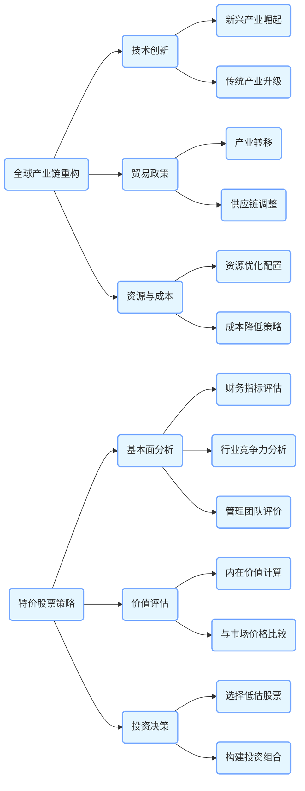

# 如何利用特价股票策略进行全球产业链重构投资

> 关键词：特价股票策略、全球产业链重构、投资分析、产业链布局、风险控制

> 摘要：本文旨在深入探讨如何运用特价股票策略进行全球产业链重构投资。通过详细阐述相关核心概念，剖析特价股票策略的算法原理，结合数学模型和公式进行分析，并提供实际项目案例和代码实现。同时，探讨了该投资策略在不同实际场景中的应用，推荐了相关的学习资源、开发工具和研究论文。最后，总结了未来发展趋势与挑战，为投资者在全球产业链重构背景下运用特价股票策略进行投资提供全面的指导和参考。

## 1. 背景介绍 
### 1.1 目的和范围
在全球经济格局不断变化的背景下，产业链重构成为当前经济发展的重要趋势。特价股票策略作为一种投资手段，旨在挖掘被市场低估的股票，以获取超额收益。本文的目的是为投资者提供一套系统的方法，指导他们如何利用特价股票策略在全球产业链重构的大环境下进行有效的投资。具体范围涵盖了特价股票策略的核心概念、算法原理、数学模型、实际案例以及相关的工具和资源推荐等方面。

### 1.2 预期读者
本文主要面向对投资领域感兴趣，尤其是希望在全球产业链重构背景下寻找投资机会的个人投资者、专业投资机构的从业者以及相关金融领域的研究人员。同时，对于从事计算机编程和数据分析，希望将技术应用于投资领域的开发者也具有一定的参考价值。

### 1.3 文档结构概述
本文将按照以下结构进行详细阐述：首先介绍相关背景信息，包括目的、预期读者和文档结构概述等内容；接着深入探讨核心概念与联系，明确特价股票策略和全球产业链重构的相关概念及它们之间的联系；然后详细讲解核心算法原理和具体操作步骤，并通过Python代码进行演示；随后介绍数学模型和公式，进行详细讲解并举例说明；再通过实际项目案例，展示如何在实际中运用该策略进行投资；接着探讨该策略在不同场景下的实际应用；之后推荐相关的学习资源、开发工具和研究论文；最后总结未来发展趋势与挑战，并提供常见问题解答和扩展阅读参考资料。

### 1.4 术语表
#### 1.4.1 核心术语定义
- **特价股票**：指市场价格低于其内在价值的股票。内在价值是基于公司的基本面分析，如财务状况、盈利能力、行业前景等因素综合评估得出的股票真实价值。
- **全球产业链重构**：指由于技术创新、贸易政策、资源分布等多种因素的影响，全球范围内的产业链在布局、结构和分工等方面发生的调整和变化。
- **投资组合**：指投资者将资金分散投资于多种不同的资产（如股票、债券、基金等），以达到降低风险、提高收益的目的。

#### 1.4.2 相关概念解释
- **价值投资**：一种投资理念，强调通过分析公司的基本面，寻找被市场低估的股票，并长期持有，以获取公司成长带来的价值提升。特价股票策略是价值投资的一种具体应用。
- **产业链分析**：对产业链的各个环节进行深入研究，包括原材料供应、生产制造、销售渠道、终端消费等，以了解产业链的结构、竞争态势和发展趋势。

#### 1.4.3 缩略词列表
- **PE**：市盈率（Price-to-Earnings Ratio），是指股票价格与每股收益的比率，用于衡量股票的估值水平。
- **PB**：市净率（Price-to-Book Ratio），是指股票价格与每股净资产的比率，反映了市场对公司净资产的估值。

## 2. 核心概念与联系 
### 核心概念原理
#### 特价股票策略原理
特价股票策略的核心在于寻找被市场低估的股票。市场上由于各种原因，如信息不对称、短期市场情绪波动等，会导致一些股票的价格低于其内在价值。投资者通过对公司的基本面进行深入分析，如财务报表、行业竞争力、管理团队等，评估股票的内在价值，然后与当前市场价格进行比较，选择价格低于内在价值的股票进行投资。当市场逐渐发现这些股票的真实价值时，股价有望上涨，投资者从而获得收益。

#### 全球产业链重构原理
全球产业链重构是多种因素共同作用的结果。技术创新是推动产业链重构的重要动力，新的技术如人工智能、大数据、物联网等的出现，会改变传统产业的生产方式和商业模式，促使产业链向高端化、智能化方向发展。贸易政策的变化也会对产业链布局产生影响，例如贸易保护主义的抬头可能导致企业重新调整生产基地和供应链。此外，资源分布的不均衡、劳动力成本的差异等因素也会促使企业在全球范围内优化产业链布局。

### 核心概念架构的文本示意图
```plaintext
全球产业链重构
|-- 技术创新驱动
|   |-- 新兴产业崛起
|   |-- 传统产业升级
|-- 贸易政策影响
|   |-- 产业转移
|   |-- 供应链调整
|-- 资源与成本因素
|   |-- 资源优化配置
|   |-- 成本降低策略

特价股票策略
|-- 基本面分析
|   |-- 财务指标评估
|   |-- 行业竞争力分析
|   |-- 管理团队评价
|-- 价值评估
|   |-- 内在价值计算
|   |-- 与市场价格比较
|-- 投资决策
|   |-- 选择低估股票
|   |-- 构建投资组合
```

### Mermaid 流程图


## 3. 核心算法原理 & 具体操作步骤 
### 核心算法原理
特价股票策略的核心算法主要围绕股票的价值评估展开。一种常用的方法是基于现金流折现模型（DCF）来计算股票的内在价值。现金流折现模型的基本思想是，股票的价值等于其未来预期现金流的现值之和。

### Python 代码实现现金流折现模型
```python
import numpy as np

def dcf_valuation(free_cash_flows, discount_rate, terminal_growth_rate):
    """
    现金流折现模型计算股票内在价值

    参数:
    free_cash_flows (list): 未来几年的自由现金流
    discount_rate (float): 折现率
    terminal_growth_rate (float): 永续增长率

    返回:
    float: 股票的内在价值
    """
    n = len(free_cash_flows)
    # 计算各年现金流的现值
    present_values = []
    for i, fcf in enumerate(free_cash_flows):
        pv = fcf / ((1 + discount_rate) ** (i + 1))
        present_values.append(pv)

    # 计算终端价值
    last_fcf = free_cash_flows[-1]
    terminal_value = (last_fcf * (1 + terminal_growth_rate)) / (discount_rate - terminal_growth_rate)
    terminal_pv = terminal_value / ((1 + discount_rate) ** n)

    # 计算内在价值
    intrinsic_value = sum(present_values) + terminal_pv
    return intrinsic_value

# 示例数据
free_cash_flows = [100, 120, 140, 160, 180]
discount_rate = 0.1
terminal_growth_rate = 0.03

# 计算内在价值
intrinsic_value = dcf_valuation(free_cash_flows, discount_rate, terminal_growth_rate)
print(f"股票的内在价值为: {intrinsic_value}")
```

### 具体操作步骤
1. **数据收集**：收集目标公司的财务报表，包括利润表、资产负债表和现金流量表，获取相关的财务数据，如营业收入、净利润、自由现金流等。同时，收集行业数据，了解行业的发展趋势和竞争态势。
2. **基本面分析**：对公司的财务指标进行分析，如市盈率、市净率、毛利率、净利率等，评估公司的盈利能力和估值水平。同时，分析公司的行业竞争力、管理团队的能力和公司的发展战略。
3. **价值评估**：使用现金流折现模型或其他估值方法计算股票的内在价值。在计算过程中，需要对未来的现金流、折现率和永续增长率等参数进行合理的估计。
4. **比较与筛选**：将计算得到的内在价值与当前市场价格进行比较，选择内在价值高于市场价格的股票，即特价股票。
5. **构建投资组合**：根据投资者的风险偏好和投资目标，选择一定数量的特价股票构建投资组合，以分散风险。

## 4. 数学模型和公式 & 详细讲解 & 举例说明 
### 现金流折现模型公式
现金流折现模型的基本公式为：
$$V = \sum_{t=1}^{n} \frac{FCF_t}{(1 + r)^t} + \frac{FCF_n(1 + g)}{(r - g)(1 + r)^n}$$
其中：
- $V$ 表示股票的内在价值
- $FCF_t$ 表示第 $t$ 年的自由现金流
- $r$ 表示折现率
- $g$ 表示永续增长率
- $n$ 表示预测期数

### 详细讲解
1. **自由现金流（FCF）**：自由现金流是指公司在满足了所有运营成本和资本支出后剩余的现金流量，它反映了公司实际可用于分配给股东或进行再投资的现金数量。计算自由现金流的公式为：
$$FCF = EBIT(1 - T) + Depreciation - CapEx - \Delta NWC$$
其中：
- $EBIT$ 表示息税前利润
- $T$ 表示所得税税率
- $Depreciation$ 表示折旧费用
- $CapEx$ 表示资本支出
- $\Delta NWC$ 表示净营运资本的变化

2. **折现率（r）**：折现率反映了投资者对未来现金流的风险偏好。一般来说，折现率越高，说明投资者对风险的要求越高，未来现金流的现值就越低。折现率通常可以使用加权平均资本成本（WACC）来计算。
3. **永续增长率（g）**：永续增长率是指公司在预测期之后的长期增长率。一般来说，永续增长率应该低于宏观经济的长期增长率，通常取值在 2% - 3% 之间。

### 举例说明
假设某公司未来 5 年的自由现金流分别为 100 万元、120 万元、140 万元、160 万元和 180 万元，折现率为 10%，永续增长率为 3%。

首先，计算各年现金流的现值：
- 第 1 年：$PV_1 = \frac{100}{(1 + 0.1)^1} = 90.91$（万元）
- 第 2 年：$PV_2 = \frac{120}{(1 + 0.1)^2} = 99.17$（万元）
- 第 3 年：$PV_3 = \frac{140}{(1 + 0.1)^3} = 105.18$（万元）
- 第 4 年：$PV_4 = \frac{160}{(1 + 0.1)^4} = 109.29$（万元）
- 第 5 年：$PV_5 = \frac{180}{(1 + 0.1)^5} = 111.74$（万元）

然后，计算终端价值：
$TV = \frac{180(1 + 0.03)}{(0.1 - 0.03)(1 + 0.1)^5} = 1604.86$（万元）

最后，计算股票的内在价值：
$V = 90.91 + 99.17 + 105.18 + 109.29 + 111.74 + 1604.86 = 2121.15$（万元）

## 5. 项目实战：代码实际案例和详细解释说明 
### 5.1  开发环境搭建
#### 安装 Python
首先，需要安装 Python 编程语言。可以从 Python 官方网站（https://www.python.org/downloads/）下载适合自己操作系统的 Python 版本，并按照安装向导进行安装。

#### 安装必要的库
在项目中，需要使用一些 Python 库来进行数据处理和分析，如 `pandas`、`numpy`、`yfinance` 等。可以使用以下命令来安装这些库：
```sh
pip install pandas numpy yfinance
```

### 5.2  源代码详细实现和代码解读
```python
import pandas as pd
import yfinance as yf
import numpy as np

def get_stock_data(ticker, start_date, end_date):
    """
    获取股票数据

    参数:
    ticker (str): 股票代码
    start_date (str): 开始日期，格式为 'YYYY-MM-DD'
    end_date (str): 结束日期，格式为 'YYYY-MM-DD'

    返回:
    pandas.DataFrame: 包含股票数据的 DataFrame
    """
    data = yf.download(ticker, start=start_date, end=end_date)
    return data

def calculate_fcf(net_income, depreciation, capex, change_nwc):
    """
    计算自由现金流

    参数:
    net_income (float): 净利润
    depreciation (float): 折旧费用
    capex (float): 资本支出
    change_nwc (float): 净营运资本的变化

    返回:
    float: 自由现金流
    """
    fcf = net_income + depreciation - capex - change_nwc
    return fcf

def dcf_valuation(free_cash_flows, discount_rate, terminal_growth_rate):
    """
    现金流折现模型计算股票内在价值

    参数:
    free_cash_flows (list): 未来几年的自由现金流
    discount_rate (float): 折现率
    terminal_growth_rate (float): 永续增长率

    返回:
    float: 股票的内在价值
    """
    n = len(free_cash_flows)
    # 计算各年现金流的现值
    present_values = []
    for i, fcf in enumerate(free_cash_flows):
        pv = fcf / ((1 + discount_rate) ** (i + 1))
        present_values.append(pv)

    # 计算终端价值
    last_fcf = free_cash_flows[-1]
    terminal_value = (last_fcf * (1 + terminal_growth_rate)) / (discount_rate - terminal_growth_rate)
    terminal_pv = terminal_value / ((1 + discount_rate) ** n)

    # 计算内在价值
    intrinsic_value = sum(present_values) + terminal_pv
    return intrinsic_value

# 示例数据
ticker = 'AAPL'
start_date = '2020-01-01'
end_date = '2023-12-31'

# 获取股票数据
stock_data = get_stock_data(ticker, start_date, end_date)

# 假设的财务数据
net_income = 100
depreciation = 20
capex = 30
change_nwc = 10

# 计算自由现金流
fcf = calculate_fcf(net_income, depreciation, capex, change_nwc)

# 假设未来 5 年的自由现金流
free_cash_flows = [fcf * (1 + 0.1) ** i for i in range(5)]

# 折现率和永续增长率
discount_rate = 0.1
terminal_growth_rate = 0.03

# 计算内在价值
intrinsic_value = dcf_valuation(free_cash_flows, discount_rate, terminal_growth_rate)

# 获取当前股票价格
current_price = stock_data['Close'][-1]

# 判断是否为特价股票
if intrinsic_value > current_price:
    print(f"{ticker} 是特价股票，内在价值为 {intrinsic_value}，当前价格为 {current_price}")
else:
    print(f"{ticker} 不是特价股票，内在价值为 {intrinsic_value}，当前价格为 {current_price}")
```

### 5.3  代码解读与分析
1. **获取股票数据**：使用 `yfinance` 库从雅虎财经获取指定股票在指定日期范围内的历史数据。
2. **计算自由现金流**：根据假设的净利润、折旧费用、资本支出和净营运资本的变化，计算自由现金流。
3. **现金流折现模型计算内在价值**：使用前面介绍的现金流折现模型，计算股票的内在价值。
4. **判断是否为特价股票**：将计算得到的内在价值与当前股票价格进行比较，如果内在价值高于当前价格，则认为该股票是特价股票。

## 6. 实际应用场景 
### 新兴产业投资
在全球产业链重构过程中，新兴产业如人工智能、新能源、生物医药等发展迅速。投资者可以运用特价股票策略，在这些新兴产业中寻找被市场低估的股票。例如，在人工智能领域，一些初创企业虽然具有较高的技术潜力，但由于市场对其未来盈利的不确定性，股价可能被低估。通过深入的基本面分析和价值评估，投资者可以发现这些特价股票，并进行投资，分享新兴产业发展带来的红利。

### 传统产业转型升级投资
传统产业在全球产业链重构中也面临着转型升级的机遇。例如，制造业企业通过引入智能制造技术，提高生产效率和产品质量；能源企业向清洁能源转型，减少对传统化石能源的依赖。投资者可以关注这些正在进行转型升级的传统企业，寻找其中被低估的股票。这些企业在转型升级成功后，股价有望实现大幅上涨。

### 产业链关键环节投资
全球产业链重构会导致产业链上的关键环节发生变化。投资者可以分析产业链的各个环节，找出那些在产业链重构中具有重要地位且被低估的企业。例如，在半导体产业链中，芯片制造环节是关键环节。如果某家芯片制造企业由于短期市场波动或其他原因导致股价被低估，投资者可以运用特价股票策略进行投资。

## 7. 工具和资源推荐
### 7.1 学习资源推荐
#### 7.1.1 书籍推荐
- 《聪明的投资者》（The Intelligent Investor）：作者是本杰明·格雷厄姆（Benjamin Graham），被誉为价值投资的圣经，详细介绍了价值投资的理念和方法。
- 《财务报表分析与证券定价》（Financial Statement Analysis and Security Valuation）：作者是斯蒂芬·佩因曼（Stephen Penman），从财务报表分析的角度出发，介绍了如何评估股票的价值。
- 《创新者的窘境》（The Innovator's Dilemma）：作者是克莱顿·克里斯坦森（Clayton Christensen），探讨了技术创新对企业和产业的影响，对于理解全球产业链重构具有重要的参考价值。

#### 7.1.2 在线课程
- Coursera 上的“投资学原理”（Principles of Investing）：由知名高校的教授授课，系统介绍了投资的基本原理和方法。
- edX 上的“财务分析与决策”（Financial Analysis and Decision Making）：帮助学习者掌握财务分析的技巧，提高投资决策的能力。

#### 7.1.3 技术博客和网站
- Seeking Alpha：提供专业的金融分析和投资建议，涵盖了全球范围内的股票市场。
- ValueWalk：专注于价值投资领域，分享价值投资者的观点和研究成果。

### 7.2 开发工具框架推荐
#### 7.2.1 IDE和编辑器
- PyCharm：一款专业的 Python 集成开发环境，具有强大的代码编辑、调试和项目管理功能。
- Jupyter Notebook：一种交互式的开发环境，适合进行数据分析和代码演示。

#### 7.2.2 调试和性能分析工具
- PDB：Python 自带的调试器，可以帮助开发者定位代码中的问题。
- cProfile：Python 标准库中的性能分析工具，可以分析代码的运行时间和函数调用情况。

#### 7.2.3 相关框架和库
- Pandas：用于数据处理和分析的 Python 库，提供了高效的数据结构和数据操作方法。
- NumPy：用于科学计算的 Python 库，提供了多维数组和数学函数等功能。
- yfinance：用于获取股票市场数据的 Python 库，方便开发者进行股票数据分析。

### 7.3 相关论文著作推荐
#### 7.3.1 经典论文
- Eugene F. Fama 和 Kenneth R. French 的“Common Risk Factors in the Returns on Stocks and Bonds”：提出了著名的三因子模型，对资产定价理论产生了深远的影响。
- Burton G. Malkiel 的“A Random Walk Down Wall Street”：探讨了有效市场假说和股票市场的随机性。

#### 7.3.2 最新研究成果
- 关注顶级金融学术期刊，如《Journal of Finance》、《Review of Financial Studies》等，了解全球产业链重构和投资领域的最新研究动态。

#### 7.3.3 应用案例分析
- 研究一些知名投资机构的投资案例，如巴菲特的伯克希尔·哈撒韦公司的投资策略和案例，学习他们在实际投资中如何运用各种投资方法。

## 8. 总结：未来发展趋势与挑战
### 未来发展趋势
- **技术创新驱动**：随着人工智能、大数据、区块链等技术的不断发展，特价股票策略的应用将更加智能化和精准化。通过利用这些技术，可以更快速地收集和分析大量的市场数据，提高价值评估的准确性。
- **全球产业链深度重构**：全球产业链重构将继续深入进行，新兴产业和传统产业的融合将更加紧密。投资者需要更加关注产业链的动态变化，及时调整投资策略，寻找新的投资机会。
- **可持续投资兴起**：越来越多的投资者开始关注企业的社会责任和可持续发展。在全球产业链重构过程中，那些具有良好环境、社会和治理（ESG）表现的企业可能会受到更多的青睐。特价股票策略可以结合 ESG 因素，筛选出更具投资价值的股票。

### 挑战
- **数据质量和准确性**：特价股票策略的有效性依赖于准确的财务数据和市场信息。然而，在实际应用中，数据可能存在误差、不完整或滞后等问题，这会影响价值评估的准确性。
- **市场不确定性**：全球经济和政治环境的不确定性增加，如贸易摩擦、地缘政治冲突等，会导致市场波动加剧。投资者需要更好地应对市场不确定性，降低投资风险。
- **竞争加剧**：随着越来越多的投资者关注特价股票策略，市场竞争将更加激烈。投资者需要不断提升自己的分析能力和投资技巧，才能在竞争中脱颖而出。

## 9. 附录：常见问题与解答
### 问题 1：如何确定折现率和永续增长率？
折现率可以使用加权平均资本成本（WACC）来计算，WACC 考虑了公司的股权成本和债务成本。永续增长率通常应该低于宏观经济的长期增长率，一般取值在 2% - 3% 之间。具体的取值需要根据公司的行业特点、发展阶段和市场环境等因素进行综合判断。

### 问题 2：特价股票策略一定能获得收益吗？
特价股票策略并不能保证一定能获得收益。市场是复杂多变的，股票价格受到多种因素的影响，如宏观经济环境、行业竞争、公司内部管理等。即使股票被低估，也可能由于市场情绪等原因，股价在短期内不会上涨，甚至可能继续下跌。因此，投资者在使用特价股票策略时，需要做好风险控制，合理配置资产。

### 问题 3：如何进行投资组合的优化？
投资组合的优化可以从以下几个方面入手：一是分散投资，选择不同行业、不同规模的股票进行投资，以降低单一股票的风险；二是根据自己的风险偏好和投资目标，合理调整投资组合中不同资产的比例；三是定期对投资组合进行评估和调整，根据市场变化和公司基本面的变化，及时卖出表现不佳的股票，买入更具潜力的股票。

## 10. 扩展阅读 & 参考资料
### 扩展阅读
- 《金融炼金术》（The Alchemy of Finance）：作者是乔治·索罗斯（George Soros），介绍了他的投资哲学和交易策略。
- 《漫步华尔街》（A Random Walk Down Wall Street）：探讨了股票市场的随机性和有效市场假说。

### 参考资料
- Yahoo Finance：https://finance.yahoo.com/
- Investopedia：https://www.investopedia.com/
- SEC EDGAR：https://www.sec.gov/edgar.shtml