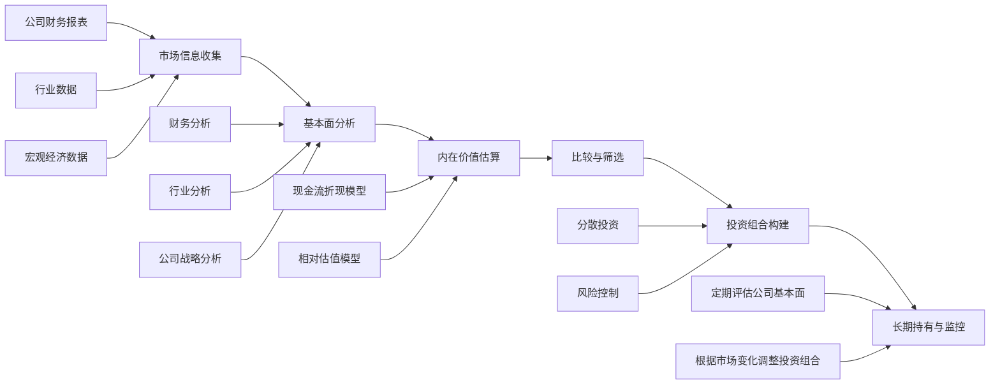

# 如何利用特价股票策略进行长期财富积累

> 关键词：特价股票策略、长期财富积累、股票估值、价值投资、财务分析

> 摘要：本文旨在深入探讨如何利用特价股票策略实现长期财富积累。首先介绍了该策略的背景，包括目的、预期读者、文档结构和相关术语。接着阐述了核心概念与联系，通过文本示意图和Mermaid流程图展示其原理和架构。详细讲解了核心算法原理，并用Python代码示例说明。同时给出了相关的数学模型和公式，并举例说明。通过项目实战，展示了开发环境搭建、源代码实现和代码解读。分析了该策略的实际应用场景，推荐了学习资源、开发工具框架和相关论文著作。最后总结了未来发展趋势与挑战，还提供了常见问题解答和扩展阅读参考资料。

## 1. 背景介绍 
### 1.1 目的和范围
在金融市场中，投资者一直寻求能够实现长期财富积累的有效策略。特价股票策略作为价值投资的重要分支，旨在通过挖掘被市场低估的股票，以低于其内在价值的价格买入，并长期持有，从而获得超额收益。本文的目的是全面介绍特价股票策略的原理、方法和实践应用，帮助投资者了解如何运用该策略进行长期财富积累。范围涵盖了特价股票的筛选、估值、投资组合构建以及长期投资过程中的风险管理等方面。

### 1.2 预期读者
本文预期读者包括对股票投资有兴趣的个人投资者、金融专业学生、投资顾问以及对价值投资策略进行研究的学者。无论是初学者希望了解基本的投资概念，还是有一定经验的投资者寻求优化投资策略，都能从本文中获得有价值的信息。

### 1.3 文档结构概述
本文将按照以下结构展开：首先介绍核心概念与联系，明确特价股票策略的基本原理和架构；接着详细讲解核心算法原理和具体操作步骤，并给出Python代码示例；然后介绍相关的数学模型和公式，并举例说明；通过项目实战展示如何在实际中应用该策略；分析该策略的实际应用场景；推荐学习资源、开发工具框架和相关论文著作；最后总结未来发展趋势与挑战，提供常见问题解答和扩展阅读参考资料。

### 1.4 术语表
#### 1.4.1 核心术语定义
- **特价股票**：指市场价格低于其内在价值的股票。内在价值是基于公司的基本面分析，如财务状况、盈利能力、行业前景等因素估算出来的股票真实价值。
- **价值投资**：一种投资策略，强调通过分析公司的内在价值，寻找被低估的股票进行投资，长期持有以获取价值回归带来的收益。
- **市盈率（P/E）**：股票价格与每股收益的比率，反映了市场对公司盈利的预期。较低的市盈率可能意味着股票被低估。
- **市净率（P/B）**：股票价格与每股净资产的比率，用于衡量股票的估值水平。市净率低于1可能表示股票具有一定的投资价值。
- **股息率**：股息与股票价格的比率，反映了公司向股东分配利润的能力。较高的股息率通常是吸引投资者的因素之一。

#### 1.4.2 相关概念解释
- **财务分析**：对公司的财务报表进行分析，包括资产负债表、利润表和现金流量表，以评估公司的财务状况、盈利能力和现金流量情况。
- **行业分析**：研究特定行业的发展趋势、竞争格局、市场规模等因素，以了解公司所处的行业环境对其发展的影响。
- **安全边际**：在投资中，安全边际是指股票的内在价值与市场价格之间的差距。较大的安全边际意味着投资风险相对较低。

#### 1.4.3 缩略词列表
- **P/E**：市盈率（Price-to-Earnings Ratio）
- **P/B**：市净率（Price-to-Book Ratio）
- **EPS**：每股收益（Earnings Per Share）
- **ROE**：净资产收益率（Return on Equity）

## 2. 核心概念与联系 

### 核心概念原理
特价股票策略的核心原理基于价值投资理论，即股票的市场价格会围绕其内在价值波动。当市场情绪悲观或对公司的短期业绩过度反应时，股票价格可能会低于其内在价值，形成特价股票。投资者通过深入的基本面分析，估算股票的内在价值，并与市场价格进行比较，选择被低估的股票进行投资。随着时间的推移，市场会逐渐认识到公司的真实价值，股票价格会向内在价值回归，投资者从而获得收益。

### 架构的文本示意图
```plaintext
特价股票策略架构

市场信息收集
|
|-- 公司财务报表
|-- 行业数据
|-- 宏观经济数据
|
基本面分析
|
|-- 财务分析（盈利能力、偿债能力、运营能力等）
|-- 行业分析（行业趋势、竞争格局等）
|-- 公司战略分析（发展前景、管理层能力等）
|
内在价值估算
|
|-- 现金流折现模型
|-- 相对估值模型（P/E、P/B等）
|
比较与筛选
|
|-- 市场价格与内在价值比较
|-- 筛选出特价股票
|
投资组合构建
|
|-- 分散投资
|-- 风险控制
|
长期持有与监控
|
|-- 定期评估公司基本面
|-- 根据市场变化调整投资组合
```

### Mermaid 流程图


## 3. 核心算法原理 & 具体操作步骤 

### 核心算法原理
特价股票策略的核心算法主要包括内在价值估算和筛选过程。常用的内在价值估算方法有现金流折现模型（DCF）和相对估值模型。

#### 现金流折现模型（DCF）
现金流折现模型的基本思想是将公司未来的自由现金流折现到当前时刻，得到公司的内在价值。其公式为：

$$V = \sum_{t=1}^{n} \frac{FCF_t}{(1 + r)^t} + \frac{TV}{(1 + r)^n}$$

其中，$V$ 表示公司的内在价值，$FCF_t$ 表示第 $t$ 年的自由现金流，$r$ 表示折现率，$n$ 表示预测期数，$TV$ 表示终值。

#### 相对估值模型
相对估值模型通过比较同行业类似公司的估值指标，如市盈率（P/E）、市净率（P/B）等，来估算目标公司的价值。例如，使用市盈率估值的公式为：

$$V = EPS \times P/E_{行业平均}$$

其中，$V$ 表示股票的内在价值，$EPS$ 表示每股收益，$P/E_{行业平均}$ 表示同行业的平均市盈率。

### 具体操作步骤

#### 步骤1：市场信息收集
收集公司的财务报表、行业数据和宏观经济数据。可以通过金融数据库、公司年报、行业研究报告等渠道获取相关信息。

#### 步骤2：基本面分析
- **财务分析**：分析公司的盈利能力、偿债能力、运营能力等财务指标。常用的财务指标包括净资产收益率（ROE）、资产负债率、存货周转率等。
- **行业分析**：研究行业的发展趋势、竞争格局、市场规模等因素，评估公司在行业中的地位和竞争力。
- **公司战略分析**：了解公司的发展战略、管理层能力、创新能力等方面，判断公司的长期发展前景。

#### 步骤3：内在价值估算
根据基本面分析的结果，选择合适的估值模型估算公司的内在价值。可以使用现金流折现模型或相对估值模型，也可以结合多种方法进行综合估算。

#### 步骤4：比较与筛选
将估算的内在价值与市场价格进行比较，筛选出市场价格低于内在价值的股票，即特价股票。可以设置一定的安全边际，如内在价值高于市场价格20%以上的股票才纳入投资范围。

#### 步骤5：投资组合构建
选择多只特价股票构建投资组合，以分散投资风险。可以根据不同的行业、市值、风险水平等因素进行组合配置。

#### 步骤6：长期持有与监控
长期持有投资组合，并定期评估公司的基本面和市场变化。如果公司的基本面发生重大变化或市场价格已经接近或超过内在价值，可以考虑调整投资组合。

### Python源代码示例
```python
import pandas as pd
import numpy as np

# 假设已经获取了公司的财务数据和行业数据
# 示例数据：每股收益（EPS）和行业平均市盈率（P/E）
eps = 2.0
industry_pe = 15

# 使用相对估值模型估算股票的内在价值
intrinsic_value = eps * industry_pe
print(f"股票的内在价值: {intrinsic_value}")

# 假设市场价格
market_price = 25

# 比较内在价值和市场价格
if intrinsic_value > market_price:
    print("该股票是特价股票，可以考虑投资。")
else:
    print("该股票不是特价股票，不建议投资。")
```

## 4. 数学模型和公式 & 详细讲解 & 举例说明 

### 现金流折现模型（DCF）
#### 详细讲解
现金流折现模型是一种基于未来现金流的估值方法，其核心思想是将公司未来的自由现金流折现到当前时刻，得到公司的内在价值。自由现金流是指公司在满足所有必要的资本支出和运营资金需求后，剩余的可分配给股东和债权人的现金流量。折现率是反映投资者对投资风险的预期回报率，通常使用加权平均资本成本（WACC）作为折现率。终值是指预测期结束后公司的持续经营价值，通常使用永续增长模型进行估算。

#### 公式
$$V = \sum_{t=1}^{n} \frac{FCF_t}{(1 + r)^t} + \frac{TV}{(1 + r)^n}$$

其中，$V$ 表示公司的内在价值，$FCF_t$ 表示第 $t$ 年的自由现金流，$r$ 表示折现率，$n$ 表示预测期数，$TV$ 表示终值。

终值的计算公式为：

$$TV = \frac{FCF_{n+1}}{r - g}$$

其中，$FCF_{n+1}$ 表示预测期结束后下一年的自由现金流，$g$ 表示永续增长率。

#### 举例说明
假设某公司未来5年的自由现金流分别为100万元、120万元、140万元、160万元和180万元，预测期结束后下一年的自由现金流为200万元，永续增长率为3%，折现率为10%。则该公司的内在价值计算如下：

首先计算各年自由现金流的现值：

$PV_1 = \frac{100}{(1 + 0.1)^1} = 90.91$（万元）

$PV_2 = \frac{120}{(1 + 0.1)^2} = 99.17$（万元）

$PV_3 = \frac{140}{(1 + 0.1)^3} = 105.18$（万元）

$PV_4 = \frac{160}{(1 + 0.1)^4} = 109.29$（万元）

$PV_5 = \frac{180}{(1 + 0.1)^5} = 111.77$（万元）

然后计算终值：

$TV = \frac{200}{0.1 - 0.03} = 2857.14$（万元）

终值的现值为：

$PV_{TV} = \frac{2857.14}{(1 + 0.1)^5} = 1779.45$（万元）

最后计算公司的内在价值：

$V = 90.91 + 99.17 + 105.18 + 109.29 + 111.77 + 1779.45 = 2295.77$（万元）

### 相对估值模型
#### 详细讲解
相对估值模型是通过比较同行业类似公司的估值指标，来估算目标公司的价值。常用的估值指标包括市盈率（P/E）、市净率（P/B）、市销率（P/S）等。相对估值模型的优点是简单易懂、计算方便，缺点是依赖于同行业类似公司的估值水平，可能存在行业整体估值偏差的问题。

#### 公式
- **市盈率估值模型**：

$$V = EPS \times P/E_{行业平均}$$

其中，$V$ 表示股票的内在价值，$EPS$ 表示每股收益，$P/E_{行业平均}$ 表示同行业的平均市盈率。

- **市净率估值模型**：

$$V = BVPS \times P/B_{行业平均}$$

其中，$V$ 表示股票的内在价值，$BVPS$ 表示每股净资产，$P/B_{行业平均}$ 表示同行业的平均市净率。

#### 举例说明
假设某公司的每股收益为2元，同行业的平均市盈率为15倍，则该公司股票的内在价值为：

$V = 2 \times 15 = 30$（元）

如果该公司的市场价格为25元，则该股票被低估，可以考虑投资。

## 5. 项目实战：代码实际案例和详细解释说明 

### 5.1  开发环境搭建
#### 安装Python
首先需要安装Python环境，建议使用Python 3.7及以上版本。可以从Python官方网站（https://www.python.org/downloads/）下载安装包，按照安装向导进行安装。

#### 安装必要的库
需要安装一些用于数据处理、分析和可视化的库，如pandas、numpy、matplotlib等。可以使用pip命令进行安装：

```sh
pip install pandas numpy matplotlib
```

### 5.2  源代码详细实现和代码解读
```python
import pandas as pd
import numpy as np
import matplotlib.pyplot as plt

# 假设已经获取了公司的财务数据和行业数据
# 示例数据：公司A、B、C的每股收益（EPS）和行业平均市盈率（P/E）
data = {
    '公司名称': ['A', 'B', 'C'],
    '每股收益（EPS）': [2.0, 1.5, 3.0],
    '市场价格': [25, 20, 40]
}

# 创建DataFrame
df = pd.DataFrame(data)

# 行业平均市盈率
industry_pe = 15

# 使用相对估值模型估算股票的内在价值
df['内在价值'] = df['每股收益（EPS）'] * industry_pe

# 计算安全边际
df['安全边际'] = (df['内在价值'] - df['市场价格']) / df['内在价值']

# 筛选出安全边际大于20%的特价股票
special_stocks = df[df['安全边际'] > 0.2]

# 打印特价股票信息
print("特价股票信息：")
print(special_stocks)

# 可视化安全边际
plt.bar(special_stocks['公司名称'], special_stocks['安全边际'])
plt.xlabel('公司名称')
plt.ylabel('安全边际')
plt.title('特价股票安全边际')
plt.show()
```

### 5.3  代码解读与分析
- **数据准备**：首先创建了一个包含公司名称、每股收益和市场价格的DataFrame，模拟了公司的财务数据和市场价格信息。
- **内在价值估算**：使用相对估值模型，根据行业平均市盈率和每股收益估算股票的内在价值，并将结果添加到DataFrame中。
- **安全边际计算**：计算每只股票的安全边际，即内在价值与市场价格的差值占内在价值的比例。
- **特价股票筛选**：筛选出安全边际大于20%的股票，作为特价股票。
- **可视化**：使用matplotlib库绘制特价股票的安全边际柱状图，直观展示各股票的安全边际情况。

通过以上代码，可以快速筛选出被低估的特价股票，并直观地了解各股票的安全边际情况，为投资决策提供参考。

## 6. 实际应用场景 
### 个人投资者的长期投资
对于个人投资者来说，特价股票策略是一种适合长期投资的方法。个人投资者可以通过学习基本面分析和估值方法，筛选出被低估的股票，构建自己的投资组合。长期持有这些特价股票，等待市场价值回归，从而实现财富的积累。例如，个人投资者可以每月定期投资一定金额到特价股票组合中，通过复利效应实现资产的增值。

### 机构投资者的资产配置
机构投资者如基金公司、保险公司等，也可以运用特价股票策略进行资产配置。机构投资者通常具有更丰富的研究资源和专业的分析团队，能够更深入地进行基本面分析和估值。通过筛选出优质的特价股票，机构投资者可以将其纳入投资组合，提高组合的整体收益和抗风险能力。例如，某基金公司可以将一定比例的资金投资于特价股票，以获取超额收益。

### 价值投资基金的运作
价值投资基金是专门运用价值投资策略进行投资的基金。这些基金通常会采用特价股票策略，通过挖掘被低估的股票来实现基金的增值。基金经理会根据基本面分析和估值模型，筛选出符合投资标准的特价股票，并进行投资组合的构建和管理。投资者可以通过购买价值投资基金，间接参与特价股票投资，分享价值投资的收益。

## 7. 工具和资源推荐
### 7.1 学习资源推荐
#### 7.1.1 书籍推荐
- 《聪明的投资者》（The Intelligent Investor）：作者本杰明·格雷厄姆（Benjamin Graham），被誉为价值投资的圣经，详细阐述了价值投资的理念和方法。
- 《证券分析》（Security Analysis）：同样是本杰明·格雷厄姆的著作，是价值投资领域的经典之作，对股票和债券的分析方法进行了深入探讨。
- 《巴菲特致股东的信》（Letters to Shareholders of Berkshire Hathaway）：作者沃伦·巴菲特（Warren Buffett），通过巴菲特写给股东的信，展示了他的投资哲学和策略。

#### 7.1.2 在线课程
- Coursera上的“投资学原理”（Principles of Investing）：该课程由知名教授授课，涵盖了投资的基本概念、资产定价、投资组合管理等内容。
- Udemy上的“价值投资实战课程”（Value Investing Practical Course）：课程结合实际案例，讲解了价值投资的方法和技巧。

#### 7.1.3 技术博客和网站
- 雪球（https://xueqiu.com/）：国内知名的投资社区，提供股票行情、研究报告、投资讨论等服务。
- 东方财富网（https://www.eastmoney.com/）：提供全面的金融信息和数据，包括股票、基金、债券等市场的行情和分析。
- Seeking Alpha（https://seekingalpha.com/）：国际知名的投资研究网站，提供专业的股票分析和投资建议。

### 7.2 开发工具框架推荐
#### 7.2.1 IDE和编辑器
- PyCharm：功能强大的Python集成开发环境，提供代码编辑、调试、版本控制等功能。
- Jupyter Notebook：交互式的开发环境，适合进行数据分析和模型验证，支持Python、R等多种编程语言。

#### 7.2.2 调试和性能分析工具
- pdb：Python自带的调试工具，可以在代码中设置断点，逐步执行代码，帮助查找问题。
- cProfile：Python的性能分析工具，可以分析代码的运行时间和函数调用情况，帮助优化代码性能。

#### 7.2.3 相关框架和库
- pandas：用于数据处理和分析的Python库，提供了高效的数据结构和数据操作方法。
- numpy：Python的数值计算库，提供了多维数组和数学函数，用于科学计算。
- matplotlib：用于数据可视化的Python库，可以绘制各种类型的图表，如折线图、柱状图、散点图等。

### 7.3 相关论文著作推荐
#### 7.3.1 经典论文
- Fama, E. F., & French, K. R. (1992). The cross-section of expected stock returns. The Journal of Finance, 47(2), 427-465. 该论文提出了著名的Fama-French三因子模型，对股票收益率的影响因素进行了深入研究。
- Graham, B., & Dodd, D. L. (1934). Security analysis. McGraw-Hill. 本杰明·格雷厄姆和戴维·多德的经典著作，奠定了价值投资的理论基础。

#### 7.3.2 最新研究成果
- Novy-Marx, R., & Velikov, P. (2016). The other side of value: The gross profitability premium. The Journal of Financial Economics, 121(1), 125-143. 该论文提出了基于毛利率的盈利溢价理论，为价值投资提供了新的视角。
- Asness, C. S., Frazzini, A., & Pedersen, L. H. (2019). Quality minus junk. The Journal of Financial Economics, 131(2), 271-292. 研究了优质股票与垃圾股票的收益差异，为投资策略的构建提供了参考。

#### 7.3.3 应用案例分析
- Greenblatt, J. (2005). The little book that beats the market. Wiley. 作者乔尔·格林布拉特介绍了一种简单有效的投资策略，并通过实际案例展示了该策略的有效性。
- Mauboussin, M. J. (2012). The success equation: Untangling skill and luck in business, sports, and investing. Harvard Business Review Press. 书中通过大量的案例分析，探讨了技能和运气在投资中的作用，为投资者提供了启示。

## 8. 总结：未来发展趋势与挑战
### 未来发展趋势
- **智能化与自动化**：随着人工智能和机器学习技术的发展，特价股票策略的筛选和分析过程将更加智能化和自动化。通过大数据分析和算法模型，可以更快速、准确地筛选出特价股票，提高投资效率。
- **全球化投资**：随着全球金融市场的一体化，投资者将有更多机会进行全球化投资。特价股票策略可以应用于不同国家和地区的股票市场，扩大投资范围，分散投资风险。
- **多策略融合**：未来，特价股票策略可能会与其他投资策略进行融合，如成长投资策略、动量投资策略等。通过多策略融合，可以提高投资组合的收益和稳定性。

### 挑战
- **市场有效性**：市场的有效性是特价股票策略面临的主要挑战之一。如果市场是完全有效的，股票价格将及时反映所有的信息，很难找到被低估的股票。然而，实际市场中存在各种非理性因素，如投资者情绪、信息不对称等，使得市场并非完全有效，为特价股票策略提供了机会。
- **宏观经济不确定性**：宏观经济环境的不确定性会对股票市场产生影响，增加了特价股票投资的风险。例如，经济衰退、利率波动、通货膨胀等因素都可能导致股票价格的大幅波动，影响特价股票的价值回归。
- **数据质量和分析能力**：特价股票策略依赖于准确的财务数据和深入的基本面分析。然而，财务数据可能存在造假、误导等问题，影响分析结果的准确性。同时，投资者需要具备较强的分析能力和专业知识，才能正确解读数据和评估公司的内在价值。

## 9. 附录：常见问题与解答
### 问题1：如何确定股票的内在价值？
答：确定股票的内在价值可以采用多种方法，如现金流折现模型、相对估值模型等。现金流折现模型需要预测公司未来的自由现金流和折现率，相对估值模型则通过比较同行业类似公司的估值指标来估算。在实际应用中，可以结合多种方法进行综合估算，并根据公司的具体情况进行调整。

### 问题2：特价股票一定能带来收益吗？
答：特价股票并不一定能带来收益。虽然特价股票的市场价格低于其内在价值，但市场价值回归需要时间，而且公司的基本面可能会发生变化，导致内在价值下降。此外，市场环境也可能发生不利变化，影响股票价格的上涨。因此，投资特价股票仍然存在风险，需要进行充分的研究和分析，并合理控制风险。

### 问题3：如何构建特价股票投资组合？
答：构建特价股票投资组合可以遵循以下原则：
- **分散投资**：选择不同行业、不同市值、不同风险水平的股票进行投资，以分散投资风险。
- **风险控制**：根据自己的风险承受能力，合理确定投资组合的风险水平。可以通过控制单只股票的投资比例、设置止损点等方式进行风险控制。
- **定期调整**：定期评估投资组合中股票的基本面和市场表现，根据情况进行调整，以保持投资组合的合理性和有效性。

### 问题4：特价股票策略适合短期投资吗？
答：特价股票策略更适合长期投资。特价股票的价值回归通常需要一定的时间，短期市场波动可能会导致股票价格的不稳定。长期投资可以平滑市场波动的影响，让投资者有更多的时间等待股票的价值回归，从而获得超额收益。此外，长期投资还可以享受复利效应，实现资产的增值。

## 10. 扩展阅读 & 参考资料
### 扩展阅读
- 《投资中最简单的事》（The Simplest Thing in Investing）：作者邱国鹭，分享了投资的简单方法和理念，对价值投资有深入的见解。
- 《金融炼金术》（The Alchemy of Finance）：作者乔治·索罗斯（George Soros），介绍了他的反身性理论和投资实践，为投资者提供了新的思考角度。

### 参考资料
- Bloomberg Terminal：提供全球金融市场的实时数据和分析工具。
- FactSet：专业的金融数据和分析平台，提供公司财务数据、行业研究报告等信息。
- Yahoo Finance：免费的金融信息网站，提供股票行情、财经新闻、财务报表等服务。